# Database Triggers & Events

<cite>
**Referenced Files in This Document**
- [functions/src/index.ts](file://functions/src/index.ts)
- [functions/src/churchTenantProvisioning.ts](file://functions/src/churchTenantProvisioning.ts)
- [functions/src/syncChurchClusterData.ts](file://functions/src/syncChurchClusterData.ts)
- [functions/src/memberRegistrationNotify.ts](file://functions/src/memberRegistrationNotify.ts)
- [functions/src/storageCleanupOnFirestoreDelete.ts](file://functions/src/storageCleanupOnFirestoreDelete.ts)
- [functions/src/cleanupOrphanFiles.ts](file://functions/src/cleanupOrphanFiles.ts)
- [functions/src/consolidateBpcCluster.ts](file://functions/src/consolidateBpcCluster.ts)
- [functions/src/churchRootCountersMirror.ts](file://functions/src/churchRootCountersMirror.ts)
- [functions/src/membroSessionSync.ts](file://functions/src/membroSessionSync.ts)
- [functions/src/publicSignupEmail.ts](file://functions/src/publicSignupEmail.ts)
- [functions/src/purgeStalePendingUploads.ts](file://functions/src/purgeStalePendingUploads.ts)
- [functions/package.json](file://functions/package.json)
- [firestore.rules](file://firestore.rules)
</cite>

## Table of Contents
1. [Introduction](#introduction)
2. [Project Structure](#project-structure)
3. [Core Components](#core-components)
4. [Architecture Overview](#architecture-overview)
5. [Detailed Component Analysis](#detailed-component-analysis)
6. [Dependency Analysis](#dependency-analysis)
7. [Performance Considerations](#performance-considerations)
8. [Troubleshooting Guide](#troubleshooting-guide)
9. [Conclusion](#conclusion)

## Introduction
This document explains the Firestore database triggers and event handlers implemented in the Cloud Functions for this project. It focuses on real-time data synchronization patterns, trigger types (create, update, delete), and event filtering. It also documents church tenant provisioning workflows, cluster data synchronization, member registration notifications, and storage cleanup processes. Additional topics include handling nested documents, batch operations, conflict resolution, performance optimization, retry mechanisms, idempotency patterns, and debugging techniques for database events.

## Project Structure
The functions are organized by feature within the functions directory:
- Entry point registers all triggers and exports callable endpoints.
- Feature modules implement specific triggers and background tasks.
- Configuration and deployment metadata live in package.json.
- Firestore rules define access control and security constraints.

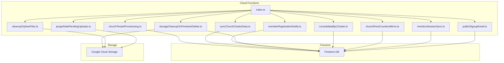

**Diagram sources**
- [functions/src/index.ts](file://functions/src/index.ts)
- [functions/src/churchTenantProvisioning.ts](file://functions/src/churchTenantProvisioning.ts)
- [functions/src/syncChurchClusterData.ts](file://functions/src/syncChurchClusterData.ts)
- [functions/src/memberRegistrationNotify.ts](file://functions/src/memberRegistrationNotify.ts)
- [functions/src/storageCleanupOnFirestoreDelete.ts](file://functions/src/storageCleanupOnFirestoreDelete.ts)
- [functions/src/cleanupOrphanFiles.ts](file://functions/src/cleanupOrphanFiles.ts)
- [functions/src/consolidateBpcCluster.ts](file://functions/src/consolidateBpcCluster.ts)
- [functions/src/churchRootCountersMirror.ts](file://functions/src/churchRootCountersMirror.ts)
- [functions/src/membroSessionSync.ts](file://functions/src/membroSessionSync.ts)
- [functions/src/publicSignupEmail.ts](file://functions/src/publicSignupEmail.ts)
- [functions/src/purgeStalePendingUploads.ts](file://functions/src/purgeStalePendingUploads.ts)

**Section sources**
- [functions/src/index.ts](file://functions/src/index.ts)
- [functions/package.json](file://functions/package.json)

## Core Components
- Trigger Registration: The entry point wires Firestore listeners and scheduled/background tasks to their respective handlers.
- Tenant Provisioning: Creates initial tenant structure and seeds required collections when a new church is created.
- Cluster Sync: Keeps derived or denormalized clusters consistent with source documents.
- Member Registration Notification: Emits notifications or updates external systems upon member signup.
- Storage Cleanup: Removes orphaned files when related Firestore documents are deleted.
- Counters Mirror: Maintains root-level counters for fast reads.
- Session Sync: Synchronizes session state across relevant collections.
- Public Signup Email: Sends emails triggered by public signups.
- Stale Upload Purge: Cleans up incomplete uploads after timeouts.

Key responsibilities and interactions are detailed in the following sections.

**Section sources**
- [functions/src/index.ts](file://functions/src/index.ts)
- [functions/src/churchTenantProvisioning.ts](file://functions/src/churchTenantProvisioning.ts)
- [functions/src/syncChurchClusterData.ts](file://functions/src/syncChurchClusterData.ts)
- [functions/src/memberRegistrationNotify.ts](file://functions/src/memberRegistrationNotify.ts)
- [functions/src/storageCleanupOnFirestoreDelete.ts](file://functions/src/storageCleanupOnFirestoreDelete.ts)
- [functions/src/cleanupOrphanFiles.ts](file://functions/src/cleanupOrphanFiles.ts)
- [functions/src/churchRootCountersMirror.ts](file://functions/src/churchRootCountersMirror.ts)
- [functions/src/membroSessionSync.ts](file://functions/src/membroSessionSync.ts)
- [functions/src/publicSignupEmail.ts](file://functions/src/publicSignupEmail.ts)
- [functions/src/purgeStalePendingUploads.ts](file://functions/src/purgeStalePendingUploads.ts)

## Architecture Overview
The system uses Firestore triggers to react to document changes and maintain consistency across the application. Background tasks handle periodic maintenance and cleanup.

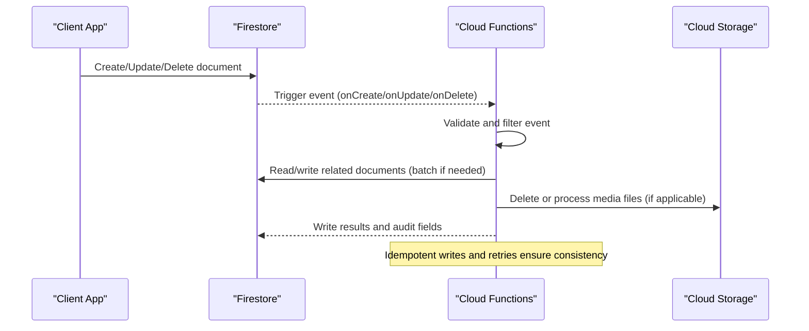

**Diagram sources**
- [functions/src/index.ts](file://functions/src/index.ts)
- [functions/src/storageCleanupOnFirestoreDelete.ts](file://functions/src/storageCleanupOnFirestoreDelete.ts)
- [functions/src/syncChurchClusterData.ts](file://functions/src/syncChurchClusterData.ts)

## Detailed Component Analysis

### Church Tenant Provisioning
Purpose:
- Initialize tenant-specific collections and default configurations when a new church is created.
- Seed essential data such as roles, settings, and indexes.

Trigger type:
- onCreate for the churches collection.

Event filtering:
- Validates tenant identifiers and ensures idempotency by checking existing seed markers.

Processing logic:
- Creates nested documents under tenant-scoped paths.
- Writes default values and flags to indicate provisioning completion.
- Uses batched writes to minimize round trips.

Conflict resolution:
- Skips creation if seed markers exist; otherwise applies conditional writes.

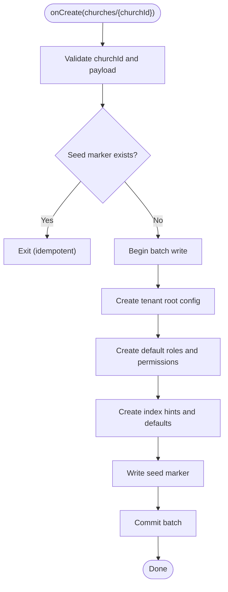

**Diagram sources**
- [functions/src/churchTenantProvisioning.ts](file://functions/src/churchTenantProvisioning.ts)

**Section sources**
- [functions/src/churchTenantProvisioning.ts](file://functions/src/churchTenantProvisioning.ts)

### Cluster Data Synchronization
Purpose:
- Keep derived clusters (denormalized views) consistent with source documents.
- Support efficient reads by maintaining precomputed aggregates.

Trigger type:
- onUpdate for source documents that affect cluster data.

Event filtering:
- Compares previous and current snapshots to detect meaningful changes.

Processing logic:
- Reads affected fields and recomputes cluster entries.
- Applies batched writes to update multiple cluster nodes atomically.

Conflict resolution:
- Uses version stamps or timestamps to avoid overwriting newer data.

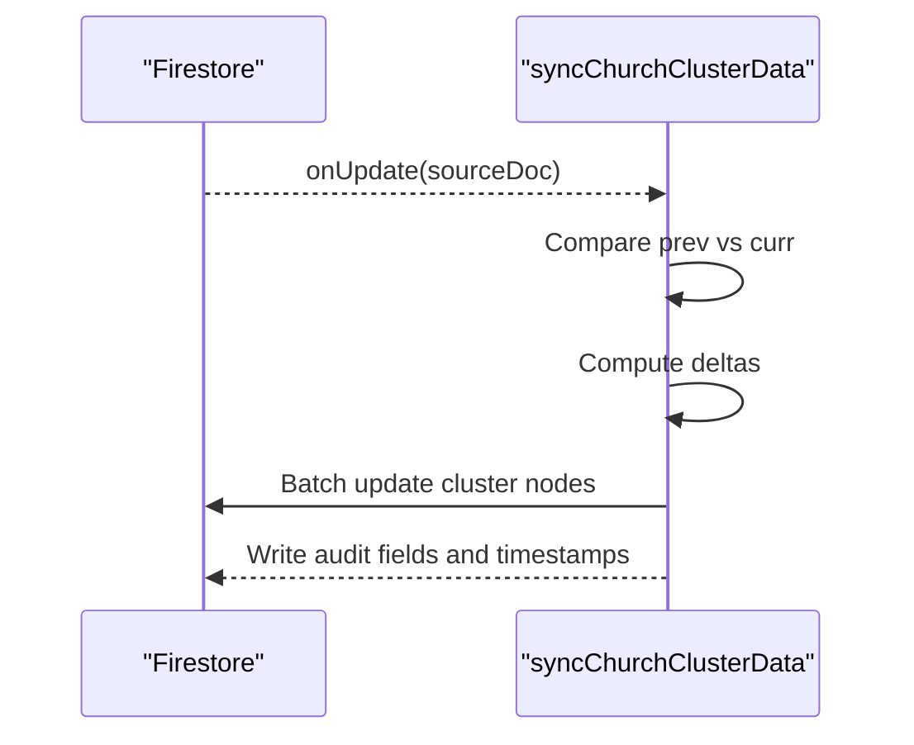

**Diagram sources**
- [functions/src/syncChurchClusterData.ts](file://functions/src/syncChurchClusterData.ts)

**Section sources**
- [functions/src/syncChurchClusterData.ts](file://functions/src/syncChurchClusterData.ts)

### Member Registration Notifications
Purpose:
- Notify stakeholders or external systems when a new member registers.
- Update directories and caches accordingly.

Trigger type:
- onCreate for members collection.

Event filtering:
- Ensures valid member payload and filters test accounts.

Processing logic:
- Enriches notification payload with church context.
- Updates member directory cache and sends notifications.

Idempotency:
- Checks for duplicate registrations using unique identifiers.

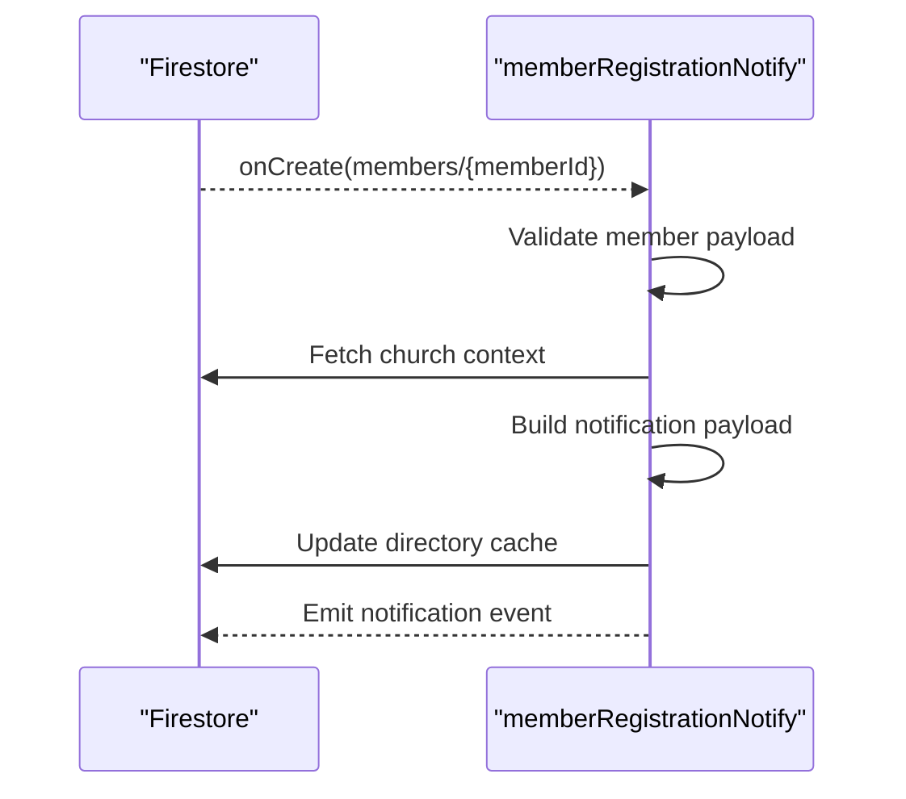

**Diagram sources**
- [functions/src/memberRegistrationNotify.ts](file://functions/src/memberRegistrationNotify.ts)

**Section sources**
- [functions/src/memberRegistrationNotify.ts](file://functions/src/memberRegistrationNotify.ts)

### Storage Cleanup on Firestore Delete
Purpose:
- Remove associated media files from Cloud Storage when related Firestore documents are deleted.

Trigger type:
- onDelete for documents that reference storage paths.

Event filtering:
- Extracts storage paths from deleted document metadata.

Processing logic:
- Iterates over referenced files and deletes them from storage.
- Logs cleanup actions and handles errors gracefully.

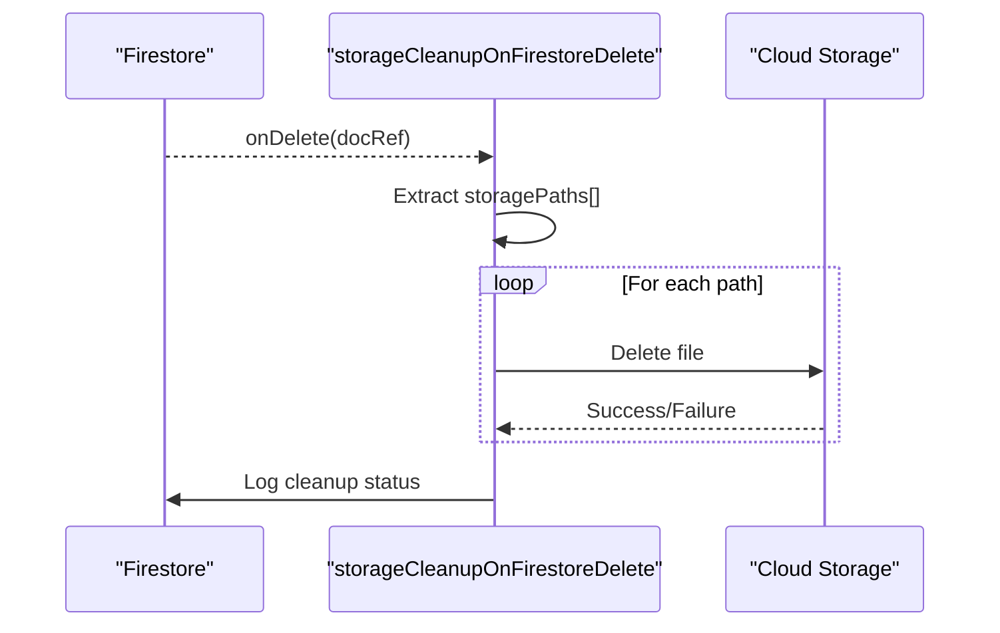

**Diagram sources**
- [functions/src/storageCleanupOnFirestoreDelete.ts](file://functions/src/storageCleanupOnFirestoreDelete.ts)

**Section sources**
- [functions/src/storageCleanupOnFirestoreDelete.ts](file://functions/src/storageCleanupOnFirestoreDelete.ts)

### Orphan File Cleanup
Purpose:
- Periodically scan storage for orphaned files not referenced by any Firestore document.

Trigger type:
- Scheduled task running at intervals.

Processing logic:
- Lists storage objects and cross-references with Firestore indices.
- Deletes unreferenced files and reports counts.

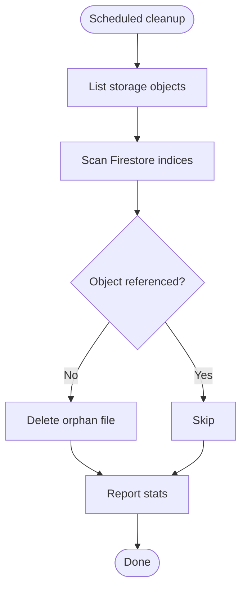

**Diagram sources**
- [functions/src/cleanupOrphanFiles.ts](file://functions/src/cleanupOrphanFiles.ts)

**Section sources**
- [functions/src/cleanupOrphanFiles.ts](file://functions/src/cleanupOrphanFiles.ts)

### BPC Cluster Consolidation
Purpose:
- Consolidate legacy BPC cluster data into canonical structures.

Trigger type:
- onUpdate for BPC-related documents.

Processing logic:
- Migrates fields and normalizes nested structures.
- Writes consolidated results and marks migration status.

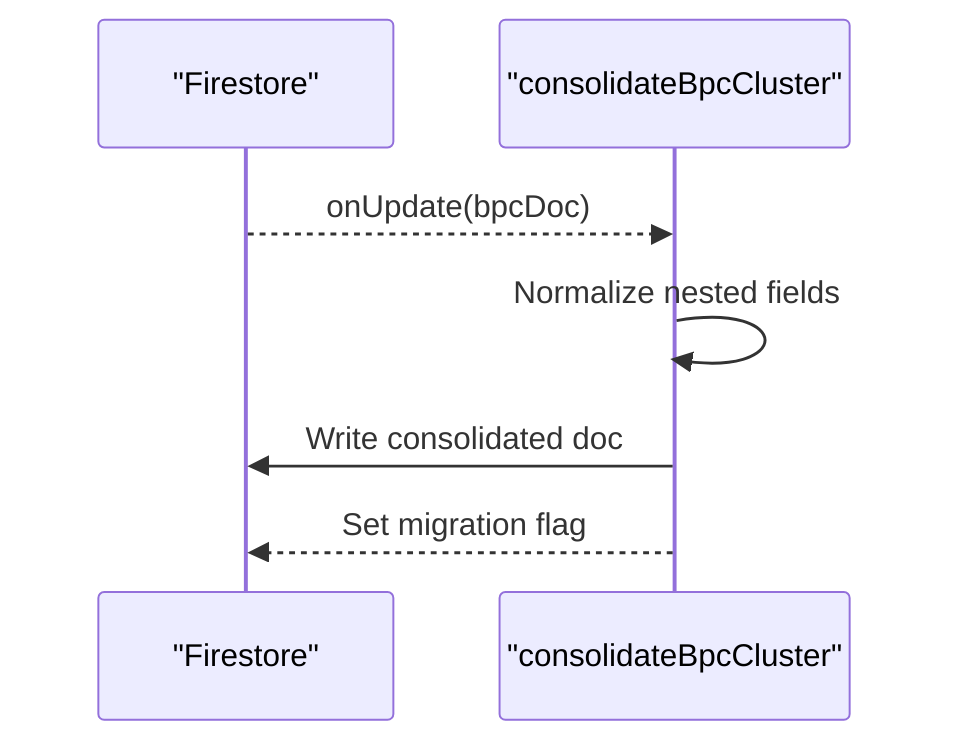

**Diagram sources**
- [functions/src/consolidateBpcCluster.ts](file://functions/src/consolidateBpcCluster.ts)

**Section sources**
- [functions/src/consolidateBpcCluster.ts](file://functions/src/consolidateBpcCluster.ts)

### Root Counters Mirror
Purpose:
- Maintain root-level counters for fast reads and dashboards.

Trigger type:
- onCreate/onUpdate/onDelete for documents affecting counters.

Processing logic:
- Increments/decrements counters based on operation type.
- Uses atomic transactions to prevent race conditions.

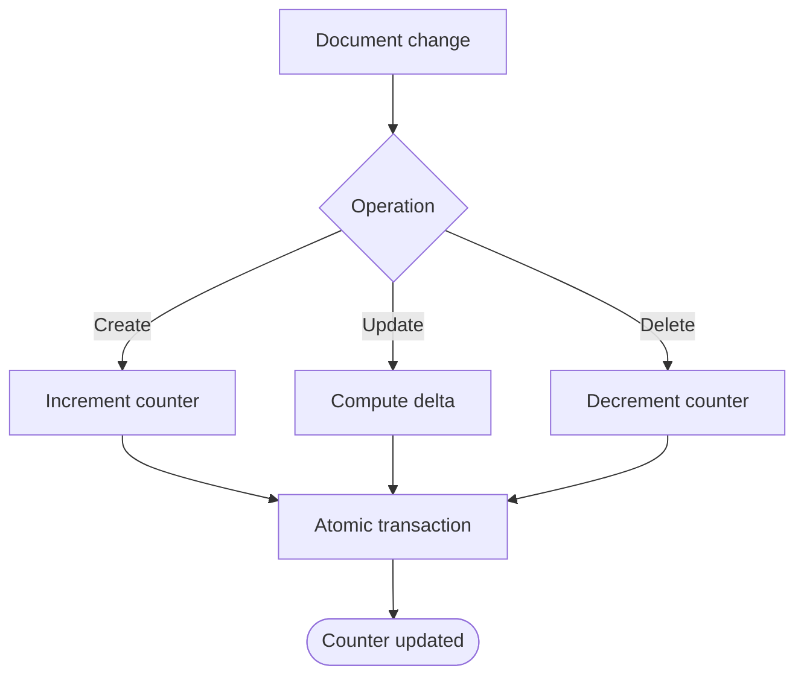

**Diagram sources**
- [functions/src/churchRootCountersMirror.ts](file://functions/src/churchRootCountersMirror.ts)

**Section sources**
- [functions/src/churchRootCountersMirror.ts](file://functions/src/churchRootCountersMirror.ts)

### Member Session Sync
Purpose:
- Synchronize session state across relevant collections for active users.

Trigger type:
- onUpdate for session documents.

Processing logic:
- Propagates session updates to related user profiles and activity logs.
- Ensures consistency via batched writes.

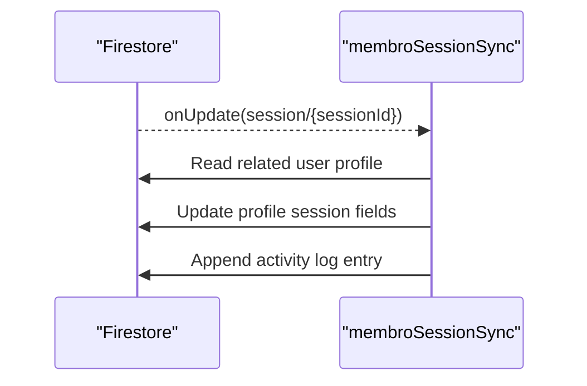

**Diagram sources**
- [functions/src/membroSessionSync.ts](file://functions/src/membroSessionSync.ts)

**Section sources**
- [functions/src/membroSessionSync.ts](file://functions/src/membroSessionSync.ts)

### Public Signup Email
Purpose:
- Send confirmation or welcome emails upon public signups.

Trigger type:
- onCreate for public signup documents.

Processing logic:
- Validates email and tenant context.
- Invokes email service and records delivery status.

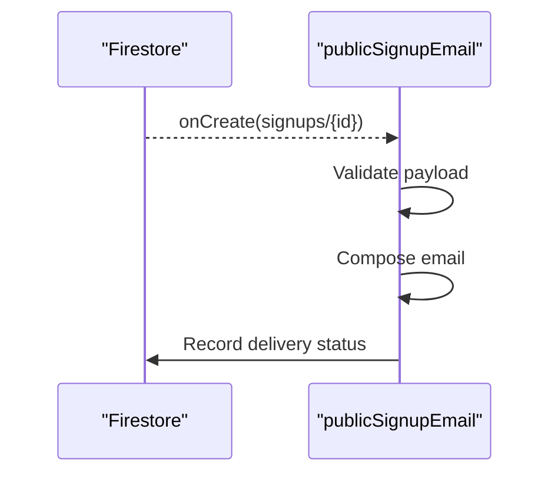

**Diagram sources**
- [functions/src/publicSignupEmail.ts](file://functions/src/publicSignupEmail.ts)

**Section sources**
- [functions/src/publicSignupEmail.ts](file://functions/src/publicSignupEmail.ts)

### Stale Pending Uploads Purge
Purpose:
- Clean up incomplete uploads that exceed timeout thresholds.

Trigger type:
- Scheduled task running periodically.

Processing logic:
- Queries pending uploads older than threshold.
- Deletes associated storage objects and removes Firestore entries.

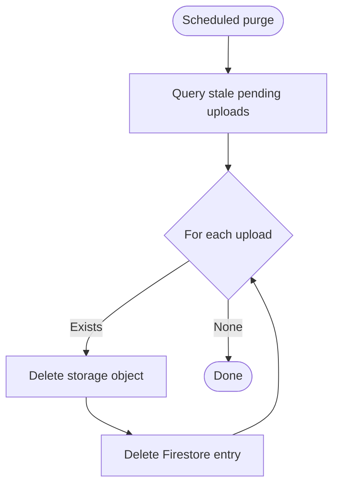

**Diagram sources**
- [functions/src/purgeStalePendingUploads.ts](file://functions/src/purgeStalePendingUploads.ts)

**Section sources**
- [functions/src/purgeStalePendingUploads.ts](file://functions/src/purgeStalePendingUploads.ts)

## Dependency Analysis
Triggers depend on Firestore for event sourcing and may interact with Cloud Storage for media operations. Background tasks rely on scheduled execution and may query indices for efficient scans.

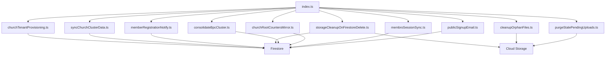

**Diagram sources**
- [functions/src/index.ts](file://functions/src/index.ts)
- [functions/src/churchTenantProvisioning.ts](file://functions/src/churchTenantProvisioning.ts)
- [functions/src/syncChurchClusterData.ts](file://functions/src/syncChurchClusterData.ts)
- [functions/src/memberRegistrationNotify.ts](file://functions/src/memberRegistrationNotify.ts)
- [functions/src/storageCleanupOnFirestoreDelete.ts](file://functions/src/storageCleanupOnFirestoreDelete.ts)
- [functions/src/cleanupOrphanFiles.ts](file://functions/src/cleanupOrphanFiles.ts)
- [functions/src/consolidateBpcCluster.ts](file://functions/src/consolidateBpcCluster.ts)
- [functions/src/churchRootCountersMirror.ts](file://functions/src/churchRootCountersMirror.ts)
- [functions/src/membroSessionSync.ts](file://functions/src/membroSessionSync.ts)
- [functions/src/publicSignupEmail.ts](file://functions/src/publicSignupEmail.ts)
- [functions/src/purgeStalePendingUploads.ts](file://functions/src/purgeStalePendingUploads.ts)

**Section sources**
- [functions/src/index.ts](file://functions/src/index.ts)
- [functions/package.json](file://functions/package.json)

## Performance Considerations
- Use batched writes to reduce round trips and ensure atomicity.
- Filter events early to avoid unnecessary processing.
- Prefer reading minimal fields and leveraging indexes for queries.
- Implement idempotency checks to prevent duplicate work.
- Use transactions for counters and critical updates to avoid race conditions.
- Schedule heavy tasks during off-peak hours and paginate large scans.
- Cache frequently accessed data where appropriate and invalidate on updates.

[No sources needed since this section provides general guidance]

## Troubleshooting Guide
- Inspect function logs for trigger invocations and error traces.
- Verify Firestore rules allow necessary reads/writes during trigger execution.
- Check event payloads for missing or malformed fields.
- Use conditional writes and version stamps to resolve conflicts.
- Monitor storage deletion outcomes and handle partial failures.
- Add audit fields to track last processed timestamps and statuses.
- Test idempotency by replaying events and verifying stable outputs.

**Section sources**
- [firestore.rules](file://firestore.rules)

## Conclusion
The Firestore triggers and event handlers provide robust real-time synchronization, tenant provisioning, cluster consistency, notifications, and storage lifecycle management. By applying event filtering, batch operations, idempotency, and careful performance tuning, the system maintains data integrity and scalability while minimizing costs and latency.

[No sources needed since this section summarizes without analyzing specific files]