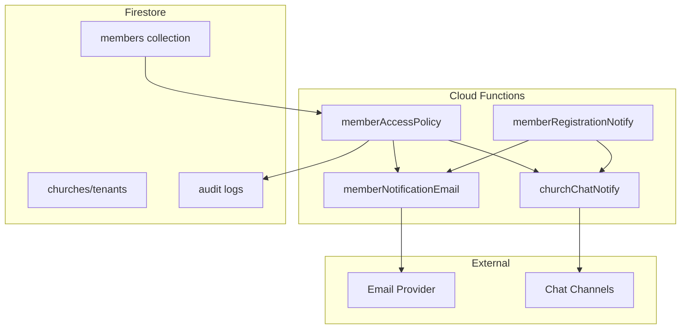
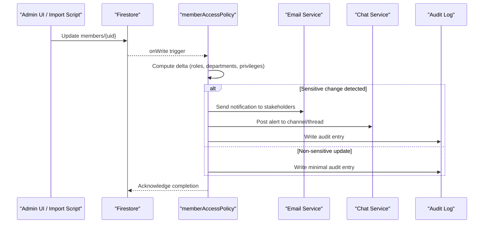
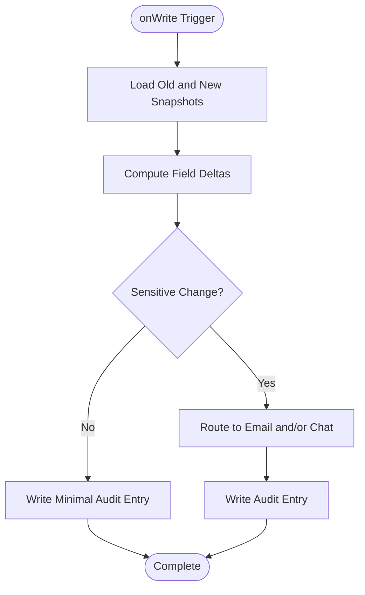
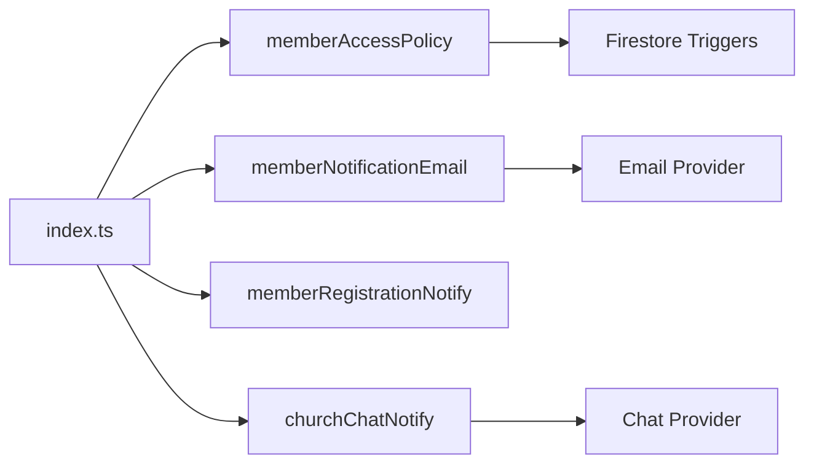

# Access Policy Notifications

<cite>
**Referenced Files in This Document**
- [memberAccessPolicy.js](file://functions/lib/memberAccessPolicy.js)
- [memberAccessPolicy.ts](file://functions/src/memberAccessPolicy.ts)
- [memberNotificationEmail.js](file://functions/lib/memberNotificationEmail.js)
- [memberNotificationEmail.ts](file://functions/src/memberNotificationEmail.ts)
- [memberRegistrationNotify.js](file://functions/lib/memberRegistrationNotify.js)
- [memberRegistrationNotify.ts](file://functions/src/memberRegistrationNotify.ts)
- [churchChatNotify.js](file://functions/lib/churchChatNotify.js)
- [churchChatNotify.ts](file://functions/src/churchChatNotify.ts)
- [firestore.rules](file://firestore.rules)
- [storage.rules](file://storage.rules)
- [index.js](file://functions/index.js)
- [index.ts](file://functions/src/index.ts)
- [AUDITORIA_PUBLICACAO_AVISOS_EVENTOS_CHAT.md](file://docs/AUDITORIA_PUBLICACAO_AVISOS_EVENTOS_CHAT.md)
- [FIREBASE_PADRAO_CONTROLE_TOTAL.md](file://docs/FIREBASE_PADRAO_CONTROLE_TOTAL.md)
</cite>

## Table of Contents
1. [Introduction](#introduction)
2. [Project Structure](#project-structure)
3. [Core Components](#core-components)
4. [Architecture Overview](#architecture-overview)
5. [Detailed Component Analysis](#detailed-component-analysis)
6. [Dependency Analysis](#dependency-analysis)
7. [Performance Considerations](#performance-considerations)
8. [Troubleshooting Guide](#troubleshooting-guide)
9. [Conclusion](#conclusion)
10. [Appendices](#appendices)

## Introduction
This document explains how the system monitors and notifies access policy changes, including role changes, department transfers, and privilege modifications. It covers notification routing based on user roles, hierarchical church structure, and administrative responsibilities. It also provides guidance for bulk permission updates, audit trail generation, compliance reporting, security considerations for sensitive access changes, escalation policies, and integration with external authentication systems.

## Project Structure
The access policy notifications are implemented primarily as Cloud Functions that react to Firestore events and send notifications via email or chat channels. The key files include:
- Access policy handler functions for member permissions
- Notification dispatchers for email and chat
- Registration and welcome notifications
- Firestore and Storage rules enforcing access control
- Documentation describing audit and notification standards

**Diagram sources**
- [memberAccessPolicy.js](file://functions/lib/memberAccessPolicy.js)
- [memberNotificationEmail.js](file://functions/lib/memberNotificationEmail.js)
- [memberRegistrationNotify.js](file://functions/lib/memberRegistrationNotify.js)
- [churchChatNotify.js](file://functions/lib/churchChatNotify.js)
- [firestore.rules](file://firestore.rules)
- [storage.rules](file://storage.rules)

**Section sources**
- [memberAccessPolicy.js](file://functions/lib/memberAccessPolicy.js)
- [memberNotificationEmail.js](file://functions/lib/memberNotificationEmail.js)
- [memberRegistrationNotify.js](file://functions/lib/memberRegistrationNotify.js)
- [churchChatNotify.js](file://functions/lib/churchChatNotify.js)
- [firestore.rules](file://firestore.rules)
- [storage.rules](file://storage.rules)

## Core Components
- Access Policy Handler: Observes changes to member records and detects role, department, and privilege modifications. It computes deltas between old and new states and triggers downstream notifications and audit entries.
- Email Notification Dispatcher: Formats and sends emails to relevant stakeholders (e.g., admins, department leaders, affected users).
- Chat Notification Dispatcher: Posts messages to designated chat channels or threads based on church hierarchy and admin responsibilities.
- Registration Notification: Notifies when a new member registers or is onboarded, ensuring initial access alignment.
- Rules Engine: Firestore and Storage rules enforce read/write permissions and gate sensitive operations.

Key responsibilities:
- Detecting sensitive changes (role elevation, cross-department transfer, privilege expansion)
- Routing notifications to appropriate recipients based on church hierarchy and roles
- Generating audit trails for compliance and reporting
- Enforcing least-privilege access through rules

**Section sources**
- [memberAccessPolicy.js](file://functions/lib/memberAccessPolicy.js)
- [memberNotificationEmail.js](file://functions/lib/memberNotificationEmail.js)
- [memberRegistrationNotify.js](file://functions/lib/memberRegistrationNotify.js)
- [churchChatNotify.js](file://functions/lib/churchChatNotify.js)
- [firestore.rules](file://firestore.rules)
- [storage.rules](file://storage.rules)

## Architecture Overview
The system uses event-driven architecture with Firestore triggers. When a member record changes, the access policy function evaluates the delta and decides whether to notify via email or chat. Audit entries are written to an audit log collection. Rules ensure only authorized entities can modify sensitive fields.

**Diagram sources**
- [memberAccessPolicy.js](file://functions/lib/memberAccessPolicy.js)
- [memberNotificationEmail.js](file://functions/lib/memberNotificationEmail.js)
- [churchChatNotify.js](file://functions/lib/churchChatNotify.js)
- [firestore.rules](file://firestore.rules)

## Detailed Component Analysis

### Access Policy Handler
Responsibilities:
- Monitor member document writes
- Compare old vs new values for roles, departments, and privileges
- Determine sensitivity level (e.g., role elevation, cross-department move)
- Trigger email/chat notifications accordingly
- Append audit trail entries

Operational flow:
- Read previous snapshot and current snapshot
- Identify changed fields
- Evaluate policy rules (thresholds, required approvals)
- Dispatch notifications to relevant recipients
- Record audit events

**Diagram sources**
- [memberAccessPolicy.js](file://functions/lib/memberAccessPolicy.js)
- [memberAccessPolicy.ts](file://functions/src/memberAccessPolicy.ts)

**Section sources**
- [memberAccessPolicy.js](file://functions/lib/memberAccessPolicy.js)
- [memberAccessPolicy.ts](file://functions/src/memberAccessPolicy.ts)

### Email Notification Dispatcher
Responsibilities:
- Format notification content (who changed, what changed, impact)
- Resolve recipient lists based on church hierarchy and roles
- Send emails asynchronously with retries and error handling
- Include links to audit details and approval workflows if applicable

Routing logic:
- Admins of the same church
- Department leaders for department transfers
- Affected user for self-updates
- Compliance officers for high-sensitivity changes

**Section sources**
- [memberNotificationEmail.js](file://functions/lib/memberNotificationEmail.js)
- [memberNotificationEmail.ts](file://functions/src/memberNotificationEmail.ts)

### Chat Notification Dispatcher
Responsibilities:
- Post alerts to designated chat channels or threads
- Tag relevant administrators and department heads
- Provide quick actions (approve, escalate, view audit)

Escalation:
- If no acknowledgment within a threshold, escalate to higher-level admins
- Maintain thread context for traceability

**Section sources**
- [churchChatNotify.js](file://functions/lib/churchChatNotify.js)
- [churchChatNotify.ts](file://functions/src/churchChatNotify.ts)

### Registration Notification
Responsibilities:
- Notify onboarding team when a new member registers
- Ensure initial role assignment aligns with policy
- Seed necessary permissions and resources

Workflow:
- Trigger on member creation
- Validate initial attributes
- Send welcome and setup instructions
- Create audit entry for registration

**Section sources**
- [memberRegistrationNotify.js](file://functions/lib/memberRegistrationNotify.js)
- [memberRegistrationNotify.ts](file://functions/src/memberRegistrationNotify.ts)

### Rules Engine (Firestore and Storage)
Responsibilities:
- Enforce read/write permissions at document and storage levels
- Gate sensitive field mutations (roles, privileges)
- Require admin or elevated privileges for policy-critical updates

Security considerations:
- Least privilege by default
- Explicit allow-lists for privileged operations
- Immutable audit logs

**Section sources**
- [firestore.rules](file://firestore.rules)
- [storage.rules](file://storage.rules)

## Dependency Analysis
Functions depend on Firestore triggers and external services for notifications. The index file wires up all functions and exports them for deployment.

**Diagram sources**
- [index.ts](file://functions/src/index.ts)
- [index.js](file://functions/index.js)

**Section sources**
- [index.ts](file://functions/src/index.ts)
- [index.js](file://functions/index.js)

## Performance Considerations
- Batch processing: For bulk permission updates, process changes in batches to reduce function invocations and API calls.
- Caching: Cache church hierarchy and role mappings to minimize lookups during delta evaluation.
- Idempotency: Ensure notifications and audit entries are idempotent to avoid duplicates on retries.
- Throttling: Rate-limit outbound notifications to prevent provider throttling.
- Selective reads: Only read necessary fields from snapshots to reduce payload size.

[No sources needed since this section provides general guidance]

## Troubleshooting Guide
Common issues and resolutions:
- Missing notifications: Verify trigger bindings and Firestore paths; check function logs for errors.
- Incorrect recipients: Validate role-to-recipient mapping and church hierarchy resolution.
- Duplicate audit entries: Implement idempotency keys and deduplication checks.
- Permission denied: Review Firestore and Storage rules; ensure caller has sufficient privileges.
- Escalation not triggered: Confirm thresholds and acknowledgment timeouts are configured correctly.

**Section sources**
- [AUDITORIA_PUBLICACAO_AVISOS_EVENTOS_CHAT.md](file://docs/AUDITORIA_PUBLICACAO_AVISOS_EVENTOS_CHAT.md)
- [FIREBASE_PADRAO_CONTROLE_TOTAL.md](file://docs/FIREBASE_PADRAO_CONTROLE_TOTAL.md)

## Conclusion
The access policy notification system provides robust monitoring and alerting for role changes, department transfers, and privilege modifications. By leveraging Firestore triggers, structured notification dispatchers, and strict rules enforcement, it ensures timely communication, comprehensive auditing, and compliance. Proper configuration of escalation policies, secure integrations, and performance optimizations will further strengthen the system’s reliability and security posture.

[No sources needed since this section summarizes without analyzing specific files]

## Appendices

### Bulk Permission Updates
- Use batched Firestore transactions to apply multiple member updates atomically.
- Emit a single aggregated audit entry per batch to reduce noise.
- Notify stakeholders once per batch with summary details and drill-down links.

### Audit Trail Generation
- Capture timestamp, actor, target member, changed fields, old/new values, and church context.
- Store in an immutable audit collection with restricted write permissions.
- Expose queryable endpoints for compliance reports.

### Compliance Reporting
- Aggregate audit entries by time range, church, and change type.
- Generate summaries highlighting sensitive changes and escalations.
- Export reports in standard formats for regulatory review.

### Security Considerations
- Enforce least privilege via Firestore and Storage rules.
- Validate all inputs and sanitize outputs.
- Encrypt sensitive data at rest and in transit.
- Rotate credentials and secrets regularly.

### Notification Escalation Policies
- Define escalation tiers based on sensitivity and response time.
- Auto-escalate to higher-level admins if no action is taken.
- Maintain full audit trail of escalations and acknowledgments.

### Integration with External Authentication Systems
- Sync user attributes from external providers into member records securely.
- Map external roles to internal roles using a controlled mapping table.
- Reconcile discrepancies periodically and flag anomalies.

[No sources needed since this section provides general guidance]