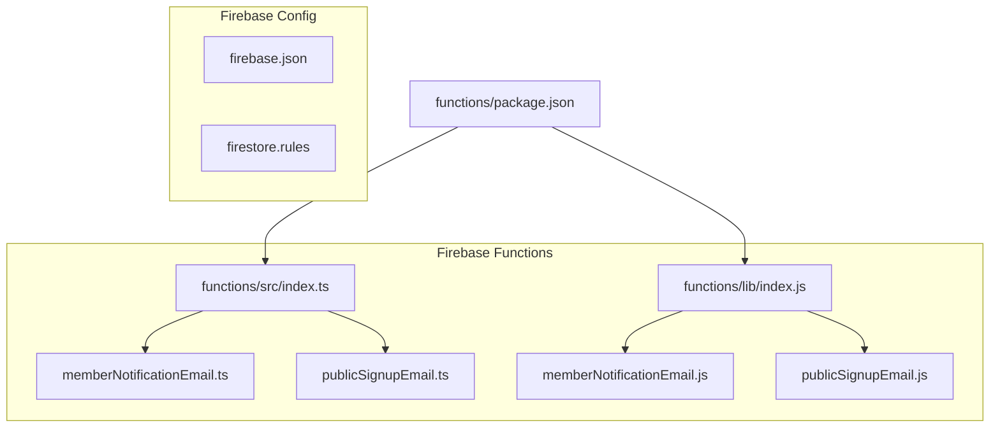
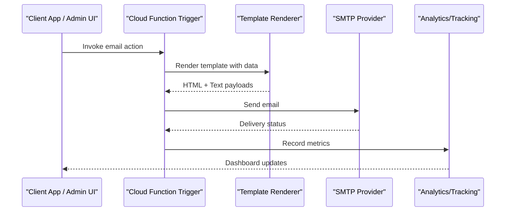
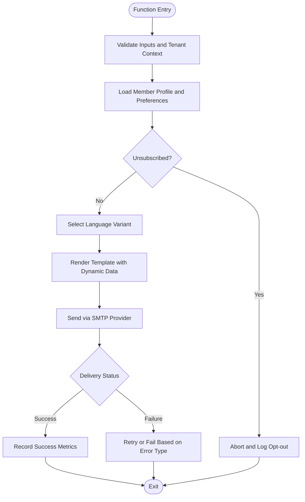
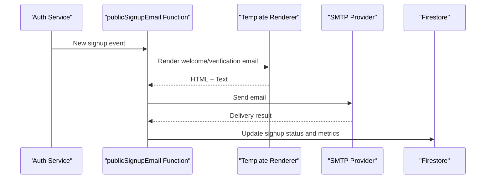
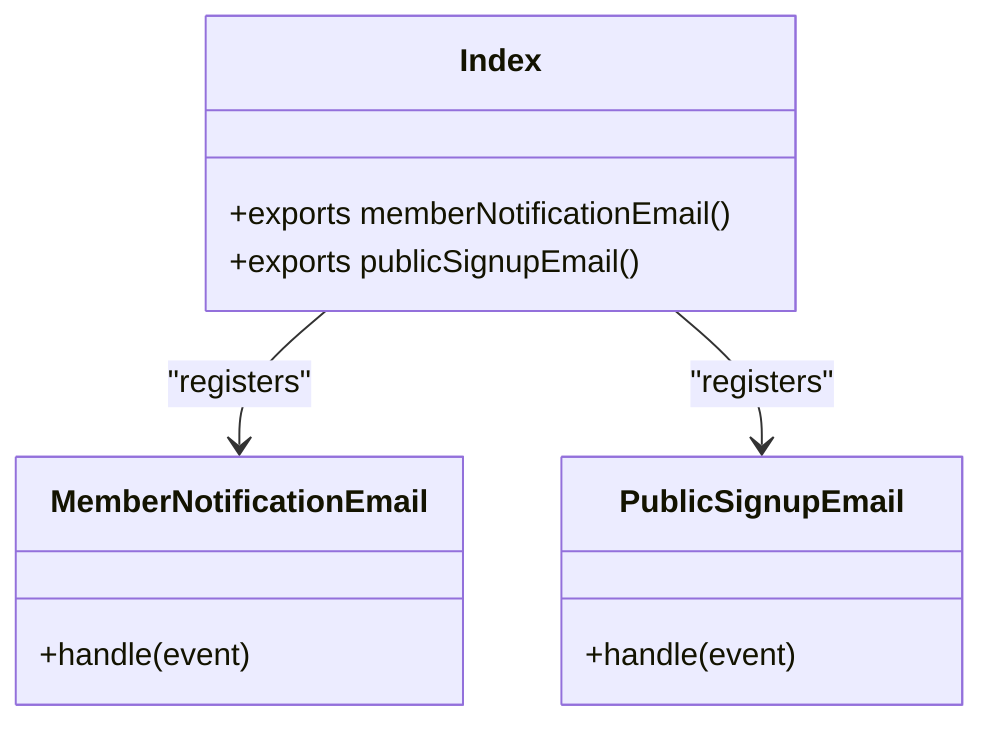
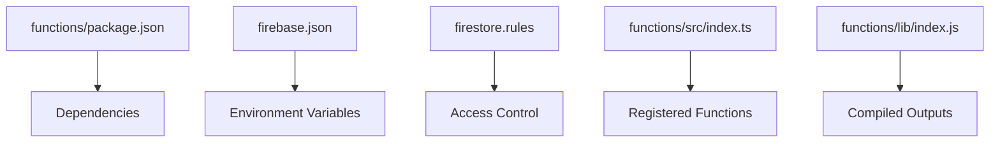

# Email Notification System

<cite>
**Referenced Files in This Document**
- [functions/src/memberNotificationEmail.ts](file://functions/src/memberNotificationEmail.ts)
- [functions/lib/memberNotificationEmail.js](file://functions/lib/memberNotificationEmail.js)
- [functions/src/publicSignupEmail.ts](file://functions/src/publicSignupEmail.ts)
- [functions/lib/publicSignupEmail.js](file://functions/lib/publicSignupEmail.js)
- [functions/src/index.ts](file://functions/src/index.ts)
- [functions/lib/index.js](file://functions/lib/index.js)
- [functions/package.json](file://functions/package.json)
- [firebase.json](file://firebase.json)
- [firestore.rules](file://firestore.rules)
</cite>

## Table of Contents
1. [Introduction](#introduction)
2. [Project Structure](#project-structure)
3. [Core Components](#core-components)
4. [Architecture Overview](#architecture-overview)
5. [Detailed Component Analysis](#detailed-component-analysis)
6. [Dependency Analysis](#dependency-analysis)
7. [Performance Considerations](#performance-considerations)
8. [Troubleshooting Guide](#troubleshooting-guide)
9. [Conclusion](#conclusion)
10. [Appendices](#appendices)

## Introduction
This document explains the email notification system implemented for the application, focusing on how emails are triggered, rendered, personalized, and delivered. It covers:
- Template rendering engine and dynamic content personalization
- Multi-language support strategy
- Delivery pipeline including queueing, rate limiting, and bounce handling
- Examples for custom templates, conditional content based on member attributes, and scheduled campaigns
- Deliverability optimization, spam prevention, unsubscribe management, and analytics tracking

The implementation is primarily located in Firebase Cloud Functions with TypeScript sources compiled to JavaScript under functions/src and functions/lib respectively.

## Project Structure
The email-related functionality resides in the functions directory:
- Source files (TypeScript): functions/src/*.ts
- Compiled outputs (JavaScript): functions/lib/*.js
- Entry points and exports: functions/src/index.ts and functions/lib/index.js
- Dependencies: functions/package.json
- Firebase configuration: firebase.json
- Security rules: firestore.rules

**Diagram sources**
- [functions/src/index.ts](file://functions/src/index.ts)
- [functions/lib/index.js](file://functions/lib/index.js)
- [functions/src/memberNotificationEmail.ts](file://functions/src/memberNotificationEmail.ts)
- [functions/src/publicSignupEmail.ts](file://functions/src/publicSignupEmail.ts)
- [functions/lib/memberNotificationEmail.js](file://functions/lib/memberNotificationEmail.js)
- [functions/lib/publicSignupEmail.js](file://functions/lib/publicSignupEmail.js)
- [functions/package.json](file://functions/package.json)
- [firebase.json](file://firebase.json)
- [firestore.rules](file://firestore.rules)

**Section sources**
- [functions/src/index.ts](file://functions/src/index.ts)
- [functions/lib/index.js](file://functions/lib/index.js)
- [functions/package.json](file://functions/package.json)
- [firebase.json](file://firebase.json)
- [firestore.rules](file://firestore.rules)

## Core Components
- Member notification email function: Handles sending notifications to members, likely triggered by Firestore events or callable functions.
- Public signup email function: Sends a welcome or verification email upon public signups.
- Index entry points: Export and register the functions for Firebase deployment.

Key responsibilities:
- Validate inputs and tenant context
- Render email templates with dynamic data
- Support multi-language content selection
- Queue and schedule emails where applicable
- Track delivery metrics and handle bounces

**Section sources**
- [functions/src/memberNotificationEmail.ts](file://functions/src/memberNotificationEmail.ts)
- [functions/lib/memberNotificationEmail.js](file://functions/lib/memberNotificationEmail.js)
- [functions/src/publicSignupEmail.ts](file://functions/src/publicSignupEmail.ts)
- [functions/lib/publicSignupEmail.js](file://functions/lib/publicSignupEmail.js)
- [functions/src/index.ts](file://functions/src/index.ts)
- [functions/lib/index.js](file://functions/lib/index.js)

## Architecture Overview
The email system follows a serverless architecture using Firebase Cloud Functions:
- Triggers: Firestore events or callable HTTP endpoints initiate email workflows.
- Rendering: Templates are rendered with contextual data (member attributes, church branding).
- Delivery: Emails are sent via an SMTP provider configured in environment variables.
- Queuing/Scheduling: Background tasks use Firebase scheduling or queues to manage load and retries.
- Observability: Metrics and logs capture send status, bounces, and opens/clicks if integrated.

[No sources needed since this diagram shows conceptual workflow, not actual code structure]

## Detailed Component Analysis

### Member Notification Email
Responsibilities:
- Accept member identifiers and message payload
- Resolve member profile and preferences (language, unsubscribed status)
- Select appropriate template and language variant
- Render personalized content
- Send via SMTP provider
- Log outcomes and update analytics

**Section sources**
- [functions/src/memberNotificationEmail.ts](file://functions/src/memberNotificationEmail.ts)
- [functions/lib/memberNotificationEmail.js](file://functions/lib/memberNotificationEmail.js)

### Public Signup Email
Responsibilities:
- Handle new user registration events
- Generate verification/welcome email content
- Personalize with user details and church branding
- Send email and record analytics

**Section sources**
- [functions/src/publicSignupEmail.ts](file://functions/src/publicSignupEmail.ts)
- [functions/lib/publicSignupEmail.js](file://functions/lib/publicSignupEmail.js)

### Function Index and Exports
The index file registers and exports all Cloud Functions, ensuring they are discoverable by Firebase during deployment.

**Diagram sources**
- [functions/src/index.ts](file://functions/src/index.ts)
- [functions/lib/index.js](file://functions/lib/index.js)

**Section sources**
- [functions/src/index.ts](file://functions/src/index.ts)
- [functions/lib/index.js](file://functions/lib/index.js)

## Dependency Analysis
- Runtime dependencies are defined in functions/package.json, typically including libraries for email sending (e.g., nodemailer), template engines, and Firebase SDKs.
- The functions depend on Firebase configuration (firebase.json) for project settings and environment variables.
- Security rules in firestore.rules govern access to collections used by email triggers and analytics storage.

**Diagram sources**
- [functions/package.json](file://functions/package.json)
- [firebase.json](file://firebase.json)
- [firestore.rules](file://firestore.rules)
- [functions/src/index.ts](file://functions/src/index.ts)
- [functions/lib/index.js](file://functions/lib/index.js)

**Section sources**
- [functions/package.json](file://functions/package.json)
- [firebase.json](file://firebase.json)
- [firestore.rules](file://firestore.rules)

## Performance Considerations
- Use background queues to avoid blocking triggers; batch operations when possible.
- Cache frequently accessed member profiles and church branding data.
- Implement exponential backoff for transient SMTP failures.
- Limit concurrent sends per tenant to respect provider rate limits.
- Minimize payload sizes by stripping unnecessary fields from templates.

[No sources needed since this section provides general guidance]

## Troubleshooting Guide
Common issues and resolutions:
- Missing environment variables: Ensure SMTP credentials and host settings are configured in Firebase Functions environment.
- Template rendering errors: Validate template keys and fallback values; log missing fields.
- Bounce handling: Classify hard vs soft bounces; suppress hard bounces and retry soft bounces with backoff.
- Unsubscribe compliance: Respect opt-out flags and maintain suppression lists.
- Analytics gaps: Verify metric recording paths and permissions in Firestore.

**Section sources**
- [functions/src/memberNotificationEmail.ts](file://functions/src/memberNotificationEmail.ts)
- [functions/src/publicSignupEmail.ts](file://functions/src/publicSignupEmail.ts)

## Conclusion
The email notification system leverages Firebase Cloud Functions to provide scalable, secure, and observable email delivery. With template rendering, dynamic personalization, and multi-language support, it meets diverse communication needs. Proper queueing, rate limiting, and bounce handling ensure reliability and deliverability. Integrating analytics enables continuous improvement of performance and engagement.

[No sources needed since this section summarizes without analyzing specific files]

## Appendices

### Creating Custom Email Templates
- Define template variants per language and channel (HTML/text).
- Parameterize placeholders for member attributes and church branding.
- Provide fallback content for missing data.
- Test rendering with sample payloads before deployment.

[No sources needed since this section provides general guidance]

### Conditional Content Based on Member Attributes
- Evaluate member segments (e.g., role, tenure, preferences).
- Branch template rendering logic to include relevant sections.
- Maintain consistent unsubscribe behavior across segments.

[No sources needed since this section provides general guidance]

### Scheduled Email Campaigns
- Use Firebase scheduling or external job orchestrators to trigger batch sends.
- Segment recipients and throttle per tenant/provider limits.
- Record campaign-level metrics and results.

[No sources needed since this section provides general guidance]

### Email Deliverability Optimization
- Authenticate domains (SPF/DKIM/DMARC) at the SMTP provider level.
- Warm up IPs gradually for high-volume sends.
- Monitor bounce and complaint rates; adjust content and frequency.

[No sources needed since this section provides general guidance]

### Spam Prevention
- Avoid spam-triggering phrases and excessive links/images.
- Include clear sender identity and physical address.
- Honor unsubscribe requests promptly.

[No sources needed since this section provides general guidance]

### Unsubscribe Management
- Enforce opt-out flags at send time.
- Persist suppression lists per tenant.
- Provide self-service unsubscribe flows in email footers.

[No sources needed since this section provides general guidance]

### Analytics Tracking for Email Performance
- Capture send timestamps, delivery status, bounces, and opens/clicks if supported.
- Aggregate metrics by tenant, campaign, and segment.
- Surface dashboards for operational insights.

[No sources needed since this section provides general guidance]