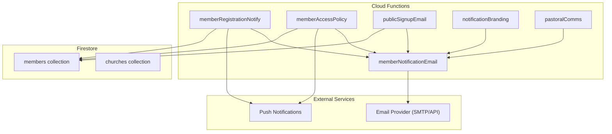
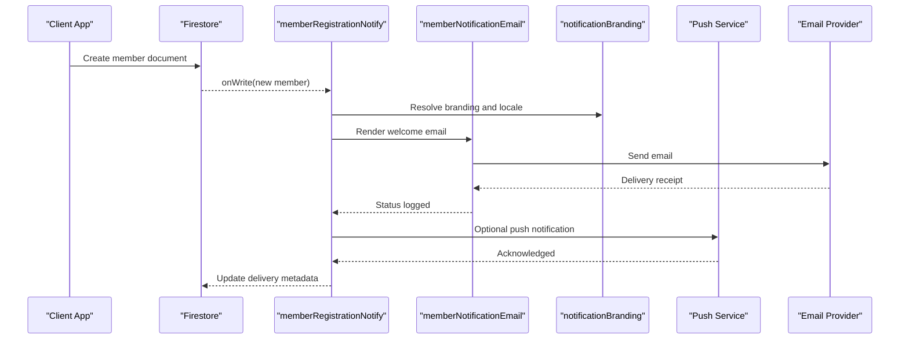
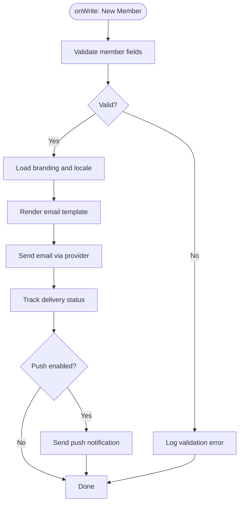
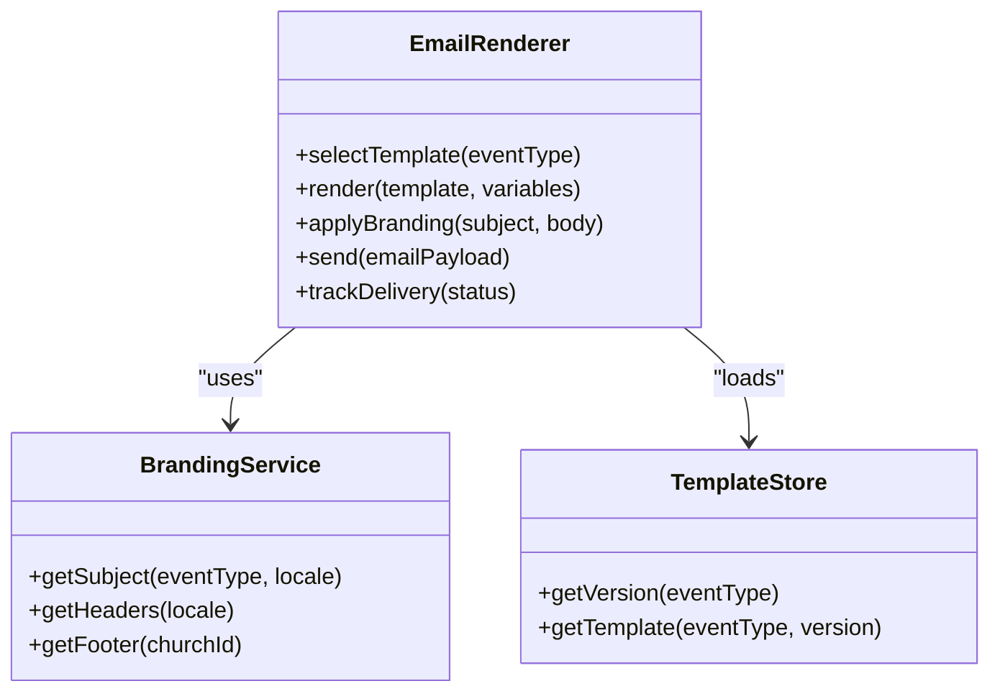
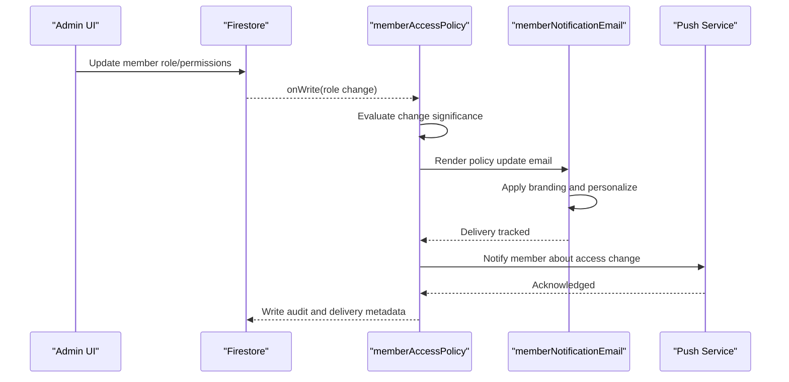
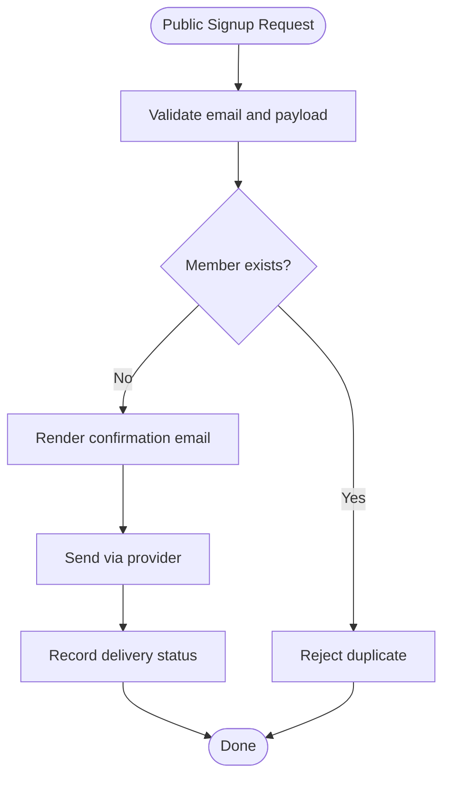
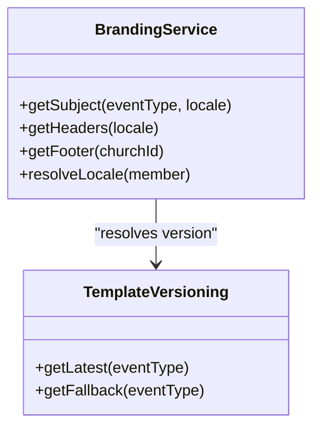
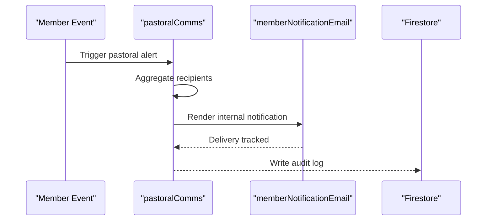
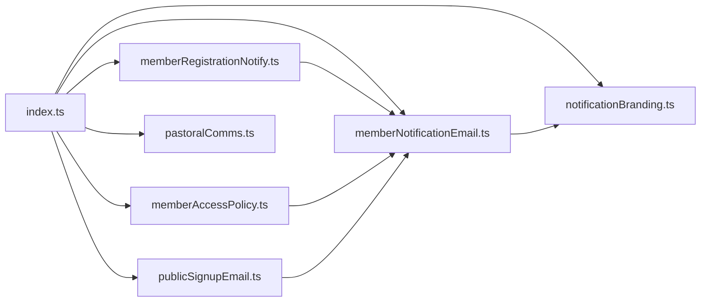

# Member Notification Triggers

<cite>
**Referenced Files in This Document**
- [functions/src/memberRegistrationNotify.ts](file://functions/src/memberRegistrationNotify.ts)
- [functions/lib/memberRegistrationNotify.js](file://functions/lib/memberRegistrationNotify.js)
- [functions/src/memberNotificationEmail.ts](file://functions/src/memberNotificationEmail.ts)
- [functions/lib/memberNotificationEmail.js](file://functions/lib/memberNotificationEmail.js)
- [functions/src/memberAccessPolicy.ts](file://functions/src/memberAccessPolicy.ts)
- [functions/lib/memberAccessPolicy.js](file://functions/lib/memberAccessPolicy.js)
- [functions/src/publicSignupEmail.ts](file://functions/src/publicSignupEmail.ts)
- [functions/lib/publicSignupEmail.js](file://functions/lib/publicSignupEmail.js)
- [functions/src/notificationBranding.ts](file://functions/src/notificationBranding.ts)
- [functions/lib/notificationBranding.js](file://functions/lib/notificationBranding.js)
- [functions/src/pastoralComms.ts](file://functions/src/pastoralComms.ts)
- [functions/lib/pastoralComms.js](file://functions/lib/pastoralComms.js)
- [functions/src/index.ts](file://functions/src/index.ts)
- [functions/lib/index.js](file://functions/lib/index.js)
- [firestore.rules](file://firestore.rules)
</cite>

## Table of Contents
1. [Introduction](#introduction)
2. [Project Structure](#project-structure)
3. [Core Components](#core-components)
4. [Architecture Overview](#architecture-overview)
5. [Detailed Component Analysis](#detailed-component-analysis)
6. [Dependency Analysis](#dependency-analysis)
7. [Performance Considerations](#performance-considerations)
8. [Troubleshooting Guide](#troubleshooting-guide)
9. [Conclusion](#conclusion)

## Introduction
This document explains the member-related notification triggers and email automation workflows implemented with Firebase Cloud Functions and Firestore. It covers how registration events, profile updates, and access policy changes are handled, how email templates are rendered and delivered, and how multi-channel communication is orchestrated. It also includes guidance for bulk notifications, personalization based on member attributes, delivery status tracking, deliverability optimization, template versioning, unsubscribe handling, and debugging delivery issues.

## Project Structure
The notification system is primarily implemented in the functions directory:
- TypeScript sources under functions/src/ define the trigger handlers and utilities.
- Compiled JavaScript outputs under functions/lib/ are deployed to Google Cloud Functions.
- Firestore rules govern data access and can influence trigger behavior indirectly via write permissions.

Key files:
- Registration trigger: memberRegistrationNotify.ts
- Email rendering and sending: memberNotificationEmail.ts
- Access policy change handler: memberAccessPolicy.ts
- Public signup email flow: publicSignupEmail.ts
- Branding and messaging helpers: notificationBranding.ts
- Pastoral communications helper: pastoralComms.ts
- Function index exports: index.ts

**Diagram sources**
- [functions/src/memberRegistrationNotify.ts](file://functions/src/memberRegistrationNotify.ts)
- [functions/src/memberNotificationEmail.ts](file://functions/src/memberNotificationEmail.ts)
- [functions/src/memberAccessPolicy.ts](file://functions/src/memberAccessPolicy.ts)
- [functions/src/publicSignupEmail.ts](file://functions/src/publicSignupEmail.ts)
- [functions/src/notificationBranding.ts](file://functions/src/notificationBranding.ts)
- [functions/src/pastoralComms.ts](file://functions/src/pastoralComms.ts)
- [functions/src/index.ts](file://functions/src/index.ts)
- [firestore.rules](file://firestore.rules)

**Section sources**
- [functions/src/index.ts](file://functions/src/index.ts)
- [functions/lib/index.js](file://functions/lib/index.js)
- [firestore.rules](file://firestore.rules)

## Core Components
- Registration Trigger: Listens to new member documents and initiates welcome emails and optional push notifications.
- Email Rendering Engine: Centralizes template selection, variable substitution, branding, and delivery.
- Access Policy Handler: Responds to membership role or permission changes by updating channels and notifying relevant parties.
- Public Signup Flow: Handles external signups and sends confirmation/welcome messages.
- Branding Utilities: Provides consistent subject lines, headers, footers, and language localization.
- Pastoral Comms: Coordinates internal notifications to church leadership when needed.

**Section sources**
- [functions/src/memberRegistrationNotify.ts](file://functions/src/memberRegistrationNotify.ts)
- [functions/src/memberNotificationEmail.ts](file://functions/src/memberNotificationEmail.ts)
- [functions/src/memberAccessPolicy.ts](file://functions/src/memberAccessPolicy.ts)
- [functions/src/publicSignupEmail.ts](file://functions/src/publicSignupEmail.ts)
- [functions/src/notificationBranding.ts](file://functions/src/notificationBranding.ts)
- [functions/src/pastoralComms.ts](file://functions/src/pastoralComms.ts)

## Architecture Overview
The system follows an event-driven architecture:
- Firestore writes to members trigger Cloud Functions.
- Functions render personalized email content using templates and branding.
- Emails are sent via an email provider; push notifications may be dispatched concurrently.
- Delivery status is recorded for observability and retries.

**Diagram sources**
- [functions/src/memberRegistrationNotify.ts](file://functions/src/memberRegistrationNotify.ts)
- [functions/src/memberNotificationEmail.ts](file://functions/src/memberNotificationEmail.ts)
- [functions/src/notificationBranding.ts](file://functions/src/notificationBranding.ts)

## Detailed Component Analysis

### Registration Trigger: memberRegistrationNotify
Responsibilities:
- Detect new member documents.
- Validate required fields.
- Render and send welcome email.
- Optionally send push notifications.
- Record delivery status and errors.

**Diagram sources**
- [functions/src/memberRegistrationNotify.ts](file://functions/src/memberRegistrationNotify.ts)
- [functions/src/memberNotificationEmail.ts](file://functions/src/memberNotificationEmail.ts)
- [functions/src/notificationBranding.ts](file://functions/src/notificationBranding.ts)

**Section sources**
- [functions/src/memberRegistrationNotify.ts](file://functions/src/memberRegistrationNotify.ts)
- [functions/lib/memberRegistrationNotify.js](file://functions/lib/memberRegistrationNotify.js)

### Email Rendering and Delivery: memberNotificationEmail
Responsibilities:
- Select appropriate template based on event type.
- Personalize content using member attributes and church context.
- Apply branding (subject, headers, footers).
- Handle retries and delivery receipts.
- Support template versioning and fallbacks.

**Diagram sources**
- [functions/src/memberNotificationEmail.ts](file://functions/src/memberNotificationEmail.ts)
- [functions/src/notificationBranding.ts](file://functions/src/notificationBranding.ts)

**Section sources**
- [functions/src/memberNotificationEmail.ts](file://functions/src/memberNotificationEmail.ts)
- [functions/lib/memberNotificationEmail.js](file://functions/lib/memberNotificationEmail.js)
- [functions/src/notificationBranding.ts](file://functions/src/notificationBranding.ts)
- [functions/lib/notificationBranding.js](file://functions/lib/notificationBranding.js)

### Access Policy Changes: memberAccessPolicy
Responsibilities:
- Monitor changes to member roles or permissions.
- Determine if notifications are required (e.g., admin grant, revocation).
- Render targeted emails and/or push notifications.
- Update audit logs and delivery records.

**Diagram sources**
- [functions/src/memberAccessPolicy.ts](file://functions/src/memberAccessPolicy.ts)
- [functions/src/memberNotificationEmail.ts](file://functions/src/memberNotificationEmail.ts)

**Section sources**
- [functions/src/memberAccessPolicy.ts](file://functions/src/memberAccessPolicy.ts)
- [functions/lib/memberAccessPolicy.js](file://functions/lib/memberAccessPolicy.js)

### Public Signup Flow: publicSignupEmail
Responsibilities:
- Handle external signup requests.
- Verify email uniqueness and basic validation.
- Send confirmation/welcome emails with verification links.
- Integrate with branding and template versioning.

**Diagram sources**
- [functions/src/publicSignupEmail.ts](file://functions/src/publicSignupEmail.ts)
- [functions/src/memberNotificationEmail.ts](file://functions/src/memberNotificationEmail.ts)

**Section sources**
- [functions/src/publicSignupEmail.ts](file://functions/src/publicSignupEmail.ts)
- [functions/lib/publicSignupEmail.js](file://functions/lib/publicSignupEmail.js)

### Branding and Messaging: notificationBranding
Responsibilities:
- Provide consistent subjects, headers, and footers across all notifications.
- Support localization and tenant-specific branding.
- Manage template versions and fallbacks.

**Diagram sources**
- [functions/src/notificationBranding.ts](file://functions/src/notificationBranding.ts)

**Section sources**
- [functions/src/notificationBranding.ts](file://functions/src/notificationBranding.ts)
- [functions/lib/notificationBranding.js](file://functions/lib/notificationBranding.js)

### Pastoral Communications: pastoralComms
Responsibilities:
- Coordinate internal notifications to church leadership when member events require attention.
- Aggregate notifications for bulk delivery where appropriate.
- Maintain audit trails and delivery status.

**Diagram sources**
- [functions/src/pastoralComms.ts](file://functions/src/pastoralComms.ts)
- [functions/src/memberNotificationEmail.ts](file://functions/src/memberNotificationEmail.ts)

**Section sources**
- [functions/src/pastoralComms.ts](file://functions/src/pastoralComms.ts)
- [functions/lib/pastoralComms.js](file://functions/lib/pastoralComms.js)

## Dependency Analysis
- Functions are exported from index.ts and compiled into lib/*.js for deployment.
- Email rendering depends on branding services and template stores.
- Firestore triggers depend on security rules to allow writes and reads within tenant boundaries.

**Diagram sources**
- [functions/src/index.ts](file://functions/src/index.ts)
- [functions/lib/index.js](file://functions/lib/index.js)

**Section sources**
- [functions/src/index.ts](file://functions/src/index.ts)
- [functions/lib/index.js](file://functions/lib/index.js)

## Performance Considerations
- Batch operations: Use batched writes for delivery metadata and audit logs to reduce Firestore costs.
- Concurrency control: Limit parallel email sends per function invocation to avoid rate limits.
- Template caching: Cache resolved templates and branding assets to minimize cold-start overhead.
- Retry policies: Implement exponential backoff for transient failures in email providers.
- Observability: Emit structured logs and metrics for delivery success/failure rates.

[No sources needed since this section provides general guidance]

## Troubleshooting Guide
Common issues and resolutions:
- Missing member fields: Ensure required attributes exist before rendering templates.
- Template version mismatch: Validate that requested template versions exist; fall back to latest stable.
- Delivery failures: Check provider credentials, domain authentication (SPF/DKIM/DMARC), and bounce handling.
- Unsubscribe handling: Honor unsubscribe requests by updating member preferences and suppressing future emails.
- Debugging steps:
  - Inspect function logs for render and send errors.
  - Validate email payloads and headers.
  - Test with sandbox accounts and verify bounce/complaint feedback loops.

**Section sources**
- [functions/src/memberNotificationEmail.ts](file://functions/src/memberNotificationEmail.ts)
- [functions/src/notificationBranding.ts](file://functions/src/notificationBranding.ts)
- [functions/src/memberRegistrationNotify.ts](file://functions/src/memberRegistrationNotify.ts)
- [functions/src/memberAccessPolicy.ts](file://functions/src/memberAccessPolicy.ts)
- [functions/src/publicSignupEmail.ts](file://functions/src/publicSignupEmail.ts)

## Conclusion
The member notification system leverages Firestore triggers and Cloud Functions to automate registration, profile updates, and access policy changes. Centralized email rendering and branding ensure consistency and personalization. Robust delivery tracking, retry strategies, and unsubscribe handling support reliable multi-channel communication. Following the performance and troubleshooting recommendations will help maintain high deliverability and operational stability.

[No sources needed since this section summarizes without analyzing specific files]