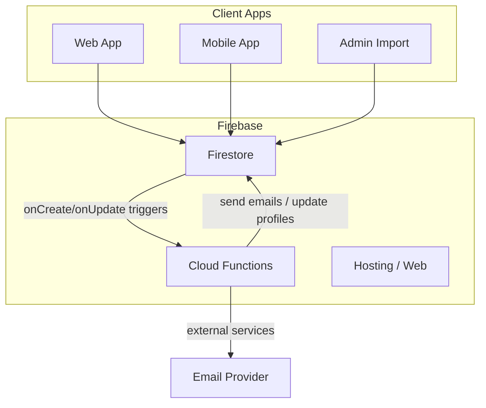
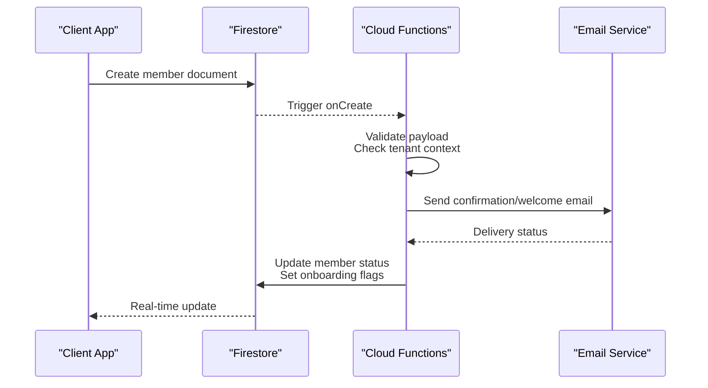
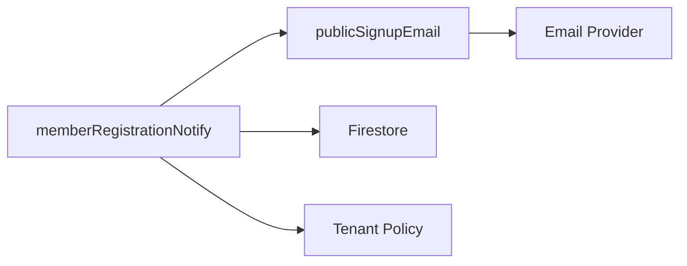
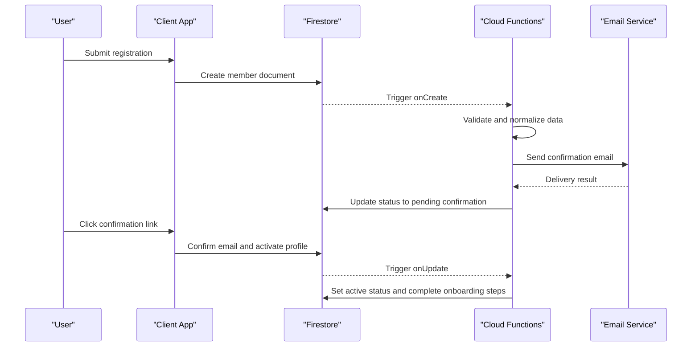

# Member Registration Notifications

<cite>
**Referenced Files in This Document**
- [functions/src/memberRegistrationNotify.ts](file://functions/src/memberRegistrationNotify.ts)
- [functions/lib/memberRegistrationNotify.js](file://functions/lib/memberRegistrationNotify.js)
- [functions/src/publicSignupEmail.ts](file://functions/src/publicSignupEmail.ts)
- [functions/lib/publicSignupEmail.js](file://functions/lib/publicSignupEmail.js)
- [functions/src/index.ts](file://functions/src/index.ts)
- [functions/lib/index.js](file://functions/lib/index.js)
- [functions/package.json](file://functions/package.json)
- [firestore.rules](file://firestore.rules)
- [firebase.json](file://firebase.json)
</cite>

## Table of Contents
1. [Introduction](#introduction)
2. [Project Structure](#project-structure)
3. [Core Components](#core-components)
4. [Architecture Overview](#architecture-overview)
5. [Detailed Component Analysis](#detailed-component-analysis)
6. [Dependency Analysis](#dependency-analysis)
7. [Performance Considerations](#performance-considerations)
8. [Troubleshooting Guide](#troubleshooting-guide)
9. [Conclusion](#conclusion)
10. [Appendices](#appendices)

## Introduction
This document explains how the system handles member registration notifications and automated workflows triggered by new member registrations. It covers Firestore trigger setup, data validation, email confirmation, profile activation, multi-step onboarding, handling different registration sources (web, mobile, admin import), custom fields, error handling, retry mechanisms, and debugging strategies.

## Project Structure
The relevant implementation for member registration notifications resides in the Cloud Functions directory and is wired into Firebase via configuration files:
- Cloud Functions source code under functions/src/ with compiled outputs under functions/lib/
- Firebase configuration including rules and function deployment settings

[No sources needed since this diagram shows conceptual workflow, not actual code structure]

**Section sources**
- [firebase.json:1-200](file://firebase.json#L1-L200)
- [firestore.rules:1-500](file://firestore.rules#L1-L500)

## Core Components
- memberRegistrationNotify: Handles Firestore-triggered events for new or updated member records to perform post-registration tasks such as sending welcome emails and updating profile state.
- publicSignupEmail: Sends confirmation/welcome emails for public signups and may be invoked by the registration flow.
- index (functions): Exports and wires up Cloud Functions triggers that listen to Firestore changes.

Key responsibilities:
- Validate incoming registration payloads
- Enforce tenant scoping and security policies
- Send confirmation/welcome emails
- Update member profile status and onboarding state
- Handle errors and retries robustly

**Section sources**
- [functions/src/memberRegistrationNotify.ts:1-200](file://functions/src/memberRegistrationNotify.ts#L1-L200)
- [functions/src/publicSignupEmail.ts:1-200](file://functions/src/publicSignupEmail.ts#L1-L200)
- [functions/src/index.ts:1-200](file://functions/src/index.ts#L1-L200)

## Architecture Overview
The registration notification architecture follows an event-driven pattern:
- Clients write a new member record to Firestore
- Cloud Functions triggers react to create/update events
- The handler validates data, sends emails, and updates profile states
- External email services are called asynchronously

**Diagram sources**
- [functions/src/memberRegistrationNotify.ts:1-200](file://functions/src/memberRegistrationNotify.ts#L1-L200)
- [functions/src/publicSignupEmail.ts:1-200](file://functions/src/publicSignupEmail.ts#L1-L200)
- [functions/src/index.ts:1-200](file://functions/src/index.ts#L1-L200)

## Detailed Component Analysis

### Firestore Triggers and Entry Points
- The functions index file exports trigger definitions that bind Firestore events to handlers.
- Triggers typically listen to member documents within tenant-scoped paths to ensure isolation and correct processing.

What to verify:
- Correct collection and path patterns for member documents
- Proper environment variables for service accounts and email providers
- Function runtime version and dependencies aligned with package.json

**Section sources**
- [functions/src/index.ts:1-200](file://functions/src/index.ts#L1-L200)
- [functions/lib/index.js:1-200](file://functions/lib/index.js#L1-L200)
- [functions/package.json:1-200](file://functions/package.json#L1-L200)

### Registration Handler: Data Validation and Workflow Orchestration
Responsibilities:
- Parse and validate incoming member data (required fields, formats, constraints)
- Determine registration source (web, mobile, admin import)
- Apply custom field mappings and defaults
- Initiate email confirmation and set initial profile state
- Manage onboarding steps and transitions

Error handling:
- Log detailed errors with context (tenantId, memberId, source)
- Fail fast on invalid input; return structured error codes
- Use idempotent operations where possible to avoid duplicates

**Section sources**
- [functions/src/memberRegistrationNotify.ts:1-200](file://functions/src/memberRegistrationNotify.ts#L1-L200)
- [functions/lib/memberRegistrationNotify.js:1-200](file://functions/lib/memberRegistrationNotify.js#L1-L200)

### Email Confirmation and Welcome Workflows
Responsibilities:
- Compose and send confirmation/welcome emails based on registration source and tenant branding
- Include verification links or instructions for next steps
- Track delivery outcomes and handle failures gracefully

Integration points:
- Email provider SDK or HTTP API
- Template rendering with dynamic content (name, church name, links)

**Section sources**
- [functions/src/publicSignupEmail.ts:1-200](file://functions/src/publicSignupEmail.ts#L1-L200)
- [functions/lib/publicSignupEmail.js:1-200](file://functions/lib/publicSignupEmail.js#L1-L200)

### Profile Activation and Multi-Step Onboarding
Activation logic:
- After email confirmation, update member status from pending to active
- Set onboarding step indicators and completion flags
- Initialize default roles and permissions per tenant policy

Multi-step onboarding:
- Define sequential steps (e.g., profile completion, preferences, consent)
- Persist progress and allow resuming across devices
- Trigger reminders or nudges when steps remain incomplete

**Section sources**
- [functions/src/memberRegistrationNotify.ts:1-200](file://functions/src/memberRegistrationNotify.ts#L1-L200)

### Handling Different Registration Sources
Sources:
- Web signup: Direct form submission via hosted site
- Mobile signup: In-app registration using Firebase Auth and Firestore writes
- Admin import: Bulk creation via scripts or admin tools

Handling differences:
- Normalize inputs across sources
- Tag source metadata for analytics and routing
- Apply source-specific defaults and flows

**Section sources**
- [functions/src/memberRegistrationNotify.ts:1-200](file://functions/src/memberRegistrationNotify.ts#L1-L200)

### Custom Registration Fields
Approach:
- Accept extensible fields in the member document schema
- Validate and sanitize custom fields server-side
- Map custom fields to internal models and UI labels

Best practices:
- Maintain a registry of allowed custom fields per tenant
- Provide fallbacks for missing values
- Avoid storing sensitive data unless necessary

**Section sources**
- [functions/src/memberRegistrationNotify.ts:1-200](file://functions/src/memberRegistrationNotify.ts#L1-L200)

### Error Handling and Retry Mechanisms
Strategies:
- Catch and log all exceptions with contextual metadata
- Implement exponential backoff for transient failures (network, rate limits)
- Mark failed operations for manual review or reprocessing
- Ensure idempotency to prevent duplicate emails or profile updates

Observability:
- Emit metrics for success/failure rates
- Surface actionable logs for debugging

**Section sources**
- [functions/src/memberRegistrationNotify.ts:1-200](file://functions/src/memberRegistrationNotify.ts#L1-L200)

### Security and Access Control
Firestore Rules:
- Restrict writes to member documents to authorized roles
- Enforce tenant isolation and prevent cross-tenant mutations
- Allow Cloud Functions to read/write as needed via service account

Authentication:
- Verify user identity for client-initiated writes
- Validate token claims and tenant context

**Section sources**
- [firestore.rules:1-500](file://firestore.rules#L1-L500)

## Dependency Analysis
Cloud Functions depend on:
- Firestore for reading/writing member data
- Email provider SDK or HTTP APIs for sending messages
- Environment configuration for credentials and endpoints

**Diagram sources**
- [functions/src/memberRegistrationNotify.ts:1-200](file://functions/src/memberRegistrationNotify.ts#L1-L200)
- [functions/src/publicSignupEmail.ts:1-200](file://functions/src/publicSignupEmail.ts#L1-L200)

**Section sources**
- [functions/package.json:1-200](file://functions/package.json#L1-L200)

## Performance Considerations
- Keep trigger handlers lightweight; offload heavy work to background tasks if needed
- Batch updates to Firestore where appropriate
- Cache static templates and configurations
- Monitor cold starts and optimize dependencies

[No sources needed since this section provides general guidance]

## Troubleshooting Guide
Common issues:
- Missing required fields in registration payload
- Email delivery failures due to provider errors or quotas
- Tenant misconfiguration causing unauthorized access
- Duplicate registrations from retries without idempotency checks

Debugging steps:
- Inspect Cloud Functions logs for error traces and context
- Verify Firestore document state before and after trigger execution
- Check email provider dashboards for delivery status
- Validate Firestore rules and function environment variables

**Section sources**
- [functions/src/memberRegistrationNotify.ts:1-200](file://functions/src/memberRegistrationNotify.ts#L1-L200)
- [functions/src/publicSignupEmail.ts:1-200](file://functions/src/publicSignupEmail.ts#L1-L200)

## Conclusion
The member registration notification system leverages Firestore triggers and Cloud Functions to orchestrate validation, email confirmation, and profile activation. By supporting multiple registration sources, custom fields, and robust error handling, it ensures a reliable and scalable onboarding experience. Proper security rules and observability practices are essential to maintain integrity and performance.

[No sources needed since this section summarizes without analyzing specific files]

## Appendices

### Registration Flow Sequence

**Diagram sources**
- [functions/src/memberRegistrationNotify.ts:1-200](file://functions/src/memberRegistrationNotify.ts#L1-L200)
- [functions/src/publicSignupEmail.ts:1-200](file://functions/src/publicSignupEmail.ts#L1-L200)