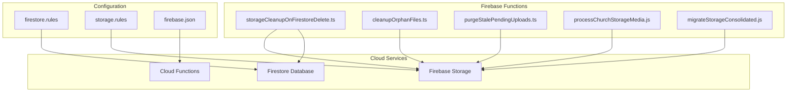
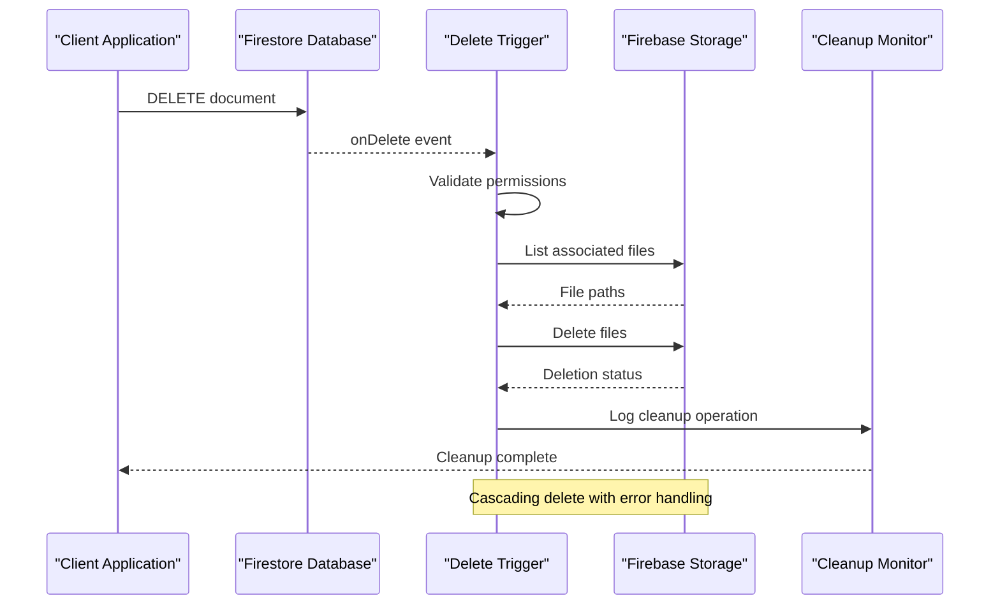
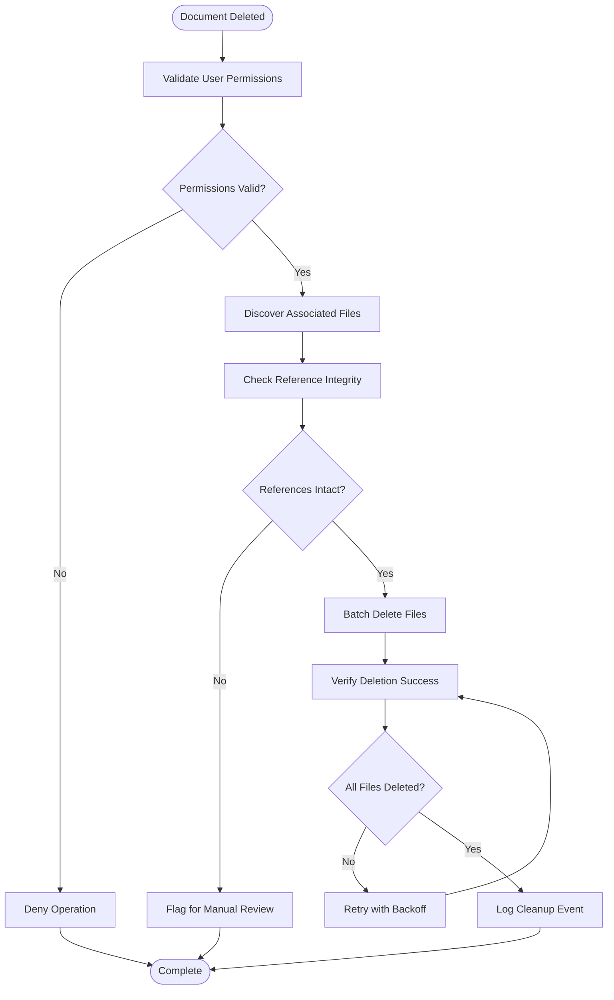
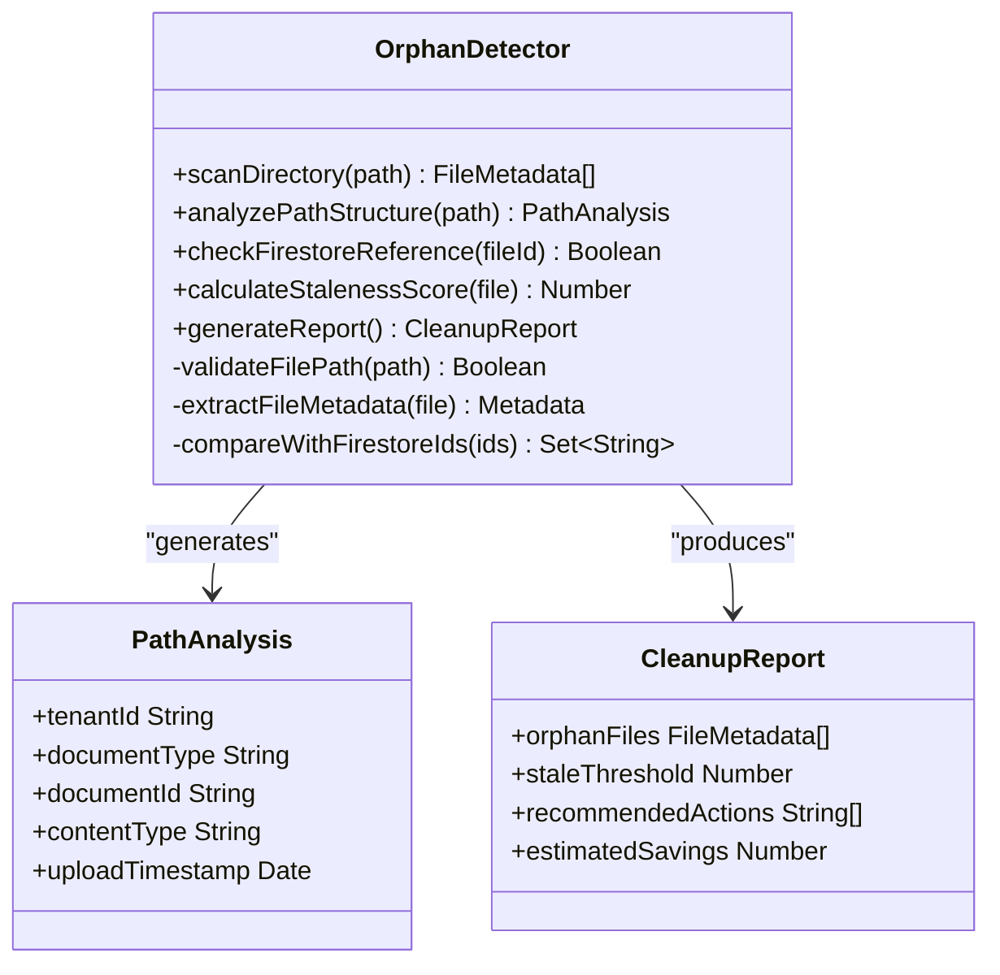
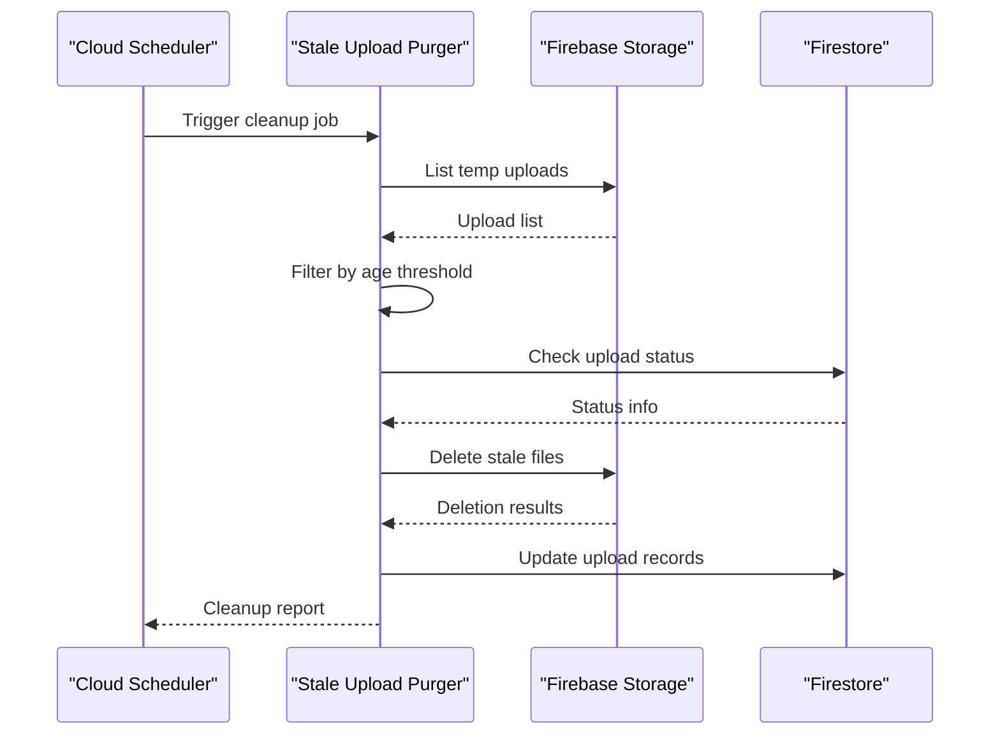
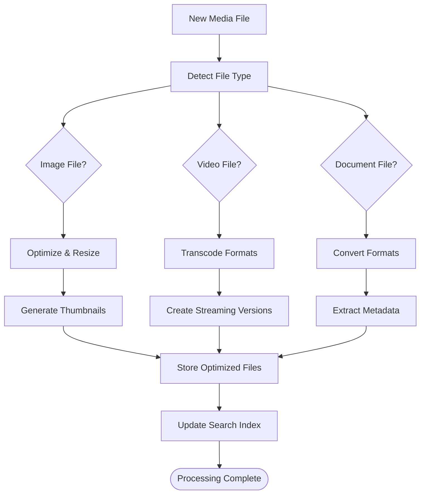
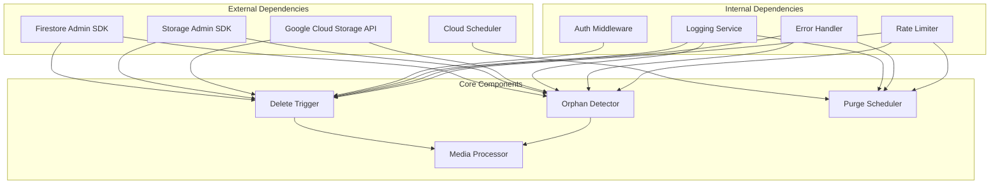

# Storage Cleanup Triggers

<cite>
**Referenced Files in This Document**
- [storageCleanupOnFirestoreDelete.ts](file://functions/src/storageCleanupOnFirestoreDelete.ts)
- [cleanupOrphanFiles.ts](file://functions/src/cleanupOrphanFiles.ts)
- [purgeStalePendingUploads.ts](file://functions/src/purgeStalePendingUploads.ts)
- [processChurchStorageMedia.js](file://functions/src/processChurchStorageMedia.js)
- [migrateStorageConsolidated.js](file://functions/src/migrateStorageConsolidated.js)
- [firestore.rules](file://firestore.rules)
- [storage.rules](file://storage.rules)
- [firebase.json](file://firebase.json)
</cite>

## Table of Contents
1. [Introduction](#introduction)
2. [Project Structure](#project-structure)
3. [Core Components](#core-components)
4. [Architecture Overview](#architecture-overview)
5. [Detailed Component Analysis](#detailed-component-analysis)
6. [Dependency Analysis](#dependency-analysis)
7. [Performance Considerations](#performance-considerations)
8. [Troubleshooting Guide](#troubleshooting-guide)
9. [Conclusion](#conclusion)

## Introduction

This document provides comprehensive documentation for storage cleanup triggers and orphan file management in the Firebase/Firestore application. The system implements automated cleanup mechanisms to maintain storage hygiene, prevent orphaned files, and optimize storage usage through intelligent deletion triggers and scheduled cleanup processes.

The storage cleanup architecture ensures that when Firestore documents are deleted, associated Firebase Storage files are automatically removed, preventing data inconsistency and storage waste. The system includes sophisticated algorithms for detecting orphaned files, managing stale uploads, and implementing retention policies.

## Project Structure

The storage cleanup functionality is primarily implemented within the Firebase Functions directory, with supporting configuration in the root project files. The architecture follows a modular approach where each cleanup task is encapsulated in separate functions for better maintainability and testing.

**Diagram sources**
- [storageCleanupOnFirestoreDelete.ts:1-50](file://functions/src/storageCleanupOnFirestoreDelete.ts#L1-L50)
- [cleanupOrphanFiles.ts:1-50](file://functions/src/cleanupOrphanFiles.ts#L1-L50)
- [firestore.rules:1-100](file://firestore.rules#L1-L100)
- [storage.rules:1-100](file://storage.rules#L1-L100)

**Section sources**
- [firebase.json:1-50](file://firebase.json#L1-L50)
- [firestore.rules:1-100](file://firestore.rules#L1-L100)
- [storage.rules:1-100](file://storage.rules#L1-L100)

## Core Components

The storage cleanup system consists of several key components that work together to maintain storage integrity:

### Firestore Delete Trigger Handler
The primary trigger handler monitors Firestore document deletions and initiates cascading cleanup operations for associated storage files.

### Orphan File Detection System
An algorithmic approach to identify files that exist in storage but have no corresponding references in Firestore, ensuring complete data consistency.

### Stale Upload Purger
Scheduled cleanup process that removes incomplete or abandoned upload attempts that exceed defined time thresholds.

### Media Processing Pipeline
Handles media-specific cleanup operations including thumbnail generation, format conversion, and metadata cleanup.

### Storage Migration Tool
Utility for migrating legacy storage structures to consolidated formats while maintaining data integrity.

**Section sources**
- [storageCleanupOnFirestoreDelete.ts:1-100](file://functions/src/storageCleanupOnFirestoreDelete.ts#L1-L100)
- [cleanupOrphanFiles.ts:1-100](file://functions/src/cleanupOrphanFiles.ts#L1-L100)
- [purgeStalePendingUploads.ts:1-100](file://functions/src/purgeStalePendingUploads.ts#L1-L100)

## Architecture Overview

The storage cleanup architecture follows an event-driven pattern where Firestore operations trigger corresponding storage cleanup actions. The system implements multiple layers of protection to ensure data consistency and prevent accidental data loss.

**Diagram sources**
- [storageCleanupOnFirestoreDelete.ts:50-150](file://functions/src/storageCleanupOnFirestoreDelete.ts#L50-L150)
- [cleanupOrphanFiles.ts:50-150](file://functions/src/cleanupOrphanFiles.ts#L50-L150)

The architecture implements several key design patterns:

### Event-Driven Cleanup
Firestore delete events automatically trigger storage cleanup without requiring client-side coordination.

### Idempotent Operations
All cleanup operations are designed to be idempotent, ensuring safe re-execution without side effects.

### Batch Processing
Large-scale cleanup operations use batch processing to handle thousands of files efficiently.

### Retry Mechanisms
Failed operations implement exponential backoff and retry logic for resilience.

## Detailed Component Analysis

### Firestore Delete Trigger Handler

The primary cleanup mechanism listens for Firestore document deletions and executes cascading storage cleanup. The implementation includes permission validation, file discovery, and atomic deletion operations.

**Diagram sources**
- [storageCleanupOnFirestoreDelete.ts:100-250](file://functions/src/storageCleanupOnFirestoreDelete.ts#L100-L250)

Key features include:
- **Permission Validation**: Ensures only authorized users can trigger cleanup operations
- **Reference Checking**: Validates that all related documents are being deleted before removing storage files
- **Atomic Operations**: Uses transactional deletes to maintain data consistency
- **Error Recovery**: Implements automatic retry with exponential backoff for transient failures

### Orphan File Detection Algorithm

The orphan detection system scans storage directories to identify files without corresponding Firestore references. The algorithm uses path-based heuristics and metadata analysis to determine file ownership.

**Diagram sources**
- [cleanupOrphanFiles.ts:150-300](file://functions/src/cleanupOrphanFiles.ts#L150-L300)

The detection algorithm employs multiple strategies:
- **Path Pattern Matching**: Analyzes file paths to extract tenant and document identifiers
- **Metadata Correlation**: Cross-references file metadata with Firestore document properties
- **Temporal Analysis**: Identifies files that haven't been accessed recently as potential orphans
- **Reference Validation**: Verifies existence of corresponding Firestore documents

### Stale Upload Purger

The stale upload purger handles incomplete or abandoned upload attempts by scanning temporary upload directories and removing files that exceed configured time thresholds.

**Diagram sources**
- [purgeStalePendingUploads.ts:100-200](file://functions/src/purgeStalePendingUploads.ts#L100-L200)

Features include:
- **Configurable Thresholds**: Time-based expiration policies for different upload types
- **Status Verification**: Checks upload completion status before deletion
- **Graceful Handling**: Preserves partially uploaded files during active transfers
- **Audit Logging**: Maintains detailed logs of all purge operations

### Media Processing Pipeline

The media processing component handles specialized cleanup tasks for different file types, including image optimization, video transcoding, and document format conversion.

**Diagram sources**
- [processChurchStorageMedia.js:50-150](file://functions/src/processChurchStorageMedia.js#L50-L150)

### Storage Migration Utility

The migration tool facilitates the transition from legacy storage structures to consolidated formats while preserving data integrity and maintaining backward compatibility.

**Section sources**
- [migrateStorageConsolidated.js:1-200](file://functions/src/migrateStorageConsolidated.js#L1-L200)

## Dependency Analysis

The storage cleanup system has well-defined dependencies between components and external services:

**Diagram sources**
- [storageCleanupOnFirestoreDelete.ts:1-50](file://functions/src/storageCleanupOnFirestoreDelete.ts#L1-L50)
- [cleanupOrphanFiles.ts:1-50](file://functions/src/cleanupOrphanFiles.ts#L1-L50)
- [purgeStalePendingUploads.ts:1-50](file://functions/src/purgeStalePendingUploads.ts#L1-L50)

Key dependency relationships:
- **SDK Dependencies**: All components depend on Firebase Admin SDK for database and storage operations
- **Authentication**: Strict authentication middleware validates user permissions before cleanup operations
- **Monitoring**: Centralized logging service tracks all cleanup activities for audit purposes
- **Rate Limiting**: Prevents excessive API calls during large-scale cleanup operations

**Section sources**
- [firebase.json:50-100](file://firebase.json#L50-L100)
- [firestore.rules:100-200](file://firestore.rules#L100-L200)
- [storage.rules:100-200](file://storage.rules#L100-L200)

## Performance Considerations

The storage cleanup system is optimized for performance through several strategies:

### Batch Processing Optimization
Large-scale operations use batch processing to minimize API calls and reduce latency. The system groups related operations and processes them in parallel where possible.

### Memory Management
Efficient memory usage is achieved through streaming operations and garbage collection optimization. Large file lists are processed incrementally rather than loaded entirely into memory.

### Concurrency Control
The system implements controlled concurrency to prevent overwhelming Firebase APIs while maximizing throughput. Configurable limits ensure stable operation under heavy loads.

### Caching Strategies
Frequently accessed metadata is cached to reduce database queries and improve response times for repeated operations.

### Monitoring and Metrics
Comprehensive metrics collection enables performance monitoring and bottleneck identification. Key metrics include operation duration, success rates, and resource utilization.

## Troubleshooting Guide

Common issues and their resolution strategies:

### Permission Errors
- **Symptom**: Cleanup operations fail with authorization errors
- **Solution**: Verify Firebase Admin SDK credentials and Firestore/Storage rules configuration
- **Prevention**: Implement proper service account setup with minimal required permissions

### Timeout Issues
- **Symptom**: Large cleanup operations timeout before completion
- **Solution**: Increase function timeout limits and implement chunked processing
- **Prevention**: Use background jobs for large-scale operations with progress tracking

### Data Inconsistency
- **Symptom**: Storage files remain after document deletion
- **Solution**: Run orphan detection scan and manually clean up remaining files
- **Prevention**: Implement idempotent cleanup operations with verification steps

### Performance Degradation
- **Symptom**: Cleanup operations become slower over time
- **Solution**: Archive old logs and optimize database queries
- **Prevention**: Regular maintenance schedules and query optimization

**Section sources**
- [storageCleanupOnFirestoreDelete.ts:200-300](file://functions/src/storageCleanupOnFirestoreDelete.ts#L200-L300)
- [cleanupOrphanFiles.ts:200-300](file://functions/src/cleanupOrphanFiles.ts#L200-L300)
- [purgeStalePendingUploads.ts:200-300](file://functions/src/purgeStalePendingUploads.ts#L200-L300)

## Conclusion

The storage cleanup system provides a robust, scalable solution for maintaining storage hygiene in Firebase applications. Through automated triggers, intelligent detection algorithms, and comprehensive error handling, the system ensures data consistency while optimizing storage costs.

Key benefits include:
- **Automated Maintenance**: Reduces manual intervention requirements
- **Cost Optimization**: Prevents storage waste through timely cleanup
- **Data Integrity**: Maintains consistency between Firestore and Storage
- **Scalability**: Handles growing data volumes efficiently
- **Reliability**: Robust error handling and recovery mechanisms

The modular architecture allows for easy extension and customization to meet specific business requirements while maintaining core functionality and reliability standards.