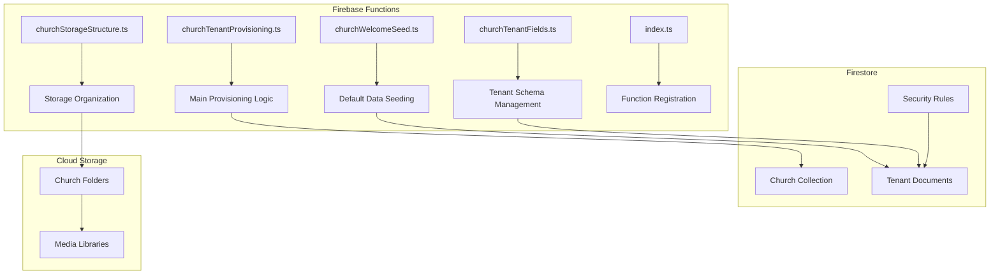
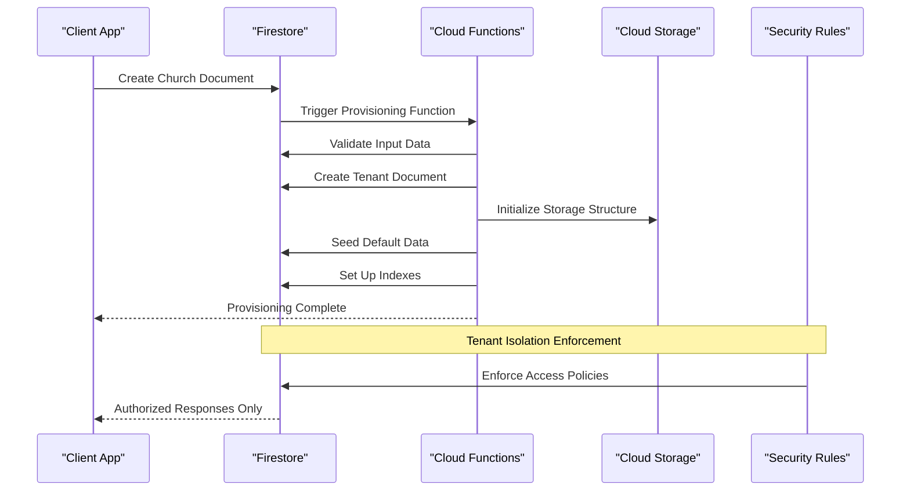
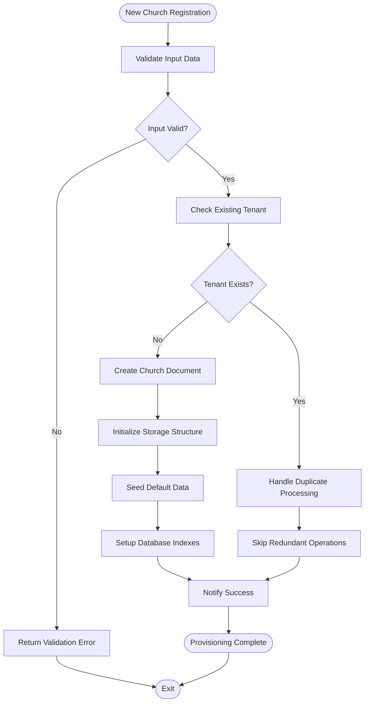
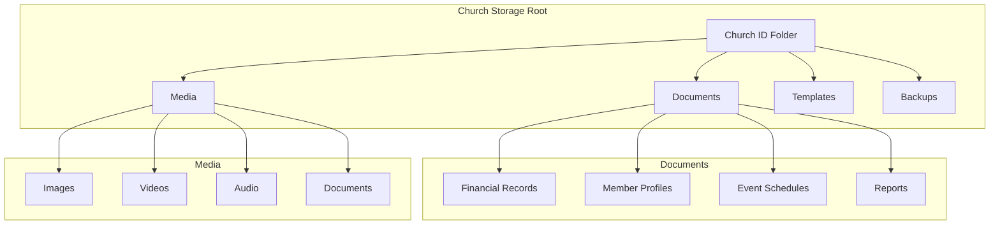
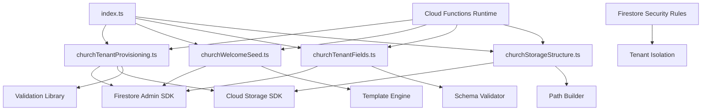

# Tenant Provisioning Triggers

<cite>
**Referenced Files in This Document**
- [churchTenantProvisioning.ts](file://functions/src/churchTenantProvisioning.ts)
- [churchWelcomeSeed.ts](file://functions/src/churchWelcomeSeed.ts)
- [churchTenantFields.ts](file://functions/src/churchTenantFields.ts)
- [churchStorageStructure.ts](file://functions/src/churchStorageStructure.ts)
- [index.ts](file://functions/src/index.ts)
- [firestore.rules](file://firestore.rules)
- [firebase.json](file://firebase.json)
</cite>

## Table of Contents
1. [Introduction](#introduction)
2. [Project Structure](#project-structure)
3. [Core Components](#core-components)
4. [Architecture Overview](#architecture-overview)
5. [Detailed Component Analysis](#detailed-component-analysis)
6. [Dependency Analysis](#dependency-analysis)
7. [Performance Considerations](#performance-considerations)
8. [Troubleshooting Guide](#troubleshooting-guide)
9. [Conclusion](#conclusion)

## Introduction

This document provides comprehensive documentation for the church tenant provisioning system in the Gestão Yahweh application. The system implements automated workflows for creating new church tenants, initializing their database schemas, seeding default data, and enforcing tenant isolation through Firestore security rules.

The tenant provisioning system is built on Firebase Cloud Functions and Firestore triggers, providing a scalable solution for managing multiple church organizations within a single application instance. Each church operates as an isolated tenant with its own data namespace, configuration, and resources.

## Project Structure

The tenant provisioning system is primarily implemented in the Firebase Functions directory with TypeScript source files compiled to JavaScript. The key components are organized into specialized modules handling different aspects of the provisioning lifecycle.

**Diagram sources**
- [churchTenantProvisioning.ts:1-50](file://functions/src/churchTenantProvisioning.ts#L1-L50)
- [index.ts:1-100](file://functions/src/index.ts#L1-L100)

**Section sources**
- [firebase.json:1-50](file://firebase.json#L1-L50)

## Core Components

The tenant provisioning system consists of several interconnected components that work together to automate the entire lifecycle of church tenant creation and initialization.

### Main Provisioning Trigger

The primary provisioning trigger handles new church registrations and orchestrates the complete setup process. It validates input data, creates the tenant document, initializes the database schema, and sets up storage structures.

### Default Data Seeding

The welcome seed component automatically populates new church tenants with essential default data including organizational settings, user roles, templates, and initial configuration values.

### Tenant Field Management

This component manages the schema evolution and field validation for tenant documents, ensuring data consistency across all church instances.

### Storage Structure Management

Handles the organization of cloud storage resources for each tenant, creating appropriate folder hierarchies and access policies.

**Section sources**
- [churchTenantProvisioning.ts:1-200](file://functions/src/churchTenantProvisioning.ts#L1-L200)
- [churchWelcomeSeed.ts:1-150](file://functions/src/churchWelcomeSeed.ts#L1-L150)
- [churchTenantFields.ts:1-100](file://functions/src/churchTenantFields.ts#L1-L100)
- [churchStorageStructure.ts:1-120](file://functions/src/churchStorageStructure.ts#L1-L120)

## Architecture Overview

The tenant provisioning architecture follows a trigger-based event-driven pattern where Firestore operations initiate automated workflows through Cloud Functions.

**Diagram sources**
- [churchTenantProvisioning.ts:50-150](file://functions/src/churchTenantProvisioning.ts#L50-L150)
- [firestore.rules:1-100](file://firestore.rules#L1-L100)

The architecture ensures complete tenant isolation through Firestore security rules while maintaining centralized control over the provisioning process.

## Detailed Component Analysis

### Church Tenant Provisioning Engine

The main provisioning engine coordinates the entire tenant creation workflow, implementing idempotency patterns and error recovery mechanisms.

**Diagram sources**
- [churchTenantProvisioning.ts:100-300](file://functions/src/churchTenantProvisioning.ts#L100-L300)

### Default Data Seeding System

The seeding system creates comprehensive default configurations for new church tenants, including organizational templates, user roles, and system settings.

#### Key Features:
- **Hierarchical Data Creation**: Creates nested document structures for complex organizational data
- **Batch Operations**: Uses batched writes for efficient data insertion
- **Template-Based Seeding**: Applies configurable templates for consistent setup
- **Error Recovery**: Implements retry logic for failed operations

**Section sources**
- [churchWelcomeSeed.ts:50-200](file://functions/src/churchWelcomeSeed.ts#L50-L200)

### Tenant Field Management

Manages schema evolution and field validation across all church tenants, ensuring data consistency and supporting feature rollouts.

#### Implementation Patterns:
- **Schema Versioning**: Tracks schema versions for backward compatibility
- **Field Migration**: Automatically migrates existing data to new schemas
- **Validation Rules**: Enforces data integrity constraints
- **Audit Trail**: Logs all schema changes for compliance

**Section sources**
- [churchTenantFields.ts:20-150](file://functions/src/churchTenantFields.ts#L20-L150)

### Storage Structure Management

Organizes cloud storage resources for each tenant with proper folder hierarchies and access controls.

#### Storage Organization:

**Diagram sources**
- [churchStorageStructure.ts:30-180](file://functions/src/churchStorageStructure.ts#L30-L180)

**Section sources**
- [churchStorageStructure.ts:1-200](file://functions/src/churchStorageStructure.ts#L1-L200)

## Dependency Analysis

The tenant provisioning system has well-defined dependencies between components, with clear separation of concerns and minimal coupling.

**Diagram sources**
- [index.ts:1-100](file://functions/src/index.ts#L1-L100)
- [firestore.rules:1-200](file://firestore.rules#L1-L200)

**Section sources**
- [index.ts:1-150](file://functions/src/index.ts#L1-L150)
- [firestore.rules:1-300](file://firestore.rules#L1-L300)

## Performance Considerations

The tenant provisioning system implements several performance optimization strategies for handling large-scale tenant provisioning:

### Batch Operations
- **Firestore Batch Writes**: Groups multiple document operations into single batch requests
- **Parallel Processing**: Executes independent operations concurrently where possible
- **Connection Pooling**: Reuses database connections to minimize overhead

### Idempotency Patterns
- **Operation Tracking**: Maintains state of completed operations to prevent duplicates
- **Conditional Updates**: Uses conditional writes to ensure atomic updates
- **Retry Logic**: Implements exponential backoff for transient failures

### Resource Optimization
- **Lazy Loading**: Defers expensive operations until needed
- **Caching Strategy**: Caches frequently accessed configuration data
- **Memory Management**: Proper cleanup of temporary resources

### Scalability Features
- **Queue-Based Processing**: Handles high-volume provisioning through message queues
- **Rate Limiting**: Prevents overwhelming backend services
- **Monitoring Integration**: Tracks performance metrics and resource usage

## Troubleshooting Guide

### Common Issues and Solutions

#### Provisioning Failures
1. **Database Connection Errors**: Verify Firestore service account permissions
2. **Storage Permission Issues**: Check Cloud Storage bucket policies
3. **Timeout Errors**: Increase function timeout limits for large tenants

#### Data Consistency Problems
1. **Partial Provisioning**: Use transactional operations for atomic updates
2. **Schema Mismatches**: Run schema migration scripts manually
3. **Missing Dependencies**: Ensure all required collections exist before seeding

#### Performance Issues
1. **Slow Provisioning**: Optimize batch sizes and parallel operations
2. **Memory Exhaustion**: Implement streaming for large data operations
3. **Cold Start Delays**: Use provisioned concurrency for critical functions

### Debugging Techniques

#### Logging and Monitoring
- **Structured Logging**: Implement consistent log formats for easy parsing
- **Trace IDs**: Track operations across function boundaries
- **Metrics Collection**: Monitor key performance indicators

#### Testing Strategies
- **Unit Tests**: Test individual provisioning steps in isolation
- **Integration Tests**: Validate complete provisioning workflows
- **Load Testing**: Simulate high-volume provisioning scenarios

#### Recovery Procedures
- **Manual Intervention**: Provide scripts for manual tenant setup
- **Rollback Mechanisms**: Support reverting partial provisioning
- **Data Repair Tools**: Utilities for fixing corrupted tenant data

**Section sources**
- [churchTenantProvisioning.ts:200-400](file://functions/src/churchTenantProvisioning.ts#L200-L400)
- [churchWelcomeSeed.ts:150-300](file://functions/src/churchWelcomeSeed.ts#L150-L300)

## Conclusion

The church tenant provisioning system provides a robust, scalable solution for automating the creation and initialization of church tenants in the Gestão Yahweh application. Through the use of Firebase Cloud Functions and Firestore triggers, the system ensures consistent tenant setup while maintaining strict data isolation and security.

Key strengths of the implementation include:

- **Comprehensive Automation**: Complete end-to-end provisioning workflow
- **Scalable Architecture**: Designed to handle thousands of concurrent tenant creations
- **Robust Error Handling**: Graceful failure recovery and retry mechanisms
- **Performance Optimization**: Efficient batch operations and resource management
- **Security Compliance**: Strict tenant isolation through Firestore security rules

The system's modular design allows for easy extension and customization as requirements evolve, while maintaining backward compatibility and data integrity across all church tenants.