# Function Architecture & Organization

<cite>
**Referenced Files in This Document**
- [firebase.json](file://firebase.json)
- [functions/package.json](file://functions/package.json)
- [functions/tsconfig.json](file://functions/tsconfig.json)
- [functions/src/index.ts](file://functions/src/index.ts)
- [functions/lib/index.js](file://functions/lib/index.js)
- [functions/src/churchTenantProvisioning.ts](file://functions/src/churchTenantProvisioning.ts)
- [functions/src/publicSignupEmail.ts](file://functions/src/publicSignupEmail.ts)
- [functions/src/financeVencimentoReminders.ts](file://functions/src/financeVencimentoReminders.ts)
- [functions/src/eventoReminders.ts](file://functions/src/eventoReminders.ts)
- [functions/src/receitasRecorrentesScheduled.ts](file://functions/src/receitasRecorrentesScheduled.ts)
- [functions/src/storageDisplayUrls.ts](file://functions/src/storageDisplayUrls.ts)
- [functions/src/storageCleanupOnFirestoreDelete.ts](file://functions/src/storageCleanupOnFirestoreDelete.ts)
- [functions/src/cleanupOrphanFiles.ts](file://functions/src/cleanupOrphanFiles.ts)
- [functions/src/purgeStalePendingUploads.ts](file://functions/src/purgeStalePendingUploads.ts)
- [functions/src/masterPlatformAuth.ts](file://functions/src/masterPlatformAuth.ts)
- [functions/src/memberAccessPolicy.ts](file://functions/src/memberAccessPolicy.ts)
- [functions/src/membroSessionSync.ts](file://functions/src/membroSessionSync.ts)
- [functions/src/panelDashboardCache.ts](file://functions/src/panelDashboardCache.ts)
- [functions/src/panelFinanceSummary.ts](file://functions/src/panelFinanceSummary.ts)
- [functions/src/panelPublicSiteCache.ts](file://functions/src/panelPublicSiteCache.ts)
- [functions/src/panelStatisticsCache.ts](file://functions/src/panelStatisticsCache.ts)
- [functions/src/panelMediaPrefetch.ts](file://functions/src/panelMediaPrefetch.ts)
- [functions/src/publicChurchSlugIndex.ts](file://functions/src/publicChurchSlugIndex.ts)
- [functions/src/masterChurchesListCache.ts](file://functions/src/masterChurchesListCache.ts)
- [functions/src/masterDashboardCache.ts](file://functions/src/masterDashboardCache.ts)
- [functions/src/churchCanonicalResolve.ts](file://functions/src/churchCanonicalResolve.ts)
- [functions/src/tenantCallableResolve.ts](file://functions/src/tenantCallableResolve.ts)
- [functions/src/churchStorageStructure.ts](file://functions/src/churchStorageStructure.ts)
- [functions/src/processarCertificadosLote.ts](file://functions/src/processarCertificadosLote.ts)
- [functions/src/certificadosLote.ts](file://functions/src/certificadosLote.ts)
- [functions/src/churchPdfGeneration.ts](file://functions/src/churchPdfGeneration.ts)
- [functions/src/churchMercadoPago.ts](file://functions/src/churchMercadoPago.ts)
- [functions/src/syncChurchMercadoPagoCluster.ts](file://functions/src/syncChurchMercadoPagoCluster.ts)
- [functions/src/churchChatNotify.ts](file://functions/src/churchChatNotify.ts)
- [functions/src/churchChatAdminPurge.ts](file://functions/src/churchChatAdminPurge.ts)
- [functions/src/churchChatDmThreadNormalize.ts](file://functions/src/churchChatDmThreadNormalize.ts)
- [functions/src/churchChatPeerProfileSync.ts](file://functions/src/churchChatPeerProfileSync.ts)
- [functions/src/churchChatRetention.ts](file://functions/src/churchChatRetention.ts)
- [functions/src/churchClusterAnchors.ts](file://functions/src/churchClusterAnchors.ts)
- [functions/src/syncChurchClusterData.ts](file://functions/src/syncChurchClusterData.ts)
- [functions/src/consolidateBpcCluster.ts](file://functions/src/consolidateBpcCluster.ts)
- [functions/src/migrateTenantFirestoreCollections.ts](file://functions/src/migrateTenantFirestoreCollections.ts)
- [functions/src/migrateStorageConsolidated.ts](file://functions/src/migrateStorageConsolidated.ts)
- [functions/src/purgeAnonymousAuthUsers.ts](file://functions/src/purgeAnonymousAuthUsers.ts)
- [functions/src/gyMediaAttachments.ts](file://functions/src/gyMediaAttachments.ts)
- [functions/src/notificationBranding.ts](file://functions/src/notificationBranding.ts)
- [functions/src/shareEvento.ts](file://functions/src/shareEvento.ts)
- [functions/src/pushNovoConteudo.ts](file://functions/src/pushNovoConteudo.ts)
- [functions/src/reportsSnapshot.ts](file://functions/src/reportsSnapshot.ts)
- [functions/src/adminDb.ts](file://functions/src/adminDb.ts)
- [functions/src/churchRootCountersMirror.ts](file://functions/src/churchRootCountersMirror.ts)
- [functions/src/churchTenantFields.ts](file://functions/src/churchTenantFields.ts)
- [functions/src/churchTenantFieldsBackfill.ts](file://functions/src/churchTenantFieldsBackfill.ts)
- [functions/src/churchWelcomeSeed.ts](file://functions/src/churchWelcomeSeed.ts)
- [functions/src/churchPerformancePack.ts](file://functions/src/churchPerformancePack.ts)
- [functions/src/churchFirestorePaths.ts](file://functions/src/churchFirestorePaths.ts)
- [functions/src/cleanOrphanFiles.ts](file://functions/src/cleanupOrphanFiles.ts)
- [functions/src/membersDirectoryCache.ts](file://functions/src/membersDirectoryCache.ts)
- [functions/src/panelFinanceAccountsCache.ts](file://functions/src/panelFinanceAccountsCache.ts)
- [functions/src/publicSiteMediaPrefetch.ts](file://functions/src/publicSiteMediaPrefetch.ts)
- [functions/src/forbiddenTestChurchIds.ts](file://functions/src/forbiddenTestChurchIds.ts)
- [functions/src/carteirinhaValidarPublic.ts](file://functions/src/carteirinhaValidarPublic.ts)
- [functions/src/carteiraSignatoriesIndex.ts](file://functions/src/carteiraSignatoriesIndex.ts)
- [functions/src/memberNotificationEmail.ts](file://functions/src/memberNotificationEmail.ts)
- [functions/src/memberRegistrationNotify.ts](file://functions/src/memberRegistrationNotify.ts)
- [functions/src/memberCodigo.ts](file://functions/src/memberCodigo.ts)
- [functions/src/pastoralComms.ts](file://functions/src/pastoralComms.ts)
- [functions/src/processChurchStorageMedia.ts](file://functions/src/processChurchStorageMedia.ts)
- [functions/src/storageCleanupOnFirestoreDelete.ts](file://functions/src/storageCleanupOnFirestoreDelete.ts)
</cite>

## Table of Contents
1. [Introduction](#introduction)
2. [Project Structure](#project-structure)
3. [Core Components](#core-components)
4. [Architecture Overview](#architecture-overview)
5. [Detailed Component Analysis](#detailed-component-analysis)
6. [Dependency Analysis](#dependency-analysis)
7. [Performance Considerations](#performance-considerations)
8. [Troubleshooting Guide](#troubleshooting-guide)
9. [Conclusion](#conclusion)
10. [Appendices](#appendices)

## Introduction
This document explains the cloud functions architecture and organization for Gestão Yahweh Premium. It covers function structure, naming conventions, module organization, dependency management, TypeScript configuration, build process, and deployment strategy. It also documents function categorization (database triggers, HTTP endpoints, scheduled tasks), error handling patterns, logging strategies, testing approaches, lifecycle considerations, cold start optimization, resource allocation, and guidance for adding new functions while maintaining code quality across the serverless backend.

## Project Structure
The serverless backend is implemented with Google Cloud Functions via Firebase Functions. The key directories and files:
- functions/src: TypeScript source files for each function or feature module.
- functions/lib: Compiled JavaScript output used by the runtime.
- functions/package.json: Dependencies and scripts for building and deploying.
- functions/tsconfig.json: TypeScript compilation settings.
- firebase.json: Firebase project configuration including functions entry points and hosting rules.

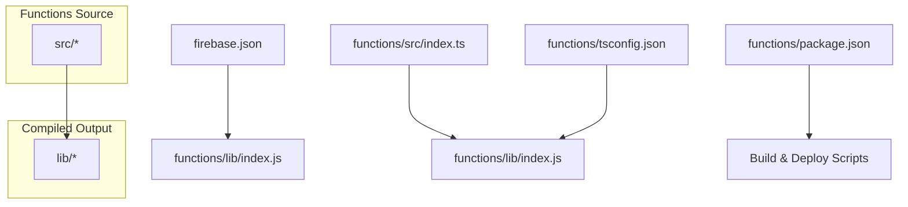

**Diagram sources**
- [firebase.json](file://firebase.json)
- [functions/src/index.ts](file://functions/src/index.ts)
- [functions/lib/index.js](file://functions/lib/index.js)
- [functions/package.json](file://functions/package.json)
- [functions/tsconfig.json](file://functions/tsconfig.json)

**Section sources**
- [firebase.json](file://firebase.json)
- [functions/package.json](file://functions/package.json)
- [functions/tsconfig.json](file://functions/tsconfig.json)
- [functions/src/index.ts](file://functions/src/index.ts)
- [functions/lib/index.js](file://functions/lib/index.js)

## Core Components
The functions are organized by domain and responsibility. Representative modules include:
- Tenant provisioning and field backfills: churchTenantProvisioning, churchTenantFields, churchTenantFieldsBackfill, churchWelcomeSeed
- Public-facing HTTP endpoints: publicSignupEmail, carteirinhaValidarPublic, tenantCallableResolve, churchCanonicalResolve
- Scheduled reminders and recurring tasks: financeVencimentoReminders, eventoReminders, receitasRecorrentesScheduled
- Storage lifecycle and media processing: storageDisplayUrls, storageCleanupOnFirestoreDelete, cleanupOrphanFiles, purgeStalePendingUploads, processChurchStorageMedia, gyMediaAttachments
- Authentication and access control: masterPlatformAuth, memberAccessPolicy, memberSessionSync
- Panel caching and dashboards: panelDashboardCache, panelFinanceSummary, panelPublicSiteCache, panelStatisticsCache, panelMediaPrefetch, panelFinanceAccountsCache
- Public site indexing and prefetch: publicChurchSlugIndex, publicSiteMediaPrefetch
- Master data caches: masterChurchesListCache, masterDashboardCache
- Chat engine operations: churchChatNotify, churchChatAdminPurge, churchChatDmThreadNormalize, churchChatPeerProfileSync, churchChatRetention
- Cluster synchronization and consolidation: churchClusterAnchors, syncChurchClusterData, consolidateBpcCluster
- Migration utilities: migrateTenantFirestoreCollections, migrateStorageConsolidated, purgeAnonymousAuthUsers
- Reporting and snapshots: reportsSnapshot, adminDb
- Church-specific integrations: churchMercadoPago, syncChurchMercadoPagoCluster, churchPdfGeneration, processarCertificadosLote, certificadosLote
- Notifications and branding: notificationBranding, pushNovoConteudo, shareEvento
- Member services: memberNotificationEmail, memberRegistrationNotify, memberCodigo, membersDirectoryCache
- Performance and path helpers: churchPerformancePack, churchFirestorePaths, churchStorageStructure

These modules collectively implement database triggers, HTTP endpoints, scheduled tasks, and background jobs that power the multi-tenant church management system.

**Section sources**
- [functions/src/churchTenantProvisioning.ts](file://functions/src/churchTenantProvisioning.ts)
- [functions/src/publicSignupEmail.ts](file://functions/src/publicSignupEmail.ts)
- [functions/src/financeVencimentoReminders.ts](file://functions/src/financeVencimentoReminders.ts)
- [functions/src/eventoReminders.ts](file://functions/src/eventoReminders.ts)
- [functions/src/receitasRecorrentesScheduled.ts](file://functions/src/receitasRecorrentesScheduled.ts)
- [functions/src/storageDisplayUrls.ts](file://functions/src/storageDisplayUrls.ts)
- [functions/src/storageCleanupOnFirestoreDelete.ts](file://functions/src/storageCleanupOnFirestoreDelete.ts)
- [functions/src/cleanupOrphanFiles.ts](file://functions/src/cleanupOrphanFiles.ts)
- [functions/src/purgeStalePendingUploads.ts](file://functions/src/purgeStalePendingUploads.ts)
- [functions/src/masterPlatformAuth.ts](file://functions/src/masterPlatformAuth.ts)
- [functions/src/memberAccessPolicy.ts](file://functions/src/memberAccessPolicy.ts)
- [functions/src/membroSessionSync.ts](file://functions/src/membroSessionSync.ts)
- [functions/src/panelDashboardCache.ts](file://functions/src/panelDashboardCache.ts)
- [functions/src/panelFinanceSummary.ts](file://functions/src/panelFinanceSummary.ts)
- [functions/src/panelPublicSiteCache.ts](file://functions/src/panelPublicSiteCache.ts)
- [functions/src/panelStatisticsCache.ts](file://functions/src/panelStatisticsCache.ts)
- [functions/src/panelMediaPrefetch.ts](file://functions/src/panelMediaPrefetch.ts)
- [functions/src/publicChurchSlugIndex.ts](file://functions/src/publicChurchSlugIndex.ts)
- [functions/src/masterChurchesListCache.ts](file://functions/src/masterChurchesListCache.ts)
- [functions/src/masterDashboardCache.ts](file://functions/src/masterDashboardCache.ts)
- [functions/src/churchCanonicalResolve.ts](file://functions/src/churchCanonicalResolve.ts)
- [functions/src/tenantCallableResolve.ts](file://functions/src/tenantCallableResolve.ts)
- [functions/src/churchStorageStructure.ts](file://functions/src/churchStorageStructure.ts)
- [functions/src/processarCertificadosLote.ts](file://functions/src/processarCertificadosLote.ts)
- [functions/src/certificadosLote.ts](file://functions/src/certificadosLote.ts)
- [functions/src/churchPdfGeneration.ts](file://functions/src/churchPdfGeneration.ts)
- [functions/src/churchMercadoPago.ts](file://functions/src/churchMercadoPago.ts)
- [functions/src/syncChurchMercadoPagoCluster.ts](file://functions/src/syncChurchMercadoPagoCluster.ts)
- [functions/src/churchChatNotify.ts](file://functions/src/churchChatNotify.ts)
- [functions/src/churchChatAdminPurge.ts](file://functions/src/churchChatAdminPurge.ts)
- [functions/src/churchChatDmThreadNormalize.ts](file://functions/src/churchChatDmThreadNormalize.ts)
- [functions/src/churchChatPeerProfileSync.ts](file://functions/src/churchChatPeerProfileSync.ts)
- [functions/src/churchChatRetention.ts](file://functions/src/churchChatRetention.ts)
- [functions/src/churchClusterAnchors.ts](file://functions/src/churchClusterAnchors.ts)
- [functions/src/syncChurchClusterData.ts](file://functions/src/syncChurchClusterData.ts)
- [functions/src/consolidateBpcCluster.ts](file://functions/src/consolidateBpcCluster.ts)
- [functions/src/migrateTenantFirestoreCollections.ts](file://functions/src/migrateTenantFirestoreCollections.ts)
- [functions/src/migrateStorageConsolidated.ts](file://functions/src/migrateStorageConsolidated.ts)
- [functions/src/purgeAnonymousAuthUsers.ts](file://functions/src/purgeAnonymousAuthUsers.ts)
- [functions/src/gyMediaAttachments.ts](file://functions/src/gyMediaAttachments.ts)
- [functions/src/notificationBranding.ts](file://functions/src/notificationBranding.ts)
- [functions/src/shareEvento.ts](file://functions/src/shareEvento.ts)
- [functions/src/pushNovoConteudo.ts](file://functions/src/pushNovoConteudo.ts)
- [functions/src/reportsSnapshot.ts](file://functions/src/reportsSnapshot.ts)
- [functions/src/adminDb.ts](file://functions/src/adminDb.ts)
- [functions/src/churchRootCountersMirror.ts](file://functions/src/churchRootCountersMirror.ts)
- [functions/src/churchTenantFields.ts](file://functions/src/churchTenantFields.ts)
- [functions/src/churchTenantFieldsBackfill.ts](file://functions/src/churchTenantFieldsBackfill.ts)
- [functions/src/churchWelcomeSeed.ts](file://functions/src/churchWelcomeSeed.ts)
- [functions/src/churchPerformancePack.ts](file://functions/src/churchPerformancePack.ts)
- [functions/src/churchFirestorePaths.ts](file://functions/src/churchFirestorePaths.ts)
- [functions/src/membersDirectoryCache.ts](file://functions/src/membersDirectoryCache.ts)
- [functions/src/panelFinanceAccountsCache.ts](file://functions/src/panelFinanceAccountsCache.ts)
- [functions/src/publicSiteMediaPrefetch.ts](file://functions/src/publicSiteMediaPrefetch.ts)
- [functions/src/forbiddenTestChurchIds.ts](file://functions/src/forbiddenTestChurchIds.ts)
- [functions/src/carteirinhaValidarPublic.ts](file://functions/src/carteirinhaValidarPublic.ts)
- [functions/src/carteiraSignatoriesIndex.ts](file://functions/src/carteiraSignatoriesIndex.ts)
- [functions/src/memberNotificationEmail.ts](file://functions/src/memberNotificationEmail.ts)
- [functions/src/memberRegistrationNotify.ts](file://functions/src/memberRegistrationNotify.ts)
- [functions/src/memberCodigo.ts](file://functions/src/memberCodigo.ts)
- [functions/src/pastoralComms.ts](file://functions/src/pastoralComms.ts)
- [functions/src/processChurchStorageMedia.ts](file://functions/src/processChurchStorageMedia.ts)

## Architecture Overview
At a high level, the serverless backend integrates with Firebase services:
- Firestore triggers drive data synchronization, caching, and business logic.
- HTTPS callable endpoints expose APIs to clients.
- Pub/Sub schedules run periodic tasks like reminders and maintenance.
- Storage events trigger media processing and cleanup.

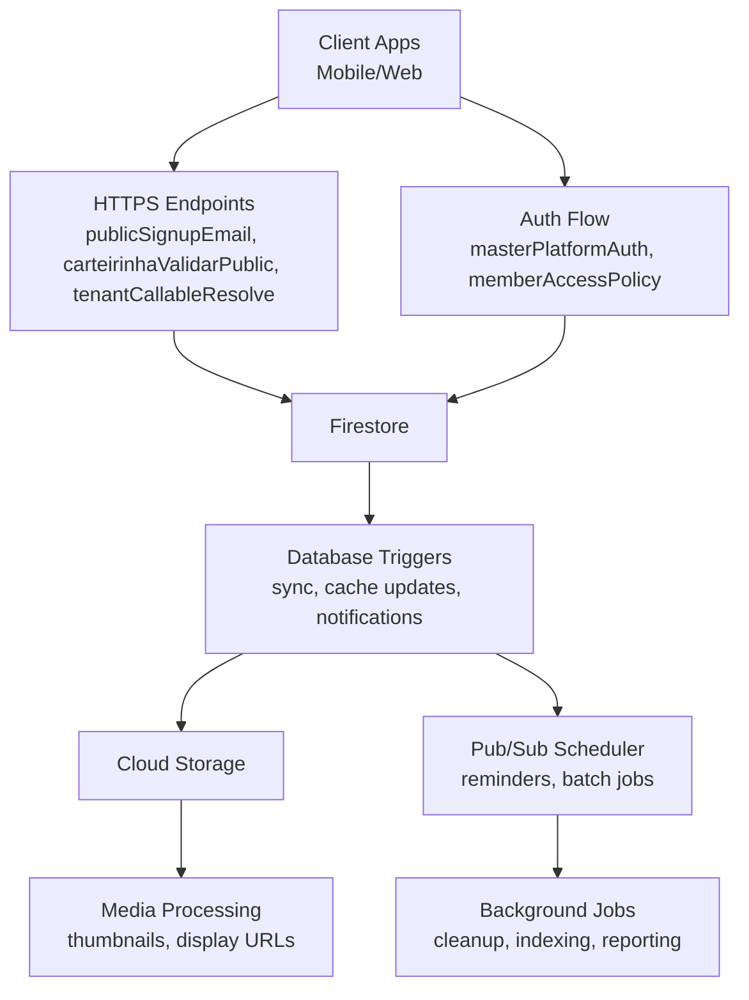

**Diagram sources**
- [functions/src/publicSignupEmail.ts](file://functions/src/publicSignupEmail.ts)
- [functions/src/carteirinhaValidarPublic.ts](file://functions/src/carteirinhaValidarPublic.ts)
- [functions/src/tenantCallableResolve.ts](file://functions/src/tenantCallableResolve.ts)
- [functions/src/masterPlatformAuth.ts](file://functions/src/masterPlatformAuth.ts)
- [functions/src/memberAccessPolicy.ts](file://functions/src/memberAccessPolicy.ts)
- [functions/src/financeVencimentoReminders.ts](file://functions/src/financeVencimentoReminders.ts)
- [functions/src/eventoReminders.ts](file://functions/src/eventoReminders.ts)
- [functions/src/receitasRecorrentesScheduled.ts](file://functions/src/receitasRecorrentesScheduled.ts)
- [functions/src/storageDisplayUrls.ts](file://functions/src/storageDisplayUrls.ts)
- [functions/src/storageCleanupOnFirestoreDelete.ts](file://functions/src/storageCleanupOnFirestoreDelete.ts)

## Detailed Component Analysis

### Database Triggers and Data Synchronization
Triggers respond to Firestore writes to maintain consistency, update caches, and orchestrate cross-service actions. Examples include:
- Syncing cluster data and anchors for chat and tenant structures.
- Mirroring counters and fields for performance.
- Backfilling tenant fields and seeding welcome data.

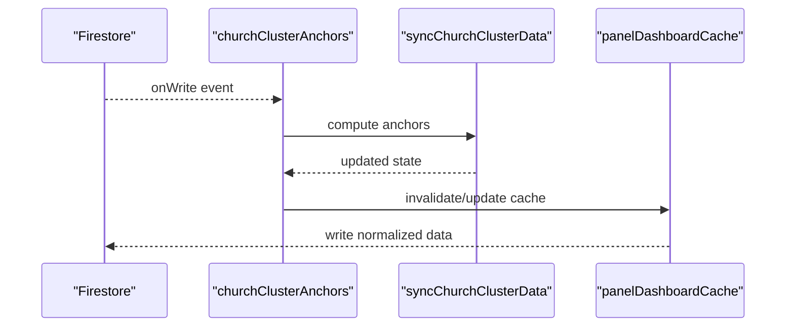

**Diagram sources**
- [functions/src/churchClusterAnchors.ts](file://functions/src/churchClusterAnchors.ts)
- [functions/src/syncChurchClusterData.ts](file://functions/src/syncChurchClusterData.ts)
- [functions/src/panelDashboardCache.ts](file://functions/src/panelDashboardCache.ts)

**Section sources**
- [functions/src/churchClusterAnchors.ts](file://functions/src/churchClusterAnchors.ts)
- [functions/src/syncChurchClusterData.ts](file://functions/src/syncChurchClusterData.ts)
- [functions/src/churchRootCountersMirror.ts](file://functions/src/churchRootCountersMirror.ts)
- [functions/src/chessTenantFieldsBackfill.ts](file://functions/src/churchTenantFieldsBackfill.ts)
- [functions/src/churchWelcomeSeed.ts](file://functions/src/churchWelcomeSeed.ts)

### HTTP Endpoints and Callable Functions
Public-facing endpoints handle user registration, validation, and tenant resolution:
- publicSignupEmail: processes sign-up requests and sends confirmation emails.
- carteirinhaValidarPublic: validates public credentials or identifiers.
- tenantCallableResolve: resolves tenant context for callable invocations.

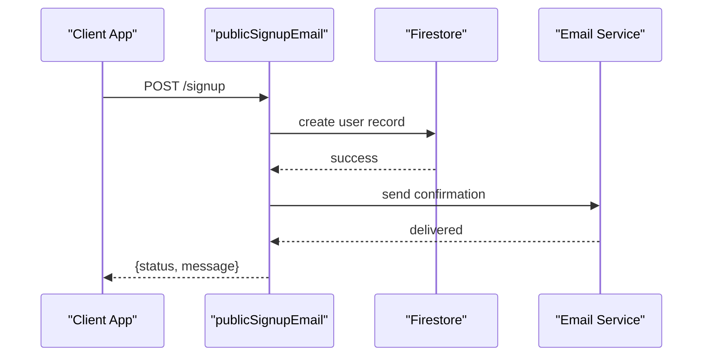

**Diagram sources**
- [functions/src/publicSignupEmail.ts](file://functions/src/publicSignupEmail.ts)
- [functions/src/carteirinhaValidarPublic.ts](file://functions/src/carteirinhaValidarPublic.ts)
- [functions/src/tenantCallableResolve.ts](file://functions/src/tenantCallableResolve.ts)

**Section sources**
- [functions/src/publicSignupEmail.ts](file://functions/src/publicSignupEmail.ts)
- [functions/src/carteirinhaValidarPublic.ts](file://functions/src/carteirinhaValidarPublic.ts)
- [functions/src/tenantCallableResolve.ts](file://functions/src/tenantCallableResolve.ts)

### Scheduled Tasks and Reminders
Periodic tasks ensure timely notifications and recurring operations:
- financeVencimentoReminders: checks due financial items and sends reminders.
- eventoReminders: prepares event reminders based on schedules.
- receitasRecorrentesScheduled: handles recurring revenue entries.

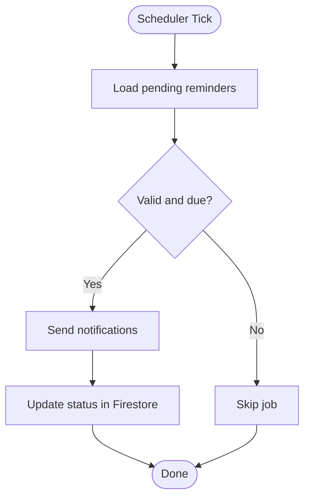

**Diagram sources**
- [functions/src/financeVencimentoReminders.ts](file://functions/src/financeVencimentoReminders.ts)
- [functions/src/eventoReminders.ts](file://functions/src/eventoReminders.ts)
- [functions/src/receitasRecorrentesScheduled.ts](file://functions/src/receitasRecorrentesScheduled.ts)

**Section sources**
- [functions/src/financeVencimentoReminders.ts](file://functions/src/financeVencimentoReminders.ts)
- [functions/src/eventoReminders.ts](file://functions/src/eventoReminders.ts)
- [functions/src/receitasRecorrentesScheduled.ts](file://functions/src/receitasRecorrentesScheduled.ts)

### Storage Lifecycle and Media Processing
Storage events trigger media transformations and cleanup:
- storageDisplayUrls: generates display URLs for assets.
- storageCleanupOnFirestoreDelete: removes orphaned files when records are deleted.
- cleanupOrphanFiles and purgeStalePendingUploads: maintenance jobs to keep storage tidy.

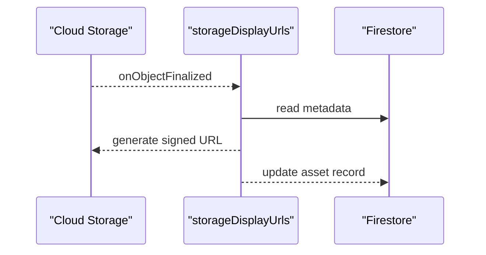

**Diagram sources**
- [functions/src/storageDisplayUrls.ts](file://functions/src/storageDisplayUrls.ts)
- [functions/src/storageCleanupOnFirestoreDelete.ts](file://functions/src/storageCleanupOnFirestoreDelete.ts)
- [functions/src/cleanupOrphanFiles.ts](file://functions/src/cleanupOrphanFiles.ts)
- [functions/src/purgeStalePendingUploads.ts](file://functions/src/purgeStalePendingUploads.ts)

**Section sources**
- [functions/src/storageDisplayUrls.ts](file://functions/src/storageDisplayUrls.ts)
- [functions/src/storageCleanupOnFirestoreDelete.ts](file://functions/src/storageCleanupOnFirestoreDelete.ts)
- [functions/src/cleanupOrphanFiles.ts](file://functions/src/cleanupOrphanFiles.ts)
- [functions/src/purgeStalePendingUploads.ts](file://functions/src/purgeStalePendingUploads.ts)

### Authentication and Access Control
Authentication flows and policy enforcement ensure secure access:
- masterPlatformAuth: centralizes platform-level authentication.
- memberAccessPolicy: enforces role-based access policies.
- membroSessionSync: synchronizes session state across tenants.

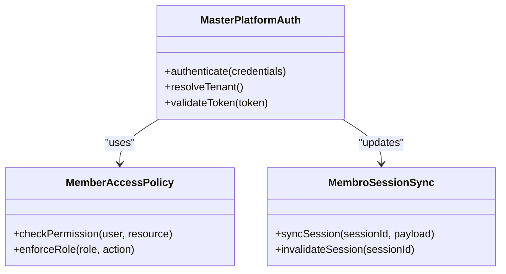

**Diagram sources**
- [functions/src/masterPlatformAuth.ts](file://functions/src/masterPlatformAuth.ts)
- [functions/src/memberAccessPolicy.ts](file://functions/src/memberAccessPolicy.ts)
- [functions/src/membroSessionSync.ts](file://functions/src/membroSessionSync.ts)

**Section sources**
- [functions/src/masterPlatformAuth.ts](file://functions/src/masterPlatformAuth.ts)
- [functions/src/memberAccessPolicy.ts](file://functions/src/memberAccessPolicy.ts)
- [functions/src/membroSessionSync.ts](file://functions/src/membroSessionSync.ts)

### Panel Caching and Dashboards
Caching functions optimize dashboard performance by precomputing summaries and indexes:
- panelDashboardCache: aggregates metrics for the main dashboard.
- panelFinanceSummary and panelFinanceAccountsCache: financial summaries and account listings.
- panelPublicSiteCache and panelStatisticsCache: public site and statistics caches.
- panelMediaPrefetch: preloads media assets for faster rendering.

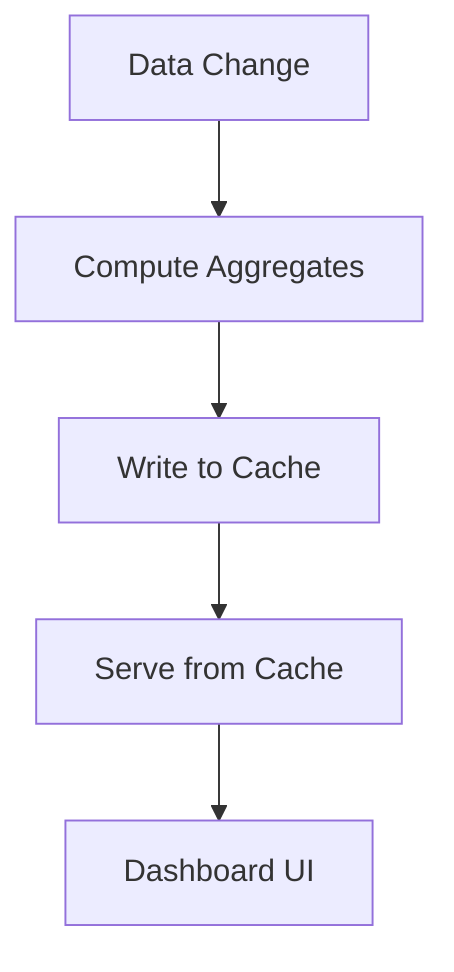

**Diagram sources**
- [functions/src/panelDashboardCache.ts](file://functions/src/panelDashboardCache.ts)
- [functions/src/panelFinanceSummary.ts](file://functions/src/panelFinanceSummary.ts)
- [functions/src/panelFinanceAccountsCache.ts](file://functions/src/panelFinanceAccountsCache.ts)
- [functions/src/panelPublicSiteCache.ts](file://functions/src/panelPublicSiteCache.ts)
- [functions/src/panelStatisticsCache.ts](file://functions/src/panelStatisticsCache.ts)
- [functions/src/panelMediaPrefetch.ts](file://functions/src/panelMediaPrefetch.ts)

**Section sources**
- [functions/src/panelDashboardCache.ts](file://functions/src/panelDashboardCache.ts)
- [functions/src/panelFinanceSummary.ts](file://functions/src/panelFinanceSummary.ts)
- [functions/src/panelFinanceAccountsCache.ts](file://functions/src/panelFinanceAccountsCache.ts)
- [functions/src/panelPublicSiteCache.ts](file://functions/src/panelPublicSiteCache.ts)
- [functions/src/panelStatisticsCache.ts](file://functions/src/panelStatisticsCache.ts)
- [functions/src/panelMediaPrefetch.ts](file://functions/src/panelMediaPrefetch.ts)

### Chat Engine Operations
Chat-related functions manage notifications, moderation, normalization, retention, and peer profile synchronization:
- churchChatNotify: dispatches chat notifications.
- churchChatAdminPurge: purges content based on admin actions.
- churchChatDmThreadNormalize: normalizes DM threads.
- churchChatPeerProfileSync: keeps peer profiles consistent.
- churchChatRetention: applies retention policies.

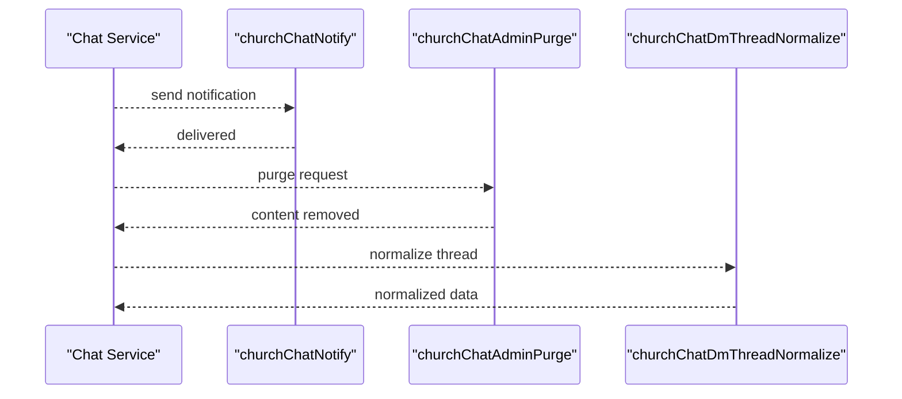

**Diagram sources**
- [functions/src/churchChatNotify.ts](file://functions/src/churchChatNotify.ts)
- [functions/src/churchChatAdminPurge.ts](file://functions/src/churchChatAdminPurge.ts)
- [functions/src/churchChatDmThreadNormalize.ts](file://functions/src/churchChatDmThreadNormalize.ts)
- [functions/src/churchChatPeerProfileSync.ts](file://functions/src/churchChatPeerProfileSync.ts)
- [functions/src/churchChatRetention.ts](file://functions/src/churchChatRetention.ts)

**Section sources**
- [functions/src/churchChatNotify.ts](file://functions/src/churchChatNotify.ts)
- [functions/src/churchChatAdminPurge.ts](file://functions/src/churchChatAdminPurge.ts)
- [functions/src/churchChatDmThreadNormalize.ts](file://functions/src/churchChatDmThreadNormalize.ts)
- [functions/src/churchChatPeerProfileSync.ts](file://functions/src/churchChatPeerProfileSync.ts)
- [functions/src/churchChatRetention.ts](file://functions/src/churchChatRetention.ts)

### Migration Utilities and Maintenance
Migration functions assist with data transitions and cleanup:
- migrateTenantFirestoreCollections: migrates collections for tenants.
- migrateStorageConsolidated: consolidates storage paths.
- purgeAnonymousAuthUsers: removes anonymous users.

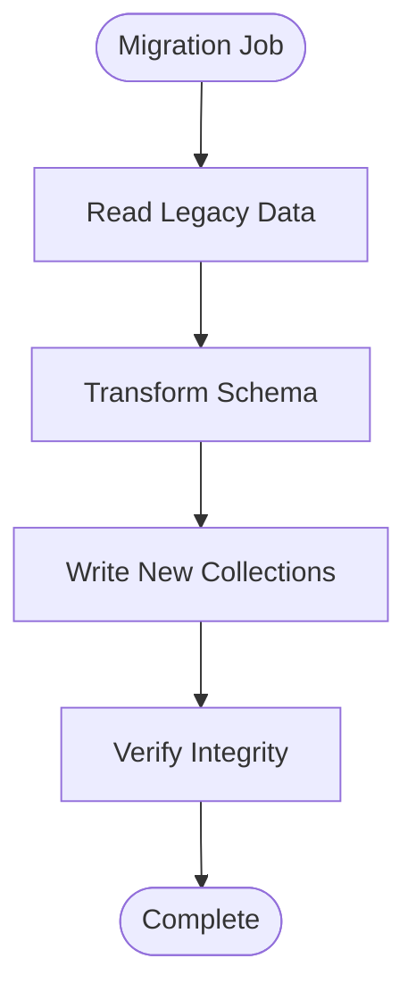

**Diagram sources**
- [functions/src/migrateTenantFirestoreCollections.ts](file://functions/src/migrateTenantFirestoreCollections.ts)
- [functions/src/migrateStorageConsolidated.ts](file://functions/src/migrateStorageConsolidated.ts)
- [functions/src/purgeAnonymousAuthUsers.ts](file://functions/src/purgeAnonymousAuthUsers.ts)

**Section sources**
- [functions/src/migrateTenantFirestoreCollections.ts](file://functions/src/migrateTenantFirestoreCollections.ts)
- [functions/src/migrateStorageConsolidated.ts](file://functions/src/migrateStorageConsolidated.ts)
- [functions/src/purgeAnonymousAuthUsers.ts](file://functions/src/purgeAnonymousAuthUsers.ts)

## Dependency Analysis
Dependencies are managed through npm packages defined in functions/package.json. The build process compiles TypeScript sources into lib using tsconfig.json. The Firebase configuration in firebase.json references the compiled index.js as the entry point.

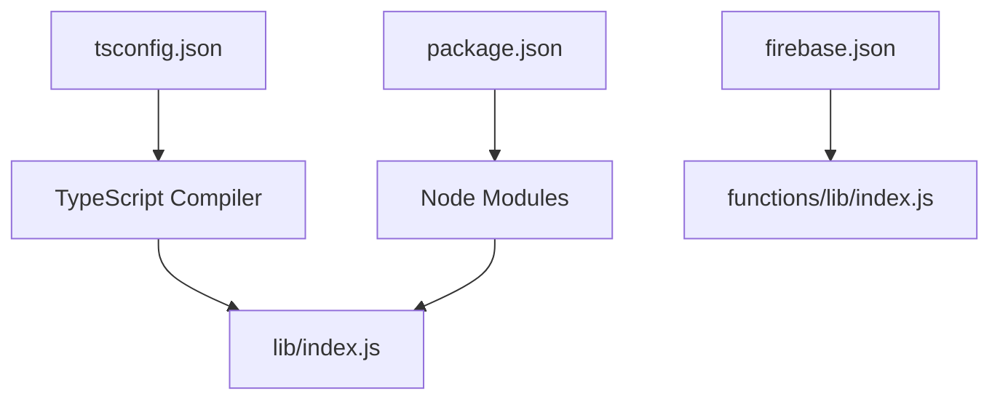

**Diagram sources**
- [functions/package.json](file://functions/package.json)
- [functions/tsconfig.json](file://functions/tsconfig.json)
- [functions/lib/index.js](file://functions/lib/index.js)
- [firebase.json](file://firebase.json)

**Section sources**
- [functions/package.json](file://functions/package.json)
- [functions/tsconfig.json](file://functions/tsconfig.json)
- [functions/lib/index.js](file://functions/lib/index.js)
- [firebase.json](file://firebase.json)

## Performance Considerations
- Cold start optimization: Keep initialization lightweight; defer heavy work to request handlers. Use connection pooling for external services where applicable.
- Resource allocation: Configure memory and timeout appropriately per function type (short-lived vs long-running).
- Caching: Leverage panel caches and public site caches to reduce database load.
- Batch operations: Group writes and reads to minimize round trips.
- Monitoring: Use structured logging and observability tools to identify bottlenecks.

[No sources needed since this section provides general guidance]

## Troubleshooting Guide
Common issues and resolutions:
- Deployment failures: Check firebase.json entry points and ensure lib/index.js exists.
- Permission errors: Review masterPlatformAuth and memberAccessPolicy implementations.
- Storage cleanup not triggering: Verify storage rules and event bindings.
- Scheduled tasks not running: Confirm Pub/Sub subscriptions and cron configurations.
- Logging and debugging: Enable verbose logs in development and use centralized log aggregation.

**Section sources**
- [functions/src/masterPlatformAuth.ts](file://functions/src/masterPlatformAuth.ts)
- [functions/src/memberAccessPolicy.ts](file://functions/src/memberAccessPolicy.ts)
- [functions/src/storageCleanupOnFirestoreDelete.ts](file://functions/src/storageCleanupOnFirestoreDelete.ts)
- [functions/src/financeVencimentoReminders.ts](file://functions/src/financeVencimentoReminders.ts)

## Conclusion
The cloud functions architecture in Gestão Yahweh Premium is modular, scalable, and well-organized. By following the established patterns for triggers, HTTP endpoints, scheduled tasks, and storage lifecycle management, teams can extend functionality while maintaining performance and reliability. Adhering to TypeScript standards, robust error handling, and comprehensive logging ensures maintainability and operational excellence.

[No sources needed since this section summarizes without analyzing specific files]

## Appendices

### Naming Conventions and Module Organization
- File names reflect functional domains (e.g., church*, panel*, member*, storage*).
- Each file encapsulates a single responsibility or cohesive set of related operations.
- Shared utilities should be extracted into common modules to avoid duplication.

### Testing Approaches
- Unit tests for individual functions using mocking frameworks.
- Integration tests for Firestore triggers and storage events.
- End-to-end tests for HTTP endpoints and callable functions.

### Adding New Functions
- Create a new TypeScript file under functions/src with clear responsibilities.
- Export the function handler and register it in functions/src/index.ts if needed.
- Update firebase.json if introducing new HTTPS endpoints or triggers.
- Add corresponding unit and integration tests.

[No sources needed since this section provides general guidance]