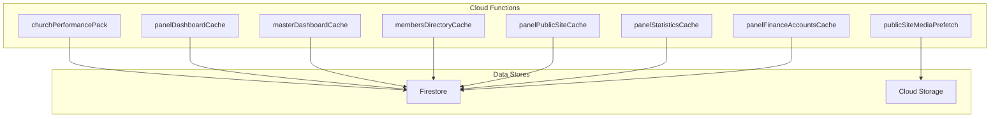
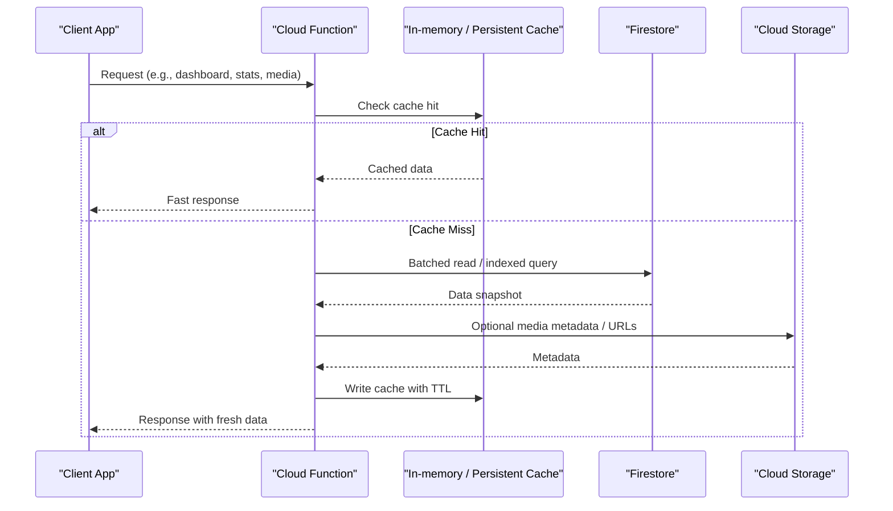
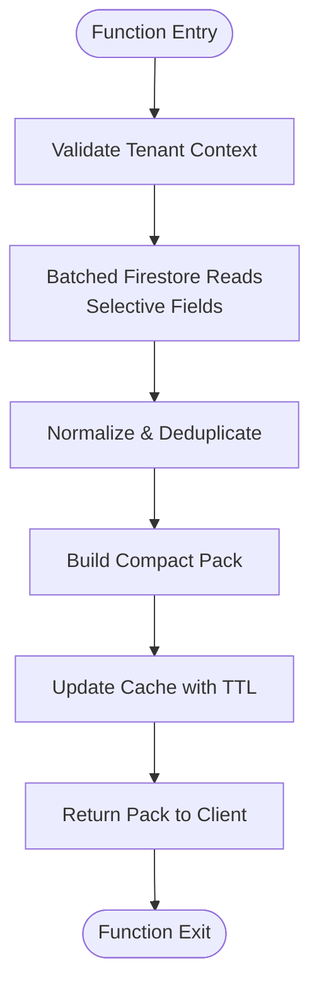
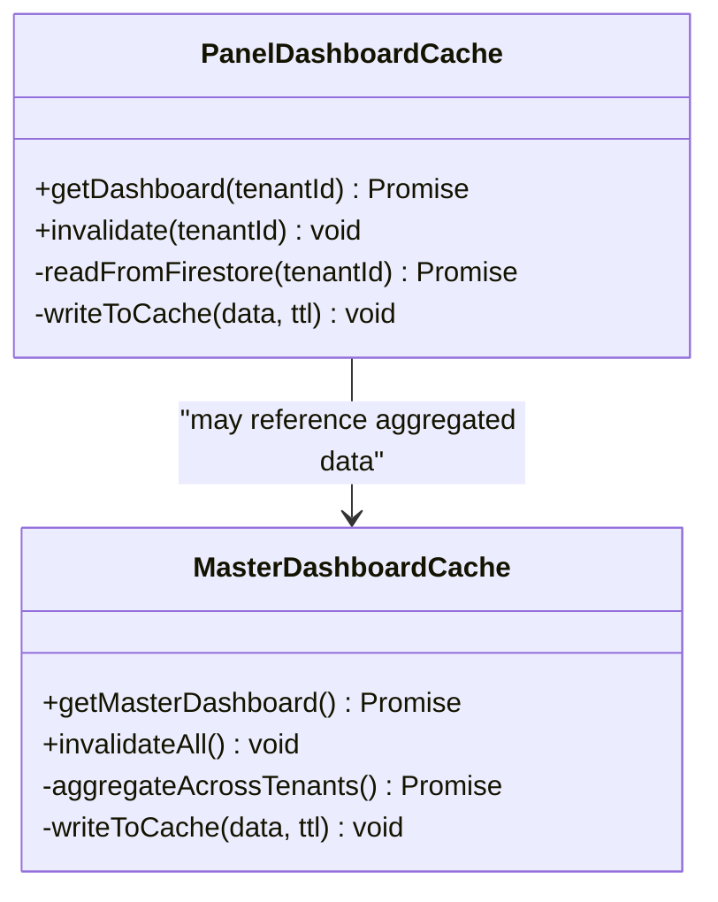
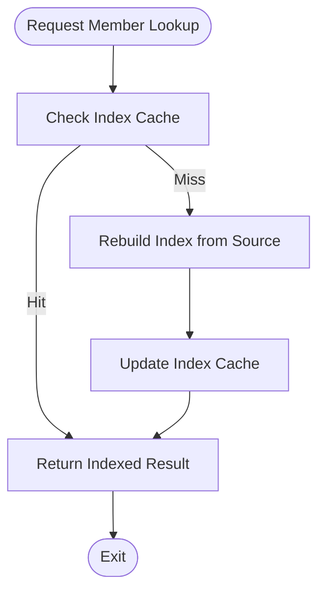
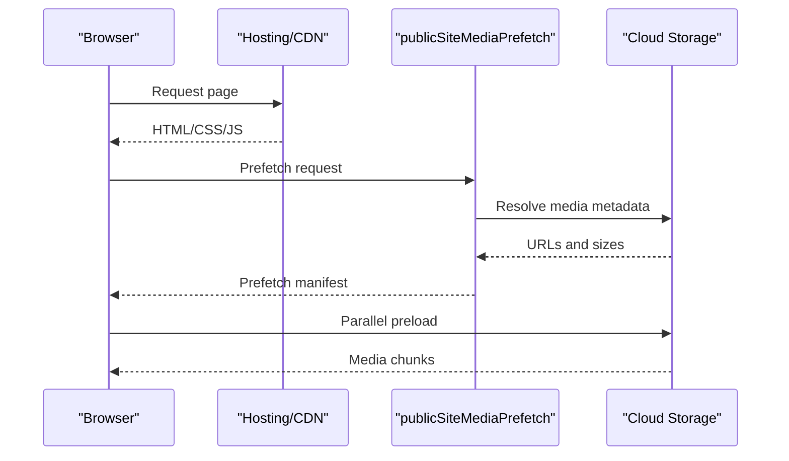
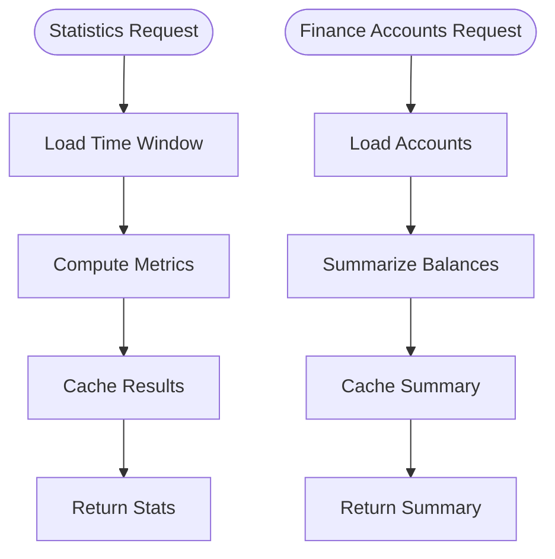
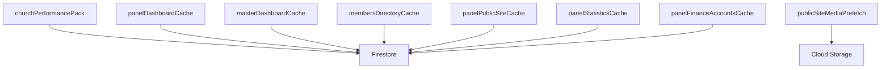

# Performance Optimization & Monitoring

<cite>
**Referenced Files in This Document**
- [functions/src/churchPerformancePack.ts](file://functions/src/churchPerformancePack.ts)
- [functions/lib/churchPerformancePack.js](file://functions/lib/churchPerformancePack.js)
- [functions/src/panelDashboardCache.ts](file://functions/src/panelDashboardCache.ts)
- [functions/lib/panelDashboardCache.js](file://functions/lib/panelDashboardCache.js)
- [functions/src/masterDashboardCache.ts](file://functions/src/masterDashboardCache.ts)
- [functions/lib/masterDashboardCache.js](file://functions/lib/masterDashboardCache.js)
- [functions/src/membersDirectoryCache.ts](file://functions/src/membersDirectoryCache.ts)
- [functions/lib/membersDirectoryCache.js](file://functions/lib/membersDirectoryCache.js)
- [functions/src/panelPublicSiteCache.ts](file://functions/src/panelPublicSiteCache.ts)
- [functions/lib/panelPublicSiteCache.js](file://functions/lib/panelPublicSiteCache.js)
- [functions/src/publicSiteMediaPrefetch.ts](file://functions/src/publicSiteMediaPrefetch.ts)
- [functions/lib/publicSiteMediaPrefetch.js](file://functions/lib/publicSiteMediaPrefetch.js)
- [functions/src/panelStatisticsCache.ts](file://functions/src/panelStatisticsCache.ts)
- [functions/lib/panelStatisticsCache.js](file://functions/lib/panelStatisticsCache.js)
- [functions/src/panelFinanceAccountsCache.ts](file://functions/src/panelFinanceAccountsCache.ts)
- [functions/lib/panelFinanceAccountsCache.js](file://functions/lib/panelFinanceAccountsCache.js)
- [functions/src/index.ts](file://functions/src/index.ts)
- [functions/src/index.js](file://functions/lib/index.js)
- [functions/package.json](file://functions/package.json)
- [firebase.json](file://firebase.json)
- [firestore.rules](file://firestore.rules)
- [storage.rules](file://storage.rules)
- [PERFORMANCE_REPORT.md](file://PERFORMANCE_REPORT.md)
- [PONTO_BASE_MEMORIA_2026-07-24_11.2.305+2134.md](file://PONTO_BASE_MEMORIA_2026-07-24_11.2.305+2134.md)
</cite>

## Table of Contents
1. [Introduction](#introduction)
2. [Project Structure](#project-structure)
3. [Core Components](#core-components)
4. [Architecture Overview](#architecture-overview)
5. [Detailed Component Analysis](#detailed-component-analysis)
6. [Dependency Analysis](#dependency-analysis)
7. [Performance Considerations](#performance-considerations)
8. [Troubleshooting Guide](#troubleshooting-guide)
9. [Conclusion](#conclusion)
10. [Appendices](#appendices)

## Introduction
This document provides comprehensive guidance for performance optimization and monitoring strategies in cloud functions, focusing on caching mechanisms, database query optimization, memory management, and cost control. It explains how the project implements performance pack generation, dashboard caching, directory caching, and media prefetching to improve response times. It also covers cache invalidation patterns, function metrics monitoring, bottleneck identification, cold start optimization, sizing recommendations, and debugging techniques.

## Project Structure
The cloud functions are implemented under the functions directory with TypeScript sources compiled to JavaScript. Caching-focused functions include:
- Performance pack generation for tenant-specific data aggregation
- Dashboard caches for panel and master views
- Members directory cache for fast lookups
- Public site cache and media prefetch for improved web performance
- Statistics and finance account caches for analytics and reporting

**Diagram sources**
- [functions/src/churchPerformancePack.ts](file://functions/src/churchPerformancePack.ts)
- [functions/src/panelDashboardCache.ts](file://functions/src/panelDashboardCache.ts)
- [functions/src/masterDashboardCache.ts](file://functions/src/masterDashboardCache.ts)
- [functions/src/membersDirectoryCache.ts](file://functions/src/membersDirectoryCache.ts)
- [functions/src/panelPublicSiteCache.ts](file://functions/src/panelPublicSiteCache.ts)
- [functions/src/publicSiteMediaPrefetch.ts](file://functions/src/publicSiteMediaPrefetch.ts)
- [functions/src/panelStatisticsCache.ts](file://functions/src/panelStatisticsCache.ts)
- [functions/src/panelFinanceAccountsCache.ts](file://functions/src/panelFinanceAccountsCache.ts)

**Section sources**
- [functions/src/index.ts](file://functions/src/index.ts)
- [functions/lib/index.js](file://functions/lib/index.js)
- [functions/package.json](file://functions/package.json)
- [firebase.json](file://firebase.json)

## Core Components
Key components that drive performance optimization and monitoring:
- churchPerformancePack: Aggregates and generates a compact performance pack per tenant to reduce client-side queries and payload size.
- panelDashboardCache: Caches dashboard data for the admin panel to minimize Firestore reads and latency.
- masterDashboardCache: Provides a consolidated view across tenants or master-level dashboards.
- membersDirectoryCache: Maintains an optimized index for member lookups and search.
- panelPublicSiteCache: Caches public-facing content for faster rendering.
- publicSiteMediaPrefetch: Preloads critical media assets to improve perceived performance.
- panelStatisticsCache: Caches statistics used by analytics dashboards.
- panelFinanceAccountsCache: Caches financial accounts data for quick access.

These components implement consistent patterns:
- Read-heavy operations are cached with TTLs and invalidation triggers.
- Batched reads and selective field projections reduce Firestore costs.
- Media prefetch reduces time-to-first-byte for public sites.

**Section sources**
- [functions/src/churchPerformancePack.ts](file://functions/src/churchPerformancePack.ts)
- [functions/src/panelDashboardCache.ts](file://functions/src/panelDashboardCache.ts)
- [functions/src/masterDashboardCache.ts](file://functions/src/masterDashboardCache.ts)
- [functions/src/membersDirectoryCache.ts](file://functions/src/membersDirectoryCache.ts)
- [functions/src/panelPublicSiteCache.ts](file://functions/src/panelPublicSiteCache.ts)
- [functions/src/publicSiteMediaPrefetch.ts](file://functions/src/publicSiteMediaPrefetch.ts)
- [functions/src/panelStatisticsCache.ts](file://functions/src/panelStatisticsCache.ts)
- [functions/src/panelFinanceAccountsCache.ts](file://functions/src/panelFinanceAccountsCache.ts)

## Architecture Overview
The architecture centers around Firebase Cloud Functions orchestrating data aggregation and caching across Firestore and Cloud Storage. The flow emphasizes minimizing cold starts via lightweight handlers, batching reads, and using caches to serve repeated requests efficiently.

**Diagram sources**
- [functions/src/churchPerformancePack.ts](file://functions/src/churchPerformancePack.ts)
- [functions/src/panelDashboardCache.ts](file://functions/src/panelDashboardCache.ts)
- [functions/src/publicSiteMediaPrefetch.ts](file://functions/src/publicSiteMediaPrefetch.ts)

## Detailed Component Analysis

### Performance Pack Generation
The performance pack generator aggregates tenant-specific data into a compact structure to reduce network payloads and subsequent client-side queries. It typically:
- Reads required collections with selective fields
- Normalizes and deduplicates records
- Writes a consolidated pack document or returns it directly
- Supports cache invalidation when underlying data changes

**Diagram sources**
- [functions/src/churchPerformancePack.ts](file://functions/src/churchPerformancePack.ts)
- [functions/lib/churchPerformancePack.js](file://functions/lib/churchPerformancePack.js)

**Section sources**
- [functions/src/churchPerformancePack.ts](file://functions/src/churchPerformancePack.ts)
- [functions/lib/churchPerformancePack.js](file://functions/lib/churchPerformancePack.js)

### Dashboard Caching Strategies
Two primary dashboard caches exist:
- panelDashboardCache: Optimizes admin panel responses by caching frequently accessed dashboard metrics and summaries.
- masterDashboardCache: Aggregates cross-tenant or master-level insights for platform-wide visibility.

Both implement:
- TTL-based caching to balance freshness and performance
- Invalidation hooks triggered by relevant writes
- Selective field projection to reduce Firestore reads

**Diagram sources**
- [functions/src/panelDashboardCache.ts](file://functions/src/panelDashboardCache.ts)
- [functions/src/masterDashboardCache.ts](file://functions/src/masterDashboardCache.ts)

**Section sources**
- [functions/src/panelDashboardCache.ts](file://functions/src/panelDashboardCache.ts)
- [functions/lib/panelDashboardCache.js](file://functions/lib/panelDashboardCache.js)
- [functions/src/masterDashboardCache.ts](file://functions/src/masterDashboardCache.ts)
- [functions/lib/masterDashboardCache.js](file://functions/lib/masterDashboardCache.js)

### Directory Caching for Improved Response Times
The members directory cache maintains an optimized index for member lookups and search queries. It:
- Builds indexes from source collections
- Serves fast lookups without heavy joins
- Invalidates on member updates or deletions

**Diagram sources**
- [functions/src/membersDirectoryCache.ts](file://functions/src/membersDirectoryCache.ts)
- [functions/lib/membersDirectoryCache.js](file://functions/lib/membersDirectoryCache.js)

**Section sources**
- [functions/src/membersDirectoryCache.ts](file://functions/src/membersDirectoryCache.ts)
- [functions/lib/membersDirectoryCache.js](file://functions/lib/membersDirectoryCache.js)

### Public Site Cache and Media Prefetch
The public site cache serves static or semi-static content quickly, while media prefetch preloads critical assets to reduce perceived latency.

**Diagram sources**
- [functions/src/panelPublicSiteCache.ts](file://functions/src/panelPublicSiteCache.ts)
- [functions/src/publicSiteMediaPrefetch.ts](file://functions/src/publicSiteMediaPrefetch.ts)

**Section sources**
- [functions/src/panelPublicSiteCache.ts](file://functions/src/panelPublicSiteCache.ts)
- [functions/lib/panelPublicSiteCache.js](file://functions/lib/panelPublicSiteCache.js)
- [functions/src/publicSiteMediaPrefetch.ts](file://functions/src/publicSiteMediaPrefetch.ts)
- [functions/lib/publicSiteMediaPrefetch.js](file://functions/lib/publicSiteMediaPrefetch.js)

### Statistics and Finance Account Caches
Statistics and finance caches optimize analytics and reporting dashboards by reducing repeated reads and computations. They:
- Aggregate metrics over time windows
- Cache results with appropriate TTLs
- Invalidate upon significant data changes

**Diagram sources**
- [functions/src/panelStatisticsCache.ts](file://functions/src/panelStatisticsCache.ts)
- [functions/src/panelFinanceAccountsCache.ts](file://functions/src/panelFinanceAccountsCache.ts)

**Section sources**
- [functions/src/panelStatisticsCache.ts](file://functions/src/panelStatisticsCache.ts)
- [functions/lib/panelStatisticsCache.js](file://functions/lib/panelStatisticsCache.js)
- [functions/src/panelFinanceAccountsCache.ts](file://functions/src/panelFinanceAccountsCache.ts)
- [functions/lib/panelFinanceAccountsCache.js](file://functions/lib/panelFinanceAccountsCache.js)

## Dependency Analysis
Functions depend on Firestore and Cloud Storage, with some relying on external services for authentication or payments. The dependency graph highlights direct interactions and potential bottlenecks.

**Diagram sources**
- [functions/src/churchPerformancePack.ts](file://functions/src/churchPerformancePack.ts)
- [functions/src/panelDashboardCache.ts](file://functions/src/panelDashboardCache.ts)
- [functions/src/masterDashboardCache.ts](file://functions/src/masterDashboardCache.ts)
- [functions/src/membersDirectoryCache.ts](file://functions/src/membersDirectoryCache.ts)
- [functions/src/panelPublicSiteCache.ts](file://functions/src/panelPublicSiteCache.ts)
- [functions/src/publicSiteMediaPrefetch.ts](file://functions/src/publicSiteMediaPrefetch.ts)
- [functions/src/panelStatisticsCache.ts](file://functions/src/panelStatisticsCache.ts)
- [functions/src/panelFinanceAccountsCache.ts](file://functions/src/panelFinanceAccountsCache.ts)

**Section sources**
- [functions/package.json](file://functions/package.json)
- [firebase.json](file://firebase.json)

## Performance Considerations
- Cold Starts: Keep initialization lightweight; defer heavy work to request handlers. Use connection pooling where applicable.
- Memory Management: Avoid retaining large objects in memory across invocations; clear references after use. Monitor heap usage and set appropriate memory limits.
- Database Query Optimization: Use selective field projections, composite indexes, and batch reads. Avoid N+1 queries by aggregating at the server side.
- Cache Invalidation: Implement event-driven invalidation on write paths to maintain consistency without sacrificing performance.
- Cost Control: Minimize Firestore reads/writes through caching and aggregation. Prefer streaming and pagination for large datasets.
- Function Sizing: Right-size memory and timeout settings based on observed usage patterns. Larger instances can reduce cold starts but increase cost.
- Monitoring: Instrument key metrics (latency, error rates, cache hit ratios). Use structured logging and centralized observability.

[No sources needed since this section provides general guidance]

## Troubleshooting Guide
Common issues and debugging steps:
- High Latency: Inspect Firestore query plans and ensure proper indexing. Profile function execution timelines.
- Memory Leaks: Detect retained objects and excessive allocations. Use memory profiling tools and review long-lived variables.
- Cache Staleness: Verify TTL configurations and invalidation triggers. Add cache versioning to prevent stale reads.
- Cold Start Spikes: Analyze initialization code and dependencies. Consider warm-up strategies or provisioned concurrency if supported.
- Cost Spikes: Audit read/write patterns and cache effectiveness. Optimize queries and reduce redundant operations.

**Section sources**
- [PERFORMANCE_REPORT.md](file://PERFORMANCE_REPORT.md)
- [PONTO_BASE_MEMORIA_2026-07-24_11.2.305+2134.md](file://PONTO_BASE_MEMORIA_2026-07-24_11.2.305+2134.md)

## Conclusion
By implementing robust caching strategies, optimizing database queries, managing memory effectively, and monitoring function metrics, the system achieves responsive performance and cost efficiency. The documented components provide a foundation for scalable cloud function architectures tailored to multi-tenant environments.

[No sources needed since this section summarizes without analyzing specific files]

## Appendices
- Security Rules: Ensure Firestore and Storage rules align with caching and prefetching patterns to avoid unauthorized access.
- Deployment Configuration: Review firebase.json and package.json for environment-specific optimizations and dependencies.

**Section sources**
- [firestore.rules](file://firestore.rules)
- [storage.rules](file://storage.rules)
- [firebase.json](file://firebase.json)
- [functions/package.json](file://functions/package.json)