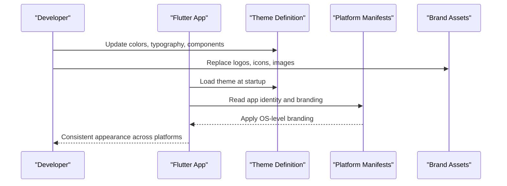
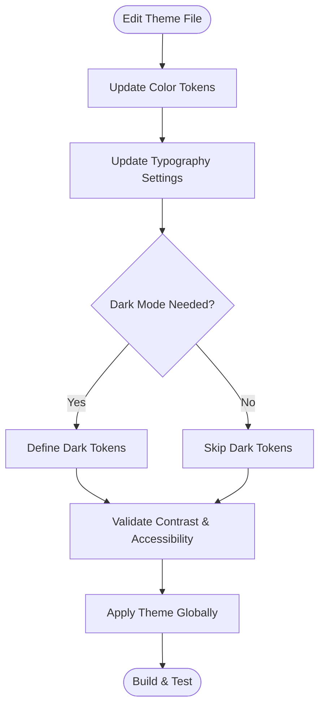
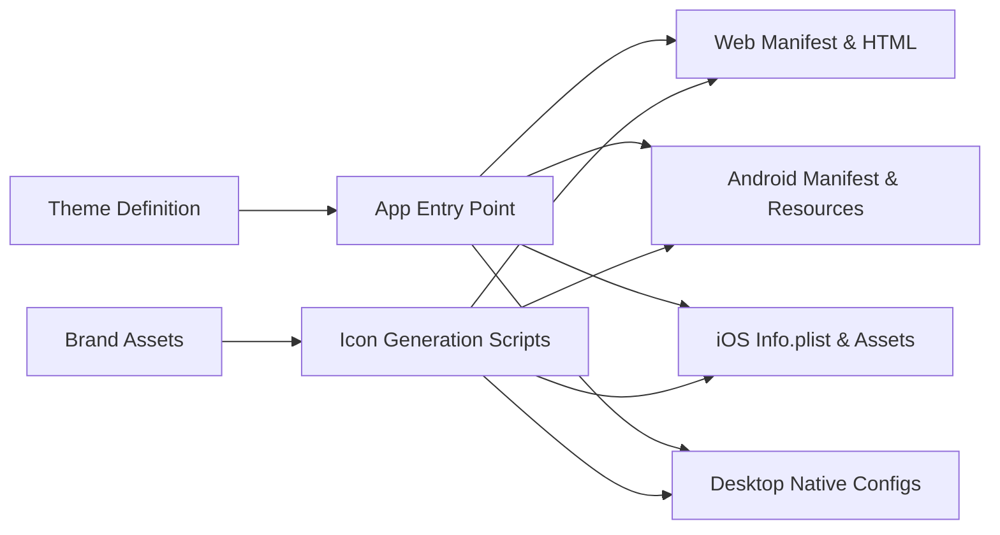

# Branding & Theming

<cite>
**Referenced Files in This Document**
- [app_theme.dart](file://flutter_app/lib/app_theme.dart)
- [main.dart](file://flutter_app/lib/main.dart)
- [pubspec.yaml](file://flutter_app/pubspec.yaml)
- [index.html](file://flutter_app/web/index.html)
- [manifest.json](file://flutter_app/web/manifest.json)
- [AndroidManifest.xml](file://flutter_app/android/app/src/main/AndroidManifest.xml)
- [Info.plist](file://flutter_app/ios/Runner/Info.plist)
- [AppIcon.appiconset/Contents.json](file://flutter_app/ios/Runner/Assets.xcassets/AppIcon.appiconset/Contents.json)
- [GestaoYahwehWidget/Assets.xcassets/WidgetLogo.imageset/Contents.json](file://flutter_app/ios/GestaoYahwehWidget/Assets.xcassets/WidgetLogo.imageset/Contents.json)
- [my_application.cc](file://flutter_app/linux/runner/my_application.cc)
- [my_application.h](file://flutter_app/linux/runner/my_application.h)
- [MainFlutterWindow.swift](file://flutter_app/macos/Runner/MainFlutterWindow.swift)
- [AppIcon.appiconset/Contents.json (macOS)](file://flutter_app/macos/Runner/Assets.xcassets/AppIcon.appiconset/Contents.json)
- [resource.h](file://flutter_app/windows/runner/resource.h)
- [Runner.rc](file://flutter_app/windows/runner/Runner.rc)
- [flutter_bootstrap.js](file://flutter_app/web/flutter_bootstrap.js)
- [firebase_options.dart](file://flutter_app/lib/firebase_options.dart)
- [generate_play_store_graphics.dart](file://flutter_app/tool/generate_play_store_graphics.dart)
- [sync_brand_icons.py](file://flutter_app/tool/sync_brand_icons.py)
- [generate_yahweh_module_icons.py](file://flutter_app/tool/generate_yahweh_module_icons.py)
- [README_COMO_ATUALIZAR_ICONE.txt](file://flutter_app/web/icons/README_COMO_ATUALIZAR_ICONE.txt)
- [README_TROCAR_ICONE.txt](file://flutter_app/web/icons/README_TROCAR_ICONE.txt)
- [atualizar_icone_web.ps1](file://flutter_app/scripts/atualizar_icone_web.ps1)
- [atualizar_icone_web.bat](file://flutter_app/scripts/atualizar_icone_web.bat)
- [church_brand_service_test.dart](file://flutter_app/test/church_brand_service_test.dart)
</cite>

## Table of Contents
1. [Introduction](#introduction)
2. [Project Structure](#project-structure)
3. [Core Components](#core-components)
4. [Architecture Overview](#architecture-overview)
5. [Detailed Component Analysis](#detailed-component-analysis)
6. [Dependency Analysis](#dependency-analysis)
7. [Performance Considerations](#performance-considerations)
8. [Troubleshooting Guide](#troubleshooting-guide)
9. [Conclusion](#conclusion)
10. [Appendices](#appendices)

## Introduction
This document explains the branding and theming system for Gestão Yahweh Premium across web, mobile (Android/iOS), and desktop (Linux/macOS/Windows). It covers how the theme is defined and consumed, where brand assets live, how to update colors, fonts, logos, and icons per platform, and how to maintain consistency with dark mode support.

## Project Structure
The branding and theming are implemented primarily in Flutter’s theme system and native platform configurations:
- Flutter theme definition and app entry point
- Web manifest and bootstrap
- Android resources and manifest
- iOS assets and Info configuration
- Linux/macOS/Windows native app metadata and icons
- Tooling scripts for icon generation and synchronization

```mermaid
graph TB
subgraph "Flutter App"
A["lib/app_theme.dart"]
B["lib/main.dart"]
C["pubspec.yaml"]
end
subgraph "Web"
D["web/index.html"]
E["web/manifest.json"]
F["web/flutter_bootstrap.js"]
end
subgraph "Android"
G["android/app/src/main/AndroidManifest.xml"]
H["android/app/src/main/res/values/*"]
end
subgraph "iOS"
I["ios/Runner/Info.plist"]
J["ios/Runner/Assets.xcassets/AppIcon.appiconset/Contents.json"]
K["ios/GestaoYahwehWidget/Assets.xcassets/WidgetLogo.imageset/Contents.json"]
end
subgraph "Desktop"
L["linux/runner/my_application.*"]
M["macos/Runner/MainFlutterWindow.swift"]
N["macos/Runner/Assets.xcassets/AppIcon.appiconset/Contents.json"]
O["windows/runner/resource.h"]
P["windows/runner/Runner.rc"]
end
A --> B
B --> D
B --> E
B --> F
B --> G
B --> H
B --> I
B --> J
B --> K
B --> L
B --> M
B --> N
B --> O
B --> P
```

**Diagram sources**
- [app_theme.dart](file://flutter_app/lib/app_theme.dart)
- [main.dart](file://flutter_app/lib/main.dart)
- [pubspec.yaml](file://flutter_app/pubspec.yaml)
- [index.html](file://flutter_app/web/index.html)
- [manifest.json](file://flutter_app/web/manifest.json)
- [flutter_bootstrap.js](file://flutter_app/web/flutter_bootstrap.js)
- [AndroidManifest.xml](file://flutter_app/android/app/src/main/AndroidManifest.xml)
- [Info.plist](file://flutter_app/ios/Runner/Info.plist)
- [AppIcon.appiconset/Contents.json](file://flutter_app/ios/Runner/Assets.xcassets/AppIcon.appiconset/Contents.json)
- [GestaoYahwehWidget/Assets.xcassets/WidgetLogo.imageset/Contents.json](file://flutter_app/ios/GestaoYahwehWidget/Assets.xcassets/WidgetLogo.imageset/Contents.json)
- [my_application.cc](file://flutter_app/linux/runner/my_application.cc)
- [my_application.h](file://flutter_app/linux/runner/my_application.h)
- [MainFlutterWindow.swift](file://flutter_app/macos/Runner/MainFlutterWindow.swift)
- [AppIcon.appiconset/Contents.json (macOS)](file://flutter_app/macos/Runner/Assets.xcassets/AppIcon.appiconset/Contents.json)
- [resource.h](file://flutter_app/windows/runner/resource.h)
- [Runner.rc](file://flutter_app/windows/runner/Runner.rc)

**Section sources**
- [app_theme.dart](file://flutter_app/lib/app_theme.dart)
- [main.dart](file://flutter_app/lib/main.dart)
- [pubspec.yaml](file://flutter_app/pubspec.yaml)
- [index.html](file://flutter_app/web/index.html)
- [manifest.json](file://flutter_app/web/manifest.json)
- [flutter_bootstrap.js](file://flutter_app/web/flutter_bootstrap.js)
- [AndroidManifest.xml](file://flutter_app/android/app/src/main/AndroidManifest.xml)
- [Info.plist](file://flutter_app/ios/Runner/Info.plist)
- [AppIcon.appiconset/Contents.json](file://flutter_app/ios/Runner/Assets.xcassets/AppIcon.appiconset/Contents.json)
- [GestaoYahwehWidget/Assets.xcassets/WidgetLogo.imageset/Contents.json](file://flutter_app/ios/GestaoYahwehWidget/Assets.xcassets/WidgetLogo.imageset/Contents.json)
- [my_application.cc](file://flutter_app/linux/runner/my_application.cc)
- [my_application.h](file://flutter_app/linux/runner/my_application.h)
- [MainFlutterWindow.swift](file://flutter_app/macos/Runner/MainFlutterWindow.swift)
- [AppIcon.appiconset/Contents.json (macOS)](file://flutter_app/macos/Runner/Assets.xcassets/AppIcon.appiconset/Contents.json)
- [resource.h](file://flutter_app/windows/runner/resource.h)
- [Runner.rc](file://flutter_app/windows/runner/Runner.rc)

## Core Components
- Theme definition: Centralized color scheme, typography, and component themes are defined in a single file and applied at app startup.
- App entry point: Initializes Firebase options and applies the theme globally.
- Platform manifests: Define app name, icons, splash, and branding metadata per platform.
- Asset declarations: Fonts and images are declared in the package manifest for consistent access.

Key responsibilities:
- Color tokens and semantic roles (primary, accent, background, surface, on-surface)
- Typography scale and font families
- Dark/light theme variants
- Icon and logo asset references for each platform

**Section sources**
- [app_theme.dart](file://flutter_app/lib/app_theme.dart)
- [main.dart](file://flutter_app/lib/main.dart)
- [pubspec.yaml](file://flutter_app/pubspec.yaml)

## Architecture Overview
The branding system follows a layered approach:
- Design tokens (colors, typography) are centralized in the theme file.
- The app entry point configures Firebase and sets the global theme.
- Each platform reads its own native configuration for app identity (name, icons, splash).
- Web uses manifest and HTML metadata; mobile/desktop use their respective resource systems.

[No sources needed since this diagram shows conceptual workflow, not actual code structure]

## Detailed Component Analysis

### Theme System (Colors, Typography, Components)
- Centralized theme file defines:
  - Color palette with semantic tokens
  - Typography scale and font families
  - Light and dark theme variants
  - Reusable component styles (buttons, cards, inputs)
- Consumed by the app via the global theme provider.

Customization steps:
- To change brand colors, edit the color tokens in the theme file.
- To add or replace fonts, declare them in the package manifest and reference them in the theme.
- For dark mode, ensure all semantic tokens have light/dark values.

**Section sources**
- [app_theme.dart](file://flutter_app/lib/app_theme.dart)
- [pubspec.yaml](file://flutter_app/pubspec.yaml)

### App Entry Point and Firebase Options
- The main entry initializes Firebase options and sets the application theme.
- Ensures consistent branding from the first frame.

Steps:
- Verify Firebase options are correctly configured for each environment.
- Confirm the theme is applied before any UI renders.

**Section sources**
- [main.dart](file://flutter_app/lib/main.dart)
- [firebase_options.dart](file://flutter_app/lib/firebase_options.dart)

### Web Branding
- HTML page title and meta tags define the web identity.
- Web manifest provides app name, icons, and display settings.
- Bootstrap script loads the Flutter web app.

Updating web branding:
- Edit the HTML title and meta description.
- Update the manifest with new app name and icon paths.
- Ensure favicon and splash assets are present.

**Section sources**
- [index.html](file://flutter_app/web/index.html)
- [manifest.json](file://flutter_app/web/manifest.json)
- [flutter_bootstrap.js](file://flutter_app/web/flutter_bootstrap.js)

### Android Branding
- AndroidManifest defines app label and theme attributes.
- Resource folders contain drawable and mipmap assets for icons and splash.
- Values files may include colors and styles.

Updating Android branding:
- Replace launcher icons in mipmap directories.
- Update app label in the manifest.
- Adjust colors/styles in values if needed.

**Section sources**
- [AndroidManifest.xml](file://flutter_app/android/app/src/main/AndroidManifest.xml)

### iOS Branding
- Info.plist contains app name, bundle identifier, and other metadata.
- AppIcon asset catalog defines all required icon sizes.
- Widget logo asset supports home screen widgets.

Updating iOS branding:
- Replace images in the AppIcon asset catalog.
- Update Info.plist fields for app identity.
- Update widget logo asset if used.

**Section sources**
- [Info.plist](file://flutter_app/ios/Runner/Info.plist)
- [AppIcon.appiconset/Contents.json](file://flutter_app/ios/Runner/Assets.xcassets/AppIcon.appiconset/Contents.json)
- [GestaoYahwehWidget/Assets.xcassets/WidgetLogo.imageset/Contents.json](file://flutter_app/ios/GestaoYahwehWidget/Assets.xcassets/WidgetLogo.imageset/Contents.json)

### Desktop Branding (Linux, macOS, Windows)
- Linux: Application metadata and icons are embedded via native runner files.
- macOS: App icon asset catalog and window configuration define branding.
- Windows: Resource header and RC file embed version and icon resources.

Updating desktop branding:
- Replace icon assets in the appropriate directories.
- Update metadata in native runner files.
- Rebuild the desktop targets to apply changes.

**Section sources**
- [my_application.cc](file://flutter_app/linux/runner/my_application.cc)
- [my_application.h](file://flutter_app/linux/runner/my_application.h)
- [MainFlutterWindow.swift](file://flutter_app/macos/Runner/MainFlutterWindow.swift)
- [AppIcon.appiconset/Contents.json (macOS)](file://flutter_app/macos/Runner/Assets.xcassets/AppIcon.appiconset/Contents.json)
- [resource.h](file://flutter_app/windows/runner/resource.h)
- [Runner.rc](file://flutter_app/windows/runner/Runner.rc)

### Asset Organization and Icon Generation
- Package manifest declares fonts and images for consistent access.
- Scripts automate icon generation and synchronization across platforms.
- Web icon update scripts streamline replacing favicons and manifest icons.

Recommended process:
- Place master brand assets in a central location.
- Use provided scripts to generate platform-specific icons.
- Commit generated assets and rebuild targets.

**Section sources**
- [pubspec.yaml](file://flutter_app/pubspec.yaml)
- [generate_play_store_graphics.dart](file://flutter_app/tool/generate_play_store_graphics.dart)
- [sync_brand_icons.py](file://flutter_app/tool/sync_brand_icons.py)
- [generate_yahweh_module_icons.py](file://flutter_app/tool/generate_yahweh_module_icons.py)
- [atualizar_icone_web.ps1](file://flutter_app/scripts/atualizar_icone_web.ps1)
- [atualizar_icone_web.bat](file://flutter_app/scripts/atualizar_icone_web.bat)
- [README_COMO_ATUALIZAR_ICONE.txt](file://flutter_app/web/icons/README_COMO_ATUALIZAR_ICONE.txt)
- [README_TROCAR_ICONE.txt](file://flutter_app/web/icons/README_TROCAR_ICONE.txt)

### Creating Custom Themes and Dark Mode
- Extend the theme file to create named themes (e.g., “Premium”, “Classic”).
- Implement dark mode by defining alternate token values.
- Allow runtime switching by exposing theme selection logic in the app.

Best practices:
- Keep semantic tokens consistent across themes.
- Validate contrast ratios for accessibility.
- Test both light and dark modes on all platforms.

**Section sources**
- [app_theme.dart](file://flutter_app/lib/app_theme.dart)

### Maintaining Brand Consistency Across Platforms
- Centralize design tokens in the theme file.
- Use automated scripts to propagate icons and images.
- Review platform-specific overrides and ensure alignment with tokens.

Checklist:
- Colors match brand guidelines
- Typography matches approved fonts
- Icons meet platform size requirements
- Splash screens reflect brand visuals

**Section sources**
- [pubspec.yaml](file://flutter_app/pubspec.yaml)
- [index.html](file://flutter_app/web/index.html)
- [manifest.json](file://flutter_app/web/manifest.json)
- [AndroidManifest.xml](file://flutter_app/android/app/src/main/AndroidManifest.xml)
- [Info.plist](file://flutter_app/ios/Runner/Info.plist)

## Dependency Analysis
Branding dependencies flow from the theme definition to platform manifests and assets:
- Theme file is imported by the app entry point.
- Platform manifests depend on asset catalogs and resource files.
- Scripts depend on source assets to generate outputs.

**Diagram sources**
- [app_theme.dart](file://flutter_app/lib/app_theme.dart)
- [main.dart](file://flutter_app/lib/main.dart)
- [index.html](file://flutter_app/web/index.html)
- [manifest.json](file://flutter_app/web/manifest.json)
- [AndroidManifest.xml](file://flutter_app/android/app/src/main/AndroidManifest.xml)
- [Info.plist](file://flutter_app/ios/Runner/Info.plist)
- [AppIcon.appiconset/Contents.json](file://flutter_app/ios/Runner/Assets.xcassets/AppIcon.appiconset/Contents.json)
- [my_application.cc](file://flutter_app/linux/runner/my_application.cc)
- [MainFlutterWindow.swift](file://flutter_app/macos/Runner/MainFlutterWindow.swift)
- [resource.h](file://flutter_app/windows/runner/resource.h)
- [Runner.rc](file://flutter_app/windows/runner/Runner.rc)
- [generate_play_store_graphics.dart](file://flutter_app/tool/generate_play_store_graphics.dart)
- [sync_brand_icons.py](file://flutter_app/tool/sync_brand_icons.py)
- [generate_yahweh_module_icons.py](file://flutter_app/tool/generate_yahweh_module_icons.py)

**Section sources**
- [app_theme.dart](file://flutter_app/lib/app_theme.dart)
- [main.dart](file://flutter_app/lib/main.dart)
- [pubspec.yaml](file://flutter_app/pubspec.yaml)

## Performance Considerations
- Prefer vector icons where possible to reduce asset size.
- Optimize image formats (WebP, PNG) and compress assets.
- Avoid heavy fonts; subset fonts to required glyphs.
- Cache theme and asset loading to minimize startup time.

[No sources needed since this section provides general guidance]

## Troubleshooting Guide
Common issues and resolutions:
- Icons not appearing on web: Ensure manifest paths and favicon files are correct.
- iOS app icon missing: Verify all required sizes exist in the AppIcon asset catalog.
- Android launcher icon mismatch: Check mipmap directories and manifest label.
- Dark mode contrast problems: Validate token values and run accessibility checks.
- Font rendering differences: Confirm font files are included and referenced consistently.

Validation tips:
- Run platform builds and inspect output artifacts.
- Use device emulators and real devices for cross-platform verification.
- Leverage testing utilities to assert theme correctness.

**Section sources**
- [church_brand_service_test.dart](file://flutter_app/test/church_brand_service_test.dart)

## Conclusion
By centralizing design tokens, automating asset generation, and aligning platform manifests, Gestão Yahweh Premium achieves consistent branding across web, mobile, and desktop. Follow the step-by-step guides to update colors, fonts, and images while maintaining accessibility and performance.

[No sources needed since this section summarizes without analyzing specific files]

## Appendices

### Step-by-Step Guides

#### Updating Brand Colors
- Open the theme file and locate color tokens.
- Replace token values with brand-approved colors.
- Build and test light and dark modes.

**Section sources**
- [app_theme.dart](file://flutter_app/lib/app_theme.dart)

#### Changing Fonts
- Add font files to the assets directory.
- Declare fonts in the package manifest.
- Reference the new font family in the theme.

**Section sources**
- [pubspec.yaml](file://flutter_app/pubspec.yaml)
- [app_theme.dart](file://flutter_app/lib/app_theme.dart)

#### Replacing Logos and Icons
- Replace master brand assets.
- Run icon generation scripts for each platform.
- Rebuild targets and verify outputs.

**Section sources**
- [generate_play_store_graphics.dart](file://flutter_app/tool/generate_play_store_graphics.dart)
- [sync_brand_icons.py](file://flutter_app/tool/sync_brand_icons.py)
- [generate_yahweh_module_icons.py](file://flutter_app/tool/generate_yahweh_module_icons.py)
- [atualizar_icone_web.ps1](file://flutter_app/scripts/atualizar_icone_web.ps1)
- [atualizar_icone_web.bat](file://flutter_app/scripts/atualizar_icone_web.bat)

#### Implementing Dark Mode
- Define dark tokens for all semantic colors.
- Ensure contrast meets accessibility standards.
- Test across platforms for visual parity.

**Section sources**
- [app_theme.dart](file://flutter_app/lib/app_theme.dart)

#### Maintaining Brand Consistency
- Centralize design tokens and enforce usage via theme APIs.
- Automate asset propagation with scripts.
- Review platform-specific overrides regularly.

**Section sources**
- [pubspec.yaml](file://flutter_app/pubspec.yaml)
- [index.html](file://flutter_app/web/index.html)
- [manifest.json](file://flutter_app/web/manifest.json)
- [AndroidManifest.xml](file://flutter_app/android/app/src/main/AndroidManifest.xml)
- [Info.plist](file://flutter_app/ios/Runner/Info.plist)