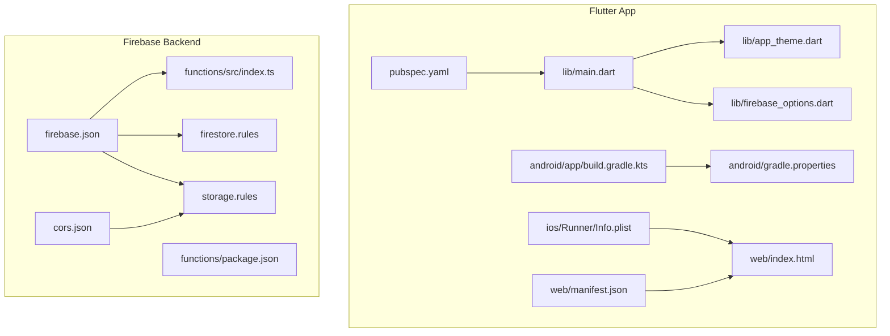
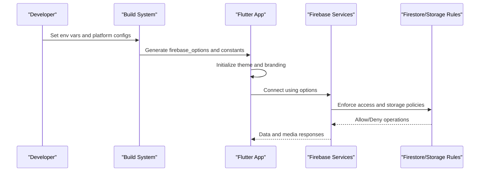
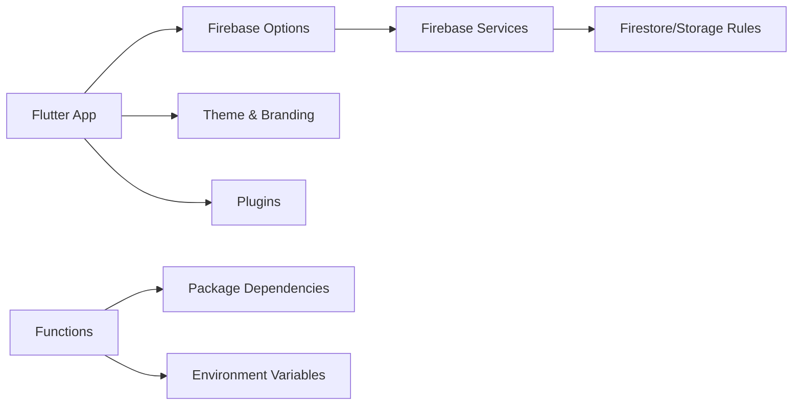

# Configuration & Customization

<cite>
**Referenced Files in This Document**
- [flutter_app/pubspec.yaml](file://flutter_app/pubspec.yaml)
- [flutter_app/lib/main.dart](file://flutter_app/lib/main.dart)
- [flutter_app/lib/app_theme.dart](file://flutter_app/lib/app_theme.dart)
- [flutter_app/lib/firebase_options.dart](file://flutter_app/lib/firebase_options.dart)
- [flutter_app/android/app/build.gradle.kts](file://flutter_app/android/app/build.gradle.kts)
- [flutter_app/android/gradle.properties](file://flutter_app/android/gradle.properties)
- [flutter_app/android/key.properties.example](file://flutter_app/android/key.properties.example)
- [flutter_app/ios/Runner/Info.plist](file://flutter_app/ios/Runner/Info.plist)
- [flutter_app/ios/Runner/GoogleService-Info.plist](file://flutter_app/ios/Runner/GoogleService-Info.plist)
- [flutter_app/web/index.html](file://flutter_app/web/index.html)
- [flutter_app/web/manifest.json](file://flutter_app/web/manifest.json)
- [functions/package.json](file://functions/package.json)
- [functions/src/index.ts](file://functions/src/index.ts)
- [firebase.json](file://firebase.json)
- [firestore.rules](file://firestore.rules)
- [storage.rules](file://storage.rules)
- [cors.json](file://cors.json)
- [flutter_app/storage_cors.json](file://flutter_app/storage_cors.json)
</cite>

## Table of Contents
1. [Introduction](#introduction)
2. [Project Structure](#project-structure)
3. [Core Components](#core-components)
4. [Architecture Overview](#architecture-overview)
5. [Detailed Component Analysis](#detailed-component-analysis)
6. [Dependency Analysis](#dependency-analysis)
7. [Performance Considerations](#performance-considerations)
8. [Troubleshooting Guide](#troubleshooting-guide)
9. [Conclusion](#conclusion)
10. [Appendices](#appendices)

## Introduction
This document provides configuration and customization guidance for the Gestão Yahweh Premium application across Flutter (Android, iOS, Web), Firebase Functions, and runtime behavior. It covers environment variables, feature flags, branding customization, plugin configuration, dynamic configuration loading, and third-party service setup. The goal is to help you set up custom environments, modify application behavior safely, and extend functionality through configuration without altering core code.

## Project Structure
The project is a multi-platform Flutter app with Firebase backend services:
- Flutter app under flutter_app/
- Firebase Functions under functions/
- Firebase configuration files at repository root and within platform directories
- Web assets under flutter_app/web/

**Diagram sources**
- [flutter_app/pubspec.yaml](file://flutter_app/pubspec.yaml)
- [flutter_app/lib/main.dart](file://flutter_app/lib/main.dart)
- [flutter_app/lib/app_theme.dart](file://flutter_app/lib/app_theme.dart)
- [flutter_app/lib/firebase_options.dart](file://flutter_app/lib/firebase_options.dart)
- [flutter_app/android/app/build.gradle.kts](file://flutter_app/android/app/build.gradle.kts)
- [flutter_app/android/gradle.properties](file://flutter_app/android/gradle.properties)
- [flutter_app/ios/Runner/Info.plist](file://flutter_app/ios/Runner/Info.plist)
- [flutter_app/web/index.html](file://flutter_app/web/index.html)
- [flutter_app/web/manifest.json](file://flutter_app/web/manifest.json)
- [firebase.json](file://firebase.json)
- [functions/src/index.ts](file://functions/src/index.ts)
- [functions/package.json](file://functions/package.json)
- [firestore.rules](file://firestore.rules)
- [storage.rules](file://storage.rules)
- [cors.json](file://cors.json)

**Section sources**
- [flutter_app/pubspec.yaml](file://flutter_app/pubspec.yaml)
- [flutter_app/lib/main.dart](file://flutter_app/lib/main.dart)
- [flutter_app/lib/app_theme.dart](file://flutter_app/lib/app_theme.dart)
- [flutter_app/lib/firebase_options.dart](file://flutter_app/lib/firebase_options.dart)
- [flutter_app/android/app/build.gradle.kts](file://flutter_app/android/app/build.gradle.kts)
- [flutter_app/android/gradle.properties](file://flutter_app/android/gradle.properties)
- [flutter_app/ios/Runner/Info.plist](file://flutter_app/ios/Runner/Info.plist)
- [flutter_app/web/index.html](file://flutter_app/web/index.html)
- [flutter_app/web/manifest.json](file://flutter_app/web/manifest.json)
- [firebase.json](file://firebase.json)
- [functions/src/index.ts](file://functions/src/index.ts)
- [functions/package.json](file://functions/package.json)
- [firestore.rules](file://firestore.rules)
- [storage.rules](file://storage.rules)
- [cors.json](file://cors.json)

## Core Components
Key configuration components include:
- Flutter app entrypoint and theme initialization
- Platform-specific configurations (Android, iOS, Web)
- Firebase options and rules
- Functions package and index
- CORS and storage policies

These components collectively define how the app behaves across environments and platforms.

**Section sources**
- [flutter_app/lib/main.dart](file://flutter_app/lib/main.dart)
- [flutter_app/lib/app_theme.dart](file://flutter_app/lib/app_theme.dart)
- [flutter_app/lib/firebase_options.dart](file://flutter_app/lib/firebase_options.dart)
- [flutter_app/android/app/build.gradle.kts](file://flutter_app/android/app/build.gradle.kts)
- [flutter_app/android/gradle.properties](file://flutter_app/android/gradle.properties)
- [flutter_app/ios/Runner/Info.plist](file://flutter_app/ios/Runner/Info.plist)
- [flutter_app/web/index.html](file://flutter_app/web/index.html)
- [flutter_app/web/manifest.json](file://flutter_app/web/manifest.json)
- [firebase.json](file://firebase.json)
- [functions/src/index.ts](file://functions/src/index.ts)
- [functions/package.json](file://functions/package.json)
- [firestore.rules](file://firestore.rules)
- [storage.rules](file://storage.rules)
- [cors.json](file://cors.json)

## Architecture Overview
Configuration flows from build-time constants and runtime environment variables into the Flutter app and Firebase services. Theme and branding are applied via Flutter’s theme system, while Firebase options and rules govern backend behavior.

**Diagram sources**
- [flutter_app/lib/main.dart](file://flutter_app/lib/main.dart)
- [flutter_app/lib/firebase_options.dart](file://flutter_app/lib/firebase_options.dart)
- [firebase.json](file://firebase.json)
- [firestore.rules](file://firestore.rules)
- [storage.rules](file://storage.rules)

## Detailed Component Analysis

### Environment Variables and Feature Flags
- Flutter environment variables can be passed at build time and accessed via platform channels or generated constants.
- Feature flags may be implemented via compile-time constants or runtime toggles loaded from configuration files or remote settings.
- Android Gradle properties and Kotlin/Java build variants support environment-specific values.
- iOS Info.plist supports runtime keys; ensure sensitive values are not hardcoded.
- Web manifest and HTML can embed non-sensitive configuration like app name and icons.

Recommendations:
- Use environment-specific build flavors to isolate dev/staging/prod configurations.
- Avoid committing secrets; use secure secret managers and inject at build time.
- Validate feature flags before enabling them in production.

**Section sources**
- [flutter_app/android/gradle.properties](file://flutter_app/android/gradle.properties)
- [flutter_app/android/key.properties.example](file://flutter_app/android/key.properties.example)
- [flutter_app/ios/Runner/Info.plist](file://flutter_app/ios/Runner/Info.plist)
- [flutter_app/web/manifest.json](file://flutter_app/web/manifest.json)

### Branding Customization
Branding includes app name, icons, colors, and splash screens:
- Flutter theme defines primary colors, typography, and component styles.
- Android resources and iOS assets hold app icons and launch images.
- Web assets include favicon and manifest entries.

Steps:
- Update theme definitions for color schemes and fonts.
- Replace platform-specific icon sets and splash images.
- Ensure consistent branding across all platforms.

**Section sources**
- [flutter_app/lib/app_theme.dart](file://flutter_app/lib/app_theme.dart)
- [flutter_app/android/app/build.gradle.kts](file://flutter_app/android/app/build.gradle.kts)
- [flutter_app/ios/Runner/Info.plist](file://flutter_app/ios/Runner/Info.plist)
- [flutter_app/web/manifest.json](file://flutter_app/web/manifest.json)

### Plugin Configuration
Plugins are declared in pubspec.yaml and may require platform-specific setup:
- Add dependencies and configure plugins for Firebase, analytics, and other services.
- Ensure platform-specific permissions and capabilities are enabled.
- Verify plugin versions compatibility across Android, iOS, and Web.

Best practices:
- Pin plugin versions to avoid unexpected changes.
- Test plugin behavior on each target platform.
- Remove unused plugins to reduce bundle size.

**Section sources**
- [flutter_app/pubspec.yaml](file://flutter_app/pubspec.yaml)

### Dynamic Configuration Loading
Dynamic configuration can be achieved by:
- Loading JSON or YAML files bundled with the app for non-sensitive settings.
- Fetching remote configuration from Firebase Remote Config or a secure API.
- Using environment variables injected at runtime for server-side functions.

Implementation tips:
- Cache remote config locally to minimize network calls.
- Provide fallback defaults for missing keys.
- Validate configuration schema before applying.

**Section sources**
- [flutter_app/lib/main.dart](file://flutter_app/lib/main.dart)
- [flutter_app/lib/firebase_options.dart](file://flutter_app/lib/firebase_options.dart)

### Theme Customization
Theme customization involves:
- Defining color palettes, typography, and component themes.
- Supporting light/dark modes and accessibility features.
- Applying theme overrides per screen or feature module.

Guidelines:
- Centralize theme definitions for consistency.
- Use semantic color names for maintainability.
- Test themes across devices and OS versions.

**Section sources**
- [flutter_app/lib/app_theme.dart](file://flutter_app/lib/app_theme.dart)

### Locale Settings
Locale configuration includes:
- Declaring supported languages in pubspec.yaml.
- Providing localized strings and formatting rules.
- Detecting device locale and allowing user override.

Considerations:
- Ensure pluralization and date/time formats are correct per locale.
- Handle right-to-left layouts if needed.
- Test localization with real content.

**Section sources**
- [flutter_app/pubspec.yaml](file://flutter_app/pubspec.yaml)

### Third-Party Service Configuration
Third-party services such as Firebase require:
- Correctly configured service account and project IDs.
- Platform-specific credentials (Android google-services.json, iOS GoogleService-Info.plist).
- Function endpoints and security rules aligned with service requirements.

Security notes:
- Never expose secrets in client code.
- Use Firebase Authentication and Security Rules to protect data.
- Rotate credentials regularly and audit access logs.

**Section sources**
- [flutter_app/lib/firebase_options.dart](file://flutter_app/lib/firebase_options.dart)
- [flutter_app/android/app/build.gradle.kts](file://flutter_app/android/app/build.gradle.kts)
- [flutter_app/ios/Runner/GoogleService-Info.plist](file://flutter_app/ios/Runner/GoogleService-Info.plist)
- [functions/src/index.ts](file://functions/src/index.ts)
- [functions/package.json](file://functions/package.json)

### Runtime Customization Options
Runtime customization allows:
- Toggling features based on user roles or tenant settings.
- Adjusting behavior via configuration flags fetched at startup.
- Overriding default behaviors through environment-specific settings.

Approach:
- Implement a configuration manager that merges defaults, local overrides, and remote settings.
- Expose APIs for UI to react to configuration changes.
- Log configuration state for debugging.

**Section sources**
- [flutter_app/lib/main.dart](file://flutter_app/lib/main.dart)

### Setting Up Custom Environments
To create custom environments:
- Define build flavors for dev, staging, prod.
- Configure environment-specific variables and credentials.
- Automate builds and deployments per environment.

Automation tips:
- Use CI/CD pipelines to manage environment-specific builds.
- Store secrets securely and inject them during deployment.
- Validate configurations before releasing.

**Section sources**
- [flutter_app/android/app/build.gradle.kts](file://flutter_app/android/app/build.gradle.kts)
- [flutter_app/ios/Runner/Info.plist](file://flutter_app/ios/Runner/Info.plist)
- [firebase.json](file://firebase.json)

### Modifying Application Behavior
Behavior modifications can be achieved by:
- Updating feature flags and configuration keys.
- Adjusting Firebase rules for data access and storage policies.
- Extending functions to handle new business logic.

Caution:
- Test changes thoroughly in non-production environments.
- Monitor performance and error rates after updates.
- Document behavioral changes for team awareness.

**Section sources**
- [firestore.rules](file://firestore.rules)
- [storage.rules](file://storage.rules)
- [functions/src/index.ts](file://functions/src/index.ts)

### Extending Functionality Through Configuration
Extend functionality by:
- Adding new configuration keys for features or integrations.
- Implementing plugin modules that read configuration at runtime.
- Using Firebase Functions to orchestrate external services.

Best practices:
- Version configuration schemas to manage evolution.
- Provide migration scripts for configuration updates.
- Validate inputs and outputs rigorously.

**Section sources**
- [functions/package.json](file://functions/package.json)
- [functions/src/index.ts](file://functions/src/index.ts)

## Dependency Analysis
Dependencies between configuration components:
- Flutter app depends on platform-specific configurations and Firebase options.
- Firebase Functions depend on package dependencies and environment variables.
- Storage and Firestore rules enforce security policies based on configuration.

**Diagram sources**
- [flutter_app/lib/firebase_options.dart](file://flutter_app/lib/firebase_options.dart)
- [flutter_app/lib/app_theme.dart](file://flutter_app/lib/app_theme.dart)
- [flutter_app/pubspec.yaml](file://flutter_app/pubspec.yaml)
- [functions/package.json](file://functions/package.json)
- [functions/src/index.ts](file://functions/src/index.ts)
- [firestore.rules](file://firestore.rules)
- [storage.rules](file://storage.rules)

**Section sources**
- [flutter_app/lib/firebase_options.dart](file://flutter_app/lib/firebase_options.dart)
- [flutter_app/lib/app_theme.dart](file://flutter_app/lib/app_theme.dart)
- [flutter_app/pubspec.yaml](file://flutter_app/pubspec.yaml)
- [functions/package.json](file://functions/package.json)
- [functions/src/index.ts](file://functions/src/index.ts)
- [firestore.rules](file://firestore.rules)
- [storage.rules](file://storage.rules)

## Performance Considerations
- Minimize configuration file sizes to reduce app load times.
- Cache remote configurations locally to avoid frequent network requests.
- Optimize Firebase rules to prevent excessive reads/writes.
- Use efficient image formats and compress assets for faster loading.

[No sources needed since this section provides general guidance]

## Troubleshooting Guide
Common issues and resolutions:
- Missing Firebase options: Ensure correct project IDs and service accounts are configured.
- Permission errors: Review Firestore and Storage rules for proper access control.
- CORS errors: Verify CORS settings match your domain and methods.
- Plugin conflicts: Check version compatibility and remove unused plugins.

Debugging steps:
- Enable verbose logging in development mode.
- Validate configuration files syntax and structure.
- Test changes incrementally and monitor error logs.

**Section sources**
- [flutter_app/lib/firebase_options.dart](file://flutter_app/lib/firebase_options.dart)
- [firestore.rules](file://firestore.rules)
- [storage.rules](file://storage.rules)
- [cors.json](file://cors.json)

## Conclusion
Effective configuration and customization are essential for maintaining flexibility and scalability in the Gestão Yahweh Premium application. By following best practices for environment management, branding, plugin setup, and dynamic configuration, you can ensure a robust and adaptable system. Always prioritize security, performance, and maintainability when implementing changes.

[No sources needed since this section summarizes without analyzing specific files]

## Appendices
Additional resources and references:
- Flutter documentation for environment variables and build flavors.
- Firebase documentation for configuring services and rules.
- Platform-specific guides for Android and iOS configuration.

[No sources needed since this section provides general guidance]