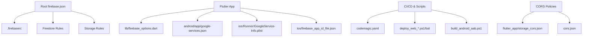
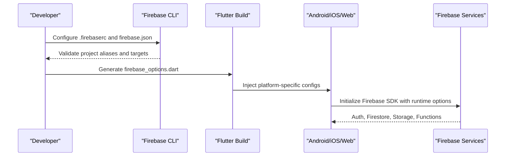
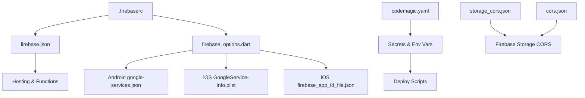

# Environment Configuration

<cite>
**Referenced Files in This Document**
- [.firebaserc](file://flutter_app/.firebaserc)
- [firebase.json](file://flutter_app/firebase.json)
- [firebase_options.dart](file://flutter_app/lib/firebase_options.dart)
- [google-services.json](file://flutter_app/android/app/google-services.json)
- [GoogleService-Info.plist](file://flutter_app/ios/Runner/GoogleService-Info.plist)
- [firebase_app_id_file.json](file://flutter_app/ios/firebase_app_id_file.json)
- [pubspec.yaml](file://flutter_app/pubspec.yaml)
- [codemagic.yaml](file://flutter_app/codemagic.yaml)
- [deploy_web_agora.bat](file://flutter_app/scripts/deploy_web_agora.bat)
- [deploy_web_agora.ps1](file://flutter_app/scripts/deploy_web_agora.ps1)
- [build_android_aab.ps1](file://scripts/build_android_aab.ps1)
- [ensure_google_cloud_auth.ps1](file://scripts/ensure_google_cloud_auth.ps1)
- [apply_storage_cors.ps1](file://scripts/apply_storage_cors.ps1)
- [storage_cors.json](file://flutter_app/storage_cors.json)
- [cors.json](file://cors.json)
- [GCP_TOOLCHAIN_COPIAR_OUTROS_PROJETOS.md](file://docs/GCP_TOOLCHAIN_COPIAR_OUTROS_PROJETOS.md)
- [FIREBASE_DATABASES.md](file://flutter_app/FIREBASE_DATABASES.md)
- [FIREBASE_DOMAIN.md](file://flutter_app/FIREBASE_DOMAIN.md)
- [STORAGE_CORS_README.txt](file://flutter_app/STORAGE_CORS_README.txt)
</cite>

## Table of Contents
1. [Introduction](#introduction)
2. [Project Structure](#project-structure)
3. [Core Components](#core-components)
4. [Architecture Overview](#architecture-overview)
5. [Detailed Component Analysis](#detailed-component-analysis)
6. [Dependency Analysis](#dependency-analysis)
7. [Performance Considerations](#performance-considerations)
8. [Troubleshooting Guide](#troubleshooting-guide)
9. [Conclusion](#conclusion)
10. [Appendices](#appendices)

## Introduction
This document explains how to configure environments for the Gestão Yahweh Premium application across development, staging, and production. It covers Firebase project setup, service accounts, environment-specific secrets, Flutter configuration files, and platform-specific settings for Android, iOS, and Web. It also details the .firebaserc and firebase.json configurations, and shows how local development maps to cloud environments.

## Project Structure
The environment configuration spans several layers:
- Root-level Firebase CLI and hosting rules
- Flutter app configuration (Firebase options, platform-specific credentials)
- CI/CD and deployment scripts that inject environment variables and secrets
- Storage CORS policies and domain mappings

**Diagram sources**
- [firebase.json](file://flutter_app/firebase.json)
- [.firebaserc](file://flutter_app/.firebaserc)
- [firebase_options.dart](file://flutter_app/lib/firebase_options.dart)
- [google-services.json](file://flutter_app/android/app/google-services.json)
- [GoogleService-Info.plist](file://flutter_app/ios/Runner/GoogleService-Info.plist)
- [firebase_app_id_file.json](file://flutter_app/ios/firebase_app_id_file.json)
- [codemagic.yaml](file://flutter_app/codemagic.yaml)
- [deploy_web_agora.bat](file://flutter_app/scripts/deploy_web_agora.bat)
- [deploy_web_agora.ps1](file://flutter_app/scripts/deploy_web_agora.ps1)
- [build_android_aab.ps1](file://scripts/build_android_aab.ps1)
- [storage_cors.json](file://flutter_app/storage_cors.json)
- [cors.json](file://cors.json)

**Section sources**
- [firebase.json](file://flutter_app/firebase.json)
- [.firebaserc](file://flutter_app/.firebaserc)
- [firebase_options.dart](file://flutter_app/lib/firebase_options.dart)
- [google-services.json](file://flutter_app/android/app/google-services.json)
- [GoogleService-Info.plist](file://flutter_app/ios/Runner/GoogleService-Info.plist)
- [firebase_app_id_file.json](file://flutter_app/ios/firebase_app_id_file.json)
- [codemagic.yaml](file://flutter_app/codemagic.yaml)
- [deploy_web_agora.bat](file://flutter_app/scripts/deploy_web_agora.bat)
- [deploy_web_agora.ps1](file://flutter_app/scripts/deploy_web_agora.ps1)
- [build_android_aab.ps1](file://scripts/build_android_aab.ps1)
- [storage_cors.json](file://flutter_app/storage_cors.json)
- [cors.json](file://cors.json)

## Core Components
- Firebase CLI configuration (.firebaserc): Defines project aliases and default targets used by Flutter and CLI commands.
- Flutter Firebase initialization (firebase_options.dart): Generated file mapping Firebase projects to platforms; consumed at runtime.
- Platform-specific Firebase configs:
  - Android: google-services.json
  - iOS: GoogleService-Info.plist and firebase_app_id_file.json
- Hosting and functions configuration (firebase.json): Sets up web hosting, functions, and storage rules references.
- CI/CD and deployment automation: codemagic.yaml and PowerShell/Batch scripts manage environment variables and secrets per target.
- Storage CORS policies: storage_cors.json and cors.json define cross-origin access for Firebase Storage.

**Section sources**
- [.firebaserc](file://flutter_app/.firebaserc)
- [firebase_options.dart](file://flutter_app/lib/firebase_options.dart)
- [google-services.json](file://flutter_app/android/app/google-services.json)
- [GoogleService-Info.plist](file://flutter_app/ios/Runner/GoogleService-Info.plist)
- [firebase_app_id_file.json](file://flutter_app/ios/firebase_app_id_file.json)
- [firebase.json](file://flutter_app/firebase.json)
- [codemagic.yaml](file://flutter_app/codemagic.yaml)
- [deploy_web_agora.bat](file://flutter_app/scripts/deploy_web_agora.bat)
- [deploy_web_agora.ps1](file://flutter_app/scripts/deploy_web_agora.ps1)
- [build_android_aab.ps1](file://scripts/build_android_aab.ps1)
- [storage_cors.json](file://flutter_app/storage_cors.json)
- [cors.json](file://cors.json)

## Architecture Overview
Environment configuration flows from CI/CD and local developer setups into platform-specific Firebase configs and runtime initialization.

**Diagram sources**
- [.firebaserc](file://flutter_app/.firebaserc)
- [firebase.json](file://flutter_app/firebase.json)
- [firebase_options.dart](file://flutter_app/lib/firebase_options.dart)
- [google-services.json](file://flutter_app/android/app/google-services.json)
- [GoogleService-Info.plist](file://flutter_app/ios/Runner/GoogleService-Info.plist)
- [firebase_app_id_file.json](file://flutter_app/ios/firebase_app_id_file.json)

## Detailed Component Analysis

### Firebase CLI and Project Aliases
- .firebaserc defines project aliases and defaults for CLI commands. Ensure it points to the correct Firebase project for each environment.
- firebase.json configures hosting, functions, and storage rules paths. Verify domains and rule references match your environment.

**Section sources**
- [.firebaserc](file://flutter_app/.firebaserc)
- [firebase.json](file://flutter_app/firebase.json)

### Flutter Firebase Options and Runtime Initialization
- lib/firebase_options.dart is generated to map Firebase projects to platforms. Confirm it contains the correct project identifiers for dev/stage/prod.
- pubspec.yaml may include dependencies or flags that affect environment behavior; ensure no hardcoded secrets are present.

**Section sources**
- [firebase_options.dart](file://flutter_app/lib/firebase_options.dart)
- [pubspec.yaml](file://flutter_app/pubspec.yaml)

### Android Configuration
- android/app/google-services.json must be updated per environment. Use the Firebase console to download the correct file for each project.
- build_android_aab.ps1 orchestrates signing and packaging; ensure keystore and key properties are configured securely.

**Section sources**
- [google-services.json](file://flutter_app/android/app/google-services.json)
- [build_android_aab.ps1](file://scripts/build_android_aab.ps1)

### iOS Configuration
- ios/Runner/GoogleService-Info.plist provides Firebase configuration for iOS builds. Keep it aligned with the active Firebase project.
- ios/firebase_app_id_file.json is used by Firebase tools during build; verify its contents reflect the intended environment.

**Section sources**
- [GoogleService-Info.plist](file://flutter_app/ios/Runner/GoogleService-Info.plist)
- [firebase_app_id_file.json](file://flutter_app/ios/firebase_app_id_file.json)

### Web Hosting and Deployment
- deploy_web_agora.bat and deploy_web_agora.ps1 automate web builds and deployments. They should set environment variables for hosting targets and Firebase project selection.
- Ensure firebase.json hosting configuration matches your domain and build output directory.

**Section sources**
- [deploy_web_agora.bat](file://flutter_app/scripts/deploy_web_agora.bat)
- [deploy_web_agora.ps1](file://flutter_app/scripts/deploy_web_agora.ps1)
- [firebase.json](file://flutter_app/firebase.json)

### CI/CD and Secrets Management
- codemagic.yaml defines build pipelines and secret injection for CodeMagic. Map environment variables for each target (dev/stage/prod).
- ensure_google_cloud_auth.ps1 sets up authentication for Google Cloud services; use it to provision service accounts and permissions.
- apply_storage_cors.ps1 applies CORS policies to Firebase Storage; align with storage_cors.json and cors.json.

**Section sources**
- [codemagic.yaml](file://flutter_app/codemagic.yaml)
- [ensure_google_cloud_auth.ps1](file://scripts/ensure_google_cloud_auth.ps1)
- [apply_storage_cors.ps1](file://scripts/apply_storage_cors.ps1)

### Storage CORS Policies
- flutter_app/storage_cors.json and cors.json define allowed origins, methods, and headers for Firebase Storage. Update these per environment to restrict access appropriately.
- STORAGE_CORS_README.txt provides guidance on applying CORS policies.

**Section sources**
- [storage_cors.json](file://flutter_app/storage_cors.json)
- [cors.json](file://cors.json)
- [STORAGE_CORS_README.txt](file://flutter_app/STORAGE_CORS_README.txt)

### Domain and Database Configuration
- FIREBASE_DOMAIN.md outlines domain setup and alignment between hosting and Firebase projects.
- FIREBASE_DATABASES.md describes database instances and their usage across environments.

**Section sources**
- [FIREBASE_DOMAIN.md](file://flutter_app/FIREBASE_DOMAIN.md)
- [FIREBASE_DATABASES.md](file://flutter_app/FIREBASE_DATABASES.md)

### GCP Toolchain and Service Accounts
- GCP_TOOLCHAIN_COPIAR_OUTROS_PROJETOS.md explains copying toolchains and managing service accounts across projects. Follow instructions to ensure consistent authentication.

**Section sources**
- [GCP_TOOLCHAIN_COPIAR_OUTROS_PROJETOS.md](file://docs/GCP_TOOLCHAIN_COPIAR_OUTROS_PROJETOS.md)

## Dependency Analysis
Environment configuration depends on a chain of files and scripts:
- .firebaserc and firebase.json drive CLI behavior and hosting setup.
- firebase_options.dart consumes project mappings for runtime initialization.
- Platform-specific files (google-services.json, GoogleService-Info.plist) bind Firebase SDKs to projects.
- CI/CD scripts inject secrets and enforce environment-specific builds.
- CORS policies control cross-origin access for storage.

**Diagram sources**
- [.firebaserc](file://flutter_app/.firebaserc)
- [firebase.json](file://flutter_app/firebase.json)
- [firebase_options.dart](file://flutter_app/lib/firebase_options.dart)
- [google-services.json](file://flutter_app/android/app/google-services.json)
- [GoogleService-Info.plist](file://flutter_app/ios/Runner/GoogleService-Info.plist)
- [firebase_app_id_file.json](file://flutter_app/ios/firebase_app_id_file.json)
- [codemagic.yaml](file://flutter_app/codemagic.yaml)
- [storage_cors.json](file://flutter_app/storage_cors.json)
- [cors.json](file://cors.json)

**Section sources**
- [.firebaserc](file://flutter_app/.firebaserc)
- [firebase.json](file://flutter_app/firebase.json)
- [firebase_options.dart](file://flutter_app/lib/firebase_options.dart)
- [google-services.json](file://flutter_app/android/app/google-services.json)
- [GoogleService-Info.plist](file://flutter_app/ios/Runner/GoogleService-Info.plist)
- [firebase_app_id_file.json](file://flutter_app/ios/firebase_app_id_file.json)
- [codemagic.yaml](file://flutter_app/codemagic.yaml)
- [storage_cors.json](file://flutter_app/storage_cors.json)
- [cors.json](file://cors.json)

## Performance Considerations
- Minimize environment switching overhead by using stable project aliases in .firebaserc.
- Cache generated firebase_options.dart to avoid unnecessary rebuilds.
- Apply restrictive CORS policies only where needed to reduce latency and improve security.
- Use CI/CD caching for dependencies and build artifacts to speed up deployments.

[No sources needed since this section provides general guidance]

## Troubleshooting Guide
Common issues and resolutions:
- Firebase CLI errors: Verify .firebaserc project aliases and ensure the correct project is selected.
- Runtime initialization failures: Check firebase_options.dart and platform-specific configs for mismatched project IDs.
- Storage CORS errors: Review storage_cors.json and cors.json; ensure allowed origins match your hosting domain.
- Authentication problems: Run ensure_google_cloud_auth.ps1 to re-provision service accounts and permissions.
- Deployment failures: Inspect deploy scripts for missing environment variables or incorrect targets.

**Section sources**
- [.firebaserc](file://flutter_app/.firebaserc)
- [firebase_options.dart](file://flutter_app/lib/firebase_options.dart)
- [storage_cors.json](file://flutter_app/storage_cors.json)
- [cors.json](file://cors.json)
- [ensure_google_cloud_auth.ps1](file://scripts/ensure_google_cloud_auth.ps1)
- [deploy_web_agora.bat](file://flutter_app/scripts/deploy_web_agora.bat)
- [deploy_web_agora.ps1](file://flutter_app/scripts/deploy_web_agora.ps1)

## Conclusion
Proper environment configuration for Gestão Yahweh Premium requires careful management of Firebase CLI settings, Flutter options, platform-specific credentials, and CI/CD secrets. By following the guidelines and leveraging the provided scripts and documentation, you can maintain secure and efficient deployments across development, staging, and production environments.

[No sources needed since this section summarizes without analyzing specific files]

## Appendices

### Environment Setup Checklist
- Set .firebaserc with correct project aliases for each environment.
- Update firebase.json for hosting and functions configuration.
- Generate and validate firebase_options.dart for all platforms.
- Replace platform-specific Firebase configs (google-services.json, GoogleService-Info.plist) per environment.
- Configure codemagic.yaml with environment-specific secrets.
- Apply appropriate CORS policies via storage_cors.json and cors.json.
- Run ensure_google_cloud_auth.ps1 to provision service accounts.
- Test deployments using deploy_web_agora scripts and build_android_aab.ps1.

**Section sources**
- [.firebaserc](file://flutter_app/.firebaserc)
- [firebase.json](file://flutter_app/firebase.json)
- [firebase_options.dart](file://flutter_app/lib/firebase_options.dart)
- [google-services.json](file://flutter_app/android/app/google-services.json)
- [GoogleService-Info.plist](file://flutter_app/ios/Runner/GoogleService-Info.plist)
- [codemagic.yaml](file://flutter_app/codemagic.yaml)
- [storage_cors.json](file://flutter_app/storage_cors.json)
- [cors.json](file://cors.json)
- [ensure_google_cloud_auth.ps1](file://scripts/ensure_google_cloud_auth.ps1)
- [deploy_web_agora.bat](file://flutter_app/scripts/deploy_web_agora.bat)
- [deploy_web_agora.ps1](file://flutter_app/scripts/deploy_web_agora.ps1)
- [build_android_aab.ps1](file://scripts/build_android_aab.ps1)