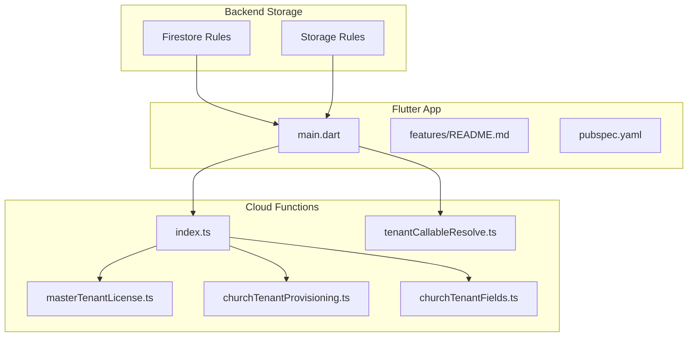
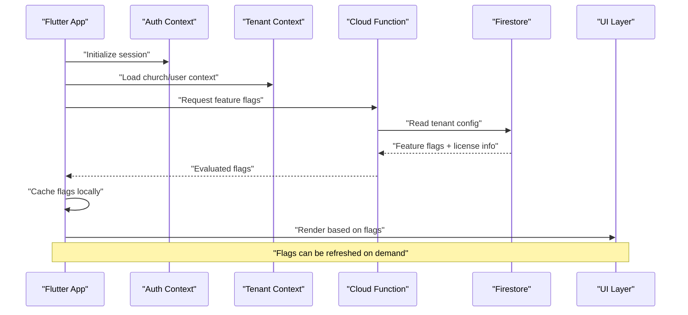
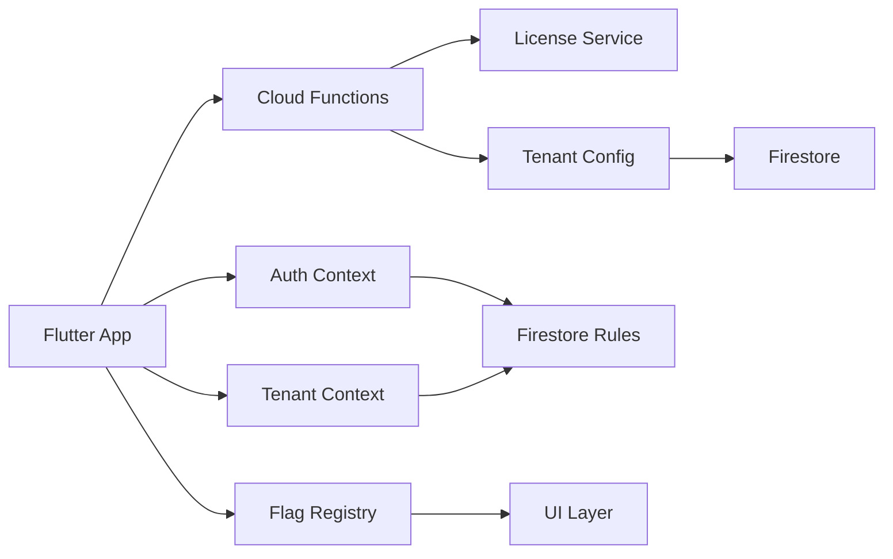

# Feature Flags & Toggles

<cite>
**Referenced Files in This Document**
- [flutter_app/lib/main.dart](file://flutter_app/lib/main.dart)
- [flutter_app/lib/features/README.md](file://flutter_app/lib/features/README.md)
- [flutter_app/pubspec.yaml](file://flutter_app/pubspec.yaml)
- [functions/src/index.ts](file://functions/src/index.ts)
- [functions/src/masterTenantLicense.ts](file://functions/src/masterTenantLicense.ts)
- [functions/src/churchTenantProvisioning.ts](file://functions/src/churchTenantProvisioning.ts)
- [functions/src/churchTenantFields.ts](file://functions/src/churchTenantFields.ts)
- [functions/src/tenantCallableResolve.ts](file://functions/src/tenantCallableResolve.ts)
- [firestore.rules](file://firestore.rules)
- [storage.rules](file://storage.rules)
</cite>

## Table of Contents
1. [Introduction](#introduction)
2. [Project Structure](#project-structure)
3. [Core Components](#core-components)
4. [Architecture Overview](#architecture-overview)
5. [Detailed Component Analysis](#detailed-component-analysis)
6. [Dependency Analysis](#dependency-analysis)
7. [Performance Considerations](#performance-considerations)
8. [Troubleshooting Guide](#troubleshooting-guide)
9. [Conclusion](#conclusion)
10. [Appendices](#appendices)

## Introduction
This document explains the feature flags and toggles system used across the Gestão Yahweh Premium application. It covers how features are enabled or disabled dynamically, how tenant-specific (per-church) features are configured, and how rollouts are managed at runtime. It also provides guidance on adding new feature flags, implementing conditional logic, managing dependencies between features, and integrating with the multi-tenant architecture to enable features per church or user group. Best practices for naming, lifecycle management, and cleanup procedures are included to ensure a robust and maintainable system.

## Project Structure
The feature flag system spans multiple layers:
- Flutter app layer: UI and business logic that evaluate feature flags locally and via remote configuration.
- Cloud Functions: Server-side evaluation and provisioning of tenant-level feature settings.
- Firestore rules and storage rules: Access control and data scoping based on tenant context and feature availability.

**Diagram sources**
- [flutter_app/lib/main.dart](file://flutter_app/lib/main.dart)
- [flutter_app/lib/features/README.md](file://flutter_app/lib/features/README.md)
- [flutter_app/pubspec.yaml](file://flutter_app/pubspec.yaml)
- [functions/src/index.ts](file://functions/src/index.ts)
- [functions/src/masterTenantLicense.ts](file://functions/src/masterTenantLicense.ts)
- [functions/src/churchTenantProvisioning.ts](file://functions/src/churchTenantProvisioning.ts)
- [functions/src/churchTenantFields.ts](file://functions/src/churchTenantFields.ts)
- [functions/src/tenantCallableResolve.ts](file://functions/src/tenantCallableResolve.ts)
- [firestore.rules](file://firestore.rules)
- [storage.rules](file://storage.rules)

**Section sources**
- [flutter_app/lib/main.dart](file://flutter_app/lib/main.dart)
- [flutter_app/lib/features/README.md](file://flutter_app/lib/features/README.md)
- [flutter_app/pubspec.yaml](file://flutter_app/pubspec.yaml)
- [functions/src/index.ts](file://functions/src/index.ts)
- [functions/src/masterTenantLicense.ts](file://functions/src/masterTenantLicense.ts)
- [functions/src/churchTenantProvisioning.ts](file://functions/src/churchTenantProvisioning.ts)
- [functions/src/churchTenantFields.ts](file://functions/src/churchTenantFields.ts)
- [functions/src/tenantCallableResolve.ts](file://functions/src/tenantCallableResolve.ts)
- [firestore.rules](file://firestore.rules)
- [storage.rules](file://storage.rules)

## Core Components
- Feature Flag Registry: Centralized definitions of feature identifiers and default states.
- Tenant Context Provider: Supplies current church and user context to evaluators.
- Remote Configuration Service: Fetches live feature flags from server endpoints or Firestore.
- Conditional Logic Layer: UI and service code that branch behavior based on evaluated flags.
- Rollout Manager: Gradual rollout controls (e.g., percentage-based or targeted).
- Dependency Resolver: Ensures prerequisite features are enabled before enabling dependent ones.

Key responsibilities:
- Provide consistent flag names and types across platforms.
- Cache and refresh flags efficiently.
- Enforce server-side authorization for sensitive features.
- Maintain auditability and rollback capability.

**Section sources**
- [flutter_app/lib/features/README.md](file://flutter_app/lib/features/README.md)
- [flutter_app/lib/main.dart](file://flutter_app/lib/main.dart)
- [functions/src/tenantCallableResolve.ts](file://functions/src/tenantCallableResolve.ts)

## Architecture Overview
The feature flag architecture combines client-side evaluation with server-side validation:

**Diagram sources**
- [flutter_app/lib/main.dart](file://flutter_app/lib/main.dart)
- [functions/src/tenantCallableResolve.ts](file://functions/src/tenantCallableResolve.ts)
- [functions/src/masterTenantLicense.ts](file://functions/src/masterTenantLicense.ts)
- [functions/src/churchTenantProvisioning.ts](file://functions/src/churchTenantProvisioning.ts)
- [functions/src/churchTenantFields.ts](file://functions/src/churchTenantFields.ts)

## Detailed Component Analysis

### Feature Flag Registry and Defaults
- Purpose: Define all available feature flags, their types, and defaults.
- Scope: Global defaults plus overrides per tenant.
- Implementation patterns:
  - Enumerated flag keys for consistency.
  - Typed values (boolean, string, number) to prevent misuse.
  - Versioned schema to support migrations.

Best practices:
- Use clear, descriptive names (e.g., enable_church_chat, show_donations_module).
- Group related flags under namespaces (e.g., finance.*, chat.*).
- Avoid hardcoding flag checks; centralize in registry.

**Section sources**
- [flutter_app/lib/features/README.md](file://flutter_app/lib/features/README.md)
- [flutter_app/pubspec.yaml](file://flutter_app/pubspec.yaml)

### Tenant-Specific Configuration
- Purpose: Allow per-church customization of features.
- Storage: Firestore documents keyed by church ID with feature fields.
- Provisioning: Initial feature set seeded during tenant creation.
- Resolution: Merge global defaults with tenant overrides.

Operational flow:
- On login, load tenant context.
- Fetch tenant feature flags from server.
- Apply overrides and cache locally.
- Re-evaluate UI and services when context changes.

**Section sources**
- [functions/src/churchTenantProvisioning.ts](file://functions/src/churchTenantProvisioning.ts)
- [functions/src/churchTenantFields.ts](file://functions/src/churchTenantFields.ts)
- [functions/src/tenantCallableResolve.ts](file://functions/src/tenantCallableResolve.ts)

### License and Plan-Based Features
- Purpose: Gate premium features based on tenant license and plan tier.
- Evaluation: Server-side check against license metadata.
- Enforcement: Combine license state with feature flags to determine access.

Lifecycle:
- Validate license on startup.
- Refresh license status periodically or on demand.
- Disable features immediately if license expires.

**Section sources**
- [functions/src/masterTenantLicense.ts](file://functions/src/masterTenantLicense.ts)

### Runtime Evaluation and Conditional Logic
- Client-side: Fast decisions for UI rendering and minor feature gating.
- Server-side: Critical path enforcement for security-sensitive features.
- Caching: Local cache with TTL and invalidation triggers.
- Refresh: Pull-to-refresh, background sync, or event-driven updates.

Patterns:
- Guard clauses around feature-dependent code paths.
- Fallbacks for missing or stale flags.
- Logging and metrics for flag usage.

**Section sources**
- [flutter_app/lib/main.dart](file://flutter_app/lib/main.dart)
- [functions/src/tenantCallableResolve.ts](file://functions/src/tenantCallableResolve.ts)

### Multi-Tenant Integration
- Context propagation: Ensure church ID and user roles are attached to requests.
- Data scoping: Firestore and Storage rules enforce tenant boundaries.
- Feature visibility: Hide or disable modules not licensed for the tenant.

Integration points:
- Authentication middleware validates tenant membership.
- Callable functions resolve flags within tenant scope.
- Rules validate read/write permissions based on flags and roles.

**Section sources**
- [firestore.rules](file://firestore.rules)
- [storage.rules](file://storage.rules)
- [functions/src/churchTenantProvisioning.ts](file://functions/src/churchTenantProvisioning.ts)

### Adding New Feature Flags
Steps:
1. Register the flag in the registry with type and default.
2. Add tenant field mapping if applicable.
3. Implement client-side evaluation in relevant UI/services.
4. Add server-side checks for sensitive operations.
5. Update documentation and tests.
6. Deploy and monitor rollout.

Checklist:
- Consistent naming convention.
- Backward compatibility for older clients.
- Migration script for existing tenants.
- Observability hooks (logs, metrics).

**Section sources**
- [flutter_app/lib/features/README.md](file://flutter_app/lib/features/README.md)
- [functions/src/churchTenantFields.ts](file://functions/src/churchTenantFields.ts)

### Managing Feature Dependencies
- Declare prerequisites explicitly.
- Resolve order to avoid partial enablement.
- Validate dependency graph before deployment.
- Handle failures gracefully with fallbacks.

Example dependency:
- If enable_church_chat is true, then require enable_notifications.

**Section sources**
- [flutter_app/lib/features/README.md](file://flutter_app/lib/features/README.md)

### Rollout Management
- Phased rollout: Start with internal users, then small cohorts, then full release.
- Targeting: By church ID, user role, or region.
- Metrics: Track adoption and error rates per cohort.
- Rollback: Instant toggle off without redeploy.

Tools:
- Server-side toggles for immediate effect.
- Client-side caches with short TTL for quick propagation.

**Section sources**
- [functions/src/tenantCallableResolve.ts](file://functions/src/tenantCallableResolve.ts)

## Dependency Analysis
Feature flags depend on authentication, tenant context, and backend services. The following diagram shows key relationships:

**Diagram sources**
- [flutter_app/lib/main.dart](file://flutter_app/lib/main.dart)
- [functions/src/index.ts](file://functions/src/index.ts)
- [functions/src/masterTenantLicense.ts](file://functions/src/masterTenantLicense.ts)
- [functions/src/churchTenantProvisioning.ts](file://functions/src/churchTenantProvisioning.ts)
- [functions/src/churchTenantFields.ts](file://functions/src/churchTenantFields.ts)
- [functions/src/tenantCallableResolve.ts](file://functions/src/tenantCallableResolve.ts)
- [firestore.rules](file://firestore.rules)

**Section sources**
- [functions/src/index.ts](file://functions/src/index.ts)
- [functions/src/masterTenantLicense.ts](file://functions/src/masterTenantLicense.ts)
- [functions/src/churchTenantProvisioning.ts](file://functions/src/churchTenantProvisioning.ts)
- [functions/src/churchTenantFields.ts](file://functions/src/churchTenantFields.ts)
- [functions/src/tenantCallableResolve.ts](file://functions/src/tenantCallableResolve.ts)
- [firestore.rules](file://firestore.rules)

## Performance Considerations
- Minimize network calls: Cache flags locally with appropriate TTL.
- Batch updates: Group flag changes to reduce churn.
- Lazy loading: Load flags only when needed.
- Debounce refresh: Avoid excessive re-evaluations.
- Optimize rule evaluations: Keep Firestore and Storage rules efficient.

Recommendations:
- Use edge caching where possible.
- Monitor latency and error rates for flag resolution.
- Profile UI rendering impacted by flag checks.

[No sources needed since this section provides general guidance]

## Troubleshooting Guide
Common issues and resolutions:
- Flags not updating: Check cache TTL and refresh triggers.
- Tenant mismatch: Verify church ID and user roles in context.
- License expired: Confirm license status and renewal process.
- Rule denials: Inspect Firestore and Storage rules for tenant scoping.
- Inconsistent behavior: Ensure client and server evaluations align.

Debugging steps:
- Log flag resolution path and values.
- Compare local cache vs server response.
- Validate tenant provisioning data.
- Test with different user roles and churches.

**Section sources**
- [functions/src/tenantCallableResolve.ts](file://functions/src/tenantCallableResolve.ts)
- [firestore.rules](file://firestore.rules)
- [storage.rules](file://storage.rules)

## Conclusion
The feature flags system in Gestão Yahweh Premium enables dynamic, tenant-aware control of functionality across platforms. By combining centralized registries, server-side evaluation, and robust multi-tenant integration, it supports safe rollouts and precise targeting. Adhering to best practices for naming, lifecycle management, and cleanup ensures long-term maintainability and reliability.

[No sources needed since this section summarizes without analyzing specific files]

## Appendices

### Best Practices for Naming
- Use lowercase with underscores.
- Prefix with module or domain (e.g., finance_enable_reports).
- Avoid ambiguous terms like “new” or “beta”.

### Lifecycle Management
- Create: Define flag, defaults, and migration.
- Test: Validate in staging with representative tenants.
- Deploy: Roll out gradually with monitoring.
- Monitor: Track usage and errors.
- Deprecate: Mark as deprecated, communicate timeline.
- Remove: Clean up code, configs, and data.

### Cleanup Procedures
- Remove flag references from UI and services.
- Delete tenant fields after backfill completion.
- Update documentation and tests.
- Archive old flag versions for audit.

[No sources needed since this section provides general guidance]