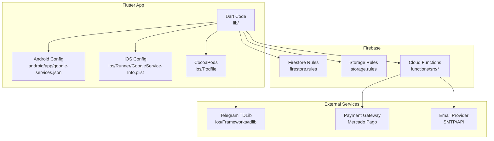
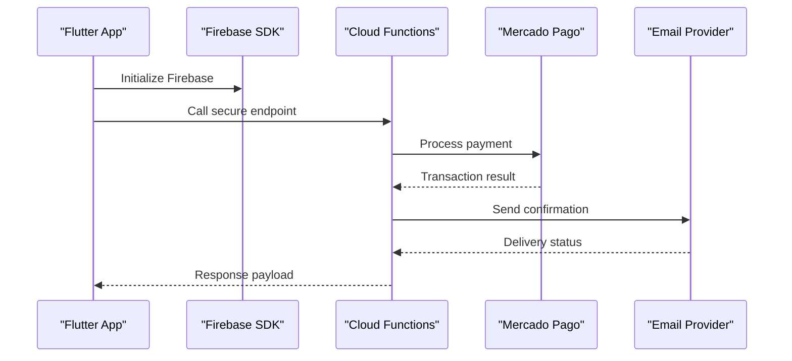
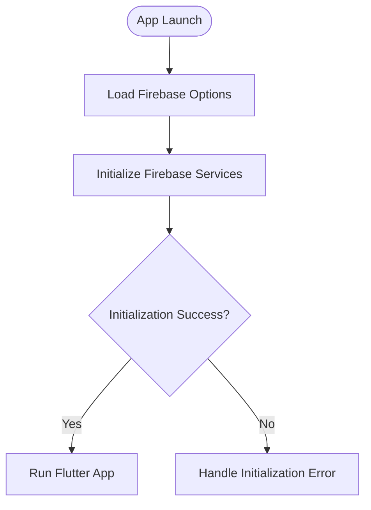
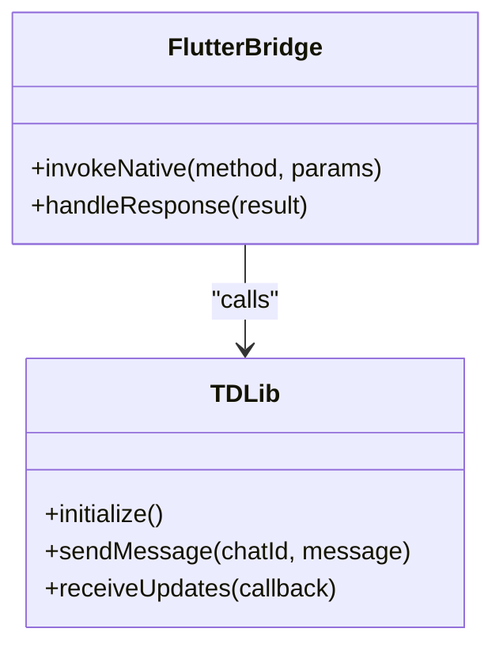
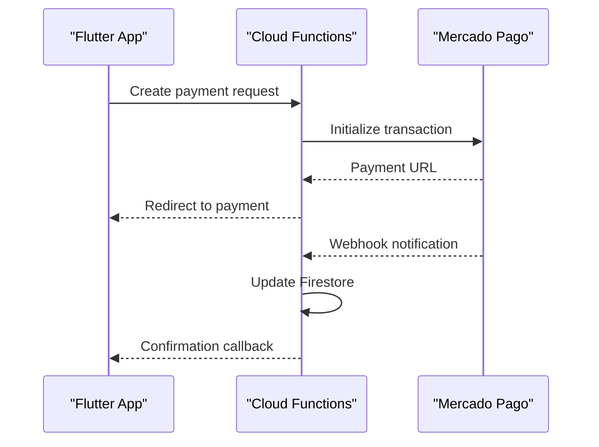
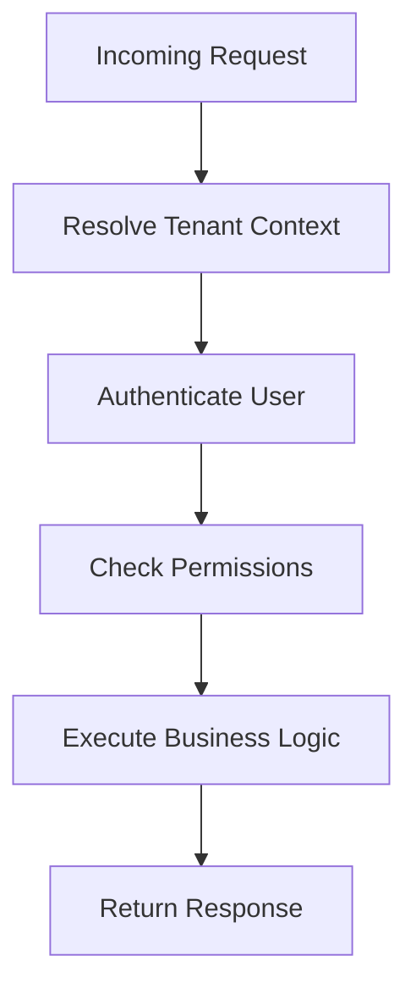
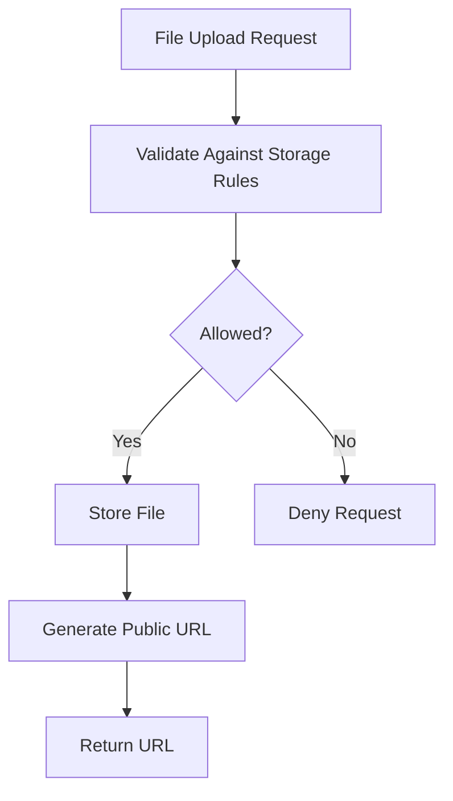
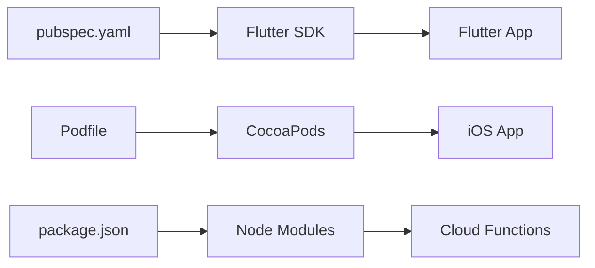

# Plugin & Service Configuration

<cite>
**Referenced Files in This Document**
- [pubspec.yaml](file://flutter_app/pubspec.yaml)
- [firebase_options.dart](file://flutter_app/lib/firebase_options.dart)
- [main.dart](file://flutter_app/lib/main.dart)
- [firebase.json](file://flutter_app/firebase.json)
- [.firebaserc](file://flutter_app/.firebaserc)
- [google-services.json](file://flutter_app/android/app/google-services.json)
- [GoogleService-Info.plist](file://flutter_app/ios/Runner/GoogleService-Info.plist)
- [Podfile](file://flutter_app/ios/Podfile)
- [functions/package.json](file://functions/package.json)
- [functions/index.ts](file://functions/src/index.ts)
- [functions/churchMercadoPago.ts](file://functions/src/churchMercadoPago.ts)
- [functions/syncChurchMercadoPagoCluster.ts](file://functions/src/syncChurchMercadoPagoCluster.ts)
- [functions/masterPlatformAuth.ts](file://functions/src/masterPlatformAuth.ts)
- [functions/publicSignupEmail.ts](file://functions/src/publicSignupEmail.ts)
- [functions/pushNovoConteudo.ts](file://functions/src/pushNovoConteudo.ts)
- [functions/membroSessionSync.ts](file://functions/src/membroSessionSync.ts)
- [functions/tenantCallableResolve.ts](file://functions/src/tenantCallableResolve.ts)
- [storage_cors.json](file://flutter_app/storage_cors.json)
- [cors.json](file://cors.json)
- [firestore.rules](file://firestore.rules)
- [storage.rules](file://storage.rules)
- [codemagic.yaml](file://codemagic.yaml)
- [deploy_web_hosting.ps1](file://scripts/deploy_web_hosting.ps1)
- [apply_storage_cors.ps1](file://scripts/apply_storage_cors.ps1)
- [ensure_firebase_domains_aligned.ps1](file://scripts/ensure_firebase_domains_aligned.ps1)
</cite>

## Table of Contents
1. [Introduction](#introduction)
2. [Project Structure](#project-structure)
3. [Core Components](#core-components)
4. [Architecture Overview](#architecture-overview)
5. [Detailed Component Analysis](#detailed-component-analysis)
6. [Dependency Analysis](#dependency-analysis)
7. [Performance Considerations](#performance-considerations)
8. [Troubleshooting Guide](#troubleshooting-guide)
9. [Conclusion](#conclusion)
10. [Appendices](#appendices)

## Introduction
This document provides comprehensive plugin and service configuration guidance for the Gestão Yahweh Premium application. It covers third-party integrations including Firebase services, Telegram (TDLib), payment gateways (Mercado Pago), and external APIs used by Cloud Functions. It also explains dependency management, version control practices, conflict resolution strategies, setup instructions per provider, authentication configuration, rate limiting considerations, plugin architecture patterns, custom plugin development, service abstraction, examples for configuring new services, handling failures, and implementing fallback mechanisms.

## Project Structure
The project is a multi-platform Flutter app with:
- Flutter app under flutter_app/ containing platform-specific configurations and Dart code.
- Firebase Cloud Functions under functions/ for server-side integrations and orchestration.
- Scripts under scripts/ for deployment, CI/CD, and environment alignment.
- Documentation and rules files at the repository root.

Key integration points:
- Firebase initialization and options are configured via generated files and runtime initialization.
- Android and iOS native plugins are managed through Gradle and CocoaPods respectively.
- Cloud Functions encapsulate sensitive integrations such as payments and email notifications.
- Storage CORS and Firestore rules enforce security boundaries.

**Diagram sources**
- [firebase_options.dart](file://flutter_app/lib/firebase_options.dart)
- [google-services.json](file://flutter_app/android/app/google-services.json)
- [GoogleService-Info.plist](file://flutter_app/ios/Runner/GoogleService-Info.plist)
- [Podfile](file://flutter_app/ios/Podfile)
- [firestore.rules](file://firestore.rules)
- [storage.rules](file://storage.rules)
- [functions/src/index.ts](file://functions/src/index.ts)

**Section sources**
- [pubspec.yaml](file://flutter_app/pubspec.yaml)
- [firebase_options.dart](file://flutter_app/lib/firebase_options.dart)
- [main.dart](file://flutter_app/lib/main.dart)
- [firebase.json](file://flutter_app/firebase.json)
- [.firebaserc](file://flutter_app/.firebaserc)
- [google-services.json](file://flutter_app/android/app/google-services.json)
- [GoogleService-Info.plist](file://flutter_app/ios/Runner/GoogleService-Info.plist)
- [Podfile](file://flutter_app/ios/Podfile)
- [functions/package.json](file://functions/package.json)
- [functions/src/index.ts](file://functions/src/index.ts)

## Core Components
- Firebase Initialization:
  - Generated Firebase options are loaded at app startup to configure Firebase services across platforms.
  - Platform-specific configuration files ensure correct credentials for Android and iOS.
- Cloud Functions:
  - Centralized server-side logic handles secure integrations like payments, emails, and tenant resolution.
  - Callable endpoints abstract client interactions from provider specifics.
- Storage and Security:
  - Firestore and Storage rules define access policies and data validation.
  - CORS settings enable web hosting and cross-origin requests where necessary.
- Telegram Integration:
  - TDLib framework is included for advanced messaging capabilities on iOS.
- Payment Gateway:
  - Mercado Pago integration is implemented within Cloud Functions to manage transactions securely.

**Section sources**
- [firebase_options.dart](file://flutter_app/lib/firebase_options.dart)
- [main.dart](file://flutter_app/lib/main.dart)
- [functions/src/index.ts](file://functions/src/index.ts)
- [functions/src/churchMercadoPago.ts](file://functions/src/churchMercadoPago.ts)
- [functions/src/publicSignupEmail.ts](file://functions/src/publicSignupEmail.ts)
- [firestore.rules](file://firestore.rules)
- [storage.rules](file://storage.rules)
- [Podfile](file://flutter_app/ios/Podfile)

## Architecture Overview
The system follows a layered architecture:
- Client Layer (Flutter): Handles UI, local state, and calls to Firebase services and Cloud Functions.
- Server Layer (Cloud Functions): Orchestrates external API calls, manages secrets, and enforces business logic.
- Data Layer (Firestore/Storage): Stores structured data and media with strict access controls.
- External Integrations: Telegram, payment gateways, and email providers are accessed exclusively from the server layer.

**Diagram sources**
- [main.dart](file://flutter_app/lib/main.dart)
- [functions/src/churchMercadoPago.ts](file://functions/src/churchMercadoPago.ts)
- [functions/src/publicSignupEmail.ts](file://functions/src/publicSignupEmail.ts)

## Detailed Component Analysis

### Firebase Services Configuration
- Initialization:
  - Use generated firebase_options.dart to initialize Firebase services consistently across platforms.
- Platform-Specific Setup:
  - Android: Ensure google-services.json is present and correctly referenced in build configuration.
  - iOS: Verify GoogleService-Info.plist is included and CocoaPods dependencies are installed.
- Runtime Behavior:
  - Main entry point initializes Firebase before running the app.

**Diagram sources**
- [main.dart](file://flutter_app/lib/main.dart)
- [firebase_options.dart](file://flutter_app/lib/firebase_options.dart)

**Section sources**
- [main.dart](file://flutter_app/lib/main.dart)
- [firebase_options.dart](file://flutter_app/lib/firebase_options.dart)
- [google-services.json](file://flutter_app/android/app/google-services.json)
- [GoogleService-Info.plist](file://flutter_app/ios/Runner/GoogleService-Info.plist)

### Telegram Integration (TDLib)
- Framework Inclusion:
  - TDLib static library is integrated into iOS builds via CocoaPods.
- Usage Pattern:
  - Access messaging features through native bridges exposed to Dart.
- Configuration:
  - Ensure proper entitlements and permissions are set for push notifications and background tasks.

**Diagram sources**
- [Podfile](file://flutter_app/ios/Podfile)

**Section sources**
- [Podfile](file://flutter_app/ios/Podfile)

### Payment Gateway (Mercado Pago)
- Server-Side Implementation:
  - Cloud Functions handle payment creation, webhook processing, and status synchronization.
- Security:
  - Sensitive credentials are stored in environment variables or secret managers.
- Error Handling:
  - Implement retries and fallback mechanisms for network failures.

**Diagram sources**
- [functions/src/churchMercadoPago.ts](file://functions/src/churchMercadoPago.ts)
- [functions/src/syncChurchMercadoPagoCluster.ts](file://functions/src/syncChurchMercadoPagoCluster.ts)

**Section sources**
- [functions/src/churchMercadoPago.ts](file://functions/src/churchMercadoPago.ts)
- [functions/src/syncChurchMercadoPagoCluster.ts](file://functions/src/syncChurchMercadoPagoCluster.ts)

### External APIs and Authentication
- Master Platform Auth:
  - Centralized authentication logic for multi-tenant scenarios.
- Tenant Resolution:
  - Dynamic tenant configuration based on domain or user context.
- Email Notifications:
  - Secure sending of registration and transactional emails.

**Diagram sources**
- [functions/src/masterPlatformAuth.ts](file://functions/src/masterPlatformAuth.ts)
- [functions/src/tenantCallableResolve.ts](file://functions/src/tenantCallableResolve.ts)
- [functions/src/publicSignupEmail.ts](file://functions/src/publicSignupEmail.ts)

**Section sources**
- [functions/src/masterPlatformAuth.ts](file://functions/src/masterPlatformAuth.ts)
- [functions/src/tenantCallableResolve.ts](file://functions/src/tenantCallableResolve.ts)
- [functions/src/publicSignupEmail.ts](file://functions/src/publicSignupEmail.ts)

### Storage and Security Rules
- Firestore Rules:
  - Define granular access controls for collections and documents.
- Storage Rules:
  - Restrict file uploads and downloads based on user roles and ownership.
- CORS Configuration:
  - Enable cross-origin requests for web hosting and APIs.

**Diagram sources**
- [storage.rules](file://storage.rules)
- [storage_cors.json](file://flutter_app/storage_cors.json)
- [cors.json](file://cors.json)

**Section sources**
- [firestore.rules](file://firestore.rules)
- [storage.rules](file://storage.rules)
- [storage_cors.json](file://flutter_app/storage_cors.json)
- [cors.json](file://cors.json)

## Dependency Analysis
- Flutter Dependencies:
  - Managed via pubspec.yaml with version constraints and lockfile for reproducibility.
- Native Dependencies:
  - Android uses Gradle; iOS uses CocoaPods for plugin management.
- Cloud Functions Dependencies:
  - Node.js packages defined in package.json with semantic versioning.

**Diagram sources**
- [pubspec.yaml](file://flutter_app/pubspec.yaml)
- [Podfile](file://flutter_app/ios/Podfile)
- [functions/package.json](file://functions/package.json)

**Section sources**
- [pubspec.yaml](file://flutter_app/pubspec.yaml)
- [Podfile](file://flutter_app/ios/Podfile)
- [functions/package.json](file://functions/package.json)

## Performance Considerations
- Lazy Loading:
  - Initialize heavy services only when needed to reduce startup time.
- Caching:
  - Implement local caching for frequently accessed data to minimize network calls.
- Rate Limiting:
  - Configure rate limits for external API calls to prevent throttling and ensure stability.
- Optimization:
  - Use efficient data structures and algorithms in both client and server code.

[No sources needed since this section provides general guidance]

## Troubleshooting Guide
- Common Issues:
  - Firebase initialization errors due to missing or incorrect configuration files.
  - Network timeouts when calling external APIs.
  - Permission denied errors from Firestore or Storage rules.
- Debugging Steps:
  - Check logs in Firebase Console and Cloud Functions.
  - Validate configuration files and environment variables.
  - Test API endpoints using tools like Postman or curl.
- Recovery Strategies:
  - Implement retry logic with exponential backoff.
  - Provide fallback mechanisms for critical services.

**Section sources**
- [functions/src/churchMercadoPago.ts](file://functions/src/churchMercadoPago.ts)
- [functions/src/publicSignupEmail.ts](file://functions/src/publicSignupEmail.ts)

## Conclusion
This documentation outlines the plugin and service configuration for the Gestão Yahweh Premium application, covering Firebase, Telegram, payment gateways, and external APIs. By following the provided guidelines, developers can effectively integrate new services, manage dependencies, and ensure robust error handling and performance optimization.

[No sources needed since this section summarizes without analyzing specific files]

## Appendices
- Setup Instructions:
  - Follow platform-specific guides for Firebase configuration.
  - Install and configure native plugins using Gradle and CocoaPods.
- Version Control:
  - Commit all configuration files and lockfiles to maintain consistency.
- Conflict Resolution:
  - Use merge strategies and resolve conflicts systematically during updates.

[No sources needed since this section provides general guidance]