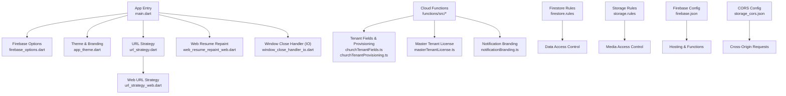
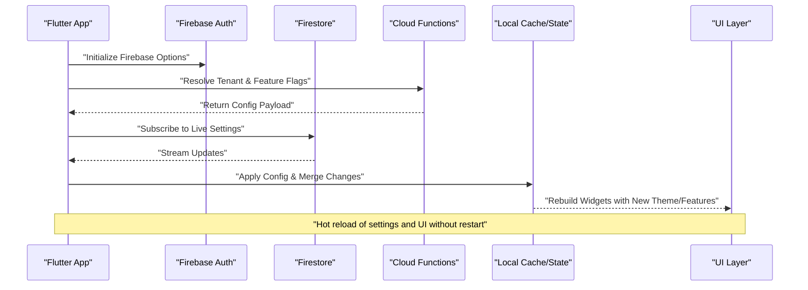
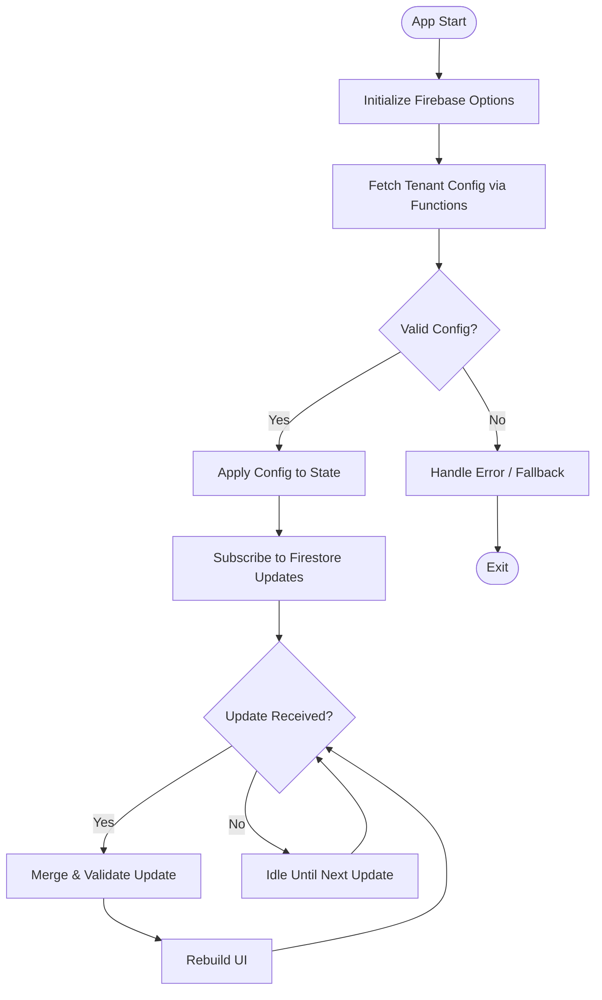
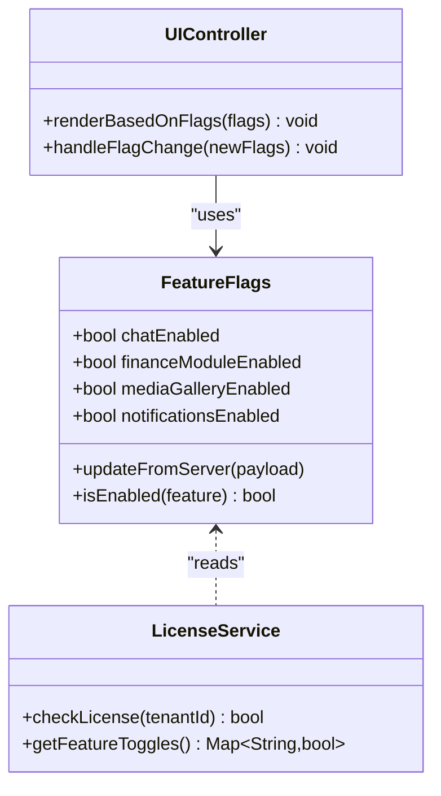
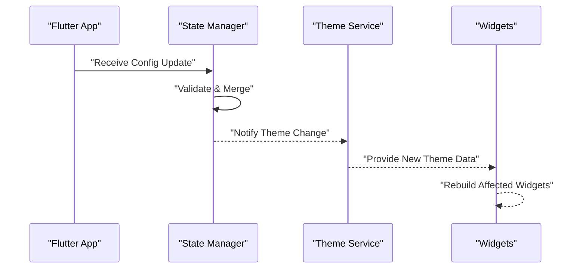
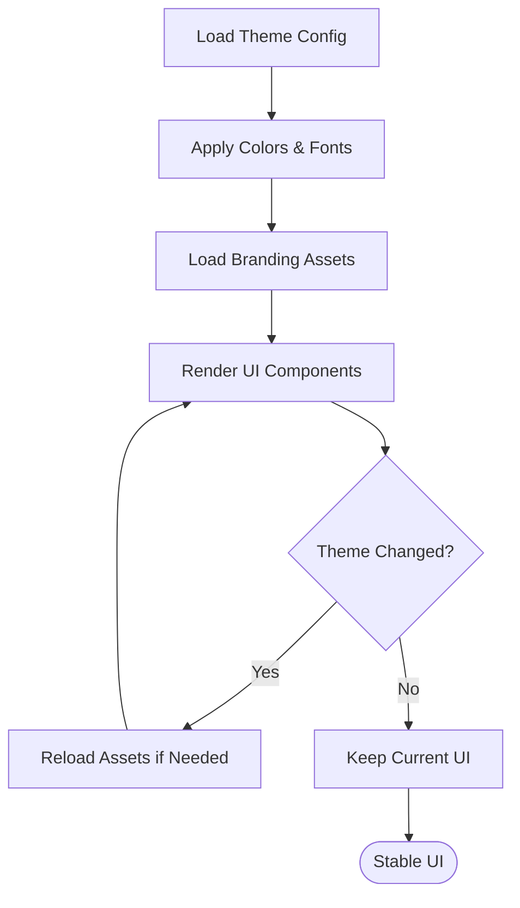
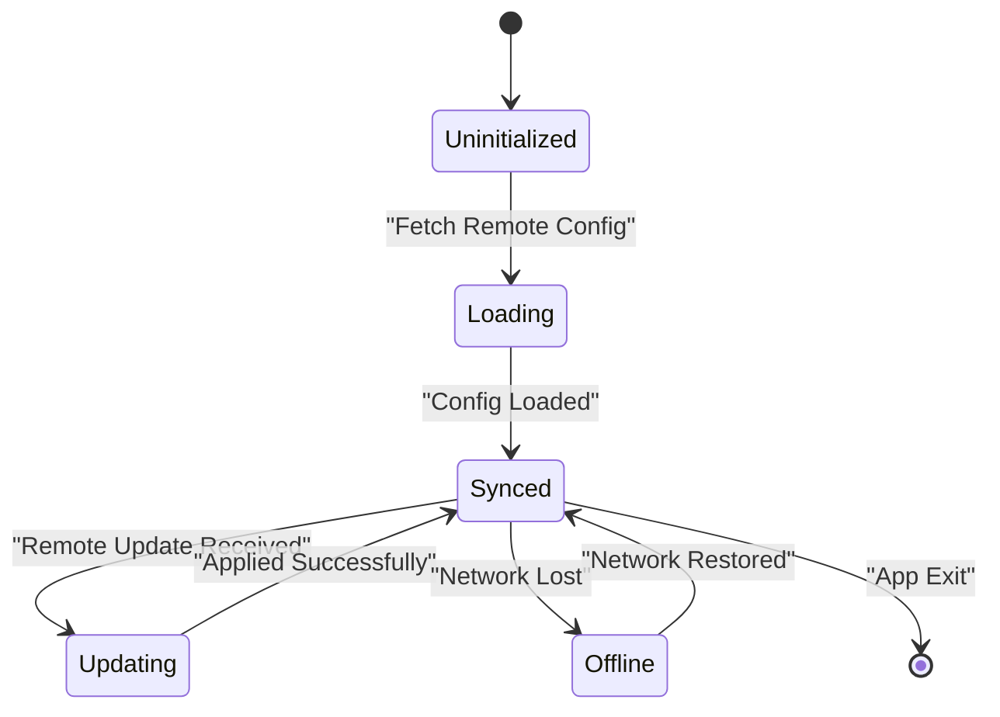
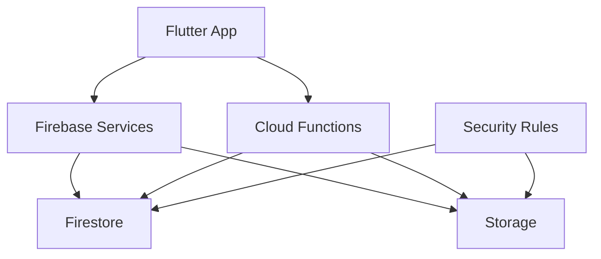

# Runtime Customization

<cite>
**Referenced Files in This Document**
- [main.dart](file://flutter_app/lib/main.dart)
- [app_theme.dart](file://flutter_app/lib/app_theme.dart)
- [firebase_options.dart](file://flutter_app/lib/firebase_options.dart)
- [url_strategy.dart](file://flutter_app/lib/url_strategy.dart)
- [url_strategy_web.dart](file://flutter_app/lib/url_strategy_web.dart)
- [web_resume_repaint_stub.dart](file://flutter_app/lib/web_resume_repaint_stub.dart)
- [web_resume_repaint_web.dart](file://flutter_app/lib/web_resume_repaint_web.dart)
- [window_close_handler_io.dart](file://flutter_app/lib/window_close_handler_io.dart)
- [window_close_handler_stub.dart](file://flutter_app/lib/window_close_handler_stub.dart)
- [pubspec.yaml](file://flutter_app/pubspec.yaml)
- [firebase.json](file://flutter_app/firebase.json)
- [storage_cors.json](file://flutter_app/storage_cors.json)
- [index.ts](file://functions/src/index.ts)
- [churchTenantFields.ts](file://functions/src/churchTenantFields.ts)
- [churchTenantProvisioning.ts](file://functions/src/churchTenantProvisioning.ts)
- [masterTenantLicense.ts](file://functions/src/masterTenantLicense.ts)
- [notificationBranding.ts](file://functions/src/notificationBranding.ts)
- [firestore.rules](file://firestore.rules)
- [storage.rules](file://storage.rules)
</cite>

## Table of Contents
1. [Introduction](#introduction)
2. [Project Structure](#project-structure)
3. [Core Components](#core-components)
4. [Architecture Overview](#architecture-overview)
5. [Detailed Component Analysis](#detailed-component-analysis)
6. [Dependency Analysis](#dependency-analysis)
7. [Performance Considerations](#performance-considerations)
8. [Troubleshooting Guide](#troubleshooting-guide)
9. [Conclusion](#conclusion)
10. [Appendices](#appendices)

## Introduction
This document provides detailed runtime customization guidance for the Gestão Yahweh Premium application. It focuses on dynamic configuration loading, runtime feature switching, live application modification, and safe practices for hot reloading settings and UI customization. It also covers configuration persistence, cross-device synchronization, conflict resolution strategies, performance considerations, and debugging techniques for runtime changes.

## Project Structure
The Flutter app is organized into platform-specific entry points and shared Dart modules. Configuration and runtime behavior are influenced by:
- App initialization and environment setup
- Theme and branding services
- Firebase options and rules
- Cloud Functions for tenant provisioning and feature flags
- Platform-specific handlers for web and desktop behaviors

**Diagram sources**
- [main.dart](file://flutter_app/lib/main.dart)
- [firebase_options.dart](file://flutter_app/lib/firebase_options.dart)
- [app_theme.dart](file://flutter_app/lib/app_theme.dart)
- [url_strategy.dart](file://flutter_app/lib/url_strategy.dart)
- [url_strategy_web.dart](file://flutter_app/lib/url_strategy_web.dart)
- [web_resume_repaint_stub.dart](file://flutter_app/lib/web_resume_repaint_stub.dart)
- [web_resume_repaint_web.dart](file://flutter_app/lib/web_resume_repaint_web.dart)
- [window_close_handler_io.dart](file://flutter_app/lib/window_close_handler_io.dart)
- [index.ts](file://functions/src/index.ts)
- [churchTenantFields.ts](file://functions/src/churchTenantFields.ts)
- [churchTenantProvisioning.ts](file://functions/src/churchTenantProvisioning.ts)
- [masterTenantLicense.ts](file://functions/src/masterTenantLicense.ts)
- [notificationBranding.ts](file://functions/src/notificationBranding.ts)
- [firestore.rules](file://firestore.rules)
- [storage.rules](file://storage.rules)
- [firebase.json](file://flutter_app/firebase.json)
- [storage_cors.json](file://flutter_app/storage_cors.json)

**Section sources**
- [main.dart](file://flutter_app/lib/main.dart)
- [firebase_options.dart](file://flutter_app/lib/firebase_options.dart)
- [app_theme.dart](file://flutter_app/lib/app_theme.dart)
- [url_strategy.dart](file://flutter_app/lib/url_strategy.dart)
- [url_strategy_web.dart](file://flutter_app/lib/url_strategy_web.dart)
- [web_resume_repaint_stub.dart](file://flutter_app/lib/web_resume_repaint_stub.dart)
- [web_resume_repaint_web.dart](file://flutter_app/lib/web_resume_repaint_web.dart)
- [window_close_handler_io.dart](file://flutter_app/lib/window_close_handler_io.dart)
- [pubspec.yaml](file://flutter_app/pubspec.yaml)
- [firebase.json](file://flutter_app/firebase.json)
- [storage_cors.json](file://flutter_app/storage_cors.json)
- [index.ts](file://functions/src/index.ts)
- [churchTenantFields.ts](file://functions/src/churchTenantFields.ts)
- [churchTenantProvisioning.ts](file://functions/src/churchTenantProvisioning.ts)
- [masterTenantLicense.ts](file://functions/src/masterTenantLicense.ts)
- [notificationBranding.ts](file://functions/src/notificationBranding.ts)
- [firestore.rules](file://firestore.rules)
- [storage.rules](file://storage.rules)

## Core Components
- App Initialization and Environment
  - The main entry initializes Firebase options, sets up URL strategy, and configures platform-specific behaviors such as resume repaint handling and window close policies.
- Theme and Branding Service
  - Centralizes theme and branding decisions that can be updated at runtime to reflect tenant or user preferences.
- Firebase Configuration
  - Provides environment-specific Firebase project settings used across the app.
- Cloud Functions for Dynamic Features
  - Server-side logic for tenant provisioning, license checks, notification branding, and feature flag management.
- Security Rules
  - Firestore and Storage rules enforce access control and data integrity, which can influence runtime behavior and feature availability.

**Section sources**
- [main.dart](file://flutter_app/lib/main.dart)
- [app_theme.dart](file://flutter_app/lib/app_theme.dart)
- [firebase_options.dart](file://flutter_app/lib/firebase_options.dart)
- [index.ts](file://functions/src/index.ts)
- [churchTenantFields.ts](file://functions/src/churchTenantFields.ts)
- [churchTenantProvisioning.ts](file://functions/src/churchTenantProvisioning.ts)
- [masterTenantLicense.ts](file://functions/src/masterTenantLicense.ts)
- [notificationBranding.ts](file://functions/src/notificationBranding.ts)
- [firestore.rules](file://firestore.rules)
- [storage.rules](file://storage.rules)

## Architecture Overview
Runtime customization flows from server-provided configuration to client-side state updates, with UI reflecting changes without requiring a full restart.

**Diagram sources**
- [main.dart](file://flutter_app/lib/main.dart)
- [firebase_options.dart](file://flutter_app/lib/firebase_options.dart)
- [index.ts](file://functions/src/index.ts)
- [churchTenantFields.ts](file://functions/src/churchTenantFields.ts)
- [churchTenantProvisioning.ts](file://functions/src/churchTenantProvisioning.ts)
- [masterTenantLicense.ts](file://functions/src/masterTenantLicense.ts)
- [notificationBranding.ts](file://functions/src/notificationBranding.ts)
- [firestore.rules](file://firestore.rules)

## Detailed Component Analysis

### Dynamic Configuration Loading
- Purpose: Load tenant-specific settings, feature flags, and branding at runtime.
- Mechanism:
  - Cloud Functions resolve tenant fields and provisioning details.
  - Firestore streams provide live updates to the client.
  - Local state merges incoming configurations and triggers UI rebuilds.
- Implementation patterns:
  - Use a centralized configuration service to fetch and cache settings.
  - Subscribe to Firestore collections for real-time updates.
  - Validate and normalize payloads before applying them.

**Diagram sources**
- [main.dart](file://flutter_app/lib/main.dart)
- [firebase_options.dart](file://flutter_app/lib/firebase_options.dart)
- [index.ts](file://functions/src/index.ts)
- [churchTenantFields.ts](file://functions/src/churchTenantFields.ts)
- [churchTenantProvisioning.ts](file://functions/src/churchTenantProvisioning.ts)
- [firestore.rules](file://firestore.rules)

**Section sources**
- [index.ts](file://functions/src/index.ts)
- [churchTenantFields.ts](file://functions/src/churchTenantFields.ts)
- [churchTenantProvisioning.ts](file://functions/src/churchTenantProvisioning.ts)
- [firestore.rules](file://firestore.rules)

### Runtime Feature Switching
- Purpose: Enable/disable features dynamically based on tenant license or admin toggles.
- Mechanism:
  - Master tenant license function determines feature availability.
  - Client reads feature flags from local state or Firestore.
  - UI conditionally renders features based on flags.
- Best practices:
  - Keep feature flags immutable during a session unless explicitly updated.
  - Debounce rapid flag changes to avoid excessive rebuilds.
  - Provide fallbacks when flags are missing or invalid.

**Diagram sources**
- [masterTenantLicense.ts](file://functions/src/masterTenantLicense.ts)
- [index.ts](file://functions/src/index.ts)

**Section sources**
- [masterTenantLicense.ts](file://functions/src/masterTenantLicense.ts)
- [index.ts](file://functions/src/index.ts)

### Live Application Modification (Hot Reloading Settings)
- Purpose: Apply configuration changes without restarting the app.
- Mechanism:
  - Firestore listeners push updates to the client.
  - State manager merges new settings and triggers widget rebuilds.
  - Theme and branding services update resources on the fly.
- Implementation tips:
  - Use a reactive state container to propagate changes efficiently.
  - Batch updates to minimize rebuild frequency.
  - Persist critical settings locally to survive crashes.

**Diagram sources**
- [app_theme.dart](file://flutter_app/lib/app_theme.dart)
- [main.dart](file://flutter_app/lib/main.dart)

**Section sources**
- [app_theme.dart](file://flutter_app/lib/app_theme.dart)
- [main.dart](file://flutter_app/lib/main.dart)

### Dynamic UI Customization
- Purpose: Adapt UI elements based on runtime configuration.
- Mechanism:
  - Theme service exposes colors, fonts, and layouts.
  - UI components read current theme and render accordingly.
  - Branding assets are loaded dynamically from storage or CDN.
- Guidelines:
  - Separate static and dynamic UI properties.
  - Cache branding assets to reduce network calls.
  - Ensure accessibility compliance when changing themes.

**Diagram sources**
- [app_theme.dart](file://flutter_app/lib/app_theme.dart)

**Section sources**
- [app_theme.dart](file://flutter_app/lib/app_theme.dart)

### Configuration Persistence and Synchronization
- Purpose: Persist settings locally and synchronize across devices.
- Mechanism:
  - Local storage caches critical settings for offline use.
  - Firestore serves as the source of truth for multi-device sync.
  - Conflict resolution prioritizes server timestamps or version vectors.
- Strategies:
  - Use optimistic updates with rollback on failure.
  - Implement last-write-wins with metadata tracking.
  - Provide user-visible indicators for sync status.

**Diagram sources**
- [firestore.rules](file://firestore.rules)

**Section sources**
- [firestore.rules](file://firestore.rules)

### Conflict Resolution Strategies
- Purpose: Resolve conflicting updates from multiple devices.
- Approaches:
  - Timestamp-based resolution: latest update wins.
  - Version vectors: track per-field versions to merge safely.
  - Operational transforms: apply sequences of operations deterministically.
- Recommendations:
  - Log conflicts for auditability.
  - Provide manual override for critical settings.
  - Test conflict scenarios thoroughly.

[No sources needed since this section provides general guidance]

### Safe Runtime Modifications
- Purpose: Ensure stability when modifying app behavior at runtime.
- Practices:
  - Validate all inputs before applying changes.
  - Wrap modifications in try-catch blocks with fallbacks.
  - Limit scope of changes to isolated modules.
  - Use feature flags to toggle risky changes.

[No sources needed since this section provides general guidance]

### Performance Considerations
- Purpose: Optimize runtime updates for responsiveness.
- Techniques:
  - Debounce frequent updates to reduce rebuilds.
  - Use efficient state containers with selective rebuilding.
  - Cache expensive computations and assets.
  - Profile memory usage during hot reloads.

[No sources needed since this section provides general guidance]

### Debugging Runtime Changes
- Purpose: Diagnose issues with dynamic configuration and UI updates.
- Tools:
  - Logging framework to capture config changes.
  - DevTools for state inspection and performance profiling.
  - Network monitoring to verify Firestore updates.
- Tips:
  - Add verbose logging in development builds.
  - Use feature flags to enable debug modes.
  - Simulate network failures to test resilience.

[No sources needed since this section provides general guidance]

## Dependency Analysis
Runtime customization depends on several layers:
- Flutter app layer handles UI and state management.
- Firebase services provide authentication, database, and storage.
- Cloud Functions implement business logic for tenant and feature management.
- Security rules enforce data access and integrity.

**Diagram sources**
- [main.dart](file://flutter_app/lib/main.dart)
- [firebase_options.dart](file://flutter_app/lib/firebase_options.dart)
- [index.ts](file://functions/src/index.ts)
- [firestore.rules](file://firestore.rules)
- [storage.rules](file://storage.rules)

**Section sources**
- [main.dart](file://flutter_app/lib/main.dart)
- [firebase_options.dart](file://flutter_app/lib/firebase_options.dart)
- [index.ts](file://functions/src/index.ts)
- [firestore.rules](file://firestore.rules)
- [storage.rules](file://storage.rules)

## Performance Considerations
- Minimize unnecessary rebuilds by using efficient state management.
- Cache frequently accessed configuration values locally.
- Use background tasks for heavy processing to keep UI responsive.
- Monitor memory leaks during long-running sessions.

[No sources needed since this section provides general guidance]

## Troubleshooting Guide
- Common Issues:
  - Configuration not loading: Check Firebase options and network connectivity.
  - UI not updating: Verify state propagation and widget rebuild triggers.
  - Sync conflicts: Inspect timestamps and version vectors.
- Debug Steps:
  - Enable verbose logging in development mode.
  - Use DevTools to inspect state and network requests.
  - Test with simulated network failures and invalid configs.

[No sources needed since this section provides general guidance]

## Conclusion
Runtime customization in Gestão Yahweh Premium enables dynamic, tenant-specific experiences without app restarts. By leveraging Cloud Functions, Firestore, and a robust state management approach, the application supports live configuration updates, feature switching, and UI customization. Following best practices for safety, performance, and debugging ensures a stable and responsive user experience.

[No sources needed since this section summarizes without analyzing specific files]

## Appendices
- Additional Resources:
  - Firebase documentation for real-time updates and security rules.
  - Flutter state management guides for efficient UI updates.
  - Cloud Functions best practices for scalable backend logic.

[No sources needed since this section provides general guidance]