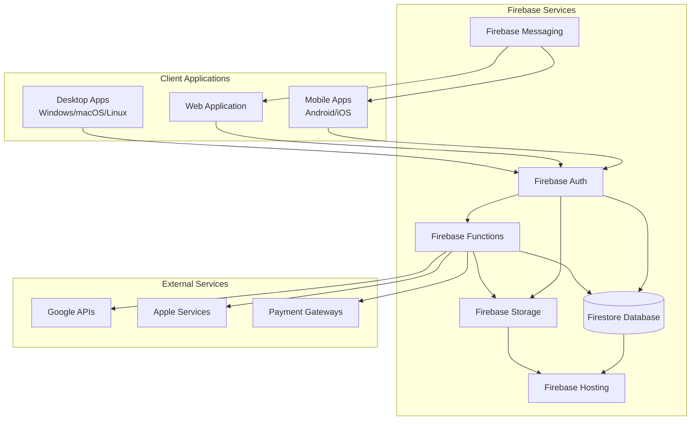
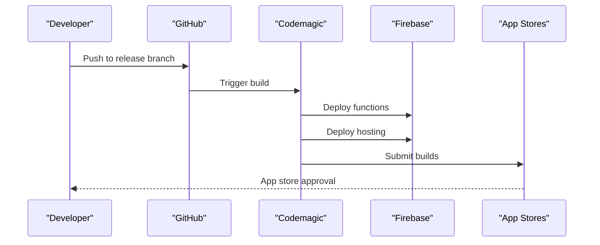

# Contributing Guide

<cite>
**Referenced Files in This Document**
- [CONTRIBUTING.md](file://CONTRIBUTING.md)
- [README.md](file://README.md)
- [flutter_app/README.md](file://flutter_app/README.md)
- [flutter_app/pubspec.yaml](file://flutter_app/pubspec.yaml)
- [functions/package.json](file://functions/package.json)
- [codemagic.yaml](file://codemagic.yaml)
- [firebase.json](file://firebase.json)
- [firestore.rules](file://firestore.rules)
- [storage.rules](file://storage.rules)
- [.github/workflows/deploy-web.yml](file://.github/workflows/deploy-web.yml)
- [.github/workflows/codemagic_ios_trigger.yml](file://.github/workflows/codemagic_ios_trigger.yml)
</cite>

## Table of Contents
1. [Introduction](#introduction)
2. [Project Overview](#project-overview)
3. [Development Environment Setup](#development-environment-setup)
4. [Code Contribution Process](#code-contribution-process)
5. [Coding Standards and Guidelines](#coding-standards-and-guidelines)
6. [Testing Requirements](#testing-requirements)
7. [Documentation Standards](#documentation-standards)
8. [Release Procedures](#release-procedures)
9. [Review Process](#review-process)
10. [Community Guidelines](#community-guidelines)
11. [Troubleshooting](#troubleshooting)
12. [Appendices](#appendices)

## Introduction

Welcome to the Gestão Yahweh Premium project! This comprehensive contributing guide will help you understand how to contribute effectively to this multi-platform church management application built with Flutter and Firebase. Whether you're a first-time contributor or an experienced developer, this guide provides all the information you need to get started.

The project is a sophisticated church management system that supports multiple platforms including Android, iOS, Web, Windows, macOS, and Linux. It features real-time synchronization, offline-first architecture, and comprehensive business logic for church administration.

## Project Overview

Gestão Yahweh Premium is a full-stack church management application with the following key characteristics:

### Architecture Overview
- **Frontend**: Flutter-based multi-platform application
- **Backend**: Firebase Functions for serverless computing
- **Database**: Firestore for real-time data synchronization
- **Storage**: Firebase Storage for media and documents
- **Authentication**: Firebase Authentication with custom policies
- **CI/CD**: Codemagic and GitHub Actions for automated deployment

### Key Features
- Multi-tenant architecture supporting multiple churches
- Real-time chat and messaging system
- Financial management and reporting
- Member management and directory
- Event scheduling and calendar
- Media management and gallery
- PDF generation and document handling
- Push notifications across platforms
- Offline-first data synchronization



**Diagram sources**
- [firebase.json:1-50](file://firebase.json#L1-L50)
- [functions/src/index.ts:1-100](file://functions/src/index.ts#L1-L100)

**Section sources**
- [README.md:1-100](file://README.md#L1-L100)
- [flutter_app/README.md:1-50](file://flutter_app/README.md#L1-L50)

## Development Environment Setup

### Prerequisites

Before setting up the development environment, ensure you have the following installed:

#### Required Software
- **Flutter SDK** (version 3.x or later)
- **Dart SDK** (bundled with Flutter)
- **Git** (for version control)
- **Node.js** (version 16+ for Firebase Functions)
- **Firebase CLI** (for local development)
- **Java JDK 21** (for Android development)
- **Xcode** (for iOS development - macOS only)
- **Android Studio** (for Android development)

#### Platform-Specific Requirements

**For Android Development:**
- Android SDK API level 33+
- Android Build Tools 33.0.0+
- Android Emulator or physical device
- Google Play Services

**For iOS Development:**
- Xcode 14+
- iOS Deployment Target 13.0+
- CocoaPods
- Apple Developer Account (for signing)

**For Web Development:**
- Modern web browser (Chrome recommended)
- Node.js for build tools

### Initial Setup

#### 1. Clone the Repository
```bash
git clone https://github.com/your-org/gestao-yahweh-premium.git
cd gestao-yahweh-premium
```

#### 2. Install Dependencies
```bash
# Install Flutter dependencies
cd flutter_app
flutter pub get

# Install Firebase Functions dependencies
cd ../functions
npm install
```

#### 3. Configure Firebase
```bash
# Login to Firebase
firebase login

# Link your Firebase project
firebase use --add

# Download configuration files
flutterfire configure
```

#### 4. Set Up Local Development
```bash
# Start Firebase emulators
firebase emulators:start

# Run the Flutter app
flutter run
```

### Environment Configuration

Create necessary configuration files:

#### Android Configuration
Set up `android/key.properties` for signing:
```properties
storeFile=your_keystore.jks
storePassword=your_password
keyAlias=your_alias
keyPassword=your_password
```

#### iOS Configuration
Configure signing in Xcode workspace and set up required entitlements.

#### Firebase Configuration
Ensure `google-services.json` (Android) and `GoogleService-Info.plist` (iOS) are properly configured.

**Section sources**
- [flutter_app/pubspec.yaml:1-100](file://flutter_app/pubspec.yaml#L1-L100)
- [functions/package.json:1-50](file://functions/package.json#L1-L50)

## Code Contribution Process

### Branch Strategy

The project follows a structured branching strategy:

- **`main`**: Production-ready code
- **`develop`**: Integration branch for features
- **`feature/*`**: Feature development branches
- **`bugfix/*`**: Bug fix branches
- **`hotfix/*`**: Critical production fixes
- **`release/*`**: Release preparation branches

### Pull Request Workflow

#### 1. Create a Feature Branch
```bash
git checkout develop
git checkout -b feature/your-feature-name
```

#### 2. Make Your Changes
- Write clean, well-documented code
- Add appropriate tests
- Update documentation as needed

#### 3. Commit Your Changes
Use descriptive commit messages following conventional commits:
```bash
feat: add new church member registration form
fix: resolve database connection timeout issue
docs: update API documentation for authentication
test: add unit tests for payment processing
```

#### 4. Push and Create Pull Request
```bash
git push origin feature/your-feature-name
```

Then create a pull request on GitHub with:
- Clear description of changes
- Related issue numbers
- Testing instructions
- Screenshots if UI changes

### Code Review Process

All pull requests require:
- **Minimum 2 approvals** from maintainers
- **CI/CD pipeline** must pass
- **Code quality checks** must succeed
- **Tests must pass** with adequate coverage
- **No merge conflicts** with target branch

**Section sources**
- [.github/workflows/deploy-web.yml:1-100](file://.github/workflows/deploy-web.yml#L1-L100)
- [codemagic.yaml:1-100](file://codemagic.yaml#L1-L100)

## Coding Standards and Guidelines

### Dart/Flutter Standards

#### Code Style
- Follow the official Dart style guide
- Use `dart format` for automatic formatting
- Enable lint rules in `analysis_options.yaml`
- Maintain consistent naming conventions

#### File Organization
```
lib/
├── core/           # Core functionality and utilities
├── features/       # Feature-specific modules
├── shared/         # Shared components and widgets
├── models/         # Data models and entities
├── services/       # Business logic and services
├── repositories/   # Data access layer
├── ui/            # User interface components
└── utils/          # Utility functions and helpers
```

#### Naming Conventions
- **Classes**: PascalCase (`ChurchMember`, `FinancialReport`)
- **Variables**: camelCase (`churchName`, `memberCount`)
- **Functions**: camelCase (`getMembers()`, `saveData()`)
- **Constants**: UPPER_SNAKE_CASE (`MAX_RETRIES`, `DEFAULT_TIMEOUT`)
- **Files**: snake_case (`church_member_model.dart`)

#### Documentation
- Use Dart doc comments for public APIs
- Include parameter descriptions and return types
- Provide usage examples for complex functions
- Keep documentation updated with code changes

### TypeScript/JavaScript Standards (Firebase Functions)

#### Code Structure
- Organize functions by feature/domain
- Use TypeScript for type safety
- Implement proper error handling
- Follow async/await patterns

#### Error Handling
```typescript
// Proper error handling pattern
try {
  const result = await someAsyncOperation();
  return { success: true, data: result };
} catch (error) {
  logger.error('Operation failed', error);
  return { success: false, error: error.message };
}
```

### Git Best Practices

#### Commit Messages
Follow conventional commits format:
- `feat:` New features
- `fix:` Bug fixes
- `docs:` Documentation changes
- `style:` Code style changes
- `refactor:` Code refactoring
- `test:` Test additions/modifications
- `chore:` Maintenance tasks

#### Branch Management
- Keep branches focused on single concerns
- Regularly sync with main branch
- Delete merged branches promptly
- Use meaningful branch names

**Section sources**
- [flutter_app/analysis_options.yaml:1-100](file://flutter_app/analysis_options.yaml#L1-L100)
- [functions/tsconfig.json:1-50](file://functions/tsconfig.json#L1-L50)

## Testing Requirements

### Unit Testing

#### Flutter Tests
- Write unit tests for business logic
- Mock external dependencies
- Test edge cases and error conditions
- Aim for high test coverage (>80%)

```dart
// Example test structure
test('should calculate church membership correctly', () {
  final service = ChurchService();
  final result = service.calculateMembership(data);
  expect(result, expectedValue);
});
```

#### Firebase Functions Tests
- Test function triggers and handlers
- Mock Firebase services
- Validate input/output schemas
- Test error scenarios

### Integration Testing

#### Widget Testing
- Test user interface components
- Verify widget interactions
- Ensure responsive design
- Test theme and styling

#### E2E Testing
- Test complete user flows
- Validate data persistence
- Check cross-platform compatibility
- Performance benchmarking

### Test Execution

```bash
# Run Flutter tests
flutter test

# Run specific test file
flutter test test/church_service_test.dart

# Run with coverage
flutter test --coverage

# Run Firebase Functions tests
cd functions
npm test
```

### Quality Gates
- All tests must pass before merging
- Code coverage must meet minimum thresholds
- No critical security vulnerabilities
- Performance benchmarks within acceptable ranges

**Section sources**
- [flutter_app/test/widget_test.dart:1-50](file://flutter_app/test/widget_test.dart#L1-L50)
- [security_rules_test_firestore/test/firestore.rules.test.js:1-100](file://security_rules_test_firestore/test/firestore.rules.test.js#L1-L100)

## Documentation Standards

### Code Documentation

#### Dart Documentation
```dart
/// Calculates the total revenue for a church within a date range.
/// 
/// [churchId] The unique identifier of the church
/// [startDate] The beginning of the date range
/// [endDate] The end of the date range
/// 
/// Returns the total revenue amount or null if no data found
Future<double?> calculateTotalRevenue({
  required String churchId,
  required DateTime startDate,
  required DateTime endDate,
}) async {
  // Implementation
}
```

#### API Documentation
- Document all public APIs
- Include parameter descriptions
- Specify return types and possible errors
- Provide usage examples

### Project Documentation

#### README Updates
- Keep README current with setup instructions
- Update feature descriptions
- Maintain changelog entries
- Document breaking changes

#### Architecture Documentation
- Update architecture diagrams
- Document design decisions
- Record migration procedures
- Maintain dependency maps

### User Documentation

#### In-App Help
- Provide contextual help
- Include tooltips and hints
- Document user workflows
- Offer troubleshooting guides

#### External Documentation
- Maintain user manuals
- Create video tutorials
- Document API endpoints
- Provide integration guides

**Section sources**
- [docs/ARCHITECTURE_PERFORMANCE_MULTI_PLATFORM.md:1-100](file://docs/ARCHITECTURE_PERFORMANCE_MULTI_PLATFORM.md#L1-L100)
- [docs/PADRAO_MESTRE_WISDOMAPP_YAHWEH_TOTAL.md:1-100](file://docs/PADRAO_MESTRE_WISDOMAPP_YAHWEH_TOTAL.md#L1-L100)

## Release Procedures

### Version Management

#### Semantic Versioning
Follow semantic versioning for releases:
- **Major**: Breaking changes
- **Minor**: New features (backward compatible)
- **Patch**: Bug fixes (backward compatible)

#### Version Bumping
```bash
# Update Flutter app version
./scripts/bump_version.ps1 <new-version>

# Update Firebase Functions version
# Edit package.json manually
```

### Pre-Release Checklist

#### Code Quality
- [ ] All tests passing
- [ ] Code analysis clean
- [ ] Security audit completed
- [ ] Performance benchmarks reviewed
- [ ] Documentation updated

#### Testing
- [ ] Unit tests pass
- [ ] Integration tests pass
- [ ] E2E tests pass
- [ ] Cross-platform testing completed
- [ ] Beta testing feedback incorporated

#### Deployment Preparation
- [ ] Changelog updated
- [ ] Release notes prepared
- [ ] Migration scripts ready
- [ ] Rollback plan documented
- [ ] Monitoring alerts configured

### Automated Deployment

#### CI/CD Pipeline
The project uses Codemagic and GitHub Actions for automated deployment:



**Diagram sources**
- [.github/workflows/deploy-web.yml:1-100](file://.github/workflows/deploy-web.yml#L1-L100)
- [.github/workflows/codemagic_ios_trigger.yml:1-100](file://.github/workflows/codemagic_ios_trigger.yml#L1-L100)

### Post-Release Activities

#### Monitoring
- Monitor error rates and performance
- Track user adoption metrics
- Watch for regression issues
- Collect user feedback

#### Communication
- Announce release to stakeholders
- Update documentation
- Notify support team
- Prepare rollback procedures

**Section sources**
- [scripts/DEPLOY_PRODUCAO_YAHWEH.ps1:1-100](file://scripts/DEPLOY_PRODUCAO_YAHWEH.ps1#L1-L100)
- [scripts/release_completo_web_aab.ps1:1-100](file://scripts/release_completo_web_aab.ps1#L1-L100)

## Review Process

### Code Review Guidelines

#### Reviewer Responsibilities
- Verify code quality and standards compliance
- Check for security vulnerabilities
- Validate performance implications
- Ensure test coverage adequacy
- Confirm documentation updates

#### Review Criteria
- **Functionality**: Does the code work as intended?
- **Quality**: Is the code clean and maintainable?
- **Security**: Are there any security risks?
- **Performance**: Will it impact performance?
- **Testing**: Are tests adequate and passing?
- **Documentation**: Is it properly documented?

### Approval Process

#### Required Approvals
- Minimum 2 maintainer approvals
- All CI/CD checks must pass
- No outstanding review comments
- Merge conflicts resolved

#### Merge Strategies
- Squash merge for feature branches
- Rebase merge for bug fixes
- Fast-forward merge when possible

### Continuous Integration

#### Automated Checks
- Linting and static analysis
- Unit and integration tests
- Security scanning
- Performance testing
- Cross-platform validation

**Section sources**
- [.github/workflows/deploy-web.yml:1-100](file://.github/workflows/deploy-web.yml#L1-L100)
- [codemagic.yaml:1-100](file://codemagic.yaml#L1-L100)

## Community Guidelines

### Collaboration Principles

#### Communication
- Use clear and respectful language
- Provide constructive feedback
- Ask questions when unsure
- Share knowledge openly
- Document decisions and rationale

#### Code of Conduct
- Be inclusive and welcoming
- Respect diverse perspectives
- Focus on technical merit
- Avoid personal attacks
- Support learning and growth

### Issue Reporting

#### Bug Reports
Include:
- Clear description of the issue
- Steps to reproduce
- Expected vs actual behavior
- Environment details
- Screenshots or logs if applicable

#### Feature Requests
Include:
- Problem statement
- Proposed solution
- Benefits and use cases
- Technical considerations
- Alternative approaches

### Contributing Etiquette

#### Before Contributing
- Check existing issues and PRs
- Read contribution guidelines
- Understand project scope
- Follow coding standards
- Test your changes thoroughly

#### During Contribution
- Keep changes focused and atomic
- Write clear commit messages
- Update documentation
- Add appropriate tests
- Respond to review feedback

**Section sources**
- [AGENTS.md:1-100](file://AGENTS.md#L1-L100)
- [docs/CHECKLIST_PRODUCAO.md:1-100](file://docs/CHECKLIST_PRODUCAO.md#L1-L100)

## Troubleshooting

### Common Development Issues

#### Flutter Setup Problems
- **Issue**: Flutter commands not found
  - **Solution**: Ensure Flutter is in PATH and properly installed
- **Issue**: Dependency resolution failures
  - **Solution**: Run `flutter clean` and `flutter pub get`
- **Issue**: Android/iOS build failures
  - **Solution**: Check platform-specific configurations and dependencies

#### Firebase Integration Issues
- **Issue**: Authentication failures
  - **Solution**: Verify Firebase configuration and credentials
- **Issue**: Firestore permission errors
  - **Solution**: Check security rules and user permissions
- **Issue**: Function deployment failures
  - **Solution**: Review function logs and error messages

#### CI/CD Pipeline Issues
- **Issue**: Build failures in CI
  - **Solution**: Reproduce locally and check environment variables
- **Issue**: Test timeouts
  - **Solution**: Optimize tests and increase timeout limits
- **Issue**: Deployment failures
  - **Solution**: Check deployment scripts and permissions

### Debugging Techniques

#### Local Debugging
- Use Flutter DevTools for debugging
- Enable verbose logging
- Use Firebase emulators for testing
- Profile performance bottlenecks

#### Remote Debugging
- Connect to production environments carefully
- Use distributed tracing
- Monitor error tracking services
- Analyze crash reports

### Getting Help

#### Resources
- Project documentation
- Flutter and Firebase documentation
- Community forums and Stack Overflow
- Internal team channels

#### Escalation Path
1. Check existing documentation and issues
2. Ask in team communication channels
3. Contact project maintainers
4. Open a detailed issue report

**Section sources**
- [scripts/setup_dev_machine_windows.ps1:1-100](file://scripts/setup_dev_machine_windows.ps1#L1-L100)
- [docs/FIREBASE_OBSERVABILITY.md:1-100](file://docs/FIREBASE_OBSERVABILITY.md#L1-L100)

## Appendices

### Quick Reference Commands

#### Development Commands
```bash
# Start development server
flutter run

# Run tests
flutter test

# Analyze code
flutter analyze

# Format code
dart format .

# Build for production
flutter build apk --release
flutter build ios --release
```

#### Firebase Commands
```bash
# Deploy functions
firebase deploy --only functions

# Deploy hosting
firebase deploy --only hosting

# Run emulators
firebase emulators:start

# View logs
firebase functions:log
```

### Useful Links

#### Documentation
- [Flutter Documentation](https://flutter.dev/docs)
- [Firebase Documentation](https://firebase.google.com/docs)
- [Dart Language Tour](https://dart.dev/guides/language/tour)
- [TypeScript Handbook](https://www.typescriptlang.org/docs/)

#### Tools and Utilities
- [Flutter DevTools](https://docs.flutter.dev/tools/devtools)
- [Firebase Console](https://console.firebase.google.com)
- [Codemagic Dashboard](https://codemagic.io/dashboard)
- [GitHub Actions](https://github.com/features/actions)

### Contact Information

#### Maintainers
- Primary maintainer contact information
- Secondary maintainer contact information
- Emergency contact procedures

#### Community Channels
- Discord/Slack channel
- GitHub Discussions
- Email list
- Community forum

---

Thank you for contributing to Gestão Yahweh Premium! Your efforts help improve church management for communities worldwide. If you have any questions about this guide, please don't hesitate to reach out to the maintainers.

**Section sources**
- [scripts/flutter_analyze_relax.ps1:1-50](file://scripts/flutter_analyze_relax.ps1#L1-L50)
- [scripts/firebase_rules_gcp_publish.cjs:1-100](file://scripts/firebase_rules_gcp_publish.cjs#L1-L100)