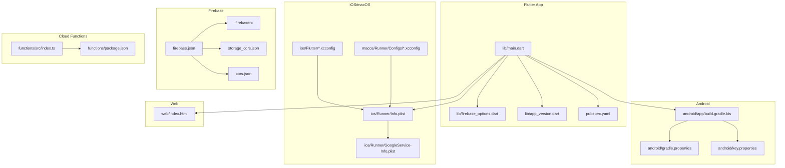
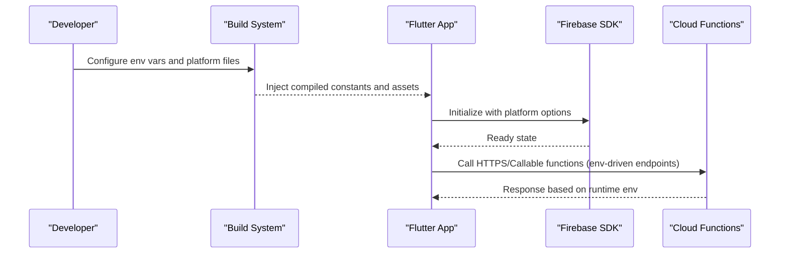
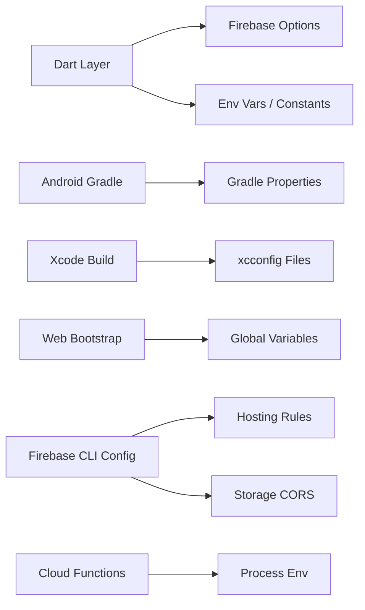

# Configuration Management

<cite>
**Referenced Files in This Document**
- [firebase_options.dart](file://flutter_app/lib/firebase_options.dart)
- [main.dart](file://flutter_app/lib/main.dart)
- [pubspec.yaml](file://flutter_app/pubspec.yaml)
- [android/app/build.gradle.kts](file://flutter_app/android/app/build.gradle.kts)
- [android/gradle.properties](file://flutter_app/android/gradle.properties)
- [android/key.properties](file://flutter_app/android/key.properties)
- [android/key.properties.example](file://flutter_app/android/key.properties.example)
- [ios/Runner/Info.plist](file://flutter_app/ios/Runner/Info.plist)
- [ios/Runner/GoogleService-Info.plist](file://flutter_app/ios/Runner/GoogleService-Info.plist)
- [ios/Flutter/Debug.xcconfig](file://flutter_app/ios/Flutter/Debug.xcconfig)
- [ios/Flutter/Release.xcconfig](file://flutter_app/ios/Flutter/Release.xcconfig)
- [macos/Runner/Configs/Debug.xcconfig](file://flutter_app/macos/Runner/Configs/Debug.xcconfig)
- [macos/Runner/Configs/Release.xcconfig](file://flutter_app/macos/Runner/Configs/Release.xcconfig)
- [web/index.html](file://flutter_app/web/index.html)
- [functions/src/index.ts](file://functions/src/index.ts)
- [functions/package.json](file://functions/package.json)
- [firebase.json](file://firebase.json)
- [.firebaserc](file://.firebaserc)
- [storage_cors.json](file://flutter_app/storage_cors.json)
- [cors.json](file://cors.json)
- [app_version.dart](file://flutter_app/lib/app_version.dart)
</cite>

## Table of Contents
1. [Introduction](#introduction)
2. [Project Structure](#project-structure)
3. [Core Components](#core-components)
4. [Architecture Overview](#architecture-overview)
5. [Detailed Component Analysis](#detailed-component-analysis)
6. [Dependency Analysis](#dependency-analysis)
7. [Performance Considerations](#performance-considerations)
8. [Troubleshooting Guide](#troubleshooting-guide)
9. [Conclusion](#conclusion)
10. [Appendices](#appendices)

## Introduction
This document explains how configuration is managed across the Flutter app, Firebase services, and Cloud Functions. It covers environment variable handling, feature flags, API endpoint configuration, platform-specific settings, Firebase configuration, app metadata management, and runtime configuration loading. It also provides guidance on adding new configuration options, managing environments (development, staging, production), and securing sensitive data.

## Project Structure
Configuration spans multiple layers:
- Flutter app: Dart code and platform configs for Android, iOS, macOS, and web.
- Firebase project: CLI config and hosting/storage rules.
- Cloud Functions: Node.js runtime with environment variables.
- CI/CD and scripts: Build-time injection and deployment helpers.

**Diagram sources**
- [main.dart](file://flutter_app/lib/main.dart)
- [firebase_options.dart](file://flutter_app/lib/firebase_options.dart)
- [app_version.dart](file://flutter_app/lib/app_version.dart)
- [pubspec.yaml](file://flutter_app/pubspec.yaml)
- [android/app/build.gradle.kts](file://flutter_app/android/app/build.gradle.kts)
- [android/gradle.properties](file://flutter_app/android/gradle.properties)
- [android/key.properties](file://flutter_app/android/key.properties)
- [ios/Runner/Info.plist](file://flutter_app/ios/Runner/Info.plist)
- [ios/Runner/GoogleService-Info.plist](file://flutter_app/ios/Runner/GoogleService-Info.plist)
- [ios/Flutter/Debug.xcconfig](file://flutter_app/ios/Flutter/Debug.xcconfig)
- [ios/Flutter/Release.xcconfig](file://flutter_app/ios/Flutter/Release.xcconfig)
- [macos/Runner/Configs/Debug.xcconfig](file://flutter_app/macos/Runner/Configs/Debug.xcconfig)
- [macos/Runner/Configs/Release.xcconfig](file://flutter_app/macos/Runner/Configs/Release.xcconfig)
- [web/index.html](file://flutter_app/web/index.html)
- [firebase.json](file://firebase.json)
- [.firebaserc](file://.firebaserc)
- [storage_cors.json](file://flutter_app/storage_cors.json)
- [cors.json](file://cors.json)
- [functions/src/index.ts](file://functions/src/index.ts)
- [functions/package.json](file://functions/package.json)

**Section sources**
- [main.dart](file://flutter_app/lib/main.dart)
- [firebase_options.dart](file://flutter_app/lib/firebase_options.dart)
- [pubspec.yaml](file://flutter_app/pubspec.yaml)
- [android/app/build.gradle.kts](file://flutter_app/android/app/build.gradle.kts)
- [android/gradle.properties](file://flutter_app/android/gradle.properties)
- [android/key.properties](file://flutter_app/android/key.properties)
- [ios/Runner/Info.plist](file://flutter_app/ios/Runner/Info.plist)
- [ios/Runner/GoogleService-Info.plist](file://flutter_app/ios/Runner/GoogleService-Info.plist)
- [ios/Flutter/Debug.xcconfig](file://flutter_app/ios/Flutter/Debug.xcconfig)
- [ios/Flutter/Release.xcconfig](file://flutter_app/ios/Flutter/Release.xcconfig)
- [macos/Runner/Configs/Debug.xcconfig](file://flutter_app/macos/Runner/Configs/Debug.xcconfig)
- [macos/Runner/Configs/Release.xcconfig](file://flutter_app/macos/Runner/Configs/Release.xcconfig)
- [web/index.html](file://flutter_app/web/index.html)
- [firebase.json](file://firebase.json)
- [.firebaserc](file://.firebaserc)
- [storage_cors.json](file://flutter_app/storage_cors.json)
- [cors.json](file://cors.json)
- [functions/src/index.ts](file://functions/src/index.ts)
- [functions/package.json](file://functions/package.json)

## Core Components
- Firebase initialization and options are provided by a generated file that maps to each platform’s Firebase configuration.
- The app entrypoint initializes Firebase and sets up URL strategy and other runtime behaviors.
- Platform build files inject environment-specific values at build time (e.g., Gradle properties, xcconfigs).
- Web index defines runtime variables exposed to the Flutter web bundle.
- Cloud Functions read environment variables from the runtime or Firebase config.

Key responsibilities:
- Centralize environment selection per platform.
- Keep secrets out of source control where possible.
- Provide clear extension points for new configuration keys.

**Section sources**
- [firebase_options.dart](file://flutter_app/lib/firebase_options.dart)
- [main.dart](file://flutter_app/lib/main.dart)
- [android/app/build.gradle.kts](file://flutter_app/android/app/build.gradle.kts)
- [android/gradle.properties](file://flutter_app/android/gradle.properties)
- [ios/Runner/Info.plist](file://flutter_app/ios/Runner/Info.plist)
- [web/index.html](file://flutter_app/web/index.html)
- [functions/src/index.ts](file://functions/src/index.ts)

## Architecture Overview
The configuration flow combines compile-time and runtime mechanisms:
- Compile-time: Platform build systems embed constants into binaries (Android via Gradle, iOS/macOS via xcconfigs, web via HTML).
- Runtime: Firebase SDK reads platform-specific configuration; Dart code can access environment variables injected by the platform.

**Diagram sources**
- [main.dart](file://flutter_app/lib/main.dart)
- [firebase_options.dart](file://flutter_app/lib/firebase_options.dart)
- [android/app/build.gradle.kts](file://flutter_app/android/app/build.gradle.kts)
- [ios/Flutter/Debug.xcconfig](file://flutter_app/ios/Flutter/Debug.xcconfig)
- [web/index.html](file://flutter_app/web/index.html)
- [functions/src/index.ts](file://functions/src/index.ts)

## Detailed Component Analysis

### Firebase Configuration
- A generated Dart file provides Firebase options for each target environment.
- Platform-specific Firebase credentials are stored in native files:
  - Android: google-services.json and related Gradle integration.
  - iOS/macOS: GoogleService-Info.plist and Info.plist entries.
  - Web: Firebase Hosting and storage CORS policies.

Best practices:
- Use separate Firebase projects per environment.
- Regenerate options after changing project IDs or service accounts.
- Restrict access to sensitive Firebase files via .gitignore and CI secrets.

**Section sources**
- [firebase_options.dart](file://flutter_app/lib/firebase_options.dart)
- [android/app/build.gradle.kts](file://flutter_app/android/app/build.gradle.kts)
- [ios/Runner/GoogleService-Info.plist](file://flutter_app/ios/Runner/GoogleService-Info.plist)
- [ios/Runner/Info.plist](file://flutter_app/ios/Runner/Info.plist)
- [firebase.json](file://firebase.json)
- [storage_cors.json](file://flutter_app/storage_cors.json)
- [cors.json](file://cors.json)

### App Metadata and Versioning
- App version and build metadata are managed centrally and consumed by the app UI and analytics.
- Version files are referenced by both Dart code and platform build scripts to keep versions aligned.

Recommendations:
- Centralize version strings in one place.
- Sync version between Dart, Android, and iOS/macOS during builds.

**Section sources**
- [app_version.dart](file://flutter_app/lib/app_version.dart)
- [pubspec.yaml](file://flutter_app/pubspec.yaml)
- [android/app/build.gradle.kts](file://flutter_app/android/app/build.gradle.kts)
- [ios/Runner/Info.plist](file://flutter_app/ios/Runner/Info.plist)

### Environment Variables and Feature Flags
- Android: Gradle properties and key files supply build-time values; secrets should be sourced from secure stores or CI.
- iOS/macOS: xcconfig files define debug/release variants; use private xcconfigs for secrets.
- Web: Global variables defined in the HTML bootstrap are available to the Flutter web bundle.
- Cloud Functions: Read process.env or Firebase config to switch behavior per environment.

Guidelines:
- Prefer compile-time constants for non-secret configuration.
- Use environment variables for secrets and runtime toggles.
- Implement feature flags via environment variables or remote config.

**Section sources**
- [android/gradle.properties](file://flutter_app/android/gradle.properties)
- [android/key.properties](file://flutter_app/android/key.properties)
- [android/key.properties.example](file://flutter_app/android/key.properties.example)
- [ios/Flutter/Debug.xcconfig](file://flutter_app/ios/Flutter/Debug.xcconfig)
- [ios/Flutter/Release.xcconfig](file://flutter_app/ios/Flutter/Release.xcconfig)
- [macos/Runner/Configs/Debug.xcconfig](file://flutter_app/macos/Runner/Configs/Debug.xcconfig)
- [macos/Runner/Configs/Release.xcconfig](file://flutter_app/macos/Runner/Configs/Release.xcconfig)
- [web/index.html](file://flutter_app/web/index.html)
- [functions/src/index.ts](file://functions/src/index.ts)

### API Endpoint Configuration
- Cloud Functions expose HTTP endpoints callable from the app.
- Endpoints and base URLs should be configurable per environment.
- Use environment variables to select function URLs or rely on Firebase Hosting rewrites.

Operational tips:
- Validate endpoint availability at startup in development.
- Cache endpoint resolution where appropriate.

**Section sources**
- [functions/src/index.ts](file://functions/src/index.ts)
- [functions/package.json](file://functions/package.json)
- [firebase.json](file://firebase.json)

### Platform-Specific Settings
- Android: Signing and build variants controlled via Gradle and properties.
- iOS/macOS: Build configurations and entitlements via xcconfig and Info.plist.
- Web: Service worker and manifest settings under web/.

Security considerations:
- Never commit secrets; use CI/CD secret managers.
- Limit permissions in platform manifests and plist files.

**Section sources**
- [android/app/build.gradle.kts](file://flutter_app/android/app/build.gradle.kts)
- [android/gradle.properties](file://flutter_app/android/gradle.properties)
- [android/key.properties](file://flutter_app/android/key.properties)
- [ios/Runner/Info.plist](file://flutter_app/ios/Runner/Info.plist)
- [ios/Flutter/Debug.xcconfig](file://flutter_app/ios/Flutter/Debug.xcconfig)
- [ios/Flutter/Release.xcconfig](file://flutter_app/ios/Flutter/Release.xcconfig)
- [macos/Runner/Configs/Debug.xcconfig](file://flutter_app/macos/Runner/Configs/Debug.xcconfig)
- [macos/Runner/Configs/Release.xcconfig](file://flutter_app/macos/Runner/Configs/Release.xcconfig)

### Runtime Configuration Loading
- The app entrypoint initializes Firebase and may load additional runtime settings.
- Ensure initialization order respects dependencies (e.g., URL strategy before navigation).

Validation steps:
- Confirm Firebase is initialized before any service calls.
- Log environment identifiers in development only.

**Section sources**
- [main.dart](file://flutter_app/lib/main.dart)
- [firebase_options.dart](file://flutter_app/lib/firebase_options.dart)

## Dependency Analysis
Configuration dependencies span platforms and services:
- Dart layer depends on platform-generated options and build-time constants.
- Android/iOS/macOS build systems depend on property files and xcconfigs.
- Firebase CLI config ties hosting, storage, and functions together.
- Cloud Functions depend on environment variables for behavior.

**Diagram sources**
- [main.dart](file://flutter_app/lib/main.dart)
- [firebase_options.dart](file://flutter_app/lib/firebase_options.dart)
- [android/app/build.gradle.kts](file://flutter_app/android/app/build.gradle.kts)
- [android/gradle.properties](file://flutter_app/android/gradle.properties)
- [ios/Flutter/Debug.xcconfig](file://flutter_app/ios/Flutter/Debug.xcconfig)
- [web/index.html](file://flutter_app/web/index.html)
- [firebase.json](file://firebase.json)
- [storage_cors.json](file://flutter_app/storage_cors.json)
- [functions/src/index.ts](file://functions/src/index.ts)

**Section sources**
- [firebase.json](file://firebase.json)
- [.firebaserc](file://.firebaserc)
- [functions/package.json](file://functions/package.json)

## Performance Considerations
- Minimize runtime configuration lookups; prefer compile-time constants where safe.
- Avoid heavy initialization paths in release builds.
- Cache resolved endpoints and feature flags when appropriate.
- Keep Firebase initialization minimal and early.

[No sources needed since this section provides general guidance]

## Troubleshooting Guide
Common issues and resolutions:
- Firebase initialization errors: Verify platform-specific config files match the active Firebase project.
- Missing environment variables: Ensure they are set in the correct location (Gradle, xcconfig, HTML, or Function runtime).
- CORS failures: Check storage and domain CORS policies align with your hosting domain.
- Version mismatches: Align pubspec, Android, and iOS/macOS versions consistently.

Checklist:
- Confirm .firebaserc targets the correct project.
- Validate firebase.json includes hosting and storage rules.
- Inspect platform logs for missing keys or invalid values.

**Section sources**
- [firebase.json](file://firebase.json)
- [.firebaserc](file://.firebaserc)
- [storage_cors.json](file://flutter_app/storage_cors.json)
- [cors.json](file://cors.json)

## Conclusion
A robust configuration strategy combines platform-specific build-time constants, environment variables, and centralized Firebase setup. By isolating secrets, standardizing environment selection, and centralizing app metadata, you can safely manage development, staging, and production configurations while keeping the codebase maintainable and secure.

[No sources needed since this section summarizes without analyzing specific files]

## Appendices

### How to Add a New Configuration Option
Steps:
- Decide if it is a compile-time constant or runtime variable.
- For Dart: add a typed constant or read an environment variable.
- For Android: add a property in Gradle properties or key files and expose via buildConfigField.
- For iOS/macOS: add a key in xcconfig and reference in Info.plist or Swift code.
- For Web: define a global variable in the HTML bootstrap.
- For Cloud Functions: read from process.env and validate at startup.

Validation:
- Test per environment locally and in CI.
- Add guards for missing values in development.

[No sources needed since this section provides general guidance]

### Managing Environments (Development, Staging, Production)
- Maintain separate Firebase projects per environment.
- Use distinct .firebaserc targets and firebase.json configurations.
- Create environment-specific property files (e.g., local.properties, key.properties.local, xcconfig overrides).
- In CI/CD, inject secrets and select the correct target.

[No sources needed since this section provides general guidance]

### Securing Sensitive Configuration Data
- Do not commit secrets; use CI/CD secret managers and local-only files excluded by .gitignore.
- Rotate credentials regularly and limit access scopes.
- Validate inputs and restrict Firebase rules to least privilege.

[No sources needed since this section provides general guidance]