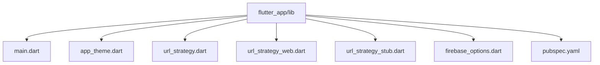
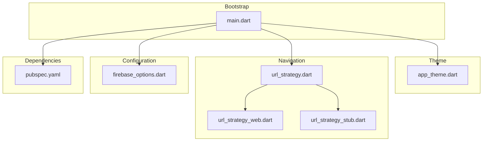
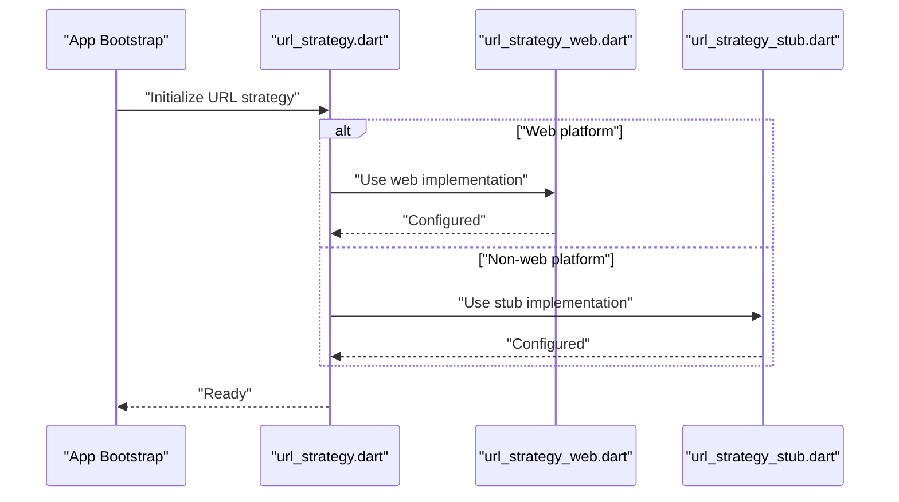
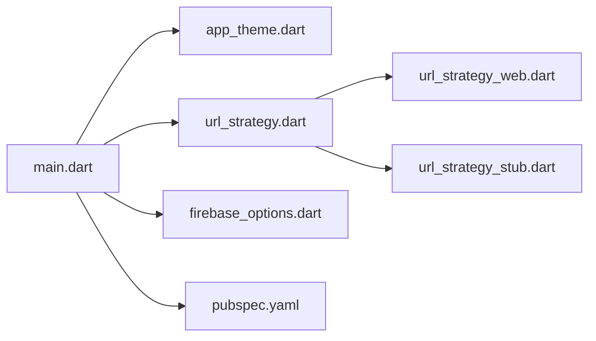

# Core Modules

<cite>
**Referenced Files in This Document**
- [main.dart](file://flutter_app/lib/main.dart)
- [app_theme.dart](file://flutter_app/lib/app_theme.dart)
- [url_strategy.dart](file://flutter_app/lib/url_strategy.dart)
- [url_strategy_web.dart](file://flutter_app/lib/url_strategy_web.dart)
- [url_strategy_stub.dart](file://flutter_app/lib/url_strategy_stub.dart)
- [firebase_options.dart](file://flutter_app/lib/firebase_options.dart)
- [pubspec.yaml](file://flutter_app/pubspec.yaml)
</cite>

## Table of Contents
1. [Introduction](#introduction)
2. [Project Structure](#project-structure)
3. [Core Components](#core-components)
4. [Architecture Overview](#architecture-overview)
5. [Detailed Component Analysis](#detailed-component-analysis)
6. [Dependency Analysis](#dependency-analysis)
7. [Performance Considerations](#performance-considerations)
8. [Troubleshooting Guide](#troubleshooting-guide)
9. [Conclusion](#conclusion)

## Introduction
This document describes the core modules that form the foundation of the Gestão Yahweh Premium application. It focuses on foundational utilities, shared services, constants, and base classes that enable consistent behavior across platforms. The coverage includes the theme system, navigation framework, error handling patterns, logging mechanisms, configuration management, and platform-specific abstractions. Examples illustrate how these components are used throughout the app and their relationships with other modules.

## Project Structure
The Flutter application is organized under flutter_app/lib with clear separation between UI, features, data, services, and core infrastructure. Key core files include:
- Application entry point and bootstrap logic
- Theme configuration for consistent look and feel
- URL strategy abstraction for web routing behavior
- Firebase options initialization
- Platform-specific stubs and implementations

**Diagram sources**
- [main.dart](file://flutter_app/lib/main.dart)
- [app_theme.dart](file://flutter_app/lib/app_theme.dart)
- [url_strategy.dart](file://flutter_app/lib/url_strategy.dart)
- [url_strategy_web.dart](file://flutter_app/lib/url_strategy_web.dart)
- [url_strategy_stub.dart](file://flutter_app/lib/url_strategy_stub.dart)
- [firebase_options.dart](file://flutter_app/lib/firebase_options.dart)
- [pubspec.yaml](file://flutter_app/pubspec.yaml)

**Section sources**
- [main.dart](file://flutter_app/lib/main.dart)
- [pubspec.yaml](file://flutter_app/pubspec.yaml)

## Core Components
- Application Bootstrap: Initializes runtime dependencies, configures environment-specific settings, and starts the UI layer.
- Theme System: Centralizes color schemes, typography, and component styles to ensure a consistent user experience across platforms.
- Navigation Framework: Provides a unified routing mechanism with platform-aware behavior (e.g., web URL strategies).
- Configuration Management: Loads Firebase options and other runtime configurations required by services.
- Platform Abstractions: Uses conditional imports to provide platform-specific implementations where necessary.
- Error Handling Patterns: Establishes consistent strategies for catching, reporting, and surfacing errors to users and logs.
- Logging Mechanisms: Standardizes logging across the app for diagnostics and observability.

**Section sources**
- [main.dart](file://flutter_app/lib/main.dart)
- [app_theme.dart](file://flutter_app/lib/app_theme.dart)
- [url_strategy.dart](file://flutter_app/lib/url_strategy.dart)
- [url_strategy_web.dart](file://flutter_app/lib/url_strategy_web.dart)
- [url_strategy_stub.dart](file://flutter_app/lib/url_strategy_stub.dart)
- [firebase_options.dart](file://flutter_app/lib/firebase_options.dart)

## Architecture Overview
The core modules interact through well-defined boundaries:
- main.dart orchestrates initialization and delegates to theme and navigation layers.
- url_strategy.dart abstracts platform differences; url_strategy_web.dart provides web-specific behavior; url_strategy_stub.dart provides fallbacks for non-web platforms.
- firebase_options.dart supplies configuration values consumed by services and repositories.
- pubspec.yaml declares dependencies that influence runtime capabilities and performance characteristics.

**Diagram sources**
- [main.dart](file://flutter_app/lib/main.dart)
- [app_theme.dart](file://flutter_app/lib/app_theme.dart)
- [url_strategy.dart](file://flutter_app/lib/url_strategy.dart)
- [url_strategy_web.dart](file://flutter_app/lib/url_strategy_web.dart)
- [url_strategy_stub.dart](file://flutter_app/lib/url_strategy_stub.dart)
- [firebase_options.dart](file://flutter_app/lib/firebase_options.dart)
- [pubspec.yaml](file://flutter_app/pubspec.yaml)

## Detailed Component Analysis

### Application Bootstrap (main.dart)
Responsibilities:
- Initialize platform-specific settings and Firebase options.
- Configure global error handlers and logging.
- Set up dependency injection or service providers if applicable.
- Launch the root widget and navigation shell.

Usage examples:
- Invoked at app start to ensure all core services are ready before rendering UI.
- Integrates with theme and navigation modules to establish baseline behavior.

**Section sources**
- [main.dart](file://flutter_app/lib/main.dart)

### Theme System (app_theme.dart)
Responsibilities:
- Define color palettes, typography scales, and component themes.
- Provide light/dark mode support and dynamic theming hooks.
- Expose reusable style tokens for consistent UI across screens.

Implementation details:
- Centralized theme objects consumed by Material widgets.
- Extensible structure allowing feature-specific overrides while maintaining consistency.

**Section sources**
- [app_theme.dart](file://flutter_app/lib/app_theme.dart)

### Navigation Framework (url_strategy.dart, url_strategy_web.dart, url_strategy_stub.dart)
Responsibilities:
- Abstract URL strategy selection based on platform.
- Provide web-specific routing behavior via url_strategy_web.dart.
- Offer stub implementations for non-web platforms via url_strategy_stub.dart.

Flow overview:
- url_strategy.dart selects the appropriate implementation at runtime.
- Web builds use url_strategy_web.dart to configure HTML5 history and routing.
- Non-web builds fall back to url_strategy_stub.dart for default behavior.

**Diagram sources**
- [url_strategy.dart](file://flutter_app/lib/url_strategy.dart)
- [url_strategy_web.dart](file://flutter_app/lib/url_strategy_web.dart)
- [url_strategy_stub.dart](file://flutter_app/lib/url_strategy_stub.dart)

**Section sources**
- [url_strategy.dart](file://flutter_app/lib/url_strategy.dart)
- [url_strategy_web.dart](file://flutter_app/lib/url_strategy_web.dart)
- [url_strategy_stub.dart](file://flutter_app/lib/url_strategy_stub.dart)

### Configuration Management (firebase_options.dart)
Responsibilities:
- Load Firebase configuration values for the current environment.
- Provide centralized access to keys and endpoints used by services.

Integration points:
- Consumed by authentication, database, and storage services during initialization.
- Ensures consistent configuration across platforms and environments.

**Section sources**
- [firebase_options.dart](file://flutter_app/lib/firebase_options.dart)

### Dependencies and Platform Abstractions (pubspec.yaml)
Responsibilities:
- Declare Flutter packages and native integrations required by core modules.
- Influence runtime behavior, performance, and compatibility across platforms.

Considerations:
- Pinning versions ensures reproducible builds.
- Conditional dependencies can be used to optimize for specific targets.

**Section sources**
- [pubspec.yaml](file://flutter_app/pubspec.yaml)

## Dependency Analysis
Core modules have minimal coupling to maximize cohesion and testability:
- main.dart depends on theme, navigation, and configuration modules.
- url_strategy.dart abstracts platform differences without leaking implementation details.
- firebase_options.dart is a pure configuration source consumed by higher layers.
- pubspec.yaml defines external dependencies that impact core functionality.

**Diagram sources**
- [main.dart](file://flutter_app/lib/main.dart)
- [app_theme.dart](file://flutter_app/lib/app_theme.dart)
- [url_strategy.dart](file://flutter_app/lib/url_strategy.dart)
- [url_strategy_web.dart](file://flutter_app/lib/url_strategy_web.dart)
- [url_strategy_stub.dart](file://flutter_app/lib/url_strategy_stub.dart)
- [firebase_options.dart](file://flutter_app/lib/firebase_options.dart)
- [pubspec.yaml](file://flutter_app/pubspec.yaml)

**Section sources**
- [main.dart](file://flutter_app/lib/main.dart)
- [pubspec.yaml](file://flutter_app/pubspec.yaml)

## Performance Considerations
- Lazy initialization of heavy services after critical UI rendering.
- Avoid unnecessary rebuilds by isolating state changes within focused widgets.
- Use platform-specific optimizations via conditional imports and targeted dependencies.
- Minimize configuration overhead by caching Firebase options and frequently accessed constants.

[No sources needed since this section provides general guidance]

## Troubleshooting Guide
Common issues and resolutions:
- Initialization failures: Verify Firebase options are correctly loaded and accessible.
- Routing anomalies on web: Ensure url_strategy_web.dart is selected and configured properly.
- Theme inconsistencies: Confirm theme tokens are applied consistently across components.
- Dependency conflicts: Review pubspec.yaml for version mismatches and resolve using Flutter’s dependency resolution tools.

**Section sources**
- [firebase_options.dart](file://flutter_app/lib/firebase_options.dart)
- [url_strategy_web.dart](file://flutter_app/lib/url_strategy_web.dart)
- [app_theme.dart](file://flutter_app/lib/app_theme.dart)
- [pubspec.yaml](file://flutter_app/pubspec.yaml)

## Conclusion
The core modules of Gestão Yahweh Premium provide a robust foundation through a well-structured theme system, platform-aware navigation, centralized configuration, and clear dependency management. By adhering to consistent patterns for error handling and logging, the application maintains reliability and observability across platforms. These components serve as the backbone for feature modules, enabling scalable growth and maintainable codebases.