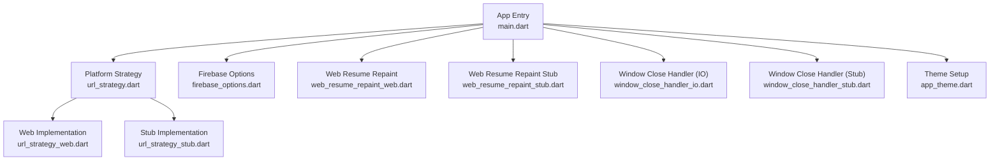
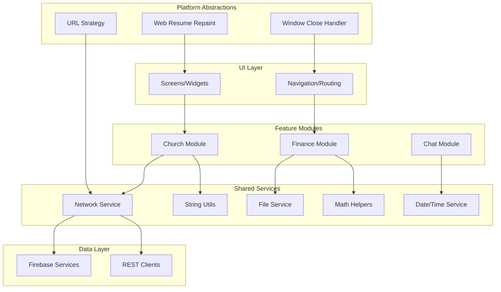
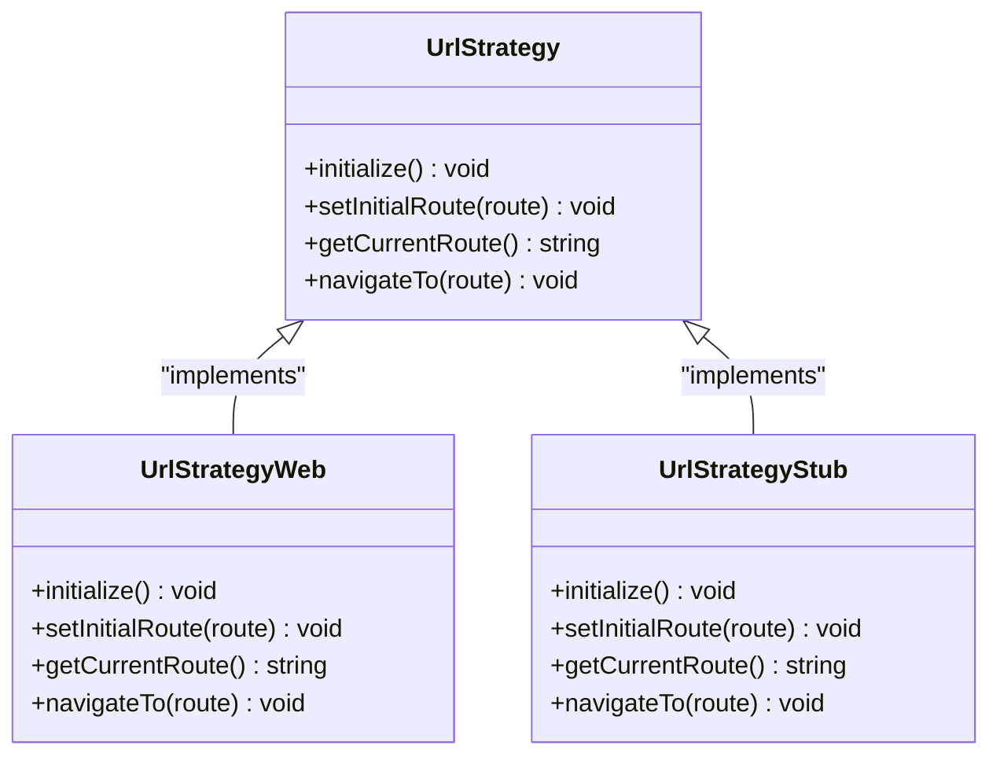
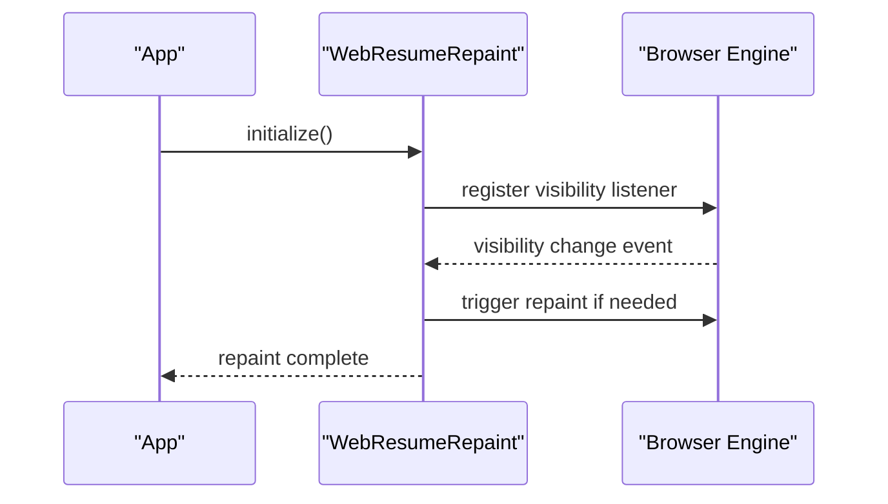
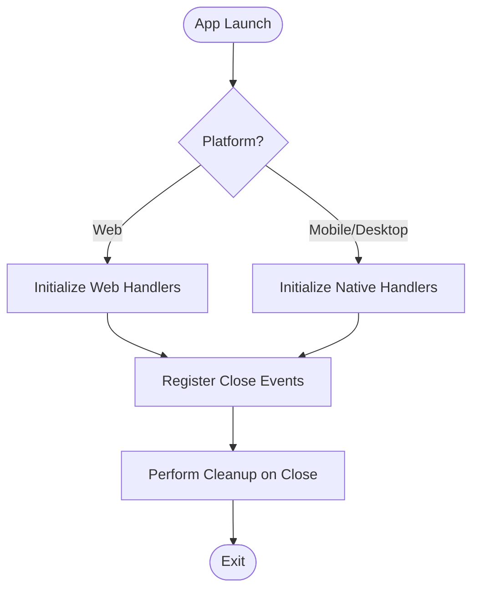
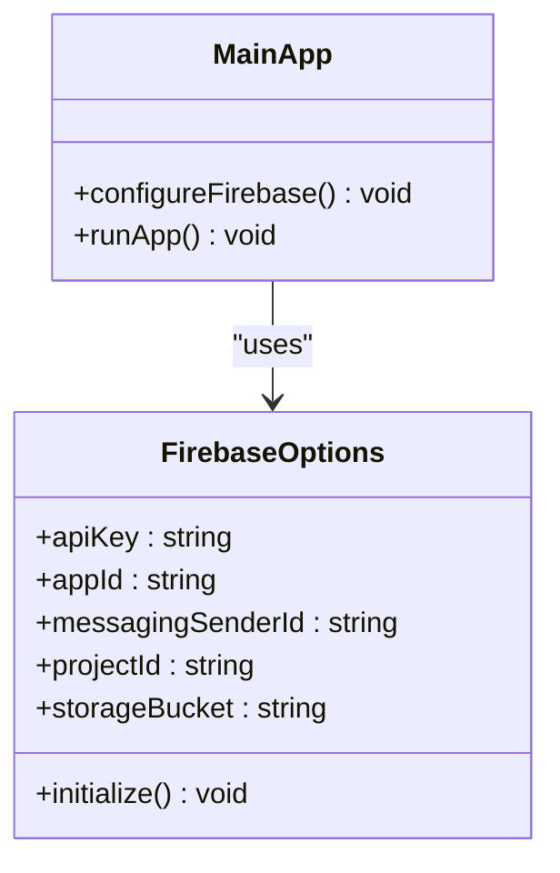
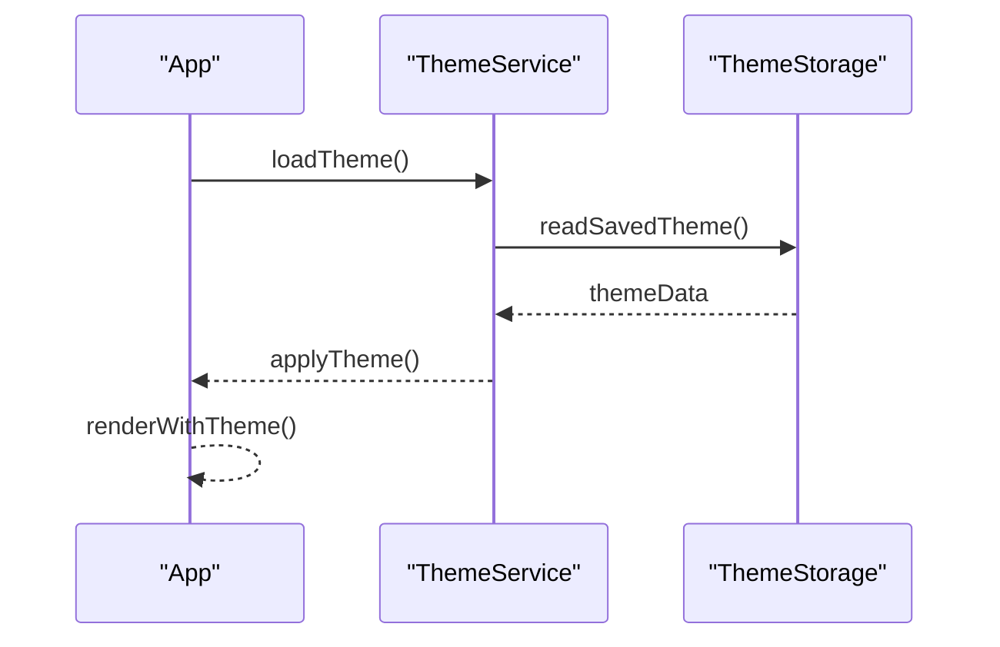
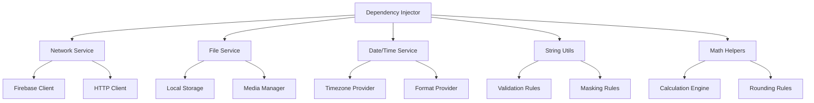

# Core Utilities & Services

<cite>
**Referenced Files in This Document**
- [main.dart](file://flutter_app/lib/main.dart)
- [app_theme.dart](file://flutter_app/lib/app_theme.dart)
- [url_strategy.dart](file://flutter_app/lib/url_strategy.dart)
- [url_strategy_web.dart](file://flutter_app/lib/url_strategy_web.dart)
- [url_strategy_stub.dart](file://flutter_app/lib/url_strategy_stub.dart)
- [firebase_options.dart](file://flutter_app/lib/firebase_options.dart)
- [web_resume_repaint_web.dart](file://flutter_app/lib/web_resume_repaint_web.dart)
- [web_resume_repaint_stub.dart](file://flutter_app/lib/web_resume_repaint_stub.dart)
- [window_close_handler_io.dart](file://flutter_app/lib/window_close_handler_io.dart)
- [window_close_handler_stub.dart](file://flutter_app/lib/window_close_handler_stub.dart)
</cite>

## Table of Contents
1. [Introduction](#introduction)
2. [Project Structure](#project-structure)
3. [Core Components](#core-components)
4. [Architecture Overview](#architecture-overview)
5. [Detailed Component Analysis](#detailed-component-analysis)
6. [Dependency Analysis](#dependency-analysis)
7. [Performance Considerations](#performance-considerations)
8. [Troubleshooting Guide](#troubleshooting-guide)
9. [Conclusion](#conclusion)

## Introduction
This document describes the foundational utilities and services that power the application’s cross-platform behavior, configuration, and platform-specific abstractions. It focuses on:
- Network utilities and service abstractions
- File handling helpers
- Date/time operations
- String manipulation utilities
- Mathematical calculation helpers
- Dependency injection patterns and singleton management
- Platform-specific implementations and integration points

The goal is to provide a clear mental model for how shared code is organized, how it integrates with features, and how platform differences are abstracted behind stable interfaces.

## Project Structure
At a high level, the Flutter app organizes shared logic under dedicated directories such as lib/utils, lib/services, and lib/shared. The entry point initializes core services and wires up platform-specific behaviors through conditional imports and stubs.

**Diagram sources**
- [main.dart](file://flutter_app/lib/main.dart)
- [url_strategy.dart](file://flutter_app/lib/url_strategy.dart)
- [url_strategy_web.dart](file://flutter_app/lib/url_strategy_web.dart)
- [url_strategy_stub.dart](file://flutter_app/lib/url_strategy_stub.dart)
- [firebase_options.dart](file://flutter_app/lib/firebase_options.dart)
- [web_resume_repaint_web.dart](file://flutter_app/lib/web_resume_repaint_web.dart)
- [web_resume_repaint_stub.dart](file://flutter_app/lib/web_resume_repaint_stub.dart)
- [window_close_handler_io.dart](file://flutter_app/lib/window_close_handler_io.dart)
- [window_close_handler_stub.dart](file://flutter_app/lib/window_close_handler_stub.dart)
- [app_theme.dart](file://flutter_app/lib/app_theme.dart)

**Section sources**
- [main.dart](file://flutter_app/lib/main.dart)
- [url_strategy.dart](file://flutter_app/lib/url_strategy.dart)
- [url_strategy_web.dart](file://flutter_app/lib/url_strategy_web.dart)
- [url_strategy_stub.dart](file://flutter_app/lib/url_strategy_stub.dart)
- [firebase_options.dart](file://flutter_app/lib/firebase_options.dart)
- [web_resume_repaint_web.dart](file://flutter_app/lib/web_resume_repaint_web.dart)
- [web_resume_repaint_stub.dart](file://flutter_app/lib/web_resume_repaint_stub.dart)
- [window_close_handler_io.dart](file://flutter_app/lib/window_close_handler_io.dart)
- [window_close_handler_stub.dart](file://flutter_app/lib/window_close_handler_stub.dart)
- [app_theme.dart](file://flutter_app/lib/app_theme.dart)

## Core Components
This section outlines the key utility categories and their responsibilities across the application:

- Network utilities
  - HTTP client wrappers, retry policies, error normalization, and request/response interceptors
  - Service abstractions for Firebase and REST endpoints
  - Singleton or provider-managed instances for connection pooling and auth state

- File handling
  - Cross-platform file access via path providers and platform-specific IO
  - Image and media storage helpers, caching strategies, and cleanup routines

- Date/time operations
  - Timezone-aware formatting, localization-aware date parsing, and scheduling helpers
  - Consistent timestamp conversion between server and client

- String manipulation
  - Validation helpers (email, CPF/CNPJ, phone), sanitization, masking, and safe HTML escaping
  - Formatting utilities for currency, percentages, and localized number strings

- Mathematical calculations
  - Financial math helpers (interest, amortization), rounding rules, and precision controls
  - Aggregation utilities for charts and dashboards

- Dependency injection and singletons
  - Centralized service locator or provider setup
  - Lazy initialization and lifecycle-aware disposal

- Platform-specific integrations
  - Conditional imports for web vs. native behaviors
  - Feature flags and capability detection

[No sources needed since this section provides general guidance]

## Architecture Overview
The application uses a layered architecture where UI layers depend on feature modules, which in turn rely on shared services and utilities. Platform-specific behaviors are abstracted behind interfaces implemented per target platform.

[No sources needed since this diagram shows conceptual workflow, not actual code structure]

## Detailed Component Analysis

### URL Strategy Abstraction
The URL strategy abstraction ensures consistent routing behavior across platforms. Web may use pushState or hash-based routing, while mobile uses deep links and navigation stacks.

**Diagram sources**
- [url_strategy.dart](file://flutter_app/lib/url_strategy.dart)
- [url_strategy_web.dart](file://flutter_app/lib/url_strategy_web.dart)
- [url_strategy_stub.dart](file://flutter_app/lib/url_strategy_stub.dart)

**Section sources**
- [url_strategy.dart](file://flutter_app/lib/url_strategy.dart)
- [url_strategy_web.dart](file://flutter_app/lib/url_strategy_web.dart)
- [url_strategy_stub.dart](file://flutter_app/lib/url_strategy_stub.dart)

### Web Resume Repaint
Web resume repaint handles performance optimizations specific to the web platform, ensuring smooth transitions after backgrounding or tab switching.

**Diagram sources**
- [web_resume_repaint_web.dart](file://flutter_app/lib/web_resume_repaint_web.dart)
- [web_resume_repaint_stub.dart](file://flutter_app/lib/web_resume_repaint_stub.dart)

**Section sources**
- [web_resume_repaint_web.dart](file://flutter_app/lib/web_resume_repaint_web.dart)
- [web_resume_repaint_stub.dart](file://flutter_app/lib/web_resume_repaint_stub.dart)

### Window Close Handler
Cross-platform window close handling ensures proper cleanup when the app is closed or minimized.

**Diagram sources**
- [window_close_handler_io.dart](file://flutter_app/lib/window_close_handler_io.dart)
- [window_close_handler_stub.dart](file://flutter_app/lib/window_close_handler_stub.dart)

**Section sources**
- [window_close_handler_io.dart](file://flutter_app/lib/window_close_handler_io.dart)
- [window_close_handler_stub.dart](file://flutter_app/lib/window_close_handler_stub.dart)

### Firebase Configuration
Firebase options centralize configuration for authentication, database, and storage services across platforms.

**Diagram sources**
- [firebase_options.dart](file://flutter_app/lib/firebase_options.dart)
- [main.dart](file://flutter_app/lib/main.dart)

**Section sources**
- [firebase_options.dart](file://flutter_app/lib/firebase_options.dart)
- [main.dart](file://flutter_app/lib/main.dart)

### Theme Initialization
Theme setup ensures consistent styling across the application with support for dynamic themes and platform-specific adjustments.

**Diagram sources**
- [app_theme.dart](file://flutter_app/lib/app_theme.dart)
- [main.dart](file://flutter_app/lib/main.dart)

**Section sources**
- [app_theme.dart](file://flutter_app/lib/app_theme.dart)
- [main.dart](file://flutter_app/lib/main.dart)

## Dependency Analysis
The application follows a dependency-injection pattern where services are provided at the appropriate scope. Core services like network, file, and data access are initialized early and made available throughout the app lifecycle.

**Diagram sources**
- [main.dart](file://flutter_app/lib/main.dart)
- [firebase_options.dart](file://flutter_app/lib/firebase_options.dart)

**Section sources**
- [main.dart](file://flutter_app/lib/main.dart)
- [firebase_options.dart](file://flutter_app/lib/firebase_options.dart)

## Performance Considerations
- Use lazy loading for heavy services to minimize startup time
- Implement caching strategies for network requests and file operations
- Optimize image processing with appropriate formats and sizes
- Monitor memory usage for long-running operations
- Use platform-specific optimizations where applicable

[No sources needed since this section provides general guidance]

## Troubleshooting Guide
Common issues and their resolutions:

- **Network connectivity problems**
  - Check internet connectivity status
  - Verify API endpoints and authentication tokens
  - Implement retry mechanisms for transient failures

- **File access errors**
  - Validate file paths and permissions
  - Handle platform-specific file system differences
  - Implement fallback storage mechanisms

- **Date/time formatting issues**
  - Ensure timezone consistency across platforms
  - Handle locale-specific formatting requirements
  - Validate date input formats

- **Memory leaks**
  - Properly dispose of subscriptions and listeners
  - Clear caches when no longer needed
  - Monitor object retention patterns

[No sources needed since this section provides general guidance]

## Conclusion
The core utilities and services form the foundation of the application's functionality. By implementing robust abstractions, dependency injection patterns, and platform-specific optimizations, the application achieves maintainability, scalability, and cross-platform compatibility. The modular design allows for easy extension and testing while providing reliable performance across different environments.

[No sources needed since this section summarizes without analyzing specific files]