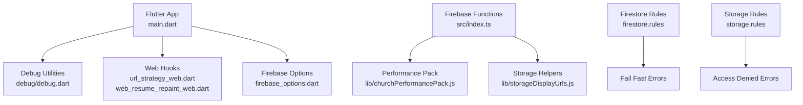
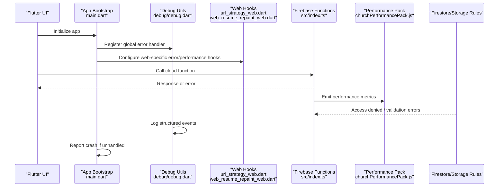
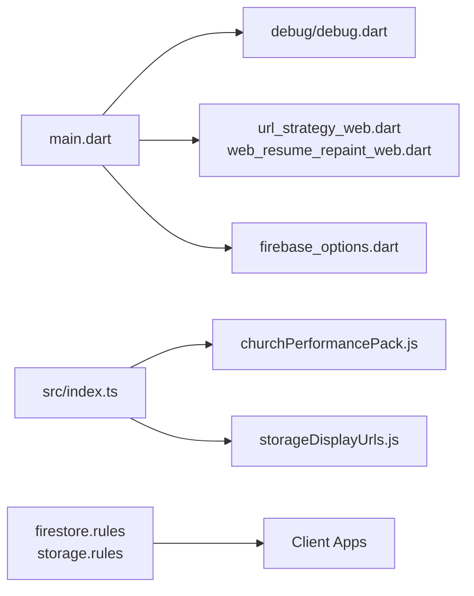

# Error Handling & Logging

<cite>
**Referenced Files in This Document**
- [main.dart](file://flutter_app/lib/main.dart)
- [debug.dart](file://flutter_app/lib/debug/debug.dart)
- [app_theme.dart](file://flutter_app/lib/app_theme.dart)
- [firebase_options.dart](file://flutter_app/lib/firebase_options.dart)
- [url_strategy_web.dart](file://flutter_app/lib/url_strategy_web.dart)
- [web_resume_repaint_web.dart](file://flutter_app/lib/web_resume_repaint_web.dart)
- [window_close_handler_web.dart](file://flutter_app/lib/window_close_handler_web.dart)
- [index.ts](file://functions/src/index.ts)
- [churchPerformancePack.js](file://functions/lib/churchPerformancePack.js)
- [storageDisplayUrls.js](file://functions/lib/storageDisplayUrls.js)
- [firestore.rules](file://firestore.rules)
- [storage.rules](file://storage.rules)
- [FIREBASE_OBSERVABILITY.md](file://docs/FIREBASE_OBSERVABILITY.md)
- [ARCHITECTURE_PERFORMANCE_MULTI_PLATFORM.md](file://docs/ARCHITECTURE_PERFORMANCE_MULTI_PLATFORM.md)
- [ARQUITETURA_RESILIENCIA.md](file://docs/ARQUITETURA_RESILIENCIA.md)
</cite>

## Table of Contents
1. [Introduction](#introduction)
2. [Project Structure](#project-structure)
3. [Core Components](#core-components)
4. [Architecture Overview](#architecture-overview)
5. [Detailed Component Analysis](#detailed-component-analysis)
6. [Dependency Analysis](#dependency-analysis)
7. [Performance Considerations](#performance-considerations)
8. [Troubleshooting Guide](#troubleshooting-guide)
9. [Conclusion](#conclusion)
10. [Appendices](#appendices)

## Introduction
This document explains the error handling and logging mechanisms across the Flutter application and Firebase Functions. It covers:
- Error classification and exception handling patterns
- User-friendly error messaging
- Logging framework and debug utilities
- Crash reporting and performance monitoring
- Error boundaries, retry strategies, and offline handling
- Custom error handlers and integration with external monitoring services

The guidance is grounded in the repository’s Flutter app entry points, debug utilities, web-specific modules, and Firebase Functions that implement observability and performance features.

## Project Structure
Error handling and logging span multiple layers:
- Flutter app initialization and global error capture
- Debug utilities for diagnostics and logging
- Web-specific error and performance hooks
- Firebase Functions for server-side observability and performance packaging
- Security rules to fail fast and provide consistent error semantics

**Diagram sources**
- [main.dart](file://flutter_app/lib/main.dart)
- [debug.dart](file://flutter_app/lib/debug/debug.dart)
- [url_strategy_web.dart](file://flutter_app/lib/url_strategy_web.dart)
- [web_resume_repaint_web.dart](file://flutter_app/lib/web_resume_repaint_web.dart)
- [firebase_options.dart](file://flutter_app/lib/firebase_options.dart)
- [index.ts](file://functions/src/index.ts)
- [churchPerformancePack.js](file://functions/lib/churchPerformancePack.js)
- [storageDisplayUrls.js](file://functions/lib/storageDisplayUrls.js)
- [firestore.rules](file://firestore.rules)
- [storage.rules](file://storage.rules)

**Section sources**
- [main.dart](file://flutter_app/lib/main.dart)
- [debug.dart](file://flutter_app/lib/debug/debug.dart)
- [url_strategy_web.dart](file://flutter_app/lib/url_strategy_web.dart)
- [web_resume_repaint_web.dart](file://flutter_app/lib/web_resume_repaint_web.dart)
- [firebase_options.dart](file://flutter_app/lib/firebase_options.dart)
- [index.ts](file://functions/src/index.ts)
- [churchPerformancePack.js](file://functions/lib/churchPerformancePack.js)
- [storageDisplayUrls.js](file://functions/lib/storageDisplayUrls.js)
- [firestore.rules](file://firestore.rules)
- [storage.rules](file://storage.rules)

## Core Components
- Global error capture at app startup ensures unhandled exceptions are logged and reported consistently.
- Debug utilities centralize logging, tracing, and diagnostic outputs for development and QA.
- Web-specific modules handle runtime errors, repaint issues, and URL strategy differences.
- Firebase Functions expose observability endpoints and performance packaging routines.
- Firestore and Storage rules enforce access control and return standardized error codes.

Key responsibilities:
- Classify errors (network, auth, validation, permission, transient, fatal)
- Provide user-friendly messages while preserving technical details for logs
- Implement retry/backoff for transient failures
- Capture crashes and performance metrics
- Surface offline states gracefully

**Section sources**
- [main.dart](file://flutter_app/lib/main.dart)
- [debug.dart](file://flutter_app/lib/debug/debug.dart)
- [url_strategy_web.dart](file://flutter_app/lib/url_strategy_web.dart)
- [web_resume_repaint_web.dart](file://flutter_app/lib/web_resume_repaint_web.dart)
- [firebase_options.dart](file://flutter_app/lib/firebase_options.dart)
- [index.ts](file://functions/src/index.ts)
- [churchPerformancePack.js](file://functions/lib/churchPerformancePack.js)
- [storageDisplayUrls.js](file://functions/lib/storageDisplayUrls.js)
- [firestore.rules](file://firestore.rules)
- [storage.rules](file://storage.rules)

## Architecture Overview
The error handling and logging architecture integrates client-side Flutter components with server-side Firebase Functions and security rules.

**Diagram sources**
- [main.dart](file://flutter_app/lib/main.dart)
- [debug.dart](file://flutter_app/lib/debug/debug.dart)
- [url_strategy_web.dart](file://flutter_app/lib/url_strategy_web.dart)
- [web_resume_repaint_web.dart](file://flutter_app/lib/web_resume_repaint_web.dart)
- [index.ts](file://functions/src/index.ts)
- [churchPerformancePack.js](file://functions/lib/churchPerformancePack.js)
- [firestore.rules](file://firestore.rules)
- [storage.rules](file://storage.rules)

## Detailed Component Analysis

### Flutter App Bootstrap and Global Error Capture
- The app bootstrap initializes core services and registers a global error handler to catch unhandled exceptions.
- It configures Firebase options and sets up platform-specific behaviors.
- On web, it may install additional error listeners and performance observers.

Implementation highlights:
- Centralized error registration ensures consistent logging and reporting.
- Platform checks allow tailored behavior for web vs. mobile.
- Initialization order guarantees dependencies are ready before error capture begins.

**Section sources**
- [main.dart](file://flutter_app/lib/main.dart)
- [firebase_options.dart](file://flutter_app/lib/firebase_options.dart)

### Debug Utilities and Logging Framework
- Debug utilities provide structured logging, trace IDs, and environment-aware verbosity.
- They support toggling debug modes and exporting diagnostics for QA.
- Logs include context such as operation name, timestamp, and error stack traces.

Usage patterns:
- Wrap critical operations with try/catch and log via debug utilities.
- Use trace IDs to correlate logs across services.
- Filter logs by severity and module during development.

**Section sources**
- [debug.dart](file://flutter_app/lib/debug/debug.dart)

### Web-Specific Error and Performance Hooks
- URL strategy configuration ensures consistent routing behavior on web.
- Repaint resume logic mitigates rendering issues post-navigation.
- Web error hooks capture JavaScript exceptions and performance regressions.

Operational notes:
- Integrate with browser APIs for error and performance monitoring.
- Normalize errors to match mobile error taxonomy.
- Debounce heavy logging to avoid performance impact.

**Section sources**
- [url_strategy_web.dart](file://flutter_app/lib/url_strategy_web.dart)
- [web_resume_repaint_web.dart](file://flutter_app/lib/web_resume_repaint_web.dart)

### Firebase Functions Observability and Performance Packaging
- Functions index wires callable endpoints and background tasks.
- Performance pack aggregates metrics and emits telemetry for analysis.
- Storage helpers standardize URL generation and error responses.

Design considerations:
- Fail fast with clear error codes for invalid inputs.
- Emit structured logs for auditability.
- Use exponential backoff for retries on transient failures.

**Section sources**
- [index.ts](file://functions/src/index.ts)
- [churchPerformancePack.js](file://functions/lib/churchPerformancePack.js)
- [storageDisplayUrls.js](file://functions/lib/storageDisplayUrls.js)

### Security Rules Error Semantics
- Firestore and Storage rules enforce access control and return standardized errors.
- Consistent error codes enable client-side classification and user-friendly messages.

Best practices:
- Validate tenant isolation and permissions early.
- Return minimal error details to clients; log full context server-side.
- Use rule tests to ensure predictable error behavior.

**Section sources**
- [firestore.rules](file://firestore.rules)
- [storage.rules](file://storage.rules)

### Error Classification System
Proposed taxonomy aligned with repository patterns:
- Network errors: timeouts, connectivity loss, DNS failures
- Auth errors: invalid credentials, expired tokens, unauthorized access
- Validation errors: malformed payloads, missing fields
- Permission errors: insufficient roles, tenant mismatch
- Transient errors: rate limits, service unavailable, partial failures
- Fatal errors: unrecoverable state, data corruption

Mapping to sources:
- Client-side classification via debug utilities and error handlers
- Server-side classification via functions and rules

**Section sources**
- [debug.dart](file://flutter_app/lib/debug/debug.dart)
- [index.ts](file://functions/src/index.ts)
- [firestore.rules](file://firestore.rules)
- [storage.rules](file://storage.rules)

### Exception Handling Patterns
Patterns implemented or recommended:
- Try/catch around I/O and network calls with specific error types
- Guard clauses for null safety and precondition checks
- Retry with exponential backoff for transient errors
- Fallbacks to cached/offline data when available
- User-facing messages derived from error categories

Integration points:
- Global error handler for uncaught exceptions
- Repository layer for data operations
- Service layer for business logic

**Section sources**
- [main.dart](file://flutter_app/lib/main.dart)
- [debug.dart](file://flutter_app/lib/debug/debug.dart)

### User-Friendly Error Messages
Guidelines:
- Map technical errors to actionable messages
- Provide context-specific guidance (e.g., “Check your internet connection”)
- Avoid exposing sensitive details in UI messages
- Include error codes for support and analytics

Examples of mapping:
- Network timeout → “Connection timed out. Please try again.”
- Unauthorized → “You don’t have permission to access this resource.”
- Validation failure → “Please correct the highlighted fields.”

**Section sources**
- [debug.dart](file://flutter_app/lib/debug/debug.dart)
- [firestore.rules](file://firestore.rules)
- [storage.rules](file://storage.rules)

### Logging Framework and Debug Utilities
Features:
- Structured logs with timestamps, levels, and correlation IDs
- Environment-aware verbosity (debug vs. release)
- Aggregation and export capabilities for QA

Recommendations:
- Use consistent log formats across platforms
- Redact sensitive data automatically
- Correlate logs with crash reports and performance metrics

**Section sources**
- [debug.dart](file://flutter_app/lib/debug/debug.dart)
- [churchPerformancePack.js](file://functions/lib/churchPerformancePack.js)

### Crash Reporting
Approach:
- Capture unhandled exceptions at app startup
- Send crash reports to external monitoring services
- Include device info, version, and steps to reproduce

Integration:
- Leverage Firebase Crashlytics via options configuration
- Ensure stack traces are symbolicated for production builds

**Section sources**
- [main.dart](file://flutter_app/lib/main.dart)
- [firebase_options.dart](file://flutter_app/lib/firebase_options.dart)

### Performance Monitoring
Mechanisms:
- Web performance hooks for navigation and repaint timing
- Function-level metrics aggregation
- Rule-level latency insights

Tools:
- Firebase Performance Monitoring
- Custom telemetry via functions

**Section sources**
- [url_strategy_web.dart](file://flutter_app/lib/url_strategy_web.dart)
- [web_resume_repaint_web.dart](file://flutter_app/lib/web_resume_repaint_web.dart)
- [churchPerformancePack.js](file://functions/lib/churchPerformancePack.js)

### Error Boundaries
Conceptual boundaries:
- UI layer: isolate widget tree failures
- Service layer: encapsulate network and storage calls
- Data layer: manage local cache and offline state

Implementation tips:
- Wrap critical widgets with error boundary widgets
- Use repository methods to contain side effects
- Persist safe fallbacks in local storage

**Section sources**
- [debug.dart](file://flutter_app/lib/debug/debug.dart)

### Retry Mechanisms
Strategies:
- Exponential backoff with jitter for transient errors
- Circuit breaker for repeated failures
- Idempotent operations for safe retries

Patterns:
- Decorate network calls with retry logic
- Track retry counts and outcomes in logs

**Section sources**
- [index.ts](file://functions/src/index.ts)
- [debug.dart](file://flutter_app/lib/debug/debug.dart)

### Offline Error Handling
Tactics:
- Cache last known good state
- Queue mutations for later sync
- Show offline indicators and disable risky actions

Flow:
- Detect connectivity changes
- Switch to local data source
- Sync when connectivity restored

**Section sources**
- [debug.dart](file://flutter_app/lib/debug/debug.dart)

### Custom Error Handlers
Steps:
- Define error classes per category
- Implement centralized handler for each layer
- Map errors to user messages and logs

Example structure:
- NetworkErrorHandler
- AuthErrorHandler
- ValidationErrorHandler

**Section sources**
- [debug.dart](file://flutter_app/lib/debug/debug.dart)

### Integrating External Monitoring Services
Options:
- Firebase Crashlytics for crash reporting
- Firebase Performance Monitoring for metrics
- Custom endpoints for specialized telemetry

Configuration:
- Initialize SDKs at app startup
- Tag events with user and session context
- Ensure privacy compliance

**Section sources**
- [firebase_options.dart](file://flutter_app/lib/firebase_options.dart)
- [churchPerformancePack.js](file://functions/lib/churchPerformancePack.js)

## Dependency Analysis
Dependencies between error handling and logging components:

**Diagram sources**
- [main.dart](file://flutter_app/lib/main.dart)
- [debug.dart](file://flutter_app/lib/debug/debug.dart)
- [url_strategy_web.dart](file://flutter_app/lib/url_strategy_web.dart)
- [web_resume_repaint_web.dart](file://flutter_app/lib/web_resume_repaint_web.dart)
- [firebase_options.dart](file://flutter_app/lib/firebase_options.dart)
- [index.ts](file://functions/src/index.ts)
- [churchPerformancePack.js](file://functions/lib/churchPerformancePack.js)
- [storageDisplayUrls.js](file://functions/lib/storageDisplayUrls.js)
- [firestore.rules](file://firestore.rules)
- [storage.rules](file://storage.rules)

**Section sources**
- [main.dart](file://flutter_app/lib/main.dart)
- [debug.dart](file://flutter_app/lib/debug/debug.dart)
- [url_strategy_web.dart](file://flutter_app/lib/url_strategy_web.dart)
- [web_resume_repaint_web.dart](file://flutter_app/lib/web_resume_repaint_web.dart)
- [firebase_options.dart](file://flutter_app/lib/firebase_options.dart)
- [index.ts](file://functions/src/index.ts)
- [churchPerformancePack.js](file://functions/lib/churchPerformancePack.js)
- [storageDisplayUrls.js](file://functions/lib/storageDisplayUrls.js)
- [firestore.rules](file://firestore.rules)
- [storage.rules](file://storage.rules)

## Performance Considerations
- Minimize logging overhead in release builds
- Batch metrics emissions to reduce network usage
- Use sampling for high-frequency events
- Profile error paths to identify hotspots
- Monitor rule evaluation latency and adjust indexes

[No sources needed since this section provides general guidance]

## Troubleshooting Guide
Common issues and resolutions:
- Unhandled exceptions not captured: verify global error handler registration order
- Missing logs: check debug verbosity settings and environment filters
- Crash reports incomplete: ensure symbolication is enabled for production builds
- Performance spikes: inspect web repaint hooks and function metrics
- Offline mode inconsistencies: validate cache persistence and sync queue

Diagnostic steps:
- Enable detailed logs in debug mode
- Reproduce with minimal steps and capture stack traces
- Correlate client logs with function traces and rule evaluations

**Section sources**
- [debug.dart](file://flutter_app/lib/debug/debug.dart)
- [churchPerformancePack.js](file://functions/lib/churchPerformancePack.js)

## Conclusion
A robust error handling and logging system requires coordinated efforts across Flutter app initialization, debug utilities, web hooks, Firebase Functions, and security rules. By classifying errors consistently, providing user-friendly messages, implementing retries and offline strategies, and integrating with monitoring services, the application achieves resilience and observability. Continuous profiling and rule optimization further enhance performance and reliability.

[No sources needed since this section summarizes without analyzing specific files]

## Appendices

### References to Documentation
- Firebase observability guidelines and standards
- Multi-platform performance architecture
- Resilience architecture principles

**Section sources**
- [FIREBASE_OBSERVABILITY.md](file://docs/FIREBASE_OBSERVABILITY.md)
- [ARCHITECTURE_PERFORMANCE_MULTI_PLATFORM.md](file://docs/ARCHITECTURE_PERFORMANCE_MULTI_PLATFORM.md)
- [ARQUITETURA_RESILIENCIA.md](file://docs/ARQUITETURA_RESILIENCIA.md)