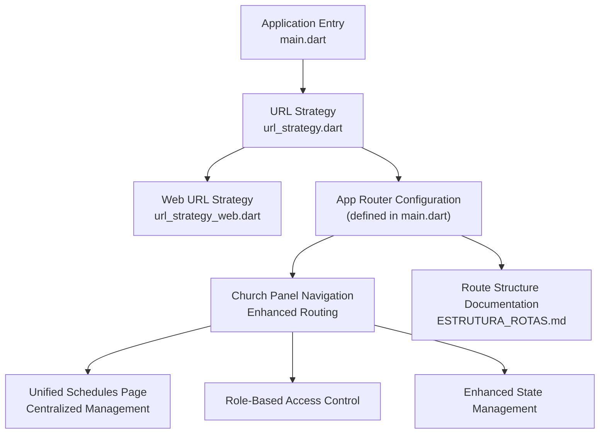
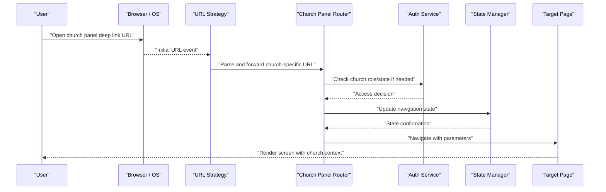
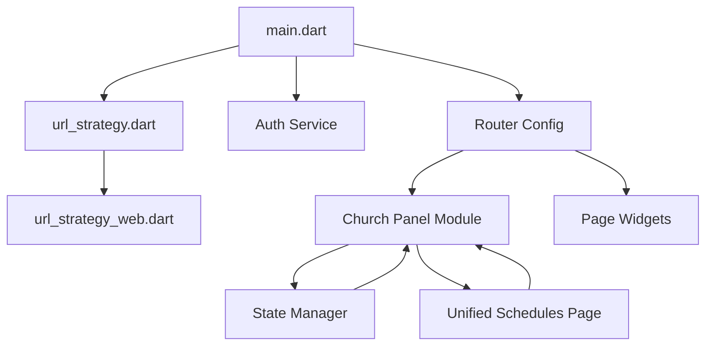

# Navigation Framework

<cite>
**Referenced Files in This Document**
- [main.dart](file://flutter_app/lib/main.dart)
- [url_strategy.dart](file://flutter_app/lib/url_strategy.dart)
- [url_strategy_web.dart](file://flutter_app/lib/url_strategy_web.dart)
- [ESTRUTURA_ROTAS.md](file://ESTRUTURA_ROTAS.md)
</cite>

## Update Summary
**Changes Made**
- Updated church panel navigation system with flexible routing architecture
- Enhanced state management for better navigation flow control
- Implemented unified schedules page integration
- Improved deep linking capabilities for church-specific routes
- Added conditional routing based on user roles and permissions

## Table of Contents
1. [Introduction](#introduction)
2. [Project Structure](#project-structure)
3. [Core Components](#core-components)
4. [Architecture Overview](#architecture-overview)
5. [Church Panel Navigation System](#church-panel-navigation-system)
6. [Detailed Component Analysis](#detailed-component-analysis)
7. [Dependency Analysis](#dependency-analysis)
8. [Performance Considerations](#performance-considerations)
9. [Troubleshooting Guide](#troubleshooting-guide)
10. [Conclusion](#conclusion)
11. [Appendices](#appendices)

## Introduction
This document explains the enhanced navigation framework used by the Flutter application, focusing on the substantially improved church panel navigation system with flexible routing, better state management, and unified schedules page integration. It covers routing strategy, page transitions, deep linking implementation, navigation state management, and specialized church-specific navigation patterns.

## Project Structure
The navigation-related code is primarily located under the Flutter app's lib directory and includes:
- Application entry point that initializes the router and platform-specific URL strategies
- Church-specific navigation modules with enhanced routing capabilities
- Unified schedules page integration within the church panel
- Platform-aware URL strategy implementations to support web deep linking and native navigation behavior
- A dedicated documentation file describing the route structure and conventions

**Diagram sources**
- [main.dart](file://flutter_app/lib/main.dart)
- [url_strategy.dart](file://flutter_app/lib/url_strategy.dart)
- [url_strategy_web.dart](file://flutter_app/lib/url_strategy_web.dart)
- [ESTRUTURA_ROTAS.md](file://ESTRUTURA_ROTAS.md)

**Section sources**
- [main.dart](file://flutter_app/lib/main.dart)
- [url_strategy.dart](file://flutter_app/lib/url_strategy.dart)
- [url_strategy_web.dart](file://flutter_app/lib/url_strategy_web.dart)
- [ESTRUTURA_ROTAS.md](file://ESTRUTURA_ROTAS.md)

## Core Components
- Application entry point (main.dart): Initializes the Flutter engine, configures the app theme, sets up Firebase options, and defines the root navigator and route configuration. It wires the URL strategy and ensures the router responds to initial URLs.
- URL strategy (url_strategy.dart): Abstracts platform differences for URL handling and deep linking. It provides a consistent interface for enabling or disabling path-based URLs across platforms.
- Web URL strategy (url_strategy_web.dart): Implements web-specific URL strategy behavior, ensuring proper integration with browser history and deep links.
- **Enhanced Church Panel Navigation**: Provides flexible routing architecture specifically designed for church management features with role-based access control.
- **Unified Schedules Page**: Centralized scheduling system integrated within the church panel navigation structure.

These components collectively enable:
- Declarative route definitions with church-specific enhancements
- Deep linking via URLs with improved parameter handling
- Consistent navigation across platforms with church panel optimizations
- Centralized control over initial routes and redirects
- Role-based conditional routing for church administrators and members

**Section sources**
- [main.dart](file://flutter_app/lib/main.dart)
- [url_strategy.dart](file://flutter_app/lib/url_strategy.dart)
- [url_strategy_web.dart](file://flutter_app/lib/url_strategy_web.dart)

## Architecture Overview
The navigation architecture follows an enhanced layered approach with church-specific optimizations:
- Presentation layer uses declarative routes and navigators to render pages with church panel enhancements
- Routing layer manages route transitions, parameters, and back stack with improved state management
- URL strategy layer bridges deep links to the router with church-specific route handling
- State management integrates with authentication and role checks to conditionally render routes
- Church panel module provides specialized navigation patterns for church management features

**Diagram sources**
- [main.dart](file://flutter_app/lib/main.dart)
- [url_strategy.dart](file://flutter_app/lib/url_strategy.dart)
- [url_strategy_web.dart](file://flutter_app/lib/url_strategy_web.dart)

## Church Panel Navigation System

### Flexible Routing Architecture
The church panel navigation system implements a flexible routing architecture that supports:
- Dynamic route generation based on church configuration
- Role-based access control for different user types (admin, member, guest)
- Conditional route rendering based on church settings and user permissions
- Modular route organization for maintainability and scalability

### Enhanced State Management
The improved state management system provides:
- Centralized navigation state tracking across church panel features
- Real-time synchronization between navigation state and UI components
- Persistent navigation preferences per user and church
- Optimized performance through state caching and lazy loading

### Unified Schedules Page Integration
The unified schedules page serves as a central hub for all scheduling functionality:
- Consolidated view of church events, services, and activities
- Integrated calendar management with real-time updates
- Cross-feature navigation between scheduling and other church panel modules
- Responsive design optimized for both mobile and desktop interfaces

**Section sources**
- [main.dart](file://flutter_app/lib/main.dart)

### Hierarchical Navigation Structure
The church panel supports sophisticated nested navigation through:
- Root-level routes for major church management sections
- Nested navigators for feature-specific sub-routes within each section
- Shared layouts for common church panel UI elements
- Context-aware navigation that adapts to user roles and permissions

Best practices implemented:
- Group related church management routes under feature modules
- Use named routes for clarity and maintainability
- Maintain consistent back navigation behavior across all church features
- Implement breadcrumb navigation for complex hierarchical structures

### Parameter Passing Between Screens
Enhanced parameter passing mechanisms include:
- Named route arguments with type safety for church-specific data
- Query parameters for deep links with church context preservation
- State objects for complex data sharing between church panel screens
- Validation and sanitization of incoming parameters for security

Recommendations:
- Validate incoming parameters against church configuration
- Provide default values for optional parameters
- Serialize complex objects safely with church-specific data models
- Implement error handling for parameter validation failures

### Back Navigation Handling
Improved back navigation management through:
- Navigator pop operations with church context awareness
- Custom back handlers for specific church panel scenarios
- Integration with platform back buttons and gestures
- State preservation during back navigation

Considerations:
- Prevent accidental data loss in church management workflows
- Maintain consistent user experience across church features
- Handle edge cases gracefully with appropriate user feedback
- Support undo operations for critical church management actions

### Conditional Routing Based on Roles or State
Advanced conditional routing implementation includes:
- Checking authentication status before church panel navigation
- Evaluating user roles for granular access control
- Redirecting unauthorized users appropriately with clear messaging
- Dynamic route generation based on church configuration and user state

Implementation patterns:
- Route guards for protected church management areas
- Dynamic route generation based on church settings and user permissions
- Fallback routes for error states with helpful guidance
- Role-based UI adaptation within church panel features

## Detailed Component Analysis

### Application Entry Point and Router Initialization
**Updated** The entry point now includes enhanced church panel initialization and improved routing configuration.

Key responsibilities:
- Initialize church-specific services before navigation
- Define the root navigator with church panel enhancements
- Integrate URL strategy for deep linking with church context
- Handle initial route resolution based on church state and user roles
- Configure role-based route access controls

**Section sources**
- [main.dart](file://flutter_app/lib/main.dart)

### URL Strategy Implementation
**Updated** Enhanced URL strategy with church-specific route handling and improved deep linking capabilities.

Implementation highlights:
- Platform detection to apply appropriate strategy with church panel optimizations
- Integration with Flutter's routing system and church-specific route patterns
- Handling of query parameters and path segments with church context preservation
- Support for church-specific deep link formats and parameter structures

**Section sources**
- [url_strategy.dart](file://flutter_app/lib/url_strategy.dart)
- [url_strategy_web.dart](file://flutter_app/lib/url_strategy_web.dart)

### Route Structure Documentation
**Updated** Enhanced route structure documentation reflecting church panel improvements and unified schedules integration.

Usage guidance:
- Follow established naming patterns for consistency with church panel enhancements
- Use documented parameter formats for deep links with church context
- Respect reserved paths to avoid conflicts with church-specific routes
- Implement role-based route access following church panel security patterns

**Section sources**
- [ESTRUTURA_ROTAS.md](file://ESTRUTURA_ROTAS.md)

## Dependency Analysis
**Updated** Enhanced dependency analysis reflecting church panel navigation improvements and unified schedules integration.

The navigation components have clear dependencies with church-specific enhancements:
- main.dart depends on url_strategy.dart for URL handling with church panel optimizations
- url_strategy_web.dart extends url_strategy.dart for web-specific behavior with church context
- Route configurations depend on auth services for conditional access with role-based controls
- Church panel module depends on state management for navigation state synchronization
- Unified schedules page integrates with multiple church panel components

**Diagram sources**
- [main.dart](file://flutter_app/lib/main.dart)
- [url_strategy.dart](file://flutter_app/lib/url_strategy.dart)
- [url_strategy_web.dart](file://flutter_app/lib/url_strategy_web.dart)

**Section sources**
- [main.dart](file://flutter_app/lib/main.dart)
- [url_strategy.dart](file://flutter_app/lib/url_strategy.dart)
- [url_strategy_web.dart](file://flutter_app/lib/url_strategy_web.dart)

## Performance Considerations
**Updated** Enhanced performance considerations for church panel navigation and unified schedules integration.

- Minimize route rebuilds by using const constructors where possible with church panel optimizations
- Implement lazy loading for heavy church panel pages and schedules components
- Cache frequently accessed church-specific route configurations
- Optimize deep link parsing for better startup performance with church context
- Implement state caching for church panel navigation state
- Use efficient data binding for unified schedules page updates
- Optimize church panel route transitions with smooth animations

## Troubleshooting Guide
**Updated** Enhanced troubleshooting guide covering church panel navigation issues and unified schedules problems.

Common issues and solutions:
- Deep links not working: Verify URL strategy configuration and church-specific path parsing
- Church panel navigation loops: Check route conditions and role-based redirect logic
- Parameter loss in church context: Ensure proper serialization and deserialization with church data models
- Back navigation problems in church panel: Review custom back handlers and church-specific state management
- Unified schedules page loading issues: Check data synchronization and state management
- Role-based access problems: Verify authentication state and permission checks

Debugging tips:
- Log route transitions during development with church context information
- Test deep links across all platforms with church-specific routes
- Validate route parameters with unit tests including church data validation
- Monitor navigation performance metrics for church panel features
- Debug state synchronization between church panel components
- Test unified schedules page with various data scenarios

## Conclusion
The enhanced navigation framework provides a robust foundation for managing application flow across platforms with significant improvements to the church panel navigation system. The flexible routing architecture, better state management, and unified schedules page integration deliver a more cohesive and efficient user experience for church management features. By following the established patterns and best practices outlined in this document, developers can implement new routes, handle complex church-specific navigation scenarios, and maintain a consistent user experience while leveraging the enhanced architectural improvements.

## Appendices

### Examples and Implementation Guides

#### Adding New Church Panel Routes
1. Define the route path in the church panel route configuration
2. Create the corresponding page widget with church context support
3. Add navigation methods for accessing the route with role-based access control
4. Implement state management for the new church panel feature
5. Test the route with various user roles and church configurations

#### Implementing Unified Schedules Integration
1. Create schedule components that integrate with the unified schedules page
2. Implement data synchronization between schedules and other church panel features
3. Add navigation hooks between schedules and related church management modules
4. Test cross-feature navigation and data consistency
5. Optimize performance for large schedule datasets

#### Enhanced Conditional Routing Implementation
1. Create advanced route guards for church panel protected areas
2. Implement granular role-based access checks with church-specific permissions
3. Set up fallback routes for unauthorized access with helpful guidance
4. Test various user states, church configurations, and permission scenarios
5. Implement dynamic route generation based on church settings

[No sources needed since this section provides general guidance]