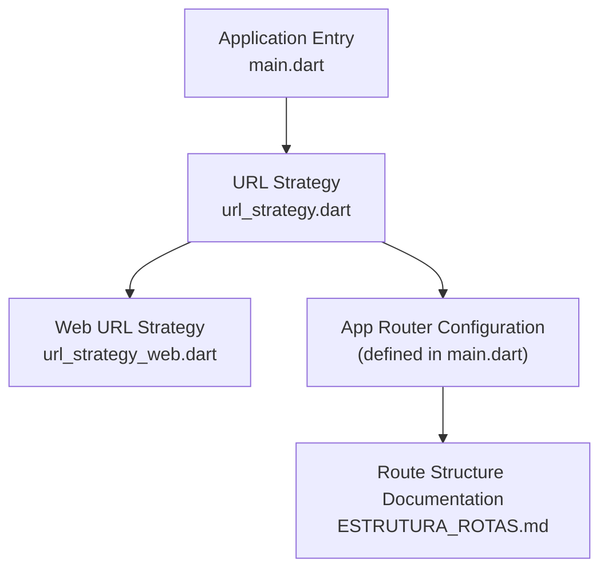
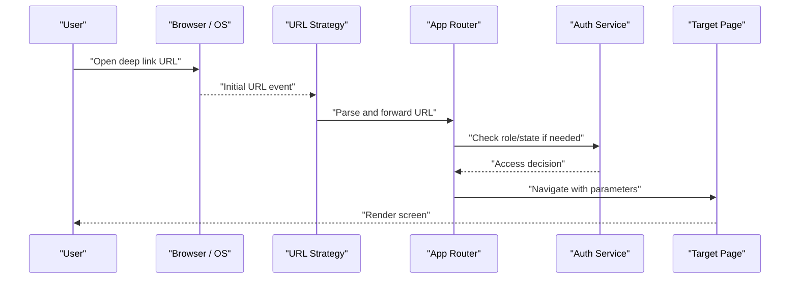
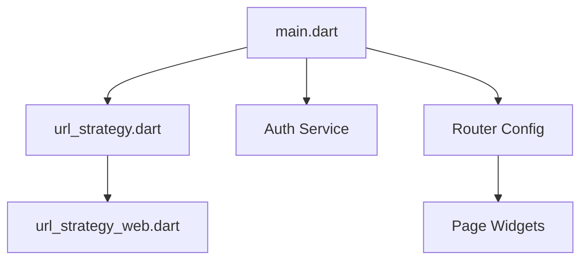

# Navigation Framework

<cite>
**Referenced Files in This Document**
- [main.dart](file://flutter_app/lib/main.dart)
- [url_strategy.dart](file://flutter_app/lib/url_strategy.dart)
- [url_strategy_web.dart](file://flutter_app/lib/url_strategy_web.dart)
- [ESTRUTURA_ROTAS.md](file://ESTRUTURA_ROTAS.md)
</cite>

## Table of Contents
1. [Introduction](#introduction)
2. [Project Structure](#project-structure)
3. [Core Components](#core-components)
4. [Architecture Overview](#architecture-overview)
5. [Detailed Component Analysis](#detailed-component-analysis)
6. [Dependency Analysis](#dependency-analysis)
7. [Performance Considerations](#performance-considerations)
8. [Troubleshooting Guide](#troubleshooting-guide)
9. [Conclusion](#conclusion)
10. [Appendices](#appendices)

## Introduction
This document explains the navigation framework used by the Flutter application, focusing on routing strategy, page transitions, deep linking, and navigation state management. It also covers hierarchical navigation, parameter passing between screens, back navigation handling, and practical examples for adding new routes, nested navigation, and conditional routing based on user roles or app state.

## Project Structure
The navigation-related code is primarily located under the Flutter app’s lib directory and includes:
- Application entry point that initializes the router and platform-specific URL strategies
- Platform-aware URL strategy implementations to support web deep linking and native navigation behavior
- A dedicated documentation file describing the route structure and conventions

**Diagram sources**
- [main.dart](file://flutter_app/lib/main.dart)
- [url_strategy.dart](file://flutter_app/lib/url_strategy.dart)
- [url_strategy_web.dart](file://flutter_app/lib/url_strategy_web.dart)
- [ESTRUTURA_ROTAS.md](file://ESTRUTURA_ROTAS.md)

**Section sources**
- [main.dart](file://flutter_app/lib/main.dart)
- [url_strategy.dart](file://flutter_app/lib/url_strategy.dart)
- [url_strategy_web.dart](file://flutter_app/lib/url_strategy_web.dart)
- [ESTRUTURA_ROTAS.md](file://ESTRUTURA_ROTAS.md)

## Core Components
- Application entry point (main.dart): Initializes the Flutter engine, configures the app theme, sets up Firebase options, and defines the root navigator and route configuration. It wires the URL strategy and ensures the router responds to initial URLs.
- URL strategy (url_strategy.dart): Abstracts platform differences for URL handling and deep linking. It provides a consistent interface for enabling or disabling path-based URLs across platforms.
- Web URL strategy (url_strategy_web.dart): Implements web-specific URL strategy behavior, ensuring proper integration with browser history and deep links.

These components collectively enable:
- Declarative route definitions
- Deep linking via URLs
- Consistent navigation across platforms
- Centralized control over initial routes and redirects

**Section sources**
- [main.dart](file://flutter_app/lib/main.dart)
- [url_strategy.dart](file://flutter_app/lib/url_strategy.dart)
- [url_strategy_web.dart](file://flutter_app/lib/url_strategy_web.dart)

## Architecture Overview
The navigation architecture follows a layered approach:
- Presentation layer uses declarative routes and navigators to render pages
- Routing layer manages route transitions, parameters, and back stack
- URL strategy layer bridges deep links to the router
- State management integrates with authentication and role checks to conditionally render routes

**Diagram sources**
- [main.dart](file://flutter_app/lib/main.dart)
- [url_strategy.dart](file://flutter_app/lib/url_strategy.dart)
- [url_strategy_web.dart](file://flutter_app/lib/url_strategy_web.dart)

## Detailed Component Analysis

### Application Entry Point and Router Initialization
- The entry point configures the app’s global settings and initializes the router.
- It sets up the initial route based on authentication state and platform capabilities.
- It registers observers or hooks for navigation events when necessary.

Key responsibilities:
- Initialize services before navigation
- Define the root navigator and default route
- Integrate URL strategy for deep linking
- Handle initial route resolution based on app state

**Section sources**
- [main.dart](file://flutter_app/lib/main.dart)

### URL Strategy Implementation
- Provides a unified interface for URL handling across platforms.
- Enables path-based URLs on web while maintaining native navigation semantics on mobile.
- Ensures deep links are parsed and routed correctly.

Implementation highlights:
- Platform detection to apply appropriate strategy
- Integration with Flutter’s routing system
- Handling of query parameters and path segments

**Section sources**
- [url_strategy.dart](file://flutter_app/lib/url_strategy.dart)
- [url_strategy_web.dart](file://flutter_app/lib/url_strategy_web.dart)

### Route Structure Documentation
- Describes the hierarchical organization of routes.
- Defines naming conventions and parameter patterns.
- Documents reserved paths and redirect rules.

Usage guidance:
- Follow established naming patterns for consistency
- Use documented parameter formats for deep links
- Respect reserved paths to avoid conflicts

**Section sources**
- [ESTRUTURA_ROTAS.md](file://ESTRUTURA_ROTAS.md)

### Hierarchical Navigation Structure
The application supports nested navigation through:
- Root-level routes for top-level features
- Nested navigators for feature-specific sub-routes
- Shared layouts for common UI elements

Best practices:
- Group related routes under feature modules
- Use named routes for clarity and maintainability
- Maintain consistent back navigation behavior

### Parameter Passing Between Screens
Parameters are passed using:
- Named route arguments
- Query parameters for deep links
- State objects for complex data

Recommendations:
- Validate incoming parameters
- Provide default values for optional parameters
- Serialize complex objects safely

### Back Navigation Handling
Back navigation is managed through:
- Navigator pop operations
- Custom back handlers for specific scenarios
- Integration with platform back buttons

Considerations:
- Prevent accidental data loss
- Maintain consistent user experience
- Handle edge cases gracefully

### Conditional Routing Based on Roles or State
Conditional routing is implemented by:
- Checking authentication status before navigation
- Evaluating user roles for access control
- Redirecting unauthorized users appropriately

Implementation patterns:
- Route guards for protected routes
- Dynamic route generation based on state
- Fallback routes for error states

## Dependency Analysis
The navigation components have clear dependencies:
- main.dart depends on url_strategy.dart for URL handling
- url_strategy_web.dart extends url_strategy.dart for web-specific behavior
- Route configurations depend on auth services for conditional access

**Diagram sources**
- [main.dart](file://flutter_app/lib/main.dart)
- [url_strategy.dart](file://flutter_app/lib/url_strategy.dart)
- [url_strategy_web.dart](file://flutter_app/lib/url_strategy_web.dart)

**Section sources**
- [main.dart](file://flutter_app/lib/main.dart)
- [url_strategy.dart](file://flutter_app/lib/url_strategy.dart)
- [url_strategy_web.dart](file://flutter_app/lib/url_strategy_web.dart)

## Performance Considerations
- Minimize route rebuilds by using const constructors where possible
- Implement lazy loading for heavy pages
- Cache frequently accessed route configurations
- Optimize deep link parsing for better startup performance

## Troubleshooting Guide
Common issues and solutions:
- Deep links not working: Verify URL strategy configuration and path parsing
- Navigation loops: Check route conditions and redirect logic
- Parameter loss: Ensure proper serialization and deserialization
- Back navigation problems: Review custom back handlers and state management

Debugging tips:
- Log route transitions during development
- Test deep links across all platforms
- Validate route parameters with unit tests
- Monitor navigation performance metrics

## Conclusion
The navigation framework provides a robust foundation for managing application flow across platforms. By following the established patterns and best practices outlined in this document, developers can implement new routes, handle complex navigation scenarios, and maintain a consistent user experience. The modular design allows for easy extension and maintenance while ensuring optimal performance and reliability.

## Appendices

### Examples and Implementation Guides

#### Adding New Routes
1. Define the route path in the route configuration
2. Create the corresponding page widget
3. Add navigation methods for accessing the route
4. Test the route with and without parameters

#### Implementing Nested Navigation
1. Create a nested navigator for the feature module
2. Define sub-routes within the nested context
3. Implement shared layout components
4. Handle back navigation within the nested scope

#### Conditional Routing Implementation
1. Create route guards for protected areas
2. Implement role-based access checks
3. Set up fallback routes for unauthorized access
4. Test various user states and permissions

[No sources needed since this section provides general guidance]