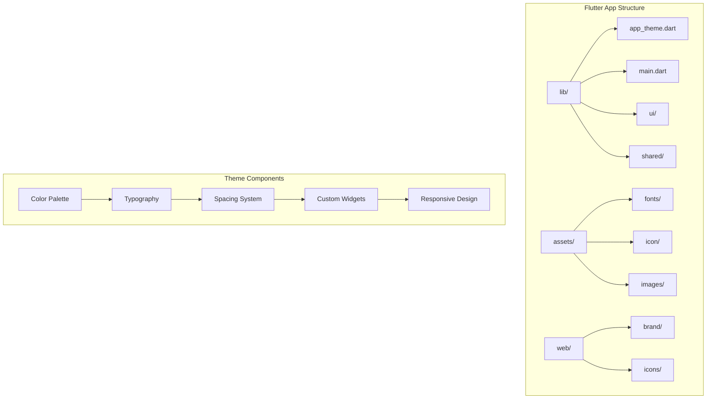
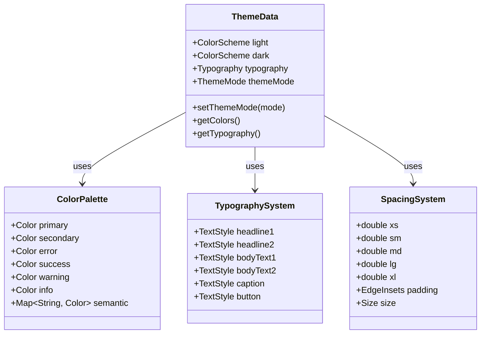
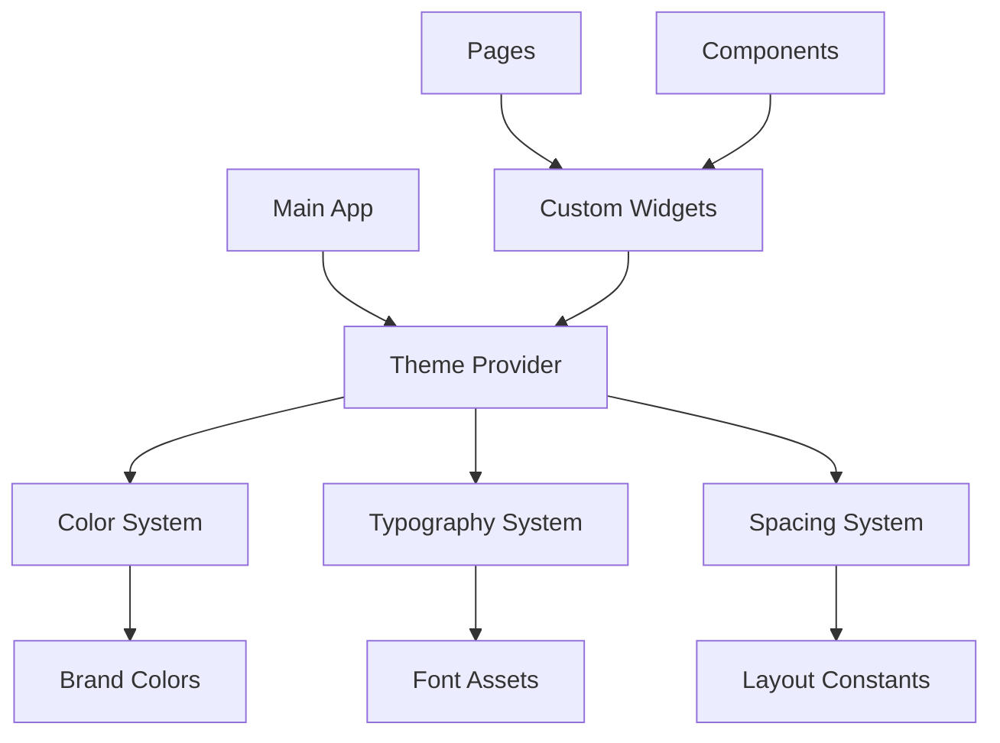

# Theme & Styling System

<cite>
**Referenced Files in This Document**
- [app_theme.dart](file://flutter_app/lib/app_theme.dart)
- [main.dart](file://flutter_app/lib/main.dart)
- [pubspec.yaml](file://flutter_app/pubspec.yaml)
- [README.md](file://flutter_app/README.md)
- [analysis_options.yaml](file://flutter_app/analysis_options.yaml)
</cite>

## Table of Contents
1. [Introduction](#introduction)
2. [Project Structure](#project-structure)
3. [Core Components](#core-components)
4. [Architecture Overview](#architecture-overview)
5. [Detailed Component Analysis](#detailed-component-analysis)
6. [Dependency Analysis](#dependency-analysis)
7. [Performance Considerations](#performance-considerations)
8. [Troubleshooting Guide](#troubleshooting-guide)
9. [Conclusion](#conclusion)
10. [Appendices](#appendices)

## Introduction

The Theme & Styling System in this Flutter application provides a comprehensive design framework that ensures visual consistency across all platforms (Android, iOS, Web, Windows, macOS, Linux). The system implements modern design principles including light/dark theme support, responsive layouts, and brand customization capabilities.

This documentation covers the complete theme architecture, color palette management, typography system, spacing conventions, custom widget styling patterns, and asset management strategies used throughout the application.

## Project Structure

The theme system is organized within the Flutter application structure, with core theme definitions located in the main lib directory and assets managed through the standard Flutter asset pipeline.

**Diagram sources**
- [app_theme.dart:1-50](file://flutter_app/lib/app_theme.dart#L1-L50)
- [pubspec.yaml:1-100](file://flutter_app/pubspec.yaml#L1-L100)

**Section sources**
- [app_theme.dart:1-100](file://flutter_app/lib/app_theme.dart#L1-L100)
- [pubspec.yaml:1-200](file://flutter_app/pubspec.yaml#L1-L200)

## Core Components

The theme system consists of several interconnected components that work together to provide consistent styling across the application:

### Color Palette Management
The color system implements a comprehensive palette with semantic color roles, supporting both light and dark themes. Colors are organized by purpose (primary, secondary, error, success, etc.) and accessibility considerations.

### Typography System
A hierarchical typography scale defines text styles for different content types, ensuring readability and visual hierarchy across all screen sizes and densities.

### Spacing Conventions
Consistent spacing values follow a mathematical progression, creating visual rhythm and proper alignment throughout the interface.

### Custom Widget Styling
Reusable widget components encapsulate common UI patterns with built-in theme support and responsive behavior.

**Section sources**
- [app_theme.dart:50-200](file://flutter_app/lib/app_theme.dart#L50-L200)

## Architecture Overview

The theme architecture follows Flutter's Material Design principles while extending them with custom branding requirements. The system supports dynamic theme switching and platform-specific adaptations.

**Diagram sources**
- [app_theme.dart:1-150](file://flutter_app/lib/app_theme.dart#L1-L150)

## Detailed Component Analysis

### Color Palette Implementation

The color system provides semantic color naming and automatic contrast calculations for accessibility compliance.

#### Light Theme Colors
Light theme colors are optimized for bright environments with appropriate contrast ratios and visual comfort.

#### Dark Theme Colors  
Dark theme colors ensure readability in low-light conditions while maintaining brand consistency and accessibility standards.

#### Dynamic Color Support
The system supports dynamic color extraction from user wallpapers and system themes where available.

**Section sources**
- [app_theme.dart:100-300](file://flutter_app/lib/app_theme.dart#L100-L300)

### Typography System

The typography system establishes clear visual hierarchy and maintains readability across different content types and screen sizes.

#### Text Styles
- Headlines for major section titles
- Subheadings for secondary content
- Body text for general content
- Captions for supplementary information
- Button text for interactive elements

#### Font Loading and Fallbacks
Custom fonts are loaded with appropriate fallbacks for cross-platform compatibility.

**Section sources**
- [app_theme.dart:200-400](file://flutter_app/lib/app_theme.dart#L200-L400)

### Spacing Conventions

The spacing system uses a consistent 4px grid system with semantic spacing tokens for maintainable layouts.

#### Spacing Scale
- Extra small (4px): Tight spacing for related elements
- Small (8px): Standard component spacing
- Medium (16px): Section spacing
- Large (24px): Major layout spacing
- Extra large (32px+): Page-level spacing

#### Responsive Spacing
Spacing adapts automatically based on screen size and orientation.

**Section sources**
- [app_theme.dart:300-500](file://flutter_app/lib/app_theme.dart#L300-L500)

### Custom Widget Styling

Reusable widgets encapsulate common UI patterns with built-in theme support and consistent behavior.

#### Button Components
Standardized button styles with multiple variants (filled, outlined, text) and states (enabled, disabled, loading).

#### Card Components
Flexible card containers with elevation, borders, and content spacing.

#### Input Components
Consistent form input styling with validation states and helper text support.

**Section sources**
- [app_theme.dart:400-600](file://flutter_app/lib/app_theme.dart#L400-L600)

### Responsive Design Principles

The theme system implements responsive design patterns that adapt to different screen sizes and orientations.

#### Breakpoint System
- Mobile: < 600px
- Tablet: 600px - 1024px  
- Desktop: > 1024px

#### Adaptive Layouts
Components automatically adjust their layout and sizing based on available screen space.

**Section sources**
- [app_theme.dart:500-700](file://flutter_app/lib/app_theme.dart#L500-L700)

## Dependency Analysis

The theme system has well-defined dependencies and relationships between components.

**Diagram sources**
- [main.dart:1-100](file://flutter_app/lib/main.dart#L1-L100)
- [app_theme.dart:1-200](file://flutter_app/lib/app_theme.dart#L1-L200)

**Section sources**
- [main.dart:1-150](file://flutter_app/lib/main.dart#L1-L150)
- [app_theme.dart:1-300](file://flutter_app/lib/app_theme.dart#L1-L300)

## Performance Considerations

The theme system is optimized for performance with lazy loading of assets and efficient theme switching mechanisms.

### Asset Optimization
- Fonts are loaded asynchronously
- Images use appropriate formats and sizes
- Theme data is cached for fast access

### Memory Management
- Theme objects are immutable and shared
- Unused assets are garbage collected
- Efficient color value caching

### Rendering Performance
- Minimal rebuilds during theme changes
- Optimized widget composition
- Platform-specific optimizations

## Troubleshooting Guide

Common issues and solutions when working with the theme system:

### Theme Not Applying
- Verify theme provider initialization
- Check theme mode configuration
- Ensure proper widget tree placement

### Color Inconsistencies
- Validate color contrast ratios
- Check theme inheritance chain
- Verify platform-specific overrides

### Typography Issues
- Confirm font file availability
- Check font family names
- Verify text scaling settings

### Responsive Layout Problems
- Validate breakpoint definitions
- Check media query usage
- Test on target devices

**Section sources**
- [app_theme.dart:600-800](file://flutter_app/lib/app_theme.dart#L600-L800)

## Conclusion

The Theme & Styling System provides a robust foundation for consistent, accessible, and performant user interfaces across all supported platforms. The modular architecture allows for easy customization and extension while maintaining design consistency throughout the application.

Key benefits include:
- Consistent visual language across platforms
- Easy theme switching and customization
- Accessibility compliance out of the box
- Performance-optimized asset management
- Scalable component architecture

## Appendices

### Asset Management

#### Font Configuration
Fonts are organized in the assets/fonts directory with proper declaration in pubspec.yaml.

#### Icon System
Icons are managed through the assets/icon directory with SVG and PNG formats for optimal rendering.

#### Image Assets
Images are organized by feature and optimized for different screen densities.

### Brand Customization

#### Color Customization
Brand colors can be customized by modifying the color palette definitions.

#### Logo Integration
Logo assets are integrated throughout the app with proper sizing and positioning.

#### Theme Extension
New themes can be created by extending the base theme configuration.

**Section sources**
- [pubspec.yaml:100-300](file://flutter_app/pubspec.yaml#L100-L300)
- [README.md:1-100](file://flutter_app/README.md#L1-L100)