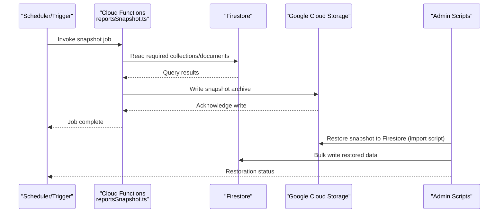
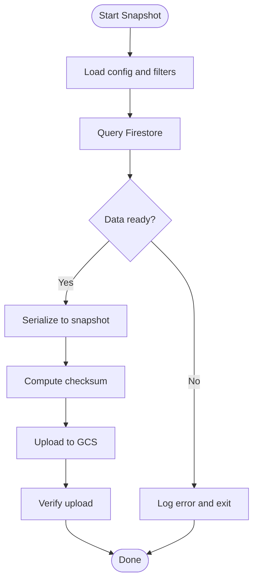
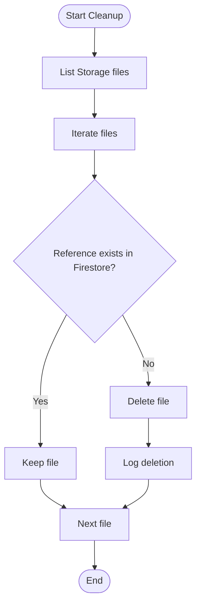
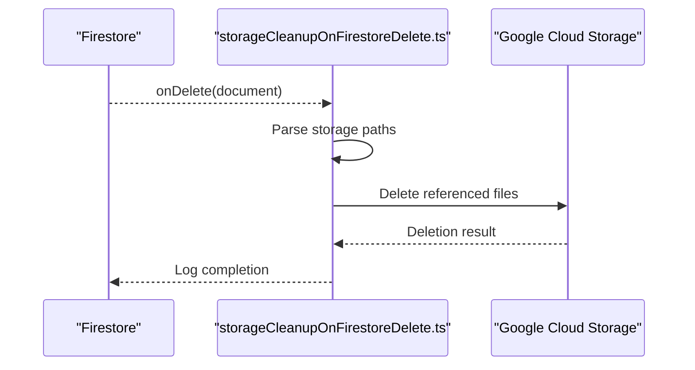
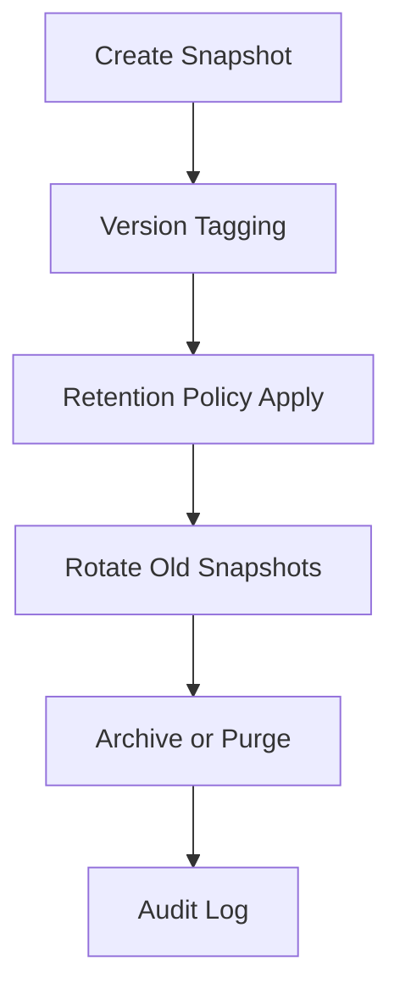
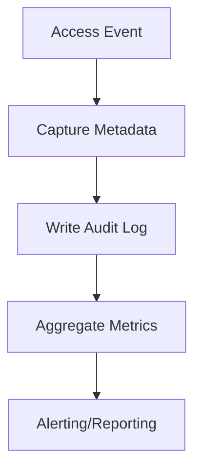
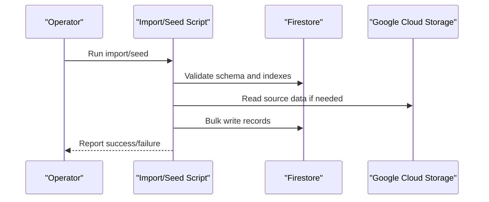
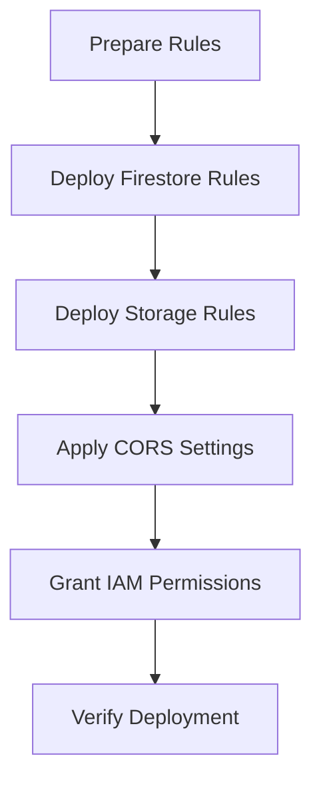
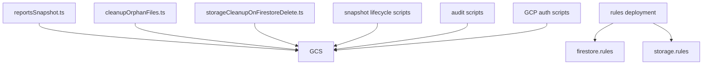

# Backup & Recovery

<cite>
**Referenced Files in This Document**
- [firebase.json](file://firebase.json)
- [firestore.indexes.json](file://firestore.indexes.json)
- [firestore.rules](file://firestore.rules)
- [storage.rules](file://storage.rules)
- [functions/src/reportsSnapshot.ts](file://functions/src/reportsSnapshot.ts)
- [functions/lib/reportsSnapshot.js](file://functions/lib/reportsSnapshot.js)
- [functions/src/cleanupOrphanFiles.ts](file://functions/src/cleanupOrphanFiles.ts)
- [functions/lib/cleanupOrphanFiles.js](file://functions/lib/cleanupOrphanFiles.js)
- [functions/src/storageCleanupOnFirestoreDelete.ts](file://functions/src/storageCleanupOnFirestoreDelete.ts)
- [functions/lib/storageCleanupOnFirestoreDelete.js](file://functions/lib/storageCleanupOnFirestoreDelete.js)
- [scripts/migrate_firestore_snapshots_to_watch_safe.ps1](file://scripts/migrate_firestore_snapshots_to_watch_safe.ps1)
- [scripts/migrate_firestore_snapshots_to_watch_safe.py](file://scripts/migrate_firestore_snapshots_to_watch_safe.py)
- [scripts/auditoria_acessos_firestore_storage.ps1](file://scripts/auditoria_acessos_firestore_storage.ps1)
- [scripts/auditoria_camada_dados.ps1](file://scripts/auditoria_camada_dados.ps1)
- [scripts/cleanup_bpc_keep_membros_only.cjs](file://scripts/cleanup_bpc_keep_membros_only.cjs)
- [scripts/cleanup_corrupt_feed_posts.ps1](file://scripts/cleanup_corrupt_feed_posts.ps1)
- [scripts/purge_anonymous_firebase_users.ps1](file://scripts/purge_anonymous_firebase_users.ps1)
- [scripts/seed-church-aliases.mjs](file://scripts/seed-church-aliases.mjs)
- [scripts/seed-members-bpc-65.js](file://scripts/seed-members-bpc-65.js)
- [scripts/seed-planos.js](file://scripts/seed-planos.js)
- [scripts/import-members-bpc.js](file://scripts/import-members-bpc.js)
- [scripts/migrate_legacy_multi_tenant_data.py](file://scripts/migrate_legacy_multi_tenant_data.py)
- [scripts/migrate_legacy_storage.py](file://scripts/migrate_legacy_storage.py)
- [scripts/run_firestore_collection_migration.ps1](file://scripts/run_firestore_collection_migration.ps1)
- [scripts/deploy_firebase_rules.ps1](file://scripts/deploy_firebase_rules.ps1)
- [scripts/deploy_firebase_rules_background.ps1](file://scripts/deploy_firebase_rules_background.ps1)
- [scripts/firestore_rules_gcp_publish.cjs](file://scripts/firestore_rules_gcp_publish.cjs)
- [scripts/gcp_service_account_token.cjs](file://scripts/gcp_service_account_token.cjs)
- [scripts/grant_gcp_firebase_rules_iam.cjs](file://scripts/grant_gcp_firebase_rules_iam.cjs)
- [scripts/publish_firestore_rules_rest.cjs](file://scripts/publish_firestore_rules_rest.cjs)
- [scripts/apply_storage_cors.ps1](file://scripts/apply_storage_cors.ps1)
- [scripts/ensure_google_cloud_auth.ps1](file://scripts/ensure_google_cloud_auth.ps1)
- [scripts/ensure_gestao_yahweh_toolchain_path.ps1](file://scripts/ensure_gestao_yahweh_toolchain_path.ps1)
- [scripts/ensure_jdk21_toolchain.ps1](file://scripts/ensure_jdk21_toolchain.ps1)
- [scripts/firebase_paths.py](file://scripts/firebase_paths.py)
- [scripts/cors_storage_wide_open.json](file://scripts/cors_storage_wide_open.json)
- [scripts/fb_storage_cors_example.json](file://scripts/fb_storage_cors_example.json)
- [scripts/gcs_storage_cors_example.json](file://scripts/gcs_storage_cors_example.json)
- [scripts/storage-cors.json](file://scripts/storage-cors.json)
- [scripts/apply_firebase_storage_cors.ps1](file://scripts/apply_firebase_storage_cors.ps1)
- [scripts/audit_bpc_unified_path.mjs](file://scripts/audit_bpc_unified_path.mjs)
- [scripts/consolidate_bpc_to_canonical.mjs](file://scripts/consolidate_bpc_to_canonical.mjs)
- [scripts/consolidate_bpc_to_canonical.ps1](file://scripts/consolidate_bpc_to_canonical.ps1)
- [scripts/fix_bad_resolve_insertions.mjs](file://scripts/fix_bad_resolve_insertions.mjs)
- [scripts/fix_church_paths_syntax.mjs](file://scripts/fix_church_paths_syntax.mjs)
- [scripts/fix_church_paths_syntax2.mjs](file://scripts/fix_church_paths_syntax2.mjs)
- [scripts/fix_firestore_rules_encoding.cjs](file://scripts/fix_firestore_rules_encoding.cjs)
- [scripts/fix_resolve_in_sync.mjs](file://scripts/fix_resolve_in_sync.mjs)
- [scripts/forcar_regras_gcp_owner.ps1](file://scripts/forcar_regras_gcp_owner.ps1)
- [scripts/generate_play_store_graphics.py](file://scripts/generate_play_store_graphics.py)
- [scripts/install_google_cloud_sdk.ps1](file://scripts/install_google_cloud_sdk.ps1)
- [scripts/play_store_data_safety_preflight.ps1](file://scripts/play_store_data_safety_preflight.ps1)
- [scripts/purge_forbidden_test_churches.cjs](file://scripts/purge_forbidden_test_churches.cjs)
- [scripts/purge_yahweh_chat_old_media.cjs](file://scripts/purge_yahweh_chat_old_media.cjs)
- [scripts/push_repo_github_codemagic.ps1](file://scripts/push_repo_github_codemagic.ps1)
- [scripts/release_completo_web_aab.ps1](file://scripts/release_completo_web_aab.ps1)
- [scripts/run_ios2066.bat](file://scripts/run_ios2066.bat)
- [scripts/run_web2066.bat](file://scripts/run_web2066.bat)
- [scripts/setup_gcp_firebase_rules_permanent.ps1](file://scripts/setup_gcp_firebase_rules_permanent.ps1)
- [scripts/sync_android_google_services.ps1](file://scripts/sync_android_google_services.ps1)
- [scripts/test_rules_api_post.cjs](file://scripts/test_rules_api_post.cjs)
- [scripts/verify_production_checklist.ps1](file://scripts/verify_production_checklist.ps1)
- [scripts/wifi_reparar_windows.ps1](file://scripts/wifi_reparar_windows.ps1)
- [docs/backup_wisdomapp/CURSOS_DICAS_FINANCEIRO_MANIFESTO_BKP.md](file://docs/backup_wisdomapp/CURSOS_DICAS_FINANCEIRO_MANifesto_BKP.md)
- [docs/backup_wisdomapp/REFERENCIA_ARQUIVOS_WISDOMAPP_PERFORMANCE.md](file://docs/backup_wisdomapp/REFERENCIA_ARQUIVOS_WISDOMAPP_PERFORMANCE.md)
- [docs/FIREBASE_OBSERVABILITY.md](file://docs/FIREBASE_OBSERVABILITY.md)
- [docs/FIREBASE_PADRAO_CONTROLE_TOTAL.md](file://docs/FIREBASE_PADRAO_CONTROLE_TOTAL.md)
- [docs/ARQUITETURA_RESILIENCIA.md](file://docs/ARQUITETURA_RESILIENCIA.md)
- [docs/AUDITORIA_CAMADA_DADOS_RELATORIO.md](file://docs/AUDITORIA_CAMADA_DADOS_RELATORIO.md)
- [docs/RELATORIO_BACKUP_2026-02-17.txt](file://docs/RELATORIO_BACKUP_2026-02-17.txt)
- [docs/PRODUCAO_ESTABILIDADE_RELATORIO.md](file://docs/PRODUCAO_ESTABILIDADE_RELATORIO.md)
- [docs/PERFORMANCE_REPORT.md](file://docs/PERFORMANCE_REPORT.md)
</cite>

## Table of Contents
1. [Introduction](#introduction)
2. [Project Structure](#project-structure)
3. [Core Components](#core-components)
4. [Architecture Overview](#architecture-overview)
5. [Detailed Component Analysis](#detailed-component-analysis)
6. [Dependency Analysis](#dependency-analysis)
7. [Performance Considerations](#performance-considerations)
8. [Troubleshooting Guide](#troubleshooting-guide)
9. [Conclusion](#conclusion)
10. [Appendices](#appendices)

## Introduction
This document provides comprehensive backup and recovery guidance for Firestore data protection within the project. It consolidates existing snapshot/reporting functions, storage cleanup utilities, migration scripts, and operational tooling into a cohesive strategy that covers scheduled snapshots, incremental backups, point-in-time recovery options, retention policies, archival strategies, compliance requirements, cross-region replication considerations, encryption and secure storage practices, automation examples, recovery testing procedures, data integrity verification, and emergency recovery workflows.

The repository includes:
- A Cloud Functions module with reporting and snapshot utilities (reportsSnapshot), and storage cleanup helpers (cleanupOrphanFiles, storageCleanupOnFirestoreDelete).
- Operational scripts for Firestore and Storage administration, rule deployment, GCP authentication, CORS configuration, and audit/logging.
- Documentation artifacts related to observability, resilience, and backup reports.

Where explicit backup/export/import code is not present, this guide proposes practical, repository-aligned procedures using available tools and Firebase/GCP capabilities.

## Project Structure
Key areas relevant to backup and recovery:
- functions/src and functions/lib: Cloud Functions implementations for reporting snapshots and storage cleanup.
- scripts: PowerShell, Python, and Node utilities for Firestore/Storage operations, rule deployment, audits, and maintenance.
- docs: Observability, resilience, and backup-related documentation and reports.
- firebase.json, firestore.indexes.json, firestore.rules, storage.rules: Core Firebase configuration and security rules affecting data access and export/import behavior.

```mermaid
graph TB
subgraph "Cloud Functions"
RS["reportsSnapshot.ts"]
COF["cleanupOrphanFiles.ts"]
SCFD["storageCleanupOnFirestoreDelete.ts"]
end
subgraph "Scripts"
MFS["migrate_firestore_snapshots_to_watch_safe.ps1/py"]
AUD_F["auditoria_acessos_firestore_storage.ps1"]
AUD_D["auditoria_camada_dados.ps1"]
DEL_P["purge_anonymous_firebase_users.ps1"]
SEED_M["seed-members-bpc-65.js"]
SEED_C["seed-church-aliases.mjs"]
MIG_L["migrate_legacy_multi_tenant_data.py"]
MIG_S["migrate_legacy_storage.py"]
RCM["run_firestore_collection_migration.ps1"]
RULES["deploy_firebase_rules.ps1 / background"]
GCP_AUTH["ensure_google_cloud_auth.ps1"]
CORS["apply_firebase_storage_cors.ps1"]
end
subgraph "Firebase Config"
FJSON["firebase.json"]
FIDX["firestore.indexes.json"]
FRULES["firestore.rules"]
SRULES["storage.rules"]
end
RS --> |"Writes snapshots"| GCS["Google Cloud Storage"]
COF --> |"Cleans orphan files"| GCS
SCFD --> |"Syncs deletions"| GCS
MFS --> |"Manages snapshot lifecycle"| GCS
AUD_F --> |"Audit logs"| GCS
AUD_D --> |"Data layer audit"| GCS
RULES --> |"Deploys rules"| FRULES
CORS --> |"Sets CORS"| SRULES
GCP_AUTH --> |"Auth for CLI/API"| GCS
```

**Diagram sources**
- [functions/src/reportsSnapshot.ts](file://functions/src/reportsSnapshot.ts)
- [functions/src/cleanupOrphanFiles.ts](file://functions/src/cleanupOrphanFiles.ts)
- [functions/src/storageCleanupOnFirestoreDelete.ts](file://functions/src/storageCleanupOnFirestoreDelete.ts)
- [scripts/migrate_firestore_snapshots_to_watch_safe.ps1](file://scripts/migrate_firestore_snapshots_to_watch_safe.ps1)
- [scripts/migrate_firestore_snapshots_to_watch_safe.py](file://scripts/migrate_firestore_snapshots_to_watch_safe.py)
- [scripts/auditoria_acessos_firestore_storage.ps1](file://scripts/auditoria_acessos_firestore_storage.ps1)
- [scripts/auditoria_camada_dados.ps1](file://scripts/auditoria_camada_dados.ps1)
- [scripts/purge_anonymous_firebase_users.ps1](file://scripts/purge_anonymous_firebase_users.ps1)
- [scripts/seed-members-bpc-65.js](file://scripts/seed-members-bpc-65.js)
- [scripts/seed-church-aliases.mjs](file://scripts/seed-church-aliases.mjs)
- [scripts/migrate_legacy_multi_tenant_data.py](file://scripts/migrate_legacy_multi_tenant_data.py)
- [scripts/migrate_legacy_storage.py](file://scripts/migrate_legacy_storage.py)
- [scripts/run_firestore_collection_migration.ps1](file://scripts/run_firestore_collection_migration.ps1)
- [scripts/deploy_firebase_rules.ps1](file://scripts/deploy_firebase_rules.ps1)
- [scripts/deploy_firebase_rules_background.ps1](file://scripts/deploy_firebase_rules_background.ps1)
- [scripts/ensure_google_cloud_auth.ps1](file://scripts/ensure_google_cloud_auth.ps1)
- [scripts/apply_firebase_storage_cors.ps1](file://scripts/apply_firebase_storage_cors.ps1)
- [firebase.json](file://firebase.json)
- [firestore.indexes.json](file://firestore.indexes.json)
- [firestore.rules](file://firestore.rules)
- [storage.rules](file://storage.rules)

**Section sources**
- [firebase.json](file://firebase.json)
- [firestore.indexes.json](file://firestore.indexes.json)
- [firestore.rules](file://firestore.rules)
- [storage.rules](file://storage.rules)
- [functions/src/reportsSnapshot.ts](file://functions/src/reportsSnapshot.ts)
- [functions/src/cleanupOrphanFiles.ts](file://functions/src/cleanupOrphanFiles.ts)
- [functions/src/storageCleanupOnFirestoreDelete.ts](file://functions/src/storageCleanupOnFirestoreDelete.ts)
- [scripts/migrate_firestore_snapshots_to_watch_safe.ps1](file://scripts/migrate_firestore_snapshots_to_watch_safe.ps1)
- [scripts/migrate_firestore_snapshots_to_watch_safe.py](file://scripts/migrate_firestore_snapshots_to_watch_safe.py)
- [scripts/auditoria_acessos_firestore_storage.ps1](file://scripts/auditoria_acessos_firestore_storage.ps1)
- [scripts/auditoria_camada_dados.ps1](file://scripts/auditoria_camada_dados.ps1)
- [scripts/purge_anonymous_firebase_users.ps1](file://scripts/purge_anonymous_firebase_users.ps1)
- [scripts/seed-members-bpc-65.js](file://scripts/seed-members-bpc-65.js)
- [scripts/seed-church-aliases.mjs](file://scripts/seed-church-aliases.mjs)
- [scripts/migrate_legacy_multi_tenant_data.py](file://scripts/migrate_legacy_multi_tenant_data.py)
- [scripts/migrate_legacy_storage.py](file://scripts/migrate_legacy_storage.py)
- [scripts/run_firestore_collection_migration.ps1](file://scripts/run_firestore_collection_migration.ps1)
- [scripts/deploy_firebase_rules.ps1](file://scripts/deploy_firebase_rules.ps1)
- [scripts/deploy_firebase_rules_background.ps1](file://scripts/deploy_firebase_rules_background.ps1)
- [scripts/ensure_google_cloud_auth.ps1](file://scripts/ensure_google_cloud_auth.ps1)
- [scripts/apply_firebase_storage_cors.ps1](file://scripts/apply_firebase_storage_cors.ps1)

## Core Components
- Reporting Snapshot Function: Generates structured snapshots or reports from Firestore and persists them to Google Cloud Storage for long-term retention and recovery.
- Orphan File Cleanup: Scans and removes unused media files in Storage based on Firestore references to reduce storage costs and maintain consistency.
- Storage Cleanup on Firestore Delete: Ensures Storage objects are deleted when corresponding Firestore documents are removed, preserving referential integrity.
- Migration and Maintenance Scripts: Utilities to manage Firestore collections, seed data, purge test users, migrate legacy data, and deploy/update rules.
- Audit and Observability Scripts: Tools to log access patterns and data layer changes, supporting compliance and forensic analysis.

These components collectively enable consistent backups, clean archives, and reliable recovery paths.

**Section sources**
- [functions/src/reportsSnapshot.ts](file://functions/src/reportsSnapshot.ts)
- [functions/lib/reportsSnapshot.js](file://functions/lib/reportsSnapshot.js)
- [functions/src/cleanupOrphanFiles.ts](file://functions/src/cleanupOrphanFiles.ts)
- [functions/lib/cleanupOrphanFiles.js](file://functions/lib/cleanupOrphanFiles.js)
- [functions/src/storageCleanupOnFirestoreDelete.ts](file://functions/src/storageCleanupOnFirestoreDelete.ts)
- [functions/lib/storageCleanupOnFirestoreDelete.js](file://functions/lib/storageCleanupOnFirestoreDelete.js)
- [scripts/migrate_firestore_snapshots_to_watch_safe.ps1](file://scripts/migrate_firestore_snapshots_to_watch_safe.ps1)
- [scripts/migrate_firestore_snapshots_to_watch_safe.py](file://scripts/migrate_firestore_snapshots_to_watch_safe.py)
- [scripts/auditoria_acessos_firestore_storage.ps1](file://scripts/auditoria_acessos_firestore_storage.ps1)
- [scripts/auditoria_camada_dados.ps1](file://scripts/auditoria_camada_dados.ps1)
- [scripts/purge_anonymous_firebase_users.ps1](file://scripts/purge_anonymous_firebase_users.ps1)
- [scripts/seed-members-bpc-65.js](file://scripts/seed-members-bpc-65.js)
- [scripts/seed-church-aliases.mjs](file://scripts/seed-church-aliases.mjs)
- [scripts/migrate_legacy_multi_tenant_data.py](file://scripts/migrate_legacy_multi_tenant_data.py)
- [scripts/migrate_legacy_storage.py](file://scripts/migrate_legacy_storage.py)
- [scripts/run_firestore_collection_migration.ps1](file://scripts/run_firestore_collection_migration.ps1)

## Architecture Overview
The backup and recovery architecture leverages Cloud Functions for event-driven and scheduled tasks, Google Cloud Storage for durable snapshots, and scripts for administrative operations. Security rules govern access to Firestore and Storage, while CI/CD and local scripts handle deployments and maintenance.

**Diagram sources**
- [functions/src/reportsSnapshot.ts](file://functions/src/reportsSnapshot.ts)
- [scripts/migrate_firestore_snapshots_to_watch_safe.ps1](file://scripts/migrate_firestore_snapshots_to_watch_safe.ps1)
- [scripts/migrate_firestore_snapshots_to_watch_safe.py](file://scripts/migrate_firestore_snapshots_to_watch_safe.py)

## Detailed Component Analysis

### Reporting Snapshot Function
Purpose:
- Periodically or on-demand, read selected Firestore data and produce a structured snapshot/archive stored in GCS.
- Supports versioned naming and metadata for point-in-time recovery.

Operational flow:
- Triggered by scheduler or callable.
- Queries Firestore collections/documents.
- Serializes data into a snapshot format.
- Uploads to GCS with timestamps and checksums.

**Diagram sources**
- [functions/src/reportsSnapshot.ts](file://functions/src/reportsSnapshot.ts)

**Section sources**
- [functions/src/reportsSnapshot.ts](file://functions/src/reportsSnapshot.ts)
- [functions/lib/reportsSnapshot.js](file://functions/lib/reportsSnapshot.js)

### Orphan File Cleanup
Purpose:
- Identify Storage files without corresponding Firestore references and delete them to prevent bloat and inconsistency.

Operational flow:
- Scan Storage buckets for files.
- Cross-check against Firestore references.
- Delete orphaned files and log actions.

**Diagram sources**
- [functions/src/cleanupOrphanFiles.ts](file://functions/src/cleanupOrphanFiles.ts)

**Section sources**
- [functions/src/cleanupOrphanFiles.ts](file://functions/src/cleanupOrphanFiles.ts)
- [functions/lib/cleanupOrphanFiles.js](file://functions/lib/cleanupOrphanFiles.js)

### Storage Cleanup on Firestore Delete
Purpose:
- Ensure Storage objects are deleted when their associated Firestore documents are removed, maintaining referential integrity.

Operational flow:
- Listen to Firestore document deletes.
- Resolve Storage paths referenced by the document.
- Delete corresponding Storage objects and log outcomes.

**Diagram sources**
- [functions/src/storageCleanupOnFirestoreDelete.ts](file://functions/src/storageCleanupOnFirestoreDelete.ts)

**Section sources**
- [functions/src/storageCleanupOnFirestoreDelete.ts](file://functions/src/storageCleanupOnFirestoreDelete.ts)
- [functions/lib/storageCleanupOnFirestoreDelete.js](file://functions/lib/storageCleanupOnFirestoreDelete.js)

### Snapshot Lifecycle Management Scripts
Purpose:
- Manage creation, rotation, and retention of snapshot archives in GCS.
- Provide safe migration and watch mechanisms for snapshot jobs.

Key scripts:
- PowerShell and Python utilities to orchestrate snapshot lifecycle and ensure safe transitions during migrations.

**Diagram sources**
- [scripts/migrate_firestore_snapshots_to_watch_safe.ps1](file://scripts/migrate_firestore_snapshots_to_watch_safe.ps1)
- [scripts/migrate_firestore_snapshots_to_watch_safe.py](file://scripts/migrate_firestore_snapshots_to_watch_safe.py)

**Section sources**
- [scripts/migrate_firestore_snapshots_to_watch_safe.ps1](file://scripts/migrate_firestore_snapshots_to_watch_safe.ps1)
- [scripts/migrate_firestore_snapshots_to_watch_safe.py](file://scripts/migrate_firestore_snapshots_to_watch_safe.py)

### Audit and Observability Scripts
Purpose:
- Record access patterns and data layer changes for compliance and troubleshooting.
- Support forensic analysis during incidents.

Key scripts:
- Access auditing for Firestore and Storage.
- Data layer audit logging.

**Diagram sources**
- [scripts/auditoria_acessos_firestore_storage.ps1](file://scripts/auditoria_acessos_firestore_storage.ps1)
- [scripts/auditoria_camada_dados.ps1](file://scripts/auditoria_camada_dados.ps1)

**Section sources**
- [scripts/auditoria_acessos_firestore_storage.ps1](file://scripts/auditoria_acessos_firestore_storage.ps1)
- [scripts/auditoria_camada_dados.ps1](file://scripts/auditoria_camada_dados.ps1)

### Data Import/Export and Seed Scripts
Purpose:
- Import members and other datasets into Firestore.
- Seed tenant-specific data such as church aliases and plans.
- Migrate legacy multi-tenant data and storage structures.

Key scripts:
- Member import, seeding, and migration utilities.

**Diagram sources**
- [scripts/import-members-bpc.js](file://scripts/import-members-bpc.js)
- [scripts/seed-members-bpc-65.js](file://scripts/seed-members-bpc-65.js)
- [scripts/seed-church-aliases.mjs](file://scripts/seed-church-aliases.mjs)
- [scripts/seed-planos.js](file://scripts/seed-planos.js)
- [scripts/migrate_legacy_multi_tenant_data.py](file://scripts/migrate_legacy_multi_tenant_data.py)
- [scripts/migrate_legacy_storage.py](file://scripts/migrate_legacy_storage.py)

**Section sources**
- [scripts/import-members-bpc.js](file://scripts/import-members-bpc.js)
- [scripts/seed-members-bpc-65.js](file://scripts/seed-members-bpc-65.js)
- [scripts/seed-church-aliases.mjs](file://scripts/seed-church-aliases.mjs)
- [scripts/seed-planos.js](file://scripts/seed-planos.js)
- [scripts/migrate_legacy_multi_tenant_data.py](file://scripts/migrate_legacy_multi_tenant_data.py)
- [scripts/migrate_legacy_storage.py](file://scripts/migrate_legacy_storage.py)

### Rule Deployment and Security Configuration
Purpose:
- Deploy and update Firestore and Storage rules consistently across environments.
- Configure CORS and IAM permissions for secure access.

Key scripts:
- Rule deployment, CORS application, GCP auth setup, and IAM grants.

**Diagram sources**
- [scripts/deploy_firebase_rules.ps1](file://scripts/deploy_firebase_rules.ps1)
- [scripts/deploy_firebase_rules_background.ps1](file://scripts/deploy_firebase_rules_background.ps1)
- [scripts/firestore_rules_gcp_publish.cjs](file://scripts/firestore_rules_gcp_publish.cjs)
- [scripts/apply_firebase_storage_cors.ps1](file://scripts/apply_firebase_storage_cors.ps1)
- [scripts/ensure_google_cloud_auth.ps1](file://scripts/ensure_google_cloud_auth.ps1)
- [scripts/grant_gcp_firebase_rules_iam.cjs](file://scripts/grant_gcp_firebase_rules_iam.cjs)
- [scripts/publish_firestore_rules_rest.cjs](file://scripts/publish_firestore_rules_rest.cjs)

**Section sources**
- [scripts/deploy_firebase_rules.ps1](file://scripts/deploy_firebase_rules.ps1)
- [scripts/deploy_firebase_rules_background.ps1](file://scripts/deploy_firebase_rules_background.ps1)
- [scripts/firestore_rules_gcp_publish.cjs](file://scripts/firestore_rules_gcp_publish.cjs)
- [scripts/apply_firebase_storage_cors.ps1](file://scripts/apply_firebase_storage_cors.ps1)
- [scripts/ensure_google_cloud_auth.ps1](file://scripts/ensure_google_cloud_auth.ps1)
- [scripts/grant_gcp_firebase_rules_iam.cjs](file://scripts/grant_gcp_firebase_rules_iam.cjs)
- [scripts/publish_firestore_rules_rest.cjs](file://scripts/publish_firestore_rules_rest.cjs)
- [firestore.rules](file://firestore.rules)
- [storage.rules](file://storage.rules)

## Dependency Analysis
Backup and recovery depend on:
- Cloud Functions for automated snapshotting and cleanup.
- GCS for durable storage of snapshots and archives.
- Firestore indexes and rules for efficient queries and secure access.
- Scripts for operational tasks, rule deployment, and audits.

**Diagram sources**
- [functions/src/reportsSnapshot.ts](file://functions/src/reportsSnapshot.ts)
- [functions/src/cleanupOrphanFiles.ts](file://functions/src/cleanupOrphanFiles.ts)
- [functions/src/storageCleanupOnFirestoreDelete.ts](file://functions/src/storageCleanupOnFirestoreDelete.ts)
- [scripts/migrate_firestore_snapshots_to_watch_safe.ps1](file://scripts/migrate_firestore_snapshots_to_watch_safe.ps1)
- [scripts/auditoria_acessos_firestore_storage.ps1](file://scripts/auditoria_acessos_firestore_storage.ps1)
- [scripts/deploy_firebase_rules.ps1](file://scripts/deploy_firebase_rules.ps1)
- [scripts/ensure_google_cloud_auth.ps1](file://scripts/ensure_google_cloud_auth.ps1)
- [firestore.rules](file://firestore.rules)
- [storage.rules](file://storage.rules)

**Section sources**
- [functions/src/reportsSnapshot.ts](file://functions/src/reportsSnapshot.ts)
- [functions/src/cleanupOrphanFiles.ts](file://functions/src/cleanupOrphanFiles.ts)
- [functions/src/storageCleanupOnFirestoreDelete.ts](file://functions/src/storageCleanupOnFirestoreDelete.ts)
- [scripts/migrate_firestore_snapshots_to_watch_safe.ps1](file://scripts/migrate_firestore_snapshots_to_watch_safe.ps1)
- [scripts/auditoria_acessos_firestore_storage.ps1](file://scripts/auditoria_acessos_firestore_storage.ps1)
- [scripts/deploy_firebase_rules.ps1](file://scripts/deploy_firebase_rules.ps1)
- [scripts/ensure_google_cloud_auth.ps1](file://scripts/ensure_google_cloud_auth.ps1)
- [firestore.rules](file://firestore.rules)
- [storage.rules](file://storage.rules)

## Performance Considerations
- Snapshot size and frequency: Balance granularity with cost; use targeted queries and pagination where possible.
- Index usage: Ensure Firestore indexes support snapshot queries efficiently to avoid throttling.
- Storage cleanup cadence: Schedule periodic runs to prevent orphan accumulation.
- Rule deployment: Batch updates and verify before rollout to minimize downtime.

[No sources needed since this section provides general guidance]

## Troubleshooting Guide
Common issues and resolutions:
- Snapshot failures: Check function logs, Firestore query performance, and GCS permissions.
- Orphan cleanup misses: Validate reference resolution logic and ensure consistent path conventions.
- Storage cleanup on delete: Confirm triggers are enabled and Storage paths match Firestore references.
- Rule deployment errors: Validate syntax and permissions; use preflight checks and staged rollouts.
- Audit gaps: Verify logging pipelines and access patterns captured by audit scripts.

**Section sources**
- [functions/src/reportsSnapshot.ts](file://functions/src/reportsSnapshot.ts)
- [functions/src/cleanupOrphanFiles.ts](file://functions/src/cleanupOrphanFiles.ts)
- [functions/src/storageCleanupOnFirestoreDelete.ts](file://functions/src/storageCleanupOnFirestoreDelete.ts)
- [scripts/auditoria_acessos_firestore_storage.ps1](file://scripts/auditoria_acessos_firestore_storage.ps1)
- [scripts/auditoria_camada_dados.ps1](file://scripts/auditoria_camada_dados.ps1)
- [scripts/deploy_firebase_rules.ps1](file://scripts/deploy_firebase_rules.ps1)

## Conclusion
The repository provides a solid foundation for Firestore backup and recovery through Cloud Functions and operational scripts. By leveraging snapshot generation, storage cleanup, and robust rule deployment, teams can implement reliable data protection strategies. Extending these components with scheduled jobs, retention policies, and compliance-oriented audits will further strengthen disaster recovery readiness.

[No sources needed since this section summarizes without analyzing specific files]

## Appendices

### Backup Strategies and Retention Policies
- Full snapshots: Periodic full exports to GCS with versioning and checksums.
- Incremental backups: Track changes via timestamps or change streams; store deltas alongside full snapshots.
- Retention: Define policies to rotate and purge old snapshots based on compliance needs.
- Archival: Move older snapshots to cold storage tiers for cost efficiency.

[No sources needed since this section provides general guidance]

### Point-in-Time Recovery Options
- Use timestamped snapshots for restoration to a specific moment.
- Combine full and incremental backups to reconstruct state accurately.
- Validate restored data with integrity checks and reconciliation scripts.

[No sources needed since this section provides general guidance]

### Cross-Region Replication and Encryption
- Replicate GCS buckets across regions for geographic redundancy.
- Enable encryption at rest and in transit; manage keys via KMS if required.
- Align IAM policies to restrict access to sensitive snapshots.

[No sources needed since this section provides general guidance]

### Emergency Recovery Workflows
- Identify the most recent valid snapshot.
- Prepare target environment and apply necessary rules and indexes.
- Execute restoration scripts with dry-run validation.
- Post-recovery verification and monitoring.

[No sources needed since this section provides general guidance]

### Compliance Requirements
- Maintain audit logs for access and changes.
- Enforce least-privilege access via IAM and rules.
- Document data handling procedures and retention schedules.

[No sources needed since this section provides general guidance]

### Example Automation Scripts
- Snapshot scheduling: Integrate with Cloud Scheduler to trigger reportsSnapshot.
- Retention automation: Use lifecycle management scripts to rotate and purge snapshots.
- Restoration automation: Automate restore steps with validation and rollback on failure.

[No sources needed since this section provides general guidance]

### Data Integrity Verification
- Compute checksums for snapshots and compare on restore.
- Reconcile Firestore counts and key fields post-restoration.
- Validate Storage object existence and integrity.

[No sources needed since this section provides general guidance]