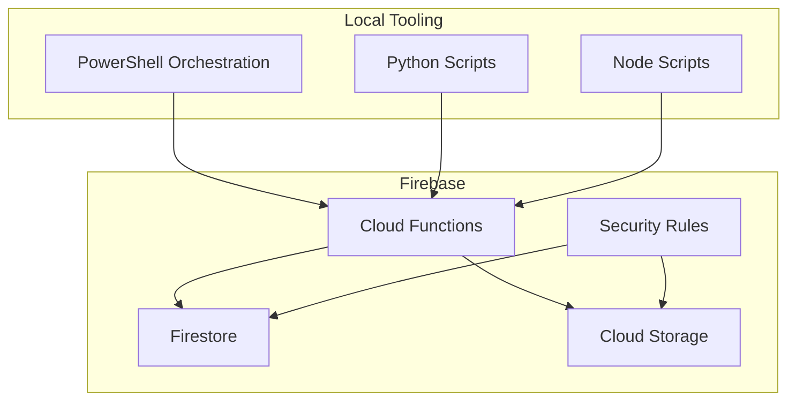
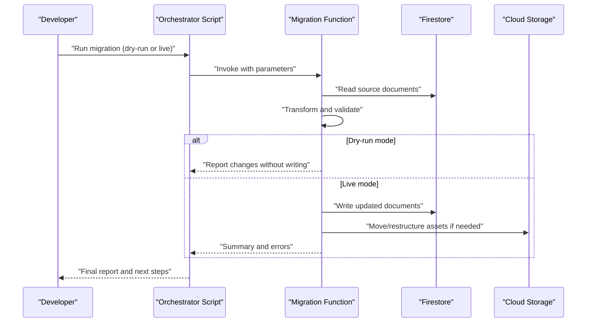
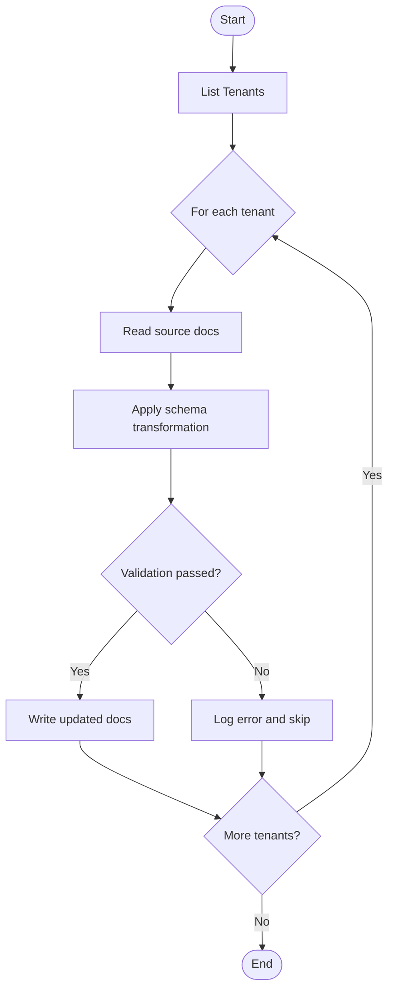
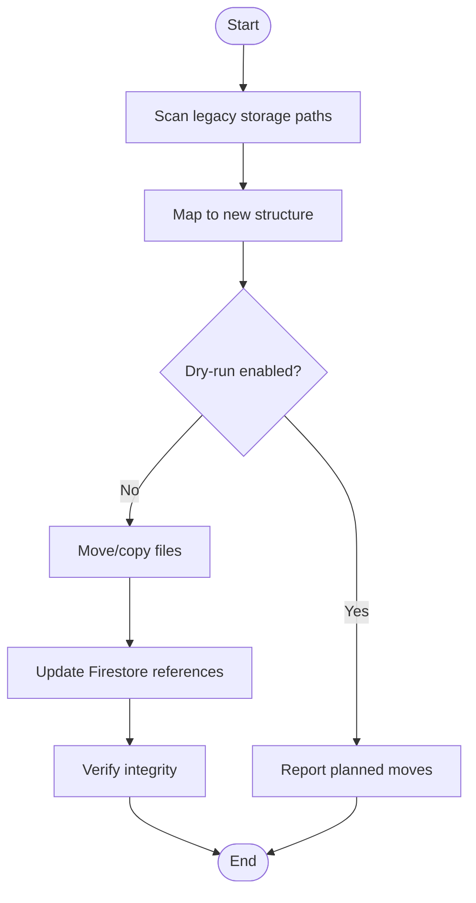
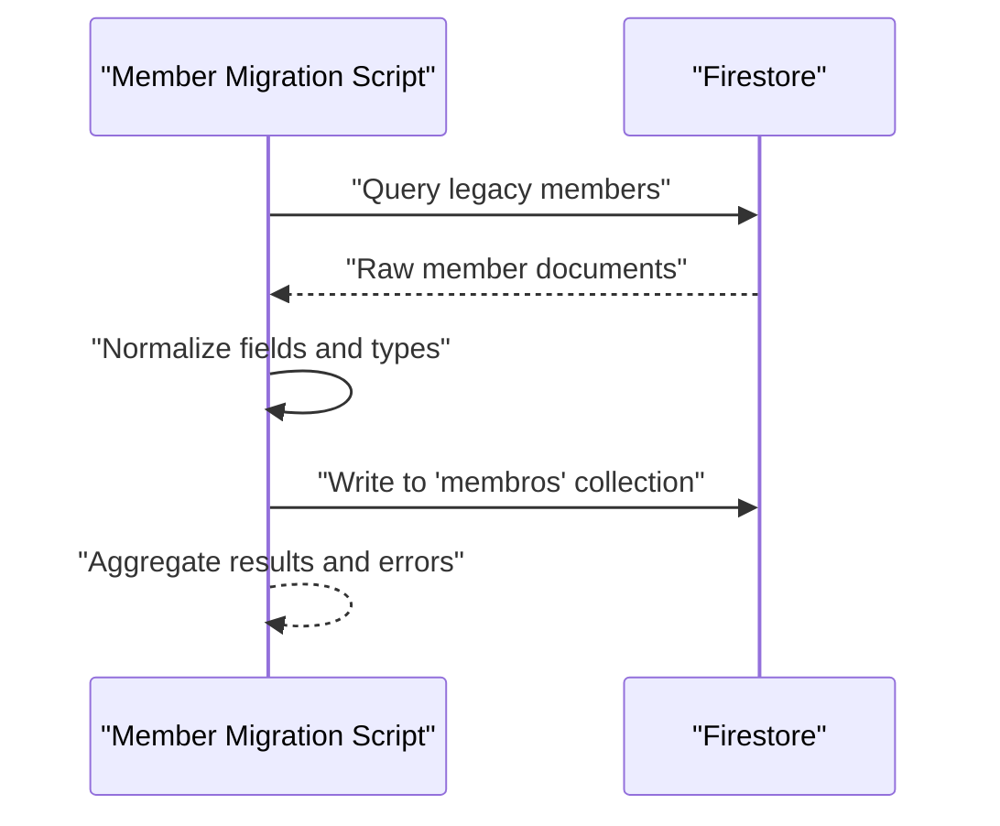
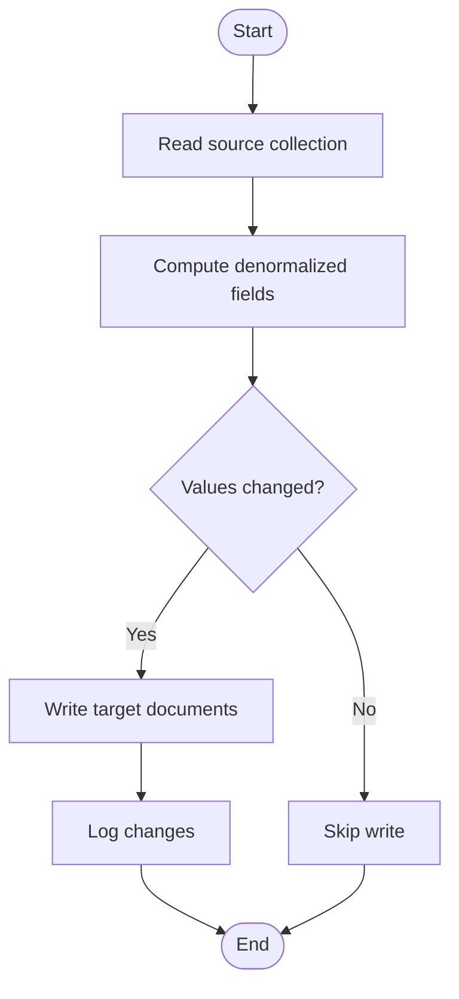
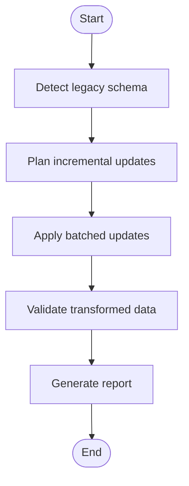
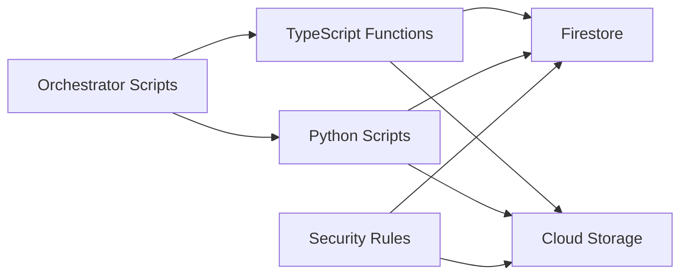

# Data Migration & Versioning

<cite>
**Referenced Files in This Document**
- [functions/src/migrateTenantFirestoreCollections.ts](file://functions/src/migrateTenantFirestoreCollections.ts)
- [functions/src/migrateStorageConsolidated.ts](file://functions/src/migrateStorageConsolidated.ts)
- [functions/scripts/migrate-members-to-membros.js](file://functions/scripts/migrate-members-to-membros.js)
- [functions/scripts/migrate-departamentos-leader-denorm.js](file://functions/scripts/migrate-departamentos-leader-denorm.js)
- [functions/scripts/migrate-escalas-escalados-denorm.js](file://functions/scripts/migrate-escalas-escalados-denorm.js)
- [functions/scripts/migrate-pedidos-oracao-orando-membros-denorm.js](file://functions/scripts/migrate-pedidos-oracao-orando-membros-denorm.js)
- [scripts/migrate_legacy_multi_tenant_data.py](file://scripts/migrate_legacy_multi_tenant_data.py)
- [scripts/migrate_legacy_storage.py](file://scripts/migrate_legacy_storage.py)
- [scripts/run_firestore_collection_migration.ps1](file://scripts/run_firestore_collection_migration.ps1)
- [scripts/run_migrate_storage_consolidado.ps1](file://scripts/run_migrate_storage_consolidado.ps1)
- [firebase.json](file://firebase.json)
- [firestore.rules](file://firestore.rules)
- [storage.rules](file://storage.rules)
</cite>

## Table of Contents
1. Introduction
2. Project Structure
3. Core Components
4. Architecture Overview
5. Detailed Component Analysis
6. Dependency Analysis
7. Performance Considerations
8. Troubleshooting Guide
9. Conclusion
10. Appendices

## Introduction
This document provides a comprehensive guide to Firestore schema evolution and data transformations within the project. It covers migration scripts, versioning strategies, backward compatibility, bulk operations, error handling, rollback procedures, testing strategies (including dry-run), production deployment considerations, and monitoring for large-scale data operations. The guidance is grounded in the actual migration implementations present in the repository’s Functions and scripts directories.

## Project Structure
The migration system spans multiple layers:
- Cloud Functions (TypeScript/JavaScript) implement server-side migrations and backfills.
- Standalone scripts (Python/PowerShell/Node) orchestrate bulk operations and legacy data transitions.
- Firebase configuration files define hosting, functions, and rules that influence migration behavior.
- Security rules ensure safe reads/writes during and after migrations.

**Diagram sources**
- [firebase.json](file://firebase.json)
- [firestore.rules](file://firestore.rules)
- [storage.rules](file://storage.rules)

**Section sources**
- [firebase.json](file://firebase.json)
- [firestore.rules](file://firestore.rules)
- [storage.rules](file://storage.rules)

## Core Components
Key migration components include:
- Tenant collection migration: normalizes tenant-scoped collections and paths.
- Storage consolidation: migrates media and attachments into a unified storage layout.
- Member data migration: transforms legacy member records into the canonical structure.
- Denormalization scripts: update denormalized fields across departments, schedules, and prayer requests.
- Legacy multi-tenant and storage migrations: bridge older schemas to current standards.

These components are implemented as:
- Serverless functions for idempotent, auditable transformations.
- CLI-driven scripts for batch processing and one-off operations.
- Orchestration scripts to sequence tasks and manage retries.

**Section sources**
- [functions/src/migrateTenantFirestoreCollections.ts](file://functions/src/migrateTenantFirestoreCollections.ts)
- [functions/src/migrateStorageConsolidated.ts](file://functions/src/migrateStorageConsolidated.ts)
- [functions/scripts/migrate-members-to-membros.js](file://functions/scripts/migrate-members-to-membros.js)
- [functions/scripts/migrate-departamentos-leader-denorm.js](file://functions/scripts/migrate-departamentos-leader-denorm.js)
- [functions/scripts/migrate-escalas-escalados-denorm.js](file://functions/scripts/migrate-escalas-escalados-denorm.js)
- [functions/scripts/migrate-pedidos-oracao-orando-membros-denorm.js](file://functions/scripts/migrate-pedidos-oracao-orando-membros-denorm.js)
- [scripts/migrate_legacy_multi_tenant_data.py](file://scripts/migrate_legacy_multi_tenant_data.py)
- [scripts/migrate_legacy_storage.py](file://scripts/migrate_legacy_storage.py)

## Architecture Overview
The migration architecture follows a clear separation of concerns:
- Orchestrators (PowerShell/Python/Node) invoke targeted functions or scripts.
- Functions perform idempotent transformations with robust error handling and logging.
- Firestore and Storage security rules enforce access control and prevent unintended writes.
- Monitoring and reporting are achieved via function logs and output artifacts.

[No sources needed since this diagram shows conceptual workflow, not actual code structure]

## Detailed Component Analysis

### Tenant Collection Migration
Purpose: Normalize tenant-scoped collections and paths to a consistent schema.

Key behaviors:
- Enumerates tenant identifiers and associated collections.
- Applies field renames, default values, and structural updates.
- Ensures idempotency by checking existing fields before writes.
- Logs progress and failures per tenant.

**Diagram sources**
- [functions/src/migrateTenantFirestoreCollections.ts](file://functions/src/migrateTenantFirestoreCollections.ts)

**Section sources**
- [functions/src/migrateTenantFirestoreCollections.ts](file://functions/src/migrateTenantFirestoreCollections.ts)

### Storage Consolidation Migration
Purpose: Migrate media and attachments into a consolidated storage layout.

Key behaviors:
- Scans legacy storage paths and maps to new structure.
- Moves or copies files while preserving metadata.
- Updates Firestore references to point to new storage locations.
- Supports dry-run to preview changes without modifying storage.

**Diagram sources**
- [functions/src/migrateStorageConsolidated.ts](file://functions/src/migrateStorageConsolidated.ts)

**Section sources**
- [functions/src/migrateStorageConsolidated.ts](file://functions/src/migrateStorageConsolidated.ts)

### Member Data Migration
Purpose: Transform legacy member records into the canonical “membros” structure.

Key behaviors:
- Reads legacy member entries and applies schema normalization.
- Handles missing fields with defaults or flags for review.
- Writes normalized documents under the target collection.
- Provides summary counts and error logs.

**Diagram sources**
- [functions/scripts/migrate-members-to-membros.js](file://functions/scripts/migrate-members-to-membros.js)

**Section sources**
- [functions/scripts/migrate-members-to-membros.js](file://functions/scripts/migrate-members-to-membros.js)

### Denormalization Scripts
Purpose: Maintain consistency of denormalized fields across related collections.

Examples:
- Department leader denormalization: ensures leader references are up to date.
- Schedules and assignees denormalization: keeps schedule participants aligned.
- Prayer requests denormalization: syncs request metadata with member profiles.

Common patterns:
- Batch reads of source documents.
- Compute derived fields deterministically.
- Conditional writes only when values change.
- Idempotent updates to avoid duplicate work.

**Diagram sources**
- [functions/scripts/migrate-departamentos-leader-denorm.js](file://functions/scripts/migrate-departamentos-leader-denorm.js)
- [functions/scripts/migrate-escalas-escalados-denorm.js](file://functions/scripts/migrate-escalas-escalados-denorm.js)
- [functions/scripts/migrate-pedidos-oracao-orando-membros-denorm.js](file://functions/scripts/migrate-pedidos-oracao-orando-membros-denorm.js)

**Section sources**
- [functions/scripts/migrate-departamentos-leader-denorm.js](file://functions/scripts/migrate-departamentos-leader-denorm.js)
- [functions/scripts/migrate-escalas-escalados-denorm.js](file://functions/scripts/migrate-escalas-escalados-denorm.js)
- [functions/scripts/migrate-pedidos-oracao-orando-membros-denorm.js](file://functions/scripts/migrate-pedidos-oracao-orando-membros-denorm.js)

### Legacy Multi-Tenant and Storage Migrations
Purpose: Bridge older multi-tenant and storage schemas to current standards.

Key behaviors:
- Detects legacy structures and applies incremental updates.
- Preserves historical data while introducing new fields.
- Supports selective runs for specific tenants or buckets.
- Emits detailed logs for auditability.

**Diagram sources**
- [scripts/migrate_legacy_multi_tenant_data.py](file://scripts/migrate_legacy_multi_tenant_data.py)
- [scripts/migrate_legacy_storage.py](file://scripts/migrate_legacy_storage.py)

**Section sources**
- [scripts/migrate_legacy_multi_tenant_data.py](file://scripts/migrate_legacy_multi_tenant_data.py)
- [scripts/migrate_legacy_storage.py](file://scripts/migrate_legacy_storage.py)

## Dependency Analysis
Migration components depend on:
- Firestore SDK for reading/writing documents.
- Cloud Storage SDK for file operations.
- Security rules to constrain access during migrations.
- Orchestration scripts to sequence tasks and handle retries.

**Diagram sources**
- [firebase.json](file://firebase.json)
- [firestore.rules](file://firestore.rules)
- [storage.rules](file://storage.rules)

**Section sources**
- [firebase.json](file://firebase.json)
- [firestore.rules](file://firestore.rules)
- [storage.rules](file://storage.rules)

## Performance Considerations
- Use batched writes to minimize Firestore write amplification.
- Implement idempotency checks to avoid redundant operations.
- Prefer conditional writes based on value comparison to reduce overwrites.
- Stage large storage moves in batches and verify integrity post-move.
- Monitor function execution time and memory usage; scale out where necessary.
- Leverage dry-run modes to estimate impact before committing changes.

[No sources needed since this section provides general guidance]

## Troubleshooting Guide
Common issues and resolutions:
- Permission errors: Ensure service accounts have appropriate Firestore and Storage permissions.
- Rate limiting: Implement retry logic with exponential backoff for API calls.
- Data validation failures: Add pre-write validation and log mismatches for manual review.
- Partial migrations: Use checkpoint markers to resume from last successful step.
- Rollback strategy: Maintain backups or snapshots before major migrations; revert by restoring from backup if needed.

Operational tips:
- Run migrations in staging environments first.
- Enable verbose logging and capture outputs for audit trails.
- Use separate service accounts for dry-run vs. live executions.

**Section sources**
- [functions/src/migrateTenantFirestoreCollections.ts](file://functions/src/migrateTenantFirestoreCollections.ts)
- [functions/src/migrateStorageConsolidated.ts](file://functions/src/migrateStorageConsolidated.ts)
- [functions/scripts/migrate-members-to-membros.js](file://functions/scripts/migrate-members-to-membros.js)
- [scripts/migrate_legacy_multi_tenant_data.py](file://scripts/migrate_legacy_multi_tenant_data.py)
- [scripts/migrate_legacy_storage.py](file://scripts/migrate_legacy_storage.py)

## Conclusion
The migration system combines serverless functions and standalone scripts to evolve Firestore schemas and restructure storage safely. By emphasizing idempotency, validation, and observability, it supports reliable, large-scale data transformations. Adhering to the outlined best practices ensures minimal risk during schema evolution and maintains backward compatibility for clients.

[No sources needed since this section summarizes without analyzing specific files]

## Appendices

### Migration Execution Examples
- Tenant collection migration:
  - Execute via PowerShell orchestrator to run the collection migration script.
  - Review logs for per-tenant outcomes and errors.
- Storage consolidation:
  - Run the storage migration script with dry-run to preview changes.
  - Switch to live mode after validating the plan.
- Member data migration:
  - Invoke the Node-based member migration script against legacy datasets.
  - Confirm normalized documents in the target collection.

**Section sources**
- [scripts/run_firestore_collection_migration.ps1](file://scripts/run_firestore_collection_migration.ps1)
- [scripts/run_migrate_storage_consolidado.ps1](file://scripts/run_migrate_storage_consolidado.ps1)
- [functions/scripts/migrate-members-to-membros.js](file://functions/scripts/migrate-members-to-membros.js)

### Versioning Strategies and Backward Compatibility
- Schema versioning:
  - Include explicit version fields in documents to track evolution.
  - Use feature flags to toggle new schema behaviors gradually.
- Backward compatibility:
  - Support both legacy and new fields during transition periods.
  - Deprecate old fields after confirming full adoption.
- Client upgrades:
  - Gradually roll out client versions that consume new schemas.
  - Provide fallbacks for missing fields until all clients upgrade.

[No sources needed since this section provides general guidance]

### Testing Strategies and Dry-Run Capabilities
- Unit tests:
  - Validate transformation logic with sample payloads.
- Integration tests:
  - Run migrations against isolated test databases.
- Dry-run:
  - Use dry-run modes to compute diffs without applying changes.
- Validation:
  - Post-migration audits to confirm data integrity and completeness.

[No sources needed since this section provides general guidance]

### Production Deployment Considerations
- Pre-deployment checklist:
  - Verify permissions, indexes, and rules.
  - Backup critical data before migrations.
- Staged rollout:
  - Deploy to staging, then production with controlled scope.
- Monitoring:
  - Track function metrics, error rates, and throughput.
- Rollback:
  - Prepare restore procedures using backups or snapshots.

[No sources needed since this section provides general guidance]

### Automated Migration Pipelines and Monitoring
- Pipeline automation:
  - Integrate migration steps into CI/CD pipelines.
  - Gate deployments on successful migration runs.
- Monitoring:
  - Centralize logs and metrics for visibility.
  - Alert on anomalies such as high failure rates or latency spikes.

[No sources needed since this section provides general guidance]