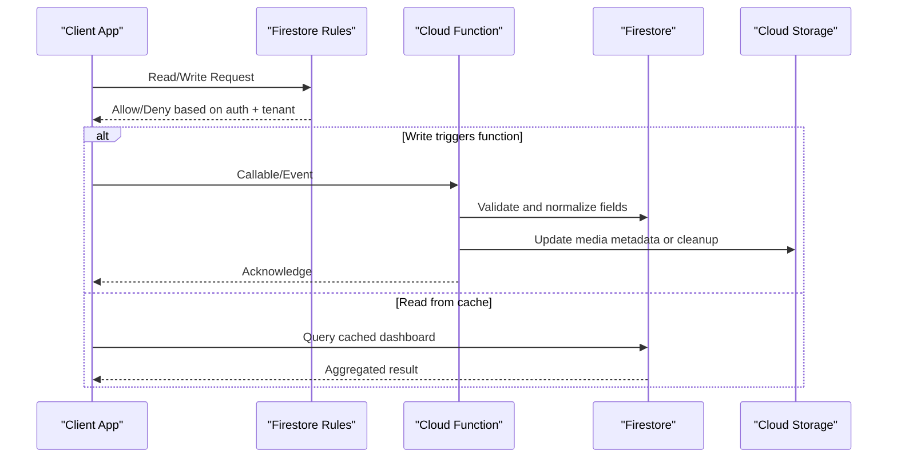
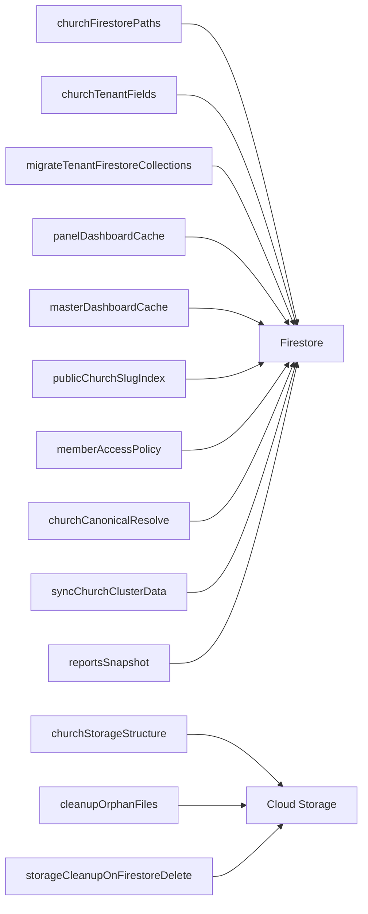

# Database Design & Schema

<cite>
**Referenced Files in This Document**
- [firestore.indexes.json](file://firestore.indexes.json)
- [firestore.rules](file://firestore.rules)
- [firebase.json](file://firebase.json)
- [functions/index.ts](file://functions/src/index.ts)
- [functions/src/churchFirestorePaths.ts](file://functions/src/churchFirestorePaths.ts)
- [functions/src/churchTenantFields.ts](file://functions/src/churchTenantFields.ts)
- [functions/src/migrateTenantFirestoreCollections.ts](file://functions/src/migrateTenantFirestoreCollections.ts)
- [functions/src/churchStorageStructure.ts](file://functions/src/churchStorageStructure.ts)
- [functions/src/cleanupOrphanFiles.ts](file://functions/src/cleanupOrphanFiles.ts)
- [functions/src/storageCleanupOnFirestoreDelete.ts](file://functions/src/storageCleanupOnFirestoreDelete.ts)
- [functions/src/panelDashboardCache.ts](file://functions/src/panelDashboardCache.ts)
- [functions/src/masterDashboardCache.ts](file://functions/src/masterDashboardCache.ts)
- [functions/src/publicChurchSlugIndex.ts](file://functions/src/publicChurchSlugIndex.ts)
- [functions/src/memberAccessPolicy.ts](file://functions/src/memberAccessPolicy.ts)
- [functions/src/churchCanonicalResolve.ts](file://functions/src/churchCanonicalResolve.ts)
- [functions/src/syncChurchClusterData.ts](file://functions/src/syncChurchClusterData.ts)
- [functions/src/reportsSnapshot.ts](file://functions/src/reportsSnapshot.ts)
- [scripts/firebase_indexes_gcp_publish.cjs](file://scripts/firebase_indexes_gcp_publish.cjs)
- [scripts/firestore_rules_patch_release.cjs](file://scripts/firestore_rules_patch_release.cjs)
- [security_rules_test_firestore/test/firestore.rules.test.js](file://security_rules_test_firestore/test/firestore.rules.test.js)
</cite>

## Table of Contents
1. Introduction
2. Project Structure
3. Core Components
4. Architecture Overview
5. Detailed Component Analysis
6. Dependency Analysis
7. Performance Considerations
8. Troubleshooting Guide
9. Conclusion
10. Appendices

## Introduction
This document provides a comprehensive database design and schema guide for the Gestão Yahweh Premium application, focusing on Google Cloud Firestore. It covers collection structures, document relationships, indexing strategies, validation rules, security policies, query optimization techniques, migration scripts, backup procedures, performance monitoring, data modeling patterns, complex queries, bulk operations, consistency and transaction handling, and scalability considerations for large datasets.

The application follows a multi-tenant architecture where each church (tenant) owns its data under isolated paths. Cloud Functions orchestrate data synchronization, caching, storage cleanup, and tenant provisioning. Security is enforced via Firestore Rules and server-side access policies. Indexing is centralized to optimize common read patterns across dashboards, directories, and public endpoints.

## Project Structure
At a high level, the database layer is defined by:
- Firestore indexes configuration
- Firestore security rules
- Firebase project configuration
- Cloud Functions that implement data flows, migrations, and maintenance tasks
- Scripts to publish indexes and patch rules
- Tests for security rules

```mermaid
graph TB
subgraph "App Layer"
Flutter["Flutter App"]
Web["Web Client"]
end
subgraph "Cloud Firestore"
Tenants["Tenants / Churches"]
Members["Members / Membros"]
Finance["Financeiro"]
Events["Events / Eventos"]
Chat["Chat / Mensagens"]
Media["Media Attachments"]
end
subgraph "Cloud Functions"
Paths["churchFirestorePaths"]
TenantFields["churchTenantFields"]
Migration["migrateTenantFirestoreCollections"]
StorageStruct["churchStorageStructure"]
Cleanup["cleanupOrphanFiles"]
StorageDel["storageCleanupOnFirestoreDelete"]
DashCache["panelDashboardCache"]
MasterDash["masterDashboardCache"]
PublicSlug["publicChurchSlugIndex"]
MemberPolicy["memberAccessPolicy"]
Canonical["churchCanonicalResolve"]
SyncCluster["syncChurchClusterData"]
Reports["reportsSnapshot"]
end
Flutter --> |reads/writes| Tenants
Web --> |reads/writes| Tenants
Tenants --> Members
Tenants --> Finance
Tenants --> Events
Tenants --> Chat
Tenants --> Media
Paths --> Tenants
TenantFields --> Tenants
Migration --> Tenants
StorageStruct --> Media
Cleanup --> Media
StorageDel --> Media
DashCache --> Tenants
MasterDash --> Tenants
PublicSlug --> Tenants
MemberPolicy --> Members
Canonical --> Tenants
SyncCluster --> Tenants
Reports --> Tenants
```

**Diagram sources**
- [firebase.json](file://firebase.json)
- [functions/src/churchFirestorePaths.ts](file://functions/src/churchFirestorePaths.ts)
- [functions/src/churchTenantFields.ts](file://functions/src/churchTenantFields.ts)
- [functions/src/migrateTenantFirestoreCollections.ts](file://functions/src/migrateTenantFirestoreCollections.ts)
- [functions/src/churchStorageStructure.ts](file://functions/src/churchStorageStructure.ts)
- [functions/src/cleanupOrphanFiles.ts](file://functions/src/cleanupOrphanFiles.ts)
- [functions/src/storageCleanupOnFirestoreDelete.ts](file://functions/src/storageCleanupOnFirestoreDelete.ts)
- [functions/src/panelDashboardCache.ts](file://functions/src/panelDashboardCache.ts)
- [functions/src/masterDashboardCache.ts](file://functions/src/masterDashboardCache.ts)
- [functions/src/publicChurchSlugIndex.ts](file://functions/src/publicChurchSlugIndex.ts)
- [functions/src/memberAccessPolicy.ts](file://functions/src/memberAccessPolicy.ts)
- [functions/src/churchCanonicalResolve.ts](file://functions/src/churchCanonicalResolve.ts)
- [functions/src/syncChurchClusterData.ts](file://functions/src/syncChurchClusterData.ts)
- [functions/src/reportsSnapshot.ts](file://functions/src/reportsSnapshot.ts)

**Section sources**
- [firebase.json](file://firebase.json)
- [functions/src/index.ts](file://functions/src/index.ts)

## Core Components
- Multi-tenant isolation: Each church has a canonical path and aliases; documents are scoped under church-specific roots.
- Collections:
  - churches: canonical metadata, aliases, settings
  - membros: member profiles, roles, authentication linkage
  - financeiro: accounts, transactions, recurring receipts
  - eventos: events, reminders, attendees
  - chat: threads, messages, attachments
  - media: references and metadata for attachments stored in Cloud Storage
- Caching and denormalization:
  - Dashboard caches for panel and master views
  - Public church slug index for fast lookups
- Storage integration:
  - Structured media folders per church
  - Orphan file cleanup and delete-triggered cleanup

Key responsibilities:
- Path resolution and tenant field normalization
- Data migration between collections and fields
- Storage structure enforcement and cleanup
- Access policy enforcement and member role checks
- Scheduled and event-driven syncs and reports

**Section sources**
- [functions/src/churchFirestorePaths.ts](file://functions/src/churchFirestorePaths.ts)
- [functions/src/churchTenantFields.ts](file://functions/src/churchTenantFields.ts)
- [functions/src/migrateTenantFirestoreCollections.ts](file://functions/src/migrateTenantFirestoreCollections.ts)
- [functions/src/churchStorageStructure.ts](file://functions/src/churchStorageStructure.ts)
- [functions/src/cleanupOrphanFiles.ts](file://functions/src/cleanupOrphanFiles.ts)
- [functions/src/storageCleanupOnFirestoreDelete.ts](file://functions/src/storageCleanupOnFirestoreDelete.ts)
- [functions/src/panelDashboardCache.ts](file://functions/src/panelDashboardCache.ts)
- [functions/src/masterDashboardCache.ts](file://functions/src/masterDashboardCache.ts)
- [functions/src/publicChurchSlugIndex.ts](file://functions/src/publicChurchSlugIndex.ts)
- [functions/src/memberAccessPolicy.ts](file://functions/src/memberAccessPolicy.ts)
- [functions/src/churchCanonicalResolve.ts](file://functions/src/churchCanonicalResolve.ts)
- [functions/src/syncChurchClusterData.ts](file://functions/src/syncChurchClusterData.ts)
- [functions/src/reportsSnapshot.ts](file://functions/src/reportsSnapshot.ts)

## Architecture Overview
The database architecture emphasizes:
- Strong isolation per tenant with canonical paths and alias resolution
- Denormalized caches for read-heavy surfaces (dashboards, public site)
- Event-driven storage lifecycle management
- Centralized indexing strategy for performance-critical queries
- Server-side policy enforcement through functions and rules

**Diagram sources**
- [firestore.rules](file://firestore.rules)
- [functions/src/memberAccessPolicy.ts](file://functions/src/memberAccessPolicy.ts)
- [functions/src/panelDashboardCache.ts](file://functions/src/panelDashboardCache.ts)
- [functions/src/churchStorageStructure.ts](file://functions/src/churchStorageStructure.ts)
- [functions/src/cleanupOrphanFiles.ts](file://functions/src/cleanupOrphanFiles.ts)

## Detailed Component Analysis

### Firestore Schema Design
- Tenants (churches):
  - Fields include canonical identifiers, display names, settings, and status flags
  - Aliases map alternate slugs to canonical IDs for flexible URLs
- Members (membros):
  - Profile fields, roles, permissions, and linked authentication UIDs
  - Membership lifecycle states and last activity timestamps
- Financeiro:
  - Accounts, transactions, categories, recurring receipts, and reconciliation flags
  - Date-based partitioning for efficient time-range queries
- Eventos:
  - Event metadata, scheduling, reminders, and attendee lists
  - Status transitions and notification hooks
- Chat:
  - Threads grouped by context (e.g., church-wide, department, DM)
  - Messages with timestamps, sender info, and attachment references
- Media:
  - Metadata entries referencing Cloud Storage paths, thumbnails, and processing state

Relationships:
- churches -> membros (one-to-many)
- churches -> financeiro (one-to-many)
- churches -> eventos (one-to-many)
- churches -> chat (one-to-many)
- membros -> chat messages (many-to-one via senderId)
- entities -> media (references to storage paths)

Complexity analysis:
- Reads optimized via composite indexes and cached aggregates
- Writes use batched operations and idempotent upserts
- Time-series data leverages range queries with indexed date fields

**Section sources**
- [functions/src/churchFirestorePaths.ts](file://functions/src/churchFirestorePaths.ts)
- [functions/src/churchTenantFields.ts](file://functions/src/churchTenantFields.ts)
- [functions/src/publicChurchSlugIndex.ts](file://functions/src/publicChurchSlugIndex.ts)
- [functions/src/memberAccessPolicy.ts](file://functions/src/memberAccessPolicy.ts)

### Indexing Strategy
- Composite indexes for:
  - church-scoped queries (e.g., members by role and status)
  - finance time-range filters (date ranges with account/category)
  - event discovery (date, status, category)
  - chat thread listing (threadId, timestamp)
- Single-field indexes for:
  - church slug lookup (publicChurchSlugIndex)
  - member UID resolution
- Index publishing automation via scripts to ensure environment parity

Optimization techniques:
- Use limit and orderBy to avoid full scans
- Prefer equality filters on indexed fields
- Denormalize frequently accessed attributes into cached documents

**Section sources**
- [firestore.indexes.json](file://firestore.indexes.json)
- [scripts/firebase_indexes_gcp_publish.cjs](file://scripts/firebase_indexes_gcp_publish.cjs)
- [functions/src/publicChurchSlugIndex.ts](file://functions/src/publicChurchSlugIndex.ts)

### Security Policies and Validation
- Firestore Rules enforce:
  - Authenticated user must belong to the target church
  - Role-based access control for sensitive operations
  - Field-level validation for required attributes
- Server-side validation:
  - Church path resolution ensures canonical scoping
  - Member access policy validates roles and permissions
  - Tenant field normalization prevents schema drift

Validation patterns:
- Required fields checked at write time
- Enumerated values constrained to allowed sets
- Cross-document consistency enforced via transactions or batched writes

**Section sources**
- [firestore.rules](file://firestore.rules)
- [functions/src/memberAccessPolicy.ts](file://functions/src/memberAccessPolicy.ts)
- [functions/src/churchCanonicalResolve.ts](file://functions/src/churchCanonicalResolve.ts)
- [security_rules_test_firestore/test/firestore.rules.test.js](file://security_rules_test_firestore/test/firestore.rules.test.js)

### Data Modeling Patterns
- Multi-tenant isolation:
  - All reads/writes scoped under churchId
  - Alias resolution for flexible external references
- Denormalization:
  - Dashboard caches aggregate counts and summaries
  - Public site uses precomputed slug index
- Event-driven updates:
  - On create/update, trigger downstream syncs and caches
  - On delete, cascade cleanup to storage and related indices

Patterns illustrated:
- Leaderboard-style counters mirrored in dedicated documents
- Materialized views for expensive aggregations
- Reference-only links to reduce duplication

**Section sources**
- [functions/src/panelDashboardCache.ts](file://functions/src/panelDashboardCache.ts)
- [functions/src/masterDashboardCache.ts](file://functions/src/masterDashboardCache.ts)
- [functions/src/syncChurchClusterData.ts](file://functions/src/syncChurchClusterData.ts)

### Complex Queries and Bulk Operations
- Complex queries:
  - Range filters on dates combined with equality filters on churchId and category
  - Paginated listings using cursor-based pagination
  - Full-text search offloaded to external services when needed
- Bulk operations:
  - Batched writes for migrations and backfills
  - Idempotent upserts to handle retries safely
  - Scheduled jobs for periodic aggregation and cleanup

Examples:
- Fetch recent transactions for an account within a date range
- List active events for a church with pagination
- Aggregate member counts by role and status

**Section sources**
- [functions/src/reportsSnapshot.ts](file://functions/src/reportsSnapshot.ts)
- [functions/src/migrateTenantFirestoreCollections.ts](file://functions/src/migrateTenantFirestoreCollections.ts)

### Data Consistency and Transactions
- Transactional writes:
  - Ensure atomic updates across related documents
  - Handle conflicts with retry logic
- Eventual consistency:
  - Cache invalidation and rebuild strategies
  - Background sync jobs to reconcile discrepancies

Best practices:
- Keep transactions small and focused
- Use optimistic concurrency controls where applicable
- Monitor transaction failure rates and adjust batching

**Section sources**
- [functions/src/syncChurchClusterData.ts](file://functions/src/syncChurchClusterData.ts)
- [functions/src/migrateTenantFirestoreCollections.ts](file://functions/src/migrateTenantFirestoreCollections.ts)

### Scalability Considerations
- Partitioning:
  - Shard large collections by churchId and date
  - Use hierarchical paths to limit document sizes
- Caching:
  - Precompute aggregates for dashboards and public endpoints
  - Invalidate caches on relevant writes
- Monitoring:
  - Track read/write costs and latency
  - Alert on hotspots and slow queries

Scalability levers:
- Increase index coverage for frequent queries
- Offload heavy computations to background functions
- Use streaming reads for large datasets

**Section sources**
- [functions/src/panelDashboardCache.ts](file://functions/src/panelDashboardCache.ts)
- [functions/src/masterDashboardCache.ts](file://functions/src/masterDashboardCache.ts)
- [functions/src/publicChurchSlugIndex.ts](file://functions/src/publicChurchSlugIndex.ts)

## Dependency Analysis
Cloud Functions depend on Firestore and Cloud Storage to implement data flows. The following diagram shows key dependencies among core modules:

**Diagram sources**
- [functions/src/churchFirestorePaths.ts](file://functions/src/churchFirestorePaths.ts)
- [functions/src/churchTenantFields.ts](file://functions/src/churchTenantFields.ts)
- [functions/src/migrateTenantFirestoreCollections.ts](file://functions/src/migrateTenantFirestoreCollections.ts)
- [functions/src/churchStorageStructure.ts](file://functions/src/churchStorageStructure.ts)
- [functions/src/cleanupOrphanFiles.ts](file://functions/src/cleanupOrphanFiles.ts)
- [functions/src/storageCleanupOnFirestoreDelete.ts](file://functions/src/storageCleanupOnFirestoreDelete.ts)
- [functions/src/panelDashboardCache.ts](file://functions/src/panelDashboardCache.ts)
- [functions/src/masterDashboardCache.ts](file://functions/src/masterDashboardCache.ts)
- [functions/src/publicChurchSlugIndex.ts](file://functions/src/publicChurchSlugIndex.ts)
- [functions/src/memberAccessPolicy.ts](file://functions/src/memberAccessPolicy.ts)
- [functions/src/churchCanonicalResolve.ts](file://functions/src/churchCanonicalResolve.ts)
- [functions/src/syncChurchClusterData.ts](file://functions/src/syncChurchClusterData.ts)
- [functions/src/reportsSnapshot.ts](file://functions/src/reportsSnapshot.ts)

**Section sources**
- [functions/src/index.ts](file://functions/src/index.ts)

## Performance Considerations
- Index coverage:
  - Ensure composite indexes match query patterns
  - Avoid wildcard queries that bypass indexes
- Query design:
  - Use equality filters first, then range filters
  - Limit result sets with pagination
- Caching:
  - Maintain dashboard caches updated via event-driven functions
  - Invalidate caches on mutations affecting aggregated data
- Storage:
  - Normalize media metadata to minimize document size
  - Clean up orphan files regularly to reduce storage costs

Monitoring:
- Track Firestore read/write costs and latency metrics
- Set alerts for high-cost queries and hot documents

[No sources needed since this section provides general guidance]

## Troubleshooting Guide
Common issues and resolutions:
- Permission denied errors:
  - Verify user belongs to the target church
  - Check role-based access policies
- Slow queries:
  - Review composite indexes and query structure
  - Add missing indexes or refactor queries
- Orphan files:
  - Run cleanup functions to remove unused media
  - Ensure delete triggers propagate to storage

Operational steps:
- Publish updated indexes using the provided script
- Patch Firestore rules if schema changes require new validations
- Test rules locally before deploying to production

**Section sources**
- [scripts/firebase_indexes_gcp_publish.cjs](file://scripts/firebase_indexes_gcp_publish.cjs)
- [scripts/firestore_rules_patch_release.cjs](file://scripts/firestore_rules_patch_release.cjs)
- [functions/src/cleanupOrphanFiles.ts](file://functions/src/cleanupOrphanFiles.ts)
- [functions/src/storageCleanupOnFirestoreDelete.ts](file://functions/src/storageCleanupOnFirestoreDelete.ts)
- [security_rules_test_firestore/test/firestore.rules.test.js](file://security_rules_test_firestore/test/firestore.rules.test.js)

## Conclusion
The Gestão Yahweh Premium database design centers on multi-tenant isolation, robust indexing, and event-driven synchronization. By combining Firestore Rules, Cloud Functions, and strategic caching, the system achieves strong security, predictable performance, and scalable growth. Adhering to the outlined patterns and operational procedures ensures reliable data management and smooth evolution of the application’s data model.

[No sources needed since this section summarizes without analyzing specific files]

## Appendices

### Backup Procedures
- Automated snapshots:
  - Schedule regular backups of critical collections
  - Store backups in secure, versioned storage
- Restore workflows:
  - Validate integrity before restoring
  - Perform dry runs in staging environments

[No sources needed since this section provides general guidance]

### Migration Scripts
- Collection migrations:
  - Use idempotent scripts to transform schemas
  - Backfill derived fields and indices
- Storage migrations:
  - Consolidate media paths and update metadata
  - Clean up legacy artifacts

**Section sources**
- [functions/src/migrateTenantFirestoreCollections.ts](file://functions/src/migrateTenantFirestoreCollections.ts)
- [functions/src/churchStorageStructure.ts](file://functions/src/churchStorageStructure.ts)

### Performance Monitoring
- Metrics to track:
  - Firestore read/write costs
  - Query latency percentiles
  - Function invocation durations
- Alerts:
  - High-cost queries exceeding thresholds
  - Elevated error rates in critical paths

[No sources needed since this section provides general guidance]