# Firestore Schema & Collections

<cite>
**Referenced Files in This Document**
- [firestore.rules](file://firestore.rules)
- [firestore.indexes.json](file://firestore.indexes.json)
- [firebase.json](file://firebase.json)
- [functions/index.js](file://functions/index.js)
- [functions/src/churchFirestorePaths.ts](file://functions/src/churchFirestorePaths.ts)
- [functions/src/churchTenantFields.ts](file://functions/src/churchTenantFields.ts)
- [functions/src/churchStorageStructure.ts](file://functions/src/churchStorageStructure.ts)
- [functions/src/migrateTenantFirestoreCollections.ts](file://functions/src/migrateTenantFirestoreCollections.ts)
- [functions/src/panelFinanceSummary.ts](file://functions/src/panelFinanceSummary.ts)
- [functions/src/panelFinanceAccountsCache.ts](file://functions/src/panelFinanceAccountsCache.ts)
- [functions/src/financeVencimentoReminders.ts](file://functions/src/financeVencimentoReminders.ts)
- [functions/src/memberAccessPolicy.ts](file://functions/src/memberAccessPolicy.ts)
- [functions/src/memberCodigo.ts](file://functions/src/memberCodigo.ts)
- [functions/src/membersDirectoryCache.ts](file://functions/src/membersDirectoryCache.ts)
- [functions/src/churchChatAdminPurge.ts](file://functions/src/churchChatAdminPurge.ts)
- [functions/src/churchChatDmThreadNormalize.ts](file://functions/src/churchChatDmThreadNormalize.ts)
- [functions/src/churchChatNotify.ts](file://functions/src/churchChatNotify.ts)
- [functions/src/churchChatPeerProfileSync.ts](file://functions/src/churchChatPeerProfileSync.ts)
- [functions/src/churchChatRetention.ts](file://functions/src/churchChatRetention.ts)
- [functions/src/gyMediaAttachments.ts](file://functions/src/gyMediaAttachments.ts)
- [functions/src/storageDisplayUrls.ts](file://functions/src/storageDisplayUrls.ts)
- [functions/src/cleanupOrphanFiles.ts](file://functions/src/cleanupOrphanFiles.ts)
- [functions/src/processChurchStorageMedia.ts](file://functions/src/processChurchStorageMedia.ts)
- [functions/src/syncChurchClusterData.ts](file://functions/src/syncChurchClusterData.ts)
- [functions/src/churchRootCountersMirror.ts](file://functions/src/churchRootCountersMirror.ts)
- [functions/src/publicChurchSlugIndex.ts](file://functions/src/publicChurchSlugIndex.ts)
- [functions/src/masterChurchesListCache.ts](file://functions/src/masterChurchesListCache.ts)
- [functions/src/panelDashboardCache.ts](file://functions/src/panelDashboardCache.ts)
- [functions/src/panelPublicSiteCache.ts](file://functions/src/panelPublicSiteCache.ts)
- [functions/src/panelStatisticsCache.ts](file://functions/src/panelStatisticsCache.ts)
- [functions/src/pushNovoConteudo.ts](file://functions/src/pushNovoConteudo.ts)
- [functions/src/eventoReminders.ts](file://functions/src/eventoReminders.ts)
- [functions/src/fornecedorAgendaReminders.ts](file://functions/src/fornecedorAgendaReminders.ts)
- [functions/src/receitasRecorrentesScheduled.ts](file://functions/src/receitasRecorrentesScheduled.ts)
- [functions/src/consolidateBpcCluster.ts](file://functions/src/consolidateBpcCluster.ts)
- [functions/src/syncChurchMercadoPagoCluster.ts](file://functions/src/syncChurchMercadoPagoCluster.ts)
- [functions/src/churchCanonicalResolve.ts](file://functions/src/churchCanonicalResolve.ts)
- [functions/src/churchTenantConsolidation.ts](file://functions/src/churchTenantConsolidation.ts)
- [functions/src/churchTenantProvisioning.ts](file://functions/src/churchTenantProvisioning.ts)
- [functions/src/churchWelcomeSeed.ts](file://functions/src/churchWelcomeSeed.ts)
- [functions/src/churchPerformancePack.ts](file://functions/src/churchPerformancePack.ts)
- [functions/src/churchPdfGeneration.ts](file://functions/src/churchPdfGeneration.ts)
- [functions/src/churchMercadoPago.ts](file://functions/src/churchMercadoPago.ts)
- [functions/src/membroSessionSync.ts](file://functions/src/membroSessionSync.ts)
- [functions/src/memberNotificationEmail.ts](file://functions/src/memberRegistrationNotify.ts)
- [functions/src/memberNotificationEmail.ts](file://functions/src/memberNotificationEmail.ts)
- [functions/src/publicSignupEmail.ts](file://functions/src/publicSignupEmail.ts)
- [functions/src/notificationBranding.ts](file://functions/src/notificationBranding.ts)
- [functions/src/tenantCallableResolve.ts](file://functions/src/tenantCallableResolve.ts)
- [functions/src/adminDb.ts](file://functions/src/adminDb.ts)
- [functions/src/carteirinhaValidarPublic.ts](file://functions/src/carteirinhaValidarPublic.ts)
- [functions/src/certificadosLote.ts](file://functions/src/certificadosLote.ts)
- [functions/src/processarCertificadosLote.ts](file://functions/src/processarCertificadosLote.ts)
- [functions/src/forbiddenTestChurchIds.ts](file://functions/src/forbiddenTestChurchIds.ts)
- [functions/src/purgeAnonymousAuthUsers.ts](file://functions/src/purgeAnonymousAuthUsers.ts)
- [functions/src/storageCleanupOnFirestoreDelete.ts](file://functions/src/storageCleanupOnFirestoreDelete.ts)
- [functions/src/migrateStorageConsolidated.ts](file://functions/src/migrateStorageConsolidated.ts)
</cite>

## Table of Contents
1. [Introduction](#introduction)
2. [Project Structure](#project-structure)
3. [Core Components](#core-components)
4. [Architecture Overview](#architecture-overview)
5. [Detailed Component Analysis](#detailed-component-analysis)
6. [Dependency Analysis](#dependency-analysis)
7. [Performance Considerations](#performance-considerations)
8. [Troubleshooting Guide](#troubleshooting-guide)
9. [Conclusion](#conclusion)
10. [Appendices](#appendices)

## Introduction
This document provides a comprehensive Firestore schema and collections reference for the Gestão Yahweh Premium application. It explains the multi-tenant architecture centered on church-specific namespaces, member management schemas, financial transaction models, chat message structures, and media metadata organization. It also documents field definitions, data types, validation rules, business constraints, collection hierarchies, subcollection patterns, cross-references between entities, example document structures, and common query patterns.

The schema is enforced by Firestore Rules, shaped by Cloud Functions, and optimized with indexes and caching strategies. The multi-tenant model isolates each church’s data under a dedicated tenant path, while shared platform-level data resides at the root level.

## Project Structure
At a high level:
- Firestore Rules define access control and validation across all collections.
- Cloud Functions implement business logic, data normalization, indexing, and background tasks.
- Indexes are declared to support efficient queries across tenant-scoped collections.
- Storage paths follow a consistent structure per church for media assets.

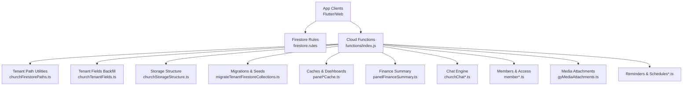

**Diagram sources**
- [functions/index.js](file://functions/index.js)
- [functions/src/churchFirestorePaths.ts](file://functions/src/churchFirestorePaths.ts)
- [functions/src/churchTenantFields.ts](file://functions/src/churchTenantFields.ts)
- [functions/src/churchStorageStructure.ts](file://functions/src/churchStorageStructure.ts)
- [functions/src/migrateTenantFirestoreCollections.ts](file://functions/src/migrateTenantFirestoreCollections.ts)
- [functions/src/panelFinanceSummary.ts](file://functions/src/panelFinanceSummary.ts)
- [functions/src/panelDashboardCache.ts](file://functions/src/panelDashboardCache.ts)
- [functions/src/panelPublicSiteCache.ts](file://functions/src/panelPublicSiteCache.ts)
- [functions/src/panelStatisticsCache.ts](file://functions/src/panelStatisticsCache.ts)
- [functions/src/panelFinanceAccountsCache.ts](file://functions/src/panelFinanceAccountsCache.ts)
- [functions/src/churchChatAdminPurge.ts](file://functions/src/churchChatAdminPurge.ts)
- [functions/src/churchChatDmThreadNormalize.ts](file://functions/src/churchChatDmThreadNormalize.ts)
- [functions/src/churchChatNotify.ts](file://functions/src/churchChatNotify.ts)
- [functions/src/churchChatPeerProfileSync.ts](file://functions/src/churchChatPeerProfileSync.ts)
- [functions/src/churchChatRetention.ts](file://functions/src/churchChatRetention.ts)
- [functions/src/gyMediaAttachments.ts](file://functions/src/gyMediaAttachments.ts)
- [functions/src/financeVencimentoReminders.ts](file://functions/src/financeVencimentoReminders.ts)
- [functions/src/eventoReminders.ts](file://functions/src/eventoReminders.ts)
- [functions/src/fornecedorAgendaReminders.ts](file://functions/src/fornecedorAgendaReminders.ts)
- [functions/src/receitasRecorrentesScheduled.ts](file://functions/src/receitasRecorrentesScheduled.ts)

**Section sources**
- [firestore.rules](file://firestore.rules)
- [firebase.json](file://firebase.json)
- [functions/index.js](file://functions/index.js)

## Core Components
- Multi-tenant isolation: Each church has a canonical identifier used to scope all data under a tenant path. Utility functions resolve and validate these paths consistently.
- Member management: Members are scoped to churches, with roles, permissions, and optional authentication linkage. Directory caches optimize listing performance.
- Financial transactions: Income, expenses, accounts, and summaries are modeled with scheduled reminders and reconciliation helpers.
- Chat engine: DMs, threads, peer profiles, notifications, retention policies, and admin purges are implemented via targeted functions.
- Media metadata: Attachments and storage paths are normalized; display URLs are generated; orphan cleanup ensures consistency.
- Caching and dashboards: Read-heavy surfaces (dashboard, statistics, public site, finance accounts) use cached documents for fast reads.

Key responsibilities:
- Validation and enforcement through Firestore Rules.
- Data normalization and backfills via Cloud Functions.
- Query optimization using indexes and cache documents.
- Background jobs for reminders, retention, and synchronization.

**Section sources**
- [functions/src/churchFirestorePaths.ts](file://functions/src/churchFirestorePaths.ts)
- [functions/src/churchTenantFields.ts](file://functions/src/churchTenantFields.ts)
- [functions/src/churchStorageStructure.ts](file://functions/src/churchStorageStructure.ts)
- [functions/src/migrateTenantFirestoreCollections.ts](file://functions/src/migrateTenantFirestoreCollections.ts)
- [functions/src/panelFinanceSummary.ts](file://functions/src/panelFinanceSummary.ts)
- [functions/src/panelFinanceAccountsCache.ts](file://functions/src/panelFinanceAccountsCache.ts)
- [functions/src/financeVencimentoReminders.ts](file://functions/src/financeVencimentoReminders.ts)
- [functions/src/memberAccessPolicy.ts](file://functions/src/memberAccessPolicy.ts)
- [functions/src/memberCodigo.ts](file://functions/src/memberCodigo.ts)
- [functions/src/membersDirectoryCache.ts](file://functions/src/membersDirectoryCache.ts)
- [functions/src/churchChatAdminPurge.ts](file://functions/src/churchChatAdminPurge.ts)
- [functions/src/churchChatDmThreadNormalize.ts](file://functions/src/churchChatDmThreadNormalize.ts)
- [functions/src/churchChatNotify.ts](file://functions/src/churchChatNotify.ts)
- [functions/src/churchChatPeerProfileSync.ts](file://functions/src/churchChatPeerProfileSync.ts)
- [functions/src/churchChatRetention.ts](file://functions/src/churchChatRetention.ts)
- [functions/src/gyMediaAttachments.ts](file://functions/src/gyMediaAttachments.ts)
- [functions/src/storageDisplayUrls.ts](file://functions/src/storageDisplayUrls.ts)
- [functions/src/cleanupOrphanFiles.ts](file://functions/src/cleanupOrphanFiles.ts)
- [functions/src/processChurchStorageMedia.ts](file://functions/src/processChurchStorageMedia.ts)

## Architecture Overview
The system follows a multi-tenant pattern where each church’s data is isolated under a tenant namespace. Shared platform-level data exists at the root. Cloud Functions enforce business rules, normalize data, and maintain caches and indexes. Firestore Rules provide fine-grained access control based on tenant context and user roles.

```mermaid
graph TB
subgraph "Platform Level"
P1["master_churches"]
P2["platform_settings"]
P3["global_indexes"]
end
subgraph "Church Tenant: {churchId}"
T1["members"]
T2["finance_accounts"]
T3["finance_transactions"]
T4["chat_rooms"]
T5["chat_messages"]
T6["media_attachments"]
T7["dashboards"]
T8["public_site"]
end
subgraph "Cloud Functions"
F1["churchFirestorePaths.ts"]
F2["migrateTenantFirestoreCollections.ts"]
F3["panelFinanceSummary.ts"]
F4["membersDirectoryCache.ts"]
F5["churchChat*.ts"]
F6["gyMediaAttachments.ts"]
F7["storageDisplayUrls.ts"]
end
subgraph "Rules & Indexes"
R1["firestore.rules"]
I1["firestore.indexes.json"]
end
P1 --> T1
P1 --> T2
P1 --> T3
P1 --> T4
P1 --> T5
P1 --> T6
P1 --> T7
P1 --> T8
F1 --> T1
F2 --> T1
F3 --> T2
F3 --> T3
F4 --> T1
F5 --> T4
F5 --> T5
F6 --> T6
F7 --> T6
R1 -. enforces .-> T1
R1 -. enforces .-> T2
R1 -. enforces .-> T3
R1 -. enforces .-> T4
R1 -. enforces .-> T5
R1 -. enforces .-> T6
I1 -. supports .-> T1
I1 -. supports .-> T2
I1 -. supports .-> T3
I1 -. supports .-> T4
I1 -. supports .-> T5
I1 -. supports .-> T6
```

**Diagram sources**
- [functions/src/churchFirestorePaths.ts](file://functions/src/churchFirestorePaths.ts)
- [functions/src/migrateTenantFirestoreCollections.ts](file://functions/src/migrateTenantFirestoreCollections.ts)
- [functions/src/panelFinanceSummary.ts](file://functions/src/panelFinanceSummary.ts)
- [functions/src/membersDirectoryCache.ts](file://functions/src/membersDirectoryCache.ts)
- [functions/src/churchChatAdminPurge.ts](file://functions/src/churchChatAdminPurge.ts)
- [functions/src/churchChatDmThreadNormalize.ts](file://functions/src/churchChatDmThreadNormalize.ts)
- [functions/src/churchChatNotify.ts](file://functions/src/churchChatNotify.ts)
- [functions/src/churchChatPeerProfileSync.ts](file://functions/src/churchChatPeerProfileSync.ts)
- [functions/src/churchChatRetention.ts](file://functions/src/churchChatRetention.ts)
- [functions/src/gyMediaAttachments.ts](file://functions/src/gyMediaAttachments.ts)
- [functions/src/storageDisplayUrls.ts](file://functions/src/storageDisplayUrls.ts)
- [firestore.rules](file://firestore.rules)
- [firestore.indexes.json](file://firestore.indexes.json)

## Detailed Component Analysis

### Multi-Tenant Architecture and Church Scoping
- Canonical church identifiers are resolved and validated to ensure consistent scoping.
- Tenant provisioning and consolidation manage lifecycle events for new or merged churches.
- Root counters mirror aggregate metrics per church for quick dashboard reads.

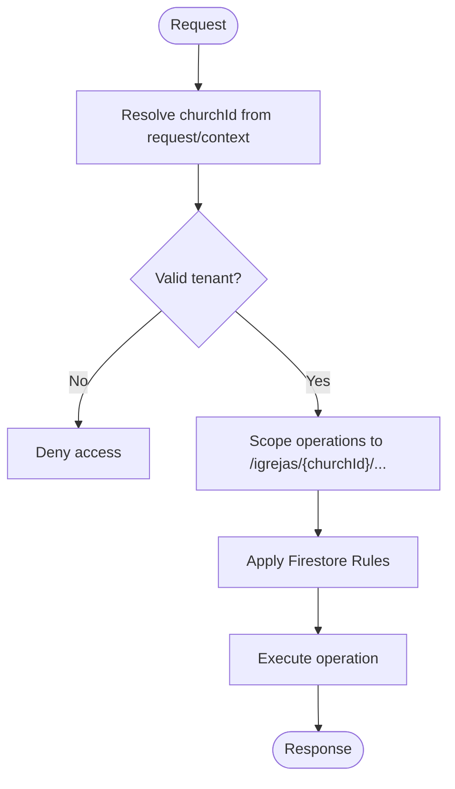

**Diagram sources**
- [functions/src/churchFirestorePaths.ts](file://functions/src/churchFirestorePaths.ts)
- [functions/src/churchTenantProvisioning.ts](file://functions/src/churchTenantProvisioning.ts)
- [functions/src/churchTenantConsolidation.ts](file://functions/src/churchTenantConsolidation.ts)
- [functions/src/churchRootCountersMirror.ts](file://functions/src/churchRootCountersMirror.ts)
- [firestore.rules](file://firestore.rules)

**Section sources**
- [functions/src/churchFirestorePaths.ts](file://functions/src/churchFirestorePaths.ts)
- [functions/src/churchTenantProvisioning.ts](file://functions/src/churchTenantProvisioning.ts)
- [functions/src/churchTenantConsolidation.ts](file://functions/src/churchTenantConsolidation.ts)
- [functions/src/churchRootCountersMirror.ts](file://functions/src/churchRootCountersMirror.ts)

### Member Management Schema
- Members are stored under the church tenant with fields for identification, contact info, role, status, and optional auth linkage.
- Access policies enforce read/write permissions based on roles and membership.
- Directory caches optimize listing and search queries.
- Member codes and notification emails are managed via dedicated functions.

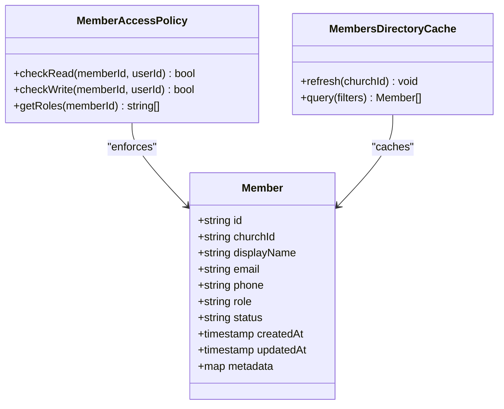

**Diagram sources**
- [functions/src/memberAccessPolicy.ts](file://functions/src/memberAccessPolicy.ts)
- [functions/src/membersDirectoryCache.ts](file://functions/src/membersDirectoryCache.ts)
- [functions/src/memberCodigo.ts](file://functions/src/memberCodigo.ts)
- [functions/src/memberNotificationEmail.ts](file://functions/src/memberNotificationEmail.ts)
- [functions/src/memberRegistrationNotify.ts](file://functions/src/memberRegistrationNotify.ts)

**Section sources**
- [functions/src/memberAccessPolicy.ts](file://functions/src/memberAccessPolicy.ts)
- [functions/src/membersDirectoryCache.ts](file://functions/src/membersDirectoryCache.ts)
- [functions/src/memberCodigo.ts](file://functions/src/memberCodigo.ts)
- [functions/src/memberNotificationEmail.ts](file://functions/src/memberNotificationEmail.ts)
- [functions/src/memberRegistrationNotify.ts](file://functions/src/memberRegistrationNotify.ts)

### Financial Transaction Models
- Accounts represent bank accounts, cash, and other financial buckets.
- Transactions record income/expenses with categories, references, and timestamps.
- Summaries and account caches provide fast read access for dashboards.
- Scheduled reminders handle due dates and recurring revenues.

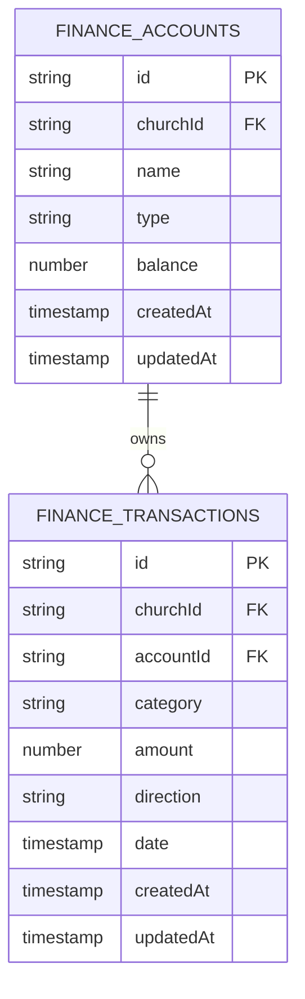

**Diagram sources**
- [functions/src/panelFinanceSummary.ts](file://functions/src/panelFinanceSummary.ts)
- [functions/src/panelFinanceAccountsCache.ts](file://functions/src/panelFinanceAccountsCache.ts)
- [functions/src/financeVencimentoReminders.ts](file://functions/src/financeVencimentoReminders.ts)
- [functions/src/receitasRecorrentesScheduled.ts](file://functions/src/receitasRecorrentesScheduled.ts)

**Section sources**
- [functions/src/panelFinanceSummary.ts](file://functions/src/panelFinanceSummary.ts)
- [functions/src/panelFinanceAccountsCache.ts](file://functions/src/panelFinanceAccountsCache.ts)
- [functions/src/financeVencimentoReminders.ts](file://functions/src/financeVencimentoReminders.ts)
- [functions/src/receitasRecorrentesScheduled.ts](file://functions/src/receitasRecorrentesScheduled.ts)

### Chat Message Structures
- Chat rooms group conversations per church.
- Messages are organized into threads and DMs with peer profile sync.
- Notifications, retention policies, and admin purges maintain chat health.

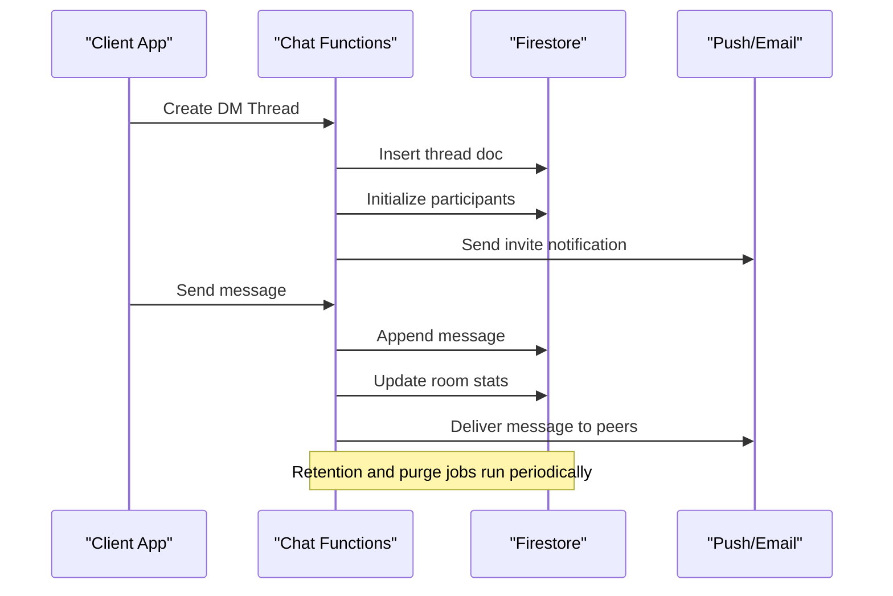

**Diagram sources**
- [functions/src/churchChatDmThreadNormalize.ts](file://functions/src/churchChatDmThreadNormalize.ts)
- [functions/src/churchChatNotify.ts](file://functions/src/churchChatNotify.ts)
- [functions/src/churchChatPeerProfileSync.ts](file://functions/src/churchChatPeerProfileSync.ts)
- [functions/src/churchChatRetention.ts](file://functions/src/churchChatRetention.ts)
- [functions/src/churchChatAdminPurge.ts](file://functions/src/churchChatAdminPurge.ts)

**Section sources**
- [functions/src/churchChatDmThreadNormalize.ts](file://functions/src/churchChatDmThreadNormalize.ts)
- [functions/src/churchChatNotify.ts](file://functions/src/churchChatNotify.ts)
- [functions/src/churchChatPeerProfileSync.ts](file://functions/src/churchChatPeerProfileSync.ts)
- [functions/src/churchChatRetention.ts](file://functions/src/churchChatRetention.ts)
- [functions/src/churchChatAdminPurge.ts](file://functions/src/churchChatAdminPurge.ts)

### Media Metadata Organization
- Attachments store metadata about uploaded media, including church scoping and references.
- Display URLs are generated for safe and optimized access.
- Orphan file cleanup and processing pipelines ensure storage hygiene.

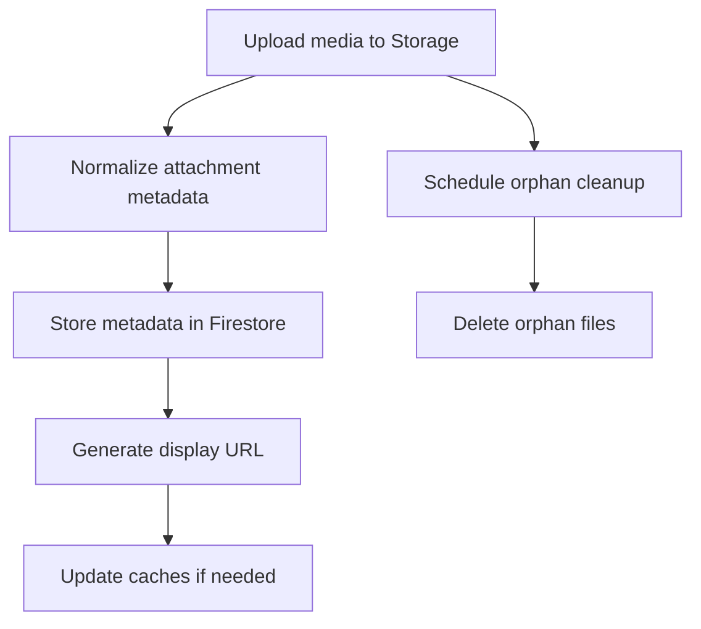

**Diagram sources**
- [functions/src/gyMediaAttachments.ts](file://functions/src/gyMediaAttachments.ts)
- [functions/src/storageDisplayUrls.ts](file://functions/src/storageDisplayUrls.ts)
- [functions/src/cleanupOrphanFiles.ts](file://functions/src/cleanupOrphanFiles.ts)
- [functions/src/processChurchStorageMedia.ts](file://functions/src/processChurchStorageMedia.ts)
- [functions/src/storageCleanupOnFirestoreDelete.ts](file://functions/src/storageCleanupOnFirestoreDelete.ts)

**Section sources**
- [functions/src/gyMediaAttachments.ts](file://functions/src/gyMediaAttachments.ts)
- [functions/src/storageDisplayUrls.ts](file://functions/src/storageDisplayUrls.ts)
- [functions/src/cleanupOrphanFiles.ts](file://functions/src/cleanupOrphanFiles.ts)
- [functions/src/processChurchStorageMedia.ts](file://functions/src/processChurchStorageMedia.ts)
- [functions/src/storageCleanupOnFirestoreDelete.ts](file://functions/src/storageCleanupOnFirestoreDelete.ts)

### Caches and Dashboards
- Dashboard, statistics, public site, and finance accounts caches serve read-heavy endpoints efficiently.
- Updates are triggered by relevant write operations to keep caches consistent.

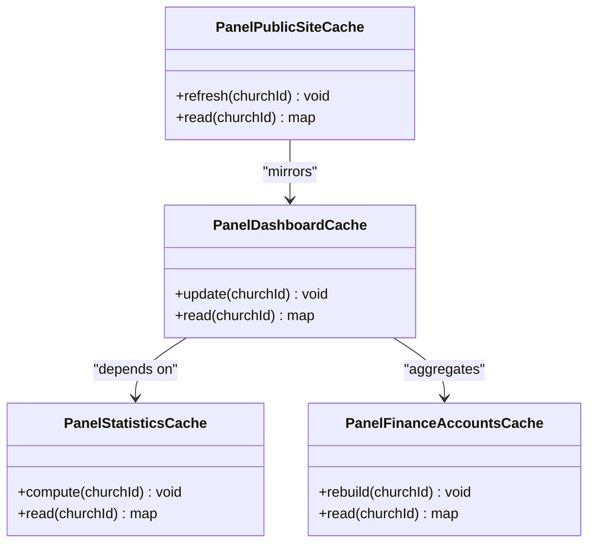

**Diagram sources**
- [functions/src/panelDashboardCache.ts](file://functions/src/panelDashboardCache.ts)
- [functions/src/panelStatisticsCache.ts](file://functions/src/panelStatisticsCache.ts)
- [functions/src/panelPublicSiteCache.ts](file://functions/src/panelPublicSiteCache.ts)
- [functions/src/panelFinanceAccountsCache.ts](file://functions/src/panelFinanceAccountsCache.ts)

**Section sources**
- [functions/src/panelDashboardCache.ts](file://functions/src/panelDashboardCache.ts)
- [functions/src/panelStatisticsCache.ts](file://functions/src/panelStatisticsCache.ts)
- [functions/src/panelPublicSiteCache.ts](file://functions/src/panelPublicSiteCache.ts)
- [functions/src/panelFinanceAccountsCache.ts](file://functions/src/panelFinanceAccountsCache.ts)

### Reminders and Scheduling
- Event reminders, vendor agendas, and recurring revenue schedules are handled by dedicated functions.
- These jobs scan due dates and trigger notifications or updates.

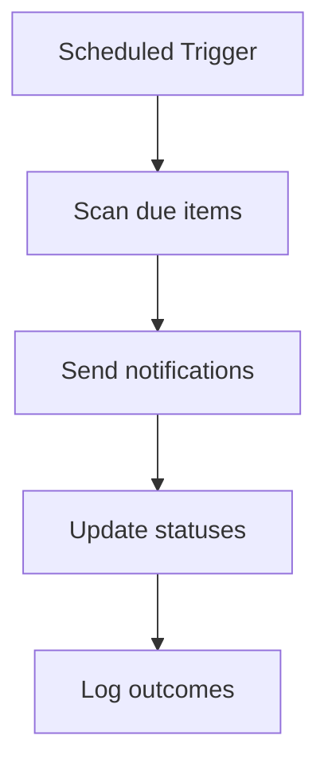

**Diagram sources**
- [functions/src/eventoReminders.ts](file://functions/src/eventoReminders.ts)
- [functions/src/fornecedorAgendaReminders.ts](file://functions/src/fornecedorAgendaReminders.ts)
- [functions/src/receitasRecorrentesScheduled.ts](file://functions/src/receitasRecorrentesScheduled.ts)
- [functions/src/financeVencimentoReminders.ts](file://functions/src/financeVencimentoReminders.ts)

**Section sources**
- [functions/src/eventoReminders.ts](file://functions/src/eventoReminders.ts)
- [functions/src/fornecedorAgendaReminders.ts](file://functions/src/fornecedorAgendaReminders.ts)
- [functions/src/receitasRecorrentesScheduled.ts](file://functions/src/receitasRecorrentesScheduled.ts)
- [functions/src/financeVencimentoReminders.ts](file://functions/src/financeVencimentoReminders.ts)

### Cross-References and Integrations
- Public church slug index maps slugs to canonical church IDs.
- Master churches list cache aggregates platform-level data.
- Sync functions consolidate clusters and integrate external services like Mercado Pago.

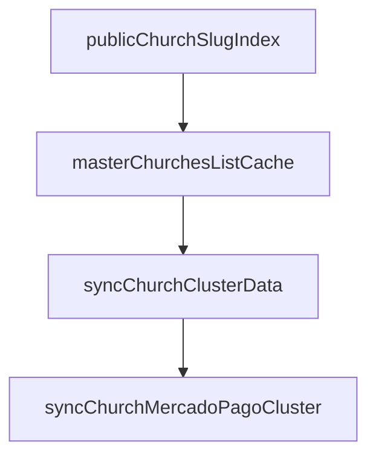

**Diagram sources**
- [functions/src/publicChurchSlugIndex.ts](file://functions/src/publicChurchSlugIndex.ts)
- [functions/src/masterChurchesListCache.ts](file://functions/src/masterChurchesListCache.ts)
- [functions/src/syncChurchClusterData.ts](file://functions/src/syncChurchClusterData.ts)
- [functions/src/syncChurchMercadoPagoCluster.ts](file://functions/src/syncChurchMercadoPagoCluster.ts)

**Section sources**
- [functions/src/publicChurchSlugIndex.ts](file://functions/src/publicChurchSlugIndex.ts)
- [functions/src/masterChurchesListCache.ts](file://functions/src/masterChurchesListCache.ts)
- [functions/src/syncChurchClusterData.ts](file://functions/src/syncChurchClusterData.ts)
- [functions/src/syncChurchMercadoPagoCluster.ts](file://functions/src/syncChurchMercadoPagoCluster.ts)

## Dependency Analysis
- Cloud Functions depend on utility modules for tenant resolution, storage structure, and migrations.
- Caches depend on summary computations and account data.
- Chat functions coordinate messages, threads, and peer profiles.
- Media functions rely on storage and metadata normalization.

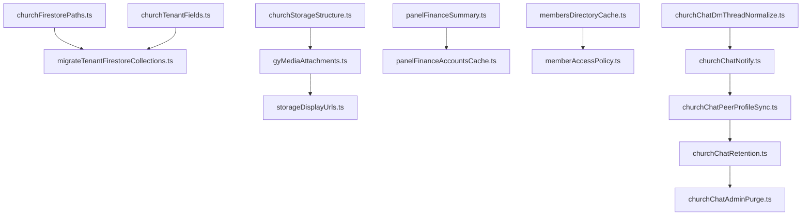

**Diagram sources**
- [functions/src/churchFirestorePaths.ts](file://functions/src/churchFirestorePaths.ts)
- [functions/src/churchTenantFields.ts](file://functions/src/churchTenantFields.ts)
- [functions/src/churchStorageStructure.ts](file://functions/src/churchStorageStructure.ts)
- [functions/src/migrateTenantFirestoreCollections.ts](file://functions/src/migrateTenantFirestoreCollections.ts)
- [functions/src/gyMediaAttachments.ts](file://functions/src/gyMediaAttachments.ts)
- [functions/src/storageDisplayUrls.ts](file://functions/src/storageDisplayUrls.ts)
- [functions/src/panelFinanceSummary.ts](file://functions/src/panelFinanceSummary.ts)
- [functions/src/panelFinanceAccountsCache.ts](file://functions/src/panelFinanceAccountsCache.ts)
- [functions/src/membersDirectoryCache.ts](file://functions/src/membersDirectoryCache.ts)
- [functions/src/memberAccessPolicy.ts](file://functions/src/memberAccessPolicy.ts)
- [functions/src/churchChatDmThreadNormalize.ts](file://functions/src/churchChatDmThreadNormalize.ts)
- [functions/src/churchChatNotify.ts](file://functions/src/churchChatNotify.ts)
- [functions/src/churchChatPeerProfileSync.ts](file://functions/src/churchChatPeerProfileSync.ts)
- [functions/src/churchChatRetention.ts](file://functions/src/churchChatRetention.ts)
- [functions/src/churchChatAdminPurge.ts](file://functions/src/churchChatAdminPurge.ts)

**Section sources**
- [functions/index.js](file://functions/index.js)
- [functions/src/churchFirestorePaths.ts](file://functions/src/churchFirestorePaths.ts)
- [functions/src/churchTenantFields.ts](file://functions/src/churchTenantFields.ts)
- [functions/src/churchStorageStructure.ts](file://functions/src/churchStorageStructure.ts)
- [functions/src/migrateTenantFirestoreCollections.ts](file://functions/src/migrateTenantFirestoreCollections.ts)
- [functions/src/gyMediaAttachments.ts](file://functions/src/gyMediaAttachments.ts)
- [functions/src/storageDisplayUrls.ts](file://functions/src/storageDisplayUrls.ts)
- [functions/src/panelFinanceSummary.ts](file://functions/src/panelFinanceSummary.ts)
- [functions/src/panelFinanceAccountsCache.ts](file://functions/src/panelFinanceAccountsCache.ts)
- [functions/src/membersDirectoryCache.ts](file://functions/src/membersDirectoryCache.ts)
- [functions/src/memberAccessPolicy.ts](file://functions/src/memberAccessPolicy.ts)
- [functions/src/churchChatDmThreadNormalize.ts](file://functions/src/churchChatDmThreadNormalize.ts)
- [functions/src/churchChatNotify.ts](file://functions/src/churchChatNotify.ts)
- [functions/src/churchChatPeerProfileSync.ts](file://functions/src/churchChatPeerProfileSync.ts)
- [functions/src/churchChatRetention.ts](file://functions/src/churchChatRetention.ts)
- [functions/src/churchChatAdminPurge.ts](file://functions/src/churchChatAdminPurge.ts)

## Performance Considerations
- Use cached documents for read-heavy surfaces (dashboards, statistics, public site, finance accounts).
- Leverage Firestore indexes defined in the indexes file to optimize queries across tenant-scoped collections.
- Normalize data and avoid deep nesting to reduce read/write costs.
- Implement retention and cleanup jobs to prevent unbounded growth in chat and media metadata.
- Minimize client-side filtering by precomputing summaries and aggregations in Cloud Functions.

[No sources needed since this section provides general guidance]

## Troubleshooting Guide
Common issues and resolutions:
- Tenant resolution failures: Verify church ID mapping and canonical resolution utilities.
- Access denied errors: Check Firestore Rules and member access policies for correct roles and scopes.
- Stale caches: Rebuild caches after significant writes; monitor update triggers.
- Orphaned media: Run cleanup jobs and verify storage deletion hooks.
- Reminder jobs not firing: Inspect scheduled triggers and due date fields.

Operational checks:
- Validate indexes coverage for frequent queries.
- Monitor function logs for normalization and migration steps.
- Ensure storage CORS and display URL generation are configured correctly.

**Section sources**
- [functions/src/churchFirestorePaths.ts](file://functions/src/churchFirestorePaths.ts)
- [functions/src/memberAccessPolicy.ts](file://functions/src/memberAccessPolicy.ts)
- [functions/src/panelFinanceAccountsCache.ts](file://functions/src/panelFinanceAccountsCache.ts)
- [functions/src/cleanupOrphanFiles.ts](file://functions/src/cleanupOrphanFiles.ts)
- [functions/src/storageCleanupOnFirestoreDelete.ts](file://functions/src/storageCleanupOnFirestoreDelete.ts)
- [functions/src/financeVencimentoReminders.ts](file://functions/src/financeVencimentoReminders.ts)
- [firestore.indexes.json](file://firestore.indexes.json)

## Conclusion
The Gestão Yahweh Premium Firestore schema is designed around a robust multi-tenant architecture with clear separation of concerns across members, finances, chat, and media. Cloud Functions enforce business logic, normalize data, and maintain performance through caching and scheduling. Firestore Rules and indexes ensure secure and efficient access patterns. Following the documented structures and patterns will help maintain data integrity, scalability, and performance as the application grows.

[No sources needed since this section summarizes without analyzing specific files]

## Appendices

### Example Document Structures
- Member document fields include identification, contact details, role, status, and timestamps.
- Finance account documents contain type, balance, and metadata; transactions reference accounts and categorize amounts.
- Chat thread documents hold participants, last activity, and message counts; messages include content, attachments, and timestamps.
- Media attachment documents store church scoping, file references, and generated display URLs.

[No sources needed since this section provides conceptual examples]

### Common Query Patterns
- List members by church and role with pagination.
- Retrieve transactions by account and date range.
- Fetch chat messages within a thread ordered by timestamp.
- Search media attachments by church and type.

[No sources needed since this section provides conceptual examples]