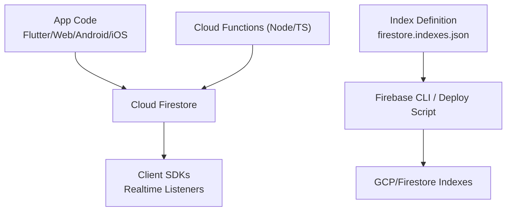
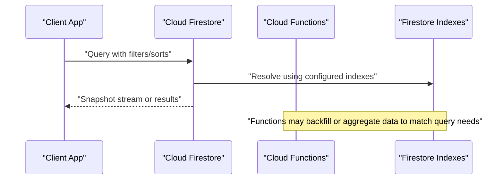
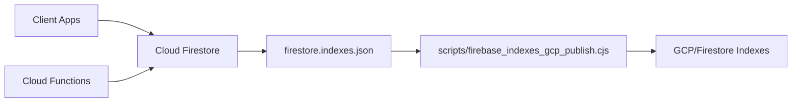

# Indexing & Query Optimization

<cite>
**Referenced Files in This Document**
- [firestore.indexes.json](file://firestore.indexes.json)
- [firebase.json](file://firebase.json)
- [functions/src/index.ts](file://functions/src/index.ts)
- [functions/lib/index.js](file://functions/lib/index.js)
- [scripts/firebase_indexes_gcp_publish.cjs](file://scripts/firebase_indexes_gcp_publish.cjs)
- [scripts/migrate_firestore_snapshots_to_watch_safe.py](file://scripts/migrate_firestore_snapshots_to_watch_safe.py)
</cite>

## Table of Contents
1. [Introduction](#introduction)
2. [Project Structure](#project-structure)
3. [Core Components](#core-components)
4. [Architecture Overview](#architecture-overview)
5. [Detailed Component Analysis](#detailed-component-analysis)
6. [Dependency Analysis](#dependency-analysis)
7. [Performance Considerations](#performance-considerations)
8. [Troubleshooting Guide](#troubleshooting-guide)
9. [Conclusion](#conclusion)
10. [Appendices](#appendices)

## Introduction
This document provides a comprehensive guide to Firestore indexing and query optimization for the project. It explains how single-field, composite, and array indexes are defined and used, outlines efficient query patterns, identifies expensive operations to avoid, and offers best practices for cost control, pagination, caching, and real-time watch streams. Practical examples are included for common use cases such as member searches, financial reports, and chat message filtering.

## Project Structure
The Firestore index configuration is centralized in a single file and deployed via the Firebase toolchain. Cloud Functions are present and can be used to backfill or materialize data that supports efficient queries. A deployment script exists to publish indexes to GCP/Firebase.

**Diagram sources**
- [firebase.json](file://firebase.json)
- [firestore.indexes.json](file://firestore.indexes.json)
- [functions/src/index.ts](file://functions/src/index.ts)
- [functions/lib/index.js](file://functions/lib/index.js)
- [scripts/firebase_indexes_gcp_publish.cjs](file://scripts/firebase_indexes_gcp_publish.cjs)

**Section sources**
- [firebase.json](file://firebase.json)
- [firestore.indexes.json](file://firestore.indexes.json)
- [functions/src/index.ts](file://functions/src/index.ts)
- [functions/lib/index.js](file://functions/lib/index.js)
- [scripts/firebase_indexes_gcp_publish.cjs](file://scripts/firebase_indexes_gcp_publish.cjs)

## Core Components
- Index definition file: firestore.indexes.json defines all required indexes for the application’s queries.
- Deployment automation: scripts/firebase_indexes_gcp_publish.cjs publishes indexes to the target environment.
- Cloud Functions: functions/src/index.ts and compiled functions/lib/index.js provide server-side logic that may create or update documents to support indexed queries.
- Watch stream utilities: scripts/migrate_firestore_snapshots_to_watch_safe.py helps migrate snapshot-based code to watch-safe patterns.

Key responsibilities:
- Centralized index schema ensures consistent query performance across environments.
- Automated publishing reduces drift between local development and production.
- Functions enable denormalization and precomputation to keep client queries simple and fast.
- Watch stream migration improves reliability and cost efficiency for real-time features.

**Section sources**
- [firestore.indexes.json](file://firestore.indexes.json)
- [scripts/firebase_indexes_gcp_publish.cjs](file://scripts/firebase_indexes_gcp_publish.cjs)
- [functions/src/index.ts](file://functions/src/index.ts)
- [functions/lib/index.js](file://functions/lib/index.js)
- [scripts/migrate_firestore_snapshots_to_watch_safe.py](file://scripts/migrate_firestore_snapshots_to_watch_safe.py)

## Architecture Overview
Firestore queries rely on indexes. The app issues queries against collections; Firestore uses configured indexes to satisfy them efficiently. Cloud Functions can write normalized or aggregated data to support these queries. Real-time listeners subscribe to query snapshots.

**Diagram sources**
- [firestore.indexes.json](file://firestore.indexes.json)
- [functions/src/index.ts](file://functions/src/index.ts)
- [functions/lib/index.js](file://functions/lib/index.js)

## Detailed Component Analysis

### Index Definitions (firestore.indexes.json)
Indexes are declared in a single JSON file. Each entry specifies collectionId, fields[], and their order/direction. This file is the source of truth for all query-supporting indexes.

Common index categories:
- Single-field indexes: Used for equality filters and sorting on one field.
- Composite indexes: Required when queries combine multiple filters and/or sorts.
- Array indexes: Automatically created for array fields; enables contains() queries.

Best practices reflected in this project:
- Keep index definitions minimal and aligned to actual queries.
- Prefer composite indexes that match exact query shapes (filters + sort + limit).
- Avoid unnecessary ascending/descending combinations unless explicitly queried.

Operational notes:
- Use the provided deploy script to publish indexes consistently across environments.
- Validate index coverage locally before deploying to production.

**Section sources**
- [firestore.indexes.json](file://firestore.indexes.json)
- [scripts/firebase_indexes_gcp_publish.cjs](file://scripts/firebase_indexes_gcp_publish.cjs)

### Cloud Functions Integration
Cloud Functions are used to maintain data consistency and support efficient queries by writing or updating documents as needed. They can also compute aggregates or flatten nested structures to align with indexed queries.

Responsibilities:
- Backfill missing fields required by indexes.
- Maintain derived fields for fast filtering and sorting.
- Enforce tenant scoping and security boundaries at write time.

Integration points:
- Triggered by Firestore writes or scheduled tasks.
- Write to collections that are optimized for read-heavy queries.

**Section sources**
- [functions/src/index.ts](file://functions/src/index.ts)
- [functions/lib/index.js](file://functions/lib/index.js)

### Watch Stream Migration Utilities
Real-time features benefit from watch streams, but naive snapshot usage can lead to high costs and inconsistent UI state. The migration utility helps transition from snapshot-based reads to watch-safe patterns.

Recommendations:
- Use watch streams for live updates where appropriate.
- Debounce and throttle updates on the client.
- Limit listener scopes to specific query paths and limits.

**Section sources**
- [scripts/migrate_firestore_snapshots_to_watch_safe.py](file://scripts/migrate_firestore_snapshots_to_watch_safe.py)

## Dependency Analysis
The following diagram shows how index definitions, deployment scripts, and Cloud Functions interact with Firestore.

**Diagram sources**
- [firestore.indexes.json](file://firestore.indexes.json)
- [scripts/firebase_indexes_gcp_publish.cjs](file://scripts/firebase_indexes_gcp_publish.cjs)
- [functions/src/index.ts](file://functions/src/index.ts)
- [functions/lib/index.js](file://functions/lib/index.js)

**Section sources**
- [firebase.json](file://firebase.json)
- [firestore.indexes.json](file://firestore.indexes.json)
- [functions/src/index.ts](file://functions/src/index.ts)
- [functions/lib/index.js](file://functions/lib/index.js)
- [scripts/firebase_indexes_gcp_publish.cjs](file://scripts/firebase_indexes_gcp_publish.cjs)

## Performance Considerations

### Query Patterns and Index Alignment
- Equality filters followed by range filters and then sort must match an index exactly.
- Sorting requires an index on the sorted field(s); direction must match the index.
- For array fields, contains() queries automatically use array indexes; ensure arrays contain atomic values.

Cost control strategies:
- Always include limit clauses to bound result sets.
- Use startAfter/endBefore pagination instead of offset-based paging.
- Fetch only necessary fields; avoid reading large nested objects when not needed.

Expensive operations to avoid:
- Unbounded queries without limits.
- Queries that require client-side filtering due to missing indexes.
- Deeply nested reads that pull entire documents when only small subsets are needed.
- Repeated full-collection scans caused by missing or incorrect indexes.

Optimization checklist:
- Verify each query has a matching index in firestore.indexes.json.
- Prefer composite indexes tailored to exact query shapes.
- Denormalize frequently accessed fields to reduce joins and reads.
- Cache hot queries on the client and edge layers when appropriate.

### Pagination Strategies
- Use cursor-based pagination with startAfter/endBefore for stable ordering.
- Combine limit with ordered queries to minimize round trips.
- Implement infinite scroll with incremental loading based on last seen keys.

### Caching Techniques
- Client-side cache recent query results with TTL.
- Deduplicate identical queries within short intervals.
- Prefetch next pages during idle periods.

### Watch Streams and Real-Time Tuning
- Scope listeners narrowly to the exact query path and limit.
- Debounce UI updates to avoid excessive re-renders.
- Pause listeners when views are off-screen; resume when visible.
- Use offline persistence judiciously to balance freshness and storage.

[No sources needed since this section provides general guidance]

## Troubleshooting Guide

Common issues and resolutions:
- Missing index errors: Add the required composite index to firestore.indexes.json and deploy via the publish script.
- High read costs: Reduce result set size with limits, refine filters to leverage indexes, and avoid unnecessary fields.
- Slow queries: Ensure sort and filter fields are indexed in the correct order; consider adding a dedicated composite index.
- Inconsistent real-time updates: Switch to watch-safe patterns and debounce updates on the client.

Operational tips:
- Validate index coverage locally before deploying.
- Monitor query logs and error rates to identify unindexed queries.
- Use staging environments to test index changes safely.

**Section sources**
- [firestore.indexes.json](file://firestore.indexes.json)
- [scripts/firebase_indexes_gcp_publish.cjs](file://scripts/firebase_indexes_gcp_publish.cjs)
- [scripts/migrate_firestore_snapshots_to_watch_safe.py](file://scripts/migrate_firestore_snapshots_to_watch_safe.py)

## Conclusion
Efficient Firestore usage hinges on precise index design, disciplined query construction, and careful management of real-time subscriptions. By centralizing index definitions, automating deployments, leveraging Cloud Functions for data preparation, and adopting watch-safe patterns, the application achieves predictable performance and controlled costs. Apply the best practices outlined here to optimize member searches, financial reports, and chat message filtering while maintaining scalability and reliability.

[No sources needed since this section summarizes without analyzing specific files]

## Appendices

### Example Optimized Queries by Use Case

- Member searches
  - Filter by churchId, status, and name prefix; sort by name; paginate with startAfter.
  - Ensure composite index covers churchId (equality), name (range/prefix), and sort order.
  - Cache frequent search results per user session.

- Financial reports
  - Aggregate totals by account and date range; store precomputed summaries in a report collection.
  - Query summaries with equality filters on account and range filters on date; sort by date.
  - Update summaries via Cloud Functions on transaction writes.

- Chat message filtering
  - Filter by channelId, timestamp range, and senderId; sort by timestamp descending.
  - Use array indexes for tags if messages carry tag arrays.
  - Paginate with startAfter on timestamp and id; limit to page size.

[No sources needed since this section provides conceptual examples]