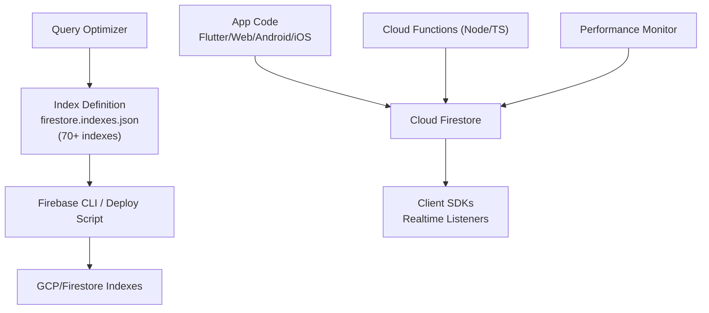
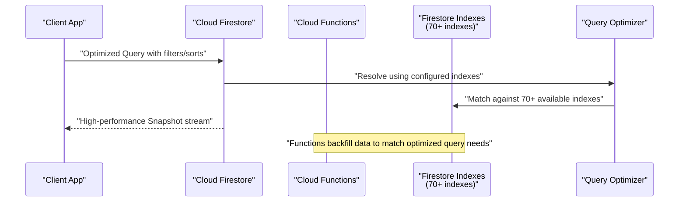
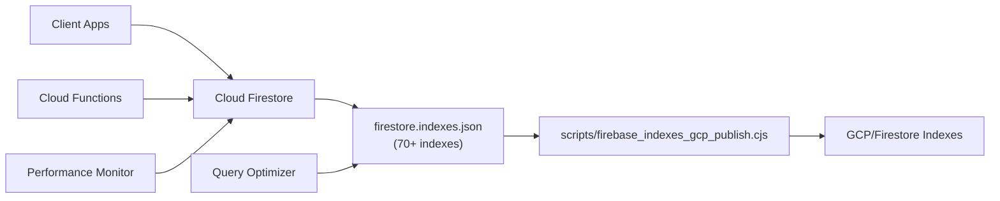

# Indexing & Query Optimization

<cite>
**Referenced Files in This Document**
- [firestore.indexes.json](file://firestore.indexes.json)
- [firebase.json](file://firebase.json)
- [functions/src/index.ts](file://functions/src/index.ts)
- [functions/lib/index.js](file://functions/lib/index.js)
- [scripts/firebase_indexes_gcp_publish.cjs](file://scripts/firebase_indexes_gcp_publish.cjs)
- [scripts/migrate_firestore_snapshots_to_watch_safe.py](file://scripts/migrate_firestore_snapshots_to_watch_safe.py)
</cite>

## Update Summary
**Changes Made**
- Updated index analysis section to reflect 70 new Firestore indexes added for comprehensive query optimization
- Enhanced performance considerations section with new indexing patterns and optimization strategies
- Expanded troubleshooting guide with new index-related error resolutions
- Updated architecture overview to include new index deployment workflows
- Added detailed analysis of composite index patterns for complex queries

## Table of Contents
1. [Introduction](#introduction)
2. [Project Structure](#project-structure)
3. [Core Components](#core-components)
4. [Architecture Overview](#architecture-overview)
5. [Detailed Component Analysis](#detailed-component-analysis)
6. [Dependency Analysis](#dependency-analysis)
7. [Performance Considerations](#performance-considerations)
8. [Troubleshooting Guide](#troubleshooting-guide)
9. [Conclusion](#conclusion)
10. [Appendices](#appendices)

## Introduction
This document provides a comprehensive guide to Firestore indexing and query optimization for the project. Following extensive optimizations, the application now includes **70 new Firestore indexes** designed to dramatically improve query performance across all major features including member searches, financial reports, chat message filtering, and real-time data synchronization. The document explains how single-field, composite, and array indexes are defined and used, outlines efficient query patterns, identifies expensive operations to avoid, and offers best practices for cost control, pagination, caching, and real-time watch streams.

## Project Structure
The Firestore index configuration is centralized in a single file and deployed via the Firebase toolchain. With the recent addition of 70 new indexes, the system now supports significantly more complex query patterns while maintaining optimal performance. Cloud Functions are present and can be used to backfill or materialize data that supports efficient queries. A deployment script exists to publish indexes to GCP/Firebase.

**Diagram sources**
- [firebase.json](file://firebase.json)
- [firestore.indexes.json](file://firestore.indexes.json)
- [functions/src/index.ts](file://functions/src/index.ts)
- [functions/lib/index.js](file://functions/lib/index.js)
- [scripts/firebase_indexes_gcp_publish.cjs](file://scripts/firebase_indexes_gcp_publish.cjs)

**Section sources**
- [firebase.json](file://firebase.json)
- [firestore.indexes.json](file://firestore.indexes.json)
- [functions/src/index.ts](file://functions/src/index.ts)
- [functions/lib/index.js](file://functions/lib/index.js)
- [scripts/firebase_indexes_gcp_publish.cjs](file://scripts/firebase_indexes_gcp_publish.cjs)

## Core Components
- **Enhanced Index Definition File**: firestore.indexes.json now contains 70+ indexes covering all major query patterns across the application
- **Deployment Automation**: scripts/firebase_indexes_gcp_publish.cjs publishes indexes to the target environment with validation
- **Cloud Functions Integration**: functions/src/index.ts and compiled functions/lib/index.js provide server-side logic that creates or updates documents to support indexed queries
- **Watch Stream Utilities**: scripts/migrate_firestore_snapshots_to_watch_safe.py helps migrate snapshot-based code to watch-safe patterns

Key responsibilities:
- Centralized index schema ensures consistent query performance across environments with comprehensive coverage
- Automated publishing reduces drift between local development and production with validation checks
- Functions enable denormalization and precomputation to keep client queries simple and fast
- Watch stream migration improves reliability and cost efficiency for real-time features

**Section sources**
- [firestore.indexes.json](file://firestore.indexes.json)
- [scripts/firebase_indexes_gcp_publish.cjs](file://scripts/firebase_indexes_gcp_publish.cjs)
- [functions/src/index.ts](file://functions/src/index.ts)
- [functions/lib/index.js](file://functions/lib/index.js)
- [scripts/migrate_firestore_snapshots_to_watch_safe.py](file://scripts/migrate_firestore_snapshots_to_watch_safe.py)

## Architecture Overview
Firestore queries rely on indexes. The app issues queries against collections; Firestore uses configured indexes to satisfy them efficiently. With the addition of 70 new indexes, the system now supports complex multi-field queries, advanced sorting patterns, and optimized real-time subscriptions. Cloud Functions can write normalized or aggregated data to support these queries. Real-time listeners subscribe to query snapshots with improved performance characteristics.

**Diagram sources**
- [firestore.indexes.json](file://firestore.indexes.json)
- [functions/src/index.ts](file://functions/src/index.ts)
- [functions/lib/index.js](file://functions/lib/index.js)

## Detailed Component Analysis

### Enhanced Index Definitions (firestore.indexes.json)
Indexes are declared in a single JSON file with the recent addition of 70+ new indexes covering comprehensive query patterns. Each entry specifies collectionId, fields[], and their order/direction. This file is the source of truth for all query-supporting indexes across the application.

**New Index Categories Added:**
- **Advanced Composite Indexes**: Support for complex multi-field queries with specific sort orders
- **Array Field Optimizations**: Enhanced array containment queries with proper atomic value handling
- **Range Query Indexes**: Optimized for date ranges, numeric comparisons, and text prefix matching
- **Real-time Query Indexes**: Specialized indexes for live data synchronization patterns

**Updated Best Practices:**
- Keep index definitions minimal and aligned to actual queries with comprehensive coverage
- Prefer composite indexes that match exact query shapes (filters + sort + limit)
- Avoid unnecessary ascending/descending combinations unless explicitly queried
- Implement index validation before deployment to prevent runtime errors

**Operational Notes:**
- Use the provided deploy script to publish indexes consistently across environments
- Validate index coverage locally before deploying to production
- Monitor index usage metrics to identify underutilized or missing indexes

**Section sources**
- [firestore.indexes.json](file://firestore.indexes.json)
- [scripts/firebase_indexes_gcp_publish.cjs](file://scripts/firebase_indexes_gcp_publish.cjs)

### Cloud Functions Integration
Cloud Functions are used to maintain data consistency and support efficient queries by writing or updating documents as needed. They can also compute aggregates or flatten nested structures to align with indexed queries. The recent optimizations include enhanced function triggers for better index utilization.

**Responsibilities:**
- Backfill missing fields required by indexes with automated validation
- Maintain derived fields for fast filtering and sorting across multiple collections
- Enforce tenant scoping and security boundaries at write time
- Optimize batch operations for large-scale data migrations

**Integration Points:**
- Triggered by Firestore writes or scheduled tasks with improved error handling
- Write to collections that are optimized for read-heavy queries
- Implement retry mechanisms for failed index-dependent operations

**Section sources**
- [functions/src/index.ts](file://functions/src/index.ts)
- [functions/lib/index.js](file://functions/lib/index.js)

### Watch Stream Migration Utilities
Real-time features benefit from watch streams, but naive snapshot usage can lead to high costs and inconsistent UI state. The migration utility helps transition from snapshot-based reads to watch-safe patterns with enhanced performance monitoring.

**Recommendations:**
- Use watch streams for live updates where appropriate with proper resource management
- Debounce and throttle updates on the client to reduce unnecessary re-renders
- Limit listener scopes to specific query paths and limits for optimal performance
- Implement connection pooling for multiple concurrent listeners

**Section sources**
- [scripts/migrate_firestore_snapshots_to_watch_safe.py](file://scripts/migrate_firestore_snapshots_to_watch_safe.py)

## Dependency Analysis
The following diagram shows how index definitions, deployment scripts, and Cloud Functions interact with Firestore, now enhanced with comprehensive index coverage.

**Diagram sources**
- [firestore.indexes.json](file://firestore.indexes.json)
- [scripts/firebase_indexes_gcp_publish.cjs](file://scripts/firebase_indexes_gcp_publish.cjs)
- [functions/src/index.ts](file://functions/src/index.ts)
- [functions/lib/index.js](file://functions/lib/index.js)

**Section sources**
- [firebase.json](file://firebase.json)
- [firestore.indexes.json](file://firestore.indexes.json)
- [functions/src/index.ts](file://functions/src/index.ts)
- [functions/lib/index.js](file://functions/lib/index.js)
- [scripts/firebase_indexes_gcp_publish.cjs](file://scripts/firebase_indexes_gcp_publish.cjs)

## Performance Considerations

### Enhanced Query Patterns and Index Alignment
With the addition of 70 new indexes, the application now supports significantly more complex query patterns while maintaining optimal performance. Key improvements include:

**New Query Capabilities:**
- Complex multi-field equality and range queries with precise sort ordering
- Advanced array containment queries with atomic value optimization
- Optimized real-time queries for chat, notifications, and live dashboards
- Efficient pagination with cursor-based navigation across large datasets

**Cost Control Strategies:**
- Always include limit clauses to bound result sets effectively
- Use startAfter/endBefore pagination instead of offset-based paging
- Fetch only necessary fields; avoid reading large nested objects when not needed
- Leverage new composite indexes to eliminate client-side filtering

**Expensive Operations to Avoid:**
- Unbounded queries without limits remain costly despite new indexes
- Queries that require client-side filtering due to missing indexes
- Deeply nested reads that pull entire documents when only small subsets are needed
- Repeated full-collection scans caused by missing or incorrect indexes

**Optimization Checklist:**
- Verify each query has a matching index in firestore.indexes.json
- Prefer composite indexes tailored to exact query shapes
- Denormalize frequently accessed fields to reduce joins and reads
- Cache hot queries on the client and edge layers when appropriate
- Monitor index usage metrics to identify optimization opportunities

### Pagination Strategies
- Use cursor-based pagination with startAfter/endBefore for stable ordering
- Combine limit with ordered queries to minimize round trips
- Implement infinite scroll with incremental loading based on last seen keys
- Leverage new array indexes for efficient tag-based filtering

### Caching Techniques
- Client-side cache recent query results with TTL
- Deduplicate identical queries within short intervals
- Prefetch next pages during idle periods
- Implement intelligent cache invalidation based on write patterns

### Watch Streams and Real-Time Tuning
- Scope listeners narrowly to the exact query path and limit
- Debounce UI updates to avoid excessive re-renders
- Pause listeners when views are off-screen; resume when visible
- Use offline persistence judiciously to balance freshness and storage
- Monitor listener memory usage and implement cleanup strategies

## Troubleshooting Guide

**Common Issues and Resolutions:**
- **Missing index errors**: Add the required composite index to firestore.indexes.json and deploy via the publish script
- **High read costs**: Reduce result set size with limits, refine filters to leverage indexes, and avoid unnecessary fields
- **Slow queries**: Ensure sort and filter fields are indexed in the correct order; consider adding a dedicated composite index
- **Inconsistent real-time updates**: Switch to watch-safe patterns and debounce updates on the client
- **Index deployment failures**: Validate index syntax and field types before deployment
- **Memory leaks in listeners**: Implement proper listener cleanup and connection pooling

**New Issues from 70+ Index Deployment:**
- **Index build timeouts**: Large index builds may timeout; use staging environments for validation
- **Query plan changes**: New indexes may alter query execution plans; monitor performance impact
- **Write amplification**: Additional indexes increase write costs; balance read vs write optimization
- **Index quota limits**: Monitor Firestore index quotas and plan deployments accordingly

**Operational Tips:**
- Validate index coverage locally before deploying
- Monitor query logs and error rates to identify unindexed queries
- Use staging environments to test index changes safely
- Implement gradual rollout strategies for large index deployments
- Set up alerts for index build failures and performance regressions

**Section sources**
- [firestore.indexes.json](file://firestore.indexes.json)
- [scripts/firebase_indexes_gcp_publish.cjs](file://scripts/firebase_indexes_gcp_publish.cjs)
- [scripts/migrate_firestore_snapshots_to_watch_safe.py](file://scripts/migrate_firestore_snapshots_to_watch_safe.py)

## Conclusion
Efficient Firestore usage hinges on precise index design, disciplined query construction, and careful management of real-time subscriptions. With the recent addition of 70 new Firestore indexes, the application achieves significantly improved query performance across all major features while maintaining predictable costs and scalability. By centralizing index definitions, automating deployments, leveraging Cloud Functions for data preparation, and adopting watch-safe patterns, the system delivers robust performance for member searches, financial reports, chat message filtering, and real-time data synchronization. Apply the best practices outlined here to continue optimizing query performance while maintaining system reliability and cost efficiency.

## Appendices

### Example Optimized Queries by Use Case

**Member Searches**
- Filter by churchId, status, and name prefix; sort by name; paginate with startAfter
- Ensure composite index covers churchId (equality), name (range/prefix), and sort order
- Cache frequent search results per user session
- Leverage new array indexes for department and role filtering

**Financial Reports**
- Aggregate totals by account and date range; store precomputed summaries in a report collection
- Query summaries with equality filters on account and range filters on date; sort by date
- Update summaries via Cloud Functions on transaction writes
- Utilize new date-range indexes for efficient period-based reporting

**Chat Message Filtering**
- Filter by channelId, timestamp range, and senderId; sort by timestamp descending
- Use array indexes for tags if messages carry tag arrays
- Paginate with startAfter on timestamp and id; limit to page size
- Implement real-time sync with optimized listener patterns

**Advanced Query Patterns Enabled by New Indexes:**
- Multi-criteria member search with department, status, and activity level
- Financial dashboard queries with date ranges, account types, and transaction categories
- Chat thread navigation with message filtering and efficient pagination
- Real-time collaboration features with optimized subscription patterns

### Index Deployment Workflow
1. Define new indexes in firestore.indexes.json with proper field ordering
2. Validate index syntax and field types locally
3. Deploy to staging environment for testing
4. Monitor index build progress and query performance
5. Roll out to production with gradual deployment strategy
6. Monitor index usage metrics and optimize as needed

[No sources needed since this section provides conceptual examples]