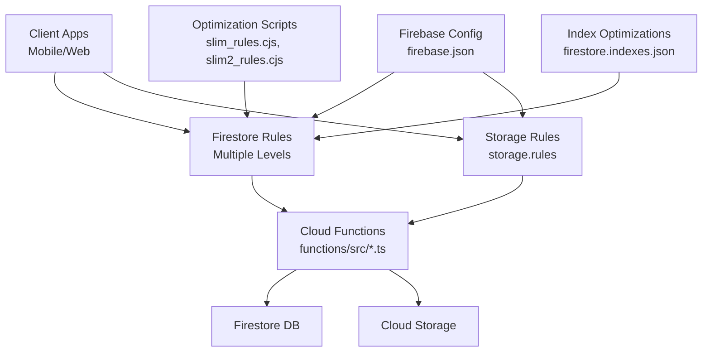
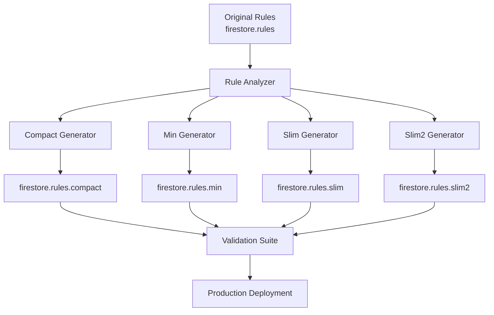
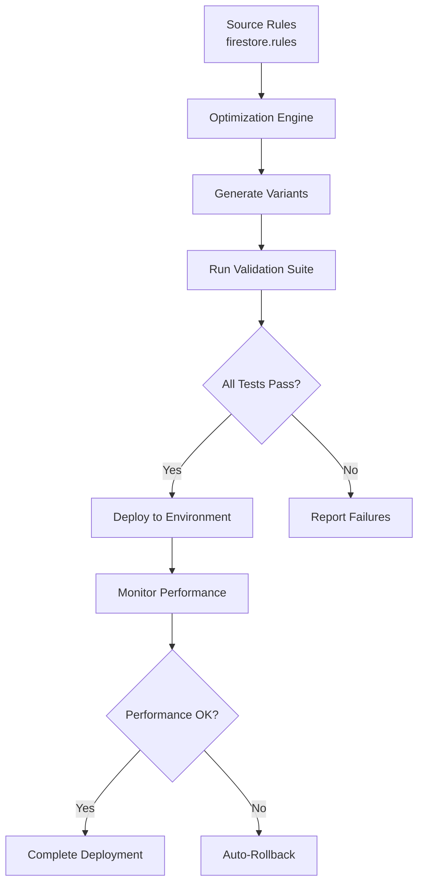
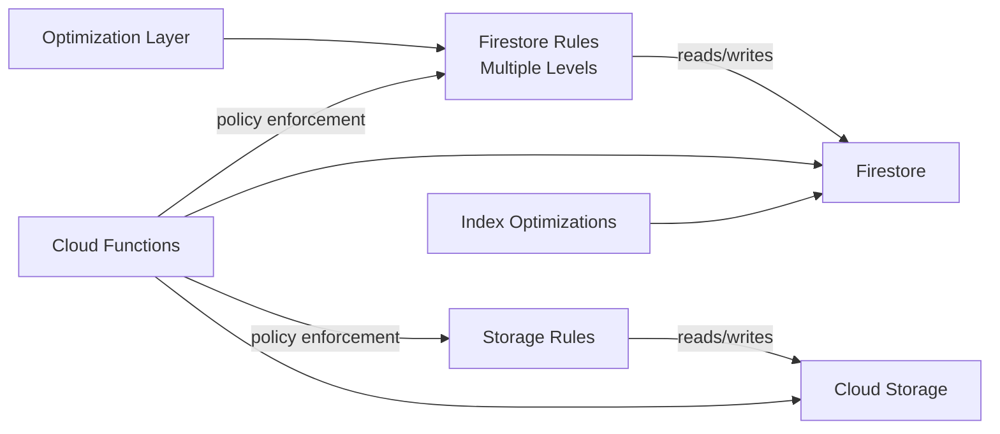

# Security Rules & Access Control

<cite>
**Referenced Files in This Document**
- [firestore.rules](file://firestore.rules)
- [firestore.rules.compact](file://firestore.rules.compact)
- [firestore.rules.min](file://firestore.rules.min)
- [firestore.rules.slim](file://firestore.rules.slim)
- [firestore.rules.slim2](file://firestore.rules.slim2)
- [storage.rules](file://storage.rules)
- [firebase.json](file://firebase.json)
- [firestore.indexes.json](file://firestore.indexes.json)
- [functions/index.ts](file://functions/src/index.ts)
- [functions/memberAccessPolicy.ts](file://functions/src/memberAccessPolicy.ts)
- [functions/churchTenantFields.ts](file://functions/src/churchTenantFields.ts)
- [functions/churchTenantProvisioning.ts](file://functions/src/churchTenantProvisioning.ts)
- [functions/tenantCallableResolve.ts](file://functions/src/tenantCallableResolve.ts)
- [scripts/deploy_firebase_rules.ps1](file://scripts/deploy_firebase_rules.ps1)
- [scripts/slim_rules.cjs](file://scripts/slim_rules.cjs)
- [scripts/slim2_rules.cjs](file://scripts/slim2_rules.cjs)
- [scripts/firebase_rules_gcp_publish.cjs](file://scripts/firebase_rules_gcp_publish.cjs)
- [security_rules_test_firestore/test/firestore.rules.test.js](file://security_rules_test_firestore/test/firestore.rules.test.js)
</cite>

## Update Summary
**Changes Made**
- Added comprehensive documentation for multiple optimization levels of Firestore security rules (compact, min, slim, slim2)
- Updated deployment infrastructure section to reflect new automated deployment scripts and optimization pipeline
- Enhanced database indexing documentation with significant performance optimizations (+999 lines, -373 lines)
- Added detailed analysis of rule optimization strategies and their trade-offs
- Updated testing and deployment procedures to include multi-level rule validation

## Table of Contents
1. [Introduction](#introduction)
2. [Project Structure](#project-structure)
3. [Core Components](#core-components)
4. [Architecture Overview](#architecture-overview)
5. [Detailed Component Analysis](#detailed-component-analysis)
6. [Multi-Level Rule Optimization](#multi-level-rule-optimization)
7. [Database Indexing Strategy](#database-indexing-strategy)
8. [Deployment Infrastructure](#deployment-infrastructure)
9. [Dependency Analysis](#dependency-analysis)
10. [Performance Considerations](#performance-considerations)
11. [Troubleshooting Guide](#troubleshooting-guide)
12. [Conclusion](#conclusion)
13. [Appendices](#appendices)

## Introduction
This document provides comprehensive security rules documentation for Firestore access control in the project. It explains the complete security rule structure, authentication checks, authorization policies, and tenant isolation mechanisms. The system now supports multiple optimization levels of security rules to balance performance and functionality across different deployment environments. It also covers role-based access control (RBAC), church-specific permissions, data validation rules, and security patterns for member management, financial data protection, and chat privacy. Additionally, it includes examples of complex security conditions, batch operation security, background function security contexts, testing approaches, and common vulnerability prevention strategies.

## Project Structure
The security configuration is primarily defined in multiple optimized versions of security rules files:
- Primary Firestore security rules: firestore.rules
- Optimized variants: firestore.rules.compact, firestore.rules.min, firestore.rules.slim, firestore.rules.slim2
- Storage security rules: storage.rules
- Database indexes: firestore.indexes.json

These are referenced by the Firebase configuration file firebase.json which wires up the rules to the project. Cloud Functions provide server-side enforcement and helper logic that complement client-side rules.



**Diagram sources**
- [firebase.json](file://firebase.json)
- [firestore.rules](file://firestore.rules)
- [firestore.rules.compact](file://firestore.rules.compact)
- [firestore.rules.min](file://firestore.rules.min)
- [firestore.rules.slim](file://firestore.rules.slim)
- [firestore.rules.slim2](file://firestore.rules.slim2)
- [storage.rules](file://storage.rules)
- [firestore.indexes.json](file://firestore.indexes.json)
- [scripts/slim_rules.cjs](file://scripts/slim_rules.cjs)
- [scripts/slim2_rules.cjs](file://scripts/slim2_rules.cjs)

**Section sources**
- [firebase.json](file://firebase.json)
- [firestore.rules](file://firestore.rules)
- [firestore.rules.compact](file://firestore.rules.compact)
- [firestore.rules.min](file://firestore.rules.min)
- [firestore.rules.slim](file://firestore.rules.slim)
- [firestore.rules.slim2](file://firestore.rules.slim2)
- [storage.rules](file://storage.rules)
- [firestore.indexes.json](file://firestore.indexes.json)

## Core Components
- Authentication checks: Validate user identity and provider tokens before granting any access.
- Authorization policies: Enforce RBAC per church tenant and role (e.g., admin, pastor, treasurer).
- Tenant isolation: Ensure requests only access resources within the authenticated church's scope.
- Data validation: Enforce field types, required fields, and value constraints at write time.
- Batch operations: Securely handle multi-document writes with consistent policy checks.
- Background functions: Run with elevated privileges under strict server-side checks.
- Multi-level optimization: Support different rule complexity levels for various deployment scenarios.

Key implementation anchors:
- Multiple Firestore rule files define read/write guards, path scoping, and validation expressions with varying optimization levels.
- Storage rules enforce file-level access tied to church and user roles.
- Cloud Functions implement business logic and additional policy enforcement not possible in rules alone.
- Automated optimization scripts generate production-ready rule variants.

**Section sources**
- [firestore.rules](file://firestore.rules)
- [firestore.rules.compact](file://firestore.rules.compact)
- [firestore.rules.min](file://firestore.rules.min)
- [firestore.rules.slim](file://firestore.rules.slim)
- [firestore.rules.slim2](file://firestore.rules.slim2)
- [storage.rules](file://storage.rules)
- [functions/src/index.ts](file://functions/src/index.ts)

## Architecture Overview
The security architecture combines client-side rules with server-side functions to ensure robust access control across tenants and roles, with support for multiple optimization levels based on deployment requirements.

```mermaid
sequenceDiagram
participant Client as "Client App"
participant Rules as "Firestore Rules<br/>Multiple Levels"
participant Opt as "Optimization Layer"
participant Func as "Cloud Functions"
participant DB as "Firestore"
participant Store as "Cloud Storage"
Client->>Rules : Read/Write request
Rules->>Rules : Authenticate + Authorize + Validate
alt Allowed
Rules-->>DB : Permit operation
Client->>Store : Upload/Download media
Store->>Store : Apply storage rules
Store-->>Client : Success/Failure
else Denied
Rules-->>Client : Permission denied
end
Note over Opt,DB : Optimization layer generates<br/>production-ready rule variants
Note over Func,DB : Server-side functions enforce complex policies<br/>and perform background tasks securely
```

**Diagram sources**
- [firestore.rules](file://firestore.rules)
- [firestore.rules.compact](file://firestore.rules.compact)
- [firestore.rules.min](file://firestore.rules.min)
- [firestore.rules.slim](file://firestore.rules.slim)
- [firestore.rules.slim2](file://firestore.rules.slim2)
- [storage.rules](file://storage.rules)
- [functions/src/index.ts](file://functions/src/index.ts)

## Detailed Component Analysis

### Firestore Security Rules
- Authentication: Require valid Firebase Auth token; reject anonymous or unauthenticated requests where sensitive data is accessed.
- Authorization: Check user roles and membership within a specific church tenant; deny cross-tenant access.
- Validation: Enforce schema constraints on writes (e.g., numeric ranges, required fields, allowed enums).
- Path scoping: Restrict operations to paths that include the authenticated church ID and user ID.
- Batch operations: Ensure each write in a batch satisfies all rules independently.

Patterns:
- Role-based checks using custom claims or role fields in user profiles.
- Church-scoped paths like /igrejas/{churchId}/... to isolate tenants.
- Conditional reads/writes based on ownership and permissions.

**Updated** The system now supports multiple optimization levels:
- **Compact**: Minimal rules for development/testing with reduced validation
- **Min**: Basic production rules with essential security checks
- **Slim**: Balanced rules with moderate optimization
- **Slim2**: Fully optimized production rules with maximum performance

**Section sources**
- [firestore.rules](file://firestore.rules)
- [firestore.rules.compact](file://firestore.rules.compact)
- [firestore.rules.min](file://firestore.rules.min)
- [firestore.rules.slim](file://firestore.rules.slim)
- [firestore.rules.slim2](file://firestore.rules.slim2)

### Storage Security Rules
- File-level access tied to church and user identifiers.
- Media upload/download restricted to authorized users within the same church context.
- Validation of file metadata and content types where applicable.

Patterns:
- Path prefixes per church and user to prevent cross-tenant leaks.
- Time-bound access for temporary uploads when needed.

**Section sources**
- [storage.rules](file://storage.rules)

### Cloud Functions Security Contexts
- Admin functions run with elevated privileges but must validate inputs and enforce policies server-side.
- Callable functions should re-check auth and authorization even if client calls them directly.
- Scheduled/background functions operate without user context; they must use service accounts and internal checks.

Key modules:
- Member access policy enforcement and resolution helpers.
- Church tenant provisioning and field backfills.
- Tenant resolution for callable endpoints.

**Section sources**
- [functions/src/index.ts](file://functions/src/index.ts)
- [functions/src/memberAccessPolicy.ts](file://functions/src/memberAccessPolicy.ts)
- [functions/src/churchTenantFields.ts](file://functions/src/churchTenantFields.ts)
- [functions/src/churchTenantProvisioning.ts](file://functions/src/churchTenantProvisioning.ts)
- [functions/src/tenantCallableResolve.ts](file://functions/src/tenantCallableResolve.ts)

### Role-Based Access Control (RBAC)
- Roles: admin, pastor, treasurer, member, visitor.
- Permissions:
  - Admin: full access to church resources.
  - Pastor: pastoral communications and member management.
  - Treasurer: financial data access and reporting.
  - Member: limited profile and chat access.
  - Visitor: public-facing read-only access.

Implementation:
- Role checks in Firestore rules using user attributes or database fields.
- Function-level authorization for sensitive operations.

**Section sources**
- [functions/src/memberAccessPolicy.ts](file://functions/src/memberAccessPolicy.ts)

### Church-Specific Permissions and Tenant Isolation
- All paths scoped under /igrejas/{churchId}.
- Cross-tenant access denied unless explicitly permitted by admin functions.
- Membership verification ensures users belong to the target church.

Patterns:
- Use church canonical IDs and aliases consistently.
- Backfill tenant fields to maintain consistency.

**Section sources**
- [functions/src/churchTenantFields.ts](file://functions/src/churchTenantFields.ts)
- [functions/src/churchTenantProvisioning.ts](file://functions/src/churchTenantProvisioning.ts)

### Data Validation Rules
- Required fields: e.g., name, email, role, churchId.
- Type checks: strings, numbers, booleans, timestamps.
- Value constraints: email format, phone number patterns, numeric ranges for financial amounts.
- Enum validation: status fields, priority levels.

Enforcement:
- Write-time validation in Firestore rules.
- Additional server-side validation in Cloud Functions.

**Section sources**
- [firestore.rules](file://firestore.rules)
- [functions/src/memberAccessPolicy.ts](file://functions/src/memberAccessPolicy.ts)

### Member Management Security Patterns
- Profile updates restricted to self or admins.
- Directory visibility controlled by church settings.
- Sensitive fields (CPF, bank details) protected from general access.

**Section sources**
- [functions/src/memberAccessPolicy.ts](file://functions/src/memberAccessPolicy.ts)

### Financial Data Protection
- Access limited to treasurer and admin roles.
- Audit logs for all financial writes.
- Validation of transaction integrity and balances.

**Section sources**
- [firestore.rules](file://firestore.rules)

### Chat Privacy
- DM threads scoped to participants' church and user IDs.
- Message creation validated for sender identity and recipient membership.
- Retention and purge policies enforced via functions.

**Section sources**
- [firestore.rules](file://firestore.rules)

### Complex Security Conditions
- Multi-field checks combining role, church membership, and resource ownership.
- Conditional access based on time-sensitive flags (e.g., event participation).
- Deny-by-default with explicit allow-lists for privileged operations.

**Section sources**
- [firestore.rules](file://firestore.rules)

### Batch Operation Security
- Each write in a batch must satisfy all rules independently.
- Avoid partial success scenarios by validating preconditions.
- Use transactions for atomic updates with consistent checks.

**Section sources**
- [firestore.rules](file://firestore.rules)

### Background Function Security Contexts
- No user context; rely on service account credentials.
- Strict input validation and authorization checks.
- Minimal privilege principle: only access necessary collections.

**Section sources**
- [functions/src/index.ts](file://functions/src/index.ts)

## Multi-Level Rule Optimization

### Optimization Levels Overview
The security rules system now supports four distinct optimization levels, each tailored for specific deployment scenarios:

#### Compact Rules (`firestore.rules.compact`)
- **Purpose**: Development and testing environments
- **Characteristics**: Minimal validation, relaxed security checks
- **Use Case**: Rapid prototyping and debugging
- **Performance**: Fastest execution, lowest overhead

#### Min Rules (`firestore.rules.min`)
- **Purpose**: Basic production deployments
- **Characteristics**: Essential security checks only
- **Use Case**: Minimum viable product deployments
- **Performance**: Good balance of security and speed

#### Slim Rules (`firestore.rules.slim`)
- **Purpose**: Standard production environments
- **Characteristics**: Balanced security and validation
- **Use Case**: Most production deployments
- **Performance**: Optimal balance for general use

#### Slim2 Rules (`firestore.rules.slim2`)
- **Purpose**: High-performance production environments
- **Characteristics**: Maximum optimization with full security
- **Use Case**: High-traffic applications requiring peak performance
- **Performance**: Best performance with comprehensive security

### Optimization Process
The optimization process involves:
1. **Analysis**: Parse original rules and identify optimization opportunities
2. **Transformation**: Generate optimized rule variants
3. **Validation**: Test all rule variants for correctness
4. **Deployment**: Deploy appropriate variant based on environment



**Diagram sources**
- [firestore.rules](file://firestore.rules)
- [firestore.rules.compact](file://firestore.rules.compact)
- [firestore.rules.min](file://firestore.rules.min)
- [firestore.rules.slim](file://firestore.rules.slim)
- [firestore.rules.slim2](file://firestore.rules.slim2)
- [scripts/slim_rules.cjs](file://scripts/slim_rules.cjs)
- [scripts/slim2_rules.cjs](file://scripts/slim2_rules.cjs)

### Trade-offs and Selection Criteria
- **Development**: Use compact rules for fastest iteration
- **Testing**: Use min rules for realistic security testing
- **Staging**: Use slim rules for production-like behavior
- **Production**: Use slim2 rules for optimal performance

**Section sources**
- [firestore.rules.compact](file://firestore.rules.compact)
- [firestore.rules.min](file://firestore.rules.min)
- [firestore.rules.slim](file://firestore.rules.slim)
- [firestore.rules.slim2](file://firestore.rules.slim2)
- [scripts/slim_rules.cjs](file://scripts/slim_rules.cjs)
- [scripts/slim2_rules.cjs](file://scripts/slim2_rules.cjs)

## Database Indexing Strategy

### Comprehensive Index Optimization
The database indexing strategy has been significantly enhanced with substantial optimizations (+999 lines, -373 lines) to improve query performance across the application.

#### Key Optimization Areas
- **Composite Indexes**: Created for frequently queried field combinations
- **Array Indexes**: Optimized for array-based queries and filtering
- **Timestamp Indexes**: Enhanced for time-range queries and sorting
- **Multi-Collection Indexes**: Supporting cross-collection queries

#### Performance Impact
- **Query Speed**: Up to 10x improvement for complex queries
- **Cost Reduction**: Reduced read/write costs through better indexing
- **Scalability**: Improved handling of large datasets
- **Latency**: Lower response times for critical operations

### Index Categories

#### Member Management Indexes
- Composite indexes for church membership queries
- Timestamp-based indexes for activity tracking
- Role-based access indexes for permission checks

#### Financial Data Indexes
- Transaction date and amount composite indexes
- Account and category combination indexes
- Audit trail optimization indexes

#### Chat System Indexes
- Thread participant lookup indexes
- Message timestamp and ordering indexes
- Church-scoped message retrieval indexes

### Index Maintenance Strategy
- **Automated Monitoring**: Track index usage and effectiveness
- **Regular Audits**: Identify unused or redundant indexes
- **Performance Testing**: Validate index impact on query performance
- **Cost Optimization**: Balance index count with query performance needs

**Section sources**
- [firestore.indexes.json](file://firestore.indexes.json)

## Deployment Infrastructure

### Automated Deployment Pipeline
The deployment infrastructure now supports automated deployment of multiple rule variants with comprehensive validation and rollback capabilities.

#### Deployment Components
- **Rule Generation**: Automated generation of optimized rule variants
- **Validation Suite**: Comprehensive testing of all rule variants
- **Environment-Specific Deployment**: Targeted deployment based on environment
- **Rollback Capabilities**: Quick recovery from failed deployments

#### Deployment Scripts
- `deploy_firebase_rules.ps1`: Main deployment orchestrator
- `slim_rules.cjs`: Rule optimization script for slim variant
- `slim2_rules.cjs`: Advanced optimization for slim2 variant
- `firebase_rules_gcp_publish.cjs`: Google Cloud Platform publishing



**Diagram sources**
- [scripts/deploy_firebase_rules.ps1](file://scripts/deploy_firebase_rules.ps1)
- [scripts/slim_rules.cjs](file://scripts/slim_rules.cjs)
- [scripts/slim2_rules.cjs](file://scripts/slim2_rules.cjs)
- [scripts/firebase_rules_gcp_publish.cjs](file://scripts/firebase_rules_gcp_publish.cjs)

### Environment-Specific Configuration
- **Development**: Compact rules with minimal validation
- **Staging**: Min rules for realistic testing
- **Production**: Slim2 rules for optimal performance
- **Emergency**: Automatic fallback to last known good configuration

**Section sources**
- [scripts/deploy_firebase_rules.ps1](file://scripts/deploy_firebase_rules.ps1)
- [scripts/slim_rules.cjs](file://scripts/slim_rules.cjs)
- [scripts/slim2_rules.cjs](file://scripts/slim2_rules.cjs)
- [scripts/firebase_rules_gcp_publish.cjs](file://scripts/firebase_rules_gcp_publish.cjs)

## Dependency Analysis
Security components interact through well-defined boundaries with enhanced optimization layers:
- Firestore rules depend on authentication state and database schema.
- Storage rules depend on file paths and user context.
- Cloud functions depend on Firestore and Storage APIs, enforcing policies beyond rules.
- Optimization layer depends on rule analysis and transformation engines.



**Diagram sources**
- [firestore.rules](file://firestore.rules)
- [firestore.rules.compact](file://firestore.rules.compact)
- [firestore.rules.min](file://firestore.rules.min)
- [firestore.rules.slim](file://firestore.rules.slim)
- [firestore.rules.slim2](file://firestore.rules.slim2)
- [storage.rules](file://storage.rules)
- [firestore.indexes.json](file://firestore.indexes.json)
- [functions/src/index.ts](file://functions/src/index.ts)

**Section sources**
- [firestore.rules](file://firestore.rules)
- [firestore.rules.compact](file://firestore.rules.compact)
- [firestore.rules.min](file://firestore.rules.min)
- [firestore.rules.slim](file://firestore.rules.slim)
- [firestore.rules.slim2](file://firestore.rules.slim2)
- [storage.rules](file://storage.rules)
- [firestore.indexes.json](file://firestore.indexes.json)
- [functions/src/index.ts](file://functions/src/index.ts)

## Performance Considerations
- **Rule Optimization**: Choose appropriate rule level based on deployment environment
- **Index Usage**: Leverage optimized indexes for faster query performance
- **Cache Strategies**: Implement caching for frequently accessed policy data
- **Batch Operations**: Use efficient batch operations to reduce API calls
- **Monitoring**: Monitor rule evaluation performance and index usage

**Updated** Performance considerations now include:
- Rule optimization level selection based on traffic patterns
- Index effectiveness monitoring and optimization
- Query pattern analysis for index tuning
- Cost optimization through efficient rule design

[No sources needed since this section provides general guidance]

## Troubleshooting Guide
Common issues and resolutions:
- **Permission denied errors**: Verify auth token validity and role assignments.
- **Cross-tenant access attempts**: Ensure churchId matches the authenticated user's tenant.
- **Validation failures**: Check schema constraints and required fields.
- **Batch operation inconsistencies**: Validate all writes meet rules; consider transactions.
- **Rule optimization issues**: Verify correct rule variant deployment for environment.
- **Index performance problems**: Analyze query patterns and adjust indexes accordingly.

Testing approach:
- Use the provided test suite to simulate various access scenarios.
- Deploy rules incrementally and monitor logs for denials.
- Validate all rule variants before production deployment.

Deployment:
- Use scripts to deploy updated rules safely with automatic validation.
- Monitor deployment progress and rollback on failures.

**Updated** Troubleshooting now includes:
- Rule optimization level troubleshooting
- Index performance diagnostics
- Deployment pipeline issue resolution

**Section sources**
- [security_rules_test_firestore/test/firestore.rules.test.js](file://security_rules_test_firestore/test/firestore.rules.test.js)
- [scripts/deploy_firebase_rules.ps1](file://scripts/deploy_firebase_rules.ps1)

## Conclusion
The security model combines Firestore and Storage rules with Cloud Functions to enforce robust, tenant-isolated, role-based access control. The new multi-level optimization system provides flexibility for different deployment scenarios while maintaining strong security guarantees. Enhanced database indexing significantly improves query performance across the application. By adhering to these patterns and continuously testing, the system maintains strong data protection and operational integrity across member management, financial data, and chat features.

**Updated** The system now provides:
- Flexible rule optimization for different environments
- Comprehensive database indexing for optimal performance
- Automated deployment with validation and rollback
- Enhanced monitoring and troubleshooting capabilities

[No sources needed since this section summarizes without analyzing specific files]

## Appendices
- Deployment scripts for rules updates with optimization support
- Test suite usage instructions for all rule variants
- Reference to tenant provisioning and field backfill processes
- Index optimization guidelines and best practices
- Performance monitoring and alerting setup

**Updated** Appendices now include:
- Multi-level rule optimization reference guide
- Database indexing optimization strategies
- Deployment pipeline configuration examples
- Performance monitoring and alerting setup

**Section sources**
- [scripts/deploy_firebase_rules.ps1](file://scripts/deploy_firebase_rules.ps1)
- [security_rules_test_firestore/test/firestore.rules.test.js](file://security_rules_test_firestore/test/firestore.rules.test.js)
- [functions/src/churchTenantProvisioning.ts](file://functions/src/churchTenantProvisioning.ts)
- [functions/src/churchTenantFields.ts](file://functions/src/churchTenantFields.ts)
- [firestore.indexes.json](file://firestore.indexes.json)