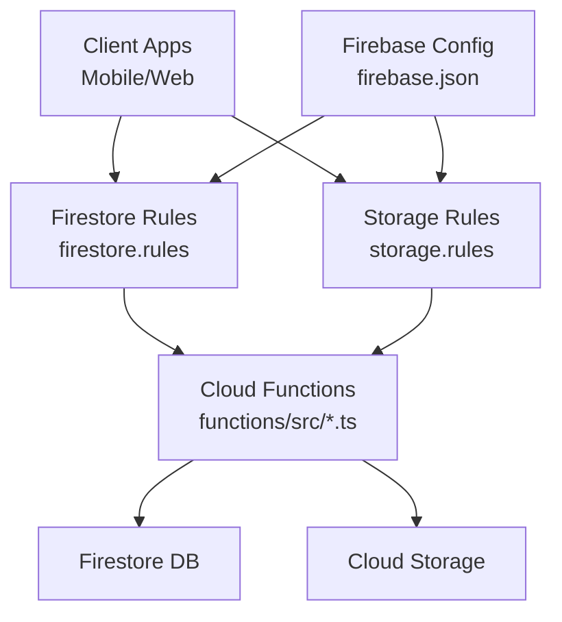
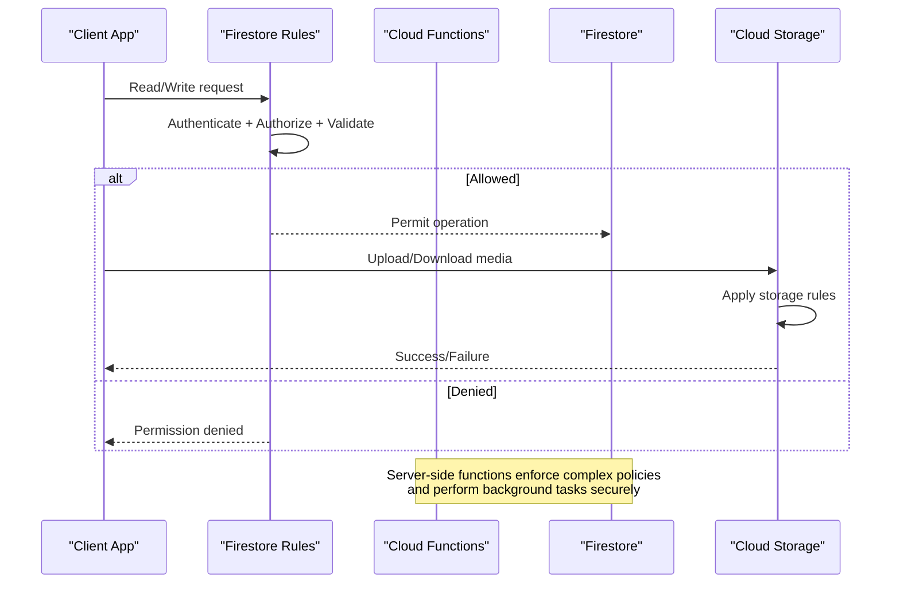
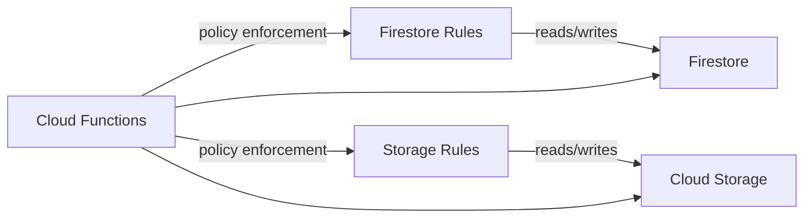

# Security Rules & Access Control

<cite>
**Referenced Files in This Document**
- [firestore.rules](file://firestore.rules)
- [storage.rules](file://storage.rules)
- [firebase.json](file://firebase.json)
- [functions/index.ts](file://functions/src/index.ts)
- [functions/memberAccessPolicy.ts](file://functions/src/memberAccessPolicy.ts)
- [functions/churchTenantFields.ts](file://functions/src/churchTenantFields.ts)
- [functions/churchTenantProvisioning.ts](file://functions/src/churchTenantProvisioning.ts)
- [functions/tenantCallableResolve.ts](file://functions/src/tenantCallableResolve.ts)
- [scripts/deploy_firebase_rules.ps1](file://scripts/deploy_firebase_rules.ps1)
- [security_rules_test_firestore/test/firestore.rules.test.js](file://security_rules_test_firestore/test/firestore.rules.test.js)
</cite>

## Table of Contents
1. [Introduction](#introduction)
2. [Project Structure](#project-structure)
3. [Core Components](#core-components)
4. [Architecture Overview](#architecture-overview)
5. [Detailed Component Analysis](#detailed-component-analysis)
6. [Dependency Analysis](#dependency-analysis)
7. [Performance Considerations](#performance-considerations)
8. [Troubleshooting Guide](#troubleshooting-guide)
9. [Conclusion](#conclusion)
10. [Appendices](#appendices)

## Introduction
This document provides comprehensive security rules documentation for Firestore access control in the project. It explains the complete security rule structure, authentication checks, authorization policies, and tenant isolation mechanisms. It also covers role-based access control (RBAC), church-specific permissions, data validation rules, and security patterns for member management, financial data protection, and chat privacy. Additionally, it includes examples of complex security conditions, batch operation security, background function security contexts, testing approaches, and common vulnerability prevention strategies.

## Project Structure
The security configuration is primarily defined in two files:
- Firestore security rules: firestore.rules
- Storage security rules: storage.rules

These are referenced by the Firebase configuration file firebase.json which wires up the rules to the project. Cloud Functions provide server-side enforcement and helper logic that complement client-side rules.

**Diagram sources**
- [firebase.json](file://firebase.json)
- [firestore.rules](file://firestore.rules)
- [storage.rules](file://storage.rules)
- [functions/src/index.ts](file://functions/src/index.ts)

**Section sources**
- [firebase.json](file://firebase.json)
- [firestore.rules](file://firestore.rules)
- [storage.rules](file://storage.rules)

## Core Components
- Authentication checks: Validate user identity and provider tokens before granting any access.
- Authorization policies: Enforce RBAC per church tenant and role (e.g., admin, pastor, treasurer).
- Tenant isolation: Ensure requests only access resources within the authenticated church’s scope.
- Data validation: Enforce field types, required fields, and value constraints at write time.
- Batch operations: Securely handle multi-document writes with consistent policy checks.
- Background functions: Run with elevated privileges under strict server-side checks.

Key implementation anchors:
- Firestore rules define read/write guards, path scoping, and validation expressions.
- Storage rules enforce file-level access tied to church and user roles.
- Cloud Functions implement business logic and additional policy enforcement not possible in rules alone.

**Section sources**
- [firestore.rules](file://firestore.rules)
- [storage.rules](file://storage.rules)
- [functions/src/index.ts](file://functions/src/index.ts)

## Architecture Overview
The security architecture combines client-side rules with server-side functions to ensure robust access control across tenants and roles.

**Diagram sources**
- [firestore.rules](file://firestore.rules)
- [storage.rules](file://storage.rules)
- [functions/src/index.ts](file://functions/src/index.ts)

## Detailed Component Analysis

### Firestore Security Rules
- Authentication: Require valid Firebase Auth token; reject anonymous or unauthenticated requests where sensitive data is accessed.
- Authorization: Check user roles and membership within a specific church tenant; deny cross-tenant access.
- Validation: Enforce schema constraints on writes (e.g., numeric ranges, required fields, allowed enums).
- Path scoping: Restrict operations to paths that include the authenticated church ID and user ID.
- Batch operations: Ensure each write in a batch satisfies all rules independently.

Patterns:
- Role-based checks using custom claims or role fields in user profiles.
- Church-scoped paths like /igrejas/{churchId}/... to isolate tenants.
- Conditional reads/writes based on ownership and permissions.

**Section sources**
- [firestore.rules](file://firestore.rules)

### Storage Security Rules
- File-level access tied to church and user identifiers.
- Media upload/download restricted to authorized users within the same church context.
- Validation of file metadata and content types where applicable.

Patterns:
- Path prefixes per church and user to prevent cross-tenant leaks.
- Time-bound access for temporary uploads when needed.

**Section sources**
- [storage.rules](file://storage.rules)

### Cloud Functions Security Contexts
- Admin functions run with elevated privileges but must validate inputs and enforce policies server-side.
- Callable functions should re-check auth and authorization even if client calls them directly.
- Scheduled/background functions operate without user context; they must use service accounts and internal checks.

Key modules:
- Member access policy enforcement and resolution helpers.
- Church tenant provisioning and field backfills.
- Tenant resolution for callable endpoints.

**Section sources**
- [functions/src/index.ts](file://functions/src/index.ts)
- [functions/src/memberAccessPolicy.ts](file://functions/src/memberAccessPolicy.ts)
- [functions/src/churchTenantFields.ts](file://functions/src/churchTenantFields.ts)
- [functions/src/churchTenantProvisioning.ts](file://functions/src/churchTenantProvisioning.ts)
- [functions/src/tenantCallableResolve.ts](file://functions/src/tenantCallableResolve.ts)

### Role-Based Access Control (RBAC)
- Roles: admin, pastor, treasurer, member, visitor.
- Permissions:
  - Admin: full access to church resources.
  - Pastor: pastoral communications and member management.
  - Treasurer: financial data access and reporting.
  - Member: limited profile and chat access.
  - Visitor: public-facing read-only access.

Implementation:
- Role checks in Firestore rules using user attributes or database fields.
- Function-level authorization for sensitive operations.

**Section sources**
- [functions/src/memberAccessPolicy.ts](file://functions/src/memberAccessPolicy.ts)

### Church-Specific Permissions and Tenant Isolation
- All paths scoped under /igrejas/{churchId}.
- Cross-tenant access denied unless explicitly permitted by admin functions.
- Membership verification ensures users belong to the target church.

Patterns:
- Use church canonical IDs and aliases consistently.
- Backfill tenant fields to maintain consistency.

**Section sources**
- [functions/src/churchTenantFields.ts](file://functions/src/churchTenantFields.ts)
- [functions/src/churchTenantProvisioning.ts](file://functions/src/churchTenantProvisioning.ts)

### Data Validation Rules
- Required fields: e.g., name, email, role, churchId.
- Type checks: strings, numbers, booleans, timestamps.
- Value constraints: email format, phone number patterns, numeric ranges for financial amounts.
- Enum validation: status fields, priority levels.

Enforcement:
- Write-time validation in Firestore rules.
- Additional server-side validation in Cloud Functions.

**Section sources**
- [firestore.rules](file://firestore.rules)
- [functions/src/memberAccessPolicy.ts](file://functions/src/memberAccessPolicy.ts)

### Member Management Security Patterns
- Profile updates restricted to self or admins.
- Directory visibility controlled by church settings.
- Sensitive fields (CPF, bank details) protected from general access.

**Section sources**
- [functions/src/memberAccessPolicy.ts](file://functions/src/memberAccessPolicy.ts)

### Financial Data Protection
- Access limited to treasurer and admin roles.
- Audit logs for all financial writes.
- Validation of transaction integrity and balances.

**Section sources**
- [firestore.rules](file://firestore.rules)

### Chat Privacy
- DM threads scoped to participants’ church and user IDs.
- Message creation validated for sender identity and recipient membership.
- Retention and purge policies enforced via functions.

**Section sources**
- [firestore.rules](file://firestore.rules)
- [functions/src/churchChatAdminPurge.ts](file://functions/src/churchChatAdminPurge.ts)

### Complex Security Conditions
- Multi-field checks combining role, church membership, and resource ownership.
- Conditional access based on time-sensitive flags (e.g., event participation).
- Deny-by-default with explicit allow-lists for privileged operations.

**Section sources**
- [firestore.rules](file://firestore.rules)

### Batch Operation Security
- Each write in a batch must satisfy all rules independently.
- Avoid partial success scenarios by validating preconditions.
- Use transactions for atomic updates with consistent checks.

**Section sources**
- [firestore.rules](file://firestore.rules)

### Background Function Security Contexts
- No user context; rely on service account credentials.
- Strict input validation and authorization checks.
- Minimal privilege principle: only access necessary collections.

**Section sources**
- [functions/src/index.ts](file://functions/src/index.ts)

## Dependency Analysis
Security components interact through well-defined boundaries:
- Firestore rules depend on authentication state and database schema.
- Storage rules depend on file paths and user context.
- Cloud functions depend on Firestore and Storage APIs, enforcing policies beyond rules.

**Diagram sources**
- [firestore.rules](file://firestore.rules)
- [storage.rules](file://storage.rules)
- [functions/src/index.ts](file://functions/src/index.ts)

**Section sources**
- [firestore.rules](file://firestore.rules)
- [storage.rules](file://storage.rules)
- [functions/src/index.ts](file://functions/src/index.ts)

## Performance Considerations
- Minimize expensive lookups in rules; prefer indexed fields.
- Cache frequently accessed policy data where appropriate.
- Use structured paths to reduce wildcard scans.
- Avoid heavy computations in rules; offload to functions.

[No sources needed since this section provides general guidance]

## Troubleshooting Guide
Common issues and resolutions:
- Permission denied errors: Verify auth token validity and role assignments.
- Cross-tenant access attempts: Ensure churchId matches the authenticated user’s tenant.
- Validation failures: Check schema constraints and required fields.
- Batch operation inconsistencies: Validate all writes meet rules; consider transactions.

Testing approach:
- Use the provided test suite to simulate various access scenarios.
- Deploy rules incrementally and monitor logs for denials.

Deployment:
- Use scripts to deploy updated rules safely.

**Section sources**
- [security_rules_test_firestore/test/firestore.rules.test.js](file://security_rules_test_firestore/test/firestore.rules.test.js)
- [scripts/deploy_firebase_rules.ps1](file://scripts/deploy_firebase_rules.ps1)

## Conclusion
The security model combines Firestore and Storage rules with Cloud Functions to enforce robust, tenant-isolated, role-based access control. By adhering to these patterns and continuously testing, the system maintains strong data protection and operational integrity across member management, financial data, and chat features.

[No sources needed since this section summarizes without analyzing specific files]

## Appendices
- Deployment scripts for rules updates.
- Test suite usage instructions.
- Reference to tenant provisioning and field backfill processes.

**Section sources**
- [scripts/deploy_firebase_rules.ps1](file://scripts/deploy_firebase_rules.ps1)
- [security_rules_test_firestore/test/firestore.rules.test.js](file://security_rules_test_firestore/test/firestore.rules.test.js)
- [functions/src/churchTenantProvisioning.ts](file://functions/src/churchTenantProvisioning.ts)
- [functions/src/churchTenantFields.ts](file://functions/src/churchTenantFields.ts)