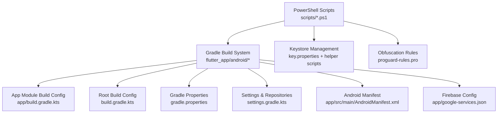
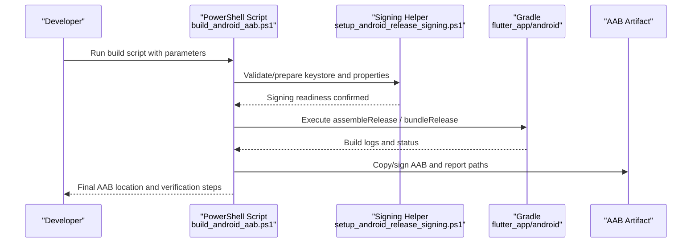
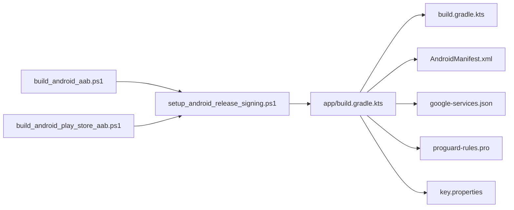

# Android Build Process

<cite>
**Referenced Files in This Document**
- [build_android_aab.ps1](file://scripts/build_android_aab.ps1)
- [build_android_play_store_aab.ps1](file://scripts/build_android_play_store_aab.ps1)
- [setup_android_release_signing.ps1](file://scripts/setup_android_release_signing.ps1)
- [print_keystore_fingerprints.ps1](file://scripts/print_keystore_fingerprints.ps1)
- [android/app/build.gradle.kts](file://flutter_app/android/app/build.gradle.kts)
- [android/build.gradle.kts](file://flutter_app/android/build.gradle.kts)
- [android/gradle.properties](file://flutter_app/android/gradle.properties)
- [android/settings.gradle.kts](file://flutter_app/android/settings.gradle.kts)
- [android/key.properties](file://flutter_app/android/key.properties)
- [android/key.properties.example](file://flutter_app/android/key.properties.example)
- [android/app/proguard-rules.pro](file://flutter_app/android/app/proguard-rules.pro)
- [android/app/src/main/AndroidManifest.xml](file://flutter_app/android/app/src/main/AndroidManifest.xml)
- [android/app/google-services.json](file://flutter_app/android/app/google-services.json)
- [android/local.properties](file://flutter_app/android/local.properties)
</cite>

## Table of Contents
1. [Introduction](#introduction)
2. [Project Structure](#project-structure)
3. [Core Components](#core-components)
4. [Architecture Overview](#architecture-overview)
5. [Detailed Component Analysis](#detailed-component-analysis)
6. [Dependency Analysis](#dependency-analysis)
7. [Performance Considerations](#performance-considerations)
8. [Troubleshooting Guide](#troubleshooting-guide)
9. [Conclusion](#conclusion)
10. [Appendices](#appendices)

## Introduction
This document explains the Android build process for generating an Android App Bundle (AAB), signing, and preparing for Google Play Store deployment. It covers the PowerShell build scripts, Gradle configuration, keystore management, ProGuard rules, and environment setup. It also provides troubleshooting guidance and tips for customizing build variants across environments.

## Project Structure
The Android build is implemented under flutter_app/android with Gradle Kotlin DSL files and a set of PowerShell automation scripts in the repository root scripts directory. The key artifacts are:
- Build scripts: build_android_aab.ps1, build_android_play_store_aab.ps1
- Signing helpers: setup_android_release_signing.ps1, print_keystore_fingerprints.ps1
- Gradle configs: app/build.gradle.kts, build.gradle.kts, gradle.properties, settings.gradle.kts
- Signing properties: key.properties (and example template)
- Obfuscation: proguard-rules.pro
- Manifest and Firebase config: AndroidManifest.xml, google-services.json

**Diagram sources**
- [build_android_aab.ps1](file://scripts/build_android_aab.ps1)
- [build_android_play_store_aab.ps1](file://scripts/build_android_play_store_aab.ps1)
- [setup_android_release_signing.ps1](file://scripts/setup_android_release_signing.ps1)
- [print_keystore_fingerprints.ps1](file://scripts/print_keystore_fingerprints.ps1)
- [android/app/build.gradle.kts](file://flutter_app/android/app/build.gradle.kts)
- [android/build.gradle.kts](file://flutter_app/android/build.gradle.kts)
- [android/gradle.properties](file://flutter_app/android/gradle.properties)
- [android/settings.gradle.kts](file://flutter_app/android/settings.gradle.kts)
- [android/app/src/main/AndroidManifest.xml](file://flutter_app/android/app/src/main/AndroidManifest.xml)
- [android/app/google-services.json](file://flutter_app/android/app/google-services.json)

**Section sources**
- [build_android_aab.ps1](file://scripts/build_android_aab.ps1)
- [build_android_play_store_aab.ps1](file://scripts/build_android_play_store_aab.ps1)
- [android/app/build.gradle.kts](file://flutter_app/android/app/build.gradle.kts)
- [android/build.gradle.kts](file://flutter_app/android/build.gradle.kts)
- [android/gradle.properties](file://flutter_app/android/gradle.properties)
- [android/settings.gradle.kts](file://flutter_app/android/settings.gradle.kts)
- [android/app/src/main/AndroidManifest.xml](file://flutter_app/android/app/src/main/AndroidManifest.xml)
- [android/app/google-services.json](file://flutter_app/android/app/google-services.json)

## Core Components
- Build orchestration scripts:
  - build_android_aab.ps1: Orchestrates AAB generation, optional signing, and output handling.
  - build_android_play_store_aab.ps1: Extends or adapts the base flow for Play Store-specific requirements.
- Signing utilities:
  - setup_android_release_signing.ps1: Prepares signing inputs and validates keystore presence.
  - print_keystore_fingerprints.ps1: Prints SHA fingerprints to verify keystore identity.
- Gradle configuration:
  - app/build.gradle.kts: Defines applicationId, versioning, signingConfigs, buildTypes, and dependencies.
  - build.gradle.kts: Aggregates project-level plugins and repositories.
  - gradle.properties: JVM and Gradle performance flags.
  - settings.gradle.kts: Includes modules and plugin management.
- Signing properties:
  - key.properties: Stores keystore path, alias, and passwords securely outside source control.
  - key.properties.example: Template for local configuration.
- Obfuscation:
  - proguard-rules.pro: Minification and obfuscation rules for release builds.
- Platform manifests and configs:
  - AndroidManifest.xml: Declares permissions, components, and metadata.
  - google-services.json: Firebase integration configuration.

**Section sources**
- [build_android_aab.ps1](file://scripts/build_android_aab.ps1)
- [build_android_play_store_aab.ps1](file://scripts/build_android_play_store_aab.ps1)
- [setup_android_release_signing.ps1](file://scripts/setup_android_release_signing.ps1)
- [print_keystore_fingerprints.ps1](file://scripts/print_keystore_fingerprints.ps1)
- [android/app/build.gradle.kts](file://flutter_app/android/app/build.gradle.kts)
- [android/build.gradle.kts](file://flutter_app/android/build.gradle.kts)
- [android/gradle.properties](file://flutter_app/android/gradle.properties)
- [android/settings.gradle.kts](file://flutter_app/android/settings.gradle.kts)
- [android/key.properties](file://flutter_app/android/key.properties)
- [android/key.properties.example](file://flutter_app/android/key.properties.example)
- [android/app/proguard-rules.pro](file://flutter_app/android/app/proguard-rules.pro)
- [android/app/src/main/AndroidManifest.xml](file://flutter_app/android/app/src/main/AndroidManifest.xml)
- [android/app/google-services.json](file://flutter_app/android/app/google-services.json)

## Architecture Overview
The Android build pipeline integrates PowerShell automation with Gradle to produce signed AABs suitable for Google Play. The scripts handle environment validation, keystore setup, and invoking Gradle tasks. Gradle compiles Flutter-generated Android code, applies resource merging, and executes ProGuard/R8 for release builds.

**Diagram sources**
- [build_android_aab.ps1](file://scripts/build_android_aab.ps1)
- [setup_android_release_signing.ps1](file://scripts/setup_android_release_signing.ps1)
- [android/app/build.gradle.kts](file://flutter_app/android/app/build.gradle.kts)

## Detailed Component Analysis

### Build Orchestration Scripts
- build_android_aab.ps1
  - Purpose: Central entry point to generate an AAB, optionally sign it, and manage outputs.
  - Typical parameters:
    - --variant: Specifies build variant (e.g., release).
    - --sign: Enables signing using key.properties.
    - --keystore-path: Path to keystore file.
    - --keystore-password: Keystore password.
    - --key-alias: Alias name.
    - --key-password: Key password.
    - --output-dir: Destination folder for generated artifacts.
    - --verbose: Enables detailed logging.
  - Behavior:
    - Validates environment (Flutter, Java/Kotlin toolchain, Gradle wrapper).
    - Invokes setup_android_release_signing.ps1 when signing is requested.
    - Executes Gradle tasks to assemble/bundle the release variant.
    - Copies final AAB to the specified output directory.
  - Error handling:
    - Checks exit codes from Gradle and helper scripts.
    - Provides actionable messages for missing keystore, invalid credentials, or build failures.

- build_android_play_store_aab.ps1
  - Purpose: Tailored flow for Play Store submission, ensuring compliance with platform requirements.
  - Typical parameters:
    - Inherits parameters from the base AAB script.
    - Additional flags may enforce Play-specific checks (e.g., manifest metadata, version alignment).
  - Behavior:
    - Runs preflight validations for Play Store constraints.
    - Builds and signs the AAB.
    - Optionally verifies APK/AAB structure and metadata before upload.

**Section sources**
- [build_android_aab.ps1](file://scripts/build_android_aab.ps1)
- [build_android_play_store_aab.ps1](file://scripts/build_android_play_store_aab.ps1)

### Signing Configuration and Keystore Management
- setup_android_release_signing.ps1
  - Responsibilities:
    - Ensures key.properties exists and contains required fields.
    - Validates keystore file accessibility and alias existence.
    - Exports environment variables or temporary files for Gradle signing.
  - Inputs:
    - Keystore path, alias, and passwords provided via parameters or interactive prompts.
  - Outputs:
    - Signing-ready environment for Gradle tasks.

- print_keystore_fingerprints.ps1
  - Responsibilities:
    - Computes and prints SHA-1/SHA-256 fingerprints for the keystore.
    - Useful for verifying Firebase or other service integrations.

- key.properties and key.properties.example
  - key.properties: Local-only file containing keystorePath, storePassword, keyAlias, keyPassword.
  - key.properties.example: Template to copy and fill locally; never commit secrets.

- Gradle signing integration
  - app/build.gradle.kts defines signingConfigs and applies them to release buildType.
  - Uses key.properties to inject credentials at build time.

**Section sources**
- [setup_android_release_signing.ps1](file://scripts/setup_android_release_signing.ps1)
- [print_keystore_fingerprints.ps1](file://scripts/print_keystore_fingerprints.ps1)
- [android/key.properties](file://flutter_app/android/key.properties)
- [android/key.properties.example](file://flutter_app/android/key.properties.example)
- [android/app/build.gradle.kts](file://flutter_app/android/app/build.gradle.kts)

### Gradle Configuration and Build Variants
- app/build.gradle.kts
  - Defines applicationId, versionName, versionCode.
  - Configures signingConfigs and applies to release buildType.
  - Sets minifyEnabled and shrinkResources for release builds.
  - Integrates Firebase via google-services.json.

- build.gradle.kts (root)
  - Declares Android and Kotlin plugins.
  - Configures repositories and dependency versions.

- gradle.properties
  - JVM arguments for faster builds.
  - AndroidX and Kotlin flags.

- settings.gradle.kts
  - Includes modules and plugin management.

- AndroidManifest.xml
  - Declares permissions, activities, services, and metadata required by the app and Firebase.

- google-services.json
  - Firebase project configuration used during build-time processing.

**Section sources**
- [android/app/build.gradle.kts](file://flutter_app/android/app/build.gradle.kts)
- [android/build.gradle.kts](file://flutter_app/android/build.gradle.kts)
- [android/gradle.properties](file://flutter_app/android/gradle.properties)
- [android/settings.gradle.kts](file://flutter_app/android/settings.gradle.kts)
- [android/app/src/main/AndroidManifest.xml](file://flutter_app/android/app/src/main/AndroidManifest.xml)
- [android/app/google-services.json](file://flutter_app/android/app/google-services.json)

### ProGuard Rules and Obfuscation
- proguard-rules.pro
  - Contains rules to keep necessary classes, methods, and resources.
  - Excludes reflection-heavy libraries and Firebase components where needed.
  - Optimizes bytecode and removes unused code for release builds.

Best practices:
- Keep only what is strictly required to avoid runtime issues.
- Test thoroughly after enabling minification and shrinking.
- Add specific keep rules for third-party SDKs that rely on reflection or serialization.

**Section sources**
- [android/app/proguard-rules.pro](file://flutter_app/android/app/proguard-rules.pro)
- [android/app/build.gradle.kts](file://flutter_app/android/app/build.gradle.kts)

### Environment Setup
- Required tools:
  - Flutter SDK installed and available in PATH.
  - Java JDK compatible with Android Gradle Plugin (typically JDK 17+).
  - Android SDK and command-line tools.
  - Gradle wrapper present in flutter_app/android.

- Local properties:
  - android/local.properties should point to Android SDK path.

- Secrets management:
  - Never commit key.properties or keystore files.
  - Use environment variables or secure secret stores in CI/CD.

**Section sources**
- [android/local.properties](file://flutter_app/android/local.properties)
- [android/key.properties](file://flutter_app/android/key.properties)
- [android/key.properties.example](file://flutter_app/android/key.properties.example)

## Dependency Analysis
The build pipeline depends on:
- PowerShell scripts orchestrating Gradle tasks.
- Gradle Kotlin DSL for Android module configuration.
- Keystore and signing properties for release builds.
- Firebase configuration for runtime features.

**Diagram sources**
- [build_android_aab.ps1](file://scripts/build_android_aab.ps1)
- [build_android_play_store_aab.ps1](file://scripts/build_android_play_store_aab.ps1)
- [setup_android_release_signing.ps1](file://scripts/setup_android_release_signing.ps1)
- [android/app/build.gradle.kts](file://flutter_app/android/app/build.gradle.kts)
- [android/build.gradle.kts](file://flutter_app/android/build.gradle.kts)
- [android/app/src/main/AndroidManifest.xml](file://flutter_app/android/app/src/main/AndroidManifest.xml)
- [android/app/google-services.json](file://flutter_app/android/app/google-services.json)
- [android/app/proguard-rules.pro](file://flutter_app/android/app/proguard-rules.pro)
- [android/key.properties](file://flutter_app/android/key.properties)

**Section sources**
- [build_android_aab.ps1](file://scripts/build_android_aab.ps1)
- [build_android_play_store_aab.ps1](file://scripts/build_android_play_store_aab.ps1)
- [setup_android_release_signing.ps1](file://scripts/setup_android_release_signing.ps1)
- [android/app/build.gradle.kts](file://flutter_app/android/app/build.gradle.kts)
- [android/build.gradle.kts](file://flutter_app/android/build.gradle.kts)
- [android/app/src/main/AndroidManifest.xml](file://flutter_app/android/app/src/main/AndroidManifest.xml)
- [android/app/google-services.json](file://flutter_app/android/app/google-services.json)
- [android/app/proguard-rules.pro](file://flutter_app/android/app/proguard-rules.pro)
- [android/key.properties](file://flutter_app/android/key.properties)

## Performance Considerations
- Enable Gradle daemon and configure JVM heap in gradle.properties.
- Use incremental builds and cache dependencies.
- Apply ProGuard/R8 for release builds to reduce size and improve startup.
- Avoid heavy native libraries unless necessary.
- Profile app startup and memory usage using Android Studio Profiler.

[No sources needed since this section provides general guidance]

## Troubleshooting Guide
Common issues and resolutions:
- Missing or invalid keystore:
  - Ensure key.properties has correct paths and passwords.
  - Use print_keystore_fingerprints.ps1 to verify fingerprint matches Firebase or other services.
- Gradle build failures:
  - Check Java/Kotlin toolchain compatibility.
  - Review Gradle logs for dependency resolution errors.
- ProGuard-related crashes:
  - Add keep rules for reflection-heavy libraries.
  - Test release builds thoroughly after enabling minification.
- Firebase integration problems:
  - Verify google-services.json matches the current applicationId.
  - Re-run Firebase setup if package name changes.
- Version mismatches:
  - Align versionName and versionCode between Flutter and Android Gradle.
  - Ensure Play Store metadata aligns with bundle metadata.

**Section sources**
- [print_keystore_fingerprints.ps1](file://scripts/print_keystore_fingerprints.ps1)
- [android/app/build.gradle.kts](file://flutter_app/android/app/build.gradle.kts)
- [android/app/google-services.json](file://flutter_app/android/app/google-services.json)
- [android/app/proguard-rules.pro](file://flutter_app/android/app/proguard-rules.pro)

## Conclusion
The Android build process combines PowerShell automation with Gradle to produce signed AABs ready for Google Play. Proper keystore management, robust Gradle configuration, and careful ProGuard rules ensure reliable releases. Follow the troubleshooting guide to resolve common issues and optimize performance for production deployments.

[No sources needed since this section summarizes without analyzing specific files]

## Appendices

### Build Variant Customization
- Define multiple build types or product flavors in app/build.gradle.kts to target different environments (debug, release, staging).
- Use environment-specific configurations such as separate google-services.json files per flavor.
- Leverage Gradle properties to toggle features or endpoints.

**Section sources**
- [android/app/build.gradle.kts](file://flutter_app/android/app/build.gradle.kts)
- [android/app/google-services.json](file://flutter_app/android/app/google-services.json)

### Play Store Deployment Checklist
- Generate signed AAB using build_android_play_store_aab.ps1.
- Verify app metadata (title, description, screenshots) in Play Console.
- Confirm data safety form and privacy policy links.
- Upload AAB and monitor rollout progress.

**Section sources**
- [build_android_play_store_aab.ps1](file://scripts/build_android_play_store_aab.ps1)