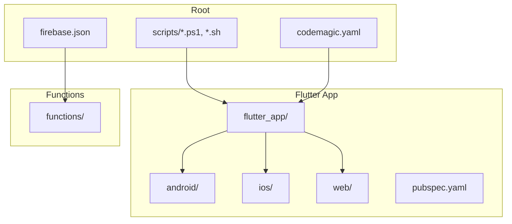
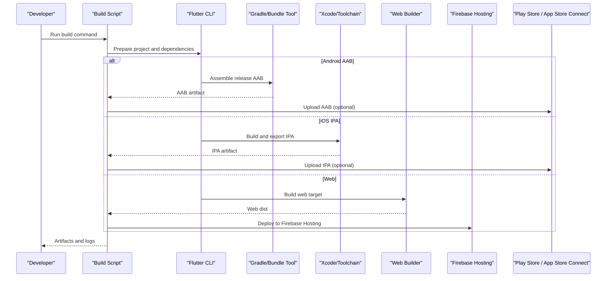
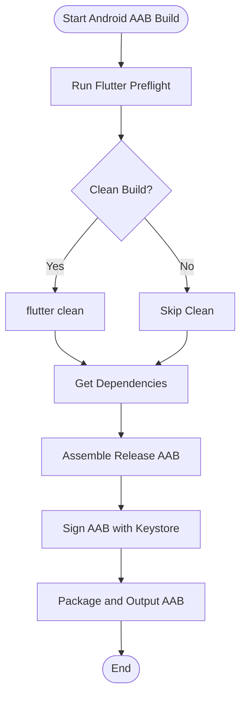
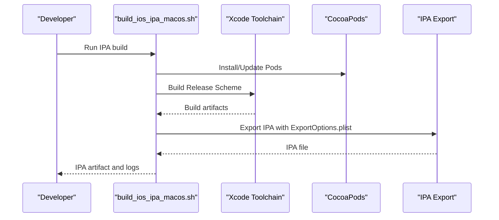
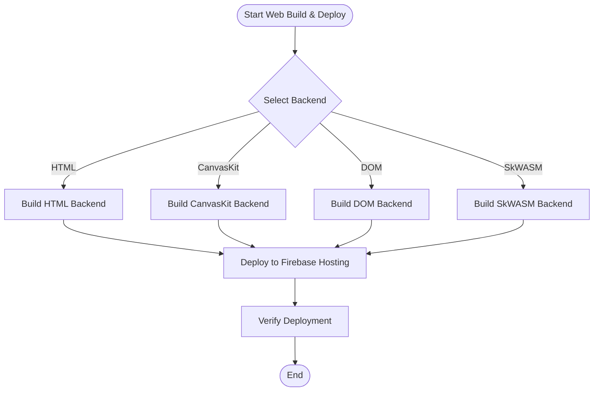
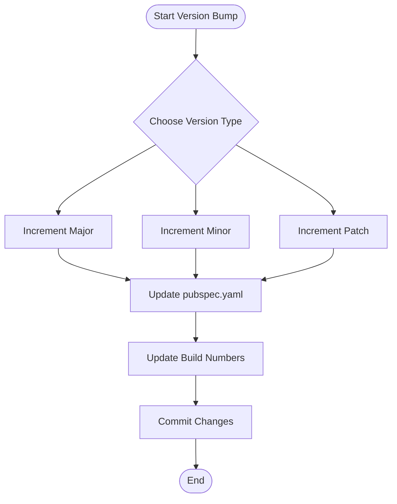
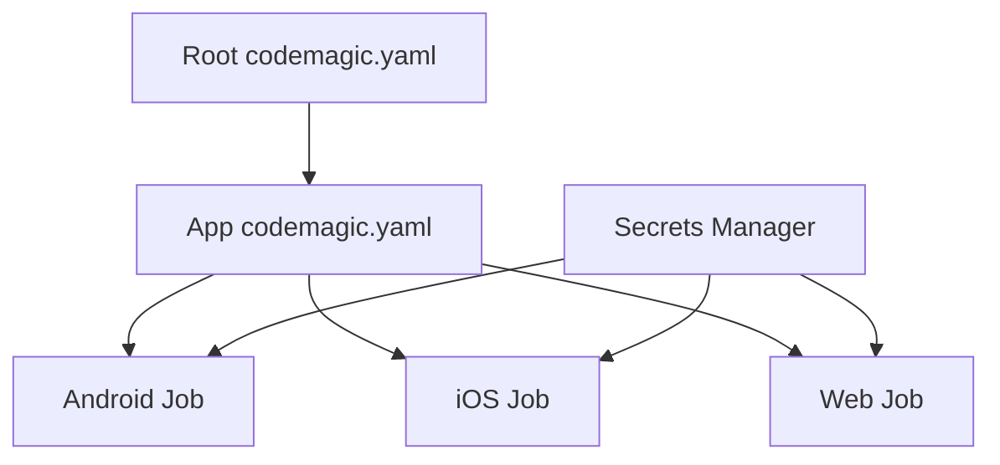
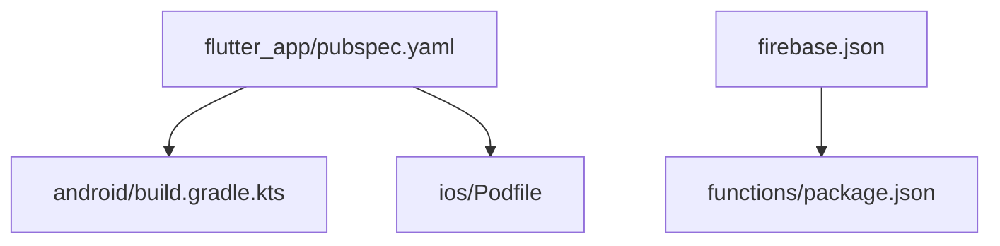

# Build Automation & Scripts

<cite>
**Referenced Files in This Document**
- [build_android_aab.ps1](file://scripts/build_android_aab.ps1)
- [build_android_play_store_aab.ps1](file://scripts/build_android_play_store_aab.ps1)
- [build_ios_ipa_macos.sh](file://scripts/build_ios_ipa_macos.sh)
- [build_e_deploy_web.ps1](file://scripts/build_e_deploy_web.ps1)
- [bump_version.ps1](file://scripts/bump_version.ps1)
- [bump_build.ps1](file://scripts/bump_build.ps1)
- [deploy_web_hosting.ps1](file://scripts/deploy_web_hosting.ps1)
- [deploy_web_hosting_canvaskit.ps1](file://scripts/deploy_web_hosting_canvaskit.ps1)
- [deploy_web_hosting_html.ps1](file://scripts/deploy_web_hosting_html.ps1)
- [deploy_web_hosting_html_dom.ps1](file://scripts/deploy_web_hosting_html_dom.ps1)
- [deploy_web_hosting_skwasm.ps1](file://scripts/deploy_web_hosting_skwasm.ps1)
- [codemagic.yaml](file://codemagic.yaml)
- [flutter_app/codemagic.yaml](file://flutter_app/codemagic.yaml)
- [flutter_app/pubspec.yaml](file://flutter_app/pubspec.yaml)
- [flutter_app/android/app/build.gradle.kts](file://flutter_app/android/app/build.gradle.kts)
- [flutter_app/android/build.gradle.kts](file://flutter_app/android/build.gradle.kts)
- [flutter_app/android/gradle.properties](file://flutter_app/android/gradle.properties)
- [flutter_app/android/key.properties](file://flutter_app/android/key.properties)
- [flutter_app/ios/ExportOptions.plist](file://flutter_app/ios/ExportOptions.plist)
- [flutter_app/ios/Podfile](file://flutter_app/ios/Podfile)
- [flutter_app/web/index.html](file://flutter_app/web/index.html)
- [flutter_app/web/flutter_bootstrap.js](file://flutter_app/web/flutter_bootstrap.js)
- [functions/package.json](file://functions/package.json)
- [firebase.json](file://firebase.json)
</cite>

## Table of Contents
1. [Introduction](#introduction)
2. [Project Structure](#project-structure)
3. [Core Components](#core-components)
4. [Architecture Overview](#architecture-overview)
5. [Detailed Component Analysis](#detailed-component-analysis)
6. [Dependency Analysis](#dependency-analysis)
7. [Performance Considerations](#performance-considerations)
8. [Troubleshooting Guide](#troubleshooting-guide)
9. [Conclusion](#conclusion)
10. [Appendices](#appendices)

## Introduction
This document explains the build automation for a multi-platform Flutter application, covering Android AAB builds, iOS IPA generation, Web deployment, and version bumping. It details script parameters, environment requirements, local execution examples, customization options, and troubleshooting strategies. It also covers incremental builds, optimization techniques, and debugging failures across platforms.

## Project Structure
The repository contains:
- Root-level scripts for end-to-end automation (PowerShell and shell scripts).
- A Flutter app under flutter_app with platform-specific configurations for Android, iOS, and Web.
- Cloud Functions and Firebase configuration files for hosting and backend integration.
- CodeMagic CI/CD configuration for automated builds and deployments.

**Diagram sources**
- [codemagic.yaml](file://codemagic.yaml)
- [flutter_app/codemagic.yaml](file://flutter_app/codemagic.yaml)
- [firebase.json](file://firebase.json)

**Section sources**
- [codemagic.yaml](file://codemagic.yaml)
- [flutter_app/codemagic.yaml](file://flutter_app/codemagic.yaml)
- [firebase.json](file://firebase.json)

## Core Components
- Android AAB build scripts: PowerShell scripts to assemble release AABs, sign with keystore, and optionally publish to Play Store.
- iOS IPA build script: Shell script to build and export an IPA using Xcode toolchain and signing assets.
- Web deployment scripts: Multiple variants targeting different Flutter web backends (HTML, CanvasKit, SkWASM, DOM), with optional CanvaKit optimizations.
- Version bumping scripts: PowerShell utilities to increment app version and build numbers consistently across platforms.
- CI/CD orchestration: CodeMagic YAML pipelines for automated builds and deployments.

**Section sources**
- [build_android_aab.ps1](file://scripts/build_android_aab.ps1)
- [build_android_play_store_aab.ps1](file://scripts/build_android_play_store_aab.ps1)
- [build_ios_ipa_macos.sh](file://scripts/build_ios_ipa_macos.sh)
- [build_e_deploy_web.ps1](file://scripts/build_e_deploy_web.ps1)
- [bump_version.ps1](file://scripts/bump_version.ps1)
- [bump_build.ps1](file://scripts/bump_build.ps1)
- [codemagic.yaml](file://codemagic.yaml)
- [flutter_app/codemagic.yaml](file://flutter_app/codemagic.yaml)

## Architecture Overview
The build system is orchestrated by root-level scripts that invoke Flutter tooling and platform-specific builders. CI/CD uses CodeMagic to run these scripts in cloud environments. The following diagram shows the high-level flow from developer commands to artifacts and deployments.

**Diagram sources**
- [build_android_aab.ps1](file://scripts/build_android_aab.ps1)
- [build_ios_ipa_macos.sh](file://scripts/build_ios_ipa_macos.sh)
- [build_e_deploy_web.ps1](file://scripts/build_e_deploy_web.ps1)
- [deploy_web_hosting.ps1](file://scripts/deploy_web_hosting.ps1)

## Detailed Component Analysis

### Android AAB Building
- Purpose: Produce signed Android App Bundle (AAB) for release distribution via Google Play.
- Key scripts:
  - build_android_aab.ps1: Orchestrates Flutter preflight, Gradle assemble, signing, and output packaging.
  - build_android_play_store_aab.ps1: Adds Play Store publishing steps after AAB creation.
- Parameters and flags:
  - Environment variables for keystore path, alias, passwords, and signing config.
  - Optional flags to skip preflight checks or force clean builds.
- Dependencies:
  - Flutter SDK, Java/Kotlin toolchain, Gradle wrapper, Android SDK.
  - Signing credentials stored securely (keystore and key.properties).
- Environment requirements:
  - Windows PowerShell for .ps1 scripts.
  - Properly configured Android SDK paths and JAVA_HOME.
- Local execution example:
  - Run the PowerShell script with appropriate environment variables set; verify outputs in the expected directory.
- Customization:
  - Adjust signing properties in key.properties.
  - Modify Gradle build settings in android/app/build.gradle.kts and android/build.gradle.kts.
- Optimization:
  - Use Gradle caching and parallel builds.
  - Enable ProGuard/R8 rules for size reduction.
- Debugging:
  - Inspect Gradle logs and Flutter analyze output.
  - Validate keystore fingerprints and permissions.

**Diagram sources**
- [build_android_aab.ps1](file://scripts/build_android_aab.ps1)
- [flutter_app/android/app/build.gradle.kts](file://flutter_app/android/app/build.gradle.kts)
- [flutter_app/android/build.gradle.kts](file://flutter_app/android/build.gradle.kts)
- [flutter_app/android/gradle.properties](file://flutter_app/android/gradle.properties)
- [flutter_app/android/key.properties](file://flutter_app/android/key.properties)

**Section sources**
- [build_android_aab.ps1](file://scripts/build_android_aab.ps1)
- [build_android_play_store_aab.ps1](file://scripts/build_android_play_store_aab.ps1)
- [flutter_app/android/app/build.gradle.kts](file://flutter_app/android/app/build.gradle.kts)
- [flutter_app/android/build.gradle.kts](file://flutter_app/android/build.gradle.kts)
- [flutter_app/android/gradle.properties](file://flutter_app/android/gradle.properties)
- [flutter_app/android/key.properties](file://flutter_app/android/key.properties)

### iOS IPA Generation
- Purpose: Build and export an iOS IPA for distribution via TestFlight/App Store Connect.
- Key script:
  - build_ios_ipa_macos.sh: Sets up Xcode toolchain, resolves pods, builds release, and exports IPA with ExportOptions.plist.
- Parameters and flags:
  - Environment variables for Apple ID, team ID, provisioning profiles, and certificate paths.
  - Flags to select scheme, configuration, and destination (device/simulator).
- Dependencies:
  - macOS host, Xcode command-line tools, CocoaPods, valid Apple certificates and profiles.
- Environment requirements:
  - macOS with proper signing setup and access to App Store Connect API keys if needed.
- Local execution example:
  - Execute the shell script on macOS with required secrets exported; verify IPA output.
- Customization:
  - Edit ExportOptions.plist for distribution method and signing details.
  - Update Podfile for dependency versions and deployment targets.
- Optimization:
  - Enable bitcode stripping and symbol upload for crash reporting.
  - Cache CocoaPods installations.
- Debugging:
  - Check Xcode build logs and pod install output.
  - Validate profile matching and entitlements.

**Diagram sources**
- [build_ios_ipa_macos.sh](file://scripts/build_ios_ipa_macos.sh)
- [flutter_app/ios/ExportOptions.plist](file://flutter_app/ios/ExportOptions.plist)
- [flutter_app/ios/Podfile](file://flutter_app/ios/Podfile)

**Section sources**
- [build_ios_ipa_macos.sh](file://scripts/build_ios_ipa_macos.sh)
- [flutter_app/ios/ExportOptions.plist](file://flutter_app/ios/ExportOptions.plist)
- [flutter_app/ios/Podfile](file://flutter_app/ios/Podfile)

### Web Deployment
- Purpose: Build Flutter Web and deploy to Firebase Hosting with multiple backend targets.
- Key scripts:
  - build_e_deploy_web.ps1: Orchestrates Flutter web build and deployment.
  - deploy_web_hosting.ps1: Deploys built web assets to Firebase Hosting.
  - deploy_web_hosting_canvaskit.ps1: Uses CanvasKit backend for better graphics performance.
  - deploy_web_hosting_html.ps1: HTML backend for minimal footprint.
  - deploy_web_hosting_html_dom.ps1: DOM backend for smaller bundle size.
  - deploy_web_hosting_skwasm.ps1: SkWASM backend for improved rendering.
- Parameters and flags:
  - Target selection (html, canvaskit, dom, skwasm).
  - Firebase project configuration and hosting site name.
- Dependencies:
  - Flutter SDK, Firebase CLI, Node.js for functions (if applicable).
- Environment requirements:
  - Cross-platform support for PowerShell scripts; ensure Firebase CLI is installed and authenticated.
- Local execution example:
  - Choose the desired backend script and run it; verify deployment status via Firebase console.
- Customization:
  - Modify web/index.html and flutter_bootstrap.js for bootstrap behavior.
  - Adjust firebase.json for hosting rules and redirects.
- Optimization:
  - Select appropriate backend based on device capabilities and performance needs.
  - Enable compression and caching headers in hosting configuration.
- Debugging:
  - Inspect browser devtools and Firebase hosting logs.
  - Validate asset loading and service worker behavior.

**Diagram sources**
- [build_e_deploy_web.ps1](file://scripts/build_e_deploy_web.ps1)
- [deploy_web_hosting.ps1](file://scripts/deploy_web_hosting.ps1)
- [deploy_web_hosting_canvaskit.ps1](file://scripts/deploy_web_hosting_canvaskit.ps1)
- [deploy_web_hosting_html.ps1](file://scripts/deploy_web_hosting_html.ps1)
- [deploy_web_hosting_html_dom.ps1](file://scripts/deploy_web_hosting_html_dom.ps1)
- [deploy_web_hosting_skwasm.ps1](file://scripts/deploy_web_hosting_skwasm.ps1)
- [flutter_app/web/index.html](file://flutter_app/web/index.html)
- [flutter_app/web/flutter_bootstrap.js](file://flutter_app/web/flutter_bootstrap.js)
- [firebase.json](file://firebase.json)

**Section sources**
- [build_e_deploy_web.ps1](file://scripts/build_e_deploy_web.ps1)
- [deploy_web_hosting.ps1](file://scripts/deploy_web_hosting.ps1)
- [deploy_web_hosting_canvaskit.ps1](file://scripts/deploy_web_hosting_canvaskit.ps1)
- [deploy_web_hosting_html.ps1](file://scripts/deploy_web_hosting_html.ps1)
- [deploy_web_hosting_html_dom.ps1](file://scripts/deploy_web_hosting_html_dom.ps1)
- [deploy_web_hosting_skwasm.ps1](file://scripts/deploy_web_hosting_skwasm.ps1)
- [flutter_app/web/index.html](file://flutter_app/web/index.html)
- [flutter_app/web/flutter_bootstrap.js](file://flutter_app/web/flutter_bootstrap.js)
- [firebase.json](file://firebase.json)

### Version Bumping Processes
- Purpose: Increment app version and build numbers consistently across platforms before releases.
- Key scripts:
  - bump_version.ps1: Updates semantic versioning in pubspec.yaml and platform manifests.
  - bump_build.ps1: Increments build numbers for Android and iOS.
- Parameters and flags:
  - Version type (major, minor, patch) for semantic versioning.
  - Build number increment strategy.
- Dependencies:
  - Flutter tooling and file manipulation utilities.
- Environment requirements:
  - Cross-platform PowerShell execution.
- Local execution example:
  - Run the version bump script with specified parameters; commit changes to version files.
- Customization:
  - Adjust versioning logic in scripts to match project conventions.
- Optimization:
  - Integrate with CI/CD to automate version increments on tags.
- Debugging:
  - Verify updated versions in pubspec.yaml and platform configs.

**Diagram sources**
- [bump_version.ps1](file://scripts/bump_version.ps1)
- [bump_build.ps1](file://scripts/bump_build.ps1)
- [flutter_app/pubspec.yaml](file://flutter_app/pubspec.yaml)

**Section sources**
- [bump_version.ps1](file://scripts/bump_version.ps1)
- [bump_build.ps1](file://scripts/bump_build.ps1)
- [flutter_app/pubspec.yaml](file://flutter_app/pubspec.yaml)

### CI/CD Orchestration with CodeMagic
- Purpose: Automate builds and deployments in cloud environments.
- Configuration files:
  - codemagic.yaml at root and flutter_app level define workflows for Android, iOS, and Web.
- Workflows:
  - Trigger builds on push/PR events.
  - Set up environments (Flutter, Android SDK, Xcode, CocoaPods).
  - Execute build scripts and upload artifacts.
- Integration points:
  - Secrets management for signing and API keys.
  - Notifications and artifact storage.

**Diagram sources**
- [codemagic.yaml](file://codemagic.yaml)
- [flutter_app/codemagic.yaml](file://flutter_app/codemagic.yaml)

**Section sources**
- [codemagic.yaml](file://codemagic.yaml)
- [flutter_app/codemagic.yaml](file://flutter_app/codemagic.yaml)

## Dependency Analysis
The build system depends on:
- Flutter SDK and plugins defined in pubspec.yaml.
- Android Gradle and signing configuration.
- iOS Xcode toolchain and CocoaPods.
- Firebase CLI and hosting configuration.
- Cloud Functions package dependencies.

**Diagram sources**
- [flutter_app/pubspec.yaml](file://flutter_app/pubspec.yaml)
- [flutter_app/android/build.gradle.kts](file://flutter_app/android/build.gradle.kts)
- [flutter_app/ios/Podfile](file://flutter_app/ios/Podfile)
- [firebase.json](file://firebase.json)
- [functions/package.json](file://functions/package.json)

**Section sources**
- [flutter_app/pubspec.yaml](file://flutter_app/pubspec.yaml)
- [flutter_app/android/build.gradle.kts](file://flutter_app/android/build.gradle.kts)
- [flutter_app/ios/Podfile](file://flutter_app/ios/Podfile)
- [firebase.json](file://firebase.json)
- [functions/package.json](file://functions/package.json)

## Performance Considerations
- Android:
  - Enable Gradle daemon and parallel builds.
  - Use R8/ProGuard for code shrinking and resource optimization.
- iOS:
  - Optimize pod versions and avoid unnecessary frameworks.
  - Enable bitcode and strip symbols for release builds.
- Web:
  - Choose appropriate backend (HTML/DOM for small size, CanvasKit/SkWASM for performance).
  - Configure caching and compression in Firebase Hosting.
- CI/CD:
  - Cache dependencies and build artifacts to speed up pipelines.
  - Use incremental builds where supported.

[No sources needed since this section provides general guidance]

## Troubleshooting Guide
Common issues and resolutions:
- Android signing errors:
  - Verify keystore path, alias, and password in key.properties.
  - Ensure JAVA_HOME and Android SDK paths are correct.
- iOS build failures:
  - Check Xcode version compatibility and provisioning profiles.
  - Validate ExportOptions.plist and entitlements.
- Web deployment problems:
  - Confirm Firebase CLI authentication and project configuration.
  - Inspect browser console and hosting logs for asset loading issues.
- Version bumps not applied:
  - Ensure scripts have write permissions to version files.
  - Verify pubspec.yaml syntax after updates.

**Section sources**
- [flutter_app/android/key.properties](file://flutter_app/android/key.properties)
- [flutter_app/ios/ExportOptions.plist](file://flutter_app/ios/ExportOptions.plist)
- [firebase.json](file://firebase.json)
- [flutter_app/pubspec.yaml](file://flutter_app/pubspec.yaml)

## Conclusion
This build automation system provides robust, cross-platform capabilities for producing release artifacts and deploying applications efficiently. By leveraging standardized scripts, CI/CD pipelines, and optimized configurations, teams can maintain consistency and reliability across Android, iOS, and Web platforms. Adhering to the outlined best practices ensures smooth development workflows and successful releases.

[No sources needed since this section summarizes without analyzing specific files]

## Appendices
- Environment Setup Checklist:
  - Install Flutter SDK, Android SDK, Xcode, CocoaPods, Firebase CLI.
  - Configure signing credentials and API keys securely.
- Quick Commands:
  - Android AAB: Run build_android_aab.ps1 with environment variables.
  - iOS IPA: Execute build_ios_ipa_macos.sh on macOS.
  - Web Deploy: Choose appropriate deploy_web_hosting_* script.
  - Version Bump: Use bump_version.ps1 and bump_build.ps1.

[No sources needed since this section provides general guidance]