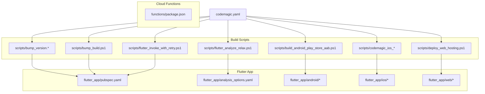
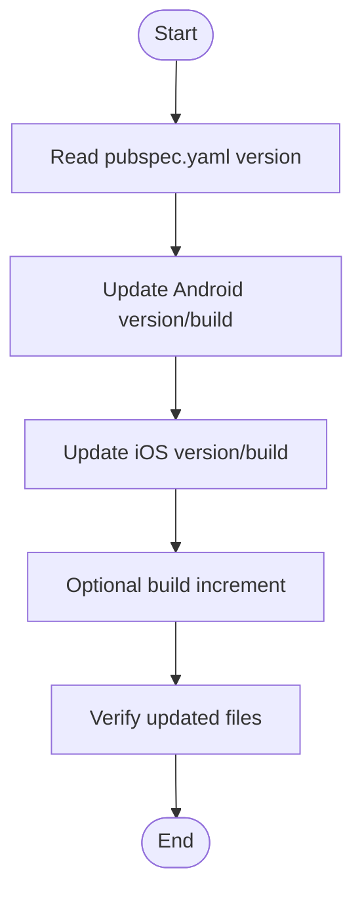
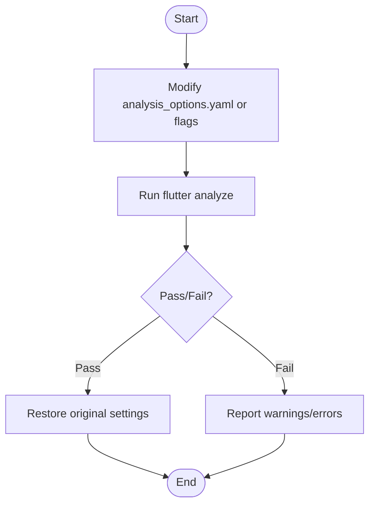
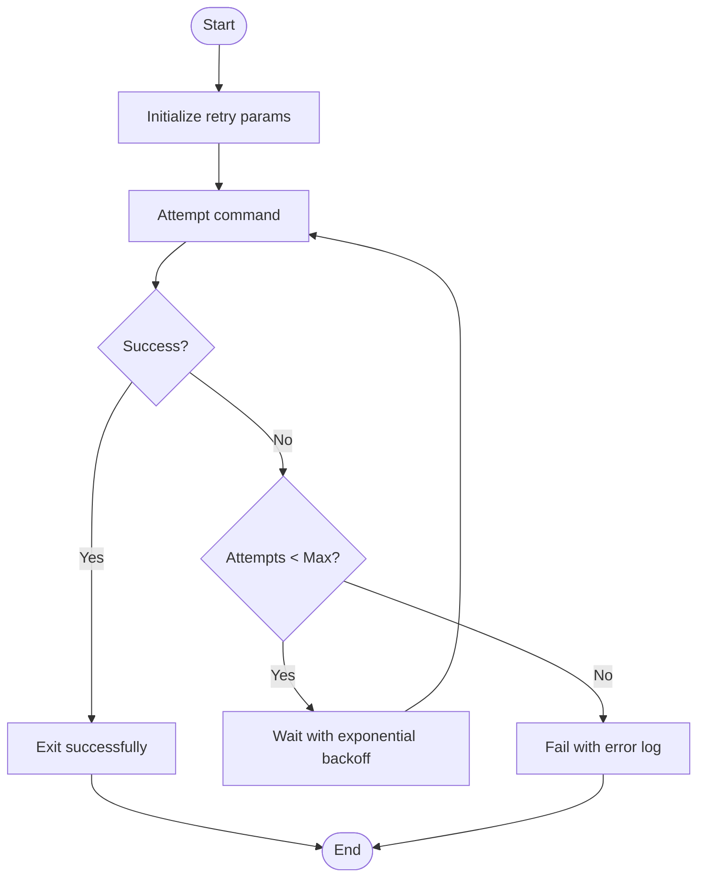
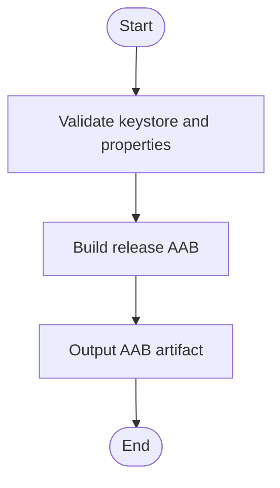
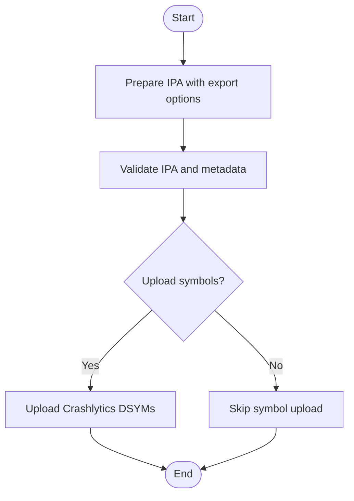
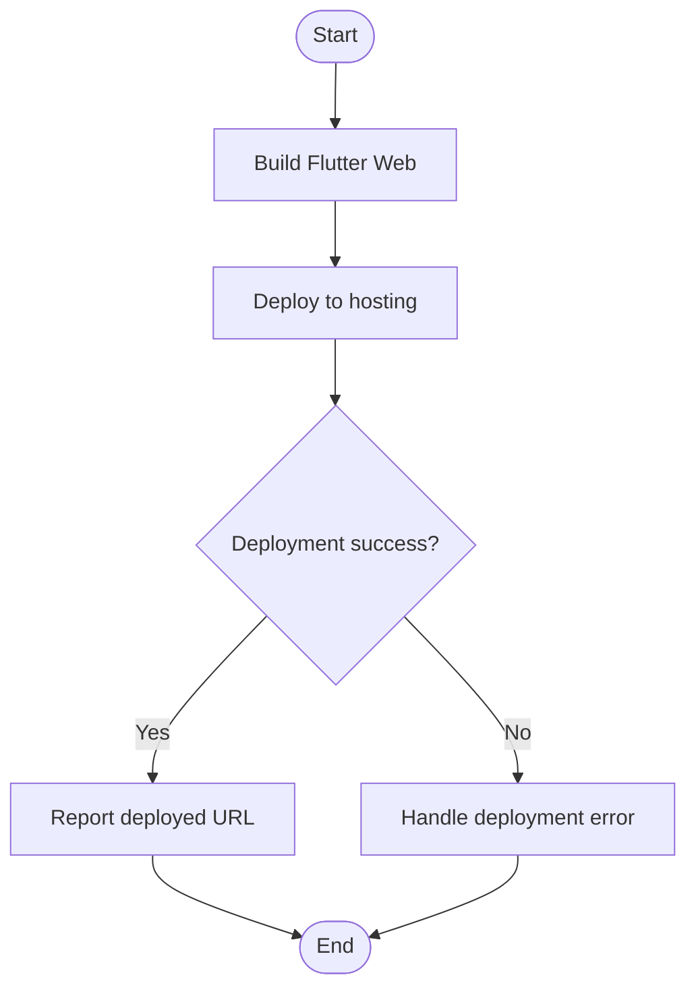
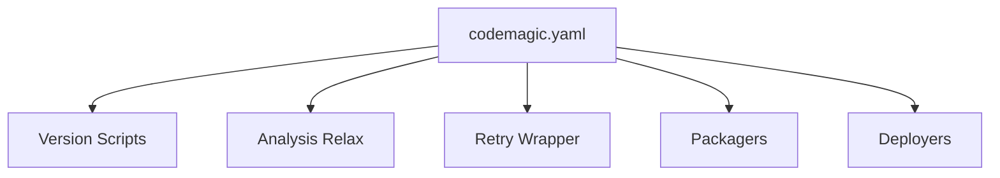
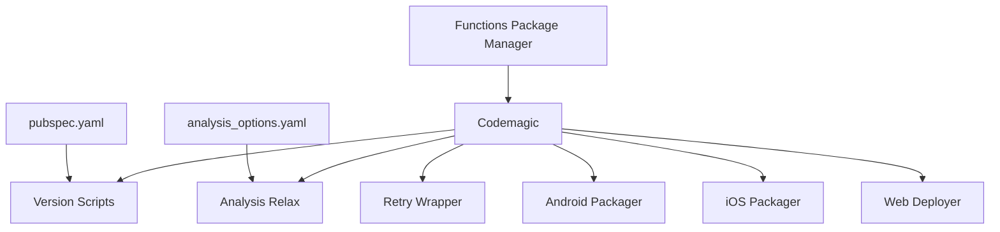

# Cross-Platform Build Tools

<cite>
**Referenced Files in This Document**
- [codemagic.yaml](file://codemagic.yaml)
- [bump_version.bat](file://scripts/bump_version.bat)
- [bump_version.ps1](file://scripts/bump_version.ps1)
- [bump_build.ps1](file://scripts/bump_build.ps1)
- [flutter_analyze_relax.ps1](file://scripts/flutter_analyze_relax.ps1)
- [flutter_invoke_with_retry.ps1](file://scripts/flutter_invoke_with_retry.ps1)
- [codemagic_ios_prepare_build_ipa.sh](file://scripts/codemagic_ios_prepare_build_ipa.sh)
- [codemagic_ios_validate_export_options.py](file://scripts/codemagic_ios_validate_export_options.py)
- [codemagic_ios_upload_crashlytics_dsyms.sh](file://scripts/codemagic_ios_upload_crashlytics_dsyms.sh)
- [deploy_web_hosting.ps1](file://scripts/deploy_web_hosting.ps1)
- [build_android_play_store_aab.ps1](file://scripts/build_android_play_store_aab.ps1)
- [_check_log_growth_build2066_retry.ps1](file://scripts/_check_log_growth_build2066_retry.ps1)
- [_wait_deploy_build2066_retry.ps1](file://scripts/_wait_deploy_build2066_retry.ps1)
- [pubspec.yaml](file://flutter_app/pubspec.yaml)
- [analysis_options.yaml](file://flutter_app/analysis_options.yaml)
- [android/key.properties](file://flutter_app/android/key.properties)
- [ios/ExportOptions.plist](file://flutter_app/ios/ExportOptions.plist)
- [functions/package.json](file://functions/package.json)
</cite>

## Table of Contents
1. [Introduction](#introduction)
2. [Project Structure](#project-structure)
3. [Core Components](#core-components)
4. [Architecture Overview](#architecture-overview)
5. [Detailed Component Analysis](#detailed-component-analysis)
6. [Dependency Analysis](#dependency-analysis)
7. [Performance Considerations](#performance-considerations)
8. [Troubleshooting Guide](#troubleshooting-guide)
9. [Conclusion](#conclusion)

## Introduction
This document explains the cross-platform build tools and utilities used to manage versions, analyze Flutter code, and implement retry mechanisms for unreliable operations across Android, iOS, Web, and Cloud Functions. It also covers Codemagic CI/CD configuration, environment variable management, and automation best practices for multi-platform development. The goal is to provide a clear, practical guide for maintaining consistent builds and releases while minimizing manual effort and failure rates.

## Project Structure
The repository organizes build tooling primarily under:
- scripts/: Shell and PowerShell utilities for version bumping, analysis relaxation, retries, and platform-specific packaging.
- flutter_app/: Flutter project with platform folders (android, ios, web, linux, macos, windows).
- functions/: Cloud Functions source and deployment helpers.
- codemagic.yaml: Centralized CI/CD configuration for Codemagic.



**Diagram sources**
- [codemagic.yaml](file://codemagic.yaml)
- [bump_version.bat](file://scripts/bump_version.bat)
- [bump_version.ps1](file://scripts/bump_version.ps1)
- [bump_build.ps1](file://scripts/bump_build.ps1)
- [flutter_analyze_relax.ps1](file://scripts/flutter_analyze_relax.ps1)
- [flutter_invoke_with_retry.ps1](file://scripts/flutter_invoke_with_retry.ps1)
- [build_android_play_store_aab.ps1](file://scripts/build_android_play_store_aab.ps1)
- [deploy_web_hosting.ps1](file://scripts/deploy_web_hosting.ps1)
- [codemagic_ios_prepare_build_ipa.sh](file://scripts/codemagic_ios_prepare_build_ipa.sh)
- [codemagic_ios_validate_export_options.py](file://scripts/codemagic_ios_validate_export_options.py)
- [codemagic_ios_upload_crashlytics_dsyms.sh](file://scripts/codemagic_ios_upload_crashlytics_dsyms.sh)
- [pubspec.yaml](file://flutter_app/pubspec.yaml)
- [analysis_options.yaml](file://flutter_app/analysis_options.yaml)
- [functions/package.json](file://functions/package.json)

**Section sources**
- [codemagic.yaml](file://codemagic.yaml)
- [pubspec.yaml](file://flutter_app/pubspec.yaml)
- [analysis_options.yaml](file://flutter_app/analysis_options.yaml)

## Core Components
- Version Management:
  - bump_version scripts synchronize app version strings across platforms and ensure consistency between pubspec and native manifests.
  - bump_build increments build numbers per platform or globally.
- Flutter Analysis Relaxation:
  - flutter_analyze_relax.ps1 adjusts analysis options temporarily to speed up local development iterations without failing on non-critical issues.
- Retry Mechanisms:
  - flutter_invoke_with_retry.ps1 wraps unstable commands (e.g., network-dependent tasks) with exponential backoff and configurable retries.
  - Additional helper scripts coordinate retry loops during long-running deployments.
- Platform Packaging:
  - Android AAB packaging via build_android_play_store_aab.ps1.
  - iOS IPA preparation and validation through codemagic_ios_* utilities.
  - Web hosting deployment via deploy_web_hosting.ps1.
- CI/CD Orchestration:
  - codemagic.yaml defines workflows that invoke these scripts, manage secrets, and handle artifacts.

**Section sources**
- [bump_version.bat](file://scripts/bump_version.bat)
- [bump_version.ps1](file://scripts/bump_version.ps1)
- [bump_build.ps1](file://scripts/bump_build.ps1)
- [flutter_analyze_relax.ps1](file://scripts/flutter_analyze_relax.ps1)
- [flutter_invoke_with_retry.ps1](file://scripts/flutter_invoke_with_retry.ps1)
- [build_android_play_store_aab.ps1](file://scripts/build_android_play_store_aab.ps1)
- [codemagic_ios_prepare_build_ipa.sh](file://scripts/codemagic_ios_prepare_build_ipa.sh)
- [codemagic_ios_validate_export_options.py](file://scripts/codemagic_ios_validate_export_options.py)
- [deploy_web_hosting.ps1](file://scripts/deploy_web_hosting.ps1)
- [codemagic.yaml](file://codemagic.yaml)

## Architecture Overview
The build system integrates Dart/Flutter tooling with platform-native steps orchestrated by Codemagic. Version updates propagate from pubspec to Android/iOS configurations; analysis relaxation improves developer velocity; retry wrappers stabilize flaky operations; packaging scripts produce distributable artifacts; and CI pipelines automate the entire flow.

```mermaid
sequenceDiagram
participant Dev as "Developer"
participant CI as "Codemagic"
participant Ver as "Version Scripts"
participant Ana as "Analysis Relax"
participant Ret as "Retry Wrapper"
participant And as "Android Packager"
participant Ios as "iOS Packager"
participant Web as "Web Deployer"
Dev->>CI : Trigger build/publish
CI->>Ver : Run bump_version / bump_build
Ver-->>CI : Updated versions
CI->>Ana : Run flutter_analyze_relax
Ana-->>CI : Relaxed analysis results
CI->>Ret : Wrap unstable steps with retries
Ret-->>CI : Stable execution
CI->>And : Build AAB
CI->>Ios : Prepare and validate IPA
CI->>Web : Deploy to hosting
CI-->>Dev : Artifacts and logs
```

**Diagram sources**
- [codemagic.yaml](file://codemagic.yaml)
- [bump_version.ps1](file://scripts/bump_version.ps1)
- [bump_build.ps1](file://scripts/bump_build.ps1)
- [flutter_analyze_relax.ps1](file://scripts/flutter_analyze_relax.ps1)
- [flutter_invoke_with_retry.ps1](file://scripts/flutter_invoke_with_retry.ps1)
- [build_android_play_store_aab.ps1](file://scripts/build_android_play_store_aab.ps1)
- [codemagic_ios_prepare_build_ipa.sh](file://scripts/codemagic_ios_prepare_build_ipa.sh)
- [codemagic_ios_validate_export_options.py](file://scripts/codemagic_ios_validate_export_options.py)
- [deploy_web_hosting.ps1](file://scripts/deploy_web_hosting.ps1)

## Detailed Component Analysis

### Version Management (bump_version and bump_build)
- Purpose: Keep version strings synchronized across pubspec.yaml, Android, and iOS configurations.
- Behavior:
  - Reads current version from pubspec.yaml.
  - Updates Android manifest and Gradle properties.
  - Updates iOS Info.plist and related metadata.
  - Optionally increments build number per platform or globally.
- Best Practices:
  - Use bump_version before branching or tagging to maintain parity.
  - Commit generated changes to keep history traceable.
  - Validate outputs by inspecting updated files after running scripts.



**Diagram sources**
- [bump_version.bat](file://scripts/bump_version.bat)
- [bump_version.ps1](file://scripts/bump_version.ps1)
- [bump_build.ps1](file://scripts/bump_build.ps1)
- [pubspec.yaml](file://flutter_app/pubspec.yaml)
- [android/key.properties](file://flutter_app/android/key.properties)
- [ios/ExportOptions.plist](file://flutter_app/ios/ExportOptions.plist)

**Section sources**
- [bump_version.bat](file://scripts/bump_version.bat)
- [bump_version.ps1](file://scripts/bump_version.ps1)
- [bump_build.ps1](file://scripts/bump_build.ps1)
- [pubspec.yaml](file://flutter_app/pubspec.yaml)
- [android/key.properties](file://flutter_app/android/key.properties)
- [ios/ExportOptions.plist](file://flutter_app/ios/ExportOptions.plist)

### Flutter Analysis Relaxation
- Purpose: Temporarily relax analysis rules to accelerate local development feedback loops.
- Behavior:
  - Adjusts analysis_options.yaml settings or injects relaxed flags.
  - Runs flutter analyze with reduced strictness.
  - Restores original settings post-run if needed.
- Usage:
  - Ideal for quick checks during feature development.
  - Avoid committing relaxed settings permanently; revert after use.



**Diagram sources**
- [flutter_analyze_relax.ps1](file://scripts/flutter_analyze_relax.ps1)
- [analysis_options.yaml](file://flutter_app/analysis_options.yaml)

**Section sources**
- [flutter_analyze_relax.ps1](file://scripts/flutter_analyze_relax.ps1)
- [analysis_options.yaml](file://flutter_app/analysis_options.yaml)

### Retry Mechanisms for Unreliable Operations
- Purpose: Stabilize flaky commands (network calls, external APIs, slow processes) using exponential backoff and retries.
- Behavior:
  - Wraps target command execution.
  - Configurable max attempts and delay intervals.
  - Logs each attempt and final outcome.
- Integration:
  - Used in CI pipelines for publishing, uploading, or syncing steps.
  - Can be applied locally for repetitive tasks.



**Diagram sources**
- [flutter_invoke_with_retry.ps1](file://scripts/flutter_invoke_with_retry.ps1)
- [_check_log_growth_build2066_retry.ps1](file://scripts/_check_log_growth_build2066_retry.ps1)
- [_wait_deploy_build2066_retry.ps1](file://scripts/_wait_deploy_build2066_retry.ps1)

**Section sources**
- [flutter_invoke_with_retry.ps1](file://scripts/flutter_invoke_with_retry.ps1)
- [_check_log_growth_build2066_retry.ps1](file://scripts/_check_log_growth_build2066_retry.ps1)
- [_wait_deploy_build2066_retry.ps1](file://scripts/_wait_deploy_build2066_retry.ps1)

### Android AAB Packaging
- Purpose: Produce Android App Bundle for Play Store distribution.
- Behavior:
  - Validates signing keys and properties.
  - Builds release AAB with optimized flags.
  - Outputs artifact for upload or further processing.
- Environment:
  - Requires secure key storage and proper gradle configuration.



**Diagram sources**
- [build_android_play_store_aab.ps1](file://scripts/build_android_play_store_aab.ps1)
- [android/key.properties](file://flutter_app/android/key.properties)

**Section sources**
- [build_android_play_store_aab.ps1](file://scripts/build_android_play_store_aab.ps1)
- [android/key.properties](file://flutter_app/android/key.properties)

### iOS IPA Preparation and Validation
- Purpose: Prepare and validate iOS IPA for App Store Connect or internal distribution.
- Behavior:
  - Ensures correct export options and provisioning profiles.
  - Validates IPA structure and metadata.
  - Uploads symbols for crash reporting when applicable.
- Environment:
  - Requires Apple credentials, certificates, and entitlements configured securely.



**Diagram sources**
- [codemagic_ios_prepare_build_ipa.sh](file://scripts/codemagic_ios_prepare_build_ipa.sh)
- [codemagic_ios_validate_export_options.py](file://scripts/codemagic_ios_validate_export_options.py)
- [codemagic_ios_upload_crashlytics_dsyms.sh](file://scripts/codemagic_ios_upload_crashlytics_dsyms.sh)
- [ios/ExportOptions.plist](file://flutter_app/ios/ExportOptions.plist)

**Section sources**
- [codemagic_ios_prepare_build_ipa.sh](file://scripts/codemagic_ios_prepare_build_ipa.sh)
- [codemagic_ios_validate_export_options.py](file://scripts/codemagic_ios_validate_export_options.py)
- [codemagic_ios_upload_crashlytics_dsyms.sh](file://scripts/codemagic_ios_upload_crashlytics_dsyms.sh)
- [ios/ExportOptions.plist](file://flutter_app/ios/ExportOptions.plist)

### Web Hosting Deployment
- Purpose: Deploy Flutter Web build to Firebase Hosting or equivalent static hosting.
- Behavior:
  - Builds web assets.
  - Deploys to hosting endpoint with caching and optimization flags.
  - Reports deployment status and URLs.
- Environment:
  - Requires hosting service credentials and domain configuration.



**Diagram sources**
- [deploy_web_hosting.ps1](file://scripts/deploy_web_hosting.ps1)

**Section sources**
- [deploy_web_hosting.ps1](file://scripts/deploy_web_hosting.ps1)

### Codemagic CI/CD Configuration
- Purpose: Orchestrate multi-platform builds, versioning, analysis, packaging, and deployment.
- Behavior:
  - Defines workflows for Android, iOS, Web, and Functions.
  - Injects environment variables and secrets securely.
  - Invokes build scripts and handles artifacts.
- Best Practices:
  - Keep sensitive data out of repository; use CI secret stores.
  - Cache dependencies to reduce build times.
  - Use retry wrappers for flaky steps.



**Diagram sources**
- [codemagic.yaml](file://codemagic.yaml)

**Section sources**
- [codemagic.yaml](file://codemagic.yaml)

## Dependency Analysis
- Internal Dependencies:
  - Version scripts depend on pubspec.yaml and platform configs.
  - Analysis relaxation depends on analysis_options.yaml.
  - Retry wrapper is agnostic but invoked by CI and other scripts.
  - Platform packagers depend on native toolchains and signing assets.
- External Dependencies:
  - Codemagic orchestrates cloud-based builds and artifact storage.
  - Hosting services require authentication and domain setup.
  - Cloud Functions package manager manages server-side dependencies.



**Diagram sources**
- [pubspec.yaml](file://flutter_app/pubspec.yaml)
- [analysis_options.yaml](file://flutter_app/analysis_options.yaml)
- [bump_version.ps1](file://scripts/bump_version.ps1)
- [flutter_analyze_relax.ps1](file://scripts/flutter_analyze_relax.ps1)
- [flutter_invoke_with_retry.ps1](file://scripts/flutter_invoke_with_retry.ps1)
- [build_android_play_store_aab.ps1](file://scripts/build_android_play_store_aab.ps1)
- [codemagic_ios_prepare_build_ipa.sh](file://scripts/codemagic_ios_prepare_build_ipa.sh)
- [deploy_web_hosting.ps1](file://scripts/deploy_web_hosting.ps1)
- [codemagic.yaml](file://codemagic.yaml)
- [functions/package.json](file://functions/package.json)

**Section sources**
- [pubspec.yaml](file://flutter_app/pubspec.yaml)
- [analysis_options.yaml](file://flutter_app/analysis_options.yaml)
- [functions/package.json](file://functions/package.json)
- [codemagic.yaml](file://codemagic.yaml)

## Performance Considerations
- Cache Dependencies:
  - Use Codemagic caches for Flutter SDK, Gradle, CocoaPods, and npm packages.
- Parallelization:
  - Run independent platform builds concurrently where possible.
- Incremental Builds:
  - Leverage Flutter’s incremental compilation and platform-specific caches.
- Minimize Network Calls:
  - Pre-download required assets and dependencies in CI images.
- Optimize Analysis:
  - Use relaxed analysis locally; enforce strict rules in CI only when necessary.

[No sources needed since this section provides general guidance]

## Troubleshooting Guide
- Version Mismatch:
  - Ensure pubspec.yaml matches Android and iOS versions after running bump_version.
  - Inspect generated files to confirm updates.
- Analysis Failures:
  - Use flutter_analyze_relax.ps1 for local iteration; revert to strict mode in CI.
  - Review warnings and fix critical issues promptly.
- Retry Loops:
  - Check logs from flutter_invoke_with_retry.ps1 for failure reasons.
  - Increase max attempts or adjust backoff intervals if needed.
- iOS Signing Issues:
  - Validate export options and provisioning profiles using codemagic_ios_validate_export_options.py.
  - Ensure certificates are installed and not expired.
- Web Deployment Errors:
  - Confirm hosting credentials and domain configuration.
  - Inspect deployment logs for asset path issues.

**Section sources**
- [flutter_analyze_relax.ps1](file://scripts/flutter_analyze_relax.ps1)
- [flutter_invoke_with_retry.ps1](file://scripts/flutter_invoke_with_retry.ps1)
- [codemagic_ios_validate_export_options.py](file://scripts/codemagic_ios_validate_export_options.py)
- [deploy_web_hosting.ps1](file://scripts/deploy_web_hosting.ps1)

## Conclusion
The cross-platform build system combines robust version management, flexible analysis controls, resilient retry mechanisms, and comprehensive CI/CD orchestration. By following the documented practices and leveraging the provided scripts, teams can maintain consistent versions, accelerate development cycles, and reliably publish across Android, iOS, Web, and Cloud Functions. Adhering to environment security and performance best practices ensures stable and efficient multi-platform delivery.

[No sources needed since this section summarizes without analyzing specific files]