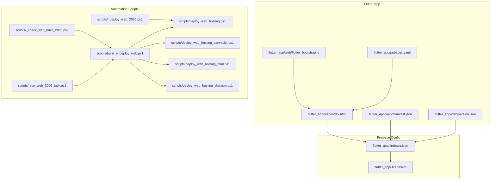
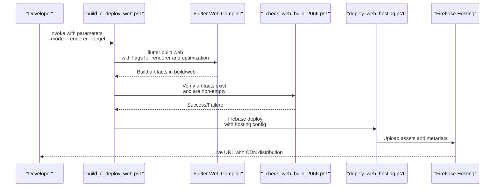
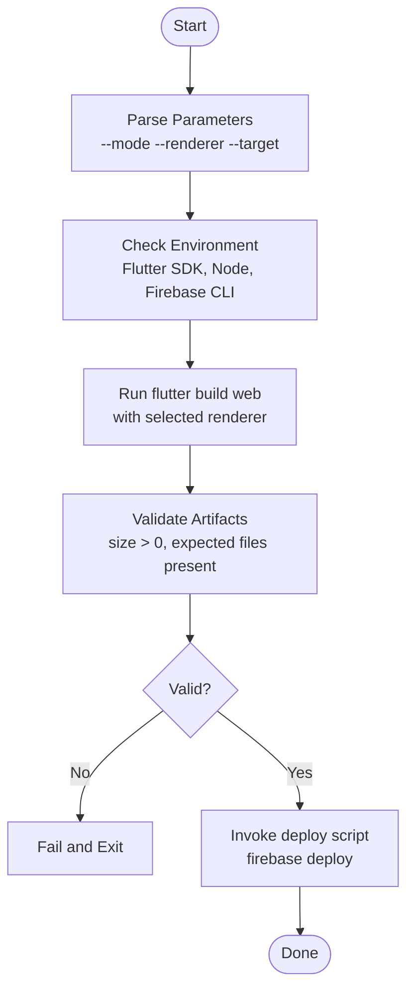
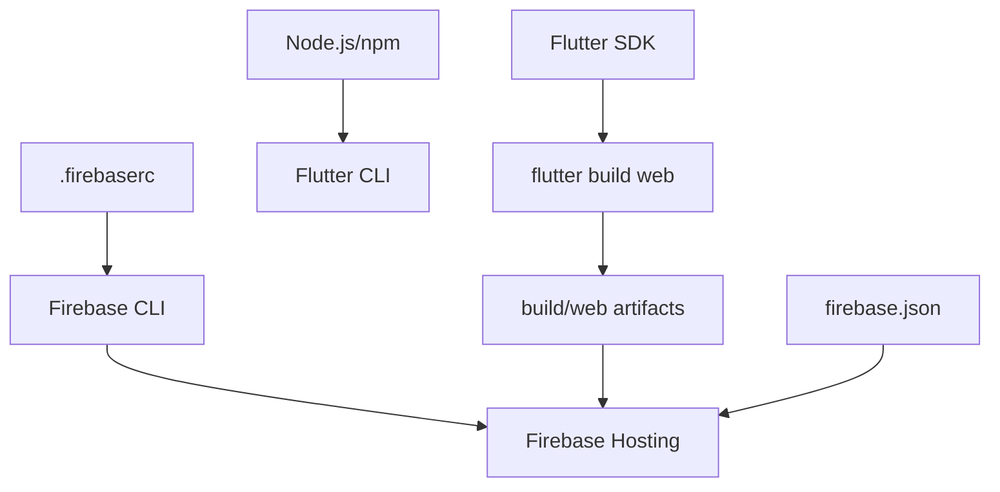

# Web Build & Deployment

<cite>
**Referenced Files in This Document**
- [build_e_deploy_web.ps1](file://scripts/build_e_deploy_web.ps1)
- [deploy_web_hosting.ps1](file://scripts/deploy_web_hosting.ps1)
- [deploy_web_hosting_canvaskit.ps1](file://scripts/deploy_web_hosting_canvaskit.ps1)
- [deploy_web_hosting_html.ps1](file://scripts/deploy_web_hosting_html.ps1)
- [deploy_web_hosting_skwasm.ps1](file://scripts/deploy_web_hosting_skwasm.ps1)
- [_run_web_2066_task.ps1](file://scripts/_run_web_2066_task.ps1)
- [_check_web_build_2066.ps1](file://scripts/_check_web_build_2066.ps1)
- [_deploy_web_2066.ps1](file://scripts/_deploy_web_2066.ps1)
- [firebase.json](file://flutter_app/firebase.json)
- [.firebaserc](file://flutter_app/.firebaserc)
- [index.html](file://flutter_app/web/index.html)
- [manifest.json](file://flutter_app/web/manifest.json)
- [version.json](file://flutter_app/web/version.json)
- [flutter_bootstrap.js](file://flutter_app/web/flutter_bootstrap.js)
- [pubspec.yaml](file://flutter_app/pubspec.yaml)
- [README_DEPLOY_PRODUCAO.md](file://README_DEPLOY_PRODUCAO.md)
- [CONECTAR_MEU_DOMINIO.md](file://CONECTAR_MEU_DOMINIO.md)
</cite>

## Table of Contents
1. [Introduction](#introduction)
2. [Project Structure](#project-structure)
3. [Core Components](#core-components)
4. [Architecture Overview](#architecture-overview)
5. [Detailed Component Analysis](#detailed-component-analysis)
6. [Dependency Analysis](#dependency-analysis)
7. [Performance Considerations](#performance-considerations)
8. [Troubleshooting Guide](#troubleshooting-guide)
9. [Conclusion](#conclusion)
10. [Appendices](#appendices)

## Introduction
This document provides a comprehensive guide to building and deploying the Flutter Web application, with a focus on:
- Using the build_e_deploy_web.ps1 script for automated builds and deployments
- Configuring CanvasKit and SkWasm rendering backends
- Setting up Firebase Hosting, custom domains, and caching strategies
- Optimizing load times and troubleshooting common web build issues

It is intended for developers and DevOps engineers who need to understand the end-to-end process from local development to production deployment.

## Project Structure
The web build and deployment pipeline revolves around the Flutter app under flutter_app and a set of PowerShell scripts under scripts that orchestrate compilation, artifact generation, and deployment to Firebase Hosting.

Key directories and files:
- flutter_app/web: Contains the web entrypoint (index.html), manifest, version metadata, and bootstrap JS
- flutter_app/firebase.json: Defines hosting configuration and rewrites/caches
- flutter_app/.firebaserc: Specifies target project alias
- scripts: Automation scripts for building, checking artifacts, and deploying

**Diagram sources**
- [index.html](file://flutter_app/web/index.html)
- [manifest.json](file://flutter_app/web/manifest.json)
- [version.json](file://flutter_app/web/version.json)
- [flutter_bootstrap.js](file://flutter_app/web/flutter_bootstrap.js)
- [pubspec.yaml](file://flutter_app/pubspec.yaml)
- [firebase.json](file://flutter_app/firebase.json)
- [.firebaserc](file://flutter_app/.firebaserc)
- [build_e_deploy_web.ps1](file://scripts/build_e_deploy_web.ps1)
- [deploy_web_hosting.ps1](file://scripts/deploy_web_hosting.ps1)
- [deploy_web_hosting_canvaskit.ps1](file://scripts/deploy_web_hosting_canvaskit.ps1)
- [deploy_web_hosting_html.ps1](file://scripts/deploy_web_hosting_html.ps1)
- [deploy_web_hosting_skwasm.ps1](file://scripts/deploy_web_hosting_skwasm.ps1)
- [_run_web_2066_task.ps1](file://scripts/_run_web_2066_task.ps1)
- [_check_web_build_2066.ps1](file://scripts/_check_web_build_2066.ps1)
- [_deploy_web_2066.ps1](file://scripts/_deploy_web_2066.ps1)

**Section sources**
- [index.html](file://flutter_app/web/index.html)
- [manifest.json](file://flutter_app/web/manifest.json)
- [version.json](file://flutter_app/web/version.json)
- [flutter_bootstrap.js](file://flutter_app/web/flutter_bootstrap.js)
- [pubspec.yaml](file://flutter_app/pubspec.yaml)
- [firebase.json](file://flutter_app/firebase.json)
- [.firebaserc](file://flutter_app/.firebaserc)
- [build_e_deploy_web.ps1](file://scripts/build_e_deploy_web.ps1)
- [deploy_web_hosting.ps1](file://scripts/deploy_web_hosting.ps1)
- [deploy_web_hosting_canvaskit.ps1](file://scripts/deploy_web_hosting_canvaskit.ps1)
- [deploy_web_hosting_html.ps1](file://scripts/deploy_web_hosting_html.ps1)
- [deploy_web_hosting_skwasm.ps1](file://scripts/deploy_web_hosting_skwasm.ps1)
- [_run_web_2066_task.ps1](file://scripts/_run_web_2066_task.ps1)
- [_check_web_build_2066.ps1](file://scripts/_check_web_build_2066.ps1)
- [_deploy_web_2066.ps1](file://scripts/_deploy_web_2066.ps1)

## Core Components
- build_e_deploy_web.ps1: Orchestrates the full web build and deployment workflow, including environment checks, Flutter build commands, artifact validation, and deployment to Firebase Hosting. It accepts parameters to control build mode, rendering backend selection, and deployment targets.
- deploy_web_hosting.ps1: Deploys the built web artifacts to Firebase Hosting using firebase deploy.
- deploy_web_hosting_canvaskit.ps1: Builds with CanvasKit enabled and deploys.
- deploy_web_hosting_html.ps1: Builds with HTML renderer and deploys.
- deploy_web_hosting_skwasm.ps1: Builds with SkWasm renderer and deploys.
- _run_web_2066_task.ps1, _check_web_build_2066.ps1, _deploy_web_2066.ps1: Supporting tasks for running, validating, and deploying the web build within CI or local automation.

These components work together to provide a repeatable, parameterized build and deployment process tailored for different rendering backends and environments.

**Section sources**
- [build_e_deploy_web.ps1](file://scripts/build_e_deploy_web.ps1)
- [deploy_web_hosting.ps1](file://scripts/deploy_web_hosting.ps1)
- [deploy_web_hosting_canvaskit.ps1](file://scripts/deploy_web_hosting_canvaskit.ps1)
- [deploy_web_hosting_html.ps1](file://scripts/deploy_web_hosting_html.ps1)
- [deploy_web_hosting_skwasm.ps1](file://scripts/deploy_web_hosting_skwasm.ps1)
- [_run_web_2066_task.ps1](file://scripts/_run_web_2066_task.ps1)
- [_check_web_build_2066.ps1](file://scripts/_check_web_build_2066.ps1)
- [_deploy_web_2066.ps1](file://scripts/_deploy_web_2066.ps1)

## Architecture Overview
The web build and deployment architecture integrates Flutter’s web compiler, Firebase CLI, and CDN-backed hosting. The flow includes:
- Parameter parsing and environment setup
- Flutter web build targeting specific renderers (CanvasKit, HTML, SkWasm)
- Artifact validation and version stamping
- Deployment to Firebase Hosting with cache headers and domain routing

**Diagram sources**
- [build_e_deploy_web.ps1](file://scripts/build_e_deploy_web.ps1)
- [_check_web_build_2066.ps1](file://scripts/_check_web_build_2066.ps1)
- [deploy_web_hosting.ps1](file://scripts/deploy_web_hosting.ps1)
- [firebase.json](file://flutter_app/firebase.json)

## Detailed Component Analysis

### build_e_deploy_web.ps1
This script is the primary entry point for building and deploying the Flutter Web app. It typically:
- Parses command-line parameters such as build mode (debug/release), rendering backend (canvaskit/html/skwasm), and deployment target
- Executes flutter build web with appropriate flags
- Validates generated artifacts
- Invokes deployment scripts to publish to Firebase Hosting

Parameters commonly supported include:
- --mode: Build mode (e.g., debug, release)
- --renderer: Rendering backend (canvaskit, html, skwasm)
- --target: Target platform or environment
- --no-cache: Disable Flutter build cache
- --verbose: Enable verbose logging

Behavior highlights:
- Ensures Flutter toolchain availability
- Sets environment variables for build reproducibility
- Handles error propagation and exit codes
- Optionally triggers post-build tasks like asset optimization

**Diagram sources**
- [build_e_deploy_web.ps1](file://scripts/build_e_deploy_web.ps1)
- [_check_web_build_2066.ps1](file://scripts/_check_web_build_2066.ps1)

**Section sources**
- [build_e_deploy_web.ps1](file://scripts/build_e_deploy_web.ps1)
- [_check_web_build_2066.ps1](file://scripts/_check_web_build_2066.ps1)

### deploy_web_hosting.ps1
Responsible for publishing the built web artifacts to Firebase Hosting. It typically:
- Uses firebase deploy with hosting configuration defined in firebase.json
- Supports flags for project selection, target environment, and cache behavior
- Reports deployment status and URLs

Common usage patterns:
- Deploy all hosting assets
- Deploy only specific folders or files
- Skip functions or database updates if not needed

**Section sources**
- [deploy_web_hosting.ps1](file://scripts/deploy_web_hosting.ps1)
- [firebase.json](file://flutter_app/firebase.json)

### deploy_web_hosting_canvaskit.ps1
Builds and deploys the Flutter Web app with CanvasKit rendering enabled. CanvasKit provides high-performance 2D graphics via WebGL/WebGPU. Typical steps:
- Run flutter build web with canvaskit flag
- Ensure CanvasKit assets are included
- Deploy to Firebase Hosting

Use cases:
- Rich graphics applications
- High-fidelity UI rendering
- Cross-browser compatibility with GPU acceleration

**Section sources**
- [deploy_web_hosting_canvaskit.ps1](file://scripts/deploy_web_hosting_canvaskit.ps1)

### deploy_web_hosting_html.ps1
Builds and deploys the Flutter Web app using the HTML renderer. This renderer generates pure HTML/CSS/JS without CanvasKit dependencies. Typical steps:
- Run flutter build web with HTML renderer flag
- Optimize static assets
- Deploy to Firebase Hosting

Use cases:
- Lightweight apps
- Environments where CanvasKit is unavailable
- Faster initial load when heavy graphics are not required

**Section sources**
- [deploy_web_hosting_html.ps1](file://scripts/deploy_web_hosting_html.ps1)

### deploy_web_hosting_skwasm.ps1
Builds and deploys the Flutter Web app using the SkWasm renderer. SkWasm leverages WebAssembly for improved performance and smaller payloads compared to CanvasKit. Typical steps:
- Run flutter build web with SkWasm flag
- Validate WebAssembly output
- Deploy to Firebase Hosting

Use cases:
- Performance-critical applications
- Modern browsers supporting WebAssembly
- Reduced bundle size and faster startup

**Section sources**
- [deploy_web_hosting_skwasm.ps1](file://scripts/deploy_web_hosting_skwasm.ps1)

### Supporting Tasks
- _run_web_2066_task.ps1: Launches the web build task with predefined parameters, often used in CI pipelines.
- _check_web_build_2066.ps1: Validates that the build artifacts exist and meet minimum requirements before deployment.
- _deploy_web_2066.ps1: Wraps deployment logic, ensuring consistent behavior across environments.

These tasks enhance reliability and repeatability by encapsulating common operations and error handling.

**Section sources**
- [_run_web_2066_task.ps1](file://scripts/_run_web_2066_task.ps1)
- [_check_web_build_2066.ps1](file://scripts/_check_web_build_2066.ps1)
- [_deploy_web_2066.ps1](file://scripts/_deploy_web_2066.ps1)

## Dependency Analysis
The build and deployment pipeline depends on several external tools and configurations:
- Flutter SDK: Compiles Dart code to JavaScript/WASM and generates web artifacts
- Node.js and npm: Required for some Flutter web tooling and Firebase CLI
- Firebase CLI: Used to deploy hosting assets and manage configurations
- firebase.json: Defines hosting rules, rewrites, and cache policies
- .firebaserc: Maps project aliases to Firebase project IDs

**Diagram sources**
- [pubspec.yaml](file://flutter_app/pubspec.yaml)
- [firebase.json](file://flutter_app/firebase.json)
- [.firebaserc](file://flutter_app/.firebaserc)

**Section sources**
- [pubspec.yaml](file://flutter_app/pubspec.yaml)
- [firebase.json](file://flutter_app/firebase.json)
- [.firebaserc](file://flutter_app/.firebaserc)

## Performance Considerations
Optimizing Flutter Web performance involves selecting the right rendering backend and configuring caching effectively:

- Rendering Backend Selection:
  - CanvasKit: Best for rich graphics; larger initial payload but excellent performance
  - HTML Renderer: Smaller payload; suitable for simple UIs
  - SkWasm: Balanced performance and size; requires modern browser support

- Asset Optimization:
  - Minify and tree-shake unused code
  - Compress images and use modern formats (WebP, AVIF)
  - Preload critical resources and defer non-essential ones

- Caching Strategies:
  - Configure long-lived cache headers for static assets
  - Use content hashing for cache busting
  - Implement service workers for offline support and fast reloads

- Bundle Size Reduction:
  - Remove unnecessary plugins and features
  - Use conditional imports for platform-specific code
  - Analyze bundle with Flutter’s built-in tools

[No sources needed since this section provides general guidance]

## Troubleshooting Guide
Common issues and resolutions:

- Build Failures:
  - Ensure Flutter SDK is installed and updated
  - Clear Flutter cache and rebuild
  - Check for incompatible dependencies in pubspec.yaml

- CanvasKit Issues:
  - Verify WebGL/WebGPU support in the target browser
  - Test on multiple devices to identify compatibility problems
  - Fall back to HTML renderer if CanvasKit fails to initialize

- Deployment Errors:
  - Confirm Firebase CLI authentication and project selection
  - Validate firebase.json configuration for hosting rules
  - Check network connectivity and firewall settings

- Browser Compatibility:
  - Test on Chrome, Firefox, Safari, and Edge
  - Use browser developer tools to inspect console errors
  - Polyfill missing features if necessary

- Load Time Problems:
  - Inspect network waterfall for large resources
  - Enable gzip/brotli compression on the server
  - Use CDN caching and HTTP/2 for faster delivery

**Section sources**
- [README_DEPLOY_PRODUCAO.md](file://README_DEPLOY_PRODUCAO.md)
- [CONECTAR_MEU_DOMINIO.md](file://CONECTAR_MEU_DOMINIO.md)

## Conclusion
The Flutter Web build and deployment pipeline is designed for flexibility, performance, and reliability. By leveraging parameterized scripts, choosing the appropriate rendering backend, and optimizing caching strategies, teams can deliver fast, responsive web applications. Firebase Hosting provides a robust CDN-backed platform for global distribution, while the automation scripts ensure consistency across environments.

[No sources needed since this section summarizes without analyzing specific files]

## Appendices

### Firebase Hosting Setup
- Initialize Firebase project and configure hosting
- Set up custom domains and SSL certificates
- Define cache policies and rewrites in firebase.json
- Deploy using firebase deploy or the provided scripts

**Section sources**
- [firebase.json](file://flutter_app/firebase.json)
- [.firebaserc](file://flutter_app/.firebaserc)
- [CONECTAR_MEU_DOMINIO.md](file://CONECTAR_MEU_DOMINIO.md)

### CanvasKit Configuration
- Enable CanvasKit in flutter build web
- Ensure proper asset loading and fallback mechanisms
- Test performance and compatibility across browsers

**Section sources**
- [deploy_web_hosting_canvaskit.ps1](file://scripts/deploy_web_hosting_canvaskit.ps1)
- [index.html](file://flutter_app/web/index.html)

### SkWasm Configuration
- Enable SkWasm renderer in flutter build web
- Validate WebAssembly support in target environments
- Monitor performance improvements and bundle size reduction

**Section sources**
- [deploy_web_hosting_skwasm.ps1](file://scripts/deploy_web_hosting_skwasm.ps1)
- [flutter_bootstrap.js](file://flutter_app/web/flutter_bootstrap.js)