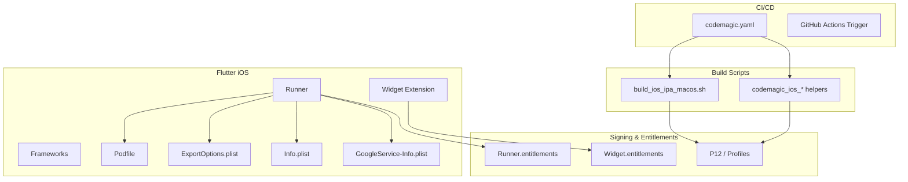
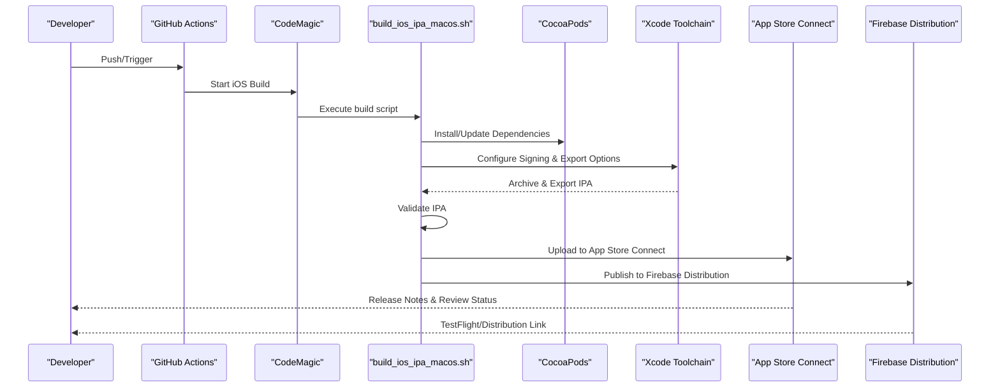
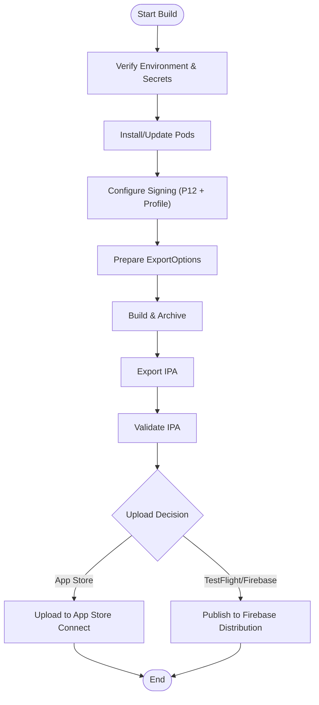
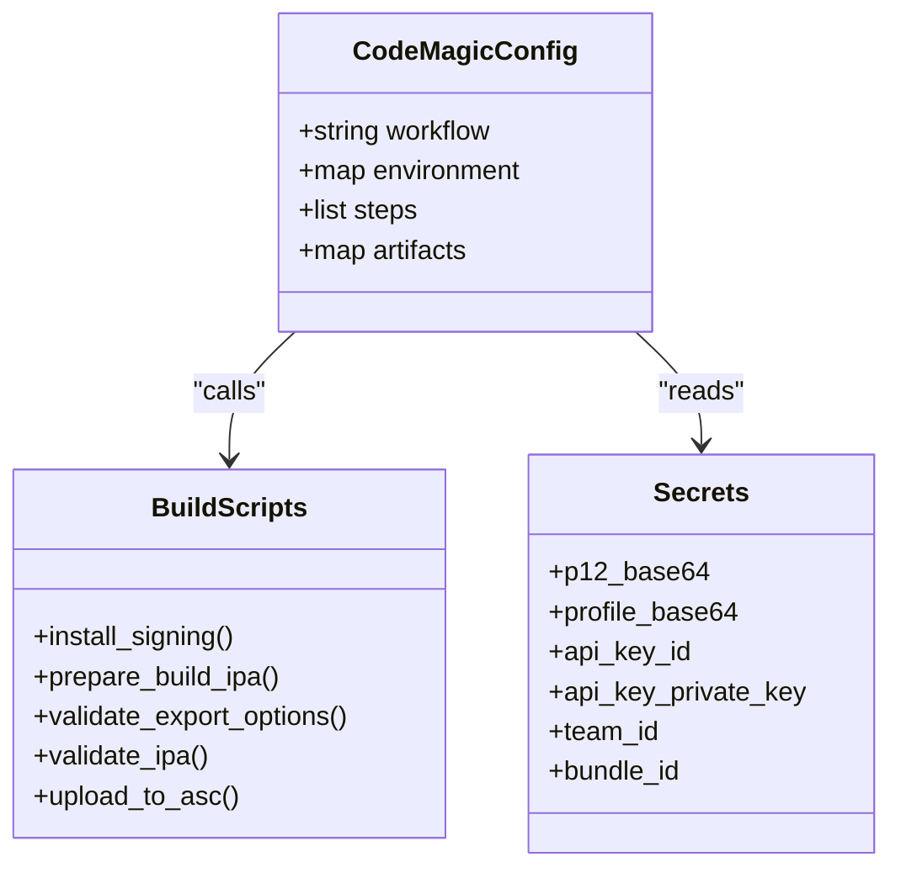
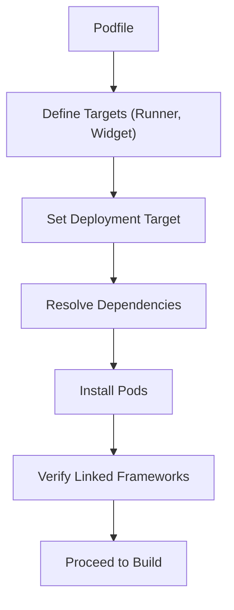
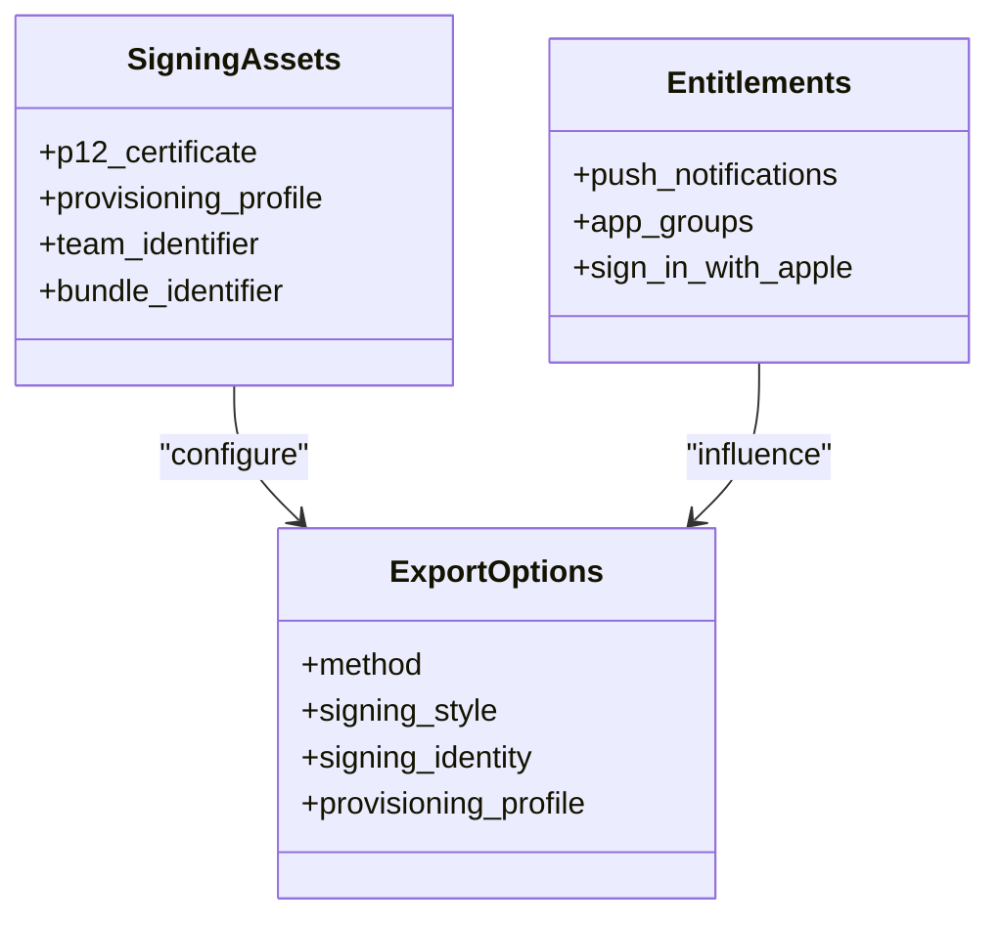
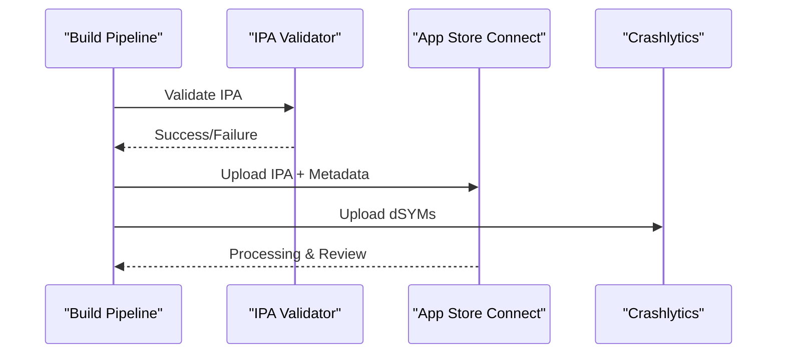
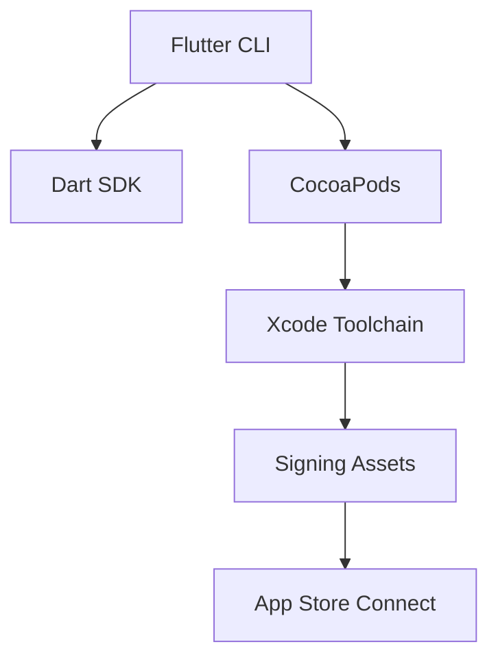

# iOS Build Process

<cite>
**Referenced Files in This Document**
- [build_ios_ipa_macos.sh](file://scripts/build_ios_ipa_macos.sh)
- [codemagic.yaml](file://codemagic.yaml)
- [Flutter Podfile](file://flutter_app/ios/Podfile)
- [Runner.xcworkspace](file://flutter_app/ios/Runner.xcworkspace/contents.xcworkspacedata)
- [ExportOptions.plist](file://flutter_app/ios/ExportOptions.plist)
- [Runner.entitlements](file://flutter_app/ios/Runner/Runner.entitlements)
- [GestaoYahwehWidget.entitlements](file://flutter_app/ios/GestaoYahwehWidget/GestaoYahwehWidget.entitlements)
- [Info.plist (Runner)](file://flutter_app/ios/Runner/Info.plist)
- [GoogleService-Info.plist (iOS)](file://flutter_app/ios/Runner/GoogleService-Info.plist)
- [firebase_app_id_file.json](file://flutter_app/ios/firebase_app_id_file.json)
- [asc_build_number_floor.txt](file://flutter_app/ios/asc_build_number_floor.txt)
- [CODEMAGIC_APP_STORE_INTEGRATION.txt](file://IOS/CODEMAGIC_APP_STORE_INTEGRATION.txt)
- [CODEMAGIC_SIGNING_FIX.md](file://IOS/CODEMAGIC_SIGNING_FIX.md)
- [CODEMAGIC_INVALID_BINARY.md](file://IOS/CODEMAGIC_INVALID_BINARY.md)
- [CODEMAGIC_90189.md](file://IOS/CODEMAGIC_90189.md)
- [CREDENCIAIS_APPLE_ATUAL.txt](file://IOS/CREDENCIAIS_APPLE_ATUAL.txt)
- [prepare_codemagic_paste_from_bootstrap.ps1](file://IOS/prepare_codemagic_paste_from_bootstrap.ps1)
- [codemagic_ios_install_signing.sh](file://scripts/codemagic_ios_install_signing.sh)
- [codemagic_ios_install_signing_api_only.sh](file://scripts/codemagic_ios_install_signing_api_only.sh)
- [codemagic_ios_prepare_build_ipa.sh](file://scripts/codemagic_ios_prepare_build_ipa.sh)
- [codemagic_ios_validate_export_options.py](file://scripts/codemagic_ios_validate_export_options.py)
- [codemagic_ios_write_export_options.py](file://scripts/codemagic_ios_write_export_options.py)
- [codemagic_ios_pod_install.sh](file://scripts/codemagic_ios_pod_install.sh)
- [codemagic_ios_ensure_deployment_target_15.sh](file://scripts/codemagic_ios_ensure_deployment_target_15.sh)
- [codemagic_ios_bump_pods_deployment_to_14.sh](file://scripts/codemagic_ios_bump_pods_deployment_to_14.sh)
- [codemagic_ios_bump_pods_deployment_to_15.sh](file://scripts/codemagic_ios_bump_pods_deployment_to_15.sh)
- [codemagic_ios_fetch_profile_matching_p12.sh](file://scripts/codemagic_ios_fetch_profile_matching_p12.sh)
- [codemagic_ios_install_p12_profile_exportoptions.sh](file://scripts/codemagic_ios_install_p12_profile_exportoptions.sh)
- [codemagic_ios_verify_profile_matches_p12.sh](file://scripts/codemagic_ios_verify_profile_matches_p12.sh)
- [codemagic_ios_enable_push_notifications.py](file://scripts/codemagic_ios_enable_push_notifications.py)
- [codemagic_ios_enable_sign_in_with_apple.py](file://scripts/codemagic_ios_enable_sign_in_with_apple.py)
- [codemagic_ios_enable_app_groups.py](file://scripts/codemagic_ios_enable_app_groups.py)
- [codemagic_ios_ensure_widget_appstore_profile.py](file://scripts/codemagic_ios_ensure_widget_appstore_profile.py)
- [codemagic_ios_verify_widget_profile.py](file://scripts/codemagic_ios_verify_widget_profile.py)
- [codemagic_ios_normalize_ipa_for_asc.sh](file://scripts/codemagic_ios_normalize_ipa_for_asc.sh)
- [codemagic_ios_upload_crashlytics_dsyms.sh](file://scripts/codemagic_ios_upload_crashlytics_dsyms.sh)
- [codemagic_ios_validate_ipa_before_upload.sh](file://scripts/codemagic_ios_validate_ipa_before_upload.sh)
- [codemagic_ios_read_asc_floor.sh](file://scripts/codemagic_ios_read_asc_floor.sh)
- [codemagic_ios_stamp_asc_floor.sh](file://scripts/codemagic_ios_stamp_asc_floor.sh)
- [codemagic_ios_sync_version_from_app_version_dart.sh](file://scripts/codemagic_ios_sync_version_from_app_version_dart.sh)
- [codemagic_ios_team_signing_prepare_exportoptions.sh](file://scripts/codemagic_ios_team_signing_prepare_exportoptions.sh)
- [codemagic_ios_remove_old_appstore_profiles.sh](file://scripts/codemagic_ios_remove_old_appstore_profiles.sh)
- [codemagic_ios_pre_publish_90189_gate.sh](file://scripts/codemagic_ios_pre_publish_90189_gate.sh)
- [codemagic_ios_cp_ipa_safe.sh](file://scripts/codemagic_ios_cp_ipa_safe.sh)
- [codemagic_ios_p12_password_helpers.sh](file://scripts/codemagic_ios_p12_password_helpers.sh)
- [codemagic_ios_prepare_api_pem.sh](file://scripts/codemagic_ios_prepare_api_pem.sh)
- [codemagic_ios_asc_latest_build_number.sh](file://scripts/codemagic_ios_asc_latest_build_number.sh)
- [codemagic_ios_delete_appstore_profiles.py](file://scripts/codemagic_ios_delete_appstore_profiles.py)
- [codemagic_ios_profile_utils.py](file://scripts/codemagic_ios_profile_utils.py)
- [codemagic_ios_register_app_groups_via_xcode.sh](file://scripts/codemagic_ios_register_app_groups_via_xcode.sh)
- [codemagic_ios_verify_env_apple_and_signing.sh](file://scripts/codemagic_ios_verify_env_apple_and_signing.sh)
- [codemagic_ios_align_push_entitlements.py](file://scripts/codemagic_ios_align_push_entitlements.py)
- [codemagic_ios_align_app_group_entitlements.py](file://scripts/codemagic_ios_align_app_group_entitlements.py)
- [codemagic_publish_ipa_to_firebase.js](file://scripts/codemagic_publish_ipa_to_firebase.js)
</cite>

## Table of Contents
1. [Introduction](#introduction)
2. [Project Structure](#project-structure)
3. [Core Components](#core-components)
4. [Architecture Overview](#architecture-overview)
5. [Detailed Component Analysis](#detailed-component-analysis)
6. [Dependency Analysis](#dependency-analysis)
7. [Performance Considerations](#performance-considerations)
8. [Troubleshooting Guide](#troubleshooting-guide)
9. [Conclusion](#conclusion)
10. [Appendices](#appendices)

## Introduction
This document explains the end-to-end iOS build process for the Flutter application, focusing on IPA generation, CodeMagic integration, and App Store deployment. It covers the macOS build script, Xcode workspace configuration, CocoaPods management, certificate provisioning, code signing, entitlements, and CI/CD optimization strategies. The goal is to provide a clear, actionable guide for developers and DevOps engineers to reliably produce signed IPAs and publish them via App Store Connect or alternative distribution channels.

## Project Structure
The iOS build pipeline spans several directories and scripts:
- Flutter iOS project under flutter_app/ios with Runner, widgets, frameworks, and CocoaPods configuration.
- CI/CD orchestration via codemagic.yaml and GitHub Actions triggers.
- A comprehensive set of helper scripts under scripts/ for signing, export options, pod installation, validation, and publishing.
- Documentation and credential references under IOS/.

**Diagram sources**
- [Flutter Podfile](file://flutter_app/ios/Podfile)
- [Runner.xcworkspace](file://flutter_app/ios/Runner.xcworkspace/contents.xcworkspacedata)
- [ExportOptions.plist](file://flutter_app/ios/ExportOptions.plist)
- [Runner.entitlements](file://flutter_app/ios/Runner/Runner.entitlements)
- [GestaoYahwehWidget.entitlements](file://flutter_app/ios/GestaoYahwehWidget/GestaoYahwehWidget.entitlements)
- [codemagic.yaml](file://codemagic.yaml)
- [build_ios_ipa_macos.sh](file://scripts/build_ios_ipa_macos.sh)

**Section sources**
- [codemagic.yaml](file://codemagic.yaml)
- [Flutter Podfile](file://flutter_app/ios/Podfile)
- [Runner.xcworkspace](file://flutter_app/ios/Runner.xcworkspace/contents.xcworkspacedata)
- [ExportOptions.plist](file://flutter_app/ios/ExportOptions.plist)
- [Runner.entitlements](file://flutter_app/ios/Runner/Runner.entitlements)
- [GestaoYahwehWidget.entitlements](file://flutter_app/ios/GestaoYahwehWidget/GestaoYahwehWidget.entitlements)

## Core Components
- macOS IPA build script: Orchestrates environment setup, dependency resolution, signing, and IPA export.
- CodeMagic configuration: Defines workflows, secrets, and steps for building and distributing iOS artifacts.
- CocoaPods: Manages native dependencies and framework linking for the iOS target.
- Signing and entitlements: Ensures correct provisioning profiles, certificates, and capability flags for push notifications, app groups, and Sign In with Apple.
- Export options: Controls archive/export behavior for App Store Connect upload.

Key responsibilities:
- Environment verification and toolchain alignment.
- Dependency installation and version pinning.
- Secure handling of credentials and profiles.
- Validation of IPA before upload.
- Publishing to App Store Connect or Firebase Distribution.

**Section sources**
- [build_ios_ipa_macos.sh](file://scripts/build_ios_ipa_macos.sh)
- [codemagic.yaml](file://codemagic.yaml)
- [Flutter Podfile](file://flutter_app/ios/Podfile)
- [ExportOptions.plist](file://flutter_app/ios/ExportOptions.plist)
- [Runner.entitlements](file://flutter_app/ios/Runner/Runner.entitlements)
- [GestaoYahwehWidget.entitlements](file://flutter_app/ios/GestaoYahwehWidget/GestaoYahwehWidget.entitlements)

## Architecture Overview
The iOS build architecture integrates Flutter’s iOS target with native tooling and CI/CD services. The flow begins with a trigger (local or CI), proceeds through dependency resolution and signing, produces an IPA, validates it, and finally publishes it.

**Diagram sources**
- [codemagic.yaml](file://codemagic.yaml)
- [build_ios_ipa_macos.sh](file://scripts/build_ios_ipa_macos.sh)
- [Flutter Podfile](file://flutter_app/ios/Podfile)
- [ExportOptions.plist](file://flutter_app/ios/ExportOptions.plist)

## Detailed Component Analysis

### macOS IPA Build Script
The build script coordinates the entire IPA generation process:
- Verifies environment variables and toolchain availability.
- Installs or updates CocoaPods dependencies.
- Configures signing using provided P12 and provisioning profiles.
- Generates or validates ExportOptions for App Store upload.
- Builds and exports the IPA.
- Validates the IPA structure and signatures.
- Optionally uploads to App Store Connect or distributes via Firebase.

**Diagram sources**
- [build_ios_ipa_macos.sh](file://scripts/build_ios_ipa_macos.sh)
- [codemagic_ios_install_signing.sh](file://scripts/codemagic_ios_install_signing.sh)
- [codemagic_ios_prepare_build_ipa.sh](file://scripts/codemagic_ios_prepare_build_ipa.sh)
- [codemagic_ios_validate_ipa_before_upload.sh](file://scripts/codemagic_ios_validate_ipa_before_upload.sh)

**Section sources**
- [build_ios_ipa_macos.sh](file://scripts/build_ios_ipa_macos.sh)
- [codemagic_ios_install_signing.sh](file://scripts/codemagic_ios_install_signing.sh)
- [codemagic_ios_prepare_build_ipa.sh](file://scripts/codemagic_ios_prepare_build_ipa.sh)
- [codemagic_ios_validate_ipa_before_upload.sh](file://scripts/codemagic_ios_validate_ipa_before_upload.sh)

### CodeMagic Integration
CodeMagic orchestrates builds via codemagic.yaml and GitHub Actions triggers. Key aspects:
- Workflow definition with environment variables, secrets, and steps.
- Use of helper scripts for signing, export options, and validation.
- Optional App Store Connect API usage for profile management and uploads.
- Artifact retention and distribution to testers or internal channels.

**Diagram sources**
- [codemagic.yaml](file://codemagic.yaml)
- [codemagic_ios_install_signing.sh](file://scripts/codemagic_ios_install_signing.sh)
- [codemagic_ios_prepare_build_ipa.sh](file://scripts/codemagic_ios_prepare_build_ipa.sh)
- [codemagic_ios_validate_export_options.py](file://scripts/codemagic_ios_validate_export_options.py)
- [codemagic_ios_validate_ipa_before_upload.sh](file://scripts/codemagic_ios_validate_ipa_before_upload.sh)

**Section sources**
- [codemagic.yaml](file://codemagic.yaml)
- [CODEMAGIC_APP_STORE_INTEGRATION.txt](file://IOS/CODEMAGIC_APP_STORE_INTEGRATION.txt)
- [prepare_codemagic_paste_from_bootstrap.ps1](file://IOS/prepare_codemagic_paste_from_bootstrap.ps1)

### CocoaPods Management
CocoaPods handles native dependencies for the iOS target:
- Podfile defines targets, platforms, and dependencies.
- Helper scripts ensure deployment targets and pod versions are aligned.
- Frameworks like libtdjson-static are integrated via custom podspecs.

**Diagram sources**
- [Flutter Podfile](file://flutter_app/ios/Podfile)
- [codemagic_ios_pod_install.sh](file://scripts/codemagic_ios_pod_install.sh)
- [codemagic_ios_ensure_deployment_target_15.sh](file://scripts/codemagic_ios_ensure_deployment_target_15.sh)
- [codemagic_ios_bump_pods_deployment_to_14.sh](file://scripts/codemagic_ios_bump_pods_deployment_to_14.sh)
- [codemagic_ios_bump_pods_deployment_to_15.sh](file://scripts/codemagic_ios_bump_pods_deployment_to_15.sh)

**Section sources**
- [Flutter Podfile](file://flutter_app/ios/Podfile)
- [codemagic_ios_pod_install.sh](file://scripts/codemagic_ios_pod_install.sh)
- [codemagic_ios_ensure_deployment_target_15.sh](file://scripts/codemagic_ios_ensure_deployment_target_15.sh)

### Certificate Provisioning, Code Signing, and Entitlements
Signing ensures the app is trusted by Apple systems:
- P12 certificates and provisioning profiles are securely managed.
- ExportOptions specify signing settings for App Store upload.
- Entitlements enable capabilities such as push notifications, app groups, and Sign In with Apple.

**Diagram sources**
- [codemagic_ios_install_signing.sh](file://scripts/codemagic_ios_install_signing.sh)
- [codemagic_ios_install_p12_profile_exportoptions.sh](file://scripts/codemagic_ios_install_p12_profile_exportoptions.sh)
- [codemagic_ios_verify_profile_matches_p12.sh](file://scripts/codemagic_ios_verify_profile_matches_p12.sh)
- [ExportOptions.plist](file://flutter_app/ios/ExportOptions.plist)
- [Runner.entitlements](file://flutter_app/ios/Runner/Runner.entitlements)
- [GestaoYahwehWidget.entitlements](file://flutter_app/ios/GestaoYahwehWidget/GestaoYahwehWidget.entitlements)

**Section sources**
- [codemagic_ios_install_signing.sh](file://scripts/codemagic_ios_install_signing.sh)
- [codemagic_ios_install_p12_profile_exportoptions.sh](file://scripts/codemagic_ios_install_p12_profile_exportoptions.sh)
- [codemagic_ios_verify_profile_matches_p12.sh](file://scripts/codemagic_ios_verify_profile_matches_p12.sh)
- [ExportOptions.plist](file://flutter_app/ios/ExportOptions.plist)
- [Runner.entitlements](file://flutter_app/ios/Runner/Runner.entitlements)
- [GestaoYahwehWidget.entitlements](file://flutter_app/ios/GestaoYahwehWidget/GestaoYahwehWidget.entitlements)

### App Store Deployment
Deployment involves validating the IPA and uploading to App Store Connect:
- Pre-publish gates check version floors and metadata.
- Optional normalization ensures compatibility with ASC.
- Crashlytics symbols can be uploaded alongside the IPA.

**Diagram sources**
- [codemagic_ios_validate_ipa_before_upload.sh](file://scripts/codemagic_ios_validate_ipa_before_upload.sh)
- [codemagic_ios_normalize_ipa_for_asc.sh](file://scripts/codemagic_ios_normalize_ipa_for_asc.sh)
- [codemagic_ios_upload_crashlytics_dsyms.sh](file://scripts/codemagic_ios_upload_crashlytics_dsyms.sh)
- [codemagic_ios_pre_publish_90189_gate.sh](file://scripts/codemagic_ios_pre_publish_90189_gate.sh)

**Section sources**
- [codemagic_ios_validate_ipa_before_upload.sh](file://scripts/codemagic_ios_validate_ipa_before_upload.sh)
- [codemagic_ios_normalize_ipa_for_asc.sh](file://scripts/codemagic_ios_normalize_ipa_for_asc.sh)
- [codemagic_ios_upload_crashlytics_dsyms.sh](file://scripts/codemagic_ios_upload_crashlytics_dsyms.sh)
- [codemagic_ios_pre_publish_90189_gate.sh](file://scripts/codemagic_ios_pre_publish_90189_gate.sh)

## Dependency Analysis
The iOS build depends on multiple layers:
- Flutter toolchain and Dart version.
- CocoaPods and native libraries.
- Xcode signing tools and provisioning profiles.
- App Store Connect API keys and team identifiers.

**Diagram sources**
- [codemagic.yaml](file://codemagic.yaml)
- [Flutter Podfile](file://flutter_app/ios/Podfile)
- [codemagic_ios_install_signing.sh](file://scripts/codemagic_ios_install_signing.sh)

**Section sources**
- [codemagic.yaml](file://codemagic.yaml)
- [Flutter Podfile](file://flutter_app/ios/Podfile)
- [codemagic_ios_install_signing.sh](file://scripts/codemagic_ios_install_signing.sh)

## Performance Considerations
- Cache CocoaPods dependencies and derived data to reduce build times.
- Use incremental builds where possible; avoid full clean unless necessary.
- Parallelize independent tasks (e.g., pod install and signing preparation).
- Pin dependency versions to avoid unnecessary rebuilds.
- Optimize Xcode build settings (e.g., skip unused architectures in CI).
- Leverage remote caching for artifacts and intermediate outputs.

[No sources needed since this section provides general guidance]

## Troubleshooting Guide
Common issues and resolutions:
- Invalid binary errors: Ensure IPA signature matches provisioning profile and bundle identifier.
- Missing entitlements: Align entitlements with enabled capabilities in Info.plist and profiles.
- CocoaPods failures: Verify platform versions and podspec integrity; re-run install with verbose logging.
- Signing mismatches: Confirm P12 and profile belong to the same team and bundle ID.
- Version floor errors: Check ASC floor values and ensure build numbers align.

Relevant references:
- App Store Connect integration notes and signing fixes.
- 90189 error documentation and pre-publish gates.
- Credential files and bootstrap preparation scripts.

**Section sources**
- [CODEMAGIC_INVALID_BINARY.md](file://IOS/CODEMAGIC_INVALID_BINARY.md)
- [CODEMAGIC_SIGNING_FIX.md](file://IOS/CODEMAGIC_SIGNING_FIX.md)
- [CODEMAGIC_90189.md](file://IOS/CODEMAGIC_90189.md)
- [CREDENCIAIS_APPLE_ATUAL.txt](file://IOS/CREDENCIAIS_APPLE_ATUAL.txt)
- [prepare_codemagic_paste_from_bootstrap.ps1](file://IOS/prepare_codemagic_paste_from_bootstrap.ps1)

## Conclusion
The iOS build process integrates Flutter’s cross-platform approach with robust native tooling and CI/CD automation. By carefully managing dependencies, signing assets, and entitlements, teams can reliably generate signed IPAs and deploy them to App Store Connect or alternative distribution channels. Optimizing build performance and addressing common pitfalls ensures smooth releases and faster feedback loops.

[No sources needed since this section summarizes without analyzing specific files]

## Appendices
- Additional scripts for enabling push notifications, Sign In with Apple, and app groups.
- Utilities for reading/stamping ASC build number floors and syncing versions from Dart.
- Helpers for normalizing IPAs and validating export options prior to upload.

**Section sources**
- [codemagic_ios_enable_push_notifications.py](file://scripts/codemagic_ios_enable_push_notifications.py)
- [codemagic_ios_enable_sign_in_with_apple.py](file://scripts/codemagic_ios_enable_sign_in_with_apple.py)
- [codemagic_ios_enable_app_groups.py](file://scripts/codemagic_ios_enable_app_groups.py)
- [codemagic_ios_read_asc_floor.sh](file://scripts/codemagic_ios_read_asc_floor.sh)
- [codemagic_ios_stamp_asc_floor.sh](file://scripts/codemagic_ios_stamp_asc_floor.sh)
- [codemagic_ios_sync_version_from_app_version_dart.sh](file://scripts/codemagic_ios_sync_version_from_app_version_dart.sh)
- [codemagic_ios_normalize_ipa_for_asc.sh](file://scripts/codemagic_ios_normalize_ipa_for_asc.sh)
- [codemagic_ios_validate_export_options.py](file://scripts/codemagic_ios_validate_export_options.py)