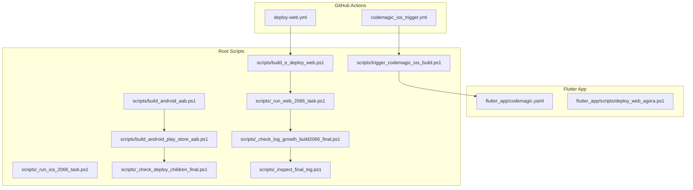
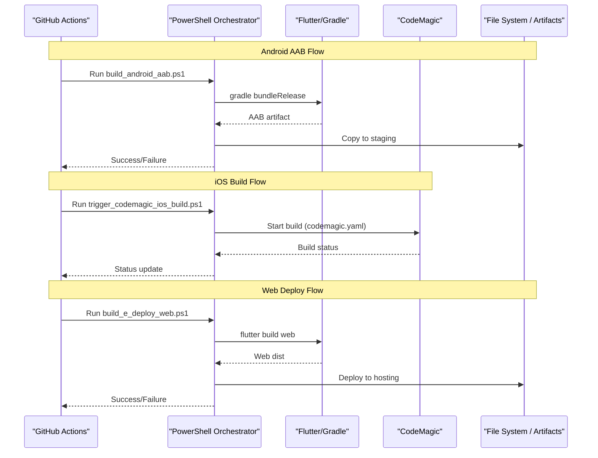
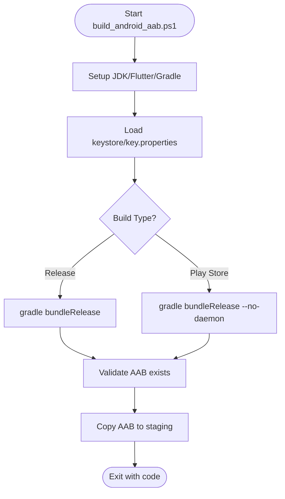
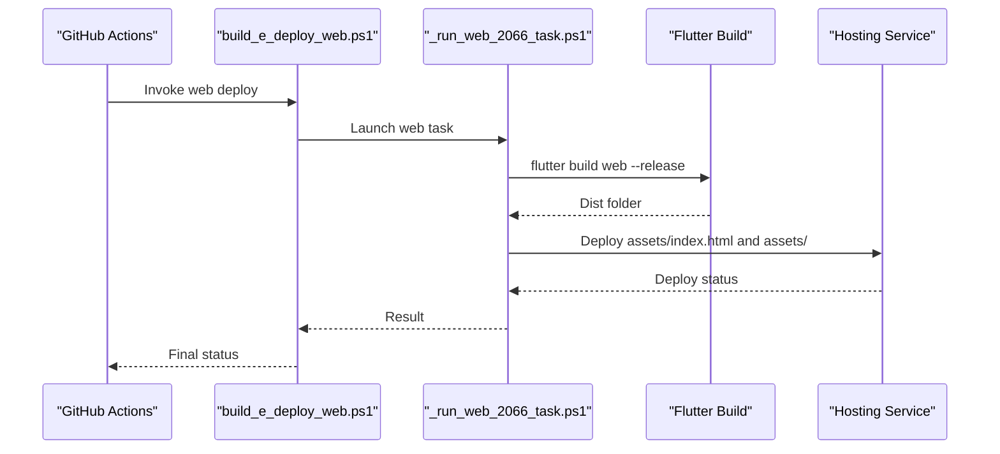
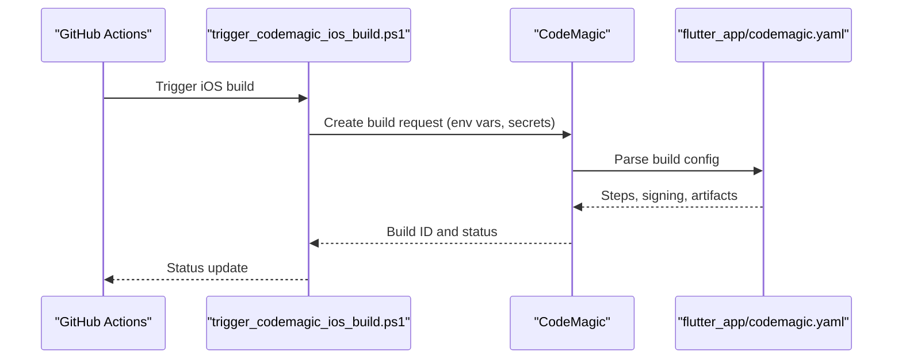
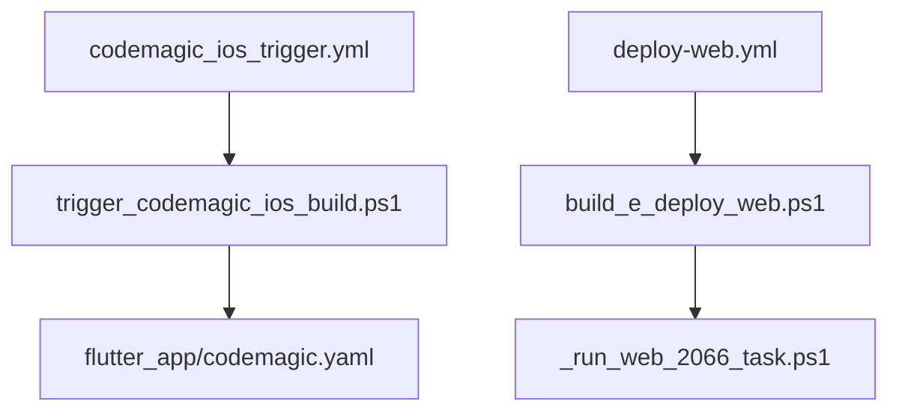
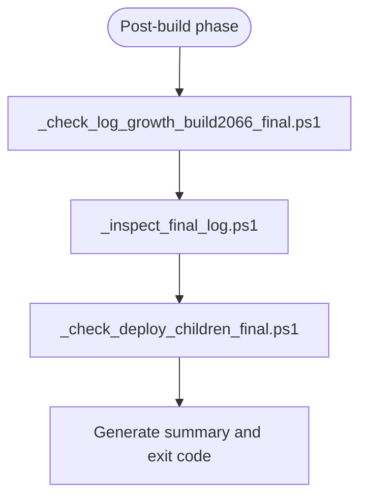
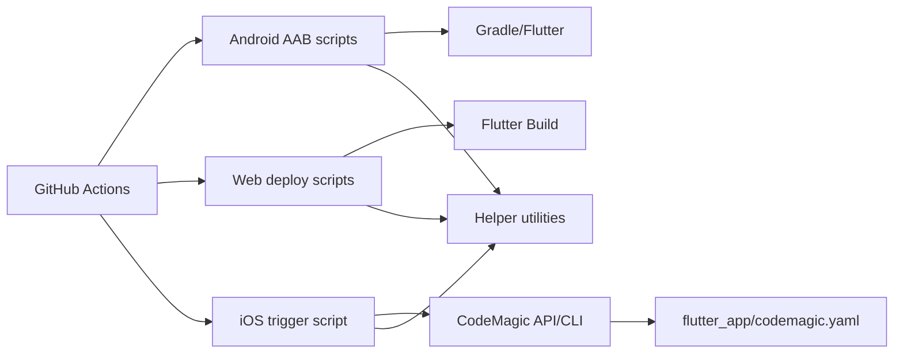

# Build Triggers & Automation

<cite>
**Referenced Files in This Document**
- [codemagic_ios_trigger.yml](file://.github/workflows/codemagic_ios_trigger.yml)
- [deploy-web.yml](file://.github/workflows/deploy-web.yml)
- [build_android_aab.ps1](file://scripts/build_android_aab.ps1)
- [build_android_play_store_aab.ps1](file://scripts/build_android_play_store_aab.ps1)
- [build_e_deploy_web.ps1](file://scripts/build_e_deploy_web.ps1)
- [trigger_codemagic_ios_build.ps1](file://scripts/trigger_codemagic_ios_build.ps1)
- [codemagic.yaml](file://codemagic.yaml)
- [flutter_app/codemagic.yaml](file://flutter_app/codemagic.yaml)
- [flutter_app/scripts/deploy_web_agora.ps1](file://flutter_app/scripts/deploy_web_agora.ps1)
- [scripts/_run_web_2066_task.ps1](file://scripts/_run_web_2066_task.ps1)
- [scripts/_run_ios_2066_task.ps1](file://scripts/_run_ios_2066_task.ps1)
- [scripts/_check_deploy_children_final.ps1](file://scripts/_check_deploy_children_final.ps1)
- [scripts/_check_log_growth_build2066_final.ps1](file://scripts/_check_log_growth_build2066_final.ps1)
- [scripts/_inspect_final_log.ps1](file://scripts/_inspect_final_log.ps1)
- [scripts/flutter_analyze_relax.ps1](file://scripts/flutter_analyze_relax.ps1)
- [scripts/fetch_firebase_rules_gcp_watchdog.ps1](file://scripts/firebase_rules_gcp_watchdog.ps1)
</cite>

## Table of Contents
1. Introduction
2. Project Structure
3. Core Components
4. Architecture Overview
5. Detailed Component Analysis
6. Dependency Analysis
7. Performance Considerations
8. Troubleshooting Guide
9. Conclusion

## Introduction
This document explains the build triggers and automation scripts used to produce Android AAB artifacts, deploy the web application, and trigger iOS builds. It covers Git hooks and branch-based triggers, manual trigger mechanisms, environment variable configuration, secret management, error handling, caching strategies, incremental builds, parallel execution, maintenance practices, testing automation, and debugging failed builds.

## Project Structure
The automation spans multiple layers:
- GitHub Actions workflows for CI/CD triggers
- Flutter project codemagic configuration for iOS builds
- PowerShell orchestration scripts for Android AAB builds, web deployment, and iOS triggering
- Supporting helper scripts for logging, checks, and diagnostics

**Diagram sources**
- [codemagic_ios_trigger.yml](file://.github/workflows/codemagic_ios_trigger.yml)
- [deploy-web.yml](file://.github/workflows/deploy-web.yml)
- [flutter_app/codemagic.yaml](file://flutter_app/codemagic.yaml)
- [scripts/build_android_aab.ps1](file://scripts/build_android_aab.ps1)
- [scripts/build_android_play_store_aab.ps1](file://scripts/build_android_play_store_aab.ps1)
- [scripts/build_e_deploy_web.ps1](file://scripts/build_e_deploy_web.ps1)
- [scripts/trigger_codemagic_ios_build.ps1](file://scripts/trigger_codemagic_ios_build.ps1)
- [scripts/_run_web_2066_task.ps1](file://scripts/_run_web_2066_task.ps1)
- [scripts/_run_ios_2066_task.ps1](file://scripts/_run_ios_2066_task.ps1)
- [scripts/_check_deploy_children_final.ps1](file://scripts/_check_deploy_children_final.ps1)
- [scripts/_check_log_growth_build2066_final.ps1](file://scripts/_check_log_growth_build2066_final.ps1)
- [scripts/_inspect_final_log.ps1](file://scripts/_inspect_final_log.ps1)

**Section sources**
- [codemagic_ios_trigger.yml](file://.github/workflows/codemagic_ios_trigger.yml)
- [deploy-web.yml](file://.github/workflows/deploy-web.yml)
- [flutter_app/codemagic.yaml](file://flutter_app/codemagic.yaml)
- [scripts/build_android_aab.ps1](file://scripts/build_android_aab.ps1)
- [scripts/build_android_play_store_aab.ps1](file://scripts/build_android_play_store_aab.ps1)
- [scripts/build_e_deploy_web.ps1](file://scripts/build_e_deploy_web.ps1)
- [scripts/trigger_codemagic_ios_build.ps1](file://scripts/trigger_codemagic_ios_build.ps1)

## Core Components
- GitHub Actions workflows:
  - iOS trigger workflow that invokes a PowerShell script to start an iOS build via CodeMagic.
  - Web deployment workflow that runs a PowerShell pipeline to build and deploy the Flutter web app.
- Flutter CodeMagic configuration:
  - Defines iOS build steps, signing, and artifact export.
- PowerShell orchestrators:
  - Android AAB builder and Play Store variant builder.
  - Web build-and-deploy pipeline with task runners and health checks.
  - iOS trigger script that calls CodeMagic API or CLI.
- Helper utilities:
  - Logging, log growth monitoring, final inspection, and child process checks.

Key responsibilities:
- Environment setup (JDK, Flutter, Gradle, Node).
- Secret injection (keystore, Apple credentials, Firebase tokens).
- Build execution with caching and incremental flags.
- Artifact packaging and upload.
- Post-build validation and notifications.

**Section sources**
- [codemagic_ios_trigger.yml](file://.github/workflows/codemagic_ios_trigger.yml)
- [deploy-web.yml](file://.github/workflows/deploy-web.yml)
- [flutter_app/codemagic.yaml](file://flutter_app/codemagic.yaml)
- [scripts/build_android_aab.ps1](file://scripts/build_android_aab.ps1)
- [scripts/build_android_play_store_aab.ps1](file://scripts/build_android_play_store_aab.ps1)
- [scripts/build_e_deploy_web.ps1](file://scripts/build_e_deploy_web.ps1)
- [scripts/trigger_codemagic_ios_build.ps1](file://scripts/trigger_codemagic_ios_build.ps1)

## Architecture Overview
End-to-end flows:
- Android AAB:
  - Triggered by branch events or manually; executes build_android_aab.ps1 which delegates to build_android_play_store_aab.ps1 for release signing and artifact generation.
- Web Deployment:
  - GitHub Actions workflow runs build_e_deploy_web.ps1, which launches _run_web_2066_task.ps1 to compile Flutter web and deploy via hosting or Firebase.
- iOS Build:
  - GitHub Actions workflow triggers trigger_codemagic_ios_build.ps1, which starts a CodeMagic build using flutter_app/codemagic.yaml.

**Diagram sources**
- [scripts/build_android_aab.ps1](file://scripts/build_android_aab.ps1)
- [scripts/build_android_play_store_aab.ps1](file://scripts/build_android_play_store_aab.ps1)
- [scripts/build_e_deploy_web.ps1](file://scripts/build_e_deploy_web.ps1)
- [scripts/trigger_codemagic_ios_build.ps1](file://scripts/trigger_codemagic_ios_build.ps1)
- [flutter_app/codemagic.yaml](file://flutter_app/codemagic.yaml)

## Detailed Component Analysis

### Android AAB Build Pipeline
Responsibilities:
- Prepare environment (JDK, Flutter, Gradle).
- Resolve secrets (keystore, key properties).
- Execute release build with caching and incremental flags.
- Validate outputs and copy artifacts.

**Diagram sources**
- [scripts/build_android_aab.ps1](file://scripts/build_android_aab.ps1)
- [scripts/build_android_play_store_aab.ps1](file://scripts/build_android_play_store_aab.ps1)

**Section sources**
- [scripts/build_android_aab.ps1](file://scripts/build_android_aab.ps1)
- [scripts/build_android_play_store_aab.ps1](file://scripts/build_android_play_store_aab.ps1)

### Web Deployment Pipeline
Responsibilities:
- Install dependencies and cache them.
- Build Flutter web with optimizations.
- Deploy to hosting service (Firebase Hosting or static host).
- Monitor logs and verify deployment.

**Diagram sources**
- [scripts/build_e_deploy_web.ps1](file://scripts/build_e_deploy_web.ps1)
- [scripts/_run_web_2066_task.ps1](file://scripts/_run_web_2066_task.ps1)
- [flutter_app/scripts/deploy_web_agora.ps1](file://flutter_app/scripts/deploy_web_agora.ps1)

**Section sources**
- [scripts/build_e_deploy_web.ps1](file://scripts/build_e_deploy_web.ps1)
- [scripts/_run_web_2066_task.ps1](file://scripts/_run_web_2066_task.ps1)
- [flutter_app/scripts/deploy_web_agora.ps1](file://flutter_app/scripts/deploy_web_agora.ps1)

### iOS Build Triggering via CodeMagic
Responsibilities:
- Authenticate with CodeMagic API/CLI.
- Pass required secrets securely.
- Start build using codemagic.yaml.
- Poll build status and report results.

**Diagram sources**
- [scripts/trigger_codemagic_ios_build.ps1](file://scripts/trigger_codemagic_ios_build.ps1)
- [flutter_app/codemagic.yaml](file://flutter_app/codemagic.yaml)

**Section sources**
- [scripts/trigger_codemagic_ios_build.ps1](file://scripts/trigger_codemagic_ios_build.ps1)
- [flutter_app/codemagic.yaml](file://flutter_app/codemagic.yaml)

### GitHub Actions Workflows
- codemagic_ios_trigger.yml:
  - Branch-based triggers for iOS builds.
  - Injects secrets from repository settings.
  - Calls PowerShell to start CodeMagic build.
- deploy-web.yml:
  - Branch-based triggers for web deployments.
  - Sets up Node/Flutter environments.
  - Executes web build and deployment scripts.

**Diagram sources**
- [codemagic_ios_trigger.yml](file://.github/workflows/codemagic_ios_trigger.yml)
- [deploy-web.yml](file://.github/workflows/deploy-web.yml)
- [scripts/trigger_codemagic_ios_build.ps1](file://scripts/trigger_codemagic_ios_build.ps1)
- [scripts/build_e_deploy_web.ps1](file://scripts/build_e_deploy_web.ps1)
- [flutter_app/codemagic.yaml](file://flutter_app/codemagic.yaml)
- [scripts/_run_web_2066_task.ps1](file://scripts/_run_web_2066_task.ps1)

**Section sources**
- [codemagic_ios_trigger.yml](file://.github/workflows/codemagic_ios_trigger.yml)
- [deploy-web.yml](file://.github/workflows/deploy-web.yml)

### Helper Utilities and Diagnostics
- Log growth monitoring:
  - _check_log_growth_build2066_final.ps1 monitors build logs for anomalies.
- Final inspection:
  - _inspect_final_log.ps1 summarizes errors and warnings.
- Child process checks:
  - _check_deploy_children_final.ps1 ensures all background tasks completed successfully.

**Diagram sources**
- [scripts/_check_log_growth_build2066_final.ps1](file://scripts/_check_log_growth_build2066_final.ps1)
- [scripts/_inspect_final_log.ps1](file://scripts/_inspect_final_log.ps1)
- [scripts/_check_deploy_children_final.ps1](file://scripts/_check_deploy_children_final.ps1)

**Section sources**
- [scripts/_check_log_growth_build2066_final.ps1](file://scripts/_check_log_growth_build2066_final.ps1)
- [scripts/_inspect_final_log.ps1](file://scripts/_inspect_final_log.ps1)
- [scripts/_check_deploy_children_final.ps1](file://scripts/_check_deploy_children_final.ps1)

## Dependency Analysis
Component relationships:
- GitHub Actions workflows depend on PowerShell orchestrators.
- PowerShell orchestrators depend on Flutter/Gradle toolchains and external services (CodeMagic, hosting providers).
- CodeMagic YAML defines iOS build steps and signing configurations.
- Helper scripts provide cross-cutting concerns (logging, checks, diagnostics).

**Diagram sources**
- [deploy-web.yml](file://.github/workflows/deploy-web.yml)
- [codemagic_ios_trigger.yml](file://.github/workflows/codemagic_ios_trigger.yml)
- [scripts/build_android_aab.ps1](file://scripts/build_android_aab.ps1)
- [scripts/build_e_deploy_web.ps1](file://scripts/build_e_deploy_web.ps1)
- [scripts/trigger_codemagic_ios_build.ps1](file://scripts/trigger_codemagic_ios_build.ps1)
- [flutter_app/codemagic.yaml](file://flutter_app/codemagic.yaml)

**Section sources**
- [deploy-web.yml](file://.github/workflows/deploy-web.yml)
- [codemagic_ios_trigger.yml](file://.github/workflows/codemagic_ios_trigger.yml)
- [scripts/build_android_aab.ps1](file://scripts/build_android_aab.ps1)
- [scripts/build_e_deploy_web.ps1](file://scripts/build_e_deploy_web.ps1)
- [scripts/trigger_codemagic_ios_build.ps1](file://scripts/trigger_codemagic_ios_build.ps1)
- [flutter_app/codemagic.yaml](file://flutter_app/codemagic.yaml)

## Performance Considerations
- Caching:
  - Cache Flutter pub packages, Gradle caches, and Node modules to reduce build times.
  - Use platform-specific caches for iOS (Pods, derived data) and Android (Gradle).
- Incremental builds:
  - Enable Flutter incremental compilation and Gradle daemon where appropriate.
  - Avoid full rebuilds by isolating changed modules.
- Parallel execution:
  - Run independent tasks concurrently (e.g., analyze + unit tests while building).
  - Use parallel stages in GitHub Actions for faster feedback.
- Artifact management:
  - Minimize artifact sizes and use selective uploads.
- Network optimization:
  - Pin dependency versions and mirror repositories if necessary.

[No sources needed since this section provides general guidance]

## Troubleshooting Guide
Common issues and resolutions:
- Missing secrets:
  - Ensure keystore, key passwords, Apple credentials, and Firebase tokens are configured in repository settings or CodeMagic environment variables.
- Build failures:
  - Review logs generated by _inspect_final_log.ps1 and _check_log_growth_build2066_final.ps1 for error patterns.
  - Verify environment setup (JDK version, Flutter channel, Node version).
- Deployment problems:
  - Check hosting service permissions and domain alignment.
  - Validate Firebase rules and storage CORS policies.
- iOS signing issues:
  - Confirm provisioning profiles match bundle identifiers and entitlements.
  - Reinstall signing certificates and refresh CodeMagic profiles.

Debugging steps:
- Run flutter_analyze_relax.ps1 to catch static analysis issues early.
- Use firebase_rules_gcp_watchdog.ps1 to monitor rule changes and validate syntax.
- Inspect intermediate artifacts and logs produced by helper scripts.

**Section sources**
- [scripts/_inspect_final_log.ps1](file://scripts/_inspect_final_log.ps1)
- [scripts/_check_log_growth_build2066_final.ps1](file://scripts/_check_log_growth_build2066_final.ps1)
- [scripts/flutter_analyze_relax.ps1](file://scripts/flutter_analyze_relax.ps1)
- [scripts/firebase_rules_gcp_watchdog.ps1](file://scripts/firebase_rules_gcp_watchdog.ps1)

## Conclusion
The automation suite integrates GitHub Actions, PowerShell orchestrators, Flutter toolchains, and CodeMagic to deliver consistent Android AAB builds, web deployments, and iOS builds. By leveraging caching, incremental builds, and parallel execution, the pipelines achieve fast and reliable results. Proper secret management, robust error handling, and comprehensive diagnostics ensure maintainability and ease of troubleshooting.

[No sources needed since this section summarizes without analyzing specific files]