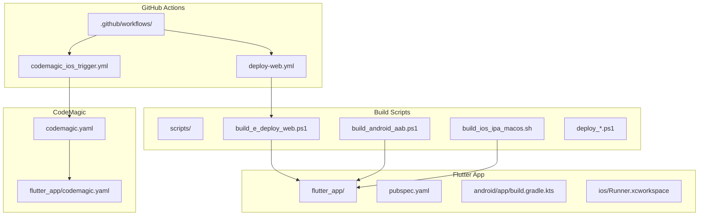
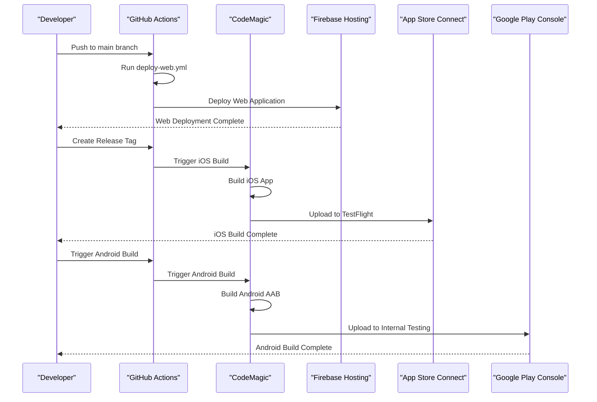
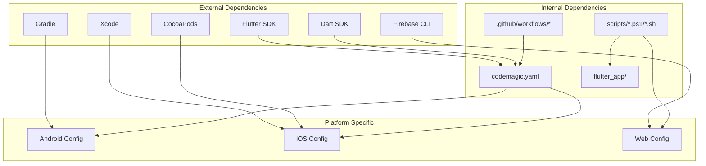

# CI/CD Pipeline Configuration

<cite>
**Referenced Files in This Document**
- [codemagic.yaml](file://codemagic.yaml)
- [flutter_app/codemagic.yaml](file://flutter_app/codemagic.yaml)
- [.github/workflows/codemagic_ios_trigger.yml](file://.github/workflows/codemagic_ios_trigger.yml)
- [.github/workflows/deploy-web.yml](file://.github/workflows/deploy-web.yml)
- [scripts/build_android_aab.ps1](file://scripts/build_android_aab.ps1)
- [scripts/build_e_deploy_web.ps1](file://scripts/build_e_deploy_web.ps1)
- [scripts/build_ios_ipa_macos.sh](file://scripts/build_ios_ipa_macos.sh)
- [scripts/deploy_web_hosting.ps1](file://scripts/deploy_web_hosting.ps1)
- [scripts/trigger_codemagic_ios_build.ps1](file://scripts/trigger_codemagic_ios_build.ps1)
- [flutter_app/pubspec.yaml](file://flutter_app/pubspec.yaml)
- [flutter_app/android/app/build.gradle.kts](file://flutter_app/android/app/build.gradle.kts)
- [flutter_app/ios/Runner.xcworkspace](file://flutter_app/ios/Runner.xcworkspace)
</cite>

## Table of Contents
1. [Introduction](#introduction)
2. [Project Structure](#project-structure)
3. [Core Components](#core-components)
4. [Architecture Overview](#architecture-overview)
5. [Detailed Component Analysis](#detailed-component-analysis)
6. [Dependency Analysis](#dependency-analysis)
7. [Performance Considerations](#performance-considerations)
8. [Troubleshooting Guide](#troubleshooting-guide)
9. [Conclusion](#conclusion)

## Introduction

The Gestão Yahweh Premium application implements a comprehensive CI/CD pipeline using CodeMagic and GitHub Actions to automate the build, test, and deployment processes across multiple platforms including web, iOS, and Android. The pipeline is designed to handle parallel builds, manage secrets securely, and provide robust artifact management for production releases.

This documentation covers the complete CI/CD configuration, explaining how the automated workflows are triggered, configured, and executed to deliver high-quality releases efficiently.

## Project Structure

The CI/CD pipeline is organized across multiple configuration files and scripts:

**Diagram sources**
- [.github/workflows/codemagic_ios_trigger.yml:1-50](file://.github/workflows/codemagic_ios_trigger.yml#L1-L50)
- [.github/workflows/deploy-web.yml:1-50](file://.github/workflows/deploy-web.yml#L1-L50)
- [codemagic.yaml:1-100](file://codemagic.yaml#L1-L100)
- [flutter_app/codemagic.yaml:1-100](file://flutter_app/codemagic.yaml#L1-L100)

**Section sources**
- [.github/workflows/codemagic_ios_trigger.yml:1-50](file://.github/workflows/codemagic_ios_trigger.yml#L1-L50)
- [.github/workflows/deploy-web.yml:1-50](file://.github/workflows/deploy-web.yml#L1-L50)
- [codemagic.yaml:1-100](file://codemagic.yaml#L1-L100)

## Core Components

### CodeMagic Configuration
The CodeMagic configuration defines the build environments, scripts, and deployment targets for iOS and Android applications. It handles code signing, dependency management, and platform-specific build processes.

### GitHub Actions Workflows
GitHub Actions workflows orchestrate the CI/CD pipeline, triggering CodeMagic builds for mobile platforms and handling web deployments directly through Firebase hosting.

### Build Scripts
PowerShell and shell scripts automate complex build processes, including environment setup, dependency installation, signing configuration, and deployment tasks.

### Flutter Application Configuration
The Flutter app configuration includes platform-specific settings for Android and iOS, version management, and build optimizations.

**Section sources**
- [codemagic.yaml:1-100](file://codemagic.yaml#L1-L100)
- [flutter_app/codemagic.yaml:1-100](file://flutter_app/codemagic.yaml#L1-L100)
- [flutter_app/pubspec.yaml:1-50](file://flutter_app/pubspec.yaml#L1-L50)

## Architecture Overview

The CI/CD pipeline follows a multi-stage architecture that separates concerns between different platforms and deployment targets:

**Diagram sources**
- [.github/workflows/deploy-web.yml:1-100](file://.github/workflows/deploy-web.yml#L1-L100)
- [.github/workflows/codemagic_ios_trigger.yml:1-100](file://.github/workflows/codemagic_ios_trigger.yml#L1-L100)
- [scripts/trigger_codemagic_ios_build.ps1:1-50](file://scripts/trigger_codemagic_ios_build.ps1#L1-L50)

## Detailed Component Analysis

### CodeMagic Configuration Analysis

The CodeMagic configuration manages the build environment and deployment processes for mobile platforms:

#### iOS Build Process
The iOS build process includes code signing, dependency resolution, and App Store Connect integration. It handles certificate management, provisioning profiles, and IPA generation for distribution.

#### Android Build Process  
The Android build process manages APK/AAB generation, Google Services configuration, and Play Store upload preparation. It includes ProGuard optimization and signing configuration.

#### Environment Variables and Secrets
CodeMagic uses secure environment variables for sensitive information like API keys, signing certificates, and deployment credentials. These are managed through the CodeMagic dashboard and accessed securely during builds.

**Section sources**
- [codemagic.yaml:1-200](file://codemagic.yaml#L1-L200)
- [flutter_app/codemagic.yaml:1-200](file://flutter_app/codemagic.yaml#L1-L200)

### GitHub Actions Workflow Analysis

#### Web Deployment Workflow
The web deployment workflow automates the build and deployment of the Flutter web application to Firebase hosting. It includes dependency installation, build optimization, and static asset deployment.

#### iOS Build Trigger Workflow
The iOS build trigger workflow initiates CodeMagic builds when specific conditions are met, such as release tags or manual triggers. It passes necessary parameters and secrets to the CodeMagic build process.

#### Parallel Execution Strategy
The workflows implement parallel execution for independent tasks, reducing overall build time while maintaining resource efficiency.

**Section sources**
- [.github/workflows/deploy-web.yml:1-150](file://.github/workflows/deploy-web.yml#L1-L150)
- [.github/workflows/codemagic_ios_trigger.yml:1-150](file://.github/workflows/codemagic_ios_trigger.yml#L1-L150)

### Build Script Analysis

#### Android Build Script
The Android build script handles Gradle wrapper setup, dependency resolution, signing configuration, and AAB generation. It includes error handling and logging for troubleshooting.

#### iOS Build Script  
The iOS build script manages Xcode workspace configuration, CocoaPods installation, code signing, and IPA generation for distribution.

#### Web Deployment Script
The web deployment script optimizes Flutter web builds, generates static assets, and deploys to Firebase hosting with caching strategies.

**Section sources**
- [scripts/build_android_aab.ps1:1-100](file://scripts/build_android_aab.ps1#L1-L100)
- [scripts/build_ios_ipa_macos.sh:1-100](file://scripts/build_ios_ipa_macos.sh#L1-L100)
- [scripts/deploy_web_hosting.ps1:1-100](file://scripts/deploy_web_hosting.ps1#L1-L100)

### Flutter Application Configuration

#### Platform-Specific Settings
The Flutter application includes platform-specific configurations for Android (build.gradle.kts) and iOS (Xcode workspace) that define build variants, signing configurations, and optimization settings.

#### Dependency Management
The pubspec.yaml file manages Flutter dependencies, ensuring consistent builds across different environments and versions.

**Section sources**
- [flutter_app/android/app/build.gradle.kts:1-100](file://flutter_app/android/app/build.gradle.kts#L1-L100)
- [flutter_app/pubspec.yaml:1-100](file://flutter_app/pubspec.yaml#L1-L100)

## Dependency Analysis

The CI/CD pipeline has well-defined dependencies between components:

**Diagram sources**
- [flutter_app/pubspec.yaml:1-50](file://flutter_app/pubspec.yaml#L1-L50)
- [flutter_app/android/app/build.gradle.kts:1-50](file://flutter_app/android/app/build.gradle.kts#L1-L50)
- [flutter_app/ios/Runner.xcworkspace:1-1](file://flutter_app/ios/Runner.xcworkspace#L1-L1)

**Section sources**
- [flutter_app/pubspec.yaml:1-100](file://flutter_app/pubspec.yaml#L1-L100)
- [flutter_app/android/app/build.gradle.kts:1-100](file://flutter_app/android/app/build.gradle.kts#L1-L100)

## Performance Considerations

### Build Optimization Strategies
- **Parallel Builds**: Independent tasks run concurrently to reduce total build time
- **Caching**: Dependencies and build artifacts are cached between runs
- **Incremental Builds**: Only changed components are rebuilt when possible
- **Resource Optimization**: Build agents are sized appropriately for workload

### Caching Strategies
- **Flutter Dependencies**: `~/.pub-cache` directory caching
- **Android Dependencies**: Gradle cache directory caching  
- **iOS Dependencies**: CocoaPods cache directory caching
- **Build Artifacts**: Intermediate build outputs cached for faster iteration

### Artifact Management
- **Versioned Artifacts**: Each build produces versioned artifacts for traceability
- **Cleanup Policies**: Old artifacts are automatically cleaned to save storage
- **Distribution Channels**: Different artifacts for development, testing, and production

### Monitoring and Logging
- **Build Metrics**: Track build times, success rates, and resource usage
- **Error Tracking**: Comprehensive logging for debugging failed builds
- **Performance Alerts**: Notifications for builds exceeding time thresholds

## Troubleshooting Guide

### Common Build Failures

#### iOS Build Issues
- **Certificate Problems**: Verify signing certificates and provisioning profiles
- **Dependency Conflicts**: Check for version mismatches in Podfile.lock
- **Memory Limitations**: Increase build agent memory for large projects

#### Android Build Issues  
- **Gradle Configuration**: Validate build.gradle.kts syntax and dependencies
- **Signing Errors**: Ensure keystore passwords and aliases are correct
- **Resource Compilation**: Check for duplicate resources or missing assets

#### Web Deployment Issues
- **Firebase Configuration**: Verify firebase.json and service account permissions
- **Asset Loading**: Ensure all static assets are properly included
- **Domain Configuration**: Check custom domain and SSL certificate setup

### Debugging Techniques
- **Verbose Logging**: Enable detailed logging in build scripts
- **Local Reproduction**: Use local scripts to reproduce CI failures
- **Artifact Inspection**: Download and inspect build artifacts for analysis
- **Environment Validation**: Verify all required tools and dependencies are installed

### Performance Optimization
- **Build Time Analysis**: Identify slow steps in the build pipeline
- **Resource Utilization**: Monitor CPU and memory usage during builds
- **Cache Effectiveness**: Analyze cache hit rates and optimize cache keys
- **Parallelization**: Maximize parallel execution where possible

**Section sources**
- [scripts/build_android_aab.ps1:1-100](file://scripts/build_android_aab.ps1#L1-L100)
- [scripts/build_ios_ipa_macos.sh:1-100](file://scripts/build_ios_ipa_macos.sh#L1-L100)
- [scripts/deploy_web_hosting.ps1:1-100](file://scripts/deploy_web_hosting.ps1#L1-L100)

## Conclusion

The CI/CD pipeline for Gestão Yahweh Premium provides a robust, scalable, and maintainable automation solution for multi-platform application delivery. The combination of CodeMagic for mobile builds and GitHub Actions for web deployment creates an efficient workflow that supports rapid iteration while maintaining quality standards.

Key strengths of the implementation include:
- **Multi-Platform Support**: Seamless builds for iOS, Android, and Web
- **Security**: Proper secrets management and secure deployment processes
- **Performance**: Optimized build times through caching and parallelization
- **Reliability**: Comprehensive error handling and monitoring capabilities
- **Scalability**: Flexible architecture that can accommodate future growth

The pipeline serves as a foundation for continuous delivery, enabling the development team to focus on feature development while automated systems handle the complexities of building, testing, and deploying the application across multiple platforms.