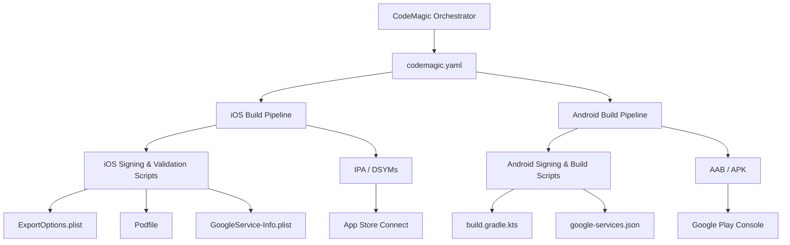

# CodeMagic Configuration

<cite>
**Referenced Files in This Document**
- [codemagic.yaml](file://flutter_app/codemagic.yaml)
- [codemagic_ios_install_signing.sh](file://scripts/codemagic_ios_install_signing.sh)
- [codemagic_ios_install_signing_api_only.sh](file://scripts/codemagic_ios_install_signing_api_only.sh)
- [codemagic_ios_prepare_build_ipa.sh](file://scripts/codemagic_ios_prepare_build_ipa.sh)
- [codemagic_ios_validate_export_options.py](file://scripts/codemagic_ios_validate_export_options.py)
- [codemagic_ios_write_export_options.py](file://scripts/codemagic_ios_write_export_options.py)
- [codemagic_ios_verify_env_apple_and_signing.sh](file://scripts/codemagic_ios_verify_env_apple_and_signing.sh)
- [codemagic_ios_fetch_profile_matching_p12.sh](file://scripts/codemagic_ios_fetch_profile_matching_p12.sh)
- [codemagic_ios_ensure_deployment_target_15.sh](file://scripts/codemagic_ios_ensure_deployment_target_15.sh)
- [codemagic_ios_bump_pods_deployment_to_14.sh](file://scripts/codemagic_ios_bump_pods_deployment_to_14.sh)
- [codemagic_ios_bump_pods_deployment_to_15.sh](file://scripts/codemagic_ios_bump_pods_deployment_to_15.sh)
- [codemagic_ios_pod_install.sh](file://scripts/codemagic_ios_pod_install.sh)
- [codemagic_ios_upload_crashlytics_dsyms.sh](file://scripts/codemagic_ios_upload_crashlytics_dsyms.sh)
- [codemagic_ios_normalize_ipa_for_asc.sh](file://scripts/codemagic_ios_normalize_ipa_for_asc.sh)
- [codemagic_ios_sync_version_from_app_version_dart.sh](file://scripts/codemagic_ios_sync_version_from_app_version_dart.sh)
- [codemagic_ios_read_asc_floor.sh](file://scripts/codemagic_ios_read_asc_floor.sh)
- [codemagic_ios_stamp_asc_floor.sh](file://scripts/codemagic_ios_stamp_asc_floor.sh)
- [codemagic_ios_asc_latest_build_number.sh](file://scripts/codemagic_ios_asc_latest_build_number.sh)
- [codemagic_ios_enable_push_notifications.py](file://scripts/codemagic_ios_enable_push_notifications.py)
- [codemagic_ios_enable_app_groups.py](file://scripts/codemagic_ios_enable_app_groups.py)
- [codemagic_ios_enable_sign_in_with_apple.py](file://scripts/codemagic_ios_enable_sign_in_with_apple.py)
- [codemagic_ios_ensure_widget_appstore_profile.py](file://scripts/codemagic_ios_ensure_widget_appstore_profile.py)
- [codemagic_ios_delete_appstore_profiles.py](file://scripts/codemagic_ios_delete_appstore_profiles.py)
- [codemagic_ios_profile_utils.py](file://scripts/codemagic_ios_profile_utils.py)
- [codemagic_ios_team_signing_prepare_exportoptions.sh](file://scripts/codemagic_ios_team_signing_prepare_exportoptions.sh)
- [codemagic_ios_pre_publish_90189_gate.sh](file://scripts/codemagic_ios_pre_publish_90189_gate.sh)
- [codemagic_ios_cp_ipa_safe.sh](file://scripts/codemagic_ios_cp_ipa_safe.sh)
- [codemagic_ios_p12_password_helpers.sh](file://scripts/codemagic_ios_p12_password_helpers.sh)
- [codemagic_ios_verify_profile_matches_p12.sh](file://scripts/codemagic_ios_verify_profile_matches_p12.sh)
- [codemagic_ios_verify_widget_profile.py](file://scripts/codemagic_ios_verify_widget_profile.py)
- [build_ios_ipa_macos.sh](file://scripts/build_ios_ipa_macos.sh)
- [prepare_codemagic_paste_from_bootstrap.ps1](file://IOS/prepare_codemagic_paste_from_bootstrap.ps1)
- [CODEMAGIC_APP_STORE_INTEGRATION.txt](file://IOS/CODEMAGIC_APP_STORE_INTEGRATION.txt)
- [CODEMAGIC_SIGNING_FIX.md](file://IOS/CODEMAGIC_SIGNING_FIX.md)
- [CODEMAGIC_INVALID_BINARY.md](file://IOS/CODEMAGIC_INVALID_BINARY.md)
- [CODEMAGIC_90189.md](file://IOS/CODEMAGIC_90189.md)
- [CODEMAGIC_FETCH_CONFIG.txt](file://IOS/CODEMAGIC_FETCH_CONFIG.txt)
- [CREDENCIAIS_APPLE_ATUAL.txt](file://IOS/CREDENCIAIS_APPLE_ATUAL.txt)
- [app_store_connect_issuer_id.txt](file://IOS/app_store_connect_issuer_id.txt)
- [ExportOptions.plist](file://flutter_app/ios/ExportOptions.plist)
- [Podfile](file://flutter_app/ios/Podfile)
- [GoogleService-Info.plist](file://flutter_app/ios/Runner/GoogleService-Info.plist)
- [google-services.json](file://flutter_app/android/app/google-services.json)
- [build.gradle.kts](file://flutter_app/android/app/build.gradle.kts)
- [key.properties.example](file://flutter_app/android/key.properties.example)
- [pubspec.yaml](file://flutter_app/pubspec.yaml)
- [firebase.json](file://flutter_app/firebase.json)
</cite>

## Table of Contents
1. [Introduction](#introduction)
2. [Project Structure](#project-structure)
3. [Core Components](#core-components)
4. [Architecture Overview](#architecture-overview)
5. [Detailed Component Analysis](#detailed-component-analysis)
6. [Dependency Analysis](#dependency-analysis)
7. [Performance Considerations](#performance-considerations)
8. [Troubleshooting Guide](#troubleshooting-guide)
9. [Conclusion](#conclusion)
10. [Appendices](#appendices)

## Introduction
This document provides comprehensive CodeMagic configuration guidance for the Gestão Yahweh Premium Flutter application. It explains the codemagic.yaml structure, build targets, environment variables, secrets management, and platform-specific configurations for iOS and Android. It also covers signing certificates, provisioning profiles, App Store Connect integration, Flutter builds, native integrations, custom scripts, caching strategies, parallel builds, artifact management, troubleshooting, and performance optimization.

## Project Structure
The repository contains a Flutter app under flutter_app with native iOS and Android directories, plus a rich set of scripts under scripts to automate CodeMagic workflows. The root-level codemagic.yaml is used by CodeMagic to orchestrate builds across platforms. Key configuration artifacts include:
- Flutter app configuration (pubspec.yaml, firebase.json)
- iOS project files (Podfile, ExportOptions.plist, GoogleService-Info.plist)
- Android project files (build.gradle.kts, google-services.json, key properties)
- CodeMagic scripts for signing, validation, and publishing



**Diagram sources**
- [codemagic.yaml](file://flutter_app/codemagic.yaml)
- [ExportOptions.plist](file://flutter_app/ios/ExportOptions.plist)
- [Podfile](file://flutter_app/ios/Podfile)
- [GoogleService-Info.plist](file://flutter_app/ios/Runner/GoogleService-Info.plist)
- [build.gradle.kts](file://flutter_app/android/app/build.gradle.kts)
- [google-services.json](file://flutter_app/android/app/google-services.json)

**Section sources**
- [codemagic.yaml](file://flutter_app/codemagic.yaml)
- [pubspec.yaml](file://flutter_app/pubspec.yaml)
- [firebase.json](file://flutter_app/firebase.json)

## Core Components
- codemagic.yaml: Defines workflows, environments, triggers, and steps for building and deploying Flutter apps on iOS and Android.
- iOS signing and validation scripts: Automate certificate installation, profile matching, export options generation, and IPA normalization.
- Android build and signing: Gradle-based AAB/APK generation using keystore properties and Google services configuration.
- Flutter toolchain: pub get, analyze, test, and build commands orchestrated via CodeMagic steps.
- Secrets and environment variables: Managed through CodeMagic’s secure storage and injected into build steps.

Key responsibilities:
- Environment setup: Install Flutter, CocoaPods, Java, and dependencies.
- Signing: Import P12, install provisioning profiles, configure export options.
- Build: Generate platform artifacts (IPA/AAB).
- Validate: Ensure signatures, entitlements, and metadata are correct.
- Publish: Upload to App Store Connect or Google Play.

**Section sources**
- [codemagic.yaml](file://flutter_app/codemagic.yaml)
- [codemagic_ios_install_signing.sh](file://scripts/codemagic_ios_install_signing.sh)
- [codemagic_ios_validate_export_options.py](file://scripts/codemagic_ios_validate_export_options.py)
- [build.gradle.kts](file://flutter_app/android/app/build.gradle.kts)

## Architecture Overview
The CodeMagic pipeline orchestrates multi-platform builds with clear separation between Flutter logic and native platform concerns. iOS builds rely on Apple signing infrastructure and CocoaPods; Android builds use Gradle and Google services. Custom scripts encapsulate complex operations like profile matching, export options generation, and artifact normalization.

```mermaid
sequenceDiagram
participant Dev as "Developer"
participant CM as "CodeMagic"
participant Yaml as "codemagic.yaml"
participant IOS as "iOS Build"
participant AND as "Android Build"
participant ASC as "App Store Connect"
participant PLAY as "Google Play"
Dev->>CM : Push code / Trigger build
CM->>Yaml : Parse workflow
Yaml->>IOS : Setup Flutter + CocoaPods
IOS->>IOS : Install signing (P12 + Profiles)
IOS->>IOS : Generate/Validate ExportOptions
IOS->>IOS : Build IPA + DSYMs
IOS-->>ASC : Upload IPA for distribution
Yaml->>AND : Setup JDK + Gradle
AND->>AND : Sync Google Services
AND->>AND : Sign and Build AAB/APK
AND-->>PLAY : Upload AAB for release
CM-->>Dev : Notify status + artifacts
```

**Diagram sources**
- [codemagic.yaml](file://flutter_app/codemagic.yaml)
- [codemagic_ios_install_signing.sh](file://scripts/codemagic_ios_install_signing.sh)
- [codemagic_ios_validate_export_options.py](file://scripts/codemagic_ios_validate_export_options.py)
- [build.gradle.kts](file://flutter_app/android/app/build.gradle.kts)

## Detailed Component Analysis

### codemagic.yaml Workflow
- Workflows: Define separate pipelines for iOS and Android, including triggers (push, tag), environments, and steps.
- Environments: Specify Flutter version, Xcode, macOS, and Android SDK versions.
- Steps: Include script blocks for setup, build, sign, validate, and publish.
- Artifacts: Configure paths for IPA, AAB, logs, and DSYMs.

Best practices:
- Use environment variables for secrets (e.g., API keys, signing credentials).
- Cache dependencies (Flutter packages, CocoaPods, Gradle) to speed up builds.
- Parallelize independent tasks where possible.

**Section sources**
- [codemagic.yaml](file://flutter_app/codemagic.yaml)

### iOS Signing and Provisioning
- Certificate import: P12 file and password provided via secrets.
- Profile matching: Script verifies that provisioning profile matches P12 and app bundle ID.
- Export options: Generated dynamically based on team, bundle ID, and signing mode.
- Deployment target: Ensures minimum iOS version compatibility.

Key scripts:
- Install signing: Imports P12 and installs profiles.
- Validate export options: Checks entitlements and signing configuration.
- Normalize IPA: Prepares IPA for App Store upload.

**Section sources**
- [codemagic_ios_install_signing.sh](file://scripts/codemagic_ios_install_signing.sh)
- [codemagic_ios_verify_profile_matches_p12.sh](file://scripts/codemagic_ios_verify_profile_matches_p12.sh)
- [codemagic_ios_validate_export_options.py](file://scripts/codemagic_ios_validate_export_options.py)
- [codemagic_ios_normalize_ipa_for_asc.sh](file://scripts/codemagic_ios_normalize_ipa_for_asc.sh)

### Android Build and Signing
- Gradle configuration: Uses build.gradle.kts for signing and packaging.
- Keystore properties: Defined in key.properties (example provided).
- Google services: google-services.json integrated for Firebase features.
- Build variants: Debug and release configurations supported.

Signing process:
- Keystore imported via secrets.
- Gradle signs AAB/APK using stored credentials.
- Artifact uploaded to Google Play.

**Section sources**
- [build.gradle.kts](file://flutter_app/android/app/build.gradle.kts)
- [key.properties.example](file://flutter_app/android/key.properties.example)
- [google-services.json](file://flutter_app/android/app/google-services.json)

### Flutter Toolchain Integration
- Pub get: Installs Dart packages.
- Analyze and test: Code quality checks and unit tests executed before build.
- Build commands: Generates platform-specific artifacts with optimized flags.

Optimization tips:
- Enable build caching for Flutter and platform dependencies.
- Use --no-pub for faster builds when dependencies are cached.
- Split large test suites into parallel jobs.

**Section sources**
- [pubspec.yaml](file://flutter_app/pubspec.yaml)
- [codemagic.yaml](file://flutter_app/codemagic.yaml)

### App Store Connect Integration
- API key setup: Issuer ID and key file configured via secrets.
- Build number alignment: Scripts ensure consistent versioning between app and store.
- Pre-publish gate: Validates metadata and entitlements before upload.

Automation:
- Fetch latest build number from App Store Connect.
- Stamp version info into app bundle.
- Upload artifacts automatically after successful validation.

**Section sources**
- [codemagic_ios_asc_latest_build_number.sh](file://scripts/codemagic_ios_asc_latest_build_number.sh)
- [codemagic_ios_stamp_asc_floor.sh](file://scripts/codemagic_ios_stamp_asc_floor.sh)
- [codemagic_ios_pre_publish_90189_gate.sh](file://scripts/codemagic_ios_pre_publish_90189_gate.sh)

### Custom Build Scripts
- Pod installation: Ensures CocoaPods dependencies are installed with correct deployment targets.
- Crashlytics upload: DSYMs uploaded for crash reporting.
- Version synchronization: Aligns app version with Dart code.

Script categories:
- Signing and provisioning
- Validation and normalization
- Publishing and automation

**Section sources**
- [codemagic_ios_pod_install.sh](file://scripts/codemagic_ios_pod_install.sh)
- [codemagic_ios_upload_crashlytics_dsyms.sh](file://scripts/codemagic_ios_upload_crashlytics_dsyms.sh)
- [codemagic_ios_sync_version_from_app_version_dart.sh](file://scripts/codemagic_ios_sync_version_from_app_version_dart.sh)

### Environment Variables and Secrets Management
- CodeMagic secrets: Store sensitive data (API keys, passwords, certificates) securely.
- Environment injection: Variables available during build steps.
- Best practices: Never hardcode secrets; use variable substitution.

Common secrets:
- Apple Developer account credentials
- P12 certificate password
- Google services configuration
- Firebase service account keys

**Section sources**
- [codemagic.yaml](file://flutter_app/codemagic.yaml)
- [CREDENCIAIS_APPLE_ATUAL.txt](file://IOS/CREDENCIAIS_APPLE_ATUAL.txt)
- [app_store_connect_issuer_id.txt](file://IOS/app_store_connect_issuer_id.txt)

## Dependency Analysis
The CodeMagic pipeline depends on multiple external services and internal scripts:
- Flutter SDK and Dart packages
- CocoaPods for iOS dependencies
- Gradle for Android builds
- App Store Connect and Google Play for distribution
- Firebase for backend services

```mermaid
graph LR
Flutter["Flutter SDK"] --> Codemagic["CodeMagic"]
CocoaPods["CocoaPods"] --> Codemagic
Gradle["Gradle"] --> Codemagic
ASC["App Store Connect"] <- --> Codemagic
Play["Google Play"] <- --> Codemagic
Firebase["Firebase Services"] --> App["Gestão Yahweh App"]
Codemagic --> App
```

**Diagram sources**
- [codemagic.yaml](file://flutter_app/codemagic.yaml)
- [Podfile](file://flutter_app/ios/Podfile)
- [build.gradle.kts](file://flutter_app/android/app/build.gradle.kts)
- [firebase.json](file://flutter_app/firebase.json)

**Section sources**
- [Podfile](file://flutter_app/ios/Podfile)
- [build.gradle.kts](file://flutter_app/android/app/build.gradle.kts)
- [firebase.json](file://flutter_app/firebase.json)

## Performance Considerations
- Caching strategies:
  - Cache Flutter packages (~/.pub-cache)
  - Cache CocoaPods (~/.cocoapods)
  - Cache Gradle dependencies (~/.gradle)
- Parallel builds:
  - Run tests and analysis in parallel jobs
  - Split iOS and Android builds into separate workflows
- Optimization techniques:
  - Use incremental builds where possible
  - Minimize dependency downloads
  - Optimize asset sizes and image formats

[No sources needed since this section provides general guidance]

## Troubleshooting Guide
Common issues and solutions:
- Signing errors: Verify P12 password and profile matching
- Provisioning failures: Check bundle ID and entitlements
- Build timeouts: Increase resource limits or optimize dependencies
- App Store rejection: Validate metadata and binary requirements

Debugging steps:
- Review build logs for specific error messages
- Test signing locally with same certificates
- Validate export options and entitlements
- Check network connectivity to external services

**Section sources**
- [CODEMAGIC_SIGNING_FIX.md](file://IOS/CODEMAGIC_SIGNING_FIX.md)
- [CODEMAGIC_INVALID_BINARY.md](file://IOS/CODEMAGIC_INVALID_BINARY.md)
- [CODEMAGIC_90189.md](file://IOS/CODEMAGIC_90189.md)

## Conclusion
The CodeMagic configuration for Gestão Yahweh Premium provides a robust, automated pipeline for building and distributing Flutter applications across iOS and Android platforms. By leveraging custom scripts, secure secrets management, and optimized build processes, the system ensures reliable releases while maintaining high performance and developer productivity.

[No sources needed since this section summarizes without analyzing specific files]

## Appendices

### iOS Build Configuration Examples
- Podfile configuration for dependencies
- ExportOptions.plist for signing and distribution
- GoogleService-Info.plist for Firebase integration

**Section sources**
- [Podfile](file://flutter_app/ios/Podfile)
- [ExportOptions.plist](file://flutter_app/ios/ExportOptions.plist)
- [GoogleService-Info.plist](file://flutter_app/ios/Runner/GoogleService-Info.plist)

### Android Build Configuration Examples
- build.gradle.kts for signing and packaging
- key.properties.example for keystore configuration
- google-services.json for Firebase setup

**Section sources**
- [build.gradle.kts](file://flutter_app/android/app/build.gradle.kts)
- [key.properties.example](file://flutter_app/android/key.properties.example)
- [google-services.json](file://flutter_app/android/app/google-services.json)

### Secret Management Reference
- Apple credentials and issuer ID
- Certificate and profile management
- Service account keys for Firebase

**Section sources**
- [CREDENCIAIS_APPLE_ATUAL.txt](file://IOS/CREDENCIAIS_APPLE_ATUAL.txt)
- [app_store_connect_issuer_id.txt](file://IOS/app_store_connect_issuer_id.txt)
- [CODEMAGIC_FETCH_CONFIG.txt](file://IOS/CODEMAGIC_FETCH_CONFIG.txt)