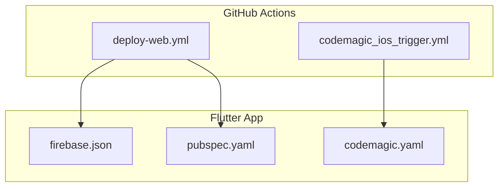
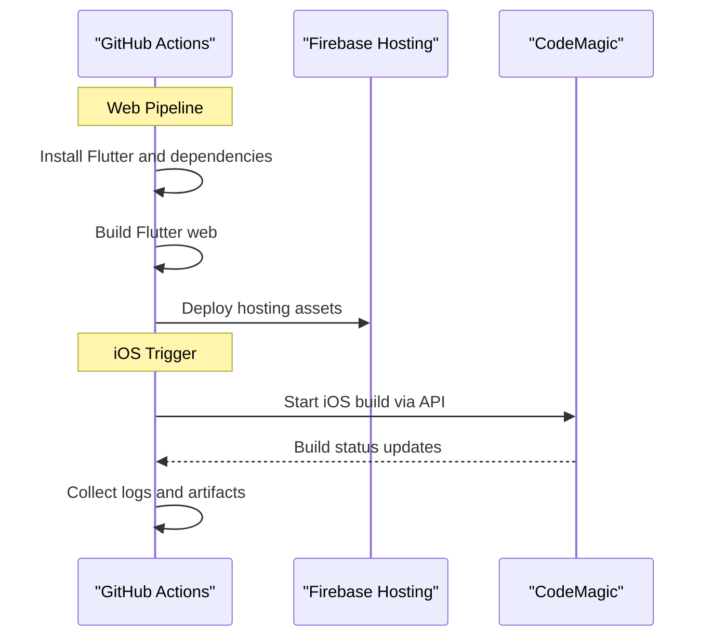
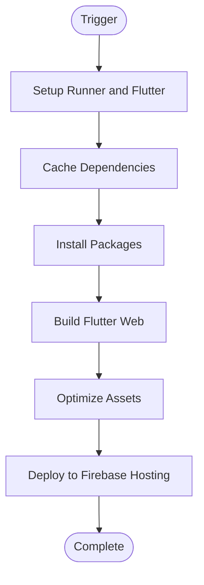
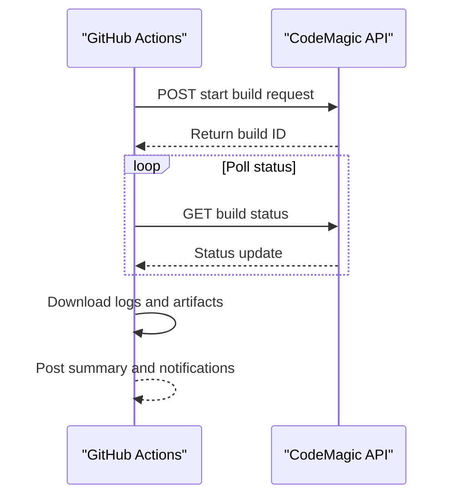
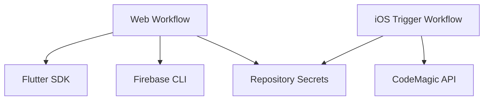

# GitHub Actions Workflows

<cite>
**Referenced Files in This Document**
- [deploy-web.yml](file://.github/workflows/deploy-web.yml)
- [codemagic_ios_trigger.yml](file://.github/workflows/codemagic_ios_trigger.yml)
- [firebase.json](file://flutter_app/firebase.json)
- [pubspec.yaml](file://flutter_app/pubspec.yaml)
- [codemagic.yaml](file://flutter_app/codemagic.yaml)
</cite>

## Table of Contents
1. [Introduction](#introduction)
2. [Project Structure](#project-structure)
3. [Core Components](#core-components)
4. [Architecture Overview](#architecture-overview)
5. [Detailed Component Analysis](#detailed-component-analysis)
6. [Dependency Analysis](#dependency-analysis)
7. [Performance Considerations](#performance-considerations)
8. [Troubleshooting Guide](#troubleshooting-guide)
9. [Conclusion](#conclusion)

## Introduction
This document explains the GitHub Actions workflows that automate deployment for this Flutter project. It covers:
- Web deployment workflow: building Flutter web, optimizing assets, and deploying to Firebase Hosting.
- iOS trigger workflow: coordinating with CodeMagic to build and distribute iOS artifacts.
It also provides guidance on triggers, job dependencies, matrix builds, conditional execution, environment setup, dependency installation, cross-platform build strategies, debugging, log analysis, and failure recovery.

## Project Structure
The automation is defined under .github/workflows and integrates with Firebase and CodeMagic configurations located at the Flutter app root.

**Diagram sources**
- [deploy-web.yml](file://.github/workflows/deploy-web.yml)
- [codemagic_ios_trigger.yml](file://.github/workflows/codemagic_ios_trigger.yml)
- [firebase.json](file://flutter_app/firebase.json)
- [pubspec.yaml](file://flutter_app/pubspec.yaml)
- [codemagic.yaml](file://flutter_app/codemagic.yaml)

**Section sources**
- [deploy-web.yml](file://.github/workflows/deploy-web.yml)
- [codemagic_ios_trigger.yml](file://.github/workflows/codemagic_ios_trigger.yml)
- [firebase.json](file://flutter_app/firebase.json)
- [pubspec.yaml](file://flutter_app/pubspec.yaml)
- [codemagic.yaml](file://flutter_app/codemagic.yaml)

## Core Components
- Web Deployment Workflow (deploy-web.yml): Builds Flutter web, optimizes assets, and deploys to Firebase Hosting.
- iOS Trigger Workflow (codemagic_ios_trigger.yml): Triggers a CodeMagic build via API, waits for completion, and posts results.

Key responsibilities:
- Environment setup: install Flutter, configure Firebase CLI, set up secrets.
- Dependency installation: fetch Dart packages and Firebase configuration.
- Build steps: compile web or orchestrate mobile builds.
- Artifact handling: cache dependencies, upload logs, and publish outputs.
- Conditional execution: run only on specific branches/tags or paths.

**Section sources**
- [deploy-web.yml](file://.github/workflows/deploy-web.yml)
- [codemagic_ios_trigger.yml](file://.github/workflows/codemagic_ios_trigger.yml)

## Architecture Overview
The system orchestrates two primary pipelines:
- Web pipeline: GitHub Actions runner executes Flutter web build and Firebase hosting deploy.
- iOS pipeline: GitHub Actions calls CodeMagic API to start an iOS build; results are reported back to GitHub.

**Diagram sources**
- [deploy-web.yml](file://.github/workflows/deploy-web.yml)
- [codemagic_ios_trigger.yml](file://.github/workflows/codemagic_ios_trigger.yml)
- [firebase.json](file://flutter_app/firebase.json)
- [codemagic.yaml](file://flutter_app/codemagic.yaml)

## Detailed Component Analysis

### Web Deployment Workflow
Purpose:
- Build Flutter web with optimized assets.
- Deploy static assets to Firebase Hosting.

Typical stages:
- Setup: select runner OS, install Flutter SDK, configure caching.
- Dependencies: install Dart packages using pubspec.yaml.
- Build: generate web build output directory.
- Optimize: minify assets, ensure correct base href, and prepare public folder.
- Deploy: authenticate Firebase CLI and deploy to hosting.

Triggers:
- Push to main or release branches.
- Pull requests targeting production branches.
- Manual dispatch for ad-hoc deployments.

Environment variables and secrets:
- Firebase credentials and project identifiers.
- Optional flags for skipping preflight checks or enabling debug logging.

Job dependencies:
- Sequential jobs for setup, build, and deploy.
- Optional parallel jobs for testing or linting before deployment.

Matrix builds:
- Can be used to test multiple Flutter channels or optimization flags.

Conditional execution:
- Skip deployment if no web-related files changed.
- Run only on tags for versioned releases.

**Diagram sources**
- [deploy-web.yml](file://.github/workflows/deploy-web.yml)
- [firebase.json](file://flutter_app/firebase.json)
- [pubspec.yaml](file://flutter_app/pubspec.yaml)

**Section sources**
- [deploy-web.yml](file://.github/workflows/deploy-web.yml)
- [firebase.json](file://flutter_app/firebase.json)
- [pubspec.yaml](file://flutter_app/pubspec.yaml)

### iOS Trigger Workflow
Purpose:
- Coordinate with CodeMagic to build iOS artifacts.
- Manage authentication, build triggers, and result reporting.

Typical stages:
- Setup: configure runner and secrets for CodeMagic API.
- Trigger: call CodeMagic API to start a build using codemagic.yaml.
- Wait: poll build status until completion or timeout.
- Report: post build logs and artifacts to GitHub Actions artifacts or comments.

Triggers:
- Push to iOS-specific branches or tags.
- Manual dispatch for on-demand builds.
- Path filters to limit runs to iOS-relevant changes.

Environment variables and secrets:
- CodeMagic API key and project identifiers.
- Apple signing credentials managed by CodeMagic.

Job dependencies:
- Single job chain for trigger, wait, and report.
- Optional retry logic for transient failures.

**Diagram sources**
- [codemagic_ios_trigger.yml](file://.github/workflows/codemagic_ios_trigger.yml)
- [codemagic.yaml](file://flutter_app/codemagic.yaml)

**Section sources**
- [codemagic_ios_trigger.yml](file://.github/workflows/codemagic_ios_trigger.yml)
- [codemagic.yaml](file://flutter_app/codemagic.yaml)

## Dependency Analysis
Inter-workflow and external dependencies:
- Web workflow depends on Flutter toolchain and Firebase CLI.
- iOS workflow depends on CodeMagic API availability and valid credentials.
- Both workflows rely on repository secrets for secure configuration.

**Diagram sources**
- [deploy-web.yml](file://.github/workflows/deploy-web.yml)
- [codemagic_ios_trigger.yml](file://.github/workflows/codemagic_ios_trigger.yml)

**Section sources**
- [deploy-web.yml](file://.github/workflows/deploy-web.yml)
- [codemagic_ios_trigger.yml](file://.github/workflows/codemagic_ios_trigger.yml)

## Performance Considerations
- Cache Flutter and package dependencies to reduce build times.
- Use incremental builds where possible.
- Minimize asset sizes and enable compression for web hosting.
- Parallelize independent tasks such as tests and linting.
- Limit artifact retention to essential logs and outputs.

[No sources needed since this section provides general guidance]

## Troubleshooting Guide
Common issues and resolutions:
- Flutter not found: ensure the runner has Flutter installed and PATH configured.
- Firebase auth errors: verify service account keys and project IDs in secrets.
- CodeMagic API failures: check API key validity, rate limits, and network connectivity.
- Build timeouts: increase job timeout and optimize dependency caching.
- Asset deployment failures: validate firebase.json hosting rules and permissions.

Debugging tips:
- Enable verbose logging in Flutter and Firebase CLI.
- Download workflow logs from GitHub Actions UI.
- Inspect CodeMagic build logs and error messages.
- Use conditional steps to isolate failing stages.

Failure recovery procedures:
- Re-run failed jobs with increased verbosity.
- Rollback hosting deployments if necessary.
- Retry CodeMagic builds with updated credentials or configurations.

**Section sources**
- [deploy-web.yml](file://.github/workflows/deploy-web.yml)
- [codemagic_ios_trigger.yml](file://.github/workflows/codemagic_ios_trigger.yml)

## Conclusion
The GitHub Actions workflows provide automated, reliable deployment for both web and iOS targets. The web pipeline focuses on efficient Flutter web builds and Firebase Hosting deployment, while the iOS pipeline coordinates with CodeMagic for robust mobile builds. Proper configuration of secrets, caching, and conditional execution ensures fast and resilient CI/CD operations.

[No sources needed since this section summarizes without analyzing specific files]