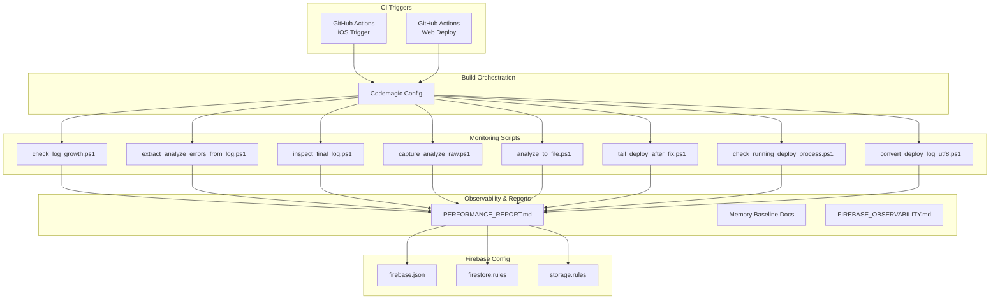
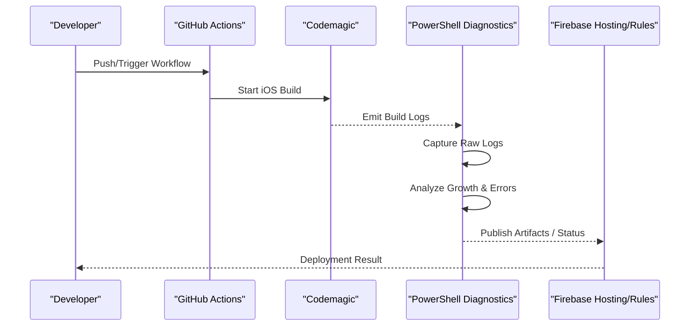
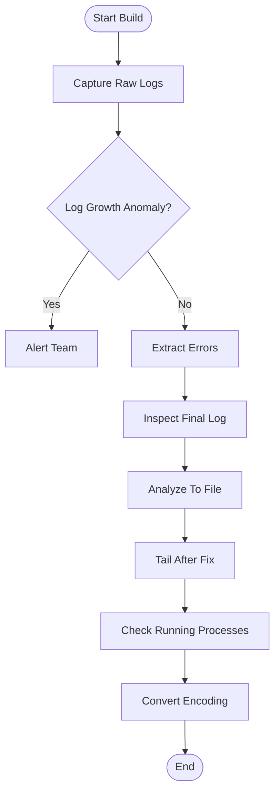
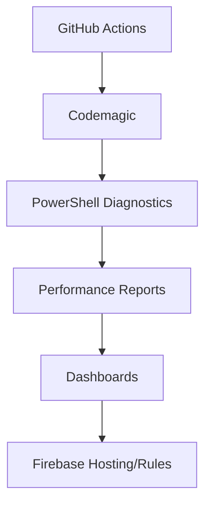

# Pipeline Monitoring & Debugging

<cite>
**Referenced Files in This Document**
- [codemagic_ios_trigger.yml](file://.github/workflows/codemagic_ios_trigger.yml)
- [deploy-web.yml](file://.github/workflows/deploy-web.yml)
- [codemagic.yaml](file://codemagic.yaml)
- [_check_log_growth.ps1](file://scripts/_check_log_growth.ps1)
- [_extract_analyze_errors_from_log.ps1](file://scripts/_extract_analyze_errors_from_log.ps1)
- [_inspect_final_log.ps1](file://scripts/_inspect_final_log.ps1)
- [_capture_analyze_raw.ps1](file://scripts/_capture_analyze_raw.ps1)
- [_analyze_to_file.ps1](file://scripts/_analyze_to_file.ps1)
- [_tail_deploy_after_fix.ps1](file://scripts/_tail_deploy_after_fix.ps1)
- [_check_running_deploy_process.ps1](file://scripts/_check_running_deploy_process.ps1)
- [_convert_deploy_log_utf8.ps1](file://scripts/_convert_deploy_log_utf8.ps1)
- [buildlog.txt](file://flutter_app/buildlog.txt)
- [PERFORMANCE_REPORT.md](file://PERFORMANCE_REPORT.md)
- [PONTO_BASE_MEMORIA_2026-07-24_11.2.305+2134.md](file://PONTO_BASE_MEMORIA_2026-07-24_11.2.305+2134.md)
- [FIREBASE_OBSERVABILITY.md](file://docs/FIREBASE_OBSERVABILITY.md)
- [ARCHITECTURE_PERFORMANCE_MULTI_PLATFORM.md](file://docs/ARCHITECTURE_PERFORMANCE_MULTI_PLATFORM.md)
- [PADRONIZACAO_PERFORMANCE_CONTROLE_TOTAL.md](file://docs/PADRONIZACAO_PERFORMANCE_CONTROLE_TOTAL.md)
- [firebase.json](file://firebase.json)
- [storage.rules](file://storage.rules)
- [firestore.rules](file://firestore.rules)
</cite>

## Table of Contents
1. [Introduction](#introduction)
2. [Project Structure](#project-structure)
3. [Core Components](#core-components)
4. [Architecture Overview](#architecture-overview)
5. [Detailed Component Analysis](#detailed-component-analysis)
6. [Dependency Analysis](#dependency-analysis)
7. [Performance Considerations](#performance-considerations)
8. [Troubleshooting Guide](#troubleshooting-guide)
9. [Conclusion](#conclusion)
10. [Appendices](#appendices)

## Introduction
This document provides a comprehensive guide to pipeline monitoring, logging, and debugging for the project’s CI/CD workflows and build systems. It explains how to interpret build logs, extract errors, identify bottlenecks, and set up alerts and dashboards. It also covers log rotation, storage management, historical analysis, performance profiling, memory usage analysis, and build optimization techniques.

## Project Structure
The monitoring and debugging capabilities are implemented across GitHub Actions workflows, Codemagic configuration, and PowerShell-based scripts that capture, analyze, and report on build logs and deployment status. Key areas include:
- CI/CD triggers and deployments (GitHub Actions)
- Build orchestration and environment setup (Codemagic)
- Log capture, error extraction, and inspection utilities (PowerShell)
- Performance reports and observability guidance (Markdown docs)
- Firebase configuration for rules and hosting

**Diagram sources**
- [codemagic_ios_trigger.yml](file://.github/workflows/codemagic_ios_trigger.yml)
- [deploy-web.yml](file://.github/workflows/deploy-web.yml)
- [codemagic.yaml](file://codemagic.yaml)
- [_check_log_growth.ps1](file://scripts/_check_log_growth.ps1)
- [_extract_analyze_errors_from_log.ps1](file://scripts/_extract_analyze_errors_from_log.ps1)
- [_inspect_final_log.ps1](file://scripts/_inspect_final_log.ps1)
- [_capture_analyze_raw.ps1](file://scripts/_capture_analyze_raw.ps1)
- [_analyze_to_file.ps1](file://scripts/_analyze_to_file.ps1)
- [_tail_deploy_after_deploy_after_fix.ps1](file://scripts/_tail_deploy_after_fix.ps1)
- [_check_running_deploy_process.ps1](file://scripts/_check_running_deploy_process.ps1)
- [_convert_deploy_log_utf8.ps1](file://scripts/_convert_deploy_log_utf8.ps1)
- [PERFORMANCE_REPORT.md](file://PERFORMANCE_REPORT.md)
- [firebase.json](file://firebase.json)
- [firestore.rules](file://firestore.rules)
- [storage.rules](file://storage.rules)

**Section sources**
- [codemagic_ios_trigger.yml](file://.github/workflows/codemagic_ios_trigger.yml)
- [deploy-web.yml](file://.github/workflows/deploy-web.yml)
- [codemagic.yaml](file://codemagic.yaml)

## Core Components
- CI Triggers: GitHub Actions workflows initiate iOS builds via Codemagic and deploy web artifacts.
- Build Orchestration: Codemagic config defines environments, steps, and artifact handling.
- Log Utilities: PowerShell scripts capture raw logs, detect growth anomalies, extract errors, inspect final logs, convert encodings, and monitor running processes.
- Observability Docs: Markdown files provide performance baselines, memory snapshots, and Firebase observability guidance.
- Firebase Configuration: Hosting and security rules define runtime behavior and access controls.

**Section sources**
- [codemagic_ios_trigger.yml](file://.github/workflows/codemagic_ios_trigger.yml)
- [deploy-web.yml](file://.github/workflows/deploy-web.yml)
- [codemagic.yaml](file://codemagic.yaml)
- [_check_log_growth.ps1](file://scripts/_check_log_growth.ps1)
- [_extract_analyze_errors_from_log.ps1](file://scripts/_extract_analyze_errors_from_log.ps1)
- [_inspect_final_log.ps1](file://scripts/_inspect_final_log.ps1)
- [_capture_analyze_raw.ps1](file://scripts/_capture_analyze_raw.ps1)
- [_analyze_to_file.ps1](file://scripts/_analyze_to_file.ps1)
- [_tail_deploy_after_fix.ps1](file://scripts/_tail_deploy_after_fix.ps1)
- [_check_running_deploy_process.ps1](file://scripts/_check_running_deploy_process.ps1)
- [_convert_deploy_log_utf8.ps1](file://scripts/_convert_deploy_log_utf8.ps1)
- [PERFORMANCE_REPORT.md](file://PERFORMANCE_REPORT.md)
- [FIREBASE_OBSERVABILITY.md](file://docs/FIREBASE_OBSERVABILITY.md)
- [firebase.json](file://firebase.json)
- [firestore.rules](file://firestore.rules)
- [storage.rules](file://storage.rules)

## Architecture Overview
The pipeline integrates GitHub Actions with Codemagic to trigger and manage builds, while PowerShell scripts provide continuous monitoring and diagnostics around logs and deployment processes. The flow ensures logs are captured early, analyzed for errors and growth patterns, and archived for historical analysis.

**Diagram sources**
- [codemagic_ios_trigger.yml](file://.github/workflows/codemagic_ios_trigger.yml)
- [deploy-web.yml](file://.github/workflows/deploy-web.yml)
- [codemagic.yaml](file://codemagic.yaml)
- [_capture_analyze_raw.ps1](file://scripts/_capture_analyze_raw.ps1)
- [_check_log_growth.ps1](file://scripts/_check_log_growth.ps1)
- [_extract_analyze_errors_from_log.ps1](file://scripts/_extract_analyze_errors_from_log.ps1)
- [_inspect_final_log.ps1](file://scripts/_inspect_final_log.ps1)
- [firebase.json](file://firebase.json)

## Detailed Component Analysis

### CI Triggers and Deployment Workflows
- iOS Trigger: Initiates Codemagic builds based on repository events.
- Web Deploy: Deploys web artifacts to Firebase Hosting.

Key responsibilities:
- Define triggers and environment variables
- Invoke platform-specific build steps
- Handle artifacts and notifications

**Section sources**
- [codemagic_ios_trigger.yml](file://.github/workflows/codemagic_ios_trigger.yml)
- [deploy-web.yml](file://.github/workflows/deploy-web.yml)

### Build Orchestration (Codemagic)
- Environment setup for iOS toolchains and signing
- Step definitions for building, testing, and packaging
- Artifact retention and distribution hooks

Best practices:
- Pin toolchain versions
- Cache dependencies
- Secure secrets via environment variables

**Section sources**
- [codemagic.yaml](file://codemagic.yaml)

### Log Capture and Analysis Utilities
- _capture_analyze_raw.ps1: Captures raw build logs during execution.
- _check_log_growth.ps1: Monitors log size growth to detect runaway processes or excessive verbosity.
- _extract_analyze_errors_from_log.ps1: Extracts error lines and categorizes them by type.
- _inspect_final_log.ps1: Summarizes final logs for quick review.
- _analyze_to_file.ps1: Writes structured analysis results to files for downstream consumption.
- _tail_deploy_after_fix.ps1: Tails logs after fixes to verify resolution.
- _check_running_deploy_process.ps1: Checks active deployment processes to avoid conflicts.
- _convert_deploy_log_utf8.ps1: Converts encoding issues in logs to UTF-8 for consistent parsing.

Operational flow:

**Diagram sources**
- [_capture_analyze_raw.ps1](file://scripts/_capture_analyze_raw.ps1)
- [_check_log_growth.ps1](file://scripts/_check_log_growth.ps1)
- [_extract_analyze_errors_from_log.ps1](file://scripts/_extract_analyze_errors_from_log.ps1)
- [_inspect_final_log.ps1](file://scripts/_inspect_final_log.ps1)
- [_analyze_to_file.ps1](file://scripts/_analyze_to_file.ps1)
- [_tail_deploy_after_fix.ps1](file://scripts/_tail_deploy_after_fix.ps1)
- [_check_running_deploy_process.ps1](file://scripts/_check_running_deploy_process.ps1)
- [_convert_deploy_log_utf8.ps1](file://scripts/_convert_deploy_log_utf8.ps1)

**Section sources**
- [_capture_analyze_raw.ps1](file://scripts/_capture_analyze_raw.ps1)
- [_check_log_growth.ps1](file://scripts/_check_log_growth.ps1)
- [_extract_analyze_errors_from_log.ps1](file://scripts/_extract_analyze_errors_from_log.ps1)
- [_inspect_final_log.ps1](file://scripts/_inspect_final_log.ps1)
- [_analyze_to_file.ps1](file://scripts/_analyze_to_file.ps1)
- [_tail_deploy_after_fix.ps1](file://scripts/_tail_deploy_after_fix.ps1)
- [_check_running_deploy_process.ps1](file://scripts/_check_running_deploy_process.ps1)
- [_convert_deploy_log_utf8.ps1](file://scripts/_convert_deploy_log_utf8.ps1)

### Observability and Performance Documentation
- PERFORMANCE_REPORT.md: Centralized performance metrics and trends.
- Memory baseline documents: Track memory usage across builds to detect regressions.
- FIREBASE_OBSERVABILITY.md: Guidance on Firebase analytics, crash reporting, and logging strategies.
- ARCHITECTURE_PERFORMANCE_MULTI_PLATFORM.md: Cross-platform performance considerations.
- PADRONIZACAO_PERFORMANCE_CONTROLE_TOTAL.md: Standardization guidelines for performance control.

Usage:
- Compare current build metrics against baselines
- Investigate memory spikes using provided snapshots
- Apply Firebase observability recommendations for production insights

**Section sources**
- [PERFORMANCE_REPORT.md](file://PERFORMANCE_REPORT.md)
- [PONTO_BASE_MEMORIA_2026-07-24_11.2.305+2134.md](file://PONTO_BASE_MEMORIA_2026-07-24_11.2.305+2134.md)
- [FIREBASE_OBSERVABILITY.md](file://docs/FIREBASE_OBSERVABILITY.md)
- [ARCHITECTURE_PERFORMANCE_MULTI_PLATFORM.md](file://docs/ARCHITECTURE_PERFORMANCE_MULTI_PLATFORM.md)
- [PADRONIZACAO_PERFORMANCE_CONTROLE_TOTAL.md](file://docs/PADRONIZACAO_PERFORMANCE_CONTROLE_TOTAL.md)

### Firebase Configuration for Hosting and Rules
- firebase.json: Hosting configuration and rewrites for Flutter web.
- firestore.rules: Security rules for Firestore data access.
- storage.rules: Security rules for media and assets storage.

Recommendations:
- Use least-privilege rules
- Enable caching headers for static assets
- Monitor rule evaluation costs and optimize paths

**Section sources**
- [firebase.json](file://firebase.json)
- [firestore.rules](file://firestore.rules)
- [storage.rules](file://storage.rules)

## Dependency Analysis
The monitoring stack depends on CI triggers invoking Codemagic, which emits logs consumed by PowerShell utilities. These utilities produce analysis outputs used by performance reports and dashboards. Firebase hosting and rules govern runtime behavior and access.

**Diagram sources**
- [codemagic_ios_trigger.yml](file://.github/workflows/codemagic_ios_trigger.yml)
- [deploy-web.yml](file://.github/workflows/deploy-web.yml)
- [codemagic.yaml](file://codemagic.yaml)
- [_check_log_growth.ps1](file://scripts/_check_log_growth.ps1)
- [_extract_analyze_errors_from_log.ps1](file://scripts/_extract_analyze_errors_from_log.ps1)
- [_inspect_final_log.ps1](file://scripts/_inspect_final_log.ps1)
- [PERFORMANCE_REPORT.md](file://PERFORMANCE_REPORT.md)
- [firebase.json](file://firebase.json)

**Section sources**
- [codemagic_ios_trigger.yml](file://.github/workflows/codemagic_ios_trigger.yml)
- [deploy-web.yml](file://.github/workflows/deploy-web.yml)
- [codemagic.yaml](file://codemagic.yaml)
- [_check_log_growth.ps1](file://scripts/_check_log_growth.ps1)
- [_extract_analyze_errors_from_log.ps1](file://scripts/_extract_analyze_errors_from_log.ps1)
- [_inspect_final_log.ps1](file://scripts/_inspect_final_log.ps1)
- [PERFORMANCE_REPORT.md](file://PERFORMANCE_REPORT.md)
- [firebase.json](file://firebase.json)

## Performance Considerations
- Log volume control: Avoid excessive debug logging in production; use structured logs with severity levels.
- Error extraction efficiency: Pre-filter noisy logs before analysis to reduce processing time.
- Memory baselines: Compare current builds against documented baselines to catch regressions early.
- Firebase rule optimization: Minimize read/write operations and use efficient query patterns.
- Caching strategy: Leverage CDN and browser caching for static assets to reduce load times.

[No sources needed since this section provides general guidance]

## Troubleshooting Guide
Common issues and resolutions:
- Runaway log growth: Use log growth checks to alert and throttle verbose logging.
- Encoding problems: Convert logs to UTF-8 to ensure consistent parsing.
- Process conflicts: Verify no duplicate deployment processes are running.
- Error identification: Extract and categorize errors to prioritize fixes.
- Post-fix verification: Tail logs after applying fixes to confirm resolution.

Operational tips:
- Archive logs per build with timestamps for historical analysis.
- Implement alert thresholds for error rates and log sizes.
- Maintain a runbook linking symptoms to diagnostic scripts.

**Section sources**
- [_check_log_growth.ps1](file://scripts/_check_log_growth.ps1)
- [_convert_deploy_log_utf8.ps1](file://scripts/_convert_deploy_log_utf8.ps1)
- [_check_running_deploy_process.ps1](file://scripts/_check_running_deploy_process.ps1)
- [_extract_analyze_errors_from_log.ps1](file://scripts/_extract_analyze_errors_from_log.ps1)
- [_tail_deploy_after_fix.ps1](file://scripts/_tail_deploy_after_fix.ps1)

## Conclusion
The pipeline monitoring and debugging toolkit combines CI triggers, build orchestration, and robust log utilities to deliver actionable insights. By following the recommended practices for log management, error extraction, performance profiling, and Firebase configuration, teams can maintain high reliability and performance across platforms.

[No sources needed since this section summarizes without analyzing specific files]

## Appendices

### Interpreting Build Logs
- Identify failure points by scanning error categories extracted by utilities.
- Correlate log timestamps with build stages to locate bottlenecks.
- Use final log summaries to quickly assess overall health.

**Section sources**
- [_extract_analyze_errors_from_log.ps1](file://scripts/_extract_analyze_errors_from_log.ps1)
- [_inspect_final_log.ps1](file://scripts/_inspect_final_log.ps1)

### Setting Up Alerts and Dashboards
- Configure alert thresholds for log growth and error rates.
- Aggregate analysis outputs into dashboards for real-time visibility.
- Integrate with notification channels (email, Slack) for immediate awareness.

[No sources needed since this section provides general guidance]

### Log Rotation and Storage Management
- Rotate logs daily or per build to prevent unbounded growth.
- Compress and archive older logs for long-term retention.
- Store logs in secure, versioned buckets with access controls.

[No sources needed since this section provides general guidance]

### Historical Build Analysis
- Compare current metrics against baselines in performance reports.
- Track memory usage trends across versions to detect regressions.
- Use structured analysis files to automate trend detection.

**Section sources**
- [PERFORMANCE_REPORT.md](file://PERFORMANCE_REPORT.md)
- [PONTO_BASE_MEMORIA_2026-07-24_11.2.305+2134.md](file://PONTO_BASE_MEMORIA_2026-07-24_11.2.305+2134.md)

### Performance Profiling and Optimization
- Profile CPU and memory usage during critical build phases.
- Optimize Firebase queries and storage access patterns.
- Apply caching strategies and asset optimization techniques.

**Section sources**
- [ARCHITECTURE_PERFORMANCE_MULTI_PLATFORM.md](file://docs/ARCHITECTURE_PERFORMANCE_MULTI_PLATFORM.md)
- [PADRONIZACAO_PERFORMANCE_CONTROLE_TOTAL.md](file://docs/PADRONIZACAO_PERFORMANCE_CONTROLE_TOTAL.md)