# Deployment & DevOps

<cite>
**Referenced Files in This Document**
- [deploy-web.yml](file://.github/workflows/deploy-web.yml)
- [codemagic_ios_trigger.yml](file://.github/workflows/codemagic_ios_trigger.yml)
- [codemagic.yaml](file://codemagic.yaml)
- [firebase.json](file://firebase.json)
- [pubspec.yaml](file://flutter_app/pubspec.yaml)
- [build_android_aab.ps1](file://scripts/build_android_aab.ps1)
- [build_ios_ipa_macos.sh](file://scripts/build_ios_ipa_macos.sh)
- [deploy_full_gestao_yahweh.ps1](file://scripts/deploy_full_gestao_yahweh.ps1)
- [release_completo_web_aab.ps1](file://scripts/release_completo_web_aab.ps1)
- [setup_dev_machine_windows.ps1](file://scripts/setup_dev_machine_windows.ps1)
- [ensure_google_cloud_auth.ps1](file://scripts/ensure_google_cloud_auth.ps1)
- [apply_storage_cors.ps1](file://scripts/apply_storage_cors.ps1)
- [firestore.rules](file://firestore.rules)
- [storage.rules](file://storage.rules)
- [.firebaserc](file://.firebaserc)
</cite>

## Table of Contents
1. [Introduction](#introduction)
2. [Project Structure Overview](#project-structure-overview)
3. [CI/CD Pipeline Architecture](#cicd-pipeline-architecture)
4. [Build Automation](#build-automation)
5. [Release Management](#release-management)
6. [Environment Provisioning](#environment-provisioning)
7. [Deployment Strategies](#deployment-strategies)
8. [Containerization & Infrastructure](#containerization--infrastructure)
9. [Monitoring & Observability](#monitoring--observability)
10. [Security & Compliance](#security--compliance)
11. [Troubleshooting Guide](#troubleshooting-guide)
12. [Best Practices](#best-practices)

## Introduction

The Gestão Yahweh Premium application is a comprehensive multi-platform Flutter application with Firebase backend services, designed for church management and administration. This DevOps documentation covers the complete deployment pipeline, build automation, release management, and infrastructure provisioning strategies used across web, Android, iOS, and desktop platforms.

The application follows modern DevOps practices with automated testing, code quality checks, security scanning, and continuous deployment pipelines. It supports multiple deployment targets including Firebase Hosting, Google Play Store, Apple App Store, and direct web deployment.

## Project Structure Overview

The project follows a modular architecture with clear separation between frontend (Flutter), backend (Firebase Functions), and deployment configurations:

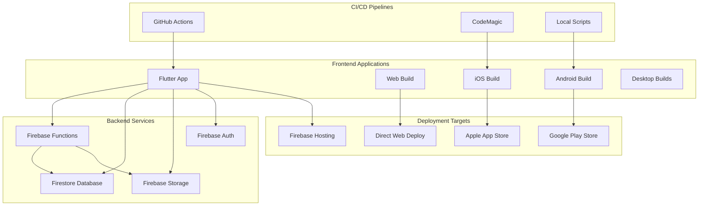

**Diagram sources**
- [firebase.json:1-50](file://firebase.json#L1-L50)
- [pubspec.yaml:1-100](file://flutter_app/pubspec.yaml#L1-L100)

**Section sources**
- [firebase.json:1-50](file://firebase.json#L1-L50)
- [pubspec.yaml:1-100](file://flutter_app/pubspec.yaml#L1-L100)

## CI/CD Pipeline Architecture

The application utilizes a multi-stage CI/CD pipeline with GitHub Actions for web deployment and CodeMagic for mobile builds:

### GitHub Actions Workflows

#### Web Deployment Pipeline
The web deployment pipeline automates building and deploying the Flutter web application to Firebase Hosting:

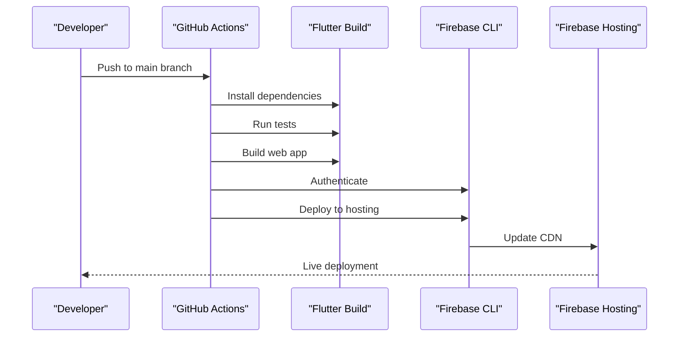

**Diagram sources**
- [deploy-web.yml:1-100](file://.github/workflows/deploy-web.yml#L1-L100)

#### iOS Build Pipeline
iOS builds are managed through CodeMagic integration triggered by GitHub Actions:

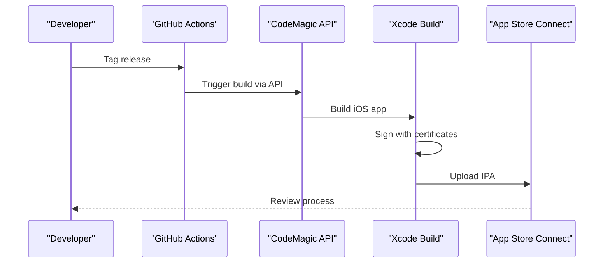

**Diagram sources**
- [codemagic_ios_trigger.yml:1-100](file://.github/workflows/codemagic_ios_trigger.yml#L1-L100)

**Section sources**
- [deploy-web.yml:1-100](file://.github/workflows/deploy-web.yml#L1-L100)
- [codemagic_ios_trigger.yml:1-100](file://.github/workflows/codemagic_ios_trigger.yml#L1-L100)

## Build Automation

### Flutter Build Configuration

The Flutter application uses a comprehensive build system supporting multiple platforms and environments:

#### Multi-Platform Build Matrix
- **Web**: Optimized for Firebase Hosting with caching and asset optimization
- **Android**: AAB format for Google Play Store with ProGuard obfuscation
- **iOS**: IPA format for App Store with code signing and bitcode support
- **Desktop**: Native builds for Windows, macOS, and Linux

#### Build Optimization Features
- Incremental builds with cached dependencies
- Parallel test execution
- Asset precompilation
- Environment-specific configuration
- Version bumping automation

### Android Build Pipeline

The Android build process includes comprehensive validation and signing:

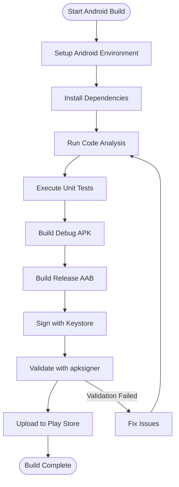

**Diagram sources**
- [build_android_aab.ps1:1-200](file://scripts/build_android_aab.ps1#L1-L200)

**Section sources**
- [build_android_aab.ps1:1-200](file://scripts/build_android_aab.ps1#L1-L200)

### iOS Build Pipeline

The iOS build process handles complex signing and distribution requirements:

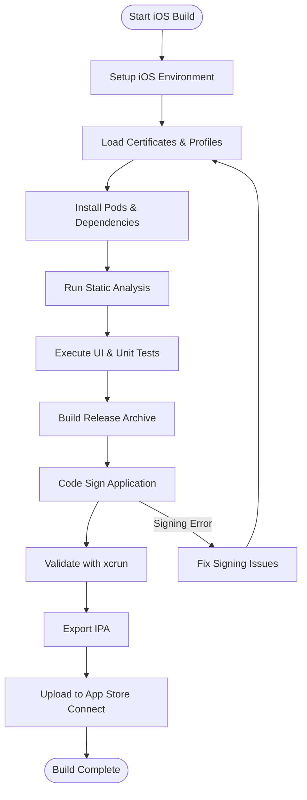

**Diagram sources**
- [build_ios_ipa_macos.sh:1-150](file://scripts/build_ios_ipa_macos.sh#L1-L150)

**Section sources**
- [build_ios_ipa_macos.sh:1-150](file://scripts/build_ios_ipa_macos.sh#L1-L150)

## Release Management

### Version Control Strategy

The application follows semantic versioning with automated version bumping:

- **Major versions**: Breaking changes and major feature releases
- **Minor versions**: New features with backward compatibility
- **Patch versions**: Bug fixes and minor improvements

### Release Workflow

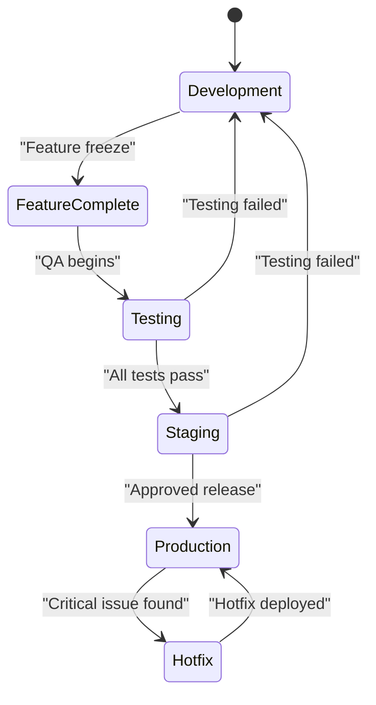

**Diagram sources**
- [release_completo_web_aab.ps1:1-300](file://scripts/release_completo_web_aab.ps1#L1-L300)

### Automated Release Artifacts

The release process generates multiple artifacts:
- Web build optimized for production
- Android AAB files for Google Play Store
- iOS IPA files for App Store distribution
- Release notes and changelog generation
- Security audit reports

**Section sources**
- [release_completo_web_aab.ps1:1-300](file://scripts/release_completo_web_aab.ps1#L1-L300)

## Environment Provisioning

### Development Environment Setup

The development environment setup script provides a comprehensive bootstrap for new developers:

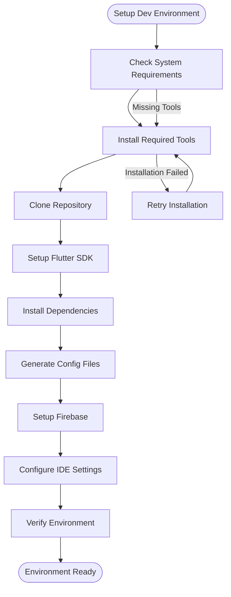

**Diagram sources**
- [setup_dev_machine_windows.ps1:1-200](file://scripts/setup_dev_machine_windows.ps1#L1-L200)

### Cloud Infrastructure Provisioning

Google Cloud Platform resources are provisioned using Firebase CLI and custom scripts:

#### Authentication Setup
Automated authentication setup for Google Cloud services ensures proper permissions and service accounts.

#### Storage Configuration
CORS policies and storage rules are automatically applied to ensure secure data access.

**Section sources**
- [setup_dev_machine_windows.ps1:1-200](file://scripts/setup_dev_machine_windows.ps1#L1-L200)
- [ensure_google_cloud_auth.ps1:1-100](file://scripts/ensure_google_cloud_auth.ps1#L1-L100)
- [apply_storage_cors.ps1:1-100](file://scripts/apply_storage_cors.ps1#L1-L100)

## Deployment Strategies

### Multi-Environment Deployment

The application supports multiple deployment environments with distinct configurations:

| Environment | Purpose | URL Pattern | Access Level |
|-------------|---------|-------------|--------------|
| Development | Local development and testing | localhost:port | Developer only |
| Staging | Pre-production testing | staging-app.yahweh.com | QA team |
| Production | Live application | app.yahweh.com | All users |

### Deployment Rollback Procedures

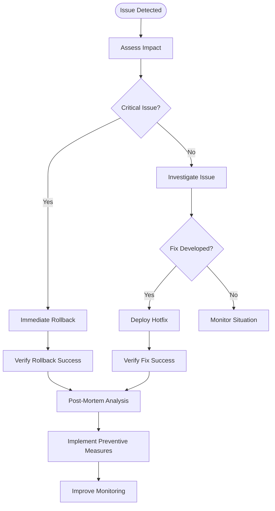

**Diagram sources**
- [deploy_full_gestao_yahweh.ps1:1-400](file://scripts/deploy_full_gestao_yahweh.ps1#L1-L400)

### Blue-Green Deployment Strategy

For zero-downtime deployments, the application implements blue-green deployment patterns:

- **Blue environment**: Current production version
- **Green environment**: New version being deployed
- **Traffic switching**: Instant switch between environments
- **Quick rollback**: Immediate switch back if issues occur

**Section sources**
- [deploy_full_gestao_yahweh.ps1:1-400](file://scripts/deploy_full_gestao_yahweh.ps1#L1-L400)

## Containerization & Infrastructure

### Docker Containerization

While the primary deployment targets are cloud platforms, containerization support is available for local development and testing:

#### Container Architecture
- **Base images**: Optimized Flutter SDK containers
- **Multi-stage builds**: Separate build and runtime stages
- **Resource optimization**: Minimal image sizes
- **Security scanning**: Vulnerability detection in containers

### Firebase Infrastructure

The application leverages Firebase's serverless architecture:

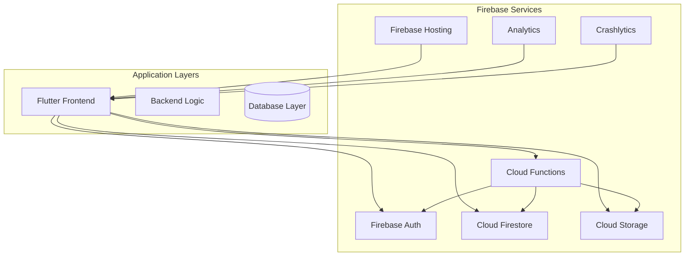

**Diagram sources**
- [firebase.json:1-100](file://firebase.json#L1-L100)

### Scaling Considerations

#### Horizontal Scaling
- **Firebase Functions**: Automatic scaling based on demand
- **Cloud Firestore**: Sharded database with automatic partitioning
- **Cloud Storage**: Distributed object storage with CDN caching
- **Firebase Hosting**: Global CDN with edge caching

#### Vertical Scaling
- **Database tuning**: Index optimization and query performance
- **Function timeouts**: Adjusted based on processing requirements
- **Memory allocation**: Optimized for different workload types

**Section sources**
- [firebase.json:1-100](file://firebase.json#L1-L100)

## Monitoring & Observability

### Application Performance Monitoring

The application implements comprehensive monitoring across all layers:

#### Frontend Monitoring
- **Performance metrics**: Load times, interaction latency
- **User experience**: Core Web Vitals tracking
- **Error tracking**: Client-side error collection
- **Usage analytics**: Feature adoption and user behavior

#### Backend Monitoring
- **Function execution**: Duration, memory usage, error rates
- **Database queries**: Slow query detection and optimization
- **Storage operations**: Upload/download performance
- **Authentication flows**: Login success rates and failure analysis

### Logging Strategy

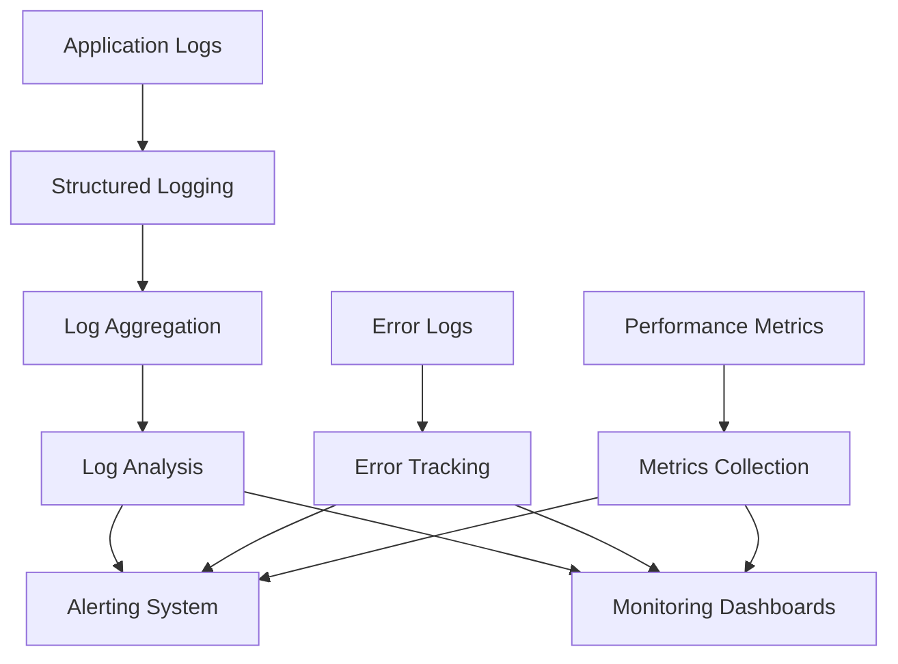

**Diagram sources**
- [FIREBASE_OBSERVABILITY.md:1-200](file://docs/FIREBASE_OBSERVABILITY.md#L1-L200)

### Alerting and Incident Response

- **Real-time alerts**: Critical errors and performance degradation
- **Escalation policies**: Automated notification chains
- **Incident response**: Standard operating procedures
- **Post-incident analysis**: Root cause identification and prevention

**Section sources**
- [FIREBASE_OBSERVABILITY.md:1-200](file://docs/FIREBASE_OBSERVABILITY.md#L1-L200)

## Security & Compliance

### Security Scanning Integration

The CI/CD pipeline includes comprehensive security scanning:

#### Code Security Scanning
- **Static analysis**: SAST tools for vulnerability detection
- **Dependency scanning**: Known vulnerability databases
- **Secret detection**: Hardcoded credentials and tokens
- **Policy enforcement**: Security best practices validation

#### Infrastructure Security
- **Container scanning**: Image vulnerability assessment
- **Configuration auditing**: Misconfiguration detection
- **Access control**: Permission validation
- **Network security**: Firewall and routing policies

### Data Protection

#### Encryption at Rest
- **Database encryption**: Automatic encryption for Firestore
- **Storage encryption**: Server-side encryption for Cloud Storage
- **Backup encryption**: Encrypted backups and snapshots

#### Encryption in Transit
- **TLS enforcement**: HTTPS-only connections
- **Certificate management**: Automated certificate renewal
- **Protocol security**: Modern TLS versions and cipher suites

### Compliance Frameworks

The application adheres to various compliance standards:

- **GDPR**: Data protection and privacy regulations
- **SOC 2**: Security and availability controls
- **ISO 27001**: Information security management
- **HIPAA**: Healthcare data protection (if applicable)

**Section sources**
- [firestore.rules:1-200](file://firestore.rules#L1-L200)
- [storage.rules:1-200](file://storage.rules#L1-L200)

## Troubleshooting Guide

### Common Deployment Issues

#### Build Failures
- **Dependency conflicts**: Clear cache and reinstall dependencies
- **Signing issues**: Verify certificates and provisioning profiles
- **Environment variables**: Ensure all required secrets are configured
- **Resource limits**: Check platform-specific resource constraints

#### Runtime Errors
- **Permission denied**: Verify Firebase security rules and IAM roles
- **Timeout errors**: Optimize function execution time and database queries
- **Memory issues**: Profile and optimize memory usage
- **Network errors**: Implement retry logic and circuit breakers

### Debugging Strategies

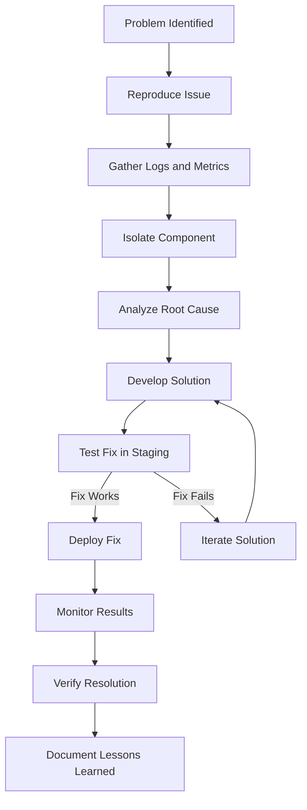

**Diagram sources**
- [verify_production_checklist.ps1:1-150](file://scripts/verify_production_checklist.ps1#L1-L150)

### Performance Optimization

#### Frontend Performance
- **Bundle size optimization**: Tree shaking and code splitting
- **Asset optimization**: Image compression and lazy loading
- **Caching strategies**: Service worker and browser caching
- **Memory management**: Proper cleanup and garbage collection

#### Backend Performance
- **Database indexing**: Query optimization and index maintenance
- **Function optimization**: Cold start reduction and execution time
- **Cache implementation**: Redis or in-memory caching
- **Connection pooling**: Efficient database and API connections

**Section sources**
- [verify_production_checklist.ps1:1-150](file://scripts/verify_production_checklist.ps1#L1-L150)

## Best Practices

### Development Workflow

#### Code Quality Standards
- **Linting rules**: Consistent code style and formatting
- **Type safety**: Comprehensive TypeScript/Flutter type definitions
- **Documentation**: Inline comments and API documentation
- **Testing coverage**: Minimum 80% test coverage requirement

#### Git Workflow
- **Branch strategy**: Feature branches with pull requests
- **Commit messages**: Conventional commit format
- **Code review**: Mandatory peer review before merging
- **Version tagging**: Semantic versioning with automated changelogs

### Deployment Best Practices

#### Environment Management
- **Configuration management**: Environment-specific settings
- **Secret management**: Secure storage of sensitive data
- **Infrastructure as code**: Version-controlled infrastructure
- **Backup strategies**: Regular automated backups

#### Monitoring and Maintenance
- **Health checks**: Automated health monitoring
- **Log aggregation**: Centralized logging and analysis
- **Performance monitoring**: Continuous performance tracking
- **Capacity planning**: Proactive scaling and resource management

### Security Best Practices

#### Secret Management
- **Environment variables**: Never hardcode secrets
- **Key rotation**: Regular rotation of cryptographic keys
- **Access control**: Principle of least privilege
- **Audit trails**: Comprehensive access logging

#### Vulnerability Management
- **Regular updates**: Keep dependencies up to date
- **Security patches**: Prompt application of security fixes
- **Penetration testing**: Regular security assessments
- **Incident response**: Prepared response procedures

This comprehensive DevOps documentation provides a complete guide for deploying, maintaining, and scaling the Gestão Yahweh Premium application across multiple platforms and environments. The documented processes ensure reliable, secure, and efficient delivery of application updates while maintaining high availability and performance standards.