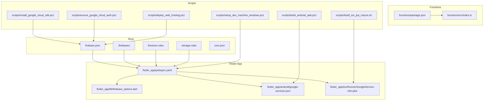
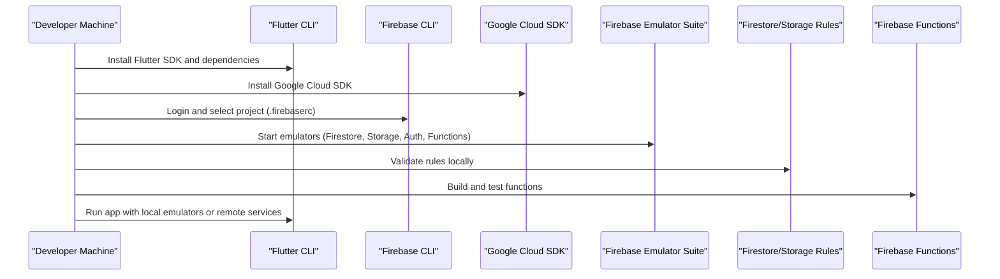
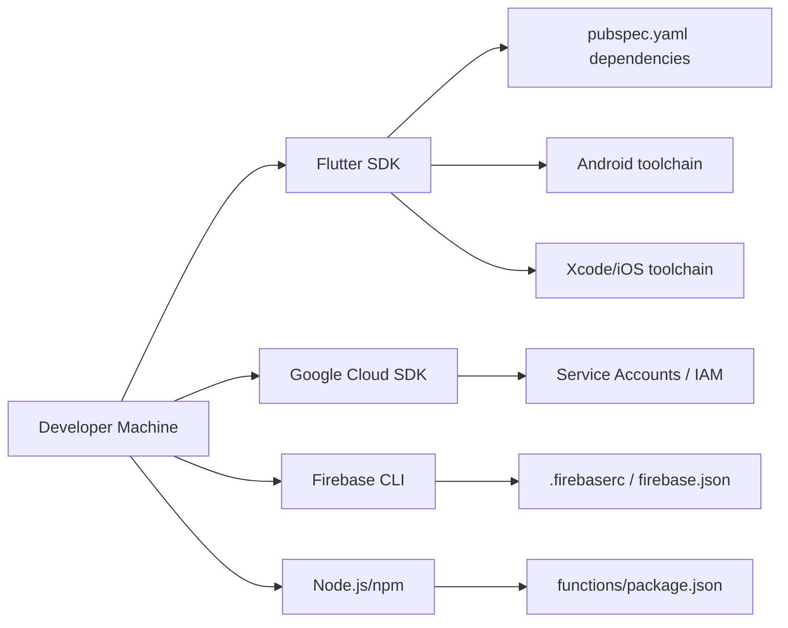

# Environment Setup & Configuration

<cite>
**Referenced Files in This Document**
- [README.md](file://README.md)
- [pubspec.yaml](file://flutter_app/pubspec.yaml)
- [firebase.json](file://firebase.json)
- [.firebaserc](file://.firebaserc)
- [android/google-services.json](file://flutter_app/android/google-services.json)
- [ios/Runner/GoogleService-Info.plist](file://flutter_app/ios/Runner/GoogleService-Info.plist)
- [functions/package.json](file://functions/package.json)
- [scripts/setup_dev_machine_windows.ps1](file://scripts/setup_dev_machine_windows.ps1)
- [scripts/install_google_cloud_sdk.ps1](file://scripts/install_google_cloud_sdk.ps1)
- [scripts/ensure_google_cloud_auth.ps1](file://scripts/ensure_google_cloud_auth.ps1)
- [scripts/ensure_jdk21_toolchain.ps1](file://scripts/ensure_jdk21_toolchain.ps1)
- [scripts/deploy_web_hosting.ps1](file://scripts/deploy_web_hosting.ps1)
- [scripts/build_android_aab.ps1](file://scripts/build_android_aab.ps1)
- [scripts/build_ios_ipa_macos.sh](file://scripts/build_ios_ipa_macos.sh)
- [scripts/firebase_rules_gcp_publish.cjs](file://scripts/firebase_rules_gcp_publish.cjs)
- [scripts/apply_storage_cors.ps1](file://scripts/apply_storage_cors.ps1)
- [storage.rules](file://storage.rules)
- [firestore.rules](file://firestore.rules)
- [cors.json](file://cors.json)
- [storage_cors.json](file://flutter_app/storage_cors.json)
- [functions/src/index.ts](file://functions/src/index.ts)
- [flutter_app/lib/firebase_options.dart](file://flutter_app/lib/firebase_options.dart)
</cite>

## Table of Contents
1. [Introduction](#introduction)
2. [Project Structure](#project-structure)
3. [Core Components](#core-components)
4. [Architecture Overview](#architecture-overview)
5. [Detailed Component Analysis](#detailed-component-analysis)
6. [Dependency Analysis](#dependency-analysis)
7. [Performance Considerations](#performance-considerations)
8. [Troubleshooting Guide](#troubleshooting-guide)
9. [Conclusion](#conclusion)
10. [Appendices](#appendices)

## Introduction
This document provides a complete environment setup guide for developers working on the Gestão Yahweh Premium project. It covers prerequisites, Flutter SDK installation, Firebase configuration, development toolchain setup, environment variables, service account configuration, and local development server setup. It also explains how to configure multiple environments (development, staging, production), manage credentials securely, and addresses common setup issues and platform-specific considerations.

## Project Structure
The repository is a multi-platform Flutter application with:
- A Flutter app under flutter_app/
- Firebase Functions source under functions/
- Platform-specific configurations for Android and iOS
- Deployment and setup scripts under scripts/
- Firebase configuration files at the root and within platform folders

**Diagram sources**
- [firebase.json](file://firebase.json)
- [.firebaserc](file://.firebaserc)
- [firestore.rules](file://firestore.rules)
- [storage.rules](file://storage.rules)
- [pubspec.yaml](file://flutter_app/pubspec.yaml)
- [firebase_options.dart](file://flutter_app/lib/firebase_options.dart)
- [google-services.json](file://flutter_app/android/google-services.json)
- [GoogleService-Info.plist](file://flutter_app/ios/Runner/GoogleService-Info.plist)
- [package.json](file://functions/package.json)
- [index.ts](file://functions/src/index.ts)
- [setup_dev_machine_windows.ps1](file://scripts/setup_dev_machine_windows.ps1)
- [install_google_cloud_sdk.ps1](file://scripts/install_google_cloud_sdk.ps1)
- [ensure_google_cloud_auth.ps1](file://scripts/ensure_google_cloud_auth.ps1)
- [deploy_web_hosting.ps1](file://scripts/deploy_web_hosting.ps1)
- [build_android_aab.ps1](file://scripts/build_android_aab.ps1)
- [build_ios_ipa_macos.sh](file://scripts/build_ios_ipa_macos.sh)

**Section sources**
- [README.md](file://README.md)
- [pubspec.yaml](file://flutter_app/pubspec.yaml)
- [firebase.json](file://firebase.json)
- [.firebaserc](file://.firebaserc)

## Core Components
- Flutter SDK and toolchain: Required to build and run the app across platforms.
- Firebase CLI and Google Cloud SDK: Used to initialize, emulate, and deploy Firebase services.
- Firebase project configuration: google-services.json (Android), GoogleService-Info.plist (iOS), .firebaserc, firebase.json.
- Firebase Functions: Node.js-based backend code under functions/.
- Security rules: Firestore and Storage rules define access policies.
- CORS configuration: JSON files for storage CORS settings.

Key responsibilities:
- Initialize and link the Flutter app to a Firebase project.
- Configure platform-specific Firebase options.
- Set up Functions dependencies and entry points.
- Manage security rules and CORS policies.

**Section sources**
- [pubspec.yaml](file://flutter_app/pubspec.yaml)
- [firebase.json](file://firebase.json)
- [.firebaserc](file://.firebaserc)
- [google-services.json](file://flutter_app/android/google-services.json)
- [GoogleService-Info.plist](file://flutter_app/ios/Runner/GoogleService-Info.plist)
- [package.json](file://functions/package.json)
- [index.ts](file://functions/src/index.ts)
- [firestore.rules](file://firestore.rules)
- [storage.rules](file://storage.rules)
- [cors.json](file://cors.json)
- [storage_cors.json](file://flutter_app/storage_cors.json)

## Architecture Overview
The development environment integrates Flutter, Firebase, and Google Cloud tools to support multi-platform builds and cloud services.

**Diagram sources**
- [setup_dev_machine_windows.ps1](file://scripts/setup_dev_machine_windows.ps1)
- [install_google_cloud_sdk.ps1](file://scripts/install_google_cloud_sdk.ps1)
- [ensure_google_cloud_auth.ps1](file://scripts/ensure_google_cloud_auth.ps1)
- [firebase.json](file://firebase.json)
- [.firebaserc](file://.firebaserc)

## Detailed Component Analysis

### Prerequisites and Toolchain Setup
- Install Flutter SDK and ensure it is available in PATH.
- Install Google Cloud SDK and authenticate your account.
- Install Firebase CLI and link the project using .firebaserc.
- For Android: set up JDK 21 via provided script and configure signing properties.
- For iOS: ensure Xcode toolchain and provisioning profiles are configured.

Recommended steps:
- Use the Windows setup script to bootstrap essential tools.
- Use the Google Cloud SDK installer and authentication helper.
- Ensure JDK 21 is installed and accessible for Android builds.

**Section sources**
- [setup_dev_machine_windows.ps1](file://scripts/setup_dev_machine_windows.ps1)
- [install_google_cloud_sdk.ps1](file://scripts/install_google_cloud_sdk.ps1)
- [ensure_google_cloud_auth.ps1](file://scripts/ensure_google_cloud_auth.ps1)
- [ensure_jdk21_toolchain.ps1](file://scripts/ensure_jdk21_toolchain.ps1)

### Flutter SDK and Dependencies
- The Flutter app declares dependencies and platform targets in pubspec.yaml.
- Ensure you run dependency resolution after cloning the repo.
- Verify that platform-specific plugins are correctly configured for Android and iOS.

**Section sources**
- [pubspec.yaml](file://flutter_app/pubspec.yaml)

### Firebase Project Configuration
- Link the Flutter app to a Firebase project using .firebaserc and firebase.json.
- Place google-services.json in android/app/ for Android.
- Place GoogleService-Info.plist in ios/Runner/ for iOS.
- The app loads Firebase options from firebase_options.dart.

Best practices:
- Keep platform config files out of shared branches; use environment-specific copies when necessary.
- Validate Firebase initialization by running the app against emulators first.

**Section sources**
- [firebase.json](file://firebase.json)
- [.firebaserc](file://.firebaserc)
- [google-services.json](file://flutter_app/android/google-services.json)
- [GoogleService-Info.plist](file://flutter_app/ios/Runner/GoogleService-Info.plist)
- [firebase_options.dart](file://flutter_app/lib/firebase_options.dart)

### Firebase Functions Setup
- Functions source resides under functions/, with package.json defining dependencies and index.ts as the entry point.
- Install Node.js and npm/yarn, then install dependencies inside functions/.
- Test functions locally using the Firebase Emulator Suite.

Operational notes:
- Ensure the Functions runtime matches the project’s requirements.
- Validate callable functions and HTTP endpoints during local development.

**Section sources**
- [package.json](file://functions/package.json)
- [index.ts](file://functions/src/index.ts)

### Security Rules and CORS
- Firestore rules are defined in firestore.rules.
- Storage rules are defined in storage.rules.
- CORS configuration for storage can be applied via cors.json or storage_cors.json.

Development workflow:
- Use the Firebase Emulator Suite to test rules locally.
- Apply CORS changes through the provided script before testing uploads/downloads.

**Section sources**
- [firestore.rules](file://firestore.rules)
- [storage.rules](file://storage.rules)
- [cors.json](file://cors.json)
- [storage_cors.json](file://flutter_app/storage_cors.json)
- [apply_storage_cors.ps1](file://scripts/apply_storage_cors.ps1)

### Local Development Server and Emulation
- Start Firebase emulators for Firestore, Storage, Authentication, and Functions.
- Point the Flutter app to emulator endpoints during development.
- Validate interactions between UI, functions, and storage using local emulation.

**Section sources**
- [firebase.json](file://firebase.json)
- [.firebaserc](file://.firebaserc)

### Building and Running per Platform
- Web: Use the web deployment script to build and host locally or deploy to Firebase Hosting.
- Android: Build an AAB using the provided script; ensure signing keys are configured.
- iOS: Build an IPA using the macOS script; ensure signing and provisioning are set.

**Section sources**
- [deploy_web_hosting.ps1](file://scripts/deploy_web_hosting.ps1)
- [build_android_aab.ps1](file://scripts/build_android_aab.ps1)
- [build_ios_ipa_macos.sh](file://scripts/build_ios_ipa_macos.sh)

### Environment Variables and Credentials Management
- Use environment variables for sensitive values such as API keys, service account paths, and Firebase project identifiers.
- Store service account JSON securely and reference its path via environment variables.
- Avoid committing secrets; use .gitignore and secure secret managers where possible.

Recommended approach:
- Define environment-specific variables in CI/CD or local env files not tracked by version control.
- Load variables into the Flutter app via build-time flags or runtime configuration loaders.

[No sources needed since this section provides general guidance]

### Multi-Environment Setup (Development, Staging, Production)
- Maintain separate Firebase projects for each environment.
- Switch .firebaserc target and platform config files per environment.
- Update firebase_options.dart generation to match the active project.
- Use environment-specific scripts to apply rules and CORS settings.

Workflow:
- Create environment-specific branches or tags.
- Use CI/CD pipelines to deploy to the correct project and environment.

**Section sources**
- [.firebaserc](file://.firebaserc)
- [firebase.json](file://firebase.json)
- [firebase_options.dart](file://flutter_app/lib/firebase_options.dart)

### Service Account Configuration
- Obtain a service account JSON from the Firebase/Google Cloud console.
- Store the file securely and set an environment variable pointing to its path.
- Use the service account for privileged operations like deploying rules or managing resources.

Security tips:
- Restrict IAM permissions to the minimum required.
- Rotate service accounts periodically and audit usage.

**Section sources**
- [ensure_google_cloud_auth.ps1](file://scripts/ensure_google_cloud_auth.ps1)

### Deploying Firestore and Storage Rules
- Publish rules to the selected Firebase project using the provided script.
- Validate rule syntax and behavior in the emulator before publishing.

**Section sources**
- [firebase_rules_gcp_publish.cjs](file://scripts/firebase_rules_gcp_publish.cjs)
- [firestore.rules](file://firestore.rules)
- [storage.rules](file://storage.rules)

## Dependency Analysis
The project depends on Flutter, Firebase CLI, Google Cloud SDK, Node.js, and platform toolchains. Scripts orchestrate installation, authentication, building, and deployment.

**Diagram sources**
- [pubspec.yaml](file://flutter_app/pubspec.yaml)
- [.firebaserc](file://.firebaserc)
- [firebase.json](file://firebase.json)
- [package.json](file://functions/package.json)

**Section sources**
- [pubspec.yaml](file://flutter_app/pubspec.yaml)
- [package.json](file://functions/package.json)
- [.firebaserc](file://.firebaserc)
- [firebase.json](file://firebase.json)

## Performance Considerations
- Prefer local emulation for rapid iteration; switch to remote services only when necessary.
- Minimize network calls by caching data appropriately in the Flutter app.
- Optimize Firebase rules to reduce read/write overhead.
- Use efficient image/media handling and consider CDN strategies for static assets.

[No sources needed since this section provides general guidance]

## Troubleshooting Guide
Common issues and resolutions:
- Firebase CLI login failures: Re-authenticate and verify project selection in .firebaserc.
- Android build errors due to JDK version: Use the JDK 21 setup script to align toolchain versions.
- iOS signing problems: Ensure provisioning profiles and certificates match the bundle identifier and entitlements.
- Storage CORS errors: Apply the CORS configuration script and validate bucket settings.
- Functions runtime errors: Check Node.js version compatibility and function logs in the emulator.

**Section sources**
- [ensure_google_cloud_auth.ps1](file://scripts/ensure_google_cloud_auth.ps1)
- [ensure_jdk21_toolchain.ps1](file://scripts/ensure_jdk21_toolchain.ps1)
- [apply_storage_cors.ps1](file://scripts/apply_storage_cors.ps1)

## Conclusion
This guide outlines the complete environment setup for developing the Gestão Yahweh Premium project. By following the steps for toolchain installation, Firebase configuration, and secure credential management, developers can efficiently work across platforms and environments. Use the provided scripts to streamline setup, build, and deployment tasks, and rely on the emulator suite for safe local testing.

[No sources needed since this section summarizes without analyzing specific files]

## Appendices

### Quick Reference Checklist
- Install Flutter SDK and add to PATH.
- Install Google Cloud SDK and authenticate.
- Install Firebase CLI and link project (.firebaserc).
- Place google-services.json and GoogleService-Info.plist.
- Install Node.js and dependencies in functions/.
- Configure Android JDK 21 and signing properties.
- Configure iOS signing and provisioning.
- Start emulators and validate rules/CORS.
- Build and run per platform using provided scripts.

[No sources needed since this section provides general guidance]