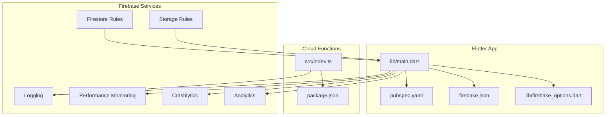
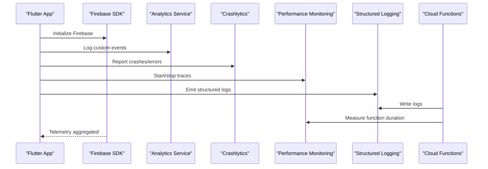
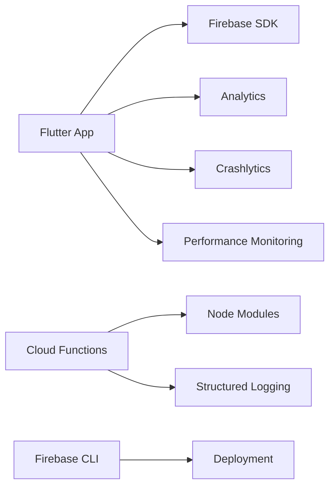

# Monitoring & Observability

<cite>
**Referenced Files in This Document**
- [firebase_options.dart](file://flutter_app/lib/firebase_options.dart)
- [main.dart](file://flutter_app/lib/main.dart)
- [firebase.json](file://flutter_app/firebase.json)
- [pubspec.yaml](file://flutter_app/pubspec.yaml)
- [functions/index.ts](file://functions/src/index.ts)
- [functions/package.json](file://functions/package.json)
- [FIREBASE_OBSERVABILITY.md](file://docs/FIREBASE_OBSERVABILITY.md)
- [FIREBASE_PADRAO_CONTROLE_TOTAL.md](file://docs/FIREBASE_PADRAO_CONTROLE_TOTAL.md)
- [ARCHITECTURE_PERFORMANCE_MULTI_PLATFORM.md](file://docs/ARCHITECTURE_PERFORMANCE_MULTI_PLATFORM.md)
- [PERFORMANCE_REPORT.md](file://PERFORMANCE_REPORT.md)
- [codemagic_ios_upload_crashlytics_dsyms.sh](file://scripts/codemagic_ios_upload_crashlytics_dsyms.sh)
- [deploy_web_hosting.ps1](file://scripts/deploy_web_hosting.ps1)
- [_check_log_growth.ps1](file://scripts/_check_log_growth.ps1)
- [firestore.rules](file://firestore.rules)
- [storage.rules](file://storage.rules)
</cite>

## Table of Contents
1. [Introduction](#introduction)
2. [Project Structure](#project-structure)
3. [Core Components](#core-components)
4. [Architecture Overview](#architecture-overview)
5. [Detailed Component Analysis](#detailed-component-analysis)
6. [Dependency Analysis](#dependency-analysis)
7. [Performance Considerations](#performance-considerations)
8. [Troubleshooting Guide](#troubleshooting-guide)
9. [Conclusion](#conclusion)
10. [Appendices](#appendices)

## Introduction
This document provides comprehensive monitoring and observability guidance for the Gestão Yahweh Premium application across Flutter (Android, iOS, Web), Firebase Cloud Functions, and hosting. It covers Firebase Analytics setup, error tracking with Crashlytics, performance monitoring, logging strategies, metrics collection, alerting configuration, dashboard creation, custom analytics implementation, crash reporting, cloud function performance monitoring, log aggregation, distributed tracing, and capacity planning based on usage patterns.

## Project Structure
The project is a multi-platform Flutter app with Firebase integration and serverless functions:
- Flutter app under flutter_app with platform-specific configurations and Firebase initialization.
- Firebase Cloud Functions under functions with TypeScript sources and build outputs.
- Documentation under docs describing observability standards and performance architecture.
- Scripts under scripts for CI/CD, deployment, and operational tasks including crash symbol upload and log growth checks.

**Diagram sources**
- [main.dart](file://flutter_app/lib/main.dart)
- [firebase_options.dart](file://flutter_app/lib/firebase_options.dart)
- [firebase.json](file://flutter_app/firebase.json)
- [pubspec.yaml](file://flutter_app/pubspec.yaml)
- [functions/index.ts](file://functions/src/index.ts)
- [functions/package.json](file://functions/package.json)
- [firestore.rules](file://firestore.rules)
- [storage.rules](file://storage.rules)

**Section sources**
- [firebase_options.dart](file://flutter_app/lib/firebase_options.dart)
- [main.dart](file://flutter_app/lib/main.dart)
- [firebase.json](file://flutter_app/firebase.json)
- [pubspec.yaml](file://flutter_app/pubspec.yaml)
- [functions/index.ts](file://functions/src/index.ts)
- [functions/package.json](file://functions/package.json)
- [firestore.rules](file://firestore.rules)
- [storage.rules](file://storage.rules)

## Core Components
- Firebase initialization and options are configured via firebase_options.dart and referenced by main.dart to bootstrap services like Analytics, Crashlytics, and Performance Monitoring.
- Cloud Functions are defined in functions/src/index.ts with dependencies managed in functions/package.json.
- Observability documentation outlines standards and best practices in docs/FIREBASE_OBSERVABILITY.md and docs/FIREBASE_PADRAO_CONTROLE_TOTAL.md.
- Performance architecture and multi-platform considerations are described in docs/ARCHITECTURE_PERFORMANCE_MULTI_PLATFORM.md and PERFORMANCE_REPORT.md.

Key responsibilities:
- Client-side telemetry: Analytics events, crashes, performance traces, structured logs.
- Server-side telemetry: Function execution logs, errors, performance metrics.
- Aggregation and visualization: Firebase console dashboards, alerts, and external tools if needed.

**Section sources**
- [FIREBASE_OBSERVABILITY.md](file://docs/FIREBASE_OBSERVABILITY.md)
- [FIREBASE_PADRAO_CONTROLE_TOTAL.md](file://docs/FIREBASE_PADRAO_CONTROLE_TOTAL.md)
- [ARCHITECTURE_PERFORMANCE_MULTI_PLATFORM.md](file://docs/ARCHITECTURE_PERFORMANCE_MULTI_PLATFORM.md)
- [PERFORMANCE_REPORT.md](file://PERFORMANCE_REPORT.md)

## Architecture Overview
The observability architecture integrates client-side and server-side components:
- Flutter app initializes Firebase services and emits analytics events, crash reports, and performance traces.
- Cloud Functions emit structured logs and can integrate with performance monitoring libraries.
- Firestore and Storage rules ensure secure access while allowing observability hooks where appropriate.

**Diagram sources**
- [main.dart](file://flutter_app/lib/main.dart)
- [firebase_options.dart](file://flutter_app/lib/firebase_options.dart)
- [functions/index.ts](file://functions/src/index.ts)

## Detailed Component Analysis

### Firebase Initialization and Configuration
- The Flutter app uses firebase_options.dart to configure Firebase instances per environment.
- main.dart initializes Firebase and ensures services are ready before emitting telemetry.
- firebase.json defines hosting and functions settings; pubspec.yaml includes required Firebase packages.

Implementation highlights:
- Ensure Firebase is initialized early in app lifecycle.
- Configure environment-specific options for development, staging, and production.
- Validate that analytics, crashlytics, and performance monitoring are enabled in Firebase console.

**Section sources**
- [firebase_options.dart](file://flutter_app/lib/firebase_options.dart)
- [main.dart](file://flutter_app/lib/main.dart)
- [firebase.json](file://flutter_app/firebase.json)
- [pubspec.yaml](file://flutter_app/pubspec.yaml)

### Analytics Setup and Custom Events
- Use Firebase Analytics to track user interactions, feature adoption, and conversion funnels.
- Implement custom events with meaningful parameters for segmentation and analysis.
- Avoid over-sampling; batch events where possible to reduce overhead.

Best practices:
- Define event taxonomy and naming conventions.
- Include tenant context for multi-tenant scenarios.
- Validate event payloads and avoid sensitive data.

**Section sources**
- [FIREBASE_OBSERVABILITY.md](file://docs/FIREBASE_OBSERVABILITY.md)
- [FIREBASE_PADRAO_CONTROLE_TOTAL.md](file://docs/FIREBASE_PADRAO_CONTROLE_TOTAL.md)

### Error Tracking with Crashlytics
- Enable Crashlytics in Flutter app to capture native and Dart exceptions.
- Upload symbols for Android and iOS builds to improve stack trace readability.
- Use scripts to automate symbol upload during CI/CD.

Operational steps:
- Integrate Crashlytics plugin and initialize it in main.dart.
- Configure symbol upload for iOS using codemagic_ios_upload_crashlytics_dsyms.sh.
- Set up Android symbol handling via Gradle or Firebase CLI.

**Section sources**
- [codemagic_ios_upload_crashlytics_dsyms.sh](file://scripts/codemagic_ios_upload_crashlytics_dsyms.sh)
- [FIREBASE_OBSERVABILITY.md](file://docs/FIREBASE_OBSERVABILITY.md)

### Performance Monitoring
- Use Firebase Performance Monitoring to measure app startup time, network latency, and UI responsiveness.
- Instrument critical paths with custom traces and attributes.
- Monitor cloud function execution times and errors.

Recommendations:
- Add performance traces around database reads/writes and API calls.
- Track navigation timing and widget rendering bottlenecks.
- Correlate performance issues with analytics events and crash reports.

**Section sources**
- [ARCHITECTURE_PERFORMANCE_MULTI_PLATFORM.md](file://docs/ARCHITECTURE_PERFORMANCE_MULTI_PLATFORM.md)
- [PERFORMANCE_REPORT.md](file://PERFORMANCE_REPORT.md)

### Logging Strategies
- Emit structured logs from both Flutter app and Cloud Functions.
- Use consistent log levels and include contextual metadata (tenantId, userId, requestId).
- Aggregate logs for centralized analysis and alerting.

Guidelines:
- Avoid verbose logging in production; use sampling for high-volume events.
- Mask sensitive information in logs.
- Integrate with external logging platforms if needed.

**Section sources**
- [FIREBASE_OBSERVABILITY.md](file://docs/FIREBASE_OBSERVABILITY.md)
- [functions/index.ts](file://functions/src/index.ts)

### Metrics Collection and Alerting
- Define key metrics: DAU/MAU, crash-free sessions, latency percentiles, error rates.
- Configure alerts in Firebase console or external systems for anomalies.
- Create dashboards to visualize trends and correlations.

Alerting examples:
- Crash rate threshold exceeded.
- Latency p95 above SLA.
- Sudden drop in active users.

**Section sources**
- [FIREBASE_OBSERVABILITY.md](file://docs/FIREBASE_OBSERVABILITY.md)
- [PERFORMANCE_REPORT.md](file://PERFORMANCE_REPORT.md)

### Dashboard Creation
- Build dashboards in Firebase console to monitor analytics, crashes, and performance.
- Combine multiple views for holistic insights.
- Share dashboards with stakeholders for transparency.

Dashboard components:
- User engagement overview.
- Crash trends and top devices.
- Performance hotspots and slow endpoints.

**Section sources**
- [FIREBASE_OBSERVABILITY.md](file://docs/FIREBASE_OBSERVABILITY.md)

### Custom Analytics Implementation
- Define event schema and parameter types.
- Implement event emission at relevant UI actions and business flows.
- Validate and test event delivery.

Example flows:
- Screen view tracking.
- Feature toggle usage.
- Conversion funnel completion.

**Section sources**
- [FIREBASE_PADRAO_CONTROLE_TOTAL.md](file://docs/FIREBASE_PADRAO_CONTROLE_TOTAL.md)

### Crash Reporting Setup
- Initialize Crashlytics in app entry point.
- Capture unhandled exceptions and custom errors.
- Upload symbols for accurate stack traces.

CI/CD integration:
- Automate symbol upload during build pipelines.
- Verify crash report ingestion post-deployment.

**Section sources**
- [codemagic_ios_upload_crashlytics_dsyms.sh](file://scripts/codemagic_ios_upload_crashlytics_dsyms.sh)
- [FIREBASE_OBSERVABILITY.md](file://docs/FIREBASE_OBSERVABILITY.md)

### Cloud Function Performance Monitoring
- Instrument functions with performance measurement libraries.
- Log execution duration, memory usage, and errors.
- Correlate function performance with client-side traces.

Optimization tips:
- Minimize cold starts with proper sizing and concurrency settings.
- Cache frequently accessed data.
- Profile and optimize database queries.

**Section sources**
- [functions/index.ts](file://functions/src/index.ts)
- [functions/package.json](file://functions/package.json)

### Log Aggregation and Distributed Tracing
- Centralize logs from Flutter app and Cloud Functions.
- Use correlation IDs to trace requests across boundaries.
- Visualize traces to identify bottlenecks and failures.

Tools and techniques:
- Firebase Logging for structured output.
- External log aggregators for advanced querying.
- Distributed tracing libraries for cross-service visibility.

**Section sources**
- [FIREBASE_OBSERVABILITY.md](file://docs/FIREBASE_OBSERVABILITY.md)

### Capacity Planning Based on Usage Patterns
- Analyze analytics data to forecast growth and resource needs.
- Monitor storage and bandwidth consumption trends.
- Scale functions and databases proactively.

Planning factors:
- Peak usage hours and seasonal spikes.
- Data retention policies and archival strategies.
- Cost optimization through efficient resource allocation.

**Section sources**
- [PERFORMANCE_REPORT.md](file://PERFORMANCE_REPORT.md)

## Dependency Analysis
Observability components depend on Firebase SDKs and platform-specific integrations:
- Flutter app depends on Firebase packages declared in pubspec.yaml.
- Cloud Functions depend on Node.js modules specified in package.json.
- Deployment scripts rely on Firebase CLI and platform tools.

**Diagram sources**
- [pubspec.yaml](file://flutter_app/pubspec.yaml)
- [functions/package.json](file://functions/package.json)

**Section sources**
- [pubspec.yaml](file://flutter_app/pubspec.yaml)
- [functions/package.json](file://functions/package.json)

## Performance Considerations
- Optimize analytics event frequency to avoid throttling.
- Use background processing for non-critical telemetry.
- Monitor memory and CPU usage in both client and server environments.
- Leverage caching and compression where applicable.

[No sources needed since this section provides general guidance]

## Troubleshooting Guide
Common issues and resolutions:
- Analytics not receiving events: Verify Firebase initialization and network connectivity.
- Crash reports missing symbols: Ensure symbol upload is configured and executed.
- Performance traces incomplete: Check trace boundaries and attribute tagging.
- Log aggregation gaps: Confirm log levels and filtering rules.

Debugging steps:
- Use Firebase console diagnostics and device logs.
- Enable debug mode temporarily for detailed output.
- Validate rules and permissions for data access.

**Section sources**
- [FIREBASE_OBSERVABILITY.md](file://docs/FIREBASE_OBSERVABILITY.md)

## Conclusion
Effective monitoring and observability require a cohesive strategy spanning client, server, and infrastructure layers. By implementing robust analytics, crash reporting, performance monitoring, and structured logging, teams can maintain high availability, diagnose issues quickly, and optimize user experience. Continuous improvement through data-driven insights ensures scalability and reliability as the application grows.

[No sources needed since this section summarizes without analyzing specific files]

## Appendices
- Additional resources and references for Firebase observability features.
- Links to official documentation and community guides.
- Templates for dashboards and alerting rules.

[No sources needed since this section provides general guidance]