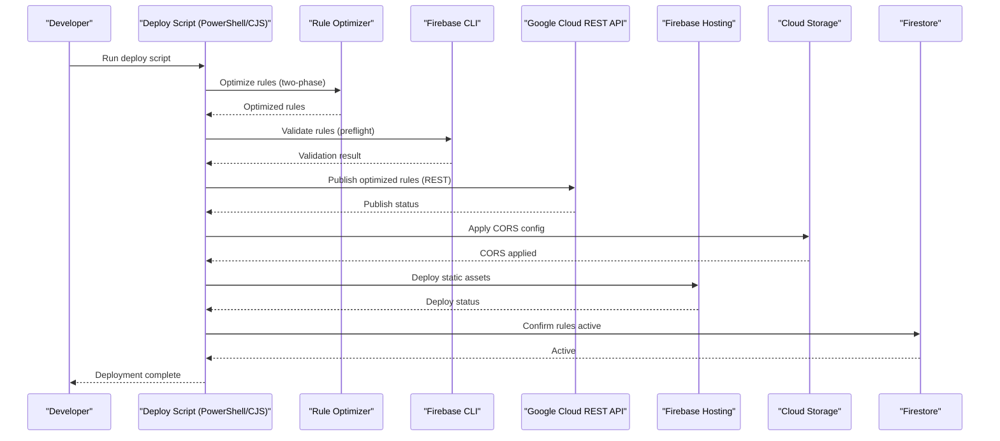
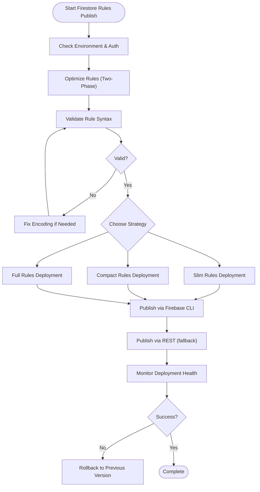
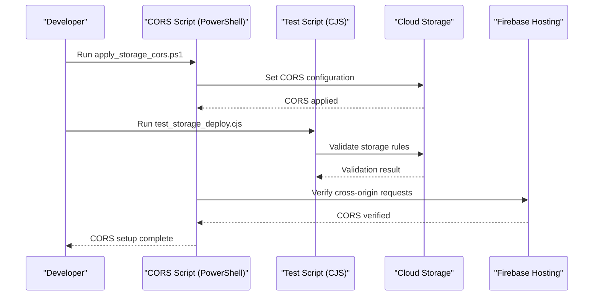
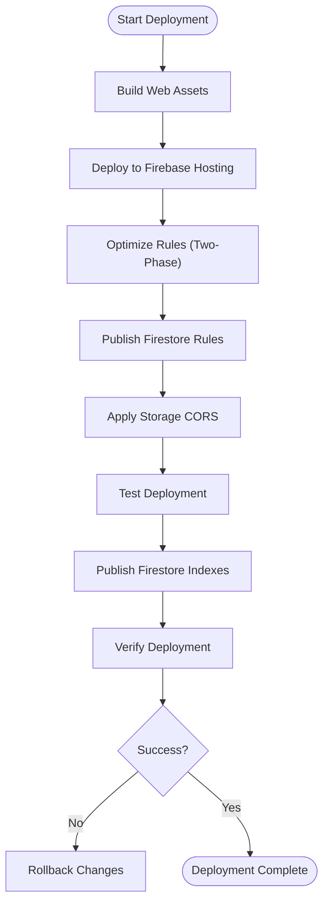
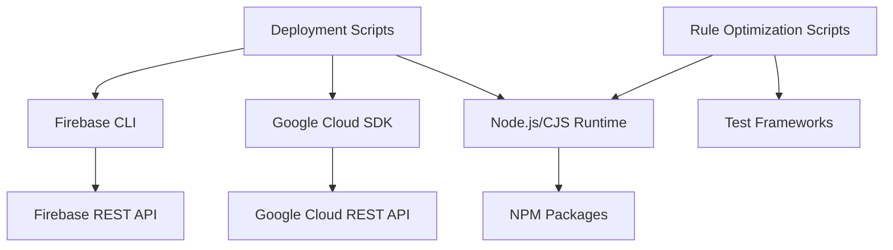

# Firebase Deployment & Rules

<cite>
**Referenced Files in This Document**
- [firebase.json](file://firebase.json)
- [firestore.rules](file://firestore.rules)
- [storage.rules](file://storage.rules)
- [.firebaserc](file://.firebaserc)
- [cors.json](file://cors.json)
- [storage_cors.json](file://flutter_app/storage_cors.json)
- [STORAGE_CORS_README.txt](file://flutter_app/STORAGE_CORS_README.txt)
- [deploy_firebase_rules.ps1](file://scripts/deploy_firebase_rules.ps1)
- [deploy_firebase_rules.bat](file://scripts/deploy_firebase_rules.bat)
- [apply_storage_cors.ps1](file://scripts/apply_storage_cors.ps1)
- [apply_firebase_storage_cors.ps1](file://scripts/apply_firebase_storage_cors.ps1)
- [firebase_rules_gcp_publish.cjs](file://scripts/firebase_rules_gcp_publish.cjs)
- [publish_firestore_rules_rest.cjs](file://scripts/publish_firestore_rules_rest.cjs)
- [gcp_rules_auth.cjs](file://scripts/gcp_rules_auth.cjs)
- [grant_gcp_firebase_rules_iam.cjs](file://scripts/grant_gcp_firebase_rules_iam.cjs)
- [firebase_indexes_gcp_publish.cjs](file://scripts/firebase_indexes_gcp_publish.cjs)
- [firestore_rules_patch_release.cjs](file://scripts/firestore_rules_patch_release.cjs)
- [fix_firestore_rules_encoding.cjs](file://scripts/fix_firestore_rules_encoding.cjs)
- [firebase_rules_preflight.ps1](file://scripts/firebase_rules_preflight.ps1)
- [firebase_rules_gcp_watchdog.ps1](file://scripts/firebase_rules_gcp_watchdog.ps1)
- [forcar_regras_gcp_owner.ps1](file://scripts/forcar_regras_gcp_owner.ps1)
- [regras_pipeline_engenharia.ps1](file://scripts/regras_pipeline_engenharia.ps1)
- [publis_force_update_online.ps1](file://scripts/publish_force_update_online.ps1)
- [DEPLOY_PRODUCAO_YAHWEH.ps1](file://scripts/DEPLOY_PRODUCAO_YAHWEH.ps1)
- [build_e_deploy_web.ps1](file://scripts/build_e_deploy_web.ps1)
- [deploy_web_hosting.ps1](file://scripts/deploy_web_hosting.ps1)
- [deploy_full_gestao_yahweh.ps1](file://scripts/deploy_full_gestao_yahweh.ps1)
- [README_DEPLOY_PRODUCAO.md](file://README_DEPLOY_PRODUCAO.md)
- [COMO_SUBIR_VERSAO_E_REGRAS.md](file://COMO_SUBIR_VERSAO_E_REGRAS.md)
- [FIREBASE_OBSERVABILITY.md](file://docs/FIREBASE_OBSERVABILITY.md)
- [FIREBASE_PADRAO_CONTROLE_TOTAL.md](file://docs/FIREBASE_PADRAO_CONTROLE_TOTAL.md)
- [security_rules_test_firestore/test/firestore.rules.test.js](file://security_rules_test_firestore/test/firestore.rules.test.js)
- [security_rules_test_firestore/package.json](file://security_rules_test_firestore/package.json)
- [deploy_rules_two_phase.cjs](file://scripts/deploy_rules_two_phase.cjs)
- [slim_rules.cjs](file://scripts/slim_rules.cjs)
- [slim2_rules.cjs](file://scripts/slim2_rules.cjs)
- [test_compact_deploy.cjs](file://scripts/test_compact_deploy.cjs)
- [test_storage_deploy.cjs](file://scripts/test_storage_deploy.cjs)
</cite>

## Update Summary
**Changes Made**
- Added new multi-level Firestore security rule optimization scripts to the deployment pipeline
- Updated Firestore Rules Publishing section with two-phase deployment strategy
- Enhanced testing and validation workflows for optimized rules
- Added new script references for slim and compact rule deployments
- Updated architecture diagrams to reflect the new optimization strategy

## Table of Contents
1. [Introduction](#introduction)
2. [Project Structure](#project-structure)
3. [Core Components](#core-components)
4. [Architecture Overview](#architecture-overview)
5. [Detailed Component Analysis](#detailed-component-analysis)
6. [Dependency Analysis](#dependency-analysis)
7. [Performance Considerations](#performance-considerations)
8. [Troubleshooting Guide](#troubleshooting-guide)
9. [Conclusion](#conclusion)
10. [Appendices](#appendices)

## Introduction
This document provides comprehensive guidance for deploying and managing Firebase resources in this project, with a focus on Firestore security rules, Storage security rules, and CORS configuration. It explains the automated deployment scripts, rule validation processes, rollback procedures, and best practices for staging and production environments. The updated documentation now includes the new multi-level Firestore security rule optimization strategy with specialized deployment scripts for enhanced performance and reliability.

## Project Structure
The repository organizes Firebase-related configuration and automation as follows:
- Root-level Firebase configuration files define hosting, functions, storage, and rules targets.
- Security rules are stored at the repository root for easy version control and CI/CD integration.
- Scripts under scripts/ automate publishing rules, applying CORS, validating rules, and orchestrating full deployments.
- Documentation under docs/ outlines observability, standards, and operational practices.
- A dedicated test directory contains unit tests for Firestore rules.
- New optimization scripts provide multi-level rule deployment strategies.

```mermaid
graph TB
subgraph "Root"
FJSON["firebase.json"]
FIREBC[".firebaserc"]
FR["firestore.rules"]
SR["storage.rules"]
CORS["cors.json"]
end
subgraph "Scripts"
DFR_PS["deploy_firebase_rules.ps1"]
DFR_BAT["deploy_firebase_rules.bat"]
ASC_PS["apply_storage_cors.ps1"]
AFSC_PS["apply_firebase_storage_cors.ps1"]
GCPPUB["firebase_rules_gcp_publish.cjs"]
PFRREST["publish_firestore_rules_rest.cjs"]
GRAUTH["gcp_rules_auth.cjs"]
IAM["grant_gcp_firebase_rules_iam.cjs"]
IDX["firebase_indexes_gcp_publish.cjs"]
PATCH["firestore_rules_patch_release.cjs"]
FIXENC["fix_firestore_rules_encoding.cjs"]
PREFLIGHT["firebase_rules_preflight.ps1"]
WATCHDOG["firebase_rules_gcp_watchdog.ps1"]
OWNER["forcar_regras_gcp_owner.ps1"]
PIPELINE["regras_pipeline_engenharia.ps1"]
FORCEUPDATE["publish_force_update_online.ps1"]
DEPLOYPROD["DEPLOY_PRODUCAO_YAHWEH.ps1"]
BUILDWEB["build_e_deploy_web.ps1"]
HOSTING["deploy_web_hosting.ps1"]
FULLDEPLOY["deploy_full_gestao_yahweh.ps1"]
TWO_PHASE["deploy_rules_two_phase.cjs"]
SLIM_RULES["slim_rules.cjs"]
SLIM2_RULES["slim2_rules.cjs"]
TEST_COMPACT["test_compact_deploy.cjs"]
TEST_STORAGE["test_storage_deploy.cjs"]
end
subgraph "Docs"
OBS["FIREBASE_OBSERVABILITY.md"]
STD["FIREBASE_PADRAO_CONTROLE_TOTAL.md"]
end
subgraph "Tests"
TESTJS["security_rules_test_firestore/test/firestore.rules.test.js"]
PKGTEST["security_rules_test_firestore/package.json"]
end
FJSON --> DFR_PS
FJSON --> DFR_BAT
FJSON --> ASC_PS
FJSON --> AFSC_PS
FJSON --> GCPPUB
FJSON --> PFRREST
FJSON --> TWO_PHASE
FJSON --> SLIM_RULES
FJSON --> SLIM2_RULES
FJSON --> TEST_COMPACT
FJSON --> TEST_STORAGE
FR --> PREFLIGHT
FR --> GCPPUB
FR --> PFRREST
FR --> TWO_PHASE
SR --> ASC_PS
SR --> AFSC_PS
CORS --> ASC_PS
CORS --> AFSC_PS
OBS --> PIPELINE
STD --> PIPELINE
TESTJS --> PKGTEST
```

**Diagram sources**
- [firebase.json:1-200](file://firebase.json#L1-L200)
- [.firebaserc:1-50](file://.firebaserc#L1-L50)
- [firestore.rules:1-200](file://firestore.rules#L1-L200)
- [storage.rules:1-200](file://storage.rules#L1-L200)
- [cors.json:1-50](file://cors.json#L1-L50)
- [deploy_firebase_rules.ps1:1-200](file://scripts/deploy_firebase_rules.ps1#L1-L200)
- [deploy_rules_two_phase.cjs:1-200](file://scripts/deploy_rules_two_phase.cjs#L1-L200)
- [slim_rules.cjs:1-200](file://scripts/slim_rules.cjs#L1-L200)
- [slim2_rules.cjs:1-200](file://scripts/slim2_rules.cjs#L1-L200)
- [test_compact_deploy.cjs:1-200](file://scripts/test_compact_deploy.cjs#L1-L200)
- [test_storage_deploy.cjs:1-200](file://scripts/test_storage_deploy.cjs#L1-L200)

**Section sources**
- [firebase.json:1-200](file://firebase.json#L1-L200)
- [.firebaserc:1-50](file://.firebaserc#L1-L50)
- [README_DEPLOY_PRODUCAO.md:1-200](file://README_DEPLOY_PRODUCAO.md#L1-L200)
- [COMO_SUBIR_VERSAO_E_REGRAS.md:1-200](file://COMO_SUBIR_VERSAO_E_REGRAS.md#L1-L200)

## Core Components
- Firebase configuration and targets: firebase.json defines hosting, functions, storage, and rules targets; .firebaserc maps projects and environments.
- Security rules: firestore.rules and storage.rules enforce data access and file operations.
- CORS configuration: cors.json and storage_cors.json define cross-origin policies for web and Storage buckets.
- Automation scripts: PowerShell and Node/CJS scripts publish rules, apply CORS, validate syntax, and orchestrate deployments.
- Testing: Unit tests for Firestore rules ensure correctness before deployment.
- **New**: Multi-level rule optimization scripts for enhanced deployment strategies.

Key responsibilities:
- Rule publishing uses either Firebase CLI or direct REST APIs via CJS scripts.
- **Updated**: Two-phase deployment strategy with specialized optimization scripts.
- CORS is applied through Google Cloud SDK commands invoked by PowerShell scripts.
- Preflight checks validate rule syntax and environment readiness.
- Rollback procedures rely on backups and targeted re-deployment of previous versions.

**Section sources**
- [firebase.json:1-200](file://firebase.json#L1-L200)
- [.firebaserc:1-50](file://.firebaserc#L1-L50)
- [firestore.rules:1-200](file://firestore.rules#L1-L200)
- [storage.rules:1-200](file://storage.rules#L1-L200)
- [cors.json:1-50](file://cors.json#L1-L50)
- [storage_cors.json:1-50](file://flutter_app/storage_cors.json#L1-L50)
- [STORAGE_CORS_README.txt:1-200](file://flutter_app/STORAGE_CORS_README.txt#L1-L200)
- [deploy_firebase_rules.ps1:1-200](file://scripts/deploy_firebase_rules.ps1#L1-L200)
- [deploy_rules_two_phase.cjs:1-200](file://scripts/deploy_rules_two_phase.cjs#L1-L200)
- [slim_rules.cjs:1-200](file://scripts/slim_rules.cjs#L1-L200)
- [slim2_rules.cjs:1-200](file://scripts/slim2_rules.cjs#L1-L200)
- [test_compact_deploy.cjs:1-200](file://scripts/test_compact_deploy.cjs#L1-L200)
- [test_storage_deploy.cjs:1-200](file://scripts/test_storage_deploy.cjs#L1-L200)

## Architecture Overview
The deployment architecture integrates local scripts, Firebase CLI, and Google Cloud REST APIs to manage Firestore rules, Storage rules, and CORS settings. Hosting is configured to serve static assets and integrate with CDN. Observability and standards guide operational practices. **Updated**: The architecture now supports multi-level rule optimization with specialized deployment strategies.

**Diagram sources**
- [firebase.json:1-200](file://firebase.json#L1-L200)
- [deploy_firebase_rules.ps1:1-200](file://scripts/deploy_firebase_rules.ps1#L1-L200)
- [deploy_rules_two_phase.cjs:1-200](file://scripts/deploy_rules_two_phase.cjs#L1-L200)
- [firebase_rules_gcp_publish.cjs:1-200](file://scripts/firebase_rules_gcp_publish.cjs#L1-L200)
- [apply_storage_cors.ps1:1-200](file://scripts/apply_storage_cors.ps1#L1-L200)
- [deploy_web_hosting.ps1:1-200](file://scripts/deploy_web_hosting.ps1#L1-L200)

## Detailed Component Analysis

### Firestore Rules Publishing
- Purpose: Publish and validate Firestore security rules using CLI or REST APIs.
- Key scripts:
  - deploy_firebase_rules.ps1/bat: Orchestrates rule publishing via Firebase CLI.
  - firebase_rules_gcp_publish.cjs: Publishes rules directly to GCP using REST endpoints.
  - publish_firestore_rules_rest.cjs: Alternative REST-based publisher with error handling.
  - fix_firestore_rules_encoding.cjs: Ensures UTF-8 encoding for rule files.
  - firebase_rules_preflight.ps1: Validates syntax and environment prerequisites.
  - firebase_rules_gcp_watchdog.ps1: Monitors rule deployment health.
  - grant_gcp_firebase_rules_iam.cjs: Grants necessary IAM permissions for rule publishing.
  - gcp_rules_auth.cjs: Handles authentication for GCP REST calls.
  - firestore_rules_patch_release.cjs: Applies targeted patches for release rollouts.
  - **New**: deploy_rules_two_phase.cjs: Implements two-phase deployment strategy for optimized rules.
  - **New**: slim_rules.cjs: Creates slimmed-down rule versions for faster deployment.
  - **New**: slim2_rules.cjs: Advanced rule optimization with multiple compression levels.
  - **New**: test_compact_deploy.cjs: Tests compact rule deployment scenarios.
  - **New**: test_storage_deploy.cjs: Validates storage rule deployment independently.

**Updated**: The new multi-level optimization strategy provides enhanced performance through specialized deployment approaches.

**Diagram sources**
- [deploy_firebase_rules.ps1:1-200](file://scripts/deploy_firebase_rules.ps1#L1-L200)
- [deploy_rules_two_phase.cjs:1-200](file://scripts/deploy_rules_two_phase.cjs#L1-L200)
- [slim_rules.cjs:1-200](file://scripts/slim_rules.cjs#L1-L200)
- [slim2_rules.cjs:1-200](file://scripts/slim2_rules.cjs#L1-L200)
- [test_compact_deploy.cjs:1-200](file://scripts/test_compact_deploy.cjs#L1-L200)
- [firebase_rules_gcp_publish.cjs:1-200](file://scripts/firebase_rules_gcp_publish.cjs#L1-L200)
- [publish_firestore_rules_rest.cjs:1-200](file://scripts/publish_firestore_rules_rest.cjs#L1-L200)
- [fix_firestore_rules_encoding.cjs:1-200](file://scripts/fix_firestore_rules_encoding.cjs#L1-L200)
- [firebase_rules_preflight.ps1:1-200](file://scripts/firebase_rules_preflight.ps1#L1-L200)
- [firebase_rules_gcp_watchdog.ps1:1-200](file://scripts/firebase_rules_gcp_watchdog.ps1#L1-L200)
- [grant_gcp_firebase_rules_iam.cjs:1-200](file://scripts/grant_gcp_firebase_rules_iam.cjs#L1-L200)
- [gcp_rules_auth.cjs:1-200](file://scripts/gcp_rules_auth.cjs#L1-L200)
- [firestore_rules_patch_release.cjs:1-200](file://scripts/firestore_rules_patch_release.cjs#L1-L200)

**Section sources**
- [deploy_firebase_rules.ps1:1-200](file://scripts/deploy_firebase_rules.ps1#L1-L200)
- [deploy_firebase_rules.bat:1-200](file://scripts/deploy_firebase_rules.bat#L1-L200)
- [deploy_rules_two_phase.cjs:1-200](file://scripts/deploy_rules_two_phase.cjs#L1-L200)
- [slim_rules.cjs:1-200](file://scripts/slim_rules.cjs#L1-L200)
- [slim2_rules.cjs:1-200](file://scripts/slim2_rules.cjs#L1-L200)
- [test_compact_deploy.cjs:1-200](file://scripts/test_compact_deploy.cjs#L1-L200)
- [test_storage_deploy.cjs:1-200](file://scripts/test_storage_deploy.cjs#L1-L200)
- [firebase_rules_gcp_publish.cjs:1-200](file://scripts/firebase_rules_gcp_publish.cjs#L1-L200)
- [publish_firestore_rules_rest.cjs:1-200](file://scripts/publish_firestore_rules_rest.cjs#L1-L200)
- [fix_firestore_rules_encoding.cjs:1-200](file://scripts/fix_firestore_rules_encoding.cjs#L1-L200)
- [firebase_rules_preflight.ps1:1-200](file://scripts/firebase_rules_preflight.ps1#L1-L200)
- [firebase_rules_gcp_watchdog.ps1:1-200](file://scripts/firebase_rules_gcp_watchdog.ps1#L1-L200)
- [grant_gcp_firebase_rules_iam.cjs:1-200](file://scripts/grant_gcp_firebase_rules_iam.cjs#L1-L200)
- [gcp_rules_auth.cjs:1-200](file://scripts/gcp_rules_auth.cjs#L1-L200)
- [firestore_rules_patch_release.cjs:1-200](file://scripts/firestore_rules_patch_release.cjs#L1-L200)

### Storage Rules Management
- Purpose: Manage Cloud Storage security rules and CORS configuration.
- Key scripts:
  - apply_storage_cors.ps1: Applies CORS policy using Google Cloud SDK.
  - apply_firebase_storage_cors.ps1: Firebase-specific CORS application.
  - storage.rules: Defines file access policies.
  - cors.json and storage_cors.json: Define CORS policies for web and Storage.
  - **New**: test_storage_deploy.cjs: Validates storage rule deployment independently.

**Diagram sources**
- [apply_storage_cors.ps1:1-200](file://scripts/apply_storage_cors.ps1#L1-L200)
- [apply_firebase_storage_cors.ps1:1-200](file://scripts/apply_firebase_storage_cors.ps1#L1-L200)
- [test_storage_deploy.cjs:1-200](file://scripts/test_storage_deploy.cjs#L1-L200)
- [storage.rules:1-200](file://storage.rules#L1-L200)
- [cors.json:1-50](file://cors.json#L1-L50)
- [storage_cors.json:1-50](file://flutter_app/storage_cors.json#L1-L50)

**Section sources**
- [apply_storage_cors.ps1:1-200](file://scripts/apply_storage_cors.ps1#L1-L200)
- [apply_firebase_storage_cors.ps1:1-200](file://scripts/apply_firebase_storage_cors.ps1#L1-L200)
- [test_storage_deploy.cjs:1-200](file://scripts/test_storage_deploy.cjs#L1-L200)
- [storage.rules:1-200](file://storage.rules#L1-L200)
- [cors.json:1-50](file://cors.json#L1-L50)
- [storage_cors.json:1-50](file://flutter_app/storage_cors.json#L1-L50)
- [STORAGE_CORS_README.txt:1-200](file://flutter_app/STORAGE_CORS_README.txt#L1-L200)

### CORS Configuration
- Purpose: Enable cross-origin requests for web applications accessing Firebase services.
- Key files:
  - cors.json: General CORS policy for Firebase Hosting.
  - storage_cors.json: Specific CORS policy for Cloud Storage.
  - STORAGE_CORS_README.txt: Guidance on configuring CORS.

Best practices:
- Restrict allowed origins to trusted domains.
- Limit HTTP methods and headers to required ones.
- Test CORS behavior across browsers and platforms.

**Section sources**
- [cors.json:1-50](file://cors.json#L1-L50)
- [storage_cors.json:1-50](file://flutter_app/storage_cors.json#L1-L50)
- [STORAGE_CORS_README.txt:1-200](file://flutter_app/STORAGE_CORS_README.txt#L1-L200)

### Automated Deployment Scripts
- Purpose: Orchestrate end-to-end deployment including rules, hosting, and indexing.
- Key scripts:
  - DEPLOY_PRODUCAO_YAHWEH.ps1: Production deployment orchestrator.
  - build_e_deploy_web.ps1: Builds and deploys web assets.
  - deploy_web_hosting.ps1: Deploys static content to Firebase Hosting.
  - deploy_full_gestao_yahweh.ps1: Full deployment pipeline.
  - regras_pipeline_engenharia.ps1: Engineering pipeline for rules.
  - publish_force_update_online.ps1: Forces online updates.
  - **New**: deploy_rules_two_phase.cjs: Two-phase deployment strategy.
  - **New**: slim_rules.cjs: Optimized rule deployment.
  - **New**: slim2_rules.cjs: Advanced optimization.
  - **New**: test_compact_deploy.cjs: Compact deployment testing.
  - **New**: test_storage_deploy.cjs: Storage deployment validation.

**Updated**: Enhanced deployment pipeline with multi-level optimization strategies for improved performance and reliability.

**Diagram sources**
- [DEPLOY_PRODUCAO_YAHWEH.ps1:1-200](file://scripts/DEPLOY_PRODUCAO_YAHWEH.ps1#L1-L200)
- [build_e_deploy_web.ps1:1-200](file://scripts/build_e_deploy_web.ps1#L1-L200)
- [deploy_web_hosting.ps1:1-200](file://scripts/deploy_web_hosting.ps1#L1-L200)
- [deploy_full_gestao_yahweh.ps1:1-200](file://scripts/deploy_full_gestao_yahweh.ps1#L1-L200)
- [regras_pipeline_engenharia.ps1:1-200](file://scripts/regras_pipeline_engenharia.ps1#L1-L200)
- [publish_force_update_online.ps1:1-200](file://scripts/publish_force_update_online.ps1#L1-L200)
- [deploy_rules_two_phase.cjs:1-200](file://scripts/deploy_rules_two_phase.cjs#L1-L200)
- [slim_rules.cjs:1-200](file://scripts/slim_rules.cjs#L1-L200)
- [slim2_rules.cjs:1-200](file://scripts/slim2_rules.cjs#L1-L200)
- [test_compact_deploy.cjs:1-200](file://scripts/test_compact_deploy.cjs#L1-L200)
- [test_storage_deploy.cjs:1-200](file://scripts/test_storage_deploy.cjs#L1-L200)

**Section sources**
- [DEPLOY_PRODUCAO_YAHWEH.ps1:1-200](file://scripts/DEPLOY_PRODUCAO_YAHWEH.ps1#L1-L200)
- [build_e_deploy_web.ps1:1-200](file://scripts/build_e_deploy_web.ps1#L1-L200)
- [deploy_web_hosting.ps1:1-200](file://scripts/deploy_web_hosting.ps1#L1-L200)
- [deploy_full_gestao_yahweh.ps1:1-200](file://scripts/deploy_full_gestao_yahweh.ps1#L1-L200)
- [regras_pipeline_engenharia.ps1:1-200](file://scripts/regras_pipeline_engenharia.ps1#L1-L200)
- [publish_force_update_online.ps1:1-200](file://scripts/publish_force_update_online.ps1#L1-L200)
- [deploy_rules_two_phase.cjs:1-200](file://scripts/deploy_rules_two_phase.cjs#L1-L200)
- [slim_rules.cjs:1-200](file://scripts/slim_rules.cjs#L1-L200)
- [slim2_rules.cjs:1-200](file://scripts/slim2_rules.cjs#L1-L200)
- [test_compact_deploy.cjs:1-200](file://scripts/test_compact_deploy.cjs#L1-L200)
- [test_storage_deploy.cjs:1-200](file://scripts/test_storage_deploy.cjs#L1-L200)

### Rule Validation and Testing
- Purpose: Ensure Firestore rules are syntactically correct and functionally valid.
- Key components:
  - firebase_rules_preflight.ps1: Pre-deployment validation.
  - security_rules_test_firestore/test/firestore.rules.test.js: Unit tests for rules.
  - security_rules_test_firestore/package.json: Dependencies for testing.
  - **New**: test_compact_deploy.cjs: Tests compact deployment scenarios.
  - **New**: test_storage_deploy.cjs: Validates storage rule deployment.

**Updated**: Enhanced testing capabilities with specialized scripts for different deployment strategies and rule optimizations.

Testing strategies:
- Use emulator suite for local testing.
- Write unit tests covering edge cases.
- Integrate validation into CI/CD pipelines.
- **New**: Utilize specialized test scripts for different optimization levels.

**Section sources**
- [firebase_rules_preflight.ps1:1-200](file://scripts/firebase_rules_preflight.ps1#L1-L200)
- [security_rules_test_firestore/test/firestore.rules.test.js:1-200](file://security_rules_test_firestore/test/firestore.rules.test.js#L1-L200)
- [security_rules_test_firestore/package.json:1-200](file://security_rules_test_firestore/package.json#L1-L200)
- [test_compact_deploy.cjs:1-200](file://scripts/test_compact_deploy.cjs#L1-L200)
- [test_storage_deploy.cjs:1-200](file://scripts/test_storage_deploy.cjs#L1-L200)

### Rollback Procedures
- Purpose: Revert to previous versions of rules and configurations.
- Key practices:
  - Maintain backups of rule files (e.g., firestore.rules.bak-*).
  - Use targeted deployment scripts to re-apply previous versions.
  - Monitor deployment health and trigger rollbacks on failures.
  - **New**: Leverage specialized rollback scripts for different optimization levels.

**Section sources**
- [firestore.rules:1-200](file://firestore.rules#L1-L200)
- [firebase_rules_gcp_watchdog.ps1:1-200](file://scripts/firebase_rules_gcp_watchdog.ps1#L1-L200)
- [DEPLOY_PRODUCAO_YAHWEH.ps1:1-200](file://scripts/DEPLOY_PRODUCAO_YAHWEH.ps1#L1-L200)

## Dependency Analysis
The deployment system relies on Firebase CLI, Google Cloud SDK, and Node.js/CJS scripts. Dependencies include authentication mechanisms, REST APIs, and environment variables. **Updated**: New optimization scripts add additional dependencies for rule processing and testing.

**Diagram sources**
- [firebase.json:1-200](file://firebase.json#L1-L200)
- [firebase_rules_gcp_publish.cjs:1-200](file://scripts/firebase_rules_gcp_publish.cjs#L1-L200)
- [apply_storage_cors.ps1:1-200](file://scripts/apply_storage_cors.ps1#L1-L200)
- [deploy_rules_two_phase.cjs:1-200](file://scripts/deploy_rules_two_phase.cjs#L1-L200)
- [slim_rules.cjs:1-200](file://scripts/slim_rules.cjs#L1-L200)
- [slim2_rules.cjs:1-200](file://scripts/slim2_rules.cjs#L1-L200)
- [test_compact_deploy.cjs:1-200](file://scripts/test_compact_deploy.cjs#L1-L200)
- [test_storage_deploy.cjs:1-200](file://scripts/test_storage_deploy.cjs#L1-L200)

**Section sources**
- [firebase.json:1-200](file://firebase.json#L1-L200)
- [firebase_rules_gcp_publish.cjs:1-200](file://scripts/firebase_rules_gcp_publish.cjs#L1-L200)
- [apply_storage_cors.ps1:1-200](file://scripts/apply_storage_cors.ps1#L1-L200)
- [deploy_rules_two_phase.cjs:1-200](file://scripts/deploy_rules_two_phase.cjs#L1-L200)
- [slim_rules.cjs:1-200](file://scripts/slim_rules.cjs#L1-L200)
- [slim2_rules.cjs:1-200](file://scripts/slim2_rules.cjs#L1-L200)
- [test_compact_deploy.cjs:1-200](file://scripts/test_compact_deploy.cjs#L1-L200)
- [test_storage_deploy.cjs:1-200](file://scripts/test_storage_deploy.cjs#L1-L200)

## Performance Considerations
- Optimize Firestore rules to minimize read/write operations.
- Use caching strategies in Hosting for static assets.
- Configure CDN settings for optimal content delivery.
- Monitor rule evaluation performance using observability tools.
- **New**: Utilize multi-level rule optimization strategies for different deployment scenarios.
- **New**: Employ slim and compact rule versions for faster deployment times.
- **New**: Implement two-phase deployment for reduced downtime during updates.

[No sources needed since this section provides general guidance]

## Troubleshooting Guide
Common issues and resolutions:
- CORS errors: Verify cors.json and storage_cors.json configurations.
- Permission denied: Review Firestore and Storage rules for access control.
- Deployment failures: Check authentication and IAM permissions.
- Rule syntax errors: Use preflight validation and fix encoding issues.
- **New**: Optimization failures: Check rule optimization scripts and fallback to standard deployment.
- **New**: Two-phase deployment issues: Verify both phases complete successfully before proceeding.
- **New**: Test script failures: Run individual test scripts to isolate deployment problems.

**Section sources**
- [cors.json:1-50](file://cors.json#L1-L50)
- [storage_cors.json:1-50](file://flutter_app/storage_cors.json#L1-L50)
- [firestore.rules:1-200](file://firestore.rules#L1-L200)
- [storage.rules:1-200](file://storage.rules#L1-L200)
- [firebase_rules_preflight.ps1:1-200](file://scripts/firebase_rules_preflight.ps1#L1-L200)
- [fix_firestore_rules_encoding.cjs:1-200](file://scripts/fix_firestore_rules_encoding.cjs#L1-L200)
- [deploy_rules_two_phase.cjs:1-200](file://scripts/deploy_rules_two_phase.cjs#L1-L200)
- [slim_rules.cjs:1-200](file://scripts/slim_rules.cjs#L1-L200)
- [slim2_rules.cjs:1-200](file://scripts/slim2_rules.cjs#L1-L200)
- [test_compact_deploy.cjs:1-200](file://scripts/test_compact_deploy.cjs#L1-L200)
- [test_storage_deploy.cjs:1-200](file://scripts/test_storage_deploy.cjs#L1-L200)

## Conclusion
This documentation outlines the end-to-end process for deploying and managing Firebase resources, focusing on security rules, CORS configuration, and automation. **Updated**: The new multi-level Firestore security rule optimization strategy enhances deployment performance and reliability through specialized scripts and two-phase deployment approaches. By following the provided scripts and best practices, teams can ensure secure, performant, and reliable deployments across staging and production environments.

[No sources needed since this section summarizes without analyzing specific files]

## Appendices
- Observability: Refer to FIREBASE_OBSERVABILITY.md for monitoring and logging practices.
- Standards: Consult FIREBASE_PADRAO_CONTROLE_TOTAL.md for operational standards.
- Deployment guides: See README_DEPLOY_PRODUCAO.md and COMO_SUBIR_VERSAO_E_REGRAS.md for step-by-step instructions.
- **New**: Optimization guides: Review the new deployment scripts for advanced rule optimization techniques.

**Section sources**
- [FIREBASE_OBSERVABILITY.md:1-200](file://docs/FIREBASE_OBSERVABILITY.md#L1-L200)
- [FIREBASE_PADRAO_CONTROLE_TOTAL.md:1-200](file://docs/FIREBASE_PADRAO_CONTROLE_TOTAL.md#L1-L200)
- [README_DEPLOY_PRODUCAO.md:1-200](file://README_DEPLOY_PRODUCAO.md#L1-L200)
- [COMO_SUBIR_VERSAO_E_REGRAS.md:1-200](file://COMO_SUBIR_VERSAO_E_REGRAS.md#L1-L200)
- [deploy_rules_two_phase.cjs:1-200](file://scripts/deploy_rules_two_phase.cjs#L1-L200)
- [slim_rules.cjs:1-200](file://scripts/slim_rules.cjs#L1-L200)
- [slim2_rules.cjs:1-200](file://scripts/slim2_rules.cjs#L1-L200)
- [test_compact_deploy.cjs:1-200](file://scripts/test_compact_deploy.cjs#L1-L200)
- [test_storage_deploy.cjs:1-200](file://scripts/test_storage_deploy.cjs#L1-L200)