# Release Management & Publishing

<cite>
**Referenced Files in This Document**
- [README_DEPLOY_PRODUCAO.md](file://README_DEPLOY_PRODUCAO.md)
- [CONTROLE_VERSAO.md](file://CONTROLE_VERSAO.md)
- [firebase.json](file://firebase.json)
- [firestore.rules](file://firestore.rules)
- [storage.rules](file://storage.rules)
- [functions/src/index.ts](file://functions/src/index.ts)
- [flutter_app/firebase.json](file://flutter_app/firebase.json)
- [flutter_app/storage_cors.json](file://flutter_app/storage_cors.json)
- [scripts/deploy_release_completo_regras_funcoes_web_aab_ios_zip.ps1](file://scripts/deploy_release_completo_regras_funcoes_web_aab_ios_zip.ps1)
- [scripts/deploy_firebase_rules.ps1](file://scripts/deploy_firebase_rules.ps1)
- [scripts/apply_storage_cors.ps1](file://scripts/apply_storage_cors.ps1)
- [scripts/build_android_play_store_aab.ps1](file://scripts/build_android_play_store_aab.ps1)
- [scripts/codemagic_publish_ipa_to_firebase.js](file://scripts/codemagic_publish_ipa_to_firebase.js)
- [codemagic.yaml](file://codemagic.yaml)
- [.github/workflows/deploy-web.yml](file:.github/workflows/deploy-web.yml)
- [scripts/_publish_force_update_online.ps1](file://scripts/_publish_force_update_online.ps1)
- [scripts/publish_firestore_rules_rest.cjs](file://scripts/publish_firestore_rules_rest.cjs)
- [scripts/firestore_rules_patch_release.cjs](file://scripts/firestore_rules_patch_release.cjs)
- [scripts/firebase_rules_gcp_publish.cjs](file://scripts/firebase_rules_gcp_publish.cjs)
- [scripts/ensure_google_cloud_auth.ps1](file://scripts/ensure_google_cloud_auth.ps1)
- [scripts/verify_production_checklist.ps1](file://scripts/verify_production_checklist.ps1)
- [flutter_app/pubspec.yaml](file://flutter_app/pubspec.yaml)
- [flutter_app/lib/app_version.dart](file://flutter_app/lib/app_version.dart)
</cite>

## Table of Contents
1. Introduction
2. Project Structure
3. Core Components
4. Architecture Overview
5. Detailed Component Analysis
6. Dependency Analysis
7. Performance Considerations
8. Troubleshooting Guide
9. Conclusion

## Introduction
This document defines the end-to-end release management and publishing workflow for the project, covering versioning strategies, branching, code signing, store submissions, Firebase deployment, Firestore rules publishing, Storage CORS configuration, Cloud Functions updates, rollback procedures, hotfix deployments, validation steps, security considerations, and compliance requirements. It is designed to be accessible to both technical and non-technical stakeholders while providing precise references to repository artifacts.

## Project Structure
The repository organizes platform-specific builds (Android, iOS), web hosting, backend functions, and automation scripts under a unified structure:
- Flutter app source and configurations reside under flutter_app.
- Cloud Functions are implemented under functions with TypeScript sources compiled to lib.
- CI/CD pipelines include GitHub Actions for web and Codemagic for iOS.
- Deployment and release orchestration scripts are centralized under scripts.
- Firebase configuration and rules live at the repository root and within flutter_app.

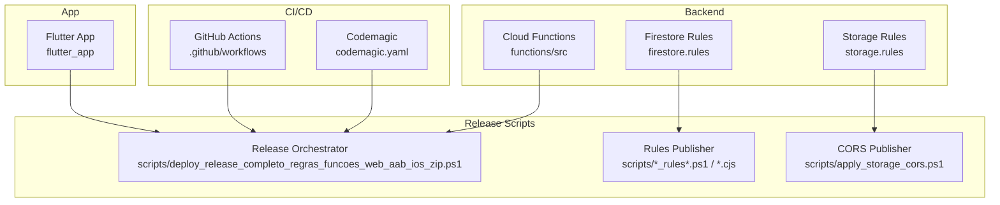

**Diagram sources**
- [firebase.json](file://firebase.json)
- [flutter_app/firebase.json](file://flutter_app/firebase.json)
- [functions/src/index.ts](file://functions/src/index.ts)
- [firestore.rules](file://firestore.rules)
- [storage.rules](file://storage.rules)
- [.github/workflows/deploy-web.yml](file:.github/workflows/deploy-web.yml)
- [codemagic.yaml](file://codemagic.yaml)
- [scripts/deploy_release_completo_regras_funcoes_web_aab_ios_zip.ps1](file://scripts/deploy_release_completo_regras_funcoes_web_aab_ios_zip.ps1)

**Section sources**
- [README_DEPLOY_PRODUCAO.md](file://README_DEPLOY_PRODUCAO.md)
- [CONTROLE_VERSAO.md](file://CONTROLE_VERSAO.md)

## Core Components
- Versioning strategy: Centralized version metadata and build numbering aligned across platforms.
- Build and signing: Android AAB generation and iOS IPA packaging with secure signing.
- Store submission: Automated or guided flows to Google Play and Apple App Store via Codemagic and Play Console.
- Firebase deployment: Hosting, Functions, Firestore rules, and Storage CORS published through CLI and scripts.
- Validation and rollback: Pre-flight checks, post-deployment probes, and rapid rollback mechanisms.

Key artifacts:
- Version definitions and alignment utilities.
- Platform build scripts and signing helpers.
- Firebase configuration files and rules.
- CI/CD pipeline definitions.
- Orchestration and helper scripts for publishing and rollback.

**Section sources**
- [flutter_app/pubspec.yaml](file://flutter_app/pubspec.yaml)
- [flutter_app/lib/app_version.dart](file://flutter_app/lib/app_version.dart)
- [scripts/build_android_play_store_aab.ps1](file://scripts/build_android_play_store_aab.ps1)
- [scripts/codemagic_publish_ipa_to_firebase.js](file://scripts/codemagic_publish_ipa_to_firebase.js)
- [firebase.json](file://firebase.json)
- [flutter_app/firebase.json](file://flutter_app/firebase.json)
- [firestore.rules](file://firestore.rules)
- [storage.rules](file://storage.rules)

## Architecture Overview
The release architecture integrates development, CI/CD, cloud services, and stores into a cohesive pipeline:
- Developers commit changes; CI triggers builds and tests.
- Release orchestrator coordinates multi-platform builds, signing, and store uploads.
- Firebase resources (hosting, functions, rules, storage CORS) are published atomically where possible.
- Post-deployment validation ensures correctness before promotion to production.

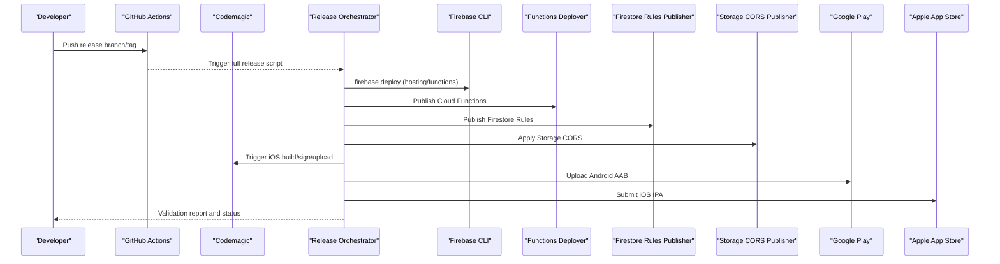

**Diagram sources**
- [.github/workflows/deploy-web.yml](file:.github/workflows/deploy-web.yml)
- [codemagic.yaml](file://codemagic.yaml)
- [scripts/deploy_release_completo_regras_funcoes_web_aab_ios_zip.ps1](file://scripts/deploy_release_completo_regras_funcoes_web_aab_ios_zip.ps1)
- [scripts/deploy_firebase_rules.ps1](file://scripts/deploy_firebase_rules.ps1)
- [scripts/apply_storage_cors.ps1](file://scripts/apply_storage_cors.ps1)
- [scripts/build_android_play_store_aab.ps1](file://scripts/build_android_play_store_aab.ps1)
- [scripts/codemagic_publish_ipa_to_firebase.js](file://scripts/codemagic_publish_ipa_to_firebase.js)

## Detailed Component Analysis

### Versioning Strategy and Branching
- Version metadata is defined centrally and consumed by Flutter and CI/CD.
- Semantic versioning is recommended; build numbers increment per artifact.
- Branching model: main for stable releases, release branches for feature stabilization, hotfix branches for urgent fixes.
- Alignment between app version, build number, and store metadata is enforced during build.

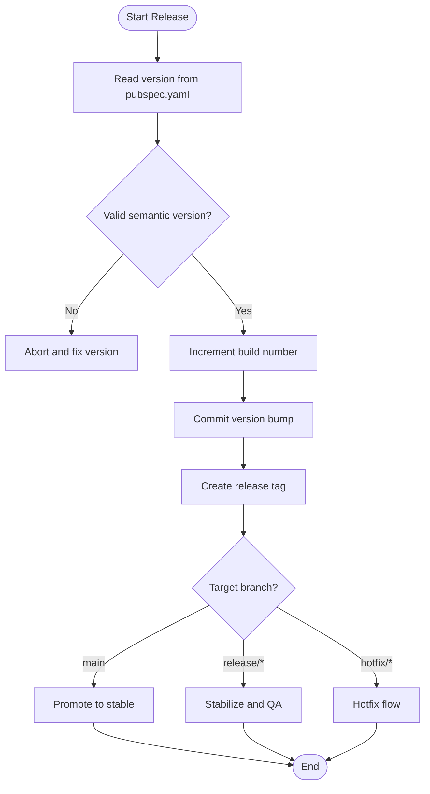

**Diagram sources**
- [flutter_app/pubspec.yaml](file://flutter_app/pubspec.yaml)
- [flutter_app/lib/app_version.dart](file://flutter_app/lib/app_version.dart)
- [CONTROLE_VERSAO.md](file://CONTROLE_VERSAO.md)

**Section sources**
- [CONTROLE_VERSAO.md](file://CONTROLE_VERSAO.md)
- [flutter_app/pubspec.yaml](file://flutter_app/pubspec.yaml)
- [flutter_app/lib/app_version.dart](file://flutter_app/lib/app_version.dart)

### Code Signing and Store Submission
- Android: Generate signed AAB using Gradle and publish to Google Play via scripts or console.
- iOS: Use Codemagic to build, sign, and upload IPA to App Store Connect; ensure provisioning profiles and certificates are configured securely.
- Security: Keep secrets in CI/CD vaults; never commit keystore or P12 files.

```mermaid
sequenceDiagram
participant Dev as "Developer"
participant CI as "CI/CD"
participant AND as "Android Build"
participant IOS as "iOS Build"
participant GP as "Google Play"
participant AS as "Apple App Store"
Dev->>CI : Trigger release build
CI->>AND : Build and sign AAB
CI->>IOS : Build and sign IPA
AND-->>CI : AAB artifact
IOS-->>CI : IPA artifact
CI->>GP : Upload AAB
CI->>AS : Upload IPA
GP-->>CI : Review status
AS-->>CI : Review status
CI-->>Dev : Submission results
```

**Diagram sources**
- [scripts/build_android_play_store_aab.ps1](file://scripts/build_android_play_store_aab.ps1)
- [scripts/codemagic_publish_ipa_to_firebase.js](file://scripts/codemagic_publish_ipa_to_firebase.js)
- [codemagic.yaml](file://codemagic.yaml)

**Section sources**
- [scripts/build_android_play_store_aab.ps1](file://scripts/build_android_play_store_aab.ps1)
- [scripts/codemagic_publish_ipa_to_firebase.js](file://scripts/codemagic_publish_ipa_to_firebase.js)
- [codemagic.yaml](file://codemagic.yaml)

### Firebase Deployment and Cloud Functions Updates
- Hosting: Deploy static assets and index files via firebase.json configuration.
- Functions: Compile TypeScript sources and deploy callable/background functions.
- Rules: Publish Firestore and Storage rules ensuring least privilege and tenant isolation.
- CORS: Configure Storage CORS to allow required origins and methods.

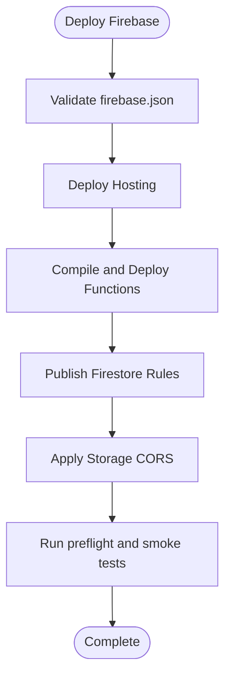

**Diagram sources**
- [firebase.json](file://firebase.json)
- [flutter_app/firebase.json](file://flutter_app/firebase.json)
- [functions/src/index.ts](file://functions/src/index.ts)
- [firestore.rules](file://firestore.rules)
- [storage.rules](file://storage.rules)
- [scripts/deploy_firebase_rules.ps1](file://scripts/deploy_firebase_rules.ps1)
- [scripts/apply_storage_cors.ps1](file://scripts/apply_storage_cors.ps1)

**Section sources**
- [firebase.json](file://firebase.json)
- [flutter_app/firebase.json](file://flutter_app/firebase.json)
- [functions/src/index.ts](file://functions/src/index.ts)
- [firestore.rules](file://firestore.rules)
- [storage.rules](file://storage.rules)
- [scripts/deploy_firebase_rules.ps1](file://scripts/deploy_firebase_rules.ps1)
- [scripts/apply_storage_cors.ps1](file://scripts/apply_storage_cors.ps1)

### Firestore Rules Publishing
- Rules are managed centrally and published via CLI or REST APIs.
- Patching allows targeted updates without full redeploy.
- Pre-flight validation reduces risk of misconfiguration.

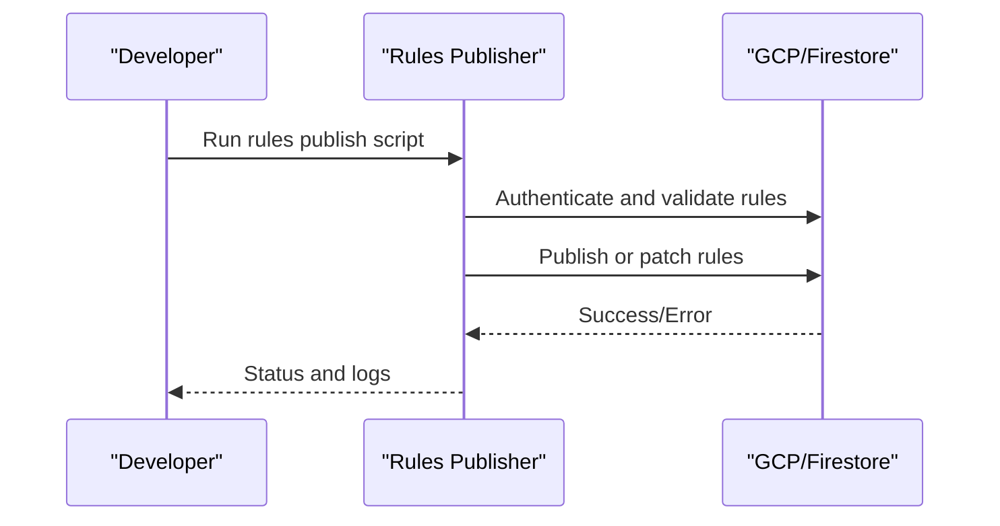

**Diagram sources**
- [scripts/deploy_firebase_rules.ps1](file://scripts/deploy_firebase_rules.ps1)
- [scripts/publish_firestore_rules_rest.cjs](file://scripts/publish_firestore_rules_rest.cjs)
- [scripts/firestore_rules_patch_release.cjs](file://scripts/firestore_rules_patch_release.cjs)
- [scripts/firebase_rules_gcp_publish.cjs](file://scripts/firebase_rules_gcp_publish.cjs)
- [scripts/ensure_google_cloud_auth.ps1](file://scripts/ensure_google_cloud_auth.ps1)

**Section sources**
- [scripts/deploy_firebase_rules.ps1](file://scripts/deploy_firebase_rules.ps1)
- [scripts/publish_firestore_rules_rest.cjs](file://scripts/publish_firestore_rules_rest.cjs)
- [scripts/firestore_rules_patch_release.cjs](file://scripts/firestore_rules_patch_release.cjs)
- [scripts/firebase_rules_gcp_publish.cjs](file://scripts/firebase_rules_gcp_publish.cjs)
- [scripts/ensure_google_cloud_auth.ps1](file://scripts/ensure_google_cloud_auth.ps1)

### Storage CORS Configuration
- CORS policies must permit necessary origins, methods, and headers for web clients.
- Scripts apply CORS JSON configuration to Firebase Storage.
- Validation ensures no over-permissive settings that could expose data.

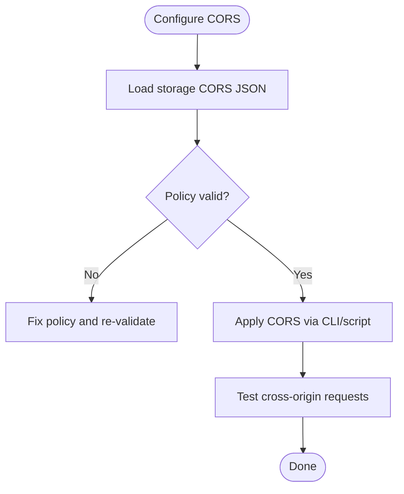

**Diagram sources**
- [flutter_app/storage_cors.json](file://flutter_app/storage_cors.json)
- [scripts/apply_storage_cors.ps1](file://scripts/apply_storage_cors.ps1)

**Section sources**
- [flutter_app/storage_cors.json](file://flutter_app/storage_cors.json)
- [scripts/apply_storage_cors.ps1](file://scripts/apply_storage_cors.ps1)

### Web Deployment via GitHub Actions
- Web builds are triggered on push or PR events.
- Hosting is deployed automatically after successful build and tests.
- Rollback can be performed by redeploying previous artifacts.

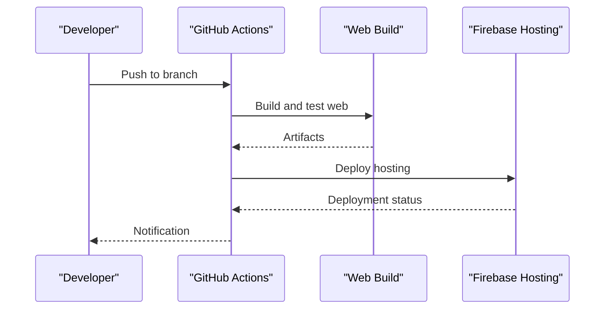

**Diagram sources**
- [.github/workflows/deploy-web.yml](file:.github/workflows/deploy-web.yml)
- [firebase.json](file://firebase.json)

**Section sources**
- [.github/workflows/deploy-web.yml](file:.github/workflows/deploy-web.yml)
- [firebase.json](file://firebase.json)

### Full Release Orchestration
- The orchestrator script coordinates all steps: versioning, builds, signing, store submissions, Firebase deployments, and validations.
- It supports selective steps (skip web, skip preflight) for flexibility.
- Outputs detailed logs and status for auditability.

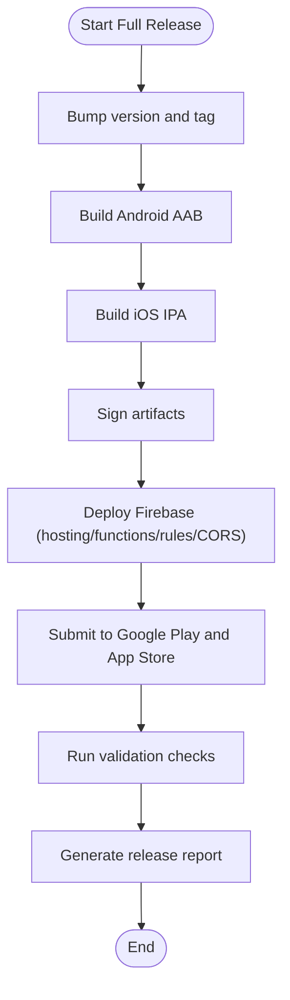

**Diagram sources**
- [scripts/deploy_release_completo_regras_funcoes_web_aab_ios_zip.ps1](file://scripts/deploy_release_completo_regras_funcoes_web_aab_ios_zip.ps1)

**Section sources**
- [scripts/deploy_release_completo_regras_funcoes_web_aab_ios_zip.ps1](file://scripts/deploy_release_completo_regras_funcoes_web_aab_ios_zip.ps1)

### Rollback Procedures
- Rolling back involves redeploying previous versions of hosting, functions, and rules.
- For apps, revert to previous store listings or use staged rollouts.
- Ensure rule patches are reversible and maintain tenant isolation.

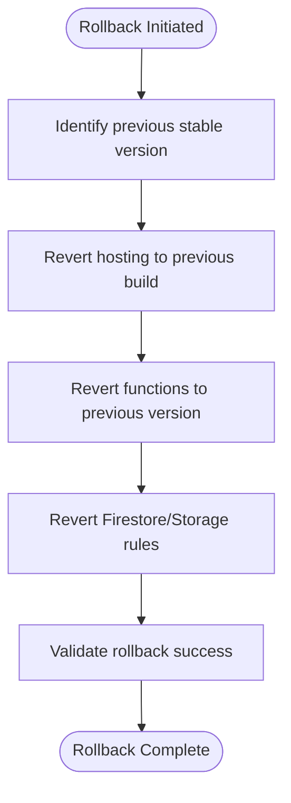

**Diagram sources**
- [scripts/_publish_force_update_online.ps1](file://scripts/_publish_force_update_online.ps1)
- [scripts/deploy_firebase_rules.ps1](file://scripts/deploy_firebase_rules.ps1)
- [scripts/apply_storage_cors.ps1](file://scripts/apply_storage_cors.ps1)

**Section sources**
- [scripts/_publish_force_update_online.ps1](file://scripts/_publish_force_update_online.ps1)
- [scripts/deploy_firebase_rules.ps1](file://scripts/deploy_firebase_rules.ps1)
- [scripts/apply_storage_cors.ps1](file://scripts/apply_storage_cors.ps1)

### Hotfix Deployment
- Hotfixes bypass normal staging to address critical issues quickly.
- Use dedicated hotfix branches and accelerated validation.
- Ensure minimal changes and thorough smoke testing before production.

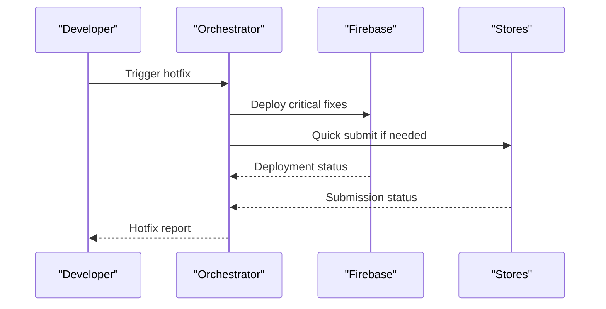

**Diagram sources**
- [scripts/deploy_release_completo_regras_funcoes_web_aab_ios_zip.ps1](file://scripts/deploy_release_completo_regras_funcoes_web_aab_ios_zip.ps1)

**Section sources**
- [scripts/deploy_release_completo_regras_funcoes_web_aab_ios_zip.ps1](file://scripts/deploy_release_completo_regras_funcoes_web_aab_ios_zip.ps1)

### Release Validation Steps
- Pre-flight checks verify environment, credentials, and configuration.
- Post-deployment smoke tests confirm functionality and access controls.
- Production checklist ensures compliance and readiness.

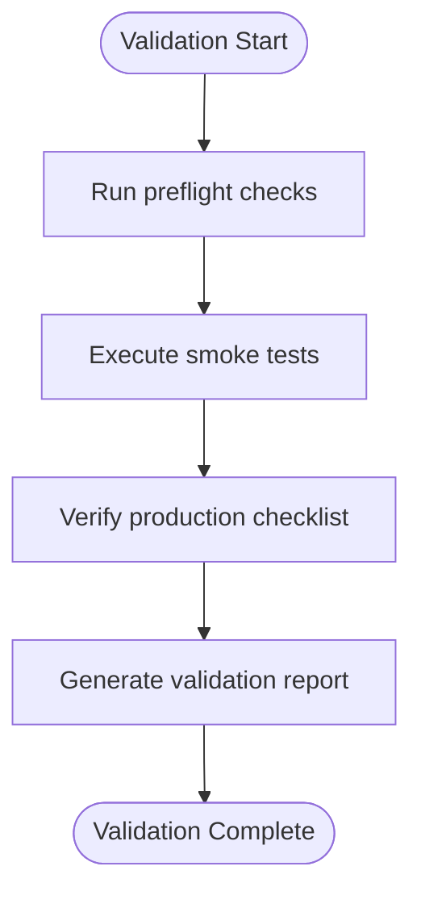

**Diagram sources**
- [scripts/verify_production_checklist.ps1](file://scripts/verify_production_checklist.ps1)

**Section sources**
- [scripts/verify_production_checklist.ps1](file://scripts/verify_production_checklist.ps1)

## Dependency Analysis
Release components depend on each other and external services:
- Flutter app depends on Firebase configuration and rules.
- Cloud Functions depend on Firestore and Storage.
- CI/CD pipelines depend on authentication and secrets management.
- Store submissions depend on signing artifacts and metadata.

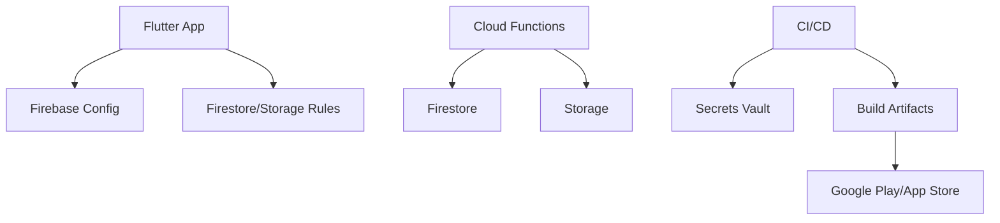

**Diagram sources**
- [firebase.json](file://firebase.json)
- [flutter_app/firebase.json](file://flutter_app/firebase.json)
- [functions/src/index.ts](file://functions/src/index.ts)
- [firestore.rules](file://firestore.rules)
- [storage.rules](file://storage.rules)
- [codemagic.yaml](file://codemagic.yaml)

**Section sources**
- [firebase.json](file://firebase.json)
- [flutter_app/firebase.json](file://flutter_app/firebase.json)
- [functions/src/index.ts](file://functions/src/index.ts)
- [firestore.rules](file://firestore.rules)
- [storage.rules](file://storage.rules)
- [codemagic.yaml](file://codemagic.yaml)

## Performance Considerations
- Optimize hosting payloads and enable caching via proper headers.
- Minimize function cold starts by appropriate sizing and concurrency settings.
- Use incremental deployments for large rule sets to reduce latency.
- Monitor storage CORS performance and avoid overly broad policies.

[No sources needed since this section provides general guidance]

## Troubleshooting Guide
Common issues and resolutions:
- Authentication failures: Ensure Google Cloud and Firebase CLI are authenticated with correct scopes.
- Rule syntax errors: Validate rules locally before publishing; use patch scripts for targeted fixes.
- CORS mismatches: Verify allowed origins, methods, and headers match client requests.
- Store submission errors: Check signing artifacts, metadata, and entitlements alignment.

**Section sources**
- [scripts/ensure_google_cloud_auth.ps1](file://scripts/ensure_google_cloud_auth.ps1)
- [scripts/deploy_firebase_rules.ps1](file://scripts/deploy_firebase_rules.ps1)
- [scripts/apply_storage_cors.ps1](file://scripts/apply_storage_cors.ps1)

## Conclusion
This release management guide consolidates versioning, building, signing, store submissions, Firebase deployments, and validation into a repeatable, secure, and auditable process. By following the documented workflows and leveraging the provided scripts and CI/CD pipelines, teams can confidently deliver high-quality releases to production while maintaining security and compliance.

[No sources needed since this section summarizes without analyzing specific files]