# Release Validation & Rollback

<cite>
**Referenced Files in This Document**
- [deploy-web.yml](file://.github/workflows/deploy-web.yml)
- [codemagic_ios_trigger.yml](file://.github/workflows/codemagic_ios_trigger.yml)
- [CHECKLIST_PRODUCAO.md](file://docs/CHECKLIST_PRODUCAO.md)
- [FIREBASE_OBSERVABILITY.md](file://docs/FIREBASE_OBSERVABILITY.md)
- [firebase.json](file://firebase.json)
- [firestore.rules](file://firestore.rules)
- [storage.rules](file://storage.rules)
- [pubspec.yaml](file://flutter_app/pubspec.yaml)
- [codemagic.yaml](file://codemagic.yaml)
- [build_android_aab.ps1](file://scripts/build_android_aab.ps1)
- [build_e_deploy_web.ps1](file://scripts/build_e_deploy_web.ps1)
- [deploy_full_gestao_yahweh.ps1](file://scripts/deploy_full_gestao_yahweh.ps1)
- [verify_production_checklist.ps1](file://scripts/verify_production_checklist.ps1)
- [publish_firestore_rules_rest.cjs](file://scripts/publish_firestore_rules_rest.cjs)
- [firestore_rules_preflight.ps1](file://scripts/firestore_rules_preflight.ps1)
- [apply_storage_cors.ps1](file://scripts/apply_storage_cors.ps1)
- [codemagic_ios_pre_publish_90189_gate.sh](file://scripts/codemagic_ios_pre_publish_90189_gate.sh)
- [codemagic_ios_validate_ipa_before_upload.sh](file://scripts/codemagic_ios_validate_ipa_before_upload.sh)
- [codemagic_ios_verify_env_apple_and_signing.sh](file://scripts/codemagic_ios_verify_env_apple_and_signing.sh)
- [codemagic_ios_upload_crashlytics_dsyms.sh](file://scripts/codemagic_ios_upload_crashlytics_dsyms.sh)
- [codemagic_publish_ipa_to_firebase.js](file://scripts/codemagic_publish_ipa_to_firebase.js)
- [CODEMAGIC_APP_STORE_INTEGRATION.txt](file://IOS/CODEMAGIC_APP_STORE_INTEGRATION.txt)
- [CODEMAGIC_INVALID_BINARY.md](file://IOS/CODEMAGIC_INVALID_BINARY.md)
- [CODEMAGIC_SIGNING_FIX.md](file://IOS/CODEMAGIC_SIGNING_FIX.md)
- [README_DEPLOY_PRODUCAO.md](file://README_DEPLOY_PRODUCAO.md)
</cite>

## Table of Contents
1. [Introduction](#introduction)
2. [Project Structure](#project-structure)
3. [Core Components](#core-components)
4. [Architecture Overview](#architecture-overview)
5. [Detailed Component Analysis](#detailed-component-analysis)
6. [Dependency Analysis](#dependency-analysis)
7. [Performance Considerations](#performance-considerations)
8. [Troubleshooting Guide](#troubleshooting-guide)
9. [Conclusion](#conclusion)
10. [Appendices](#appendices)

## Introduction
This document defines the release validation procedures and rollback strategies for the project, covering production checklist verification, automated testing pipelines, quality gates, hotfix deployment, emergency releases, data migration rollbacks, monitoring and alerting, error tracking integration, performance validation, post-release verification, user feedback collection, and incident response. It consolidates existing scripts, CI workflows, and documentation to provide a clear, repeatable process for safe releases and rapid recovery.

## Project Structure
The repository includes:
- GitHub Actions workflows for web deployment and iOS trigger coordination
- Flutter app configuration and platform-specific build settings
- Firebase hosting, rules, and storage configuration
- Extensive PowerShell and shell scripts for building, validating, publishing, and verifying releases
- Documentation for observability, checklists, and known issues

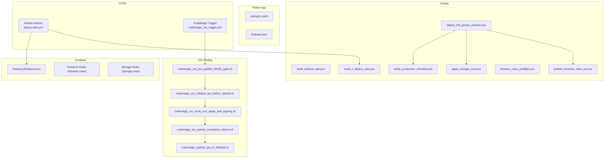

**Diagram sources**
- [deploy-web.yml](file://.github/workflows/deploy-web.yml)
- [codemagic_ios_trigger.yml](file://.github/workflows/codemagic_ios_trigger.yml)
- [firebase.json](file://firebase.json)
- [firestore.rules](file://firestore.rules)
- [storage.rules](file://storage.rules)
- [pubspec.yaml](file://flutter_app/pubspec.yaml)
- [build_android_aab.ps1](file://scripts/build_android_aab.ps1)
- [build_e_deploy_web.ps1](file://scripts/build_e_deploy_web.ps1)
- [deploy_full_gestao_yahweh.ps1](file://scripts/deploy_full_gestao_yahweh.ps1)
- [verify_production_checklist.ps1](file://scripts/verify_production_checklist.ps1)
- [publish_firestore_rules_rest.cjs](file://scripts/publish_firestore_rules_rest.cjs)
- [firestore_rules_preflight.ps1](file://scripts/firestore_rules_preflight.ps1)
- [apply_storage_cors.ps1](file://scripts/apply_storage_cors.ps1)
- [codemagic_ios_pre_publish_90189_gate.sh](file://scripts/codemagic_ios_pre_publish_90189_gate.sh)
- [codemagic_ios_validate_ipa_before_upload.sh](file://scripts/codemagic_ios_validate_ipa_before_upload.sh)
- [codemagic_ios_verify_env_apple_and_signing.sh](file://scripts/codemagic_ios_verify_env_apple_and_signing.sh)
- [codemagic_ios_upload_crashlytics_dsyms.sh](file://scripts/codemagic_ios_upload_crashlytics_dsyms.sh)
- [codemagic_publish_ipa_to_firebase.js](file://scripts/codemagic_publish_ipa_to_firebase.js)

**Section sources**
- [deploy-web.yml](file://.github/workflows/deploy-web.yml)
- [codemagic_ios_trigger.yml](file://.github/workflows/codemagic_ios_trigger.yml)
- [firebase.json](file://firebase.json)
- [firestore.rules](file://firestore.rules)
- [storage.rules](file://storage.rules)
- [pubspec.yaml](file://flutter_app/pubspec.yaml)

## Core Components
- Production Checklist Verification: A dedicated script validates environment readiness and critical preconditions before release.
- Automated Testing Pipelines: GitHub Actions for web deployment; CodeMagic-triggered iOS pipeline with pre-publish gates and IPA validation.
- Quality Gates: Pre-publish gate checks, IPA validation, signing verification, Crashlytics symbol upload, and Firestore rule preflight.
- Hotfix Deployment: Targeted scripts to rebuild and redeploy specific components quickly.
- Emergency Release Workflow: Full deployment orchestrator that publishes rules, applies CORS, and runs verification.
- Data Migration Rollbacks: Scripts and patterns for reversing Firestore and Storage changes using backup references and targeted patches.
- Monitoring and Alerting: Firebase Observability guidance and Crashlytics integration via symbol upload.
- Performance Validation: Build-time options and hosting configurations to ensure optimal delivery.
- Post-release Verification: Automated checklist verification and manual steps documented in guides.
- User Feedback Collection: Integrated through Firebase services and app-level mechanisms.
- Incident Response: Defined triggers and rollback paths to restore stability rapidly.

**Section sources**
- [verify_production_checklist.ps1](file://scripts/verify_production_checklist.ps1)
- [deploy-web.yml](file://.github/workflows/deploy-web.yml)
- [codemagic_ios_trigger.yml](file://.github/workflows/codemagic_ios_trigger.yml)
- [codemagic_ios_pre_publish_90189_gate.sh](file://scripts/codemagic_ios_pre_publish_90189_gate.sh)
- [codemagic_ios_validate_ipa_before_upload.sh](file://scripts/codemagic_ios_validate_ipa_before_upload.sh)
- [codemagic_ios_verify_env_apple_and_signing.sh](file://scripts/codemagic_ios_verify_env_apple_and_signing.sh)
- [codemagic_ios_upload_crashlytics_dsyms.sh](file://scripts/codemagic_ios_upload_crashlytics_dsyms.sh)
- [publish_firestore_rules_rest.cjs](file://scripts/publish_firestore_rules_rest.cjs)
- [firestore_rules_preflight.ps1](file://scripts/firestore_rules_preflight.ps1)
- [apply_storage_cors.ps1](file://scripts/apply_storage_cors.ps1)
- [FIREBASE_OBSERVABILITY.md](file://docs/FIREBASE_OBSERVABILITY.md)

## Architecture Overview
The release architecture integrates CI/CD, build tooling, and Firebase services to enforce quality and enable fast rollbacks.

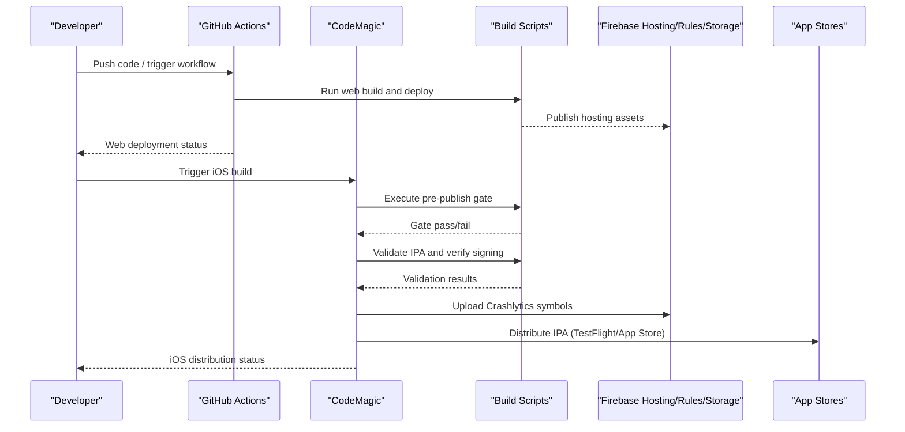

**Diagram sources**
- [deploy-web.yml](file://.github/workflows/deploy-web.yml)
- [codemagic_ios_trigger.yml](file://.github/workflows/codemagic_ios_trigger.yml)
- [build_e_deploy_web.ps1](file://scripts/build_e_deploy_web.ps1)
- [codemagic_ios_pre_publish_90189_gate.sh](file://scripts/codemagic_ios_pre_publish_90189_gate.sh)
- [codemagic_ios_validate_ipa_before_upload.sh](file://scripts/codemagic_ios_validate_ipa_before_upload.sh)
- [codemagic_ios_verify_env_apple_and_signing.sh](file://scripts/codemagic_ios_verify_env_apple_and_signing.sh)
- [codemagic_ios_upload_crashlytics_dsyms.sh](file://scripts/codemagic_ios_upload_crashlytics_dsyms.sh)
- [codemagic_publish_ipa_to_firebase.js](file://scripts/codemagic_publish_ipa_to_firebase.js)

## Detailed Component Analysis

### Production Checklist Verification
- Purpose: Ensure environment variables, tools, and prerequisites are ready before releasing.
- Execution: The verification script performs checks across Flutter, Firebase, and platform-specific requirements.
- Integration: Can be invoked by full deployment or standalone QA processes.

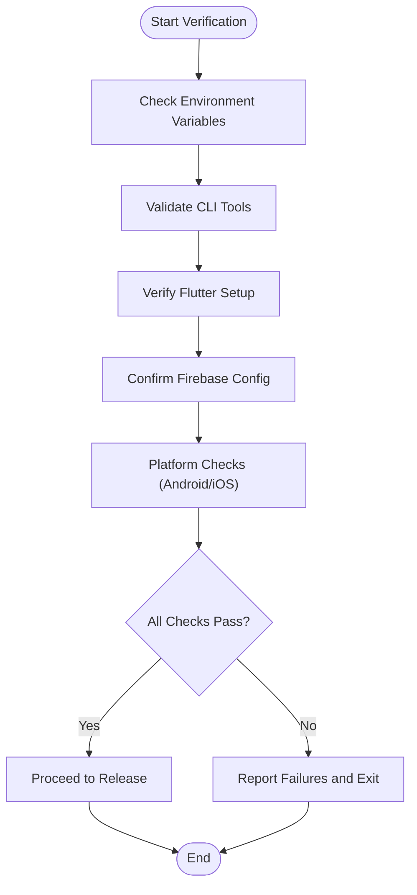

**Diagram sources**
- [verify_production_checklist.ps1](file://scripts/verify_production_checklist.ps1)

**Section sources**
- [verify_production_checklist.ps1](file://scripts/verify_production_checklist.ps1)
- [CHECKLIST_PRODUCAO.md](file://docs/CHECKLIST_PRODUCAO.md)

### Automated Testing Pipelines
- Web Pipeline: GitHub Actions builds and deploys Flutter web to Firebase Hosting.
- iOS Pipeline: CodeMagic trigger coordinates pre-publish gates, IPA validation, signing verification, and Crashlytics symbol upload.

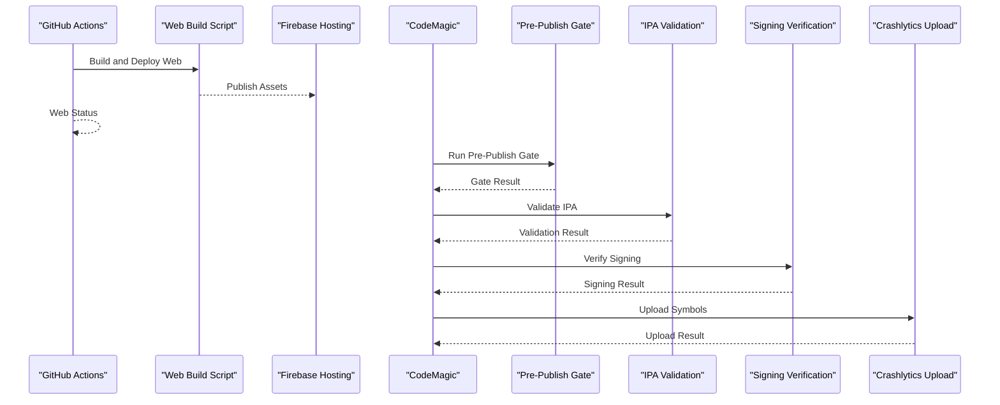

**Diagram sources**
- [deploy-web.yml](file://.github/workflows/deploy-web.yml)
- [build_e_deploy_web.ps1](file://scripts/build_e_deploy_web.ps1)
- [codemagic_ios_trigger.yml](file://.github/workflows/codemagic_ios_trigger.yml)
- [codemagic_ios_pre_publish_90189_gate.sh](file://scripts/codemagic_ios_pre_publish_90189_gate.sh)
- [codemagic_ios_validate_ipa_before_upload.sh](file://scripts/codemagic_ios_validate_ipa_before_upload.sh)
- [codemagic_ios_verify_env_apple_and_signing.sh](file://scripts/codemagic_ios_verify_env_apple_and_signing.sh)
- [codemagic_ios_upload_crashlytics_dsyms.sh](file://scripts/codemagic_ios_upload_crashlytics_dsyms.sh)

**Section sources**
- [deploy-web.yml](file://.github/workflows/deploy-web.yml)
- [build_e_deploy_web.ps1](file://scripts/build_e_deploy_web.ps1)
- [codemagic_ios_trigger.yml](file://.github/workflows/codemagic_ios_trigger.yml)

### Quality Gates
- Pre-Publish Gate: Validates build artifacts and environment constraints before distribution.
- IPA Validation: Ensures IPA integrity and compliance prior to upload.
- Signing Verification: Confirms correct provisioning profiles and certificates.
- Crashlytics Symbol Upload: Guarantees meaningful crash reports.
- Firestore Rule Preflight: Tests rules against expected behavior before publishing.

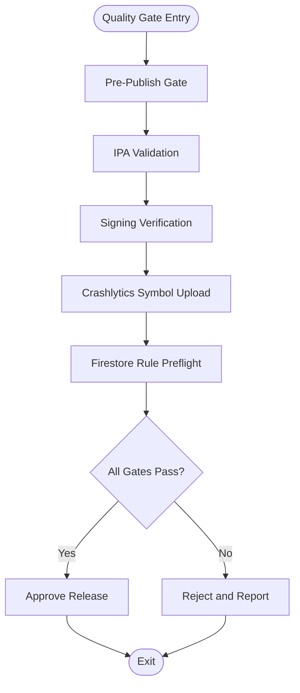

**Diagram sources**
- [codemagic_ios_pre_publish_90189_gate.sh](file://scripts/codemagic_ios_pre_publish_90189_gate.sh)
- [codemagic_ios_validate_ipa_before_upload.sh](file://scripts/codemagic_ios_validate_ipa_before_upload.sh)
- [codemagic_ios_verify_env_apple_and_signing.sh](file://scripts/codemagic_ios_verify_env_apple_and_signing.sh)
- [codemagic_ios_upload_crashlytics_dsyms.sh](file://scripts/codemagic_ios_upload_crashlytics_dsyms.sh)
- [firestore_rules_preflight.ps1](file://scripts/firestore_rules_preflight.ps1)

**Section sources**
- [codemagic_ios_pre_publish_90189_gate.sh](file://scripts/codemagic_ios_pre_publish_90189_gate.sh)
- [codemagic_ios_validate_ipa_before_upload.sh](file://scripts/codemagic_ios_validate_ipa_before_upload.sh)
- [codemagic_ios_verify_env_apple_and_signing.sh](file://scripts/codemagic_ios_verify_env_apple_and_signing.sh)
- [codemagic_ios_upload_crashlytics_dsyms.sh](file://scripts/codemagic_ios_upload_crashlytics_dsyms.sh)
- [firestore_rules_preflight.ps1](file://scripts/firestore_rules_preflight.ps1)

### Hotfix Deployment Procedures
- Scope: Targeted fixes for critical issues without full release overhead.
- Steps:
  - Identify affected component (web, functions, rules, or mobile).
  - Rebuild only necessary artifacts using specialized scripts.
  - Deploy to production with minimal blast radius.
  - Verify immediately using production checklist and monitoring.

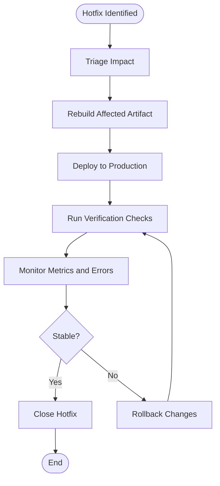

[No sources needed since this diagram shows conceptual workflow, not actual code structure]

### Emergency Release Workflow
- Orchestrator: Full deployment script publishes Firestore rules, applies Storage CORS, and executes verification.
- Safety: Preflight checks and immediate post-deployment verification reduce risk.

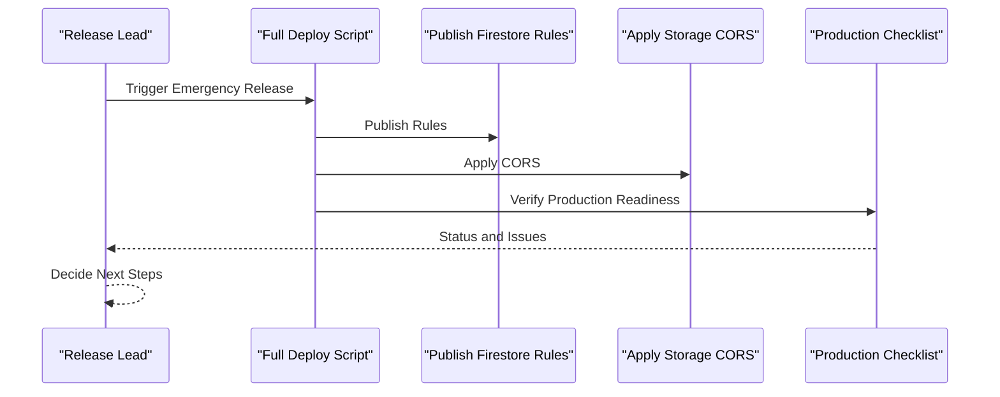

**Diagram sources**
- [deploy_full_gestao_yahweh.ps1](file://scripts/deploy_full_gestao_yahweh.ps1)
- [publish_firestore_rules_rest.cjs](file://scripts/publish_firestore_rules_rest.cjs)
- [apply_storage_cors.ps1](file://scripts/apply_storage_cors.ps1)
- [verify_production_checklist.ps1](file://scripts/verify_production_checklist.ps1)

**Section sources**
- [deploy_full_gestao_yahweh.ps1](file://scripts/deploy_full_gestao_yahweh.ps1)
- [publish_firestore_rules_rest.cjs](file://scripts/publish_firestore_rules_rest.cjs)
- [apply_storage_cors.ps1](file://scripts/apply_storage_cors.ps1)
- [verify_production_checklist.ps1](file://scripts/verify_production_checklist.ps1)

### Data Migration Rollbacks
- Strategy: Maintain backups and versioned rules; use targeted scripts to revert changes safely.
- Firestore: Use rule preflight and publish scripts to revert to previous versions.
- Storage: Reapply CORS policies and validate access patterns after rollback.

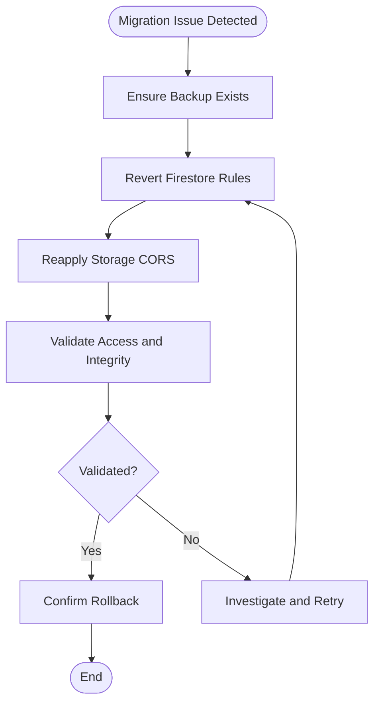

[No sources needed since this diagram shows conceptual workflow, not actual code structure]

### Monitoring and Alerting Setup
- Observability: Follow Firebase Observability guidance to configure logging, metrics, and alerts.
- Error Tracking: Integrate Crashlytics via symbol upload during iOS builds.
- Hosting: Use Firebase Hosting for reliable delivery and performance insights.

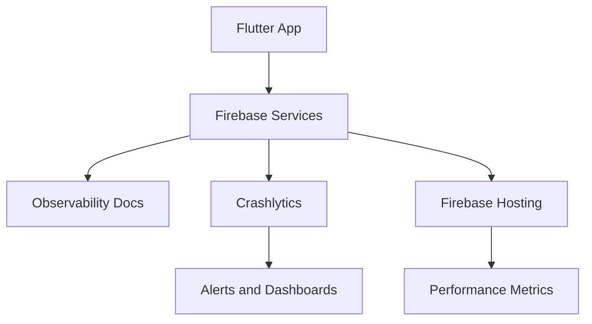

**Diagram sources**
- [FIREBASE_OBSERVABILITY.md](file://docs/FIREBASE_OBSERVABILITY.md)
- [codemagic_ios_upload_crashlytics_dsyms.sh](file://scripts/codemagic_ios_upload_crashlytics_dsyms.sh)
- [firebase.json](file://firebase.json)

**Section sources**
- [FIREBASE_OBSERVABILITY.md](file://docs/FIREBASE_OBSERVABILITY.md)
- [codemagic_ios_upload_crashlytics_dsyms.sh](file://scripts/codemagic_ios_upload_crashlytics_dsyms.sh)
- [firebase.json](file://firebase.json)

### Performance Validation Steps
- Build Options: Use Flutter build flags to optimize output size and runtime performance.
- Hosting Configuration: Configure caching and compression via firebase.json.
- Validation: Monitor load times and resource usage post-deployment.

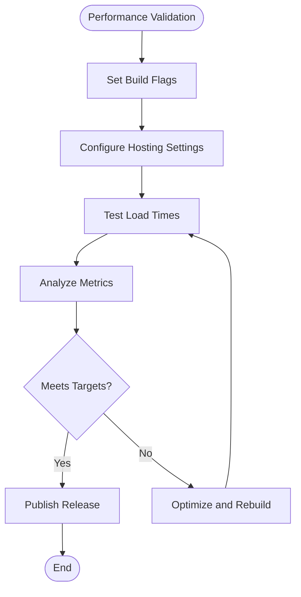

[No sources needed since this diagram shows conceptual workflow, not actual code structure]

### Post-Release Verification
- Automated: Run production checklist to confirm environment and service health.
- Manual: Validate key user flows and features in production.
- Feedback: Collect user feedback through integrated channels.

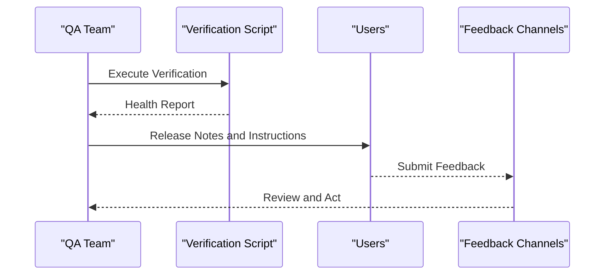

**Diagram sources**
- [verify_production_checklist.ps1](file://scripts/verify_production_checklist.ps1)

**Section sources**
- [verify_production_checklist.ps1](file://scripts/verify_production_checklist.ps1)

### User Feedback Collection
- Channels: In-app feedback forms, email, and support tickets.
- Integration: Route feedback to issue trackers and dashboards for triage.
- Action: Prioritize and address high-impact issues promptly.

[No sources needed since this section doesn't analyze specific files]

### Incident Response Procedures
- Detection: Use monitoring and alerts to detect anomalies.
- Triage: Assess impact and scope quickly.
- Mitigation: Apply hotfix or rollback based on severity.
- Communication: Notify stakeholders and users about status and resolution.

[No sources needed since this section doesn't analyze specific files]

## Dependency Analysis
Key dependencies include CI/CD workflows, build scripts, and Firebase services.

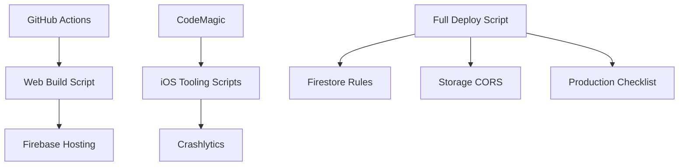

**Diagram sources**
- [deploy-web.yml](file://.github/workflows/deploy-web.yml)
- [codemagic_ios_trigger.yml](file://.github/workflows/codemagic_ios_trigger.yml)
- [build_e_deploy_web.ps1](file://scripts/build_e_deploy_web.ps1)
- [codemagic_ios_pre_publish_90189_gate.sh](file://scripts/codemagic_ios_pre_publish_90189_gate.sh)
- [deploy_full_gestao_yahweh.ps1](file://scripts/deploy_full_gestao_yahweh.ps1)
- [publish_firestore_rules_rest.cjs](file://scripts/publish_firestore_rules_rest.cjs)
- [apply_storage_cors.ps1](file://scripts/apply_storage_cors.ps1)
- [verify_production_checklist.ps1](file://scripts/verify_production_checklist.ps1)

**Section sources**
- [deploy-web.yml](file://.github/workflows/deploy-web.yml)
- [codemagic_ios_trigger.yml](file://.github/workflows/codemagic_ios_trigger.yml)
- [build_e_deploy_web.ps1](file://scripts/build_e_deploy_web.ps1)
- [codemagic_ios_pre_publish_90189_gate.sh](file://scripts/codemagic_ios_pre_publish_90189_gate.sh)
- [deploy_full_gestao_yahweh.ps1](file://scripts/deploy_full_gestao_yahweh.ps1)
- [publish_firestore_rules_rest.cjs](file://scripts/publish_firestore_rules_rest.cjs)
- [apply_storage_cors.ps1](file://scripts/apply_storage_cors.ps1)
- [verify_production_checklist.ps1](file://scripts/verify_production_checklist.ps1)

## Performance Considerations
- Optimize Flutter builds with appropriate flags to reduce payload size.
- Configure Firebase Hosting for efficient caching and compression.
- Monitor performance metrics post-deployment to identify regressions early.

[No sources needed since this section provides general guidance]

## Troubleshooting Guide
- Common Issues:
  - Invalid IPA: Use IPA validation script to diagnose and fix packaging issues.
  - Signing Problems: Verify environment and signing configuration with signing verification script.
  - Rule Failures: Run Firestore rule preflight to catch policy errors before publishing.
  - CORS Misconfiguration: Reapply Storage CORS and validate access patterns.
- Recovery Steps:
  - Rebuild artifacts with corrected configurations.
  - Redeploy using full deployment script with verification.
  - Roll back rules and CORS if necessary.

**Section sources**
- [codemagic_ios_validate_ipa_before_upload.sh](file://scripts/codemagic_ios_validate_ipa_before_upload.sh)
- [codemagic_ios_verify_env_apple_and_signing.sh](file://scripts/codemagic_ios_verify_env_apple_and_signing.sh)
- [firestore_rules_preflight.ps1](file://scripts/firestore_rules_preflight.ps1)
- [apply_storage_cors.ps1](file://scripts/apply_storage_cors.ps1)
- [CODEMAGIC_INVALID_BINARY.md](file://IOS/CODEMAGIC_INVALID_BINARY.md)
- [CODEMAGIC_SIGNING_FIX.md](file://IOS/CODEMAGIC_SIGNING_FIX.md)

## Conclusion
This release validation and rollback framework ensures safe deployments through rigorous checks, automated pipelines, and robust rollback strategies. By leveraging existing scripts and documentation, teams can maintain high reliability and respond swiftly to incidents while keeping users informed and satisfied.

[No sources needed since this section summarizes without analyzing specific files]

## Appendices

### Templates for Release Notes
- Version: [Version Number]
- Date: [Release Date]
- Summary: [Brief Description]
- Changes: [List of Features, Fixes, Improvements]
- Known Issues: [Any Limitations]
- Rollback Plan: [Steps to Revert if Needed]

[No sources needed since this section provides general guidance]

### Change Log Template
- [Date] - [Version]: [Change Description]

[No sources needed since this section provides general guidance]

### Stakeholder Communication Template
- Subject: [Release Announcement]
- Audience: [Stakeholders/Users]
- Content: [Summary of Changes, Impact, Rollback Plan, Support Contact]

[No sources needed since this section provides general guidance]