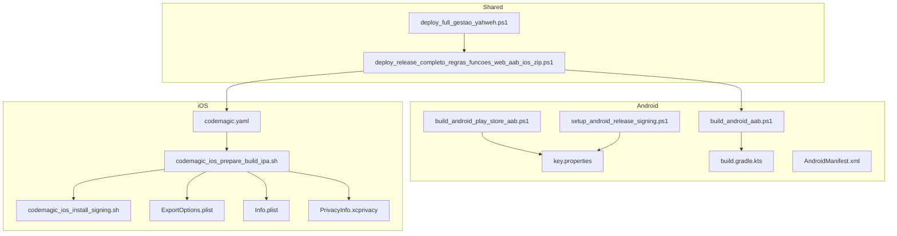
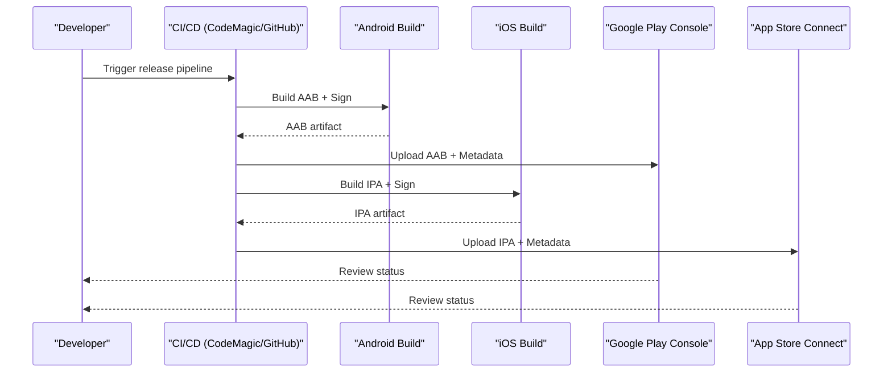
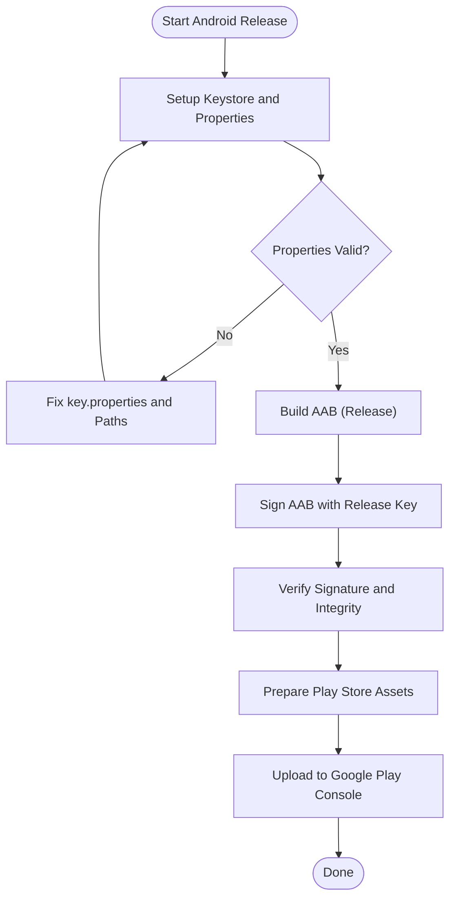
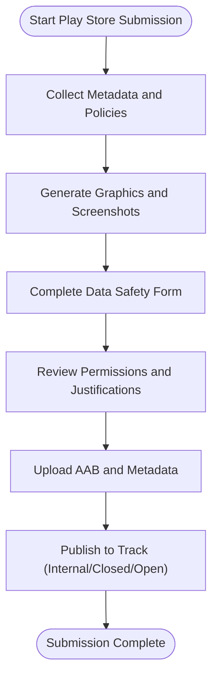
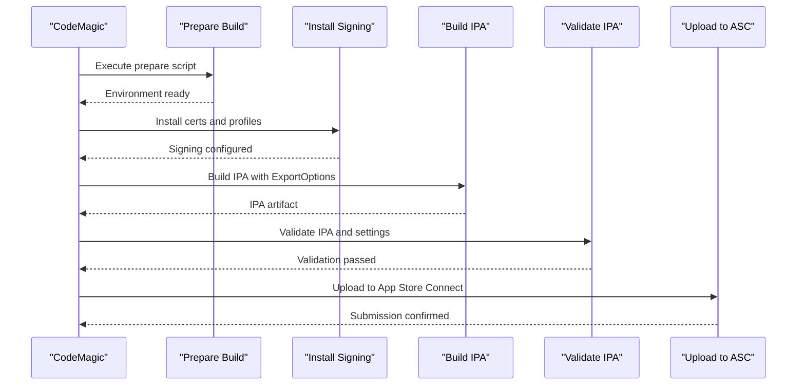
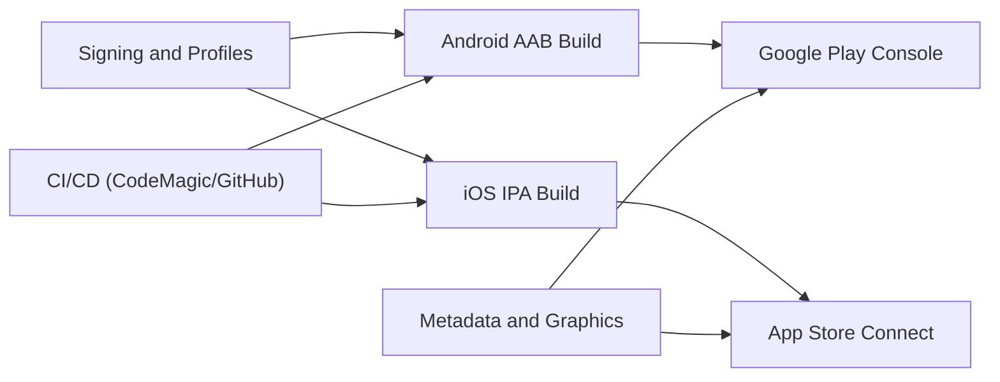

# Store Submission & App Distribution

<cite>
**Referenced Files in This Document**
- [build_android_aab.ps1](file://scripts/build_android_aab.ps1)
- [build_android_play_store_aab.ps1](file://scripts/build_android_play_store_aab.ps1)
- [setup_android_release_signing.ps1](file://scripts/setup_android_release_signing.ps1)
- [print_keystore_fingerprints.ps1](file://scripts/print_keystore_fingerprints.ps1)
- [key.properties](file://flutter_app/android/key.properties)
- [key.properties.example](file://flutter_app/android/key.properties.example)
- [build.gradle.kts](file://flutter_app/android/app/build.gradle.kts)
- [AndroidManifest.xml](file://flutter_app/android/app/src/main/AndroidManifest.xml)
- [play_store_data_safety_preflight.ps1](file://scripts/play_store_data_safety_preflight.ps1)
- [generate_play_store_graphics.py](file://flutter_app/tool/generate_play_store_graphics.dart)
- [README_PLAY_FOTOS_VIDEOS.md](file://ANDROID/README_PLAY_FOTOS_VIDEOS.md)
- [codemagic.yaml](file://codemagic.yaml)
- [codemagic_ios_trigger.yml](file://.github/workflows/codemagic_ios_trigger.yml)
- [CODEMAGIC_90189.md](file://IOS/CODEMAGIC_90189.md)
- [CODEMAGIC_APP_STORE_INTEGRATION.txt](file://IOS/CODEMAGIC_APP_STORE_INTEGRATION.txt)
- [CODEMAGIC_INVALID_BINARY.md](file://IOS/CODEMAGIC_INVALID_BINARY.md)
- [CODEMAGIC_SIGNING_FIX.md](file://IOS/CODEMAGIC_SIGNING_FIX.md)
- [CREDENCIAIS_APPLE_ATUAL.txt](file://IOS/CREDENCIAIS_APPLE_ATUAL.txt)
- [app_store_connect_issuer_id.txt](file://IOS/app_store_connect_issuer_id.txt)
- [prepare_codemagic_paste_from_bootstrap.ps1](file://IOS/prepare_codemagic_paste_from_bootstrap.ps1)
- [ExportOptions.plist](file://flutter_app/ios/ExportOptions.plist)
- [Info.plist](file://flutter_app/ios/Runner/Info.plist)
- [PrivacyInfo.xcprivacy](file://flutter_app/ios/Runner/PrivacyInfo.xcprivacy)
- [build_ios_ipa_macos.sh](file://scripts/build_ios_ipa_macos.sh)
- [gerar_screenshots_app_store.ps1](file://scripts/gerar_screenshots_app_store.ps1)
- [gerar_appstore_iphone_6_5.ps1](file://scripts/gerar_appstore_iphone_6_5.ps1)
- [gerar_appstore_ipad_13.ps1](file://scripts/gerar_appstore_ipad_13.ps1)
- [codemagic_ios_prepare_build_ipa.sh](file://scripts/codemagic_ios_prepare_build_ipa.sh)
- [codemagic_ios_validate_export_options.py](file://scripts/codemagic_ios_validate_export_options.py)
- [codemagic_ios_install_signing.sh](file://scripts/codemagic_ios_install_signing.sh)
- [codemagic_ios_upload_crashlytics_dsyms.sh](file://scripts/codemagic_ios_upload_crashlytics_dsyms.sh)
- [codemagic_ios_asc_latest_build_number.sh](file://scripts/codemagic_ios_asc_latest_build_number.sh)
- [codemagic_ios_normalize_ipa_for_asc.sh](file://scripts/codemagic_ios_normalize_ipa_for_asc.sh)
- [codemagic_ios_verify_env_apple_and_signing.sh](file://scripts/codemagic_ios_verify_env_apple_and_signing.sh)
- [codemagic_ios_write_export_options.py](file://scripts/codemagic_ios_write_export_options.py)
- [codemagic_ios_enable_push_notifications.py](file://scripts/codemagic_ios_enable_push_notifications.py)
- [codemagic_ios_enable_sign_in_with_apple.py](file://scripts/codemagic_ios_enable_sign_in_with_apple.py)
- [codemagic_ios_enable_app_groups.py](file://scripts/codemagic_ios_enable_app_groups.py)
- [codemagic_ios_fetch_profile_matching_p12.sh](file://scripts/codemagic_ios_fetch_profile_matching_p12.sh)
- [codemagic_ios_remove_old_appstore_profiles.sh](file://scripts/codemagic_ios_remove_old_appstore_profiles.sh)
- [codemagic_ios_stamp_asc_floor.sh](file://scripts/codemagic_ios_stamp_asc_floor.sh)
- [codemagic_ios_read_asc_floor.sh](file://scripts/codemagic_ios_read_asc_floor.sh)
- [codemagic_ios_bump_pods_deployment_to_14.sh](file://scripts/codemagic_ios_bump_pods_deployment_to_14.sh)
- [codemagic_ios_bump_pods_deployment_to_15.sh](file://scripts/codemagic_ios_bump_pods_deployment_to_15.sh)
- [codemagic_ios_cp_ipa_safe.sh](file://scripts/codemagic_ios_cp_ipa_safe.sh)
- [codemagic_ios_pre_publish_90189_gate.sh](file://scripts/codemagic_ios_pre_publish_90189_gate.sh)
- [codemagic_ios_sync_version_from_app_version_dart.sh](file://scripts/codemagic_ios_sync_version_from_app_version_dart.sh)
- [codemagic_ios_team_signing_prepare_exportoptions.sh](file://scripts/codemagic_ios_team_signing_prepare_exportoptions.sh)
- [codemagic_ios_validate_ipa_before_upload.sh](file://scripts/codemagic_ios_validate_ipa_before_upload.sh)
- [codemagic_ios_verify_widget_profile.py](file://scripts/codemagic_ios_verify_widget_profile.py)
- [codemagic_ios_ensure_widget_appstore_profile.py](file://scripts/codemagic_ios_ensure_widget_appstore_profile.py)
- [codemagic_ios_register_app_groups_via_xcode.sh](file://scripts/codemagic_ios_register_app_groups_via_xcode.sh)
- [codemagic_ios_install_p12_profile_exportoptions.sh](file://scripts/codemagic_ios_install_p12_profile_exportoptions.sh)
- [codemagic_ios_p12_password_helpers.sh](file://scripts/codemagic_ios_p12_password_helpers.sh)
- [codemagic_ios_verify_profile_matches_p12.sh](file://scripts/codemagic_ios_verify_profile_matches_p12.sh)
- [codemagic_ios_ensure_deployment_target_15.sh](file://scripts/codemagic_ios_ensure_deployment_target_15.sh)
- [codemagic_ios_prepare_api_pem.sh](file://scripts/codemagic_ios_prepare_api_pem.sh)
- [codemagic_ios_delete_appstore_profiles.py](file://scripts/codemagic_ios_delete_appstore_profiles.py)
- [codemagic_ios_profile_utils.py](file://scripts/codemagic_ios_profile_utils.py)
- [codemagic_ios_align_push_entitlements.py](file://scripts/codemagic_ios_align_push_entitlements.py)
- [codemagic_ios_align_app_group_entitlements.py](file://scripts/codemagic_ios_align_app_group_entitlements.py)
- [codemagic_publish_ipa_to_firebase.js](file://scripts/codemagic_publish_ipa_to_firebase.js)
- [deploy_release_completo_regras_funcoes_web_aab_ios_zip.ps1](file://scripts/deploy_release_completo_regras_funcoes_web_aab_ios_zip.ps1)
- [deploy_full_gestao_yahweh.ps1](file://scripts/deploy_full_gestao_yahweh.ps1)
- [README_DEPLOY_PRODUCAO.md](file://README_DEPLOY_PRODUCAO.md)
</cite>

## Table of Contents
1. Introduction
2. Project Structure
3. Core Components
4. Architecture Overview
5. Detailed Component Analysis
6. Dependency Analysis
7. Performance Considerations
8. Troubleshooting Guide
9. Conclusion

## Introduction
This document provides a comprehensive guide to submitting and distributing the mobile app on Google Play Store (Android) and Apple App Store (iOS). It covers Android AAB building and signing, Google Play submission and metadata, iOS IPA generation with CodeMagic integration, App Store Connect setup, Apple review requirements, graphics and screenshots generation, data safety forms, privacy policies, permissions justification, compliance requirements, and troubleshooting for common rejections and resubmission procedures.

## Project Structure
The repository includes dedicated scripts and configuration files for both platforms:
- Android: Gradle-based build with signing properties and Play Store utilities
- iOS: CodeMagic orchestration, signing helpers, export options, and App Store Connect automation
- Shared: Deployment orchestrators and documentation

**Diagram sources**
- [build_android_aab.ps1](file://scripts/build_android_aab.ps1)
- [build_android_play_store_aab.ps1](file://scripts/build_android_play_store_aab.ps1)
- [setup_android_release_signing.ps1](file://scripts/setup_android_release_signing.ps1)
- [key.properties](file://flutter_app/android/key.properties)
- [build.gradle.kts](file://flutter_app/android/app/build.gradle.kts)
- [AndroidManifest.xml](file://flutter_app/android/app/src/main/AndroidManifest.xml)
- [codemagic.yaml](file://codemagic.yaml)
- [codemagic_ios_prepare_build_ipa.sh](file://scripts/codemagic_ios_prepare_build_ipa.sh)
- [codemagic_ios_install_signing.sh](file://scripts/codemagic_ios_install_signing.sh)
- [ExportOptions.plist](file://flutter_app/ios/ExportOptions.plist)
- [Info.plist](file://flutter_app/ios/Runner/Info.plist)
- [PrivacyInfo.xcprivacy](file://flutter_app/ios/Runner/PrivacyInfo.xcprivacy)
- [deploy_release_completo_regras_funcoes_web_aab_ios_zip.ps1](file://scripts/deploy_release_completo_regras_funcoes_web_aab_ios_zip.ps1)
- [deploy_full_gestao_yahweh.ps1](file://scripts/deploy_full_gestao_yahweh.ps1)

**Section sources**
- [README_DEPLOY_PRODUCAO.md](file://README_DEPLOY_PRODUCAO.md)

## Core Components
- Android AAB Build Pipeline: Scripts to build release AAB, configure signing, and prepare assets for Google Play.
- iOS IPA Build Pipeline: CodeMagic workflow and helper scripts to sign, export, validate, and upload IPA.
- Store Metadata and Graphics: Tools to generate Play Store graphics and screenshots; documentation for required media.
- Data Safety and Privacy: Pre-flight checks and templates for Google Play Data Safety form; iOS privacy manifest and permission justifications.
- Compliance and Review: Checklists and guidance for platform-specific requirements.

**Section sources**
- [build_android_aab.ps1](file://scripts/build_android_aab.ps1)
- [build_android_play_store_aab.ps1](file://scripts/build_android_play_store_aab.ps1)
- [setup_android_release_signing.ps1](file://scripts/setup_android_release_signing.ps1)
- [codemagic.yaml](file://codemagic.yaml)
- [codemagic_ios_prepare_build_ipa.sh](file://scripts/codemagic_ios_prepare_build_ipa.sh)
- [generate_play_store_graphics.py](file://flutter_app/tool/generate_play_store_graphics.dart)
- [README_PLAY_FOTOS_VIDEOS.md](file://ANDROID/README_PLAY_FOTOS_VIDEOS.md)
- [play_store_data_safety_preflight.ps1](file://scripts/play_store_data_safety_preflight.ps1)

## Architecture Overview
End-to-end distribution flow across platforms:

**Diagram sources**
- [codemagic.yaml](file://codemagic.yaml)
- [build_android_aab.ps1](file://scripts/build_android_aab.ps1)
- [build_ios_ipa_macos.sh](file://scripts/build_ios_ipa_macos.sh)
- [deploy_release_completo_regras_funcoes_web_aab_ios_zip.ps1](file://scripts/deploy_release_completo_regras_funcoes_web_aab_ios_zip.ps1)

## Detailed Component Analysis

### Android AAB Building and Signing
- Build process uses Gradle to produce an Android App Bundle (.aab) suitable for Google Play.
- Signing is configured via key.properties and Gradle signing blocks.
- Utility scripts assist in setting up keystore, generating fingerprints, and preparing release builds.

Key files and responsibilities:
- build_android_aab.ps1: Orchestrates Flutter/Gradle build for release AAB.
- build_android_play_store_aab.ps1: Prepares Play Store-specific artifacts and metadata.
- setup_android_release_signing.ps1: Configures keystore and signing properties.
- print_keystore_fingerprints.ps1: Prints keystore fingerprints for verification.
- key.properties / key.properties.example: Stores keystore paths and aliases securely.
- build.gradle.kts: Defines signing configs and versioning for release.
- AndroidManifest.xml: Declares permissions and app metadata.

**Diagram sources**
- [build_android_aab.ps1](file://scripts/build_android_aab.ps1)
- [setup_android_release_signing.ps1](file://scripts/setup_android_release_signing.ps1)
- [key.properties](file://flutter_app/android/key.properties)
- [build.gradle.kts](file://flutter_app/android/app/build.gradle.kts)
- [AndroidManifest.xml](file://flutter_app/android/app/src/main/AndroidManifest.xml)

**Section sources**
- [build_android_aab.ps1](file://scripts/build_android_aab.ps1)
- [build_android_play_store_aab.ps1](file://scripts/build_android_play_store_aab.ps1)
- [setup_android_release_signing.ps1](file://scripts/setup_android_release_signing.ps1)
- [print_keystore_fingerprints.ps1](file://scripts/print_keystore_fingerprints.ps1)
- [key.properties](file://flutter_app/android/key.properties)
- [key.properties.example](file://flutter_app/android/key.properties.example)
- [build.gradle.kts](file://flutter_app/android/app/build.gradle.kts)
- [AndroidManifest.xml](file://flutter_app/android/app/src/main/AndroidManifest.xml)

### Google Play Store Submission and Metadata
- Required metadata includes app title, description, category, content rating, privacy policy URL, and screenshots.
- Data Safety form must be completed accurately, detailing data collection, security practices, and sharing.
- Graphics generation tool helps create consistent store images.

Relevant files:
- README_PLAY_FOTOS_VIDEOS.md: Guidance for screenshots and videos.
- generate_play_store_graphics.py: Script to generate Play Store graphics from source assets.
- play_store_data_safety_preflight.ps1: Pre-flight checklist for Data Safety form completion.

**Diagram sources**
- [README_PLAY_FOTOS_VIDEOS.md](file://ANDROID/README_PLAY_FOTOS_VIDEOS.md)
- [generate_play_store_graphics.py](file://flutter_app/tool/generate_play_store_graphics.dart)
- [play_store_data_safety_preflight.ps1](file://scripts/play_store_data_safety_preflight.ps1)

**Section sources**
- [README_PLAY_FOTOS_VIDEOS.md](file://ANDROID/README_PLAY_FOTOS_VIDEOS.md)
- [generate_play_store_graphics.py](file://flutter_app/tool/generate_play_store_graphics.dart)
- [play_store_data_safety_preflight.ps1](file://scripts/play_store_data_safety_preflight.ps1)

### iOS IPA Generation and CodeMagic Integration
- The iOS build pipeline is orchestrated by CodeMagic (codemagic.yaml) and supported by numerous helper scripts for signing, export options, validation, and uploads.
- ExportOptions.plist defines signing and provisioning details for IPA creation.
- Info.plist contains app metadata and entitlements; PrivacyInfo.xcprivacy documents data usage for App Store review.

Key files:
- codemagic.yaml: Defines workflows, environment variables, and steps for building and uploading IPA.
- codemagic_ios_prepare_build_ipa.sh: Prepares build environment and dependencies.
- codemagic_ios_install_signing.sh: Installs certificates and provisioning profiles.
- ExportOptions.plist: Signing and export configuration.
- Info.plist: App metadata and entitlements.
- PrivacyInfo.xcprivacy: Privacy manifest for App Store.
- Additional helpers: Validation, normalization, Crashlytics DSYMs upload, App Store Connect API interactions, deployment target alignment, and profile management.

**Diagram sources**
- [codemagic.yaml](file://codemagic.yaml)
- [codemagic_ios_prepare_build_ipa.sh](file://scripts/codemagic_ios_prepare_build_ipa.sh)
- [codemagic_ios_install_signing.sh](file://scripts/codemagic_ios_install_signing.sh)
- [ExportOptions.plist](file://flutter_app/ios/ExportOptions.plist)
- [Info.plist](file://flutter_app/ios/Runner/Info.plist)
- [PrivacyInfo.xcprivacy](file://flutter_app/ios/Runner/PrivacyInfo.xcprivacy)

**Section sources**
- [codemagic.yaml](file://codemagic.yaml)
- [codemagic_ios_prepare_build_ipa.sh](file://scripts/codemagic_ios_prepare_build_ipa.sh)
- [codemagic_ios_install_signing.sh](file://scripts/codemagic_ios_install_signing.sh)
- [ExportOptions.plist](file://flutter_app/ios/ExportOptions.plist)
- [Info.plist](file://flutter_app/ios/Runner/Info.plist)
- [PrivacyInfo.xcprivacy](file://flutter_app/ios/Runner/PrivacyInfo.xcprivacy)
- [codemagic_ios_validate_export_options.py](file://scripts/codemagic_ios_validate_export_options.py)
- [codemagic_ios_validate_ipa_before_upload.sh](file://scripts/codemagic_ios_validate_ipa_before_upload.sh)
- [codemagic_ios_normalize_ipa_for_asc.sh](file://scripts/codemagic_ios_normalize_ipa_for_asc.sh)
- [codemagic_ios_upload_crashlytics_dsyms.sh](file://scripts/codemagic_ios_upload_crashlytics_dsyms.sh)
- [codemagic_ios_asc_latest_build_number.sh](file://scripts/codemagic_ios_asc_latest_build_number.sh)
- [codemagic_ios_verify_env_apple_and_signing.sh](file://scripts/codemagic_ios_verify_env_apple_and_signing.sh)
- [codemagic_ios_write_export_options.py](file://scripts/codemagic_ios_write_export_options.py)
- [codemagic_ios_enable_push_notifications.py](file://scripts/codemagic_ios_enable_push_notifications.py)
- [codemagic_ios_enable_sign_in_with_apple.py](file://scripts/codemagic_ios_enable_sign_in_with_apple.py)
- [codemagic_ios_enable_app_groups.py](file://scripts/codemagic_ios_enable_app_groups.py)
- [codemagic_ios_fetch_profile_matching_p12.sh](file://scripts/codemagic_ios_fetch_profile_matching_p12.sh)
- [codemagic_ios_remove_old_appstore_profiles.sh](file://scripts/codemagic_ios_remove_old_appstore_profiles.sh)
- [codemagic_ios_stamp_asc_floor.sh](file://scripts/codemagic_ios_stamp_asc_floor.sh)
- [codemagic_ios_read_asc_floor.sh](file://scripts/codemagic_ios_read_asc_floor.sh)
- [codemagic_ios_bump_pods_deployment_to_14.sh](file://scripts/codemagic_ios_bump_pods_deployment_to_14.sh)
- [codemagic_ios_bump_pods_deployment_to_15.sh](file://scripts/codemagic_ios_bump_pods_deployment_to_15.sh)
- [codemagic_ios_cp_ipa_safe.sh](file://scripts/codemagic_ios_cp_ipa_safe.sh)
- [codemagic_ios_pre_publish_90189_gate.sh](file://scripts/codemagic_ios_pre_publish_90189_gate.sh)
- [codemagic_ios_sync_version_from_app_version_dart.sh](file://scripts/codemagic_ios_sync_version_from_app_version_dart.sh)
- [codemagic_ios_team_signing_prepare_exportoptions.sh](file://scripts/codemagic_ios_team_signing_prepare_exportoptions.sh)
- [codemagic_ios_verify_widget_profile.py](file://scripts/codemagic_ios_verify_widget_profile.py)
- [codemagic_ios_ensure_widget_appstore_profile.py](file://scripts/codemagic_ios_ensure_widget_appstore_profile.py)
- [codemagic_ios_register_app_groups_via_xcode.sh](file://scripts/codemagic_ios_register_app_groups_via_xcode.sh)
- [codemagic_ios_install_p12_profile_exportoptions.sh](file://scripts/codemagic_ios_install_p12_profile_exportoptions.sh)
- [codemagic_ios_p12_password_helpers.sh](file://scripts/codemagic_ios_p12_password_helpers.sh)
- [codemagic_ios_verify_profile_matches_p12.sh](file://scripts/codemagic_ios_verify_profile_matches_p12.sh)
- [codemagic_ios_ensure_deployment_target_15.sh](file://scripts/codemagic_ios_ensure_deployment_target_15.sh)
- [codemagic_ios_prepare_api_pem.sh](file://scripts/codemagic_ios_prepare_api_pem.sh)
- [codemagic_ios_delete_appstore_profiles.py](file://scripts/codemagic_ios_delete_appstore_profiles.py)
- [codemagic_ios_profile_utils.py](file://scripts/codemagic_ios_profile_utils.py)
- [codemagic_ios_align_push_entitlements.py](file://scripts/codemagic_ios_align_push_entitlements.py)
- [codemagic_ios_align_app_group_entitlements.py](file://scripts/codemagic_ios_align_app_group_entitlements.py)
- [codemagic_publish_ipa_to_firebase.js](file://scripts/codemagic_publish_ipa_to_firebase.js)

### App Store Connect Setup and Apple Review Requirements
- App Store Connect requires correct bundle identifiers, team selection, and valid provisioning profiles.
- Apple review focuses on privacy manifests, permission justifications, and adherence to guidelines.
- Documentation files provide context for credentials, issuer IDs, and known issues.

Relevant files:
- CODEMAGIC_APP_STORE_INTEGRATION.txt: Integration notes for App Store Connect.
- CREDENCIAIS_APPLE_ATUAL.txt: Current Apple credentials reference.
- app_store_connect_issuer_id.txt: Issuer ID for API access.
- CODEMAGIC_90189.md: Known issue resolution and guidance.
- CODEMAGIC_INVALID_BINARY.md: Handling invalid binary errors.
- CODEMAGIC_SIGNING_FIX.md: Signing fixes and best practices.

**Section sources**
- [CODEMAGIC_APP_STORE_INTEGRATION.txt](file://IOS/CODEMAGIC_APP_STORE_INTEGRATION.txt)
- [CREDENCIAIS_APPLE_ATUAL.txt](file://IOS/CREDENCIAIS_APPLE_ATUAL.txt)
- [app_store_connect_issuer_id.txt](file://IOS/app_store_connect_issuer_id.txt)
- [CODEMAGIC_90189.md](file://IOS/CODEMAGIC_90189.md)
- [CODEMAGIC_INVALID_BINARY.md](file://IOS/CODEMAGIC_INVALID_BINARY.md)
- [CODEMAGIC_SIGNING_FIX.md](file://IOS/CODEMAGIC_SIGNING_FIX.md)

### Play Store Graphics and Screenshots Creation
- Use provided scripts to generate consistent graphics and screenshots for Google Play.
- Follow platform-specific size and format requirements.

Relevant files:
- generate_play_store_graphics.py: Generates Play Store graphics.
- README_PLAY_FOTOS_VIDEOS.md: Guidelines for screenshots and videos.

**Section sources**
- [generate_play_store_graphics.py](file://flutter_app/tool/generate_play_store_graphics.dart)
- [README_PLAY_FOTOS_VIDEOS.md](file://ANDROID/README_PLAY_FOTOS_VIDEOS.md)

### iOS Screenshots and Media Preparation
- Scripts exist to generate screenshots for iPhone and iPad devices.
- Ensure device dimensions and orientations match App Store requirements.

Relevant files:
- gerar_screenshots_app_store.ps1: Automates screenshot generation.
- gerar_appstore_iphone_6_5.ps1: iPhone-specific screenshot generation.
- gerar_appstore_ipad_13.ps1: iPad-specific screenshot generation.

**Section sources**
- [gerar_screenshots_app_store.ps1](file://scripts/gerar_screenshots_app_store.ps1)
- [gerar_appstore_iphone_6_5.ps1](file://scripts/gerar_appstore_iphone_6_5.ps1)
- [gerar_appstore_ipad_13.ps1](file://scripts/gerar_appstore_ipad_13.ps1)

### Data Safety Forms Completion (Google Play)
- Complete the Data Safety form detailing data types collected, purposes, security practices, and sharing.
- Use pre-flight checklist to ensure accuracy and compliance.

Relevant file:
- play_store_data_safety_preflight.ps1: Pre-flight checklist and validation.

**Section sources**
- [play_store_data_safety_preflight.ps1](file://scripts/play_store_data_safety_preflight.ps1)

### Privacy Policies, Permissions Justification, and Compliance
- Android: Declare only necessary permissions in AndroidManifest.xml; justify each in Play Store listing.
- iOS: Provide clear privacy explanations in Info.plist and PrivacyInfo.xcprivacy; align entitlements with actual usage.
- Maintain updated privacy policy URLs for both stores.

Relevant files:
- AndroidManifest.xml: Permission declarations.
- Info.plist: App metadata and entitlements.
- PrivacyInfo.xcprivacy: Privacy manifest.

**Section sources**
- [AndroidManifest.xml](file://flutter_app/android/app/src/main/AndroidManifest.xml)
- [Info.plist](file://flutter_app/ios/Runner/Info.plist)
- [PrivacyInfo.xcprivacy](file://flutter_app/ios/Runner/PrivacyInfo.xcprivacy)

## Dependency Analysis
The distribution pipeline depends on coordinated scripts and configurations:

**Diagram sources**
- [build_android_aab.ps1](file://scripts/build_android_aab.ps1)
- [build_ios_ipa_macos.sh](file://scripts/build_ios_ipa_macos.sh)
- [codemagic.yaml](file://codemagic.yaml)
- [deploy_release_completo_regras_funcoes_web_aab_ios_zip.ps1](file://scripts/deploy_release_completo_regras_funcoes_web_aab_ios_zip.ps1)

**Section sources**
- [deploy_release_completo_regras_funcoes_web_aab_ios_zip.ps1](file://scripts/deploy_release_completo_regras_funcoes_web_aab_ios_zip.ps1)
- [deploy_full_gestao_yahweh.ps1](file://scripts/deploy_full_gestao_yahweh.ps1)

## Performance Considerations
- Optimize build times by caching dependencies and using incremental builds where possible.
- Validate artifacts early to avoid late-stage failures.
- Keep metadata and graphics generation automated to reduce manual overhead.
- Monitor storage and network constraints during uploads.

[No sources needed since this section provides general guidance]

## Troubleshooting Guide
Common rejection reasons and resubmission procedures:

- Invalid Binary (iOS):
  - Check certificate and provisioning profile validity.
  - Ensure ExportOptions.plist matches signing configuration.
  - Validate IPA before upload and verify entitlements.

- Signing Issues (iOS):
  - Reinstall P12 and profiles; verify matching bundle identifiers.
  - Align push notifications and app groups entitlements.

- Data Safety Rejection (Android):
  - Review declared data types and purposes; ensure consistency with app behavior.
  - Update privacy policy URL and permissions justification.

- Metadata or Graphics Errors:
  - Confirm image sizes and formats meet store requirements.
  - Regenerate assets using provided tools.

- Resubmission Steps:
  - Fix identified issues locally and in CI.
  - Rebuild artifacts and re-upload to respective consoles.
  - Monitor review status and respond to feedback promptly.

**Section sources**
- [CODEMAGIC_INVALID_BINARY.md](file://IOS/CODEMAGIC_INVALID_BINARY.md)
- [CODEMAGIC_SIGNING_FIX.md](file://IOS/CODEMAGIC_SIGNING_FIX.md)
- [play_store_data_safety_preflight.ps1](file://scripts/play_store_data_safety_preflight.ps1)
- [codemagic_ios_validate_export_options.py](file://scripts/codemagic_ios_validate_export_options.py)
- [codemagic_ios_validate_ipa_before_upload.sh](file://scripts/codemagic_ios_validate_ipa_before_upload.sh)
- [codemagic_ios_verify_profile_matches_p12.sh](file://scripts/codemagic_ios_verify_profile_matches_p12.sh)

## Conclusion
This guide consolidates the end-to-end processes for Android and iOS store submissions, leveraging existing scripts and configurations in the repository. By following the outlined workflows, ensuring accurate metadata and privacy disclosures, and addressing common pitfalls proactively, teams can streamline distribution and improve approval success rates.

[No sources needed since this section summarizes without analyzing specific files]