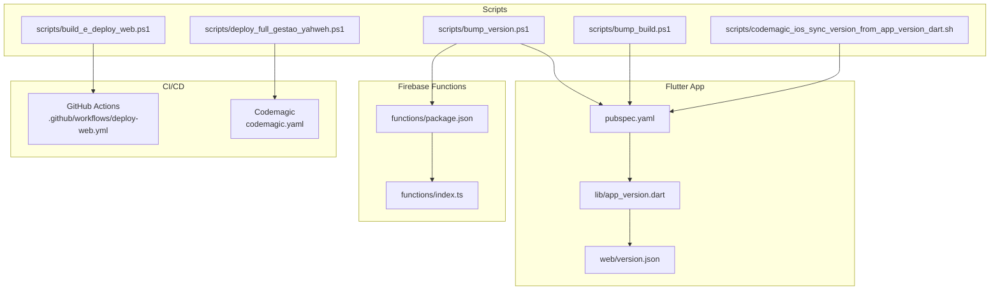
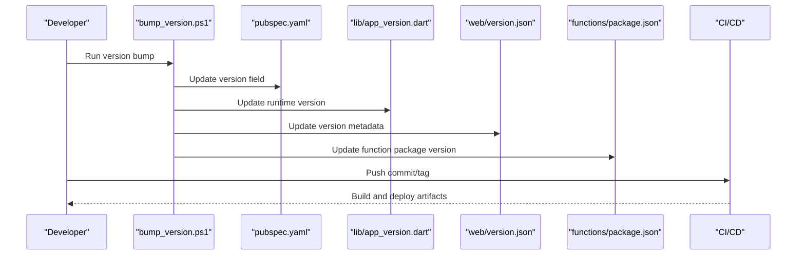
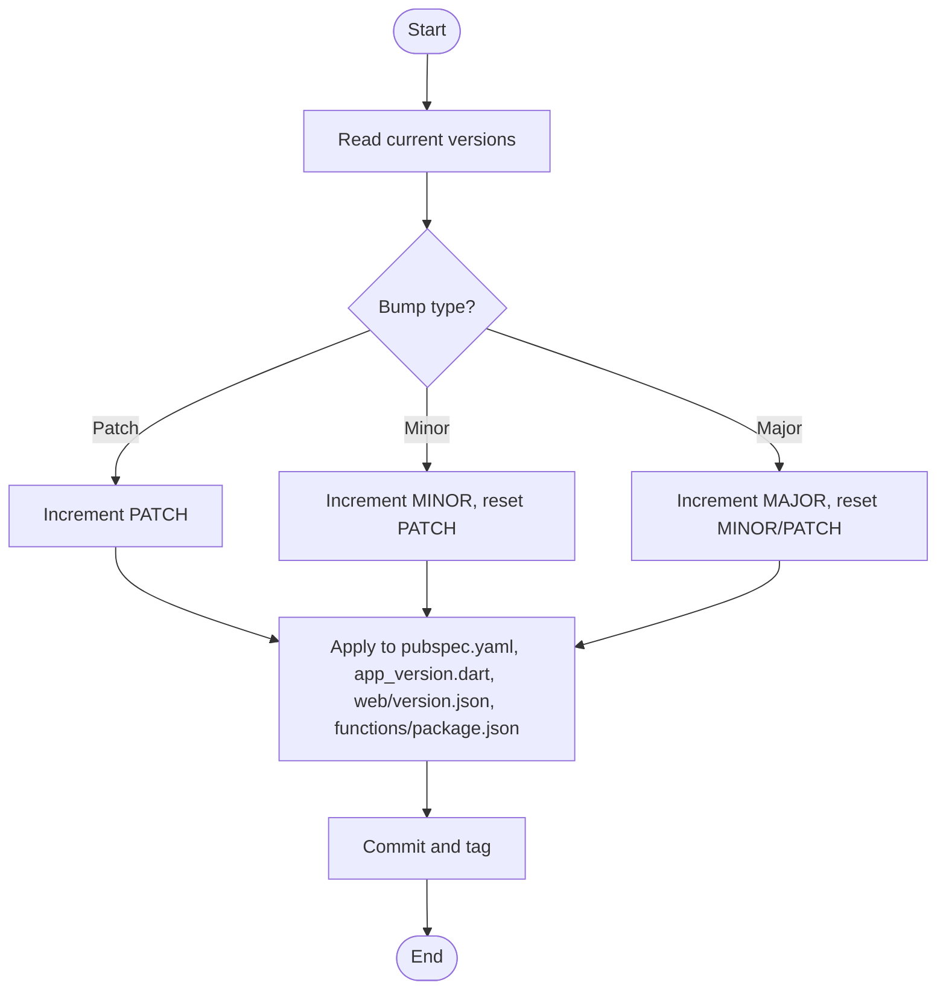
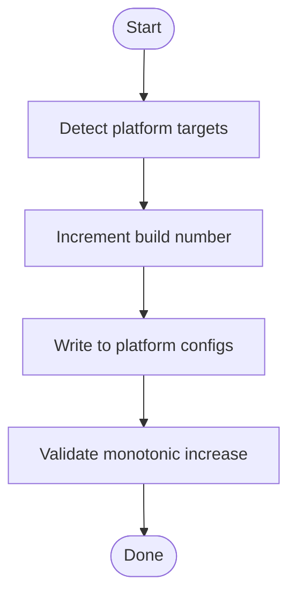
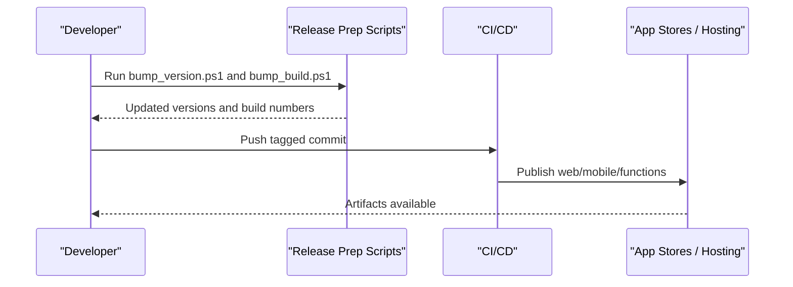
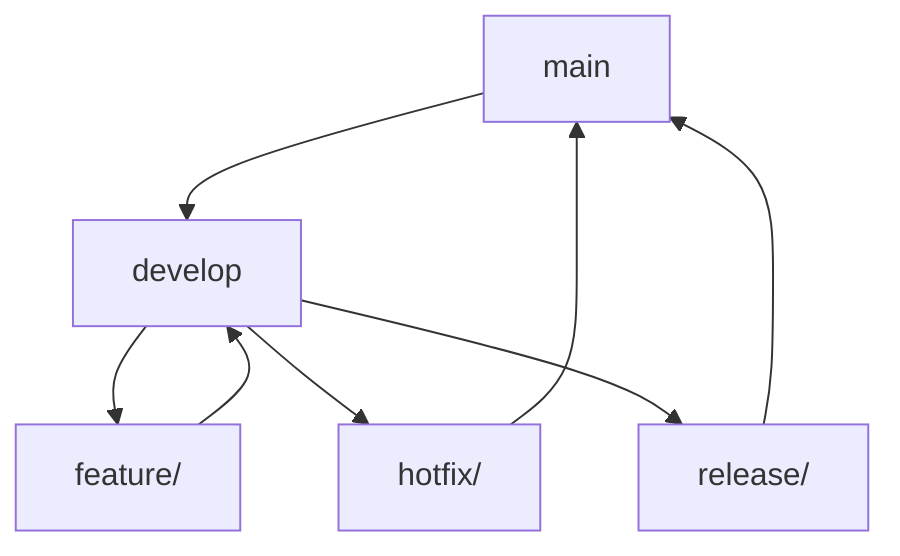
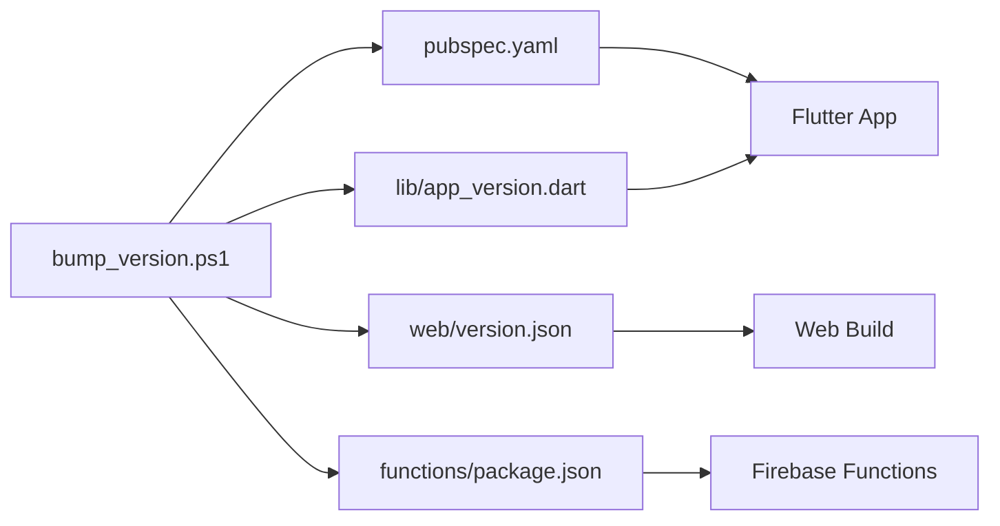

# Version Control & Branching

<cite>
**Referenced Files in This Document**
- [CONTROLE_VERSAO.md](file://CONTROLE_VERSAO.md)
- [pubspec.yaml](file://flutter_app/pubspec.yaml)
- [app_version.dart](file://flutter_app/lib/app_version.dart)
- [version.json](file://flutter_app/web/version.json)
- [firebase.json](file://firebase.json)
- [functions/package.json](file://functions/package.json)
- [functions/index.ts](file://functions/index.ts)
- [scripts/bump_version.ps1](file://scripts/bump_version.ps1)
- [scripts/bump_build.ps1](file://scripts/bump_build.ps1)
- [scripts/build_e_deploy_web.ps1](file://scripts/build_e_deploy_web.ps1)
- [scripts/deploy_full_gestao_yahweh.ps1](file://scripts/deploy_full_gestao_yahweh.ps1)
- [scripts/codemagic_ios_sync_version_from_app_version_dart.sh](file://scripts/codemagic_ios_sync_version_from_app_version_dart.sh)
- [codemagic.yaml](file://codemagic.yaml)
- [.github/workflows/deploy-web.yml](file://.github/workflows/deploy-web.yml)
</cite>

## Table of Contents
1. [Introduction](#introduction)
2. [Project Structure](#project-structure)
3. [Core Components](#core-components)
4. [Architecture Overview](#architecture-overview)
5. [Detailed Component Analysis](#detailed-component-analysis)
6. [Dependency Analysis](#dependency-analysis)
7. [Performance Considerations](#performance-considerations)
8. [Troubleshooting Guide](#troubleshooting-guide)
9. [Conclusion](#conclusion)
10. [Appendices](#appendices)

## Introduction
This document defines the version control and branching strategy for the project, covering semantic versioning across the Flutter app, Firebase Functions, and associated assets. It explains how to manage build numbers, environment-specific configuration, release preparation workflows, and multi-platform consistency (Android, iOS, Web, Desktop). It also provides guidelines for feature branches, hotfix branches, release tags, merge strategies, and conflict resolution.

## Project Structure
The repository is a multi-platform Flutter application with:
- A Flutter app under flutter_app/
- Firebase Functions under functions/
- CI/CD via GitHub Actions and Codemagic
- Automation scripts under scripts/

**Diagram sources**
- [pubspec.yaml](file://flutter_app/pubspec.yaml)
- [app_version.dart](file://flutter_app/lib/app_version.dart)
- [version.json](file://flutter_app/web/version.json)
- [functions/package.json](file://functions/package.json)
- [functions/index.ts](file://functions/index.ts)
- [.github/workflows/deploy-web.yml](file://.github/workflows/deploy-web.yml)
- [codemagic.yaml](file://codemagic.yaml)
- [scripts/bump_version.ps1](file://scripts/bump_version.ps1)
- [scripts/bump_build.ps1](file://scripts/bump_build.ps1)
- [scripts/build_e_deploy_web.ps1](file://scripts/build_e_deploy_web.ps1)
- [scripts/deploy_full_gestao_yahweh.ps1](file://scripts/deploy_full_gestao_yahweh.ps1)
- [scripts/codemagic_ios_sync_version_from_app_version_dart.sh](file://scripts/codemagic_ios_sync_version_from_app_version_dart.sh)

**Section sources**
- [CONTROLE_VERSAO.md](file://CONTROLE_VERSAO.md)

## Core Components
- Semantic versioning source of truth:
  - Flutter app version defined in pubspec.yaml
  - Runtime version exposed by lib/app_version.dart
  - Web version metadata in web/version.json
- Firebase Functions versioning via package.json and deployment index
- Automation scripts:
  - bump_version.ps1: updates semantic versions across components
  - bump_build.ps1: increments build numbers per platform
  - build_e_deploy_web.ps1: builds and deploys web artifacts
  - deploy_full_gestao_yahweh.ps1: orchestrates full releases
  - codemagic_ios_sync_version_from_app_version_dart.sh: aligns iOS build with Dart version
- CI/CD pipelines:
  - GitHub Actions workflow for web deployment
  - Codemagic configuration for mobile builds and publishing

**Section sources**
- [pubspec.yaml](file://flutter_app/pubspec.yaml)
- [app_version.dart](file://flutter_app/lib/app_version.dart)
- [version.json](file://flutter_app/web/version.json)
- [functions/package.json](file://functions/package.json)
- [functions/index.ts](file://functions/index.ts)
- [scripts/bump_version.ps1](file://scripts/bump_version.ps1)
- [scripts/bump_build.ps1](file://scripts/bump_build.ps1)
- [scripts/build_e_deploy_web.ps1](file://scripts/build_e_deploy_web.ps1)
- [scripts/deploy_full_gestao_yahweh.ps1](file://scripts/deploy_full_gestao_yahweh.ps1)
- [scripts/codemagic_ios_sync_version_from_app_version_dart.sh](file://scripts/codemagic_ios_sync_version_from_app_version_dart.sh)
- [.github/workflows/deploy-web.yml](file://.github/workflows/deploy-web.yml)
- [codemagic.yaml](file://codemagic.yaml)

## Architecture Overview
Versioning flows from a single source of truth into platform-specific artifacts and deployments.

**Diagram sources**
- [scripts/bump_version.ps1](file://scripts/bump_version.ps1)
- [pubspec.yaml](file://flutter_app/pubspec.yaml)
- [app_version.dart](file://flutter_app/lib/app_version.dart)
- [version.json](file://flutter_app/web/version.json)
- [functions/package.json](file://functions/package.json)
- [.github/workflows/deploy-web.yml](file://.github/workflows/deploy-web.yml)
- [codemagic.yaml](file://codemagic.yaml)

## Detailed Component Analysis

### Semantic Versioning Strategy
- Use SemVer MAJOR.MINOR.PATCH for all components:
  - Flutter app: pubspec.yaml version
  - Firebase Functions: package.json version
  - Web: web/version.json version metadata
- Maintain consistency between Dart runtime version and platform build metadata
- Tag releases with git tags matching the SemVer string

**Section sources**
- [pubspec.yaml](file://flutter_app/pubspec.yaml)
- [functions/package.json](file://functions/package.json)
- [version.json](file://flutter_app/web/version.json)

### Bump Version Workflow
- Primary script: scripts/bump_version.ps1
  - Updates pubspec.yaml version
  - Updates lib/app_version.dart runtime version
  - Updates web/version.json metadata
  - Updates functions/package.json version
- After bumping, commit changes and push to trigger CI/CD

**Diagram sources**
- [scripts/bump_version.ps1](file://scripts/bump_version.ps1)
- [pubspec.yaml](file://flutter_app/pubspec.yaml)
- [app_version.dart](file://flutter_app/lib/app_version.dart)
- [version.json](file://flutter_app/web/version.json)
- [functions/package.json](file://functions/package.json)

**Section sources**
- [scripts/bump_version.ps1](file://scripts/bump_version.ps1)

### Build Number Management
- Increment build numbers per platform using scripts/bump_build.ps1
- Ensure Android and iOS build numbers are monotonically increasing
- Align build numbers with semantic version tags for traceability

**Diagram sources**
- [scripts/bump_build.ps1](file://scripts/bump_build.ps1)

**Section sources**
- [scripts/bump_build.ps1](file://scripts/bump_build.ps1)

### Environment-Specific Configuration
- Use firebase.json for Firebase hosting and functions configuration
- Separate environments via environment variables and CI/CD secrets
- Keep sensitive configuration out of version control; inject at build time

**Section sources**
- [firebase.json](file://firebase.json)

### Release Preparation Workflow
- Prepare release:
  - Run bump_version.ps1 to set SemVer
  - Run bump_build.ps1 to increment build numbers
  - Verify tests and static analysis pass
  - Commit and tag release
- Deploy:
  - Web: scripts/build_e_deploy_web.ps1 or GitHub Actions workflow
  - Mobile: Codemagic pipeline orchestrated by scripts/deploy_full_gestao_yahweh.ps1
  - Functions: deploy via Firebase CLI or CI/CD

**Diagram sources**
- [scripts/bump_version.ps1](file://scripts/bump_version.ps1)
- [scripts/bump_build.ps1](file://scripts/bump_build.ps1)
- [scripts/build_e_deploy_web.ps1](file://scripts/build_e_deploy_web.ps1)
- [scripts/deploy_full_gestao_yahweh.ps1](file://scripts/deploy_full_gestao_yahweh.ps1)
- [.github/workflows/deploy-web.yml](file://.github/workflows/deploy-web.yml)
- [codemagic.yaml](file://codemagic.yaml)

**Section sources**
- [scripts/build_e_deploy_web.ps1](file://scripts/build_e_deploy_web.ps1)
- [scripts/deploy_full_gestao_yahweh.ps1](file://scripts/deploy_full_gestao_yahweh.ps1)
- [.github/workflows/deploy-web.yml](file://.github/workflows/deploy-web.yml)
- [codemagic.yaml](file://codemagic.yaml)

### iOS Version Synchronization
- Use scripts/codemagic_ios_sync_version_from_app_version_dart.sh to align iOS build with Dart version
- Ensures consistent version strings across platforms during Codemagic builds

**Section sources**
- [scripts/codemagic_ios_sync_version_from_app_version_dart.sh](file://scripts/codemagic_ios_sync_version_from_app_version_dart.sh)

### Branching Strategy
- main branch: stable releases, tagged with SemVer
- develop branch: integration of features and fixes
- Feature branches: feature/<name> for new functionality
- Hotfix branches: hotfix/<name> for urgent production fixes
- Release branches: release/<version> for finalizing release candidates

[No sources needed since this diagram shows conceptual workflow, not actual code structure]

### Merge Strategies and Conflict Resolution
- Prefer squash merges for feature branches to keep history clean
- Use rebase for linear history on develop before merging to main
- Resolve conflicts early and frequently; run automated checks before merging
- For hotfixes, merge directly to main and backport to develop

[No sources needed since this section provides general guidance]

### Multi-Platform Consistency Guidelines
- Ensure version fields are synchronized across:
  - Flutter app (pubspec.yaml, app_version.dart, web/version.json)
  - Firebase Functions (package.json)
  - Platform-specific build numbers (Android, iOS)
- Use automation scripts to avoid manual drift
- Validate versions in CI/CD pipelines

**Section sources**
- [pubspec.yaml](file://flutter_app/pubspec.yaml)
- [app_version.dart](file://flutter_app/lib/app_version.dart)
- [version.json](file://flutter_app/web/version.json)
- [functions/package.json](file://functions/package.json)

## Dependency Analysis
Versioning dependencies across components ensure coherent releases.

**Diagram sources**
- [pubspec.yaml](file://flutter_app/pubspec.yaml)
- [app_version.dart](file://flutter_app/lib/app_version.dart)
- [version.json](file://flutter_app/web/version.json)
- [functions/package.json](file://functions/package.json)
- [scripts/bump_version.ps1](file://scripts/bump_version.ps1)

**Section sources**
- [scripts/bump_version.ps1](file://scripts/bump_version.ps1)

## Performance Considerations
- Avoid frequent large commits that include generated artifacts
- Keep version bumps atomic and minimal
- Use CI caching to speed up builds after version updates
- Validate version consistency pre-deployment to reduce rollback risks

[No sources needed since this section provides general guidance]

## Troubleshooting Guide
- Version mismatch errors:
  - Ensure pubspec.yaml, app_version.dart, web/version.json, and functions/package.json are aligned
  - Re-run bump_version.ps1 if discrepancies are detected
- Build number issues:
  - Confirm monotonic increase for Android/iOS build numbers
  - Use bump_build.ps1 to correct non-increasing sequences
- Deployment failures:
  - Check CI logs for version validation steps
  - Verify environment variables and secrets are correctly injected

**Section sources**
- [scripts/bump_version.ps1](file://scripts/bump_version.ps1)
- [scripts/bump_build.ps1](file://scripts/bump_build.ps1)

## Conclusion
Adopting a disciplined version control and branching strategy ensures reliable releases across Flutter, Firebase Functions, and multiple platforms. Centralized version management through automation scripts and CI/CD pipelines reduces human error and maintains consistency. Follow the outlined workflows for feature development, hotfixes, and releases to keep the project stable and scalable.

[No sources needed since this section summarizes without analyzing specific files]

## Appendices
- Quick reference commands:
  - Bump version: scripts/bump_version.ps1
  - Increment build: scripts/bump_build.ps1
  - Deploy web: scripts/build_e_deploy_web.ps1
  - Full release: scripts/deploy_full_gestao_yahweh.ps1
- Tagging convention: vMAJOR.MINOR.PATCH

[No sources needed since this section provides general guidance]