# Cross-Platform Desktop Architecture

<cite>
**Referenced Files in This Document**
- [main.dart](file://flutter_app/lib/main.dart)
- [pubspec.yaml](file://flutter_app/pubspec.yaml)
- [window_close_handler_io.dart](file://flutter_app/lib/window_close_handler_io.dart)
- [window_close_handler_stub.dart](file://flutter_app/lib/window_close_handler_stub.dart)
- [url_strategy.dart](file://flutter_app/lib/url_strategy.dart)
- [url_strategy_stub.dart](file://flutter_app/lib/url_strategy_stub.dart)
- [url_strategy_web.dart](file://flutter_app/lib/url_strategy_web.dart)
- [web_resume_repaint_stub.dart](file://flutter_app/lib/web_resume_repaint_stub.dart)
- [web_resume_repaint_web.dart](file://flutter_app/lib/web_resume_repaint_web.dart)
- [my_application.h](file://flutter_app/linux/runner/my_application.h)
- [my_application.cc](file://flutter_app/linux/runner/my_application.cc)
- [MainFlutterWindow.swift](file://flutter_app/macos/Runner/MainFlutterWindow.swift)
- [win32_window.h](file://flutter_app/windows/runner/win32_window.h)
- [win32_window.cpp](file://flutter_app/windows/runner/win32_window.cpp)
- [flutter_window.h](file://flutter_app/windows/runner/flutter_window.h)
- [flutter_window.cpp](file://flutter_app/windows/runner/flutter_window.cpp)
</cite>

## Table of Contents
1. [Introduction](#introduction)
2. [Project Structure](#project-structure)
3. [Core Components](#core-components)
4. [Architecture Overview](#architecture-overview)
5. [Detailed Component Analysis](#detailed-component-analysis)
6. [Dependency Analysis](#dependency-analysis)
7. [Performance Considerations](#performance-considerations)
8. [Troubleshooting Guide](#troubleshooting-guide)
9. [Conclusion](#conclusion)

## Introduction

Gestão Yahweh Premium implements a sophisticated cross-platform desktop architecture using Flutter's native desktop support. The application targets Windows, macOS, and Linux platforms while maintaining a single codebase through strategic abstraction layers and platform-specific implementations. This architecture enables seamless deployment across desktop environments while leveraging native capabilities where necessary.

The desktop implementation follows Flutter's established patterns for window management, platform detection, and conditional compilation to ensure optimal user experience across all supported operating systems.

## Project Structure

The Flutter application maintains a well-organized structure that separates shared business logic from platform-specific implementations:

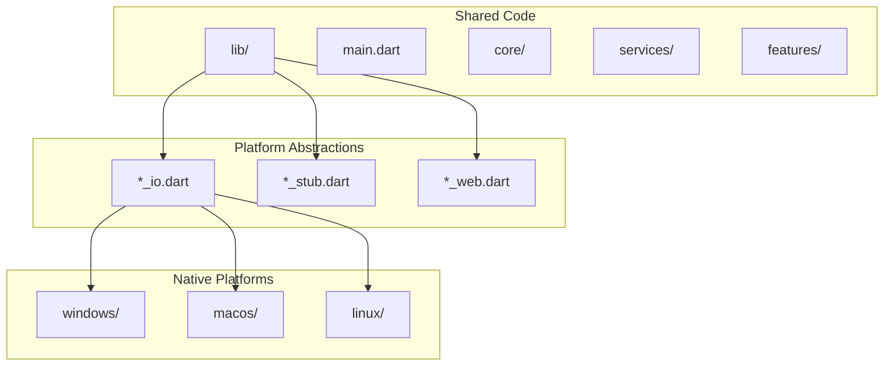

**Diagram sources**
- [main.dart](file://flutter_app/lib/main.dart)
- [pubspec.yaml](file://flutter_app/pubspec.yaml)

**Section sources**
- [main.dart](file://flutter_app/lib/main.dart)
- [pubspec.yaml](file://flutter_app/pubspec.yaml)

## Core Components

### Window Management System

The application implements a robust window management system that handles platform-specific window behaviors through abstracted interfaces. The window close handler demonstrates the pattern used throughout the application for platform-specific functionality.

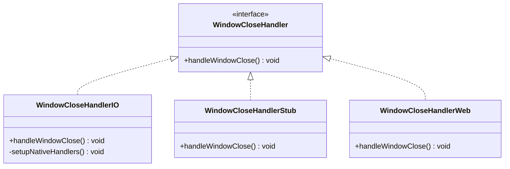

**Diagram sources**
- [window_close_handler_io.dart](file://flutter_app/lib/window_close_handler_io.dart)
- [window_close_handler_stub.dart](file://flutter_app/lib/window_close_handler_stub.dart)

### Platform Detection and Conditional Compilation

The application uses Flutter's built-in platform detection mechanisms combined with conditional compilation directives to handle platform-specific requirements:

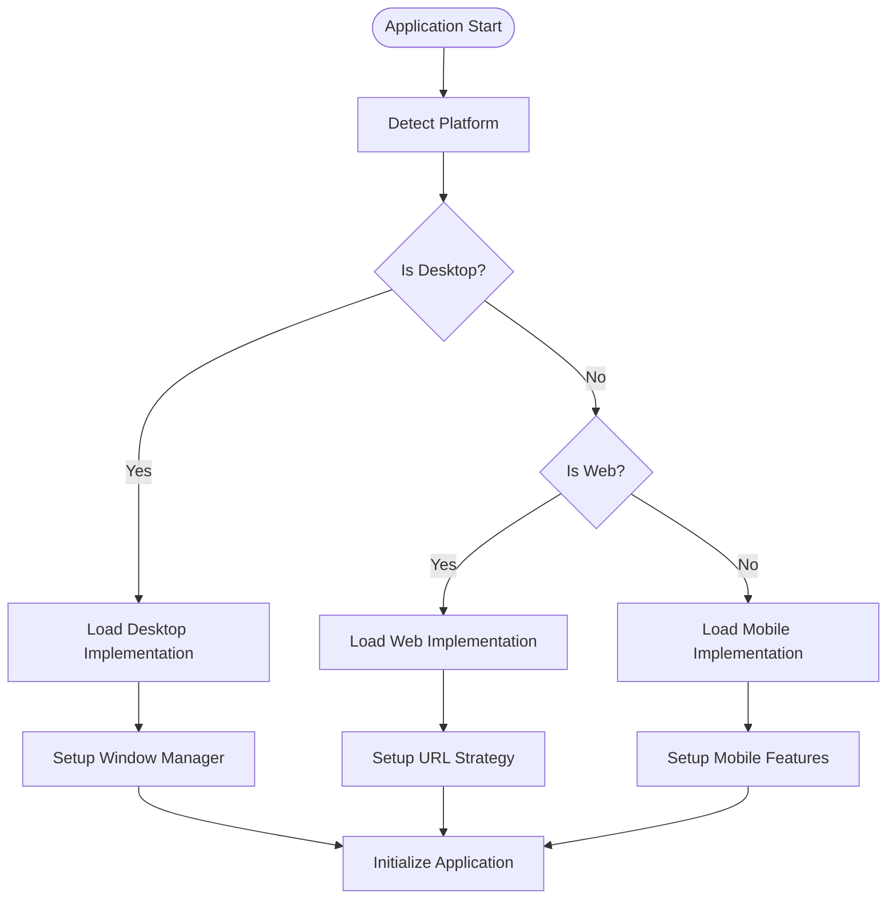

**Diagram sources**
- [url_strategy.dart](file://flutter_app/lib/url_strategy.dart)
- [url_strategy_stub.dart](file://flutter_app/lib/url_strategy_stub.dart)
- [url_strategy_web.dart](file://flutter_app/lib/url_strategy_web.dart)

**Section sources**
- [window_close_handler_io.dart](file://flutter_app/lib/window_close_handler_io.dart)
- [window_close_handler_stub.dart](file://flutter_app/lib/window_close_handler_stub.dart)
- [url_strategy.dart](file://flutter_app/lib/url_strategy.dart)
- [url_strategy_stub.dart](file://flutter_app/lib/url_strategy_stub.dart)
- [url_strategy_web.dart](file://flutter_app/lib/url_strategy_web.dart)

## Architecture Overview

The desktop architecture follows a layered approach with clear separation between shared business logic and platform-specific implementations:

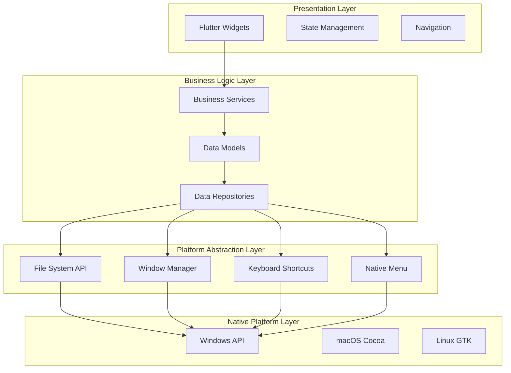

**Diagram sources**
- [main.dart](file://flutter_app/lib/main.dart)
- [pubspec.yaml](file://flutter_app/pubspec.yaml)

## Detailed Component Analysis

### Window Lifecycle Management

The window lifecycle management system handles critical desktop-specific operations such as window creation, configuration, and cleanup:

#### Windows Implementation
The Windows implementation leverages the Win32 API through Flutter's window management layer:

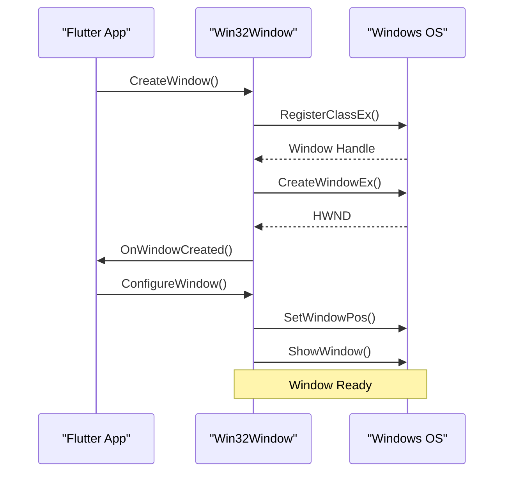

**Diagram sources**
- [win32_window.h](file://flutter_app/windows/runner/win32_window.h)
- [win32_window.cpp](file://flutter_app/windows/runner/win32_window.cpp)
- [flutter_window.h](file://flutter_app/windows/runner/flutter_window.h)
- [flutter_window.cpp](file://flutter_app/windows/runner/flutter_window.cpp)

#### macOS Implementation
The macOS implementation uses Cocoa frameworks for native window management:

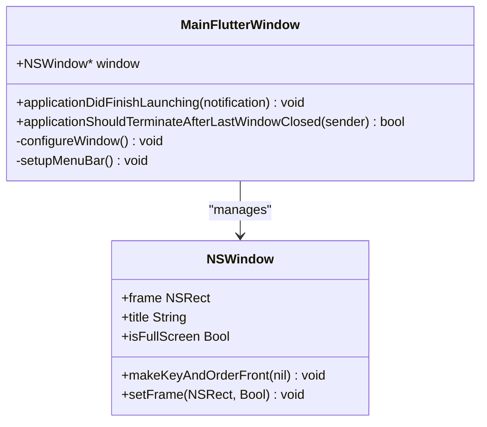

**Diagram sources**
- [MainFlutterWindow.swift](file://flutter_app/macos/Runner/MainFlutterWindow.swift)

#### Linux Implementation
The Linux implementation integrates with GTK for window management:

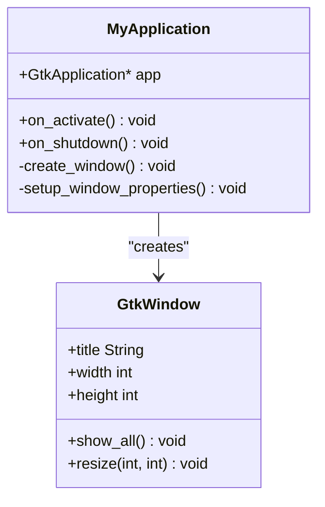

**Diagram sources**
- [my_application.h](file://flutter_app/linux/runner/my_application.h)
- [my_application.cc](file://flutter_app/linux/runner/my_application.cc)

### File System Access

The file system access implementation provides cross-platform file operations through Flutter's platform channel mechanism:

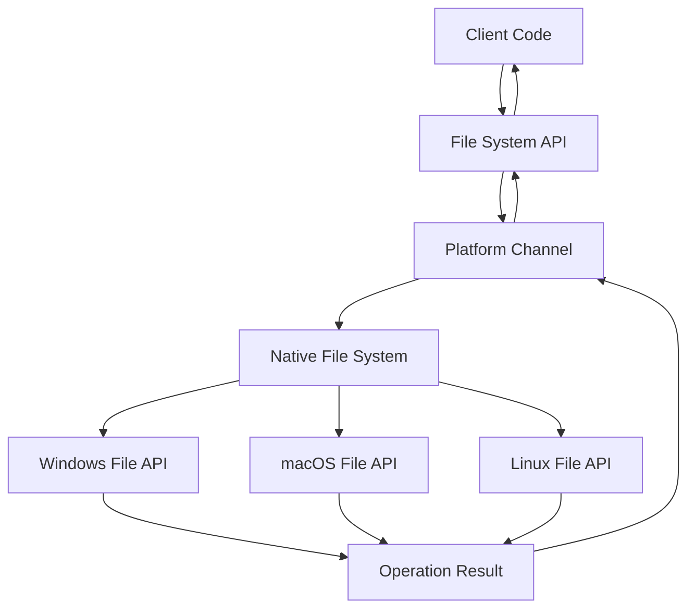

### Keyboard Shortcuts and Native Menu Systems

The keyboard shortcuts and native menu systems are implemented through platform-specific abstractions that provide consistent behavior across all desktop platforms:

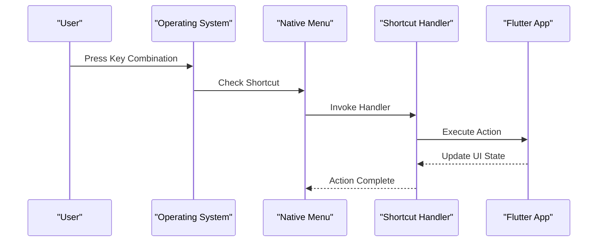

**Section sources**
- [win32_window.h](file://flutter_app/windows/runner/win32_window.h)
- [win32_window.cpp](file://flutter_app/windows/runner/win32_window.cpp)
- [MainFlutterWindow.swift](file://flutter_app/macos/Runner/MainFlutterWindow.swift)
- [my_application.h](file://flutter_app/linux/runner/my_application.h)
- [my_application.cc](file://flutter_app/linux/runner/my_application.cc)

### Platform Detection and Feature Flags

The application implements sophisticated platform detection and feature flagging to enable or disable features based on platform capabilities:

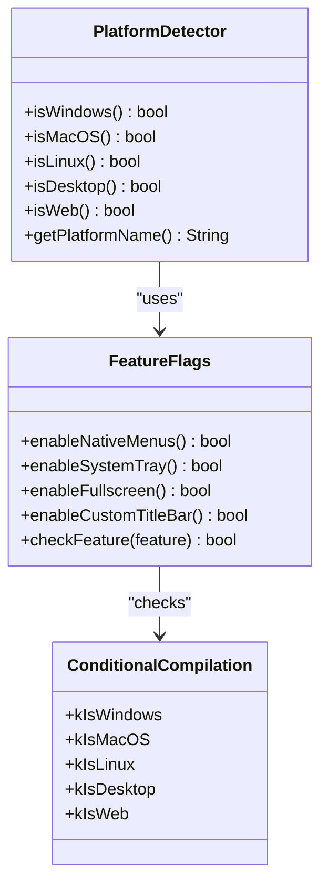

**Section sources**
- [url_strategy.dart](file://flutter_app/lib/url_strategy.dart)
- [url_strategy_stub.dart](file://flutter_app/lib/url_strategy_stub.dart)
- [url_strategy_web.dart](file://flutter_app/lib/url_strategy_web.dart)
- [web_resume_repaint_stub.dart](file://flutter_app/lib/web_resume_repaint_stub.dart)
- [web_resume_repaint_web.dart](file://flutter_app/lib/web_resume_repaint_web.dart)

## Dependency Analysis

The desktop architecture maintains clear dependency boundaries and minimizes coupling between platform-specific implementations:

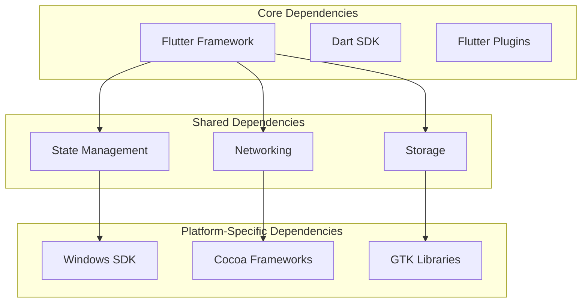

**Diagram sources**
- [pubspec.yaml](file://flutter_app/pubspec.yaml)

**Section sources**
- [pubspec.yaml](file://flutter_app/pubspec.yaml)

## Performance Considerations

The desktop implementation addresses several key performance considerations:

### Memory Management
- Efficient window resource cleanup on close
- Proper disposal of native resources
- Memory-efficient image handling for desktop resolutions

### Rendering Optimization
- Hardware acceleration enabled by default
- Optimized widget trees for desktop layouts
- Efficient state updates for large datasets

### Startup Performance
- Lazy loading of platform-specific features
- Minimal initialization overhead
- Progressive feature loading

### Resource Usage
- Background process optimization
- Efficient file system operations
- Network request batching

## Troubleshooting Guide

### Common Desktop Issues

#### Window Management Problems
- **Issue**: Window not closing properly
  - **Solution**: Ensure proper cleanup in window close handlers
  - **Check**: Verify native resource disposal

#### Platform Detection Failures
- **Issue**: Incorrect platform detection
  - **Solution**: Use Flutter's built-in platform checks
  - **Check**: Verify conditional compilation flags

#### File System Access Errors
- **Issue**: Permission denied errors
  - **Solution**: Implement proper permission handling
  - **Check**: Verify file path formatting per platform

#### Performance Issues
- **Issue**: Slow startup time
  - **Solution**: Implement lazy loading
  - **Check**: Profile native method calls

### Debugging Strategies

#### Platform-Specific Debugging
- Use platform-specific debuggers (Visual Studio for Windows, Xcode for macOS, GDB for Linux)
- Enable verbose logging for platform channels
- Monitor memory usage with platform profilers

#### Common Error Patterns
- Null reference exceptions in platform channels
- Threading issues with native callbacks
- Memory leaks in native resource management

**Section sources**
- [window_close_handler_io.dart](file://flutter_app/lib/window_close_handler_io.dart)
- [window_close_handler_stub.dart](file://flutter_app/lib/window_close_handler_stub.dart)

## Conclusion

Gestão Yahweh Premium's cross-platform desktop architecture demonstrates best practices for Flutter desktop development. The implementation successfully balances code sharing with platform-specific optimizations, providing a consistent user experience across Windows, macOS, and Linux while leveraging native capabilities where appropriate.

The architecture's modular design, comprehensive platform abstractions, and careful attention to performance considerations make it an excellent foundation for enterprise desktop applications. The patterns established here can serve as a template for other Flutter desktop projects requiring similar cross-platform capabilities.

Key strengths of this implementation include:
- Clean separation of concerns between shared and platform-specific code
- Comprehensive window lifecycle management
- Robust platform detection and feature flagging
- Performance-conscious design decisions
- Maintainable architecture that scales with application complexity